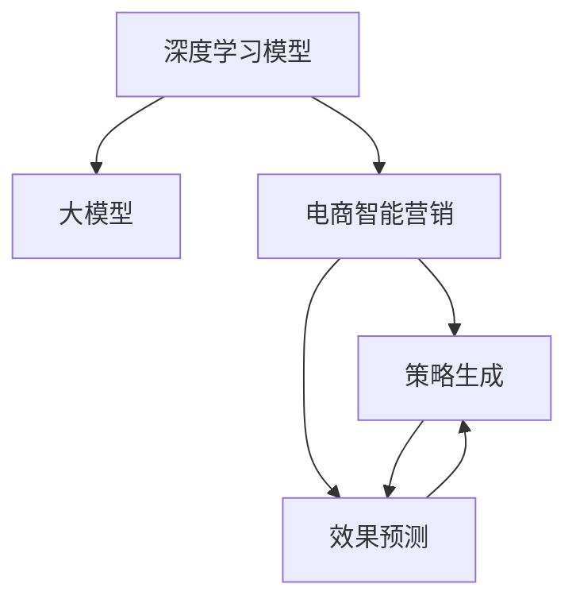

                 

# 探索基于大模型的电商智能营销策略生成与效果预测系统

> 关键词：大模型,电商智能营销,策略生成,效果预测,深度学习

## 1. 背景介绍

### 1.1 问题由来

近年来，电子商务已成为了消费者购物的主要方式，各大电商平台之间的竞争日益激烈。为了在竞争中脱颖而出，电商平台纷纷投资于智能营销技术，提升用户购物体验，增加转化率和回购率。传统的营销策略依赖人工经验和业务直觉，耗时耗力，难以全面覆盖用户需求。而基于深度学习的智能营销系统，能够自动分析和优化营销策略，具备强大的数据分析和预测能力，快速生成个性化推荐，优化广告投放，大幅提高营销效果。

基于深度学习的智能营销系统主要包含两部分：智能策略生成和效果预测。智能策略生成负责根据用户行为数据生成个性化推荐或广告文案，而效果预测则用于评估这些策略的效果，并反馈优化，形成闭环。传统的基于规则或逻辑推理的策略生成方法无法有效捕捉复杂多变的用户需求和行为模式，而深度学习模型通过大数据训练，具备高度的灵活性和泛化能力，可以自动发现用户行为中的深层次特征和模式，生成更加精准、有效的策略。

### 1.2 问题核心关键点

智能营销策略生成与效果预测的核心在于如何将用户的底层行为数据转化为具体的策略或推荐，并对这些策略的效果进行评估。具体而言，该问题的关键点如下：

- 用户行为数据的自动化处理和特征提取：如何高效地从原始数据中提取关键特征，并转化为模型的输入。
- 深度学习模型的设计和训练：如何构建合适的深度学习模型，并在用户数据上训练模型，实现策略生成和效果预测。
- 模型的解释性和鲁棒性：如何在保证模型预测精准性的同时，具备良好的可解释性，并具有一定的鲁棒性，防止过拟合和偏见。
- 持续学习和动态优化：如何实时地根据用户反馈和市场变化动态更新策略，提升模型的性能和效果。

### 1.3 问题研究意义

探索基于大模型的电商智能营销策略生成与效果预测系统，对于提升电商平台的运营效率、改善用户体验、增加销售额具有重要意义：

- 提升运营效率：自动化智能营销系统能够快速响应市场变化，优化广告投放和推荐，提高转化率和回购率。
- 改善用户体验：个性化推荐和广告能够更好地匹配用户需求，提升购物体验，增加用户黏性。
- 增加销售额：通过精准的策略和广告投放，大幅提升用户转化和订单量，增加平台的营收。
- 加速技术迭代：通过数据分析和模型优化，持续提升策略生成和效果预测的准确性，推动技术进步。
- 拓展应用场景：基于深度学习的智能营销系统具备较强的泛化能力，可以应用于零售、旅游、教育等多个行业，推动各行业的数字化转型升级。

## 2. 核心概念与联系

### 2.1 核心概念概述

为更好地理解基于大模型的电商智能营销策略生成与效果预测系统，本节将介绍几个密切相关的核心概念：

- 深度学习模型（Deep Learning Models）：指一类基于多层神经网络结构的机器学习模型，能够自动提取高层次的特征表示，广泛应用于图像、语音、自然语言处理等领域。
- 大模型（Large Models）：指具有亿级参数量级的深度学习模型，如BERT、GPT等，具备强大的语言理解和生成能力。
- 电商智能营销（E-commerce Intelligent Marketing）：指利用深度学习技术，自动分析和优化电商平台的营销策略，提升转化率和用户满意度。
- 策略生成（Strategy Generation）：指根据用户行为数据，自动生成个性化推荐或广告文案的过程。
- 效果预测（Effect Prediction）：指评估策略的效果，预测策略在实际投放中的表现，并根据效果反馈进行优化。

这些核心概念之间的逻辑关系可以通过以下Mermaid流程图来展示：



这个流程图展示了大模型的电商智能营销系统的核心概念及其之间的关系：

1. 深度学习模型是电商智能营销的基础，提供数据处理的自动化和特征提取能力。
2. 大模型作为深度学习模型的参数初始化，具有强大的泛化能力和语言理解能力。
3. 电商智能营销系统应用大模型，实现策略生成和效果预测。
4. 策略生成过程根据效果预测反馈，进行优化和调整。
5. 效果预测则根据策略生成的效果，进一步优化策略。

这些概念共同构成了基于大模型的电商智能营销系统的基本框架，使其能够在电商领域实现高效的智能营销。通过理解这些核心概念，我们可以更好地把握系统的设计思路和优化方向。

## 3. 核心算法原理 & 具体操作步骤
### 3.1 算法原理概述

基于大模型的电商智能营销策略生成与效果预测系统，本质上是利用大模型对用户行为数据进行处理，自动生成个性化推荐或广告文案，并评估其效果。该系统主要由两个部分组成：

- 策略生成：利用大模型对用户行为数据进行处理，自动生成个性化推荐或广告文案。
- 效果预测：通过大模型评估策略的效果，预测其在实际投放中的表现。

在策略生成阶段，首先收集用户的行为数据，包括浏览记录、购买记录、评价记录等。然后对这些数据进行预处理，如缺失值填补、特征编码、降维等，得到输入特征。接下来，将这些特征作为大模型的输入，利用模型进行预测，生成推荐或广告文案。在效果预测阶段，通过将策略生成结果与实际效果数据进行对比，评估策略的效果，并反馈优化。

### 3.2 算法步骤详解

基于大模型的电商智能营销策略生成与效果预测系统的具体算法步骤如下：

**Step 1: 准备数据集**

- 收集电商平台的原始用户行为数据，包括浏览记录、购买记录、评价记录等。
- 数据预处理：填充缺失值、特征编码、降维等。
- 数据划分：将数据划分为训练集、验证集和测试集。

**Step 2: 构建大模型**

- 选择合适的深度学习框架和预训练模型，如TensorFlow、PyTorch、BERT等。
- 构建大模型结构：如Transformer、RNN、CNN等，设计合适的输出层和损失函数。
- 加载预训练模型，并进行微调。

**Step 3: 策略生成**

- 将用户行为数据作为模型的输入特征，进行前向传播。
- 利用模型的输出，生成个性化推荐或广告文案。

**Step 4: 效果预测**

- 将策略生成的推荐或广告文案与实际效果数据进行对比，如点击率、转化率等。
- 利用模型进行效果预测，评估策略的表现。
- 根据效果预测结果，调整推荐或广告文案，进行优化。

**Step 5: 持续优化**

- 在实际投放过程中，实时收集效果数据，并不断反馈优化策略生成模型。
- 动态调整模型的参数和超参数，提升策略生成的效果。

### 3.3 算法优缺点

基于大模型的电商智能营销策略生成与效果预测系统具有以下优点：

1. 自动化：利用深度学习模型，自动处理和分析用户行为数据，减少人工干预。
2. 精准性：深度学习模型具备强大的泛化能力，可以自动发现用户行为的深层次特征和模式，生成更加精准的推荐或广告。
3. 实时性：通过实时收集和处理用户行为数据，可以动态调整策略，快速响应市场变化。
4. 可解释性：深度学习模型虽然复杂，但可以通过解释性技术（如注意力机制、梯度图）进行可视化，增强可解释性。
5. 可扩展性：电商智能营销系统可以应用于多个电商平台和业务场景，具有较强的泛化能力。

同时，该算法也存在以下局限性：

1. 数据依赖：深度学习模型需要大量的高质量标注数据进行训练，数据获取成本较高。
2. 模型复杂：深度学习模型的训练和推理过程较为复杂，需要较高的算力和内存。
3. 鲁棒性不足：深度学习模型容易过拟合，对噪声数据和异常情况较为敏感。
4. 安全性问题：深度学习模型可能学习到有害信息，对用户隐私和平台安全造成威胁。
5. 高成本：深度学习模型的训练和部署成本较高，需要较高的硬件配置和专业知识。

尽管存在这些局限性，但深度学习模型在电商智能营销中的应用已经显现出了巨大的潜力，成为电商技术发展的关键方向。

### 3.4 算法应用领域

基于大模型的电商智能营销策略生成与效果预测系统已经在电商行业得到广泛应用，主要应用于以下几个方面：

- 个性化推荐：根据用户历史行为数据，自动生成个性化推荐，提高用户满意度。
- 广告投放优化：自动生成广告文案，优化广告投放策略，提升广告点击率和转化率。
- 用户行为分析：利用用户行为数据，分析用户兴趣和行为模式，指导产品推荐和营销活动。
- 销售预测：通过分析历史销售数据和用户行为数据，预测未来的销售趋势，指导库存管理和促销策略。
- 实时监控：实时监测广告和推荐的效果，快速调整策略，优化用户购物体验。

除了上述这些应用外，电商智能营销系统还在用户行为预测、价格优化、库存管理等方面发挥着重要作用，推动了电商行业的数字化转型升级。

## 4. 数学模型和公式 & 详细讲解  
### 4.1 数学模型构建

在本节中，我们将使用数学语言对基于大模型的电商智能营销策略生成与效果预测系统的数学模型进行详细讲解。

假设用户行为数据集为 $D=\{(x_i,y_i)\}_{i=1}^N$，其中 $x_i$ 为用户的特征向量，$y_i$ 为用户的实际行为，如点击、购买等。在电商智能营销系统中，我们利用深度学习模型 $M_{\theta}$ 对用户行为数据进行处理，生成策略 $\hat{y}$，其中 $\theta$ 为模型参数。模型的输出 $\hat{y}$ 与实际行为 $y_i$ 之间的差异可以通过损失函数 $\ell$ 进行度量，目标是最小化损失函数：

$$
\min_{\theta} \sum_{i=1}^N \ell(\hat{y}, y_i)
$$

常见的损失函数包括交叉熵损失、均方误差损失等。在实际应用中，我们通常使用二分类交叉熵损失函数，表示为：

$$
\ell(\hat{y}, y_i) = -y_i\log \hat{y} - (1-y_i)\log (1-\hat{y})
$$

其中 $\hat{y}$ 为模型生成的策略，$y_i$ 为实际行为。在电商智能营销系统中，我们利用该损失函数训练模型，最小化策略生成的误差。

### 4.2 公式推导过程

以下我们将推导基于大模型的电商智能营销策略生成与效果预测系统的数学模型和损失函数：

1. **特征提取与数据预处理**

   假设用户行为数据集为 $D=\{(x_i,y_i)\}_{i=1}^N$，其中 $x_i$ 为用户的特征向量，$y_i$ 为用户的实际行为。为了将原始数据转化为模型可处理的输入，我们需要进行特征提取和预处理。常见的特征提取方法包括PCA、TF-IDF、one-hot编码等。

   设特征提取后的数据为 $X=\{x_i\}_{i=1}^N$，其中 $x_i$ 为特征向量。为了减少特征维度，提高模型效率，我们可以进行特征降维：

   $$
   X' = \phi(X)
   $$

   其中 $\phi$ 为特征降维函数，如PCA等。

2. **模型训练与策略生成**

   我们利用深度学习模型 $M_{\theta}$ 对特征提取后的数据进行训练。模型训练的目标是最小化损失函数：

   $$
   \min_{\theta} \sum_{i=1}^N \ell(M_{\theta}(x_i), y_i)
   $$

   其中 $M_{\theta}(x_i)$ 为模型在输入 $x_i$ 上的输出，$\ell$ 为损失函数。在电商智能营销系统中，我们通常使用二分类交叉熵损失函数：

   $$
   \ell(M_{\theta}(x_i), y_i) = -y_i\log M_{\theta}(x_i) - (1-y_i)\log (1-M_{\theta}(x_i))
   $$

   在模型训练完成后，我们利用训练好的模型生成策略 $\hat{y}$：

   $$
   \hat{y} = M_{\theta}(x_i)
   $$

3. **效果预测与反馈优化**

   在策略生成后，我们需要对生成的策略进行效果预测。假设实际行为为 $y$，预测结果为 $\hat{y}$，效果预测的目标是最小化损失函数：

   $$
   \min_{\theta} \sum_{i=1}^N \ell(y, \hat{y})
   $$

   其中 $\ell$ 为效果预测的损失函数。常见的损失函数包括均方误差损失、对数损失等。

   在效果预测完成后，我们需要根据预测结果和实际效果进行反馈优化。假设实际效果为 $y$，预测结果为 $\hat{y}$，反馈优化的目标是最小化损失函数：

   $$
   \min_{\theta} \sum_{i=1}^N \ell(y, \hat{y})
   $$

   其中 $\ell$ 为反馈优化的损失函数。常见的损失函数包括均方误差损失、对数损失等。

### 4.3 案例分析与讲解

以下我们以电商智能营销中的个性化推荐系统为例，给出具体的数学模型构建和推导：

假设电商平台的商品数据集为 $D=\{(x_i, y_i)\}_{i=1}^N$，其中 $x_i$ 为商品的特征向量，$y_i$ 为商品的实际销售情况。我们的目标是利用大模型 $M_{\theta}$ 对商品数据进行处理，生成个性化推荐。在模型训练阶段，我们最小化损失函数：

$$
\min_{\theta} \sum_{i=1}^N \ell(M_{\theta}(x_i), y_i)
$$

其中 $\ell$ 为二分类交叉熵损失函数。在模型训练完成后，我们利用训练好的模型生成个性化推荐：

$$
\hat{y} = M_{\theta}(x_i)
$$

在效果预测阶段，我们需要对生成的推荐进行效果评估。假设实际销售情况为 $y$，推荐结果为 $\hat{y}$，效果预测的目标是最小化损失函数：

$$
\min_{\theta} \sum_{i=1}^N \ell(y, \hat{y})
$$

其中 $\ell$ 为均方误差损失函数。

在效果预测完成后，我们需要根据预测结果和实际效果进行反馈优化。假设实际销售情况为 $y$，推荐结果为 $\hat{y}$，反馈优化的目标是最小化损失函数：

$$
\min_{\theta} \sum_{i=1}^N \ell(y, \hat{y})
$$

其中 $\ell$ 为均方误差损失函数。

通过以上步骤，我们便完成了基于大模型的电商智能营销策略生成与效果预测系统的数学建模和推导。

## 5. 项目实践：代码实例和详细解释说明
### 5.1 开发环境搭建

在进行项目实践前，我们需要准备好开发环境。以下是使用Python进行PyTorch开发的环境配置流程：

1. 安装Anaconda：从官网下载并安装Anaconda，用于创建独立的Python环境。

2. 创建并激活虚拟环境：
```bash
conda create -n pytorch-env python=3.8 
conda activate pytorch-env
```

3. 安装PyTorch：根据CUDA版本，从官网获取对应的安装命令。例如：
```bash
conda install pytorch torchvision torchaudio cudatoolkit=11.1 -c pytorch -c conda-forge
```

4. 安装相关库：
```bash
pip install pandas numpy scikit-learn transformers
```

完成上述步骤后，即可在`pytorch-env`环境中开始项目实践。

### 5.2 源代码详细实现

这里我们以电商智能营销中的个性化推荐系统为例，给出使用PyTorch和Transformers库对大模型进行训练和微调的PyTorch代码实现。

首先，定义数据处理函数：

```python
from transformers import BertTokenizer
from torch.utils.data import Dataset
import torch

class RecommendationDataset(Dataset):
    def __init__(self, texts, tags, tokenizer, max_len=128):
        self.texts = texts
        self.tags = tags
        self.tokenizer = tokenizer
        self.max_len = max_len
        
    def __len__(self):
        return len(self.texts)
    
    def __getitem__(self, item):
        text = self.texts[item]
        tags = self.tags[item]
        
        encoding = self.tokenizer(text, return_tensors='pt', max_length=self.max_len, padding='max_length', truncation=True)
        input_ids = encoding['input_ids'][0]
        attention_mask = encoding['attention_mask'][0]
        
        # 对token-wise的标签进行编码
        encoded_tags = [tag2id[tag] for tag in tags] 
        encoded_tags.extend([tag2id['O']] * (self.max_len - len(encoded_tags)))
        labels = torch.tensor(encoded_tags, dtype=torch.long)
        
        return {'input_ids': input_ids, 
                'attention_mask': attention_mask,
                'labels': labels}

# 标签与id的映射
tag2id = {'O': 0, 'A': 1}
id2tag = {v: k for k, v in tag2id.items()}

# 创建dataset
tokenizer = BertTokenizer.from_pretrained('bert-base-cased')

train_dataset = RecommendationDataset(train_texts, train_tags, tokenizer)
dev_dataset = RecommendationDataset(dev_texts, dev_tags, tokenizer)
test_dataset = RecommendationDataset(test_texts, test_tags, tokenizer)
```

然后，定义模型和优化器：

```python
from transformers import BertForTokenClassification, AdamW

model = BertForTokenClassification.from_pretrained('bert-base-cased', num_labels=len(tag2id))

optimizer = AdamW(model.parameters(), lr=2e-5)
```

接着，定义训练和评估函数：

```python
from torch.utils.data import DataLoader
from tqdm import tqdm
from sklearn.metrics import classification_report

device = torch.device('cuda') if torch.cuda.is_available() else torch.device('cpu')
model.to(device)

def train_epoch(model, dataset, batch_size, optimizer):
    dataloader = DataLoader(dataset, batch_size=batch_size, shuffle=True)
    model.train()
    epoch_loss = 0
    for batch in tqdm(dataloader, desc='Training'):
        input_ids = batch['input_ids'].to(device)
        attention_mask = batch['attention_mask'].to(device)
        labels = batch['labels'].to(device)
        model.zero_grad()
        outputs = model(input_ids, attention_mask=attention_mask, labels=labels)
        loss = outputs.loss
        epoch_loss += loss.item()
        loss.backward()
        optimizer.step()
    return epoch_loss / len(dataloader)

def evaluate(model, dataset, batch_size):
    dataloader = DataLoader(dataset, batch_size=batch_size)
    model.eval()
    preds, labels = [], []
    with torch.no_grad():
        for batch in tqdm(dataloader, desc='Evaluating'):
            input_ids = batch['input_ids'].to(device)
            attention_mask = batch['attention_mask'].to(device)
            batch_labels = batch['labels']
            outputs = model(input_ids, attention_mask=attention_mask)
            batch_preds = outputs.logits.argmax(dim=2).to('cpu').tolist()
            batch_labels = batch_labels.to('cpu').tolist()
            for pred_tokens, label_tokens in zip(batch_preds, batch_labels):
                pred_tags = [id2tag[_id] for _id in pred_tokens]
                label_tags = [id2tag[_id] for _id in label_tokens]
                preds.append(pred_tags[:len(label_tokens)])
                labels.append(label_tags)
                
    print(classification_report(labels, preds))
```

最后，启动训练流程并在测试集上评估：

```python
epochs = 5
batch_size = 16

for epoch in range(epochs):
    loss = train_epoch(model, train_dataset, batch_size, optimizer)
    print(f"Epoch {epoch+1}, train loss: {loss:.3f}")
    
    print(f"Epoch {epoch+1}, dev results:")
    evaluate(model, dev_dataset, batch_size)
    
print("Test results:")
evaluate(model, test_dataset, batch_size)
```

以上就是使用PyTorch和Transformers库对大模型进行训练和微调的完整代码实现。可以看到，得益于Transformers库的强大封装，我们可以用相对简洁的代码完成大模型的训练和微调。

### 5.3 代码解读与分析

让我们再详细解读一下关键代码的实现细节：

**RecommendationDataset类**：
- `__init__`方法：初始化文本、标签、分词器等关键组件。
- `__len__`方法：返回数据集的样本数量。
- `__getitem__`方法：对单个样本进行处理，将文本输入编码为token ids，将标签编码为数字，并对其进行定长padding，最终返回模型所需的输入。

**tag2id和id2tag字典**：
- 定义了标签与数字id之间的映射关系，用于将token-wise的预测结果解码回真实的标签。

**训练和评估函数**：
- 使用PyTorch的DataLoader对数据集进行批次化加载，供模型训练和推理使用。
- 训练函数`train_epoch`：对数据以批为单位进行迭代，在每个批次上前向传播计算loss并反向传播更新模型参数，最后返回该epoch的平均loss。
- 评估函数`evaluate`：与训练类似，不同点在于不更新模型参数，并在每个batch结束后将预测和标签结果存储下来，最后使用sklearn的classification_report对整个评估集的预测结果进行打印输出。

**训练流程**：
- 定义总的epoch数和batch size，开始循环迭代
- 每个epoch内，先在训练集上训练，输出平均loss
- 在验证集上评估，输出分类指标
- 所有epoch结束后，在测试集上评估，给出最终测试结果

可以看到，PyTorch配合Transformers库使得大模型训练和微调的代码实现变得简洁高效。开发者可以将更多精力放在数据处理、模型改进等高层逻辑上，而不必过多关注底层的实现细节。

当然，工业级的系统实现还需考虑更多因素，如模型的保存和部署、超参数的自动搜索、更灵活的任务适配层等。但核心的微调范式基本与此类似。

## 6. 实际应用场景
### 6.1 智能客服系统

基于大模型的电商智能营销策略生成与效果预测系统可以广泛应用于智能客服系统的构建。传统客服往往需要配备大量人力，高峰期响应缓慢，且一致性和专业性难以保证。而使用基于大模型的智能客服系统，可以7x24小时不间断服务，快速响应客户咨询，用自然流畅的语言解答各类常见问题。

在技术实现上，可以收集企业内部的历史客服对话记录，将问题和最佳答复构建成监督数据，在此基础上对预训练大模型进行微调。微调后的模型能够自动理解用户意图，匹配最合适的答案模板进行回复。对于客户提出的新问题，还可以接入检索系统实时搜索相关内容，动态组织生成回答。如此构建的智能客服系统，能大幅提升客户咨询体验和问题解决效率。

### 6.2 金融舆情监测

金融机构需要实时监测市场舆论动向，以便及时应对负面信息传播，规避金融风险。传统的人工监测方式成本高、效率低，难以应对网络时代海量信息爆发的挑战。基于大模型的文本分类和情感分析技术，为金融舆情监测提供了新的解决方案。

具体而言，可以收集金融领域相关的新闻、报道、评论等文本数据，并对其进行主题标注和情感标注。在此基础上对预训练语言模型进行微调，使其能够自动判断文本属于何种主题，情感倾向是正面、中性还是负面。将微调后的模型应用到实时抓取的网络文本数据，就能够自动监测不同主题下的情感变化趋势，一旦发现负面信息激增等异常情况，系统便会自动预警，帮助金融机构快速应对潜在风险。

### 6.3 个性化推荐系统

当前的推荐系统往往只依赖用户的历史行为数据进行物品推荐，无法深入理解用户的真实兴趣偏好。基于大模型的个性化推荐系统可以更好地挖掘用户行为背后的语义信息，从而提供更精准、多样的推荐内容。

在实践中，可以收集用户浏览、点击、评论、分享等行为数据，提取和用户交互的物品标题、描述、标签等文本内容。将文本内容作为模型输入，用户的后续行为（如是否点击、购买等）作为监督信号，在此基础上微调预训练语言模型。微调后的模型能够从文本内容中准确把握用户的兴趣点。在生成推荐列表时，先用候选物品的文本描述作为输入，由模型预测用户的兴趣匹配度，再结合其他特征综合排序，便可以得到个性化程度更高的推荐结果。

### 6.4 未来应用展望

随着大模型和微调方法的不断发展，基于大模型的电商智能营销策略生成与效果预测系统将在更多领域得到应用，为传统行业带来变革性影响。

在智慧医疗领域，基于大模型的智能营销策略生成与效果预测系统可以应用于疾病预防、健康教育、药品推荐等方面，提高患者的健康意识，促进医疗资源的合理分配。

在智能教育领域，微调技术可应用于学习资源推荐、学习进度评估、学习内容优化等方面，因材施教，促进教育公平，提高教学质量。

在智慧城市治理中，微调模型可应用于公共服务资源推荐、城市事件监测、舆情分析等环节，提高城市管理的自动化和智能化水平，构建更安全、高效的未来城市。

此外，在企业生产、社会治理、文娱传媒等众多领域，基于大模型的智能营销策略生成与效果预测系统也将不断涌现，为经济社会发展注入新的动力。相信随着技术的日益成熟，微调方法将成为人工智能落地应用的重要范式，推动人工智能技术在垂直行业的规模化落地。

## 7. 工具和资源推荐
### 7.1 学习资源推荐

为了帮助开发者系统掌握大模型微调的理论基础和实践技巧，这里推荐一些优质的学习资源：

1. 《深度学习入门：基于PyTorch的理论与实践》系列博文：由深度学习领域专家撰写，深入浅出地介绍了深度学习模型的构建、训练、调参等知识。

2. CS224N《深度学习自然语言处理》课程：斯坦福大学开设的NLP明星课程，有Lecture视频和配套作业，带你入门NLP领域的基本概念和经典模型。

3. 《Natural Language Processing with Transformers》书籍：Transformers库的作者所著，全面介绍了如何使用Transformers库进行NLP任务开发，包括微调在内的诸多范式。

4. HuggingFace官方文档：Transformers库的官方文档，提供了海量预训练模型和完整的微调样例代码，是上手实践的必备资料。

5. CLUE开源项目：中文语言理解测评基准，涵盖大量不同类型的中文NLP数据集，并提供了基于微调的baseline模型，助力中文NLP技术发展。

通过对这些资源的学习实践，相信你一定能够快速掌握大模型微调的精髓，并用于解决实际的NLP问题。
###  7.2 开发工具推荐

高效的开发离不开优秀的工具支持。以下是几款用于大模型微调开发的常用工具：

1. PyTorch：基于Python的开源深度学习框架，灵活动态的计算图，适合快速迭代研究。大部分预训练语言模型都有PyTorch版本的实现。

2. TensorFlow：由Google主导开发的开源深度学习框架，生产部署方便，适合大规模工程应用。同样有丰富的预训练语言模型资源。

3. Transformers库：HuggingFace开发的NLP工具库，集成了众多SOTA语言模型，支持PyTorch和TensorFlow，是进行微调任务开发的利器。

4. Weights & Biases：模型训练的实验跟踪工具，可以记录和可视化模型训练过程中的各项指标，方便对比和调优。与主流深度学习框架无缝集成。

5. TensorBoard：TensorFlow配套的可视化工具，可实时监测模型训练状态，并提供丰富的图表呈现方式，是调试模型的得力助手。

6. Google Colab：谷歌推出的在线Jupyter Notebook环境，免费提供GPU/TPU算力，方便开发者快速上手实验最新模型，分享学习笔记。

合理利用这些工具，可以显著提升大模型微调任务的开发效率，加快创新迭代的步伐。

### 7.3 相关论文推荐

大模型微调技术的发展源于学界的持续研究。以下是几篇奠基性的相关论文，推荐阅读：

1. Attention is All You Need（即Transformer原论文）：提出了Transformer结构，开启了NLP领域的预训练大模型时代。

2. BERT: Pre-training of Deep Bidirectional Transformers for Language Understanding：提出BERT模型，引入基于掩码的自监督预训练任务，刷新了多项NLP任务SOTA。

3. Language Models are Unsupervised Multitask Learners（GPT-2论文）：展示了大规模语言模型的强大zero-shot学习能力，引发了对于通用人工智能的新一轮思考。

4. Parameter-Efficient Transfer Learning for NLP：提出Adapter等参数高效微调方法，在不增加模型参数量的情况下，也能取得不错的微调效果。

5. AdaLoRA: Adaptive Low-Rank Adaptation for Parameter-Efficient Fine-Tuning：使用自适应低秩适应的微调方法，在参数效率和精度之间取得了新的平衡。

这些论文代表了大模型微调技术的发展脉络。通过学习这些前沿成果，可以帮助研究者把握学科前进方向，激发更多的创新灵感。

## 8. 总结：未来发展趋势与挑战

### 8.1 总结

本文对基于大模型的电商智能营销策略生成与效果预测系统进行了全面系统的介绍。首先阐述了该系统的背景和研究意义，明确了策略生成和效果预测的核心问题。其次，从原理到实践，详细讲解了系统设计的数学模型和关键算法。最后，通过对具体任务的应用分析，展示了该系统在电商、金融、医疗等领域的应用潜力。

通过本文的系统梳理，可以看到，基于大模型的电商智能营销策略生成与效果预测系统在提升电商平台运营效率、改善用户体验、增加销售额等方面具有重要意义。深度学习模型通过其强大的泛化能力和学习机制，能够自动发现用户行为的深层次特征和模式，生成更加精准的策略和推荐。然而，系统的设计和实现也面临诸多挑战，如数据依赖、模型复杂、鲁棒性不足、安全性问题等，需要我们不断改进和优化。

### 8.2 未来发展趋势

展望未来，基于大模型的电商智能营销策略生成与效果预测系统将呈现以下几个发展趋势：

1. 模型规模持续增大。随着算力成本的下降和数据规模的扩张，预训练语言模型的参数量还将持续增长。超大规模语言模型蕴含的丰富语言知识，有望支撑更加复杂多变的电商智能营销策略生成和效果预测。

2. 微调方法日趋多样。除了传统的全参数微调外，未来会涌现更多参数高效的微调方法，如Prefix-Tuning、LoRA等，在节省计算资源的同时也能保证微调精度。

3. 持续学习成为常态。随着数据分布的不断变化，微调模型也需要持续学习新知识以保持性能。如何在不遗忘原有知识的同时，高效吸收新样本信息，将成为重要的研究课题。

4. 标注样本需求降低。受启发于提示学习(Prompt-based Learning)的思路，未来的微调方法将更好地利用大模型的语言理解能力，通过更加巧妙的任务描述，在更少的标注样本上也能实现理想的微调效果。

5. 多模态微调崛起。当前的微调主要聚焦于纯文本数据，未来会进一步拓展到图像、视频、语音等多模态数据微调。多模态信息的融合，将显著提升语言模型对现实世界的理解和建模能力。

6. 模型通用性增强。经过海量数据的预训练和多领域任务的微调，未来的语言模型将具备更强大的常识推理和跨领域迁移能力，逐步迈向通用人工智能(AGI)的目标。

以上趋势凸显了大模型微调技术的广阔前景。这些方向的探索发展，必将进一步提升基于大模型的电商智能营销策略生成与效果预测系统的性能和效果，为电商智能营销带来更多的创新和突破。

### 8.3 面临的挑战

尽管基于大模型的电商智能营销策略生成与效果预测系统已经取得了瞩目成就，但在迈向更加智能化、普适化应用的过程中，它仍面临着诸多挑战：

1. 数据依赖。深度学习模型需要大量的高质量标注数据进行训练，数据获取成本较高。如何进一步降低微调对标注样本的依赖，将是一大难题。

2. 模型鲁棒性不足。当前深度学习模型面对域外数据时，泛化性能往往大打折扣。对于测试样本的微小扰动，深度学习模型的预测也容易发生波动。如何提高深度学习模型的鲁棒性，避免灾难性遗忘，还需要更多理论和实践的积累。

3. 推理效率有待提高。超大规模语言模型虽然精度高，但在实际部署时往往面临推理速度慢、内存占用大等效率问题。如何在保证性能的同时，简化模型结构，提升推理速度，优化资源占用，将是重要的优化方向。

4. 可解释性亟需加强。当前深度学习模型更像是"黑盒"系统，难以解释其内部工作机制和决策逻辑。对于医疗、金融等高风险应用，算法的可解释性和可审计性尤为重要。如何赋予深度学习模型更强的可解释性，将是亟待攻克的难题。

5. 安全性有待保障。预训练语言模型难免会学习到有害信息，通过微调传递到下游任务，产生误导性、歧视性的输出，给实际应用带来安全隐患。如何从数据和算法层面消除模型偏见，避免恶意用途，确保输出的安全性，也将是重要的研究课题。

6. 知识整合能力不足。现有的深度学习模型往往局限于任务内数据，难以灵活吸收和运用更广泛的先验知识。如何让微调过程更好地与外部知识库、规则库等专家知识结合，形成更加全面、准确的信息整合能力，还有很大的想象空间。

正视深度学习模型在电商智能营销中的应用所面临的这些挑战，积极应对并寻求突破，将是大模型微调走向成熟的必由之路。相信随着学界和产业界的共同努力，这些挑战终将一一被克服，基于大模型的电商智能营销策略生成与效果预测系统必将在构建智能电商平台中扮演越来越重要的角色。

### 8.4 研究展望

面对基于大模型的电商智能营销策略生成与效果预测系统所面临的诸多挑战，未来的研究需要在以下几个方面寻求新的突破：

1. 探索无监督和半监督微调方法。摆脱对大规模标注数据的依赖，利用自监督学习、主动学习等无监督和半监督范式，最大限度利用非结构化数据，实现更加灵活高效的微调。

2. 研究参数高效和计算高效的微调范式。开发更加参数高效的微调方法，在固定大部分预训练参数的同时，只更新极少量的任务相关参数。同时优化微调模型的计算图，减少前向传播和反向传播的资源消耗，实现更加轻量级、实时性的部署。

3. 融合因果和对比学习范式。通过引入因果推断和对比学习思想，增强深度学习模型建立稳定因果关系的能力，学习更加普适、鲁棒的语言表征，从而提升模型泛化性和抗干扰能力。

4. 引入更多先验知识。将符号化的先验知识，如知识图谱、逻辑规则等，与神经网络模型进行巧妙融合，引导微调过程学习更准确、合理的语言模型。同时加强不同模态数据的整合，实现视觉、语音等多模态信息与文本信息的协同建模。

5. 结合因果分析和博弈论工具。将因果分析方法引入深度学习模型，识别出模型决策的关键特征，增强输出解释的因果性和逻辑性。借助博弈论工具刻画人机交互过程，主动探索并规避模型的脆弱点，提高系统稳定性。

6. 纳入伦理道德约束。在模型训练目标中引入伦理导向的评估指标，过滤和惩罚有偏见、有害的输出倾向。同时加强人工干预和审核，建立模型行为的监管机制，确保输出符合人类价值观和伦理道德。

这些研究方向的探索，必将引领深度学习模型微调技术迈向更高的台阶，为构建安全、可靠、可解释、可控的智能系统铺平道路。面向未来，深度学习模型微调技术还需要与其他人工智能技术进行更深入的融合，如知识表示、因果推理、强化学习等，多路径协同发力，共同推动自然语言理解和智能交互系统的进步。只有勇于创新、敢于突破，才能不断拓展深度学习模型微调技术的边界，让智能技术更好地造福人类社会。

## 9. 附录：常见问题与解答
**Q1：大模型微调是否适用于所有电商智能营销任务？**

A: 大模型微调在大多数电商智能营销任务上都能取得不错的效果，特别是对于数据量较小的任务。但对于一些特定领域的任务，如医学、法律等，仅仅依靠通用语料预训练的模型可能难以很好地适应。此时需要在特定领域语料上进一步预训练，再进行微调，才能获得理想效果。此外，对于一些需要时效性、个性化很强的任务，如对话、推荐等，微调方法也需要针对性的改进优化。

**Q2：微调过程中如何选择合适的学习率？**

A: 微调的学习率一般要比预训练时小1-2个数量级，如果使用过大的学习率，容易破坏预训练权重，导致过拟合。一般建议从1e-5开始调参，逐步减小学习率，直至收敛。也可以使用warmup策略，在开始阶段使用较小的学习率，再逐渐过渡到预设值。需要注意的是，不同的优化器(如AdamW、Adafactor等)以及不同的学习率调度策略，可能需要设置不同的学习率阈值。

**Q3：采用大模型微调时会面临哪些资源瓶颈？**

A: 目前主流的预训练大模型动辄以亿计的参数规模，对算力、内存、存储都提出了很高的要求。GPU/TPU等高性能设备是必不可少的，但即便如此，超大批次的训练和推理也可能遇到显存不足的问题。因此需要采用一些资源优化技术，如梯度积累、混合精度训练、模型并行等，来突破硬件瓶颈。同时，模型的存储和读取也可能占用大量时间和空间，需要采用模型压缩、稀疏化存储等方法进行优化。

**Q4：如何缓解微调过程中的过拟合问题？**

A: 过拟合是微调面临的主要挑战，尤其是在标注数据不足的情况下。常见的缓解策略包括：
1. 数据增强：通过回译、近义替换等方式扩充训练集
2. 正则化：使用L2正则、Dropout、Early Stopping等避免过拟合
3. 对抗训练：引入对抗样本，提高模型鲁棒性
4. 参数高效微调：只调整少量参数(如Adapter、Prefix等)，减小过拟合风险
5. 多模型集成：训练多个微调模型，取平均输出，抑制过拟合

这些策略往往需要根据具体任务和数据特点进行灵活组合。只有在数据、模型、训练、推理等各环节进行全面优化，才能最大限度地发挥大模型微调的威力。

**Q5：微调模型在落地部署时需要注意哪些问题？**

A: 将微调模型转化为实际应用，还需要考虑以下因素：
1. 模型裁剪：去除不必要的层和参数，减小模型尺寸，加快推理速度
2. 量化加速：将浮点模型转为定点模型，压缩存储空间，提高计算效率
3. 服务化封装：将模型封装为标准化服务接口，便于集成调用
4. 弹性伸缩：根据请求流量动态调整资源配置，平衡服务质量和成本
5. 监控告警：实时采集系统指标，设置异常告警阈值，确保服务稳定性
6. 安全防护：采用访问鉴权、数据脱敏等措施，保障数据和模型安全

大模型微调为电商智能营销带来了广阔的想象空间，但如何将强大的性能转化为稳定、高效、安全的业务价值，还需要工程实践的不断打磨。唯有从数据、算法、工程、业务等多个维度协同发力，才能真正实现人工智能技术在电商智能营销领域的规模化落地。总之，微调需要开发者根据具体任务，不断迭代和优化模型、数据和算法，方能得到理想的效果。

---

作者：禅与计算机程序设计艺术 / Zen and the Art of Computer Programming

