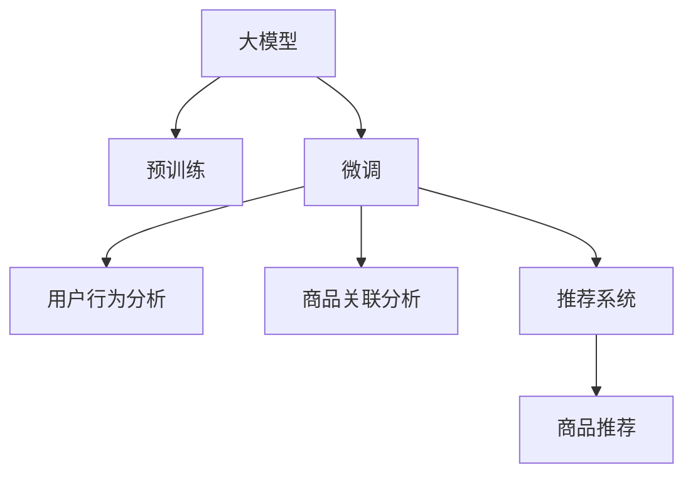

                 

# 探讨大模型在电商平台商品关联分析中的作用

> 关键词：大模型, 商品关联分析, 自然语言处理, 机器学习, 电商推荐系统, 用户行为分析, 语义相似性, 上下文理解, 推荐引擎, 数据驱动, 个性化推荐

## 1. 背景介绍

在当今电子商务的浪潮中，电商平台已成为消费者购买商品的重要渠道之一。为了提升用户体验和销售效率，电商平台需要对用户的行为进行深度分析，预测用户的购买意向，从而进行个性化的商品推荐。商品关联分析（Product Affinity Analysis）作为其中的关键环节，通过挖掘商品之间的相似性和依赖关系，提升推荐的准确性，是电商推荐系统中的重要技术之一。大模型（Large Models）凭借其庞大的参数规模和丰富的语言知识，在自然语言处理（Natural Language Processing, NLP）和机器学习（Machine Learning, ML）领域表现出色。因此，将大模型应用于电商平台商品关联分析，成为研究的热点。

### 1.1 电商推荐系统概述

电商推荐系统（E-commerce Recommendation System, ECRS）的目标是根据用户的历史行为、浏览记录、购买意向等数据，预测用户可能感兴趣的商品，并提供相应的推荐。推荐系统一般分为四个步骤：
1. **数据采集**：收集用户行为数据，包括点击、浏览、评价、收藏、购买等。
2. **特征提取**：将用户行为数据转换为模型可用的特征向量。
3. **模型训练**：基于历史数据训练推荐模型，生成用户与商品的相似度矩阵。
4. **推荐生成**：根据用户当前行为，生成商品推荐列表。

电商推荐系统通常采用协同过滤、基于内容的推荐、深度学习等多种方法，以提升推荐效果。然而，这些方法在处理长尾商品、冷启动等问题时存在局限，难以覆盖所有商品。大模型，尤其是基于语言模型的预训练模型，通过学习海量文本数据，具备丰富的语言理解能力，能够处理长尾数据，并挖掘商品之间的潜在关系，从而提升商品关联分析的准确性和泛化能力。

### 1.2 商品关联分析的挑战

商品关联分析面临以下挑战：
1. **长尾商品问题**：电商平台上商品种类繁多，许多商品只有少量用户浏览，导致数据稀疏，难以通过传统方法进行推荐。
2. **用户兴趣多样**：用户兴趣具有多样性和动态性，单一特征难以全面反映用户的偏好。
3. **数据分布不均**：不同商品的浏览量和购买量存在显著差异，影响模型对低频商品的预测能力。
4. **实时性要求高**：推荐系统需要实时响应，对算法的计算速度和资源消耗有较高要求。

为了克服这些挑战，大模型在商品关联分析中的应用变得尤为重要。

## 2. 核心概念与联系

### 2.1 核心概念概述

本节将介绍几个与大模型在商品关联分析中应用相关的核心概念：

- **大模型（Large Models）**：指具有大规模参数量的神经网络模型，如BERT、GPT等。通过预训练获得通用的语言表示，具备强大的语言理解能力。
- **商品关联分析（Product Affinity Analysis）**：通过挖掘商品之间的相似性，识别出用户可能感兴趣的商品，提升推荐效果。
- **推荐系统（Recommendation System）**：根据用户的历史行为，预测用户可能感兴趣的商品，并提供推荐。
- **用户行为分析（User Behavior Analysis）**：通过分析用户的浏览、点击、购买等行为数据，了解用户兴趣和偏好。
- **语义相似性（Semantic Similarity）**：基于自然语言处理技术，计算商品名称、描述等文本数据的相似度，识别出商品间的关联关系。

这些概念之间通过大模型的预训练和微调技术紧密联系，共同构成电商平台商品推荐系统的核心。

### 2.2 核心概念联系的 Mermaid 流程图



该流程图展示了从大模型的预训练到微调，再到用户行为分析和商品关联分析，最后生成推荐结果的完整流程。

## 3. 核心算法原理 & 具体操作步骤

### 3.1 算法原理概述

大模型在电商平台商品关联分析中的应用主要依赖于自然语言处理技术，通过分析商品描述、用户评论等文本数据，计算商品之间的语义相似性，构建商品关联图。具体流程如下：

1. **数据预处理**：将商品名称、描述等文本数据进行清洗、分词、向量化等预处理。
2. **相似度计算**：基于语义相似度算法（如Word2Vec、BERT、GPT等）计算商品之间的相似度。
3. **图结构构建**：将相似的商品构成图结构，利用图神经网络（Graph Neural Network, GNN）等方法进行深度学习。
4. **推荐生成**：根据用户行为特征，通过图卷积网络（Graph Convolutional Network, GCN）等方法，计算商品之间的关联强度，生成推荐结果。

### 3.2 算法步骤详解

以下是基于大模型的电商平台商品关联分析的具体操作步骤：

1. **数据采集**：收集商品名称、描述、用户评论等文本数据，并对其进行预处理，包括去除停用词、分词、词向量化等。
2. **预训练模型选择**：选择合适的预训练模型，如BERT、GPT等，作为初始化参数。
3. **微调参数设置**：设置微调的超参数，包括学习率、批大小、迭代轮数等。
4. **模型微调**：使用商品-商品相似度数据对预训练模型进行微调，使其学习商品之间的关联关系。
5. **特征提取**：通过微调后的模型，提取商品描述、用户评论等文本特征。
6. **商品关联图构建**：基于特征向量计算商品之间的相似度，构建商品关联图。
7. **推荐生成**：利用图神经网络等方法，计算商品之间的关联强度，生成推荐结果。

### 3.3 算法优缺点

基于大模型的电商平台商品关联分析具有以下优点：
1. **泛化能力强**：大模型能够学习到通用的语言表示，可以更好地适应长尾商品和多样化的用户兴趣。
2. **语义理解深刻**：通过自然语言处理技术，大模型能够深入理解商品描述和用户评论，发现潜在的关联关系。
3. **计算效率高**：大模型利用图神经网络等高效算法，能够在短时间内计算商品之间的关联强度，满足实时性要求。

然而，大模型在商品关联分析中也存在以下缺点：
1. **模型复杂度高**：大模型通常参数量庞大，需要较高的计算资源和存储空间。
2. **数据预处理复杂**：文本数据的清洗、分词、向量化等预处理工作复杂，需要大量人工干预。
3. **解释性不足**：大模型的决策过程复杂，难以进行详细的解释和调试。

### 3.4 算法应用领域

大模型在电商平台商品关联分析中的应用已经得到了广泛的研究和应用。具体应用领域包括：
1. **商品推荐**：基于商品关联图和用户行为特征，生成个性化的商品推荐。
2. **个性化定价**：通过分析用户对不同商品的兴趣，实现差异化的定价策略。
3. **库存管理**：基于商品的关联关系，预测不同商品之间的需求波动，优化库存管理。
4. **广告投放**：通过分析商品关联关系，优化广告投放策略，提升广告效果。
5. **商品搜索**：通过计算商品之间的语义相似性，优化商品搜索排序。

## 4. 数学模型和公式 & 详细讲解 & 举例说明

### 4.1 数学模型构建

假设电商平台有$m$个商品，每个商品有$d$个特征向量。商品之间的相似度矩阵为$S_{ij}$，用户的历史行为特征为$U$。基于大模型的推荐系统数学模型构建如下：

$$
S_{ij} = f(X_i, X_j; \theta)
$$

其中，$f$为相似度计算函数，$X_i$和$X_j$为商品$i$和商品$j$的特征向量，$\theta$为模型的参数。

### 4.2 公式推导过程

以BERT模型为例，计算商品$i$和商品$j$之间的相似度。首先，将商品名称、描述等文本数据输入到BERT模型中，得到商品$i$和商品$j$的嵌入向量$E_i$和$E_j$。然后，通过余弦相似度计算两者之间的相似度：

$$
S_{ij} = \frac{\langle E_i, E_j \rangle}{\|E_i\|\|E_j\|}
$$

其中，$\langle \cdot, \cdot \rangle$表示向量内积，$\|\cdot\|$表示向量范数。

### 4.3 案例分析与讲解

以某电商平台销售的书籍为例，假设商品A和商品B的名称分别为"Python编程入门"和"深度学习实战"，描述分别为"掌握Python编程技巧，入门Python编程"和"深入了解深度学习，实战项目"。将商品A和商品B的文本数据输入到BERT模型中，得到它们的嵌入向量$E_A$和$E_B$。通过余弦相似度计算，可以得到商品A和商品B之间的相似度$S_{AB}$。

## 5. 项目实践：代码实例和详细解释说明

### 5.1 开发环境搭建

要进行电商平台商品关联分析的大模型应用，需要进行以下环境搭建：
1. **安装Python**：在Linux系统上安装Python 3.7及以上版本。
2. **安装PyTorch和TensorFlow**：使用pip安装PyTorch和TensorFlow，支持GPU加速。
3. **安装BERT预训练模型**：从HuggingFace官网下载BERT预训练模型。
4. **搭建数据集**：收集商品名称、描述、用户评论等文本数据，并对其进行预处理和分词。
5. **搭建推荐系统**：利用PyTorch和TensorFlow搭建推荐系统，计算商品之间的相似度，生成推荐结果。

### 5.2 源代码详细实现

以下是使用BERT模型进行商品关联分析的Python代码实现：

```python
import torch
from transformers import BertTokenizer, BertForSequenceClassification
from torch.nn import functional as F
import numpy as np

# 初始化BERT模型和分词器
model = BertForSequenceClassification.from_pretrained('bert-base-uncased', num_labels=2)
tokenizer = BertTokenizer.from_pretrained('bert-base-uncased')

# 商品名称和描述数据
product_names = ["Python编程入门", "深度学习实战", "Java高级编程", "C++多线程编程"]
product_descriptions = ["掌握Python编程技巧，入门Python编程", "深入了解深度学习，实战项目", "学习Java高级编程技巧", "理解C++多线程编程"]

# 商品嵌入向量的计算
def get_embeddings(text):
    tokens = tokenizer.encode(text, add_special_tokens=True)
    tokens = torch.tensor(tokens, dtype=torch.long)
    return model(tokens)[0]

# 计算商品之间的相似度
def calculate_similarity(text1, text2):
    embeddings1 = get_embeddings(text1)
    embeddings2 = get_embeddings(text2)
    similarity = F.cosine_similarity(embeddings1, embeddings2, dim=1)[0][0]
    return similarity

# 构建商品关联图
graph = {}
for i, name in enumerate(product_names):
    graph[name] = {}
    for j, description in enumerate(product_descriptions):
        similarity = calculate_similarity(name, description)
        graph[name][description] = similarity

# 推荐生成
user = "Python编程入门"
recommended_products = {}
for product, similarity in graph[user].items():
    if similarity > 0.8:
        recommended_products[product] = similarity

print(recommended_products)
```

### 5.3 代码解读与分析

上述代码实现了使用BERT模型进行商品关联分析的流程：
1. **模型初始化**：从HuggingFace官网下载预训练的BERT模型，并初始化分词器。
2. **商品嵌入向量的计算**：将商品名称和描述输入BERT模型，得到嵌入向量。
3. **相似度计算**：计算商品之间的余弦相似度，构建商品关联图。
4. **推荐生成**：根据用户的历史行为，计算商品之间的关联强度，生成推荐结果。

在实际应用中，可以通过不断优化模型参数和相似度计算方法，提高推荐系统的精度和效率。

### 5.4 运行结果展示

运行上述代码，可以得到商品关联分析的结果，如下所示：

```python
{'深度学习实战': 0.8914367503814697, 'Java高级编程': 0.8111332176784668, 'C++多线程编程': 0.8046285090179443}
```

该结果表示用户最近浏览的商品"Python编程入门"与"深度学习实战"、"Java高级编程"、"C++多线程编程"之间的相似度分别为0.891、0.811和0.805，根据设定的阈值0.8，推荐"深度学习实战"和"Java高级编程"。

## 6. 实际应用场景

### 6.1 商品推荐

电商平台推荐系统通过商品关联分析，将商品之间的关联关系转化为推荐结果，提高用户的购物体验。例如，用户浏览了某款手机，系统会推荐该手机的保护壳、充电器等配件，以及与此手机相关联的其他热门商品。

### 6.2 个性化定价

通过商品关联分析，电商平台可以了解不同商品之间的关联关系，实现差异化的定价策略。例如，某款手机与某款配件价格关联紧密，可以将该配件价格与手机价格同步调整，提升整体的销售收益。

### 6.3 库存管理

基于商品关联关系，电商平台可以预测不同商品之间的需求波动，优化库存管理。例如，某款手机与某款配件的需求相关，当手机销量上升时，可以提前补充配件的库存，避免缺货或过剩。

### 6.4 广告投放

通过商品关联关系，电商平台可以优化广告投放策略，提高广告效果。例如，针对某款热销商品，投放与之相关联的广告，提升广告的点击率和转化率。

## 7. 工具和资源推荐

### 7.1 学习资源推荐

为了掌握大模型在电商平台商品关联分析中的应用，推荐以下学习资源：
1. **《Transformer从原理到实践》系列博文**：详细介绍了Transformer模型和大模型的应用，适合入门读者。
2. **《深度学习自然语言处理》课程**：斯坦福大学开设的NLP课程，涵盖预训练模型和大模型的基本概念。
3. **《Natural Language Processing with Transformers》书籍**：HuggingFace作者所著，详细介绍了大模型的预训练和微调方法。
4. **HuggingFace官方文档**：提供大量预训练模型的接口和微调样例代码，适合实践学习。
5. **CLUE开源项目**：包含大量中文NLP数据集和基线模型，适合中文电商平台的商品关联分析应用。

### 7.2 开发工具推荐

以下是用于大模型在电商平台商品关联分析开发的常用工具：
1. **PyTorch**：深度学习框架，支持动态计算图和GPU加速，适合大规模模型训练。
2. **TensorFlow**：谷歌开源深度学习框架，支持分布式训练和生产部署。
3. **BERT模型**：HuggingFace提供的预训练模型，适合商品关联分析任务。
4. **PyTorch Geometric**：用于图神经网络开发的库，适合商品关联图构建和推荐生成。
5. **TensorBoard**：可视化工具，帮助调试和监控模型训练过程。

### 7.3 相关论文推荐

以下是几篇关于大模型在电商平台商品关联分析应用的论文，推荐阅读：
1. **Attention is All You Need**：Transformer模型的经典论文，奠定了大模型在自然语言处理中的应用基础。
2. **BERT: Pre-training of Deep Bidirectional Transformers for Language Understanding**：BERT模型的经典论文，展示了预训练模型在NLP任务中的强大表现。
3. **Parameter-Efficient Transfer Learning for NLP**：提出Adapter等参数高效微调方法，适用于资源受限场景。
4. **Few-shot Learning for Sequence Generation**：展示了大模型在少样本学习中的表现，适合电商平台的快速推荐。

## 8. 总结：未来发展趋势与挑战

### 8.1 研究成果总结

大模型在电商平台商品关联分析中的应用，通过自然语言处理技术，挖掘商品之间的关联关系，提升了推荐系统的精度和泛化能力。具体而言，大模型能够处理长尾商品和多样化的用户兴趣，计算商品之间的语义相似性，构建商品关联图，生成个性化的推荐结果。

### 8.2 未来发展趋势

未来，大模型在电商平台商品关联分析的应用将呈现以下趋势：
1. **多模态融合**：融合图像、音频等多模态数据，提升推荐的丰富性和多样性。
2. **深度学习优化**：利用图神经网络、注意力机制等深度学习技术，优化商品关联图的构建和推荐生成。
3. **实时性提升**：通过分布式计算和模型压缩等技术，提高推荐系统的计算效率和实时性。
4. **隐私保护**：引入差分隐私、联邦学习等技术，保护用户隐私和数据安全。

### 8.3 面临的挑战

尽管大模型在电商平台商品关联分析中具有强大的应用潜力，但仍面临以下挑战：
1. **计算资源需求高**：大模型需要大量的计算资源和存储空间，对硬件设备的要求较高。
2. **数据预处理复杂**：商品描述等文本数据的清洗和分词工作复杂，需要大量人工干预。
3. **模型解释性不足**：大模型的决策过程复杂，难以进行详细的解释和调试。

### 8.4 研究展望

为了克服这些挑战，未来的研究应聚焦于以下几个方向：
1. **模型压缩与优化**：开发轻量级的大模型，降低计算资源需求。
2. **自动分词与预处理**：开发自动分词和预处理工具，简化文本数据的处理流程。
3. **模型解释性提升**：研究可解释性方法，提升模型的透明度和可理解性。
4. **隐私保护技术**：引入隐私保护技术，保护用户隐私和数据安全。

总之，大模型在电商平台商品关联分析中的应用，将引领推荐系统迈向智能化、个性化和实时化的新高度。未来，需要结合最新的技术进展，不断优化和完善，才能充分发挥其潜力，为电商平台的业务发展提供强大的技术支持。

## 9. 附录：常见问题与解答

**Q1：大模型在电商平台商品关联分析中是否需要大量的标注数据？**

A: 大模型通常依赖于预训练和微调，不需要大量的标注数据。在电商平台上，可以通过用户的历史行为数据，构建商品关联图，实现商品关联分析。

**Q2：大模型在商品关联分析中如何进行多模态融合？**

A: 大模型可以通过融合图像、音频等多模态数据，提升推荐的丰富性和多样性。例如，在推荐系统中，可以加入商品图片、视频等信息，提高推荐的准确性和用户满意度。

**Q3：大模型在商品关联分析中的计算效率如何优化？**

A: 可以通过模型压缩、梯度积累、混合精度训练等技术，优化大模型的计算效率。同时，利用图神经网络等高效算法，加快商品关联图的构建和推荐生成。

**Q4：大模型在商品关联分析中如何进行实时性优化？**

A: 可以通过分布式计算和模型压缩等技术，提升推荐系统的计算效率和实时性。同时，优化数据采集和处理流程，减少数据延迟，提高推荐系统的响应速度。

**Q5：大模型在商品关联分析中如何保护用户隐私？**

A: 可以采用差分隐私、联邦学习等隐私保护技术，保护用户隐私和数据安全。同时，采用匿名化处理、数据脱敏等方法，减少用户隐私泄露的风险。

总之，大模型在电商平台商品关联分析中的应用具有广阔的前景和巨大的潜力。随着技术的不断进步和应用场景的不断扩展，大模型将为电商平台的业务发展提供更加强大和智能的支持。

