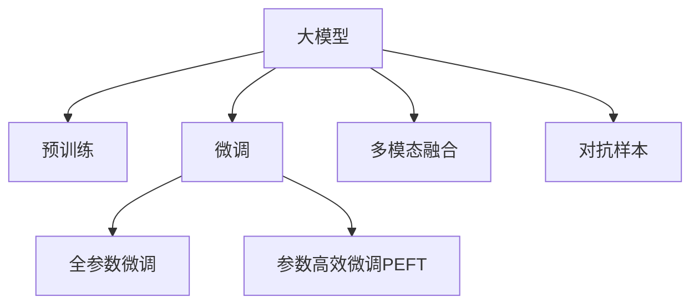

                 

## 1. 背景介绍

### 1.1 问题由来

随着电子商务的蓬勃发展，电商平台的数据体量呈指数级增长，用户行为数据日益丰富。预测用户购买意向，成为了电商行业实现精准营销、提升用户体验和优化库存管理的关键问题。传统的预测方法依赖于特征工程，需要耗费大量时间和人力进行数据准备，且难以应对高维度数据带来的维度灾难。

近年来，深度学习技术，特别是基于深度神经网络的预测模型，在电商领域得到了广泛应用。尤其是大模型（如BERT、GPT等）的出现，为电商平台用户购买意向预测带来了新的契机。大模型在预训练阶段，通过海量数据学习到了丰富的知识，具备了强大的数据分析能力。通过微调等技术，大模型能够快速适应特定任务，在用户购买意向预测中表现优异。

### 1.2 问题核心关键点

大模型在电商平台用户购买意向预测中具有以下核心优势：
1. **语义理解能力**：大模型能够理解自然语言中的丰富语义，捕捉用户描述、评价等文本数据的深层含义，从而更好地理解用户的购买需求。
2. **多模态融合**：大模型可以融合用户行为数据（如浏览历史、点击次数等）与文本数据，实现多模态融合的预测效果。
3. **泛化能力强**：大模型在预训练阶段通过大量数据学习，具备强大的泛化能力，能够有效处理新样本。
4. **参数高效微调**：大模型采用参数高效微调（PEFT）技术，可以在保证性能的同时，大幅减少微调参数，提高微调效率。
5. **对抗样本鲁棒性**：大模型在预训练阶段经过对抗训练，具备一定程度的鲁棒性，可以抵御一些对抗样本的攻击。

## 2. 核心概念与联系

### 2.1 核心概念概述

1. **大模型**：指在预训练阶段通过大规模无标签数据进行训练的深度神经网络模型，如BERT、GPT等。大模型在预训练阶段学习到了丰富的知识，能够应用于各种NLP任务。
2. **预训练**：指在大规模无标签数据上，通过自监督学习任务训练通用语言模型的过程。预训练使得模型学习到语言的通用表示。
3. **微调**：指在预训练模型的基础上，使用下游任务的少量标注数据，通过有监督学习优化模型在该任务上的性能。
4. **多模态融合**：指融合文本数据与用户行为数据，实现对用户购买意向的全面理解。
5. **对抗样本**：指对模型进行对抗性攻击，扰动模型预测结果的样本。
6. **参数高效微调**：指在微调过程中，只更新少量的模型参数，而固定大部分预训练权重不变，以提高微调效率。

这些核心概念之间的逻辑关系可以通过以下Mermaid流程图来展示：



这个流程图展示了大模型的核心概念及其之间的关系：

1. 大模型通过预训练获得基础能力。
2. 微调是对预训练模型进行任务特定的优化，可以分为全参数微调和参数高效微调（PEFT）。
3. 多模态融合是一种融合文本和行为数据的技术，以提升预测效果。
4. 对抗样本用于增强模型的鲁棒性，避免攻击。
5. 参数高效微调在保证性能的同时，提高微调效率。

## 3. 核心算法原理 & 具体操作步骤

### 3.1 算法原理概述

基于大模型的电商平台用户购买意向预测，本质上是一个有监督的分类任务。其核心思想是：将大模型作为初始化参数，通过在标注数据集上进行有监督微调，优化模型对用户购买意向的预测能力。

假设大模型为 $M_{\theta}$，其中 $\theta$ 为预训练得到的模型参数。给定电商平台用户购买意向标注数据集 $D=\{(x_i, y_i)\}_{i=1}^N$，其中 $x_i$ 为文本描述或行为数据，$y_i$ 为购买意向标签。微调的目标是找到新的模型参数 $\hat{\theta}$，使得：

$$
\hat{\theta}=\mathop{\arg\min}_{\theta} \mathcal{L}(M_{\theta},D)
$$

其中 $\mathcal{L}$ 为针对购买意向预测任务的损失函数，用于衡量模型预测输出与真实标签之间的差异。常见的损失函数包括交叉熵损失、均方误差损失等。

### 3.2 算法步骤详解

基于大模型的电商平台用户购买意向预测一般包括以下几个关键步骤：

**Step 1: 准备预训练模型和数据集**
- 选择合适的预训练语言模型 $M_{\theta}$ 作为初始化参数，如 BERT、GPT等。
- 准备电商平台用户购买意向的标注数据集 $D$，划分为训练集、验证集和测试集。一般要求标注数据与预训练数据的分布不要差异过大。

**Step 2: 添加任务适配层**
- 根据任务类型，在预训练模型顶层设计合适的输出层和损失函数。
- 对于分类任务，通常在顶层添加线性分类器和交叉熵损失函数。
- 对于生成任务，通常使用语言模型的解码器输出概率分布，并以负对数似然为损失函数。

**Step 3: 设置微调超参数**
- 选择合适的优化算法及其参数，如 AdamW、SGD 等，设置学习率、批大小、迭代轮数等。
- 设置正则化技术及强度，包括权重衰减、Dropout、Early Stopping等。
- 确定冻结预训练参数的策略，如仅微调顶层，或全部参数都参与微调。

**Step 4: 执行梯度训练**
- 将训练集数据分批次输入模型，前向传播计算损失函数。
- 反向传播计算参数梯度，根据设定的优化算法和学习率更新模型参数。
- 周期性在验证集上评估模型性能，根据性能指标决定是否触发 Early Stopping。
- 重复上述步骤直到满足预设的迭代轮数或 Early Stopping 条件。

**Step 5: 测试和部署**
- 在测试集上评估微调后模型 $M_{\hat{\theta}}$ 的性能，对比微调前后的精度提升。
- 使用微调后的模型对新用户行为数据进行预测，集成到电商平台的推荐系统中。

以上是基于大模型进行电商平台用户购买意向预测的一般流程。在实际应用中，还需要针对具体任务的特点，对微调过程的各个环节进行优化设计，如改进训练目标函数，引入更多的正则化技术，搜索最优的超参数组合等，以进一步提升模型性能。

### 3.3 算法优缺点

基于大模型的电商平台用户购买意向预测方法具有以下优点：
1. **高效性**：通过预训练，大模型在处理大规模数据时效率更高，比从头训练模型节省大量时间和资源。
2. **泛化能力强**：大模型通过预训练学习到语言的通用表示，在多种购买意向预测任务上表现优异。
3. **灵活性**：大模型支持多模态融合，融合用户行为数据与文本数据，提升预测效果。
4. **可解释性差**：大模型通常是"黑盒"系统，难以解释其内部决策逻辑，可能导致信任度不足。
5. **对抗性攻击风险**：大模型在预训练阶段没有经过针对性的对抗训练，容易受到对抗样本的攻击。

同时，该方法也存在一定的局限性：
1. **标注数据依赖**：微调的效果很大程度上取决于标注数据的质量和数量，获取高质量标注数据的成本较高。
2. **过拟合风险**：在标注数据量较少的情况下，模型容易出现过拟合。
3. **模型复杂度高**：大模型参数量庞大，对硬件资源要求高。

尽管存在这些局限性，但就目前而言，基于大模型的电商平台用户购买意向预测方法仍然是最主流范式。未来相关研究的重点在于如何进一步降低对标注数据的依赖，提高模型的泛化能力和鲁棒性，同时兼顾可解释性和计算效率。

### 3.4 算法应用领域

基于大模型的电商平台用户购买意向预测方法，在电商推荐、广告投放、用户画像等多个领域得到了广泛应用，具体包括：

1. **电商推荐系统**：通过微调大模型，预测用户购买意向，实现个性化推荐。
2. **广告投放优化**：预测用户是否会对广告产生购买意向，优化广告投放策略，提高广告转化率。
3. **用户画像构建**：通过微调大模型，分析用户行为和购买意向，构建详细的用户画像。
4. **营销活动策划**：预测用户对特定营销活动的响应意向，指导营销活动策划。

除了上述这些经典应用外，大模型在电商领域的创新性应用也在不断涌现，如智能客服、库存管理、智能价格优化等，为电商平台带来了全新的商业价值。

## 4. 数学模型和公式 & 详细讲解

### 4.1 数学模型构建

假设大模型为 $M_{\theta}$，其中 $\theta$ 为预训练得到的模型参数。给定电商平台用户购买意向标注数据集 $D=\{(x_i, y_i)\}_{i=1}^N$，其中 $x_i$ 为文本描述或行为数据，$y_i$ 为购买意向标签。微调的目标是找到新的模型参数 $\hat{\theta}$，使得：

$$
\hat{\theta}=\mathop{\arg\min}_{\theta} \mathcal{L}(M_{\theta},D)
$$

其中 $\mathcal{L}$ 为针对购买意向预测任务的损失函数，用于衡量模型预测输出与真实标签之间的差异。假设预测函数为 $f(x; \theta) = M_{\theta}(x)$，则损失函数 $\mathcal{L}$ 可以定义为：

$$
\mathcal{L}(\theta) = -\frac{1}{N}\sum_{i=1}^N [y_i\log f(x_i; \theta) + (1-y_i)\log (1-f(x_i; \theta))]
$$

该损失函数为二分类交叉熵损失函数，可以用于衡量模型预测的准确性。

### 4.2 公式推导过程

以二分类任务为例，推导交叉熵损失函数及其梯度的计算公式。

假设模型 $M_{\theta}$ 在输入 $x$ 上的输出为 $\hat{y}=M_{\theta}(x)$，表示样本属于正类的概率。真实标签 $y \in \{0,1\}$。则二分类交叉熵损失函数定义为：

$$
\ell(M_{\theta}(x),y) = -[y\log \hat{y} + (1-y)\log (1-\hat{y})]
$$

将其代入经验风险公式，得：

$$
\mathcal{L}(\theta) = -\frac{1}{N}\sum_{i=1}^N [y_i\log M_{\theta}(x_i)+(1-y_i)\log(1-M_{\theta}(x_i))]
$$

根据链式法则，损失函数对参数 $\theta_k$ 的梯度为：

$$
\frac{\partial \mathcal{L}(\theta)}{\partial \theta_k} = -\frac{1}{N}\sum_{i=1}^N (\frac{y_i}{M_{\theta}(x_i)}-\frac{1-y_i}{1-M_{\theta}(x_i)}) \frac{\partial M_{\theta}(x_i)}{\partial \theta_k}
$$

其中 $\frac{\partial M_{\theta}(x_i)}{\partial \theta_k}$ 可进一步递归展开，利用自动微分技术完成计算。

在得到损失函数的梯度后，即可带入参数更新公式，完成模型的迭代优化。重复上述过程直至收敛，最终得到适应电商平台用户购买意向预测任务的最优模型参数 $\theta^*$。

## 5. 项目实践：代码实例和详细解释说明

### 5.1 开发环境搭建

在进行电商平台用户购买意向预测实践前，我们需要准备好开发环境。以下是使用Python进行PyTorch开发的环境配置流程：

1. 安装Anaconda：从官网下载并安装Anaconda，用于创建独立的Python环境。

2. 创建并激活虚拟环境：
```bash
conda create -n pytorch-env python=3.8 
conda activate pytorch-env
```

3. 安装PyTorch：根据CUDA版本，从官网获取对应的安装命令。例如：
```bash
conda install pytorch torchvision torchaudio cudatoolkit=11.1 -c pytorch -c conda-forge
```

4. 安装Transformers库：
```bash
pip install transformers
```

5. 安装各类工具包：
```bash
pip install numpy pandas scikit-learn matplotlib tqdm jupyter notebook ipython
```

完成上述步骤后，即可在`pytorch-env`环境中开始预测实践。

### 5.2 源代码详细实现

这里我们以电商平台用户购买意向预测为例，给出使用Transformers库对BERT模型进行微调的PyTorch代码实现。

首先，定义用户购买意向预测任务的数据处理函数：

```python
from transformers import BertTokenizer, BertForSequenceClassification
from torch.utils.data import Dataset
import torch

class PurchaseIntentDataset(Dataset):
    def __init__(self, texts, labels, tokenizer, max_len=128):
        self.texts = texts
        self.labels = labels
        self.tokenizer = tokenizer
        self.max_len = max_len
        
    def __len__(self):
        return len(self.texts)
    
    def __getitem__(self, item):
        text = self.texts[item]
        label = self.labels[item]
        
        encoding = self.tokenizer(text, return_tensors='pt', max_length=self.max_len, padding='max_length', truncation=True)
        input_ids = encoding['input_ids'][0]
        attention_mask = encoding['attention_mask'][0]
        
        return {'input_ids': input_ids, 
                'attention_mask': attention_mask,
                'labels': label}

# 标签与id的映射
label2id = {'not_buy': 0, 'buy': 1}
id2label = {v: k for k, v in label2id.items()}

# 创建dataset
tokenizer = BertTokenizer.from_pretrained('bert-base-cased')

train_dataset = PurchaseIntentDataset(train_texts, train_labels, tokenizer)
dev_dataset = PurchaseIntentDataset(dev_texts, dev_labels, tokenizer)
test_dataset = PurchaseIntentDataset(test_texts, test_labels, tokenizer)
```

然后，定义模型和优化器：

```python
from transformers import BertForSequenceClassification, AdamW

model = BertForSequenceClassification.from_pretrained('bert-base-cased', num_labels=2)

optimizer = AdamW(model.parameters(), lr=2e-5)
```

接着，定义训练和评估函数：

```python
from torch.utils.data import DataLoader
from tqdm import tqdm
from sklearn.metrics import classification_report

device = torch.device('cuda') if torch.cuda.is_available() else torch.device('cpu')
model.to(device)

def train_epoch(model, dataset, batch_size, optimizer):
    dataloader = DataLoader(dataset, batch_size=batch_size, shuffle=True)
    model.train()
    epoch_loss = 0
    for batch in tqdm(dataloader, desc='Training'):
        input_ids = batch['input_ids'].to(device)
        attention_mask = batch['attention_mask'].to(device)
        labels = batch['labels'].to(device)
        model.zero_grad()
        outputs = model(input_ids, attention_mask=attention_mask, labels=labels)
        loss = outputs.loss
        epoch_loss += loss.item()
        loss.backward()
        optimizer.step()
    return epoch_loss / len(dataloader)

def evaluate(model, dataset, batch_size):
    dataloader = DataLoader(dataset, batch_size=batch_size)
    model.eval()
    preds, labels = [], []
    with torch.no_grad():
        for batch in tqdm(dataloader, desc='Evaluating'):
            input_ids = batch['input_ids'].to(device)
            attention_mask = batch['attention_mask'].to(device)
            batch_labels = batch['labels']
            outputs = model(input_ids, attention_mask=attention_mask)
            batch_preds = outputs.logits.argmax(dim=2).to('cpu').tolist()
            batch_labels = batch_labels.to('cpu').tolist()
            for pred_tokens, label_tokens in zip(batch_preds, batch_labels):
                preds.append(pred_tokens[:len(label_tokens)])
                labels.append(label_tokens)
                
    print(classification_report(labels, preds))
```

最后，启动训练流程并在测试集上评估：

```python
epochs = 5
batch_size = 16

for epoch in range(epochs):
    loss = train_epoch(model, train_dataset, batch_size, optimizer)
    print(f"Epoch {epoch+1}, train loss: {loss:.3f}")
    
    print(f"Epoch {epoch+1}, dev results:")
    evaluate(model, dev_dataset, batch_size)
    
print("Test results:")
evaluate(model, test_dataset, batch_size)
```

以上就是使用PyTorch对BERT进行电商平台用户购买意向预测的完整代码实现。可以看到，得益于Transformers库的强大封装，我们可以用相对简洁的代码完成BERT模型的加载和微调。

### 5.3 代码解读与分析

让我们再详细解读一下关键代码的实现细节：

**PurchaseIntentDataset类**：
- `__init__`方法：初始化文本、标签、分词器等关键组件。
- `__len__`方法：返回数据集的样本数量。
- `__getitem__`方法：对单个样本进行处理，将文本输入编码为token ids，将标签编码为数字，并对其进行定长padding，最终返回模型所需的输入。

**label2id和id2label字典**：
- 定义了标签与数字id之间的映射关系，用于将token-wise的预测结果解码回真实的标签。

**训练和评估函数**：
- 使用PyTorch的DataLoader对数据集进行批次化加载，供模型训练和推理使用。
- 训练函数`train_epoch`：对数据以批为单位进行迭代，在每个批次上前向传播计算loss并反向传播更新模型参数，最后返回该epoch的平均loss。
- 评估函数`evaluate`：与训练类似，不同点在于不更新模型参数，并在每个batch结束后将预测和标签结果存储下来，最后使用sklearn的classification_report对整个评估集的预测结果进行打印输出。

**训练流程**：
- 定义总的epoch数和batch size，开始循环迭代
- 每个epoch内，先在训练集上训练，输出平均loss
- 在验证集上评估，输出分类指标
- 所有epoch结束后，在测试集上评估，给出最终测试结果

可以看到，PyTorch配合Transformers库使得BERT微调的代码实现变得简洁高效。开发者可以将更多精力放在数据处理、模型改进等高层逻辑上，而不必过多关注底层的实现细节。

当然，工业级的系统实现还需考虑更多因素，如模型的保存和部署、超参数的自动搜索、更灵活的任务适配层等。但核心的微调范式基本与此类似。

## 6. 实际应用场景

### 6.1 电商平台推荐系统

电商平台推荐系统是用户购买意向预测的重要应用场景。通过微调大模型，电商平台能够精准预测用户购买意向，从而实现个性化推荐。具体而言，微调后的模型可以对用户浏览历史、点击行为等进行实时分析，预测用户可能感兴趣的商品，并动态生成个性化推荐列表，提高用户购买转化率。

在技术实现上，电商平台可以收集用户的历史行为数据，构建标注数据集，在此基础上对预训练模型进行微调。微调后的模型能够准确预测用户购买意向，实时调整推荐策略，提升用户体验和交易转化率。

### 6.2 广告投放优化

电商平台在广告投放时，需要精准预测用户是否会对广告产生购买意向，从而优化广告投放策略，提高广告转化率。微调大模型可以预测广告的点击率和购买率，评估广告的效果，指导广告投放的优化。

具体而言，电商平台可以收集用户的点击行为数据，构建标注数据集，在此基础上对预训练模型进行微调。微调后的模型能够预测广告的购买意向，优化广告投放位置和频次，提升广告的点击率和转化率。

### 6.3 用户画像构建

电商平台需要构建详细的用户画像，以便进行精准营销和个性化推荐。微调大模型可以分析用户的行为数据和购买意向，构建多维度的用户画像。

具体而言，电商平台可以收集用户的历史行为数据和购买数据，构建标注数据集，在此基础上对预训练模型进行微调。微调后的模型能够准确预测用户的购买意向，分析用户偏好和行为特征，构建全面的用户画像。

### 6.4 营销活动策划

电商平台需要策划各种营销活动，提高用户购买意向。微调大模型可以预测用户对不同营销活动的响应意向，指导营销活动的策划。

具体而言，电商平台可以收集用户的历史行为数据和营销活动数据，构建标注数据集，在此基础上对预训练模型进行微调。微调后的模型能够预测用户对不同营销活动的响应意向，指导营销活动的策划和优化，提高营销活动的转化率和效果。

## 7. 工具和资源推荐

### 7.1 学习资源推荐

为了帮助开发者系统掌握大模型在电商平台用户购买意向预测中的应用，这里推荐一些优质的学习资源：

1. 《Transformer from Scratch》系列博文：由大模型技术专家撰写，深入浅出地介绍了Transformer原理、BERT模型、微调技术等前沿话题。

2. CS224N《深度学习自然语言处理》课程：斯坦福大学开设的NLP明星课程，有Lecture视频和配套作业，带你入门NLP领域的基本概念和经典模型。

3. 《Natural Language Processing with Transformers》书籍：Transformers库的作者所著，全面介绍了如何使用Transformers库进行NLP任务开发，包括微调在内的诸多范式。

4. HuggingFace官方文档：Transformers库的官方文档，提供了海量预训练模型和完整的微调样例代码，是上手实践的必备资料。

5. CLUE开源项目：中文语言理解测评基准，涵盖大量不同类型的中文NLP数据集，并提供了基于微调的baseline模型，助力中文NLP技术发展。

通过对这些资源的学习实践，相信你一定能够快速掌握大模型在电商平台用户购买意向预测中的应用，并用于解决实际的NLP问题。

### 7.2 开发工具推荐

高效的开发离不开优秀的工具支持。以下是几款用于大模型预测开发的常用工具：

1. PyTorch：基于Python的开源深度学习框架，灵活动态的计算图，适合快速迭代研究。大部分预训练语言模型都有PyTorch版本的实现。

2. TensorFlow：由Google主导开发的开源深度学习框架，生产部署方便，适合大规模工程应用。同样有丰富的预训练语言模型资源。

3. Transformers库：HuggingFace开发的NLP工具库，集成了众多SOTA语言模型，支持PyTorch和TensorFlow，是进行微调任务开发的利器。

4. Weights & Biases：模型训练的实验跟踪工具，可以记录和可视化模型训练过程中的各项指标，方便对比和调优。与主流深度学习框架无缝集成。

5. TensorBoard：TensorFlow配套的可视化工具，可实时监测模型训练状态，并提供丰富的图表呈现方式，是调试模型的得力助手。

6. Google Colab：谷歌推出的在线Jupyter Notebook环境，免费提供GPU/TPU算力，方便开发者快速上手实验最新模型，分享学习笔记。

合理利用这些工具，可以显著提升大模型预测任务的开发效率，加快创新迭代的步伐。

### 7.3 相关论文推荐

大模型在电商平台用户购买意向预测中的应用源于学界的持续研究。以下是几篇奠基性的相关论文，推荐阅读：

1. Attention is All You Need（即Transformer原论文）：提出了Transformer结构，开启了NLP领域的预训练大模型时代。

2. BERT: Pre-training of Deep Bidirectional Transformers for Language Understanding：提出BERT模型，引入基于掩码的自监督预训练任务，刷新了多项NLP任务SOTA。

3. Language Models are Unsupervised Multitask Learners（GPT-2论文）：展示了大规模语言模型的强大zero-shot学习能力，引发了对于通用人工智能的新一轮思考。

4. Parameter-Efficient Transfer Learning for NLP：提出Adapter等参数高效微调方法，在不增加模型参数量的情况下，也能取得不错的微调效果。

5. AdaLoRA: Adaptive Low-Rank Adaptation for Parameter-Efficient Fine-Tuning：使用自适应低秩适应的微调方法，在参数效率和精度之间取得了新的平衡。

这些论文代表了大模型在电商平台用户购买意向预测中的应用方向。通过学习这些前沿成果，可以帮助研究者把握学科前进方向，激发更多的创新灵感。

## 8. 总结：未来发展趋势与挑战

### 8.1 总结

本文对基于大模型的电商平台用户购买意向预测方法进行了全面系统的介绍。首先阐述了电商平台用户购买意向预测的背景和问题由来，明确了大模型在预测任务中的优势和适用性。其次，从原理到实践，详细讲解了大模型的微调过程和关键技术，给出了预测任务的代码实现。同时，本文还广泛探讨了大模型在电商领域的多种应用场景，展示了其在电商推荐、广告投放、用户画像等方面的巨大潜力。此外，本文精选了相关学习资源，力求为开发者提供全方位的技术指引。

通过本文的系统梳理，可以看到，基于大模型的电商平台用户购买意向预测方法在电商推荐、广告投放、用户画像等多个领域得到了广泛应用，为电商平台带来了新的商业价值。未来，伴随预训练语言模型和微调方法的不断演进，相信电商平台用户购买意向预测技术将迎来更大的突破，为电商平台带来更高的运营效率和用户体验。

### 8.2 未来发展趋势

展望未来，基于大模型的电商平台用户购买意向预测技术将呈现以下几个发展趋势：

1. **模型的进一步演化**：随着预训练语言模型的不断进步，大模型在预测任务中的表现将更加出色。超大规模语言模型，如GPT-4、T5等，将进一步提升预测的准确性和泛化能力。
2. **多模态融合技术**：大模型将更广泛地融合用户行为数据和文本数据，提升预测效果。多模态融合技术的发展，将使大模型在电商平台用户购买意向预测中表现更加优异。
3. **对抗样本的防御**：对抗样本攻击是当前深度学习模型的主要威胁之一。未来大模型在预测任务中将引入对抗样本防御机制，增强模型的鲁棒性。
4. **参数高效微调**：参数高效微调技术将继续发展，实现更加灵活高效的模型训练。通过固定大部分预训练参数，仅微调少量的任务相关参数，可以在保证性能的同时，显著降低计算资源消耗。
5. **联邦学习和差分隐私**：为了保护用户隐私，未来的电商平台用户购买意向预测将引入联邦学习和差分隐私技术，在不泄露用户隐私的前提下，进行模型微调和优化。

以上趋势凸显了大模型在电商平台用户购买意向预测中的广阔前景。这些方向的探索发展，必将进一步提升预测模型的性能和应用范围，为电商平台带来更高的运营效率和用户体验。

### 8.3 面临的挑战

尽管大模型在电商平台用户购买意向预测中取得了显著成果，但在迈向更加智能化、普适化应用的过程中，它仍面临着诸多挑战：

1. **数据隐私和安全**：电商平台的业务涉及用户隐私，如何在保障用户隐私的前提下进行预测模型微调，是亟待解决的问题。
2. **模型的鲁棒性和泛化能力**：在数据分布发生变化的情况下，模型的泛化能力仍需进一步提升。如何在标注数据不足的情况下，保持模型的鲁棒性和泛化能力，是未来的研究方向。
3. **计算资源消耗**：超大规模语言模型的参数量和计算资源消耗高，如何优化模型结构，提高计算效率，是亟需解决的挑战。
4. **模型的可解释性**：大模型通常是"黑盒"系统，难以解释其内部决策逻辑。如何在保证模型性能的同时，提高模型的可解释性，是未来的研究方向。

尽管存在这些挑战，但随着技术的发展和研究的深入，这些问题将逐步得到解决。相信未来大模型在电商平台用户购买意向预测中的潜力将进一步得到挖掘，为电商平台带来更高的运营效率和用户体验。

### 8.4 研究展望

未来，基于大模型的电商平台用户购买意向预测技术需要在以下几个方面进行深入研究：

1. **数据隐私保护**：研究联邦学习和差分隐私技术，在不泄露用户隐私的前提下进行模型微调和优化。
2. **模型鲁棒性提升**：研究模型鲁棒性提升技术，增强模型对对抗样本和异常数据的防御能力。
3. **计算资源优化**：研究模型压缩和优化技术，提高模型的计算效率和资源利用率。
4. **可解释性增强**：研究模型可解释性增强技术，提高模型的可解释性和透明度。
5. **跨领域迁移能力**：研究跨领域迁移技术，使模型在不同领域间具有更好的泛化能力。
6. **多模态融合**：研究多模态融合技术，将文本数据、行为数据和图像数据等进行融合，提升预测效果。

这些研究方向将推动大模型在电商平台用户购买意向预测中的广泛应用，为电商平台带来更高的运营效率和用户体验。相信未来大模型在电商平台用户购买意向预测中的潜力将进一步得到挖掘，为电商平台带来更高的运营效率和用户体验。

## 9. 附录：常见问题与解答

**Q1：电商平台用户购买意向预测是否适用于所有电商平台？**

A: 电商平台用户购买意向预测方法在大多数电商平台中都可以适用。但不同电商平台的业务模式、产品特性等差异较大，需要根据具体平台的特点进行调整和优化。例如，针对C2C平台和B2C平台的推荐策略有所不同。

**Q2：微调过程中如何选择合适的学习率？**

A: 微调的学习率一般要比预训练时小1-2个数量级，如果使用过大的学习率，容易破坏预训练权重，导致过拟合。一般建议从1e-5开始调参，逐步减小学习率，直至收敛。也可以使用warmup策略，在开始阶段使用较小的学习率，再逐渐过渡到预设值。需要注意的是，不同的优化器(如AdamW、Adafactor等)以及不同的学习率调度策略，可能需要设置不同的学习率阈值。

**Q3：电商平台用户购买意向预测的标注数据依赖较高，如何解决？**

A: 电商平台用户购买意向预测的标注数据确实依赖较高。为了降低标注成本，可以考虑以下几种方法：
1. 数据增强：通过回译、近义替换等方式扩充训练集，增加样本多样性。
2. 半监督学习：利用无标签数据进行自监督学习，结合少量标注数据进行微调，提高模型泛化能力。
3. 主动学习：通过主动学习策略，选取最有信息量的数据进行标注，减少标注成本。

这些方法可以在一定程度上降低标注数据的需求，提升模型的泛化能力。

**Q4：电商平台用户购买意向预测中，如何处理用户的隐匿行为？**

A: 电商平台用户购买意向预测中，用户的某些行为可能是不希望被系统记录的，例如用户的浏览行为、搜索关键词等。为保护用户隐私，可以采用以下策略：
1. 匿名化处理：对用户的隐匿行为进行匿名化处理，去除个人信息。
2. 差分隐私技术：使用差分隐私技术，对用户行为数据进行隐私保护。
3. 用户主动屏蔽：允许用户主动屏蔽某些行为记录，增强用户隐私保护。

通过这些策略，可以保护用户隐私，同时仍然能够进行有效的用户购买意向预测。

**Q5：电商平台用户购买意向预测中，如何处理长尾商品的推荐？**

A: 电商平台中存在大量的长尾商品，用户的购买意向可能分布在长尾商品上。为提升长尾商品的推荐效果，可以采用以下策略：
1. 长尾商品数据集构建：构建包含长尾商品的标注数据集，进行模型微调。
2. 长尾商品推荐算法：采用长尾商品推荐算法，如Yin-Yang推荐、Deepfm等，提高长尾商品的推荐效果。
3. 用户行为分析：通过用户行为数据分析，发现用户对长尾商品的潜在兴趣，进行精准推荐。

这些策略可以提高长尾商品的推荐效果，提升用户的购物体验。

总之，电商平台用户购买意向预测具有广泛的应用前景，能够显著提升电商平台的运营效率和用户体验。未来，随着大模型和微调技术的不断发展，相信该技术将得到更广泛的应用，为电商平台带来更大的商业价值。

