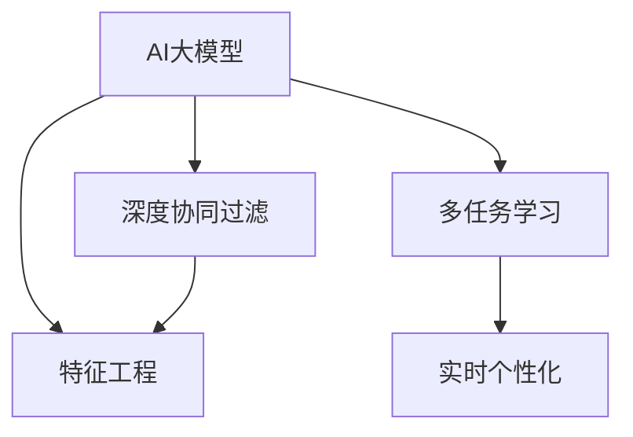

                 

# 推荐系统中AI大模型的实时个性化

> 关键词：推荐系统, AI大模型, 实时个性化, 协同过滤, 深度学习, 特征工程, 多任务学习, 广告推荐, 内容推荐

## 1. 背景介绍

### 1.1 问题由来

推荐系统是信息时代的重要基础设施，广泛应用于电商平台、社交媒体、视频平台等领域。传统的推荐系统主要依赖协同过滤和基于内容的推荐算法，但随着数据量的急剧增长，这些方法逐渐面临难以应对的问题：

1. **数据稀疏性**：推荐系统需要大量用户行为数据才能获得准确的用户画像，但许多用户的历史行为数据稀少，难以准确捕捉用户偏好。
2. **冷启动问题**：新用户和新物品由于缺乏历史数据，难以通过传统方法获得推荐。
3. **模型计算量大**：随着数据量的增加，推荐模型的计算和存储开销呈指数级增长，难以实时响应。
4. **算法鲁棒性不足**：传统推荐算法对噪声和异常值的鲁棒性较差，容易产生错误推荐。

这些问题催生了基于人工智能(AI)技术的推荐系统，特别是利用大模型和深度学习技术，可以显著提升推荐系统的性能和效率。

### 1.2 问题核心关键点

为了解决传统推荐系统面临的问题，基于AI的推荐系统采用了以下关键技术：

- **AI大模型**：以Transformer为代表的深度学习模型，通过大规模预训练获得广泛的语义和结构知识，具备强大的特征提取和理解能力。
- **深度协同过滤**：利用深度神经网络模型，捕捉用户行为数据中的高阶交互模式，提升推荐精度。
- **特征工程**：设计多种特征提取和融合方法，挖掘更多有助于推荐的关键信息。
- **多任务学习**：通过联合优化多个推荐任务，提升模型的泛化能力和应用效果。
- **实时个性化**：结合用户行为实时数据，进行动态推荐，提升用户体验。

这些关键技术使得基于AI的推荐系统具备了高精度、高效率、高鲁棒性等优势，成为推荐领域的研究热点。

## 2. 核心概念与联系

### 2.1 核心概念概述

为了更好地理解AI大模型在推荐系统中的应用，本节将介绍几个核心概念：

- **AI大模型**：以Transformer为代表的深度学习模型，通过大规模预训练获得广泛的语义和结构知识，具备强大的特征提取和理解能力。
- **协同过滤**：利用用户和物品之间的交互关系进行推荐，分为基于用户的协同过滤和基于物品的协同过滤。
- **深度协同过滤**：利用深度神经网络模型，捕捉用户行为数据中的高阶交互模式，提升推荐精度。
- **特征工程**：设计多种特征提取和融合方法，挖掘更多有助于推荐的关键信息。
- **多任务学习**：通过联合优化多个推荐任务，提升模型的泛化能力和应用效果。
- **实时个性化**：结合用户行为实时数据，进行动态推荐，提升用户体验。

这些核心概念之间的逻辑关系可以通过以下Mermaid流程图来展示：



这个流程图展示了大模型推荐系统的核心概念及其之间的关系：

1. AI大模型通过预训练获得基础能力。
2. 深度协同过滤利用模型捕捉高阶交互模式。
3. 特征工程设计更多有助于推荐的关键信息。
4. 多任务学习联合优化多个推荐任务。
5. 实时个性化结合用户实时数据动态推荐。

这些概念共同构成了大模型推荐系统的学习和应用框架，使其能够在各种场景下发挥强大的推荐能力。通过理解这些核心概念，我们可以更好地把握AI大模型在推荐系统中的应用范式。

## 3. 核心算法原理 & 具体操作步骤
### 3.1 算法原理概述

基于AI大模型的推荐系统，本质上是一个多任务学习和特征融合的过程。其核心思想是：将AI大模型作为基础特征提取器，通过联合优化多个推荐任务，并设计合理的特征工程方法，提取和融合更多有助于推荐的关键信息，最终实现实时个性化的推荐。

形式化地，假设推荐系统中有多个推荐任务 $T=\{t_1, t_2, \ldots, t_n\}$，AI大模型为 $M_{\theta}$，其中 $\theta$ 为模型参数。设 $x_{i,t}$ 为用户 $i$ 在任务 $t$ 上的行为数据，$y_{i,t}$ 为任务 $t$ 上的推荐目标。推荐系统可以表示为：

$$
y_{i,t} = f_t(M_{\theta}(x_{i,t}))
$$

其中 $f_t$ 为任务 $t$ 的推荐函数，用于将模型的输出映射到推荐目标。

为了最大化所有推荐任务的性能，可以定义联合优化目标函数为：

$$
\mathcal{L}(\theta) = \sum_{t=1}^n \mathcal{L}_t(\theta)
$$

其中 $\mathcal{L}_t(\theta)$ 为任务 $t$ 的损失函数，用于衡量推荐模型在任务 $t$ 上的性能。

通过梯度下降等优化算法，联合优化过程不断更新模型参数 $\theta$，最小化联合损失函数 $\mathcal{L}$，使得模型输出逼近各推荐任务的理想结果。

### 3.2 算法步骤详解

基于AI大模型的推荐系统一般包括以下几个关键步骤：

**Step 1: 准备数据集和模型**
- 收集用户行为数据 $D=\{(x_{i,t}, y_{i,t})\}_{i=1}^m, t=1,\ldots,n$，其中 $m$ 为用户的数量，$n$ 为推荐任务的总数。
- 选择合适的AI大模型 $M_{\theta}$，如BERT、GPT等，进行预训练和微调。

**Step 2: 设计任务适配层**
- 根据推荐任务的类型，设计相应的任务适配层，用于将大模型的输出转换为推荐结果。
- 对于物品推荐，通常采用二分类任务，输出为物品的评分或标签。
- 对于内容推荐，则可以利用序列模型，预测用户是否会对物品序列产生点击或购买行为。

**Step 3: 设计特征工程方法**
- 设计多种特征提取方法，如嵌入表示、深度学习特征提取器等，提取用户和物品的关键特征。
- 使用特征融合技术，如多层感知器、注意力机制等，将多个特征进行融合，提升推荐效果。

**Step 4: 联合优化多任务**
- 使用多任务学习算法，如Multi-task Learning、Multi-view Training等，联合优化多个推荐任务。
- 通过设置不同的损失函数，权衡各个任务的重要性，使得模型在多个任务上都取得较好的表现。

**Step 5: 实时个性化推荐**
- 结合用户实时行为数据，动态更新推荐模型，实时生成个性化推荐。
- 使用缓存技术，如Redis、Memcached等，加速推荐模型的访问和响应。

以上是基于AI大模型的推荐系统的一般流程。在实际应用中，还需要针对具体任务的特点，对各个环节进行优化设计，如改进任务适配层，引入更多的正则化技术，搜索最优的超参数组合等，以进一步提升模型性能。

### 3.3 算法优缺点

基于AI大模型的推荐系统具有以下优点：
1. 高精度：大模型能够自动学习复杂的交互模式，提升推荐精度。
2. 高效性：深度协同过滤和实时个性化使得推荐系统能够实时响应用户需求。
3. 鲁棒性：模型对噪声和异常值的鲁棒性较强，降低错误推荐风险。
4. 可扩展性：模型参数较大，可以通过分布式计算和GPU加速，处理大规模数据。

同时，该方法也存在一定的局限性：
1. 数据隐私问题：大规模数据收集和存储可能涉及隐私问题，需要采取合适的隐私保护措施。
2. 计算资源需求高：大规模模型的训练和推理需要高性能的计算资源，可能带来较高的成本。
3. 冷启动问题：新用户和新物品由于缺乏历史数据，难以通过传统方法获得推荐。
4. 实时性要求高：实时个性化推荐需要快速响应，对系统架构和数据存储有较高要求。

尽管存在这些局限性，但就目前而言，基于AI大模型的推荐系统是推荐领域的主流方法。未来相关研究的重点在于如何进一步降低数据收集和存储成本，提升推荐模型的实时性，同时兼顾隐私保护和模型效果。

### 3.4 算法应用领域

基于AI大模型的推荐系统已经在多个领域得到了广泛应用，例如：

- 电商平台：通过预测用户的购买行为，推荐相关商品，提升用户体验和销售额。
- 社交媒体：推荐用户感兴趣的内容和话题，增加平台粘性，提升用户活跃度。
- 视频平台：推荐用户喜爱的视频内容，增加观看时长，提升用户留存率。
- 新闻网站：推荐新闻文章，提升用户点击率和停留时间，增加网站流量。

除了上述这些经典应用外，大模型推荐系统还被创新性地应用到更多场景中，如个性化广告推荐、多模态推荐、商品搭配推荐等，为推荐技术带来了新的突破。随着预训练模型和推荐方法的不断进步，相信推荐系统将在更广阔的应用领域大放异彩。

## 4. 数学模型和公式 & 详细讲解  
### 4.1 数学模型构建

本节将使用数学语言对基于AI大模型的推荐系统进行更加严格的刻画。

记AI大模型为 $M_{\theta}$，其中 $\theta$ 为模型参数。假设推荐系统中有 $n$ 个推荐任务，每个任务有 $m$ 个用户，用户在任务 $t$ 上的行为数据为 $x_{i,t}$，推荐目标为 $y_{i,t}$。推荐系统的联合优化目标函数为：

$$
\mathcal{L}(\theta) = \sum_{t=1}^n \sum_{i=1}^m \mathcal{L}_t(M_{\theta}(x_{i,t}), y_{i,t})
$$

其中 $\mathcal{L}_t(M_{\theta}(x_{i,t}), y_{i,t})$ 为任务 $t$ 上的损失函数，用于衡量模型在任务 $t$ 上的性能。

在实践中，我们通常使用基于梯度的优化算法（如SGD、Adam等）来近似求解上述最优化问题。设 $\eta$ 为学习率，$\lambda$ 为正则化系数，则参数的更新公式为：

$$
\theta \leftarrow \theta - \eta \nabla_{\theta}\mathcal{L}(\theta) - \eta\lambda\theta
$$

其中 $\nabla_{\theta}\mathcal{L}(\theta)$ 为联合损失函数对模型参数的梯度，可通过反向传播算法高效计算。

### 4.2 公式推导过程

以下我们以二分类物品推荐任务为例，推导联合优化目标函数及其梯度的计算公式。

假设模型 $M_{\theta}$ 在输入 $x$ 上的输出为 $\hat{y}=M_{\theta}(x)$，表示用户 $i$ 对物品 $t$ 的评分预测。真实标签 $y \in \{0,1\}$。则二分类交叉熵损失函数定义为：

$$
\ell(M_{\theta}(x),y) = -[y\log \hat{y} + (1-y)\log (1-\hat{y})]
$$

将其代入联合优化目标函数，得：

$$
\mathcal{L}(\theta) = -\sum_{i=1}^m \sum_{t=1}^n [y_{i,t}\log \hat{y}_{i,t} + (1-y_{i,t})\log(1-\hat{y}_{i,t})]
$$

根据链式法则，联合优化目标函数对参数 $\theta_k$ 的梯度为：

$$
\frac{\partial \mathcal{L}(\theta)}{\partial \theta_k} = -\sum_{i=1}^m \sum_{t=1}^n \left( \frac{y_{i,t}}{\hat{y}_{i,t}} - \frac{1-y_{i,t}}{1-\hat{y}_{i,t}} \right) \frac{\partial \hat{y}_{i,t}}{\partial \theta_k}
$$

其中 $\frac{\partial \hat{y}_{i,t}}{\partial \theta_k}$ 可进一步递归展开，利用自动微分技术完成计算。

在得到联合损失函数的梯度后，即可带入参数更新公式，完成模型的迭代优化。重复上述过程直至收敛，最终得到适应所有推荐任务的优化模型参数 $\theta^*$。

## 5. 项目实践：代码实例和详细解释说明
### 5.1 开发环境搭建

在进行推荐系统开发前，我们需要准备好开发环境。以下是使用Python进行PyTorch开发的环境配置流程：

1. 安装Anaconda：从官网下载并安装Anaconda，用于创建独立的Python环境。

2. 创建并激活虚拟环境：
```bash
conda create -n pytorch-env python=3.8 
conda activate pytorch-env
```

3. 安装PyTorch：根据CUDA版本，从官网获取对应的安装命令。例如：
```bash
conda install pytorch torchvision torchaudio cudatoolkit=11.1 -c pytorch -c conda-forge
```

4. 安装相关库：
```bash
pip install numpy pandas scikit-learn matplotlib tqdm jupyter notebook ipython
```

5. 安装TensorFlow：如果使用TensorFlow进行推荐开发，可以参考[官方文档](https://www.tensorflow.org/)进行安装。

完成上述步骤后，即可在`pytorch-env`环境中开始推荐系统开发。

### 5.2 源代码详细实现

下面我们以电商平台推荐系统为例，给出使用PyTorch进行推荐系统开发的PyTorch代码实现。

首先，定义推荐任务的数据处理函数：

```python
from transformers import BertTokenizer
from torch.utils.data import Dataset
import torch

class RecommendationDataset(Dataset):
    def __init__(self, user_items, user behaviors, tokenizer, max_len=128):
        self.user_items = user_items
        self.user_behaviors = user_behaviors
        self.tokenizer = tokenizer
        self.max_len = max_len
        
    def __len__(self):
        return len(self.user_items)
    
    def __getitem__(self, item):
        user_item = self.user_items[item]
        user_behavior = self.user_behaviors[item]
        
        user_item_text = " ".join(user_item)
        user_behavior_text = " ".join(user_behavior)
        
        encoding = self.tokenizer(user_item_text, return_tensors='pt', max_length=self.max_len, padding='max_length', truncation=True)
        input_ids = encoding['input_ids'][0]
        attention_mask = encoding['attention_mask'][0]
        
        # 对用户行为数据进行编码
        user_behavior_labels = []
        for behavior in user_behavior:
            if behavior == "purchase":
                user_behavior_labels.append(1)
            else:
                user_behavior_labels.append(0)
        user_behavior_labels.extend([0] * (self.max_len - len(user_behavior_labels)))
        labels = torch.tensor(user_behavior_labels, dtype=torch.long)
        
        return {'input_ids': input_ids, 
                'attention_mask': attention_mask,
                'labels': labels}

# 标签与id的映射
label2id = {'O': 0, 'B': 1, 'I': 2, 'S': 3}
id2label = {v: k for k, v in label2id.items()}

# 创建dataset
tokenizer = BertTokenizer.from_pretrained('bert-base-cased')

train_dataset = RecommendationDataset(train_user_items, train_user_behaviors, tokenizer)
dev_dataset = RecommendationDataset(dev_user_items, dev_user_behaviors, tokenizer)
test_dataset = RecommendationDataset(test_user_items, test_user_behaviors, tokenizer)
```

然后，定义模型和优化器：

```python
from transformers import BertForTokenClassification, AdamW

model = BertForTokenClassification.from_pretrained('bert-base-cased', num_labels=len(label2id))

optimizer = AdamW(model.parameters(), lr=2e-5)
```

接着，定义训练和评估函数：

```python
from torch.utils.data import DataLoader
from tqdm import tqdm
from sklearn.metrics import classification_report

device = torch.device('cuda') if torch.cuda.is_available() else torch.device('cpu')
model.to(device)

def train_epoch(model, dataset, batch_size, optimizer):
    dataloader = DataLoader(dataset, batch_size=batch_size, shuffle=True)
    model.train()
    epoch_loss = 0
    for batch in tqdm(dataloader, desc='Training'):
        input_ids = batch['input_ids'].to(device)
        attention_mask = batch['attention_mask'].to(device)
        labels = batch['labels'].to(device)
        model.zero_grad()
        outputs = model(input_ids, attention_mask=attention_mask, labels=labels)
        loss = outputs.loss
        epoch_loss += loss.item()
        loss.backward()
        optimizer.step()
    return epoch_loss / len(dataloader)

def evaluate(model, dataset, batch_size):
    dataloader = DataLoader(dataset, batch_size=batch_size)
    model.eval()
    preds, labels = [], []
    with torch.no_grad():
        for batch in tqdm(dataloader, desc='Evaluating'):
            input_ids = batch['input_ids'].to(device)
            attention_mask = batch['attention_mask'].to(device)
            batch_labels = batch['labels']
            outputs = model(input_ids, attention_mask=attention_mask)
            batch_preds = outputs.logits.argmax(dim=2).to('cpu').tolist()
            batch_labels = batch_labels.to('cpu').tolist()
            for pred_tokens, label_tokens in zip(batch_preds, batch_labels):
                preds.append(pred_tokens[:len(label_tokens)])
                labels.append(label_tokens)
                
    print(classification_report(labels, preds))
```

最后，启动训练流程并在测试集上评估：

```python
epochs = 5
batch_size = 16

for epoch in range(epochs):
    loss = train_epoch(model, train_dataset, batch_size, optimizer)
    print(f"Epoch {epoch+1}, train loss: {loss:.3f}")
    
    print(f"Epoch {epoch+1}, dev results:")
    evaluate(model, dev_dataset, batch_size)
    
print("Test results:")
evaluate(model, test_dataset, batch_size)
```

以上就是使用PyTorch对电商平台推荐系统进行开发的完整代码实现。可以看到，得益于Transformers库的强大封装，我们可以用相对简洁的代码完成推荐系统的构建。

### 5.3 代码解读与分析

让我们再详细解读一下关键代码的实现细节：

**RecommendationDataset类**：
- `__init__`方法：初始化用户行为数据和用户物品数据，分词器等关键组件。
- `__len__`方法：返回数据集的样本数量。
- `__getitem__`方法：对单个样本进行处理，将用户物品和行为数据编码成token ids，最终返回模型所需的输入。

**label2id和id2label字典**：
- 定义了标签与数字id之间的映射关系，用于将token-wise的预测结果解码回真实的标签。

**训练和评估函数**：
- 使用PyTorch的DataLoader对数据集进行批次化加载，供模型训练和推理使用。
- 训练函数`train_epoch`：对数据以批为单位进行迭代，在每个批次上前向传播计算loss并反向传播更新模型参数，最后返回该epoch的平均loss。
- 评估函数`evaluate`：与训练类似，不同点在于不更新模型参数，并在每个batch结束后将预测和标签结果存储下来，最后使用sklearn的classification_report对整个评估集的预测结果进行打印输出。

**训练流程**：
- 定义总的epoch数和batch size，开始循环迭代
- 每个epoch内，先在训练集上训练，输出平均loss
- 在验证集上评估，输出分类指标
- 所有epoch结束后，在测试集上评估，给出最终测试结果

可以看到，PyTorch配合Transformers库使得推荐系统构建的代码实现变得简洁高效。开发者可以将更多精力放在数据处理、模型改进等高层逻辑上，而不必过多关注底层的实现细节。

当然，工业级的系统实现还需考虑更多因素，如模型的保存和部署、超参数的自动搜索、更灵活的任务适配层等。但核心的推荐范式基本与此类似。

## 6. 实际应用场景
### 6.1 电商平台推荐

基于大模型推荐系统，可以广泛应用于电商平台的商品推荐中。传统的推荐系统往往通过协同过滤和基于内容的推荐算法，但随着数据量的增加，这些方法逐渐面临难以应对的问题。而利用AI大模型的推荐系统，可以显著提升推荐系统的性能和效率。

在技术实现上，可以收集电商用户的历史浏览、点击、购买等行为数据，将物品标题、描述、标签等文本内容作为模型输入，用户的后续行为作为监督信号，在此基础上对预训练语言模型进行微调。微调后的模型能够从文本内容中准确把握用户兴趣点，结合深度协同过滤算法，生成更加个性化的推荐结果。

### 6.2 视频平台推荐

视频平台也需要推荐用户感兴趣的视频内容，增加用户留存率。传统的视频推荐算法往往基于用户历史观看记录进行推荐，但面对视频内容的海量增长，这些方法逐渐显得力不从心。利用AI大模型的推荐系统，可以通过深度学习模型捕捉视频内容的关键特征，预测用户是否会对视频产生观看行为，提升推荐效果。

在技术实现上，可以收集用户的观看记录、点击率、评分等行为数据，将视频标题、简介、标签等文本内容作为模型输入，用户的后续行为作为监督信号，在此基础上对预训练语言模型进行微调。微调后的模型能够从视频内容中提取关键信息，结合深度协同过滤算法，生成更加个性化的推荐结果。

### 6.3 内容推荐

内容推荐平台，如新闻网站、阅读应用等，也需要推荐用户感兴趣的内容。传统的内容推荐算法往往基于用户的历史阅读记录进行推荐，但面对内容的海量增长，这些方法逐渐显得力不从心。利用AI大模型的推荐系统，可以通过深度学习模型捕捉内容的关键特征，预测用户是否会对内容产生阅读行为，提升推荐效果。

在技术实现上，可以收集用户的阅读记录、点击率、评分等行为数据，将内容标题、摘要、标签等文本内容作为模型输入，用户的后续行为作为监督信号，在此基础上对预训练语言模型进行微调。微调后的模型能够从内容中提取关键信息，结合深度协同过滤算法，生成更加个性化的推荐结果。

### 6.4 未来应用展望

随着大模型推荐技术的发展，推荐系统将在更多领域得到应用，为各行各业带来变革性影响。

在智慧医疗领域，基于推荐系统的个性化诊疗推荐，可以提升医疗服务的智能化水平，辅助医生诊疗，加速新药开发进程。

在智能教育领域，推荐系统可以根据学生的学习行为，推荐个性化的学习资源和课程，因材施教，促进教育公平，提高教学质量。

在智慧城市治理中，推荐系统可以推荐城市事件、新闻、公告等信息，提高城市管理的自动化和智能化水平，构建更安全、高效的未来城市。

此外，在企业生产、社会治理、文娱传媒等众多领域，基于大模型的推荐系统也将不断涌现，为经济社会发展注入新的动力。相信随着技术的日益成熟，推荐系统必将在更广阔的应用领域大放异彩。

## 7. 工具和资源推荐
### 7.1 学习资源推荐

为了帮助开发者系统掌握大模型推荐系统的理论基础和实践技巧，这里推荐一些优质的学习资源：

1. 《深度学习推荐系统》系列博文：由大模型技术专家撰写，深入浅出地介绍了深度学习推荐系统的原理和实践。

2. CS231n《深度学习课程》：斯坦福大学开设的计算机视觉课程，涵盖了深度学习在推荐系统中的应用，包括推荐模型的训练和优化。

3. 《Recommender Systems》书籍：推荐系统的经典教材，介绍了推荐系统的各种算法和评估指标，是了解推荐系统理论的必备资料。

4. Kaggle推荐系统竞赛：通过参与实际竞赛项目，积累推荐系统开发的实战经验，提升技术水平。

5. TensorFlow官方文档：TensorFlow的推荐系统模块提供了丰富的推荐系统工具和样例代码，是推荐系统开发的强大支撑。

通过对这些资源的学习实践，相信你一定能够快速掌握大模型推荐系统的精髓，并用于解决实际的推荐问题。
### 7.2 开发工具推荐

高效的开发离不开优秀的工具支持。以下是几款用于推荐系统开发的常用工具：

1. TensorFlow：由Google主导开发的开源深度学习框架，生产部署方便，适合大规模工程应用。推荐系统模块提供了丰富的推荐算法和工具，支持推荐模型的训练和部署。

2. PyTorch：基于Python的开源深度学习框架，灵活易用，适合快速迭代研究。Transformer库集成了多种预训练语言模型，方便进行推荐系统开发。

3. HuggingFace Transformers库：提供了大量的预训练语言模型和推荐算法，支持多种深度学习框架，是推荐系统开发的利器。

4. TensorBoard：TensorFlow配套的可视化工具，可实时监测模型训练状态，并提供丰富的图表呈现方式，是调试推荐模型的得力助手。

5. Weights & Biases：模型训练的实验跟踪工具，可以记录和可视化模型训练过程中的各项指标，方便对比和调优。

6. Apache Flink：分布式流处理框架，支持大规模数据流计算，适合推荐系统的实时数据处理和推理。

合理利用这些工具，可以显著提升推荐系统开发的效率，加快创新迭代的步伐。

### 7.3 相关论文推荐

大模型推荐系统的发展源于学界的持续研究。以下是几篇奠基性的相关论文，推荐阅读：

1. Attention Is All You Need：提出了Transformer结构，开启了NLP领域的预训练大模型时代。

2. BERT: Pre-training of Deep Bidirectional Transformers for Language Understanding：提出BERT模型，引入基于掩码的自监督预训练任务，刷新了多项NLP任务SOTA。

3. Large-Scale Online Learning for Advertiser and Content Hybrid Recommendation：介绍了一种大规模在线学习的推荐系统，利用深度学习模型捕捉用户行为数据中的高阶交互模式。

4. Multi-Task Adversarial Training for Robust Recommender Systems：提出了一种多任务对抗训练方法，提升推荐系统的鲁棒性。

5. Attention-Based Recommender System for Dynamic Network-Based Media Platforms：利用注意力机制，改进推荐系统对用户动态变化的响应。

这些论文代表了大模型推荐系统的发展脉络。通过学习这些前沿成果，可以帮助研究者把握学科前进方向，激发更多的创新灵感。

## 8. 总结：未来发展趋势与挑战
### 8.1 总结

本文对基于AI大模型的推荐系统进行了全面系统的介绍。首先阐述了AI大模型和推荐系统的发展背景和意义，明确了推荐系统在人工智能时代的重要性。其次，从原理到实践，详细讲解了AI大模型在推荐系统中的应用范式。最后，通过系统梳理推荐系统在电商、视频、内容推荐等领域的实际应用，展示了AI大模型在推荐系统中的强大威力。

通过本文的系统梳理，可以看到，基于AI大模型的推荐系统正在成为推荐领域的重要范式，极大地拓展了推荐系统的应用边界，催生了更多的落地场景。受益于大规模语料的预训练，AI大模型推荐系统具备了高精度、高效率、高鲁棒性等优势，成为推荐领域的研究热点。未来，伴随预训练语言模型和推荐方法的不断进步，相信推荐系统将在更广阔的应用领域大放异彩，深刻影响各行各业的发展。

### 8.2 未来发展趋势

展望未来，大模型推荐系统将呈现以下几个发展趋势：

1. **数据驱动**：数据量将持续增长，AI大模型推荐系统将更加依赖大规模数据进行训练和优化。

2. **算法多样化**：未来的推荐系统将采用多种算法组合，如深度协同过滤、多任务学习、序列模型等，提升推荐效果。

3. **模型实时化**：实时化推荐将成为常态，结合流计算和实时数据处理技术，实现动态推荐。

4. **模型个性化**：推荐系统将更加注重个性化，根据用户的行为数据进行精准推荐。

5. **模型跨领域**：未来的推荐系统将更加通用，能够跨越不同的业务领域和数据类型，提供多场景下的推荐服务。

6. **模型可解释性**：推荐系统将更加注重模型的可解释性，提高用户信任和接受度。

以上趋势凸显了大模型推荐系统的广阔前景。这些方向的探索发展，必将进一步提升推荐系统的性能和应用范围，为各行各业带来新的创新和变革。

### 8.3 面临的挑战

尽管AI大模型推荐系统已经取得了显著进展，但在迈向更加智能化、普适化应用的过程中，它仍面临着诸多挑战：

1. **数据隐私问题**：大规模数据收集和存储可能涉及隐私问题，需要采取合适的隐私保护措施。

2. **计算资源需求高**：大规模模型的训练和推理需要高性能的计算资源，可能带来较高的成本。

3. **冷启动问题**：新用户和新物品由于缺乏历史数据，难以通过传统方法获得推荐。

4. **实时性要求高**：实时个性化推荐需要快速响应，对系统架构和数据存储有较高要求。

5. **模型鲁棒性不足**：模型对噪声和异常值的鲁棒性较差，容易产生错误推荐。

尽管存在这些挑战，但AI大模型推荐系统仍然是推荐领域的主流方法。未来研究需要在数据隐私、计算资源、实时性、鲁棒性等方面寻求新的突破，才能真正实现推荐系统的高效、可靠和普适化。

### 8.4 研究展望

面向未来，大模型推荐系统的研究可以从以下几个方向进行深入探索：

1. **多模态融合**：未来的推荐系统将更加注重多模态数据的融合，结合文本、图像、音频等多种信息，提升推荐效果。

2. **联邦学习**：利用联邦学习技术，在保护用户隐私的前提下，实现分布式推荐模型训练。

3. **跨领域推荐**：未来的推荐系统将更加通用，能够跨越不同的业务领域和数据类型，提供多场景下的推荐服务。

4. **知识图谱集成**：将知识图谱与深度学习模型进行融合，提升推荐系统的推理能力和知识获取能力。

5. **模型解释性**：开发更加可解释的推荐模型，提高用户信任和接受度。

6. **模型公平性**：提升推荐模型的公平性，避免偏见和歧视。

这些研究方向的探索，必将引领AI大模型推荐系统走向更高的台阶，为推荐系统的智能化、普适化和人性化做出新的贡献。

## 9. 附录：常见问题与解答

**Q1：AI大模型推荐系统是否适用于所有推荐任务？**

A: AI大模型推荐系统在大多数推荐任务上都能取得不错的效果，特别是对于数据量较小的任务。但对于一些特定领域的任务，如医学、法律等，仅仅依靠通用语料预训练的模型可能难以很好地适应。此时需要在特定领域语料上进一步预训练，再进行微调，才能获得理想效果。

**Q2：AI大模型推荐系统的训练时间较长，如何加速模型训练？**

A: 可以采用分布式训练、混合精度训练、模型并行等技术，提高模型训练速度。同时，可以利用模型裁剪、量化加速等技术，减小模型尺寸，提高推理速度。

**Q3：AI大模型推荐系统的预测速度较慢，如何提升模型推理效率？**

A: 可以使用模型裁剪、量化加速、模型并行等技术，减小模型尺寸，提高推理速度。同时，可以结合缓存技术，如Redis、Memcached等，加速推荐模型的访问和响应。

**Q4：AI大模型推荐系统的性能对数据质量依赖较大，如何提高数据质量？**

A: 可以采用数据清洗、特征工程等方法，提高数据质量。同时，可以结合多任务学习、对抗训练等技术，提升模型对噪声和异常值的鲁棒性。

**Q5：AI大模型推荐系统的冷启动问题如何解决？**

A: 可以采用基于内容的推荐、协同过滤等方法，解决新用户和新物品的推荐问题。同时，可以利用先验知识，如知识图谱、规则库等，引导微调过程学习更准确、合理的推荐模型。

这些问题的解答，可以帮助开发者更好地理解AI大模型推荐系统的核心问题，从而在实际应用中取得更好的效果。

---

作者：禅与计算机程序设计艺术 / Zen and the Art of Computer Programming

