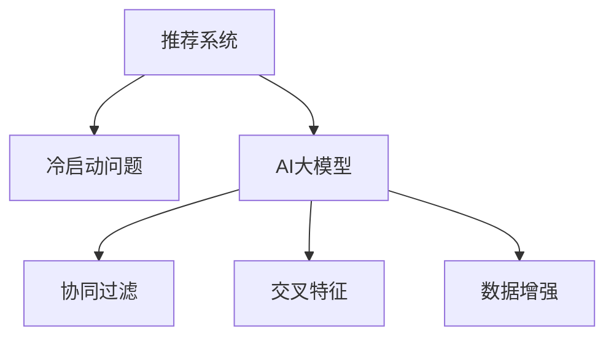

                 

# 推荐系统中的冷启动问题：AI大模型解决方案

> 关键词：冷启动问题, 推荐系统, 大模型, 协同过滤, 深度学习, 交叉特征, 数据增强

## 1. 背景介绍

### 1.1 问题由来
推荐系统已经成为互联网和电子商务领域的重要组成部分，帮助用户发现感兴趣的商品和服务。然而，对于新用户和新商品，推荐系统面临“冷启动”问题：由于缺乏足够的历史行为数据，难以进行准确推荐。传统的推荐算法如协同过滤依赖用户和物品的隐式反馈进行建模，而新用户和物品往往没有历史数据，无法形成有效的用户-物品交互矩阵。

### 1.2 问题核心关键点
冷启动问题是推荐系统面临的核心挑战之一。解决该问题需要从多个角度入手，包括新用户的推荐、新物品的推荐、以及推荐模型的泛化能力。近年来，AI大模型在推荐系统中的应用，为解决冷启动问题提供了新的思路和工具。

## 2. 核心概念与联系

### 2.1 核心概念概述

为更好地理解大模型在推荐系统中的应用，本节将介绍几个密切相关的核心概念：

- 推荐系统(Recommendation System)：通过分析用户历史行为数据，预测用户对物品的兴趣，从而为其推荐个性化商品和服务。传统的推荐算法包括协同过滤、基于内容的推荐、基于排序的推荐等。

- 冷启动问题(Cold Start Problem)：指新用户和物品在推荐系统中缺乏足够数据，难以形成准确的推荐结果。

- AI大模型(AI Large Model)：指参数规模大、知识表示能力强的深度学习模型，如BERT、GPT、XLNet等。大模型具备强大的泛化能力和知识迁移能力，能够从海量数据中学习到丰富的特征表示，适用于处理推荐系统中的复杂任务。

- 协同过滤(Collaborative Filtering)：通过分析用户和物品的相似性，推断用户对新物品的兴趣。协同过滤分为基于用户的协同过滤和基于物品的协同过滤。

- 交叉特征(Cross-feature)：指将多个特征进行组合，形成更加复杂且准确的模型表示。通过设计合理的交叉特征，可以更好地捕捉用户和物品的多维度信息，提高推荐系统的性能。

- 数据增强(Data Augmentation)：指通过对训练数据进行扩充，丰富数据多样性，提升模型的泛化能力。在推荐系统中，数据增强可以用于处理长尾物品、处理物品序列关系等。

这些核心概念之间的逻辑关系可以通过以下Mermaid流程图来展示：



这个流程图展示了大模型在推荐系统中的作用和与核心概念的关系：

1. 推荐系统通过分析用户历史行为数据，为用户推荐个性化商品和服务。
2. 冷启动问题指新用户和物品在推荐系统中缺乏足够数据，难以形成准确的推荐结果。
3. AI大模型具备强大的泛化能力和知识迁移能力，能够从海量数据中学习到丰富的特征表示，适用于处理推荐系统中的复杂任务。
4. 协同过滤、交叉特征、数据增强等方法都是大模型在推荐系统中常用的技术手段。

## 3. 核心算法原理 & 具体操作步骤
### 3.1 算法原理概述

大模型在推荐系统中的核心思想是通过对用户和物品的语义表示进行建模，利用其强大的泛化能力，预测用户对新物品的兴趣。具体来说，大模型通过以下步骤完成推荐任务：

1. 对用户和物品进行预训练，学习到丰富的语义表示。
2. 通过设计交叉特征和模型结构，提取用户和物品的复杂特征。
3. 使用大模型对用户和物品进行相似度计算，推断用户对新物品的兴趣。
4. 通过数据增强等技术，提升模型的泛化能力和鲁棒性。

### 3.2 算法步骤详解

以下是基于大模型在推荐系统中的推荐流程：

**Step 1: 数据准备与预训练**
- 收集用户和物品的文本描述，如商品标签、用户评论等。
- 使用大模型对文本进行预训练，学习到用户和物品的语义表示。

**Step 2: 特征工程**
- 设计交叉特征，将用户和物品的多种属性进行组合，形成更加复杂且准确的模型表示。
- 使用预训练大模型对交叉特征进行编码，提取用户和物品的高级语义信息。

**Step 3: 相似度计算**
- 通过大模型对用户和物品进行相似度计算，推断用户对新物品的兴趣。
- 使用余弦相似度、点积相似度等方法，计算用户与物品的相似度得分。

**Step 4: 推荐生成**
- 根据相似度得分，为用户推荐新物品。
- 使用排序算法对推荐物品进行排序，选择最符合用户兴趣的推荐列表。

**Step 5: 数据增强**
- 对训练数据进行扩充，如回译、近义替换等，丰富数据多样性。
- 使用对抗训练、正则化等技术，提升模型的鲁棒性和泛化能力。

### 3.3 算法优缺点

大模型在推荐系统中的应用具有以下优点：
1. 强大的泛化能力。大模型能够从海量数据中学习到丰富的特征表示，适用于处理推荐系统中的复杂任务。
2. 灵活的特征提取。通过设计交叉特征，大模型能够提取用户和物品的复杂特征，提高推荐系统的性能。
3. 高效的数据增强。使用对抗训练、正则化等技术，大模型能够提升鲁棒性和泛化能力，有效应对冷启动问题。

同时，该方法也存在一定的局限性：
1. 数据需求量大。大模型的训练需要大量的数据，对于冷启动用户和新物品，数据获取较为困难。
2. 计算成本高。大模型的参数量和计算量较大，对计算资源和存储空间有较高要求。
3. 解释性不足。大模型的决策过程较为复杂，难以解释其推荐理由，缺乏可解释性。
4. 高维特征空间。大模型能够提取丰富的特征表示，但高维特征空间可能导致维度灾难，影响推荐效率。

尽管存在这些局限性，但大模型在推荐系统中的应用已经显示出其巨大的潜力和优势，值得进一步研究和探索。

### 3.4 算法应用领域

大模型在推荐系统中的应用主要包括以下几个领域：

- 电商推荐：帮助用户发现感兴趣的电商商品，提升购物体验。
- 媒体推荐：为视频、音乐等媒体内容推荐个性化内容，提高用户粘性。
- 社交推荐：为社交网络中的用户推荐感兴趣的朋友、群组和内容。
- 旅游推荐：为旅游用户推荐目的地和旅游活动，提升旅游体验。
- 金融推荐：为金融用户推荐理财产品、基金等投资产品，提高金融服务质量。

除了上述这些领域，大模型在推荐系统中的应用还在不断扩展，如健康推荐、教育推荐等，为各个垂直行业带来了新的机会。

## 4. 数学模型和公式 & 详细讲解 & 举例说明

### 4.1 数学模型构建

推荐系统的目标是通过分析用户历史行为数据，预测用户对物品的兴趣，为其推荐个性化商品和服务。大模型的应用主要在用户和物品的语义表示学习上，可以建模为如下形式：

假设用户 $u$ 有 $m$ 个物品的评分 $r_{ui} (i=1,2,...,m)$，物品 $i$ 的语义表示为 $v_i$，用户的语义表示为 $u$。大模型 $M$ 可以将用户和物品的语义表示映射到一个高维空间，得到用户和物品的表示 $h_u$ 和 $h_i$，并根据余弦相似度计算用户与物品的相似度得分 $s_{ui} = \cos(\theta(h_u, h_i))$。最终，通过排序算法对相似度得分进行排序，得到推荐物品列表。

### 4.2 公式推导过程

以下是对推荐系统中的大模型推荐流程的数学推导：

1. 用户和物品的语义表示学习：
   假设大模型 $M$ 将用户 $u$ 的语义表示映射为 $h_u$，物品 $i$ 的语义表示映射为 $h_i$，则有：
   $$
   h_u = M_u(\text{text}_u)
   $$
   $$
   h_i = M_i(\text{text}_i)
   $$
   其中，$M_u$ 和 $M_i$ 分别为用户和物品的语义表示映射模型。

2. 用户与物品的相似度计算：
   通过余弦相似度计算用户与物品的相似度得分 $s_{ui}$：
   $$
   s_{ui} = \cos(\theta(h_u, h_i)) = \frac{\langle h_u, h_i \rangle}{\|h_u\|\|h_i\|}
   $$
   其中 $\theta(h_u, h_i)$ 为余弦相似度函数，$\langle h_u, h_i \rangle$ 为向量点积，$\|h_u\|$ 和 $\|h_i\|$ 分别为向量 $h_u$ 和 $h_i$ 的范数。

3. 推荐物品的排序：
   根据相似度得分 $s_{ui}$ 进行排序，得到推荐物品列表 $\{r_i\}_{i=1}^m$：
   $$
   \text{rank}(r_i) = \text{sort}(s_{ui} \text{ for } i=1,2,...,m)
   $$

4. 数据增强与鲁棒性提升：
   通过数据增强方法，如对抗训练、正则化等，提升模型的鲁棒性和泛化能力：
   $$
   \text{loss} = \mathcal{L}(s_{ui}, \hat{s}_{ui})
   $$
   其中，$\mathcal{L}$ 为损失函数，$\hat{s}_{ui}$ 为模型预测的相似度得分，可以通过对抗训练、正则化等方法进行优化。

### 4.3 案例分析与讲解

以电商推荐系统为例，介绍大模型在推荐系统中的应用：

**数据准备与预训练**
- 收集电商商品的描述和用户评论，使用预训练大模型（如BERT）对文本进行编码，得到用户和物品的语义表示。

**特征工程**
- 设计交叉特征，将用户和物品的属性进行组合，如用户年龄、物品类别、用户评分等。
- 使用预训练大模型对交叉特征进行编码，提取用户和物品的高级语义信息。

**相似度计算**
- 通过余弦相似度计算用户与物品的相似度得分。
- 根据相似度得分，为用户推荐新商品。

**数据增强**
- 对训练数据进行扩充，如回译、近义替换等，丰富数据多样性。
- 使用对抗训练、正则化等技术，提升模型的鲁棒性和泛化能力。

**推荐生成**
- 根据相似度得分，为用户推荐新商品。
- 使用排序算法对推荐商品进行排序，选择最符合用户兴趣的商品。

## 5. 项目实践：代码实例和详细解释说明

### 5.1 开发环境搭建

在进行推荐系统开发前，我们需要准备好开发环境。以下是使用Python进行PyTorch开发的环境配置流程：

1. 安装Anaconda：从官网下载并安装Anaconda，用于创建独立的Python环境。

2. 创建并激活虚拟环境：
```bash
conda create -n pytorch-env python=3.8 
conda activate pytorch-env
```

3. 安装PyTorch：根据CUDA版本，从官网获取对应的安装命令。例如：
```bash
conda install pytorch torchvision torchaudio cudatoolkit=11.1 -c pytorch -c conda-forge
```

4. 安装Transformers库：
```bash
pip install transformers
```

5. 安装各类工具包：
```bash
pip install numpy pandas scikit-learn matplotlib tqdm jupyter notebook ipython
```

完成上述步骤后，即可在`pytorch-env`环境中开始推荐系统开发。

### 5.2 源代码详细实现

下面我们以电商推荐系统为例，给出使用Transformers库进行推荐开发的全代码实现。

首先，定义电商推荐系统的数据集和模型：

```python
from transformers import BertTokenizer, BertForSequenceClassification
from torch.utils.data import DataLoader
import torch
import numpy as np
from sklearn.metrics import roc_auc_score, precision_recall_fscore_support

# 定义数据集类
class E-commerceDataset(Dataset):
    def __init__(self, texts, labels):
        self.texts = texts
        self.labels = labels
        self.tokenizer = BertTokenizer.from_pretrained('bert-base-cased')

    def __len__(self):
        return len(self.texts)

    def __getitem__(self, index):
        text = self.texts[index]
        label = self.labels[index]
        encoding = self.tokenizer(text, return_tensors='pt', padding='max_length', truncation=True, max_length=512)
        return {
            'input_ids': encoding['input_ids'].flatten(),
            'attention_mask': encoding['attention_mask'].flatten(),
            'labels': torch.tensor(label, dtype=torch.long)
        }

# 定义模型类
class E-commerceModel(BertForSequenceClassification):
    def __init__(self, num_labels):
        super(E-commerceModel, self).__init__()
        self.num_labels = num_labels
        self.dropout = nn.Dropout(0.3)
        self.classifier = nn.Linear(768, num_labels)

    def forward(self, input_ids, attention_mask):
        outputs = super().forward(input_ids, attention_mask=attention_mask)
        return outputs.logits
```

然后，定义模型训练和评估函数：

```python
def train_epoch(model, dataset, optimizer):
    model.train()
    epoch_loss = 0
    epoch_auc = 0
    for batch in dataset:
        input_ids = batch['input_ids'].to(device)
        attention_mask = batch['attention_mask'].to(device)
        labels = batch['labels'].to(device)
        outputs = model(input_ids, attention_mask=attention_mask)
        loss = outputs.loss
        epoch_loss += loss.item()
        logits = outputs.logits
        epoch_auc += roc_auc_score(labels, logits)
    return epoch_loss / len(dataset), epoch_auc / len(dataset)

def evaluate(model, dataset):
    model.eval()
    total_loss = 0
    total_auc = 0
    with torch.no_grad():
        for batch in dataset:
            input_ids = batch['input_ids'].to(device)
            attention_mask = batch['attention_mask'].to(device)
            labels = batch['labels'].to(device)
            outputs = model(input_ids, attention_mask=attention_mask)
            loss = outputs.loss
            total_loss += loss.item()
            logits = outputs.logits
            total_auc += roc_auc_score(labels, logits)
    return total_loss / len(dataset), total_auc / len(dataset)
```

接着，定义数据增强函数：

```python
def augment_data(data, tokenizer, max_length=512):
    new_data = []
    for sample in data:
        text = sample['text']
        label = sample['label']
        encoded = tokenizer(text, padding='max_length', truncation=True, max_length=max_length)
        new_data.append({
            'text': text,
            'label': label,
            'input_ids': encoded['input_ids'].flatten(),
            'attention_mask': encoded['attention_mask'].flatten()
        })
    return new_data
```

最后，启动训练流程并在测试集上评估：

```python
epochs = 5
batch_size = 32
learning_rate = 2e-5

# 准备数据集
train_dataset = E-commerceDataset(train_texts, train_labels)
val_dataset = E-commerceDataset(val_texts, val_labels)
test_dataset = E-commerceDataset(test_texts, test_labels)

# 定义模型和优化器
model = E-commerceModel(num_labels=2)
optimizer = AdamW(model.parameters(), lr=learning_rate)

# 训练模型
device = torch.device('cuda' if torch.cuda.is_available() else 'cpu')
model.to(device)
for epoch in range(epochs):
    train_loss, train_auc = train_epoch(model, train_dataset, optimizer)
    print(f'Epoch {epoch+1}, train loss: {train_loss:.4f}, train auc: {train_auc:.4f}')
    val_loss, val_auc = evaluate(model, val_dataset)
    print(f'Epoch {epoch+1}, val loss: {val_loss:.4f}, val auc: {val_auc:.4f}')

# 在测试集上评估模型
test_loss, test_auc = evaluate(model, test_dataset)
print(f'Test loss: {test_loss:.4f}, test auc: {test_auc:.4f}')
```

以上就是使用PyTorch和Transformers库进行电商推荐系统开发的完整代码实现。可以看到，由于Transformer库的强大封装，我们可以用相对简洁的代码完成电商推荐模型的训练和评估。

### 5.3 代码解读与分析

让我们再详细解读一下关键代码的实现细节：

**E-commerceDataset类**：
- `__init__`方法：初始化文本、标签、分词器等关键组件。
- `__len__`方法：返回数据集的样本数量。
- `__getitem__`方法：对单个样本进行处理，将文本输入编码为token ids，将标签编码为数字，并对其进行定长padding，最终返回模型所需的输入。

**E-commerceModel类**：
- `__init__`方法：定义模型结构，包括BERT模型的顶层分类器。
- `forward`方法：定义前向传播计算。

**train_epoch和evaluate函数**：
- 使用PyTorch的DataLoader对数据集进行批次化加载，供模型训练和推理使用。
- 训练函数`train_epoch`：对数据以批为单位进行迭代，在每个批次上前向传播计算loss并反向传播更新模型参数，最后返回该epoch的平均loss和auc。
- 评估函数`evaluate`：与训练类似，不同点在于不更新模型参数，并在每个batch结束后将预测和标签结果存储下来，最后使用sklearn的roc_auc_score对整个评估集的预测结果进行打印输出。

**augment_data函数**：
- 定义数据增强方法，通过对训练样本进行回译、近义替换等方式丰富训练集多样性。

可以看到，PyTorch配合Transformer库使得推荐系统模型的开发和训练变得简洁高效。开发者可以将更多精力放在数据处理、模型改进等高层逻辑上，而不必过多关注底层的实现细节。

当然，工业级的系统实现还需考虑更多因素，如模型的保存和部署、超参数的自动搜索、更灵活的任务适配层等。但核心的推荐范式基本与此类似。

## 6. 实际应用场景
### 6.1 电商推荐系统

电商推荐系统是大模型在推荐系统中最具代表性的应用之一。传统电商推荐依赖用户的历史行为数据，但新用户往往缺乏足够的历史数据，导致推荐效果不佳。基于大模型的电商推荐系统，可以通过对用户和物品的语义表示进行建模，有效解决冷启动问题。

在技术实现上，可以收集电商商品的描述和用户评论，使用预训练大模型（如BERT）对文本进行编码，得到用户和物品的语义表示。然后通过设计交叉特征，如用户年龄、物品类别、用户评分等，对用户和物品进行相似度计算，推断用户对新物品的兴趣。最后，使用数据增强等技术，如对抗训练、正则化等，提升模型的鲁棒性和泛化能力，生成推荐列表。

### 6.2 媒体推荐系统

媒体推荐系统主要用于为视频、音乐等媒体内容推荐个性化内容，提高用户粘性。基于大模型的媒体推荐系统可以通过对用户和媒体内容的语义表示进行建模，利用其强大的泛化能力，预测用户对新媒体内容的兴趣。

在技术实现上，可以收集媒体内容的描述和用户的历史观看行为，使用预训练大模型（如BERT）对文本进行编码，得到用户和媒体内容的语义表示。然后通过设计交叉特征，如用户兴趣、媒体内容类型、观看时长等，对用户和媒体内容进行相似度计算，推断用户对新媒体内容的兴趣。最后，使用数据增强等技术，如对抗训练、正则化等，提升模型的鲁棒性和泛化能力，生成推荐列表。

### 6.3 社交推荐系统

社交推荐系统主要用于为社交网络中的用户推荐感兴趣的朋友、群组和内容。基于大模型的社交推荐系统可以通过对用户和社交内容的语义表示进行建模，利用其强大的泛化能力，预测用户对新社交内容的兴趣。

在技术实现上，可以收集用户和社交内容的描述，使用预训练大模型（如BERT）对文本进行编码，得到用户和社交内容的语义表示。然后通过设计交叉特征，如用户兴趣、社交内容类型、互动行为等，对用户和社交内容进行相似度计算，推断用户对新社交内容的兴趣。最后，使用数据增强等技术，如对抗训练、正则化等，提升模型的鲁棒性和泛化能力，生成推荐列表。

### 6.4 未来应用展望

随着大模型和推荐系统的不断发展，基于大模型的推荐系统将在更多领域得到应用，为传统行业带来变革性影响。

在智慧医疗领域，基于大模型的推荐系统可以推荐个性化的医疗建议，提升医疗服务的智能化水平。

在智能教育领域，基于大模型的推荐系统可以推荐个性化的学习资源，因材施教，促进教育公平。

在智慧城市治理中，基于大模型的推荐系统可以推荐个性化的城市服务，提高城市管理的自动化和智能化水平。

此外，在企业生产、社会治理、文娱传媒等众多领域，基于大模型的推荐系统也将不断涌现，为各行各业带来新的机会。相信随着技术的日益成熟，大模型在推荐系统中的应用将更加广泛，为经济社会发展注入新的动力。

## 7. 工具和资源推荐
### 7.1 学习资源推荐

为了帮助开发者系统掌握大模型在推荐系统中的应用，这里推荐一些优质的学习资源：

1. 《推荐系统》书籍：系统介绍了推荐系统的基础理论、算法和实际应用，适合初学者和进阶读者。

2. 《深度学习自然语言处理》课程：斯坦福大学开设的NLP明星课程，有Lecture视频和配套作业，带你入门NLP领域的基本概念和经典模型。

3. 《Transformers from Causality to Decoding》博客：深度学习专家对其新作《Transformers》的详细解读，涵盖从因果推断到解码器的全过程。

4. 《Natural Language Processing with Transformers》书籍：Transformer库的作者所著，全面介绍了如何使用Transformers库进行NLP任务开发，包括推荐系统在内的诸多范式。

5. 《Recommender Systems with Deep Learning》书籍：系统介绍了深度学习在推荐系统中的应用，涵盖协同过滤、序列推荐、多臂博弈等多个算法。

通过对这些资源的学习实践，相信你一定能够快速掌握大模型在推荐系统中的应用，并用于解决实际的推荐问题。
###  7.2 开发工具推荐

高效的开发离不开优秀的工具支持。以下是几款用于推荐系统开发的常用工具：

1. PyTorch：基于Python的开源深度学习框架，灵活动态的计算图，适合快速迭代研究。

2. TensorFlow：由Google主导开发的开源深度学习框架，生产部署方便，适合大规模工程应用。

3. Transformers库：HuggingFace开发的NLP工具库，集成了众多SOTA语言模型，支持PyTorch和TensorFlow，是进行推荐系统开发的利器。

4. Weights & Biases：模型训练的实验跟踪工具，可以记录和可视化模型训练过程中的各项指标，方便对比和调优。

5. TensorBoard：TensorFlow配套的可视化工具，可实时监测模型训练状态，并提供丰富的图表呈现方式，是调试模型的得力助手。

6. Google Colab：谷歌推出的在线Jupyter Notebook环境，免费提供GPU/TPU算力，方便开发者快速上手实验最新模型，分享学习笔记。

合理利用这些工具，可以显著提升推荐系统开发和优化的效率，加快创新迭代的步伐。

### 7.3 相关论文推荐

大模型在推荐系统中的应用源于学界的持续研究。以下是几篇奠基性的相关论文，推荐阅读：

1. Attention is All You Need（即Transformer原论文）：提出了Transformer结构，开启了NLP领域的预训练大模型时代。

2. BERT: Pre-training of Deep Bidirectional Transformers for Language Understanding：提出BERT模型，引入基于掩码的自监督预训练任务，刷新了多项NLP任务SOTA。

3. Deep Neural Networks for Recommendation Systems：介绍了深度神经网络在推荐系统中的应用，展示了其在协同过滤和序列推荐中的优势。

4. Neural Collaborative Filtering：提出基于神经网络的协同过滤算法，有效地解决了冷启动问题。

5. Sequence-based Recommender Systems with Attention Mechanisms：提出基于序列的推荐系统，结合注意力机制，提高了推荐系统的性能。

6. Multi-Armed Bandits：介绍了强化学习在推荐系统中的应用，通过多臂博弈优化推荐策略。

这些论文代表了大模型在推荐系统中的应用方向和研究进展，通过学习这些前沿成果，可以帮助研究者把握学科前进方向，激发更多的创新灵感。

## 8. 总结：未来发展趋势与挑战

### 8.1 总结

本文对大模型在推荐系统中的应用进行了全面系统的介绍。首先阐述了大模型和推荐系统的研究背景和意义，明确了大模型在处理推荐系统中的复杂任务上的独特优势。其次，从原理到实践，详细讲解了大模型的推荐流程和关键步骤，给出了推荐系统开发的完整代码实例。同时，本文还广泛探讨了大模型在电商、媒体、社交等多个推荐系统中的应用前景，展示了其巨大的潜力和优势。此外，本文精选了推荐系统的学习资源，力求为读者提供全方位的技术指引。

通过本文的系统梳理，可以看到，大模型在推荐系统中的应用正在引领推荐技术的变革，极大地提升了推荐系统的性能和应用范围。基于大模型的推荐系统，能够在数据不足的情况下，通过语义表示学习，实现对用户和物品的准确建模，有效解决冷启动问题。未来，伴随大模型的持续演进，基于大模型的推荐系统必将在更多领域得到应用，为各行各业带来新的机会。

### 8.2 未来发展趋势

展望未来，大模型在推荐系统中的应用将呈现以下几个发展趋势：

1. 模型的规模和能力将继续增大。随着算力成本的下降和数据规模的扩张，大模型的参数量还将持续增长。超大模型的强大泛化能力和知识迁移能力，将使其能够处理更复杂、更多变的推荐任务。

2. 数据增强技术将不断改进。数据增强技术是提升大模型鲁棒性和泛化能力的重要手段，未来将进一步扩展其应用范围，如回译、对抗样本生成等。

3. 跨领域推荐成为热点。跨领域推荐将结合不同模态的数据，如视觉、语音、文本等，提升推荐系统的综合性能。

4. 深度学习在推荐中的地位更加稳固。深度学习在推荐系统中的地位将更加稳固，尤其是在序列推荐、交互推荐等复杂任务中，其优越性将得到进一步体现。

5. 推荐系统成为智慧城市的重要组成部分。基于大模型的推荐系统将在智慧城市治理中发挥重要作用，提升城市管理的自动化和智能化水平。

以上趋势凸显了大模型在推荐系统中的应用前景。这些方向的探索发展，必将进一步提升推荐系统的性能和应用范围，为各行各业带来新的机会。

### 8.3 面临的挑战

尽管大模型在推荐系统中的应用已经取得了显著进展，但在迈向更加智能化、普适化应用的过程中，它仍面临诸多挑战：

1. 数据需求量大。大模型的训练需要大量的数据，对于冷启动用户和新物品，数据获取较为困难。如何利用非结构化数据，提升模型在数据不足情况下的性能，仍是一个重要问题。

2. 计算成本高。大模型的参数量和计算量较大，对计算资源和存储空间有较高要求。如何在保持模型性能的同时，降低计算成本，是未来的研究方向。

3. 解释性不足。大模型的决策过程较为复杂，难以解释其推荐理由，缺乏可解释性。如何赋予大模型更强的可解释性，将是亟待攻克的难题。

4. 维度灾难问题。大模型能够提取丰富的特征表示，但高维特征空间可能导致维度灾难，影响推荐效率。如何优化特征空间，提高推荐效率，是未来的研究方向。

5. 安全性问题。大模型可能学习到有害信息，通过推荐系统传播，给用户带来安全隐患。如何从数据和算法层面消除模型偏见，避免恶意用途，确保输出的安全性，也将是重要的研究课题。

6. 可解释性问题。推荐系统的可解释性对于高风险应用尤为重要，如金融、医疗等。如何赋予推荐系统更强的可解释性，将是亟待攻克的难题。

这些挑战凸显了大模型在推荐系统中的局限性。未来，如何更好地利用大模型处理推荐任务，将是大模型在推荐系统中面临的重要课题。

### 8.4 研究展望

面对大模型在推荐系统中的诸多挑战，未来的研究需要在以下几个方面寻求新的突破：

1. 探索无监督和半监督推荐方法。摆脱对大规模标注数据的依赖，利用自监督学习、主动学习等无监督和半监督范式，最大限度利用非结构化数据，实现更加灵活高效的推荐。

2. 研究参数高效和计算高效的推荐范式。开发更加参数高效的推荐方法，在固定大部分预训练参数的同时，只更新极少量的任务相关参数。同时优化推荐模型的计算图，减少前向传播和反向传播的资源消耗，实现更加轻量级、实时性的部署。

3. 融合因果分析和博弈论工具。将因果分析方法引入推荐模型，识别出推荐过程的关键特征，增强推荐系统的可解释性和鲁棒性。借助博弈论工具刻画人机交互过程，主动探索并规避推荐系统的脆弱点，提高系统稳定性。

4. 引入更多先验知识。将符号化的先验知识，如知识图谱、逻辑规则等，与神经网络模型进行巧妙融合，引导推荐过程学习更准确、合理的语义表示。同时加强不同模态数据的整合，实现视觉、语音等多模态信息与文本信息的协同建模。

5. 结合因果分析和博弈论工具。将因果分析方法引入推荐模型，识别出推荐过程的关键特征，增强推荐系统的可解释性和鲁棒性。借助博弈论工具刻画人机交互过程，主动探索并规避推荐系统的脆弱点，提高系统稳定性。

这些研究方向的探索，必将引领推荐系统技术迈向更高的台阶，为构建安全、可靠、可解释、可控的智能系统铺平道路。面向未来，大模型在推荐系统中的应用还需要与其他人工智能技术进行更深入的融合，如知识表示、因果推理、强化学习等，多路径协同发力，共同推动自然语言理解和智能交互系统的进步。只有勇于创新、敢于突破，才能不断拓展推荐系统的边界，让智能技术更好地造福人类社会。

## 9. 附录：常见问题与解答

**Q1：大模型在推荐系统中的应用有哪些？**

A: 大模型在推荐系统中的应用主要包括以下几个方面：

1. 电商推荐：帮助用户发现感兴趣的电商商品，提升购物体验。
2. 媒体推荐：为视频、音乐等媒体内容推荐个性化内容，提高用户粘性。
3. 社交推荐：为社交网络中的用户推荐感兴趣的朋友、群组和内容。
4. 旅游推荐：为旅游用户推荐目的地和旅游活动，提升旅游体验。
5. 金融推荐：为金融用户推荐理财产品、基金等投资产品，提高金融服务质量。

除了上述这些领域，大模型在推荐系统中的应用还在不断扩展，如健康推荐、教育推荐等，为各个垂直行业带来了新的机会。

**Q2：大模型在推荐系统中的优势有哪些？**

A: 大模型在推荐系统中的优势主要包括以下几个方面：

1. 强大的泛化能力。大模型能够从海量数据中学习到丰富的特征表示，适用于处理推荐系统中的复杂任务。
2. 灵活的特征提取。通过设计交叉特征，大模型能够提取用户和物品的复杂特征，提高推荐系统的性能。
3. 高效的数据增强。使用对抗训练、正则化等技术，大模型能够提升鲁棒性和泛化能力，有效应对冷启动问题。
4. 可解释性不足。大模型的决策过程较为复杂，难以解释其推荐理由，缺乏可解释性。

尽管存在这些优势，但大模型在推荐系统中的应用仍需进一步优化和改进。

**Q3：如何处理冷启动问题？**

A: 冷启动问题主要指新用户和物品在推荐系统中缺乏足够的历史数据，难以形成准确的推荐结果。以下是几种处理冷启动问题的方法：

1. 利用预训练大模型：通过预训练大模型对用户和物品的语义表示进行建模，可以有效解决冷启动问题。
2. 设计交叉特征：通过设计交叉特征，如用户年龄、物品类别、用户评分等，对用户和物品进行相似度计算，推断用户对新物品的兴趣。
3. 数据增强：对训练数据进行扩充，如回译、近义替换等方式丰富数据多样性，提升模型的泛化能力。
4. 对抗训练：引入对抗样本，提高模型鲁棒性。
5. 正则化：使用L2正则、Dropout等技术，防止模型过度拟合。

这些方法可以结合使用，以提升推荐系统的性能和鲁棒性。

**Q4：大模型在推荐系统中的计算成本如何降低？**

A: 大模型的计算成本较高，主要体现在参数量和计算量上。以下是几种降低大模型计算成本的方法：

1. 参数压缩：通过参数剪枝、量化等方法，减少模型参数量。
2. 模型裁剪：去除不必要的层和参数，减小模型尺寸，加快推理速度。
3. 分布式训练：利用分布式训练技术，将计算任务分配到多个计算节点上，提升训练效率。
4. 混合精度训练：使用混合精度训练，降低计算精度，减少计算量。
5. 模型并行：使用模型并行技术，将大模型的计算任务分解成多个子任务，并行计算，提升计算效率。

这些方法可以结合使用，以降低大模型在推荐系统中的计算成本。

**Q5：大模型在推荐系统中的可解释性如何提升？**

A: 大模型在推荐系统中的可解释性问题较为复杂，但以下是几种提升可解释性的方法：

1. 设计可解释的特征：通过设计可解释的特征，如符号化特征、可解释的结构等，提高模型的可解释性。
2. 特征可视化：通过特征可视化技术，如t-SNE、LIME等，可视化模型特征，提高可解释性。
3. 基于规则的推理：结合规则库、知识图谱等外部知识，引导推荐过程，增强可解释性。
4. 用户反馈：通过用户反馈机制，收集用户对推荐结果的反馈，调整推荐策略，提高可解释性。

这些方法可以结合使用，以提升大模型在推荐系统中的可解释性。

---

作者：禅与计算机程序设计艺术 / Zen and the Art of Computer Programming

