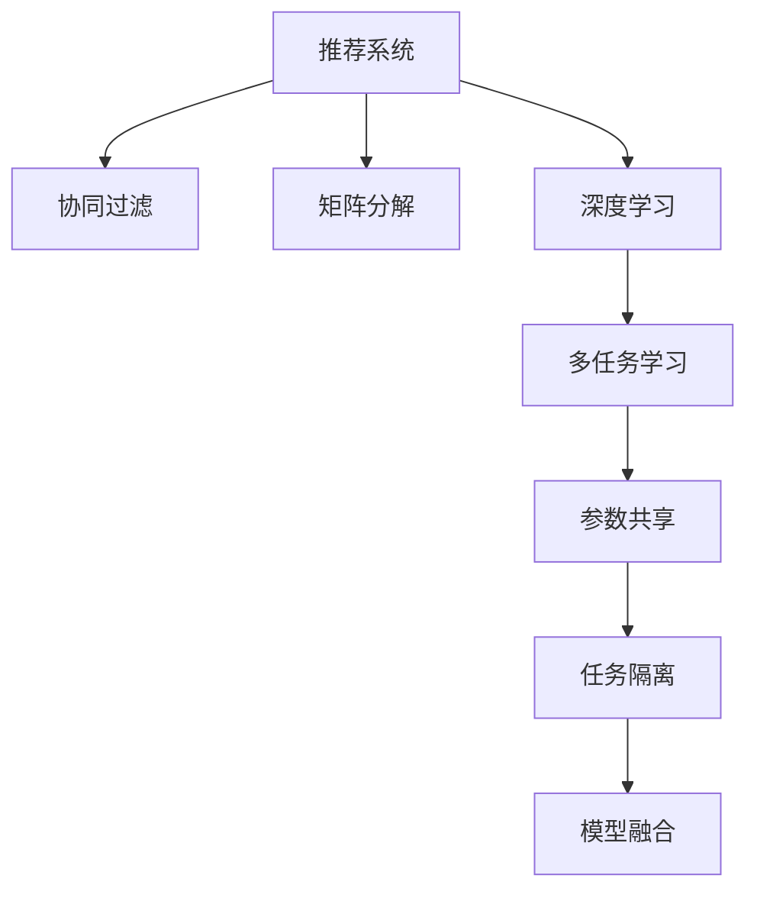

                 

# 推荐系统中的多任务学习技术

## 1. 背景介绍

### 1.1 问题由来
推荐系统作为互联网平台的核心业务之一，其优化效果直接影响了用户体验和平台收益。传统推荐系统大多基于协同过滤、矩阵分解等模型，然而这些方法在处理稀疏数据、低维度和高阶数据交互等方面存在局限性。近年来，随着深度学习技术的迅猛发展，基于神经网络的推荐系统方法逐渐兴起，通过学习用户-物品的隐含表示关系，取得了显著的推荐效果。

在基于神经网络的推荐系统中，预训练大模型（如BERT、GPT-3等）也被引入到推荐任务中，通过大规模的无标签文本数据预训练获得丰富的语义和知识表示，然后利用小规模的标注数据进行微调，获得针对特定任务的推荐模型。然而，这种单任务微调的方法存在一些局限，比如模型泛化能力受限于标签数据量、难以充分利用模型结构中丰富的表示能力。

为了进一步提升推荐系统的表现，研究者提出将多任务学习引入推荐系统。多任务学习（Multitask Learning, MTL）通过利用多个相关任务之间的共享知识和共同特征，提高模型在多个任务上的性能。在推荐系统中，可以结合用户行为、物品属性、上下文信息等不同维度的数据，进行多任务学习，获得更全面、准确的推荐结果。

### 1.2 问题核心关键点
多任务学习在推荐系统中的核心关键点包括：
- 任务共享：如何有效利用不同任务之间的共享知识，提升模型在各个任务上的性能。
- 任务隔离：如何在共享知识的基础上，避免任务之间的干扰和影响，保证模型在各个任务上的独立性。
- 参数共享：如何在不同任务之间共享参数，减少参数量，提升模型训练效率。
- 模型融合：如何融合不同任务的结果，获得更好的推荐效果。

## 2. 核心概念与联系

### 2.1 核心概念概述

为更好地理解多任务学习在推荐系统中的应用，本节将介绍几个密切相关的核心概念：

- **推荐系统(Recommender System)**：基于用户的历史行为数据、物品属性信息等，推荐用户可能感兴趣物品的系统。
- **协同过滤(Collaborative Filtering)**：通过用户-物品交互矩阵，对用户和物品进行建模，推荐相似用户或物品。
- **矩阵分解(Matrix Factorization)**：将用户-物品评分矩阵分解为用户向量和物品向量，进行推荐。
- **深度学习(Depth Learning)**：基于多层神经网络，学习高维表示关系，进行推荐。
- **多任务学习(Multitask Learning)**：利用多个相关任务之间的共享知识和共同特征，提高模型在多个任务上的性能。
- **参数共享(Parameter Sharing)**：在不同任务之间共享参数，减少参数量，提升模型训练效率。
- **任务隔离(Task Isolation)**：在共享知识的基础上，避免任务之间的干扰和影响，保证模型在各个任务上的独立性。
- **模型融合(Model Fusion)**：融合不同任务的结果，获得更好的推荐效果。

这些核心概念之间的逻辑关系可以通过以下Mermaid流程图来展示：



这个流程图展示了一个推荐系统的任务流：从原始的协同过滤、矩阵分解和深度学习，到利用多任务学习提升模型性能，最后通过参数共享和任务隔离优化模型，最终融合不同任务的结果，获得高质量的推荐结果。

## 3. 核心算法原理 & 具体操作步骤
### 3.1 算法原理概述

多任务学习在推荐系统中的核心思想是：利用不同任务之间的共享知识和共同特征，提高模型在多个任务上的性能。其核心算法包括联合训练（Joint Training）、特征共享（Feature Sharing）、联合优化（Joint Optimization）等。

具体来说，多任务学习通过以下步骤进行：
1. 收集推荐系统的多任务数据，包括用户行为、物品属性、上下文信息等。
2. 设计多个相关任务，如用户-物品评分预测、用户兴趣分类、物品属性预测等。
3. 构建联合训练框架，将不同任务的模型参数共享，共同优化目标函数。
4. 在多个任务之间分配资源，避免过度拟合和信息泄露。
5. 在训练过程中，通过软权重调整不同任务的贡献，提升模型在各个任务上的性能。

### 3.2 算法步骤详解

基于多任务学习在推荐系统中的应用，本文将详细讲解其主要算法步骤：

**Step 1: 任务定义与数据准备**
- 定义多个相关任务，如用户-物品评分预测、用户兴趣分类、物品属性预测等。
- 收集推荐系统的多任务数据，包括用户行为数据、物品属性数据、上下文信息等。
- 对数据进行预处理，如归一化、特征选择等，准备进入模型训练。

**Step 2: 模型选择与联合训练**
- 选择适合的多任务学习模型，如联合训练模型、特征共享模型、联合优化模型等。
- 定义不同任务的损失函数，如交叉熵、均方误差等。
- 设计联合训练框架，将不同任务的模型参数共享，共同优化目标函数。

**Step 3: 资源分配与任务隔离**
- 在训练过程中，对不同任务分配不同比例的资源，避免过度拟合。
- 通过软权重调整不同任务的贡献，平衡模型在各个任务上的性能。
- 利用任务隔离技术，避免不同任务之间的干扰和影响。

**Step 4: 模型融合与推荐结果**
- 在联合训练完成后，对不同任务的结果进行融合，获得最终的推荐结果。
- 使用不同的融合策略，如平均、加权平均、投票等，获得最优的推荐效果。

**Step 5: 测试与优化**
- 在测试集上评估模型的推荐效果，对比联合训练前后的性能提升。
- 利用在线A/B测试，不断优化模型参数和资源分配，提高推荐系统的效果。

以上是基于多任务学习在推荐系统中的主要算法步骤。在实际应用中，还需要根据具体任务和数据特点进行优化设计，如改进联合训练目标函数、引入更多的任务隔离技术、探索更灵活的模型融合策略等，以进一步提升模型的性能。

### 3.3 算法优缺点

多任务学习在推荐系统中的应用具有以下优点：
1. 利用多任务共享知识，提升模型在多个任务上的性能。
2. 减少参数量，提升模型训练效率。
3. 增加模型鲁棒性，避免过拟合。
4. 提高推荐效果，增强用户体验。

同时，该方法也存在一些局限性：
1. 任务定义复杂，需要明确不同任务之间的关系。
2. 任务隔离技术需要精心设计，避免信息泄露。
3. 模型融合策略需要不断优化，提升推荐效果。
4. 资源分配问题复杂，需要精细调参。

尽管存在这些局限性，但就目前而言，多任务学习已成为推荐系统的重要研究范式。未来相关研究的重点在于如何进一步简化任务定义、优化任务隔离和模型融合策略，提高多任务学习的鲁棒性和可扩展性。

### 3.4 算法应用领域

多任务学习在推荐系统中的应用领域已经得到了广泛的应用，包括但不限于以下几个方面：

1. **个性化推荐**：利用用户行为数据，进行个性化推荐。
2. **商品分类与推荐**：利用物品属性信息，进行商品分类与推荐。
3. **情境推荐**：利用上下文信息，进行情境推荐。
4. **协同过滤增强**：利用协同过滤模型，增强推荐效果。
5. **多模态推荐**：利用图像、文本等多模态信息，进行综合推荐。

除了上述这些经典应用外，多任务学习还被创新性地应用于更多场景中，如社交网络推荐、电商推荐、音乐推荐等，为推荐系统带来了新的突破。随着多任务学习方法的不断进步，相信推荐系统必将在更广阔的应用领域大放异彩。

## 4. 数学模型和公式 & 详细讲解  
### 4.1 数学模型构建

本节将使用数学语言对基于多任务学习在推荐系统中的应用进行更加严格的刻画。

设推荐系统包含多个任务 $T_1, T_2, ..., T_n$，每个任务的训练集为 $D_i=\{(x_i,y_i)\}_{i=1}^{m_i}$，其中 $x_i$ 为输入特征，$y_i$ 为任务 $T_i$ 的目标标签。假设联合训练的模型参数为 $\theta$，目标为最小化多个任务的联合损失函数：

$$
\mathcal{L}(\theta) = \sum_{i=1}^{n} \frac{1}{m_i} \sum_{j=1}^{m_i} \ell_i(x_j, \hat{y}_i(x_j; \theta))
$$

其中 $\ell_i$ 为任务 $T_i$ 的损失函数，$\hat{y}_i$ 为模型对任务 $T_i$ 的预测结果。

在实际应用中，模型参数 $\theta$ 通常包含多个模块的权重，如用户向量和物品向量、任务之间的共享参数等。因此，联合训练的目标函数可以进一步表示为：

$$
\mathcal{L}(\theta) = \sum_{i=1}^{n} \frac{1}{m_i} \sum_{j=1}^{m_i} \ell_i(x_j, \hat{y}_i(x_j; \theta))
$$

其中 $x_j$ 为第 $j$ 个样本的特征向量，$\ell_i$ 为任务 $T_i$ 的损失函数，$\theta$ 为模型参数，包含多个子模块的权重。

### 4.2 公式推导过程

以下我们以协同过滤增强为例，推导多任务学习在推荐系统中的目标函数及其梯度计算。

假设协同过滤模型为 $F(x,y) = W_x^T x + W_y^T y$，其中 $W_x$ 和 $W_y$ 分别为用户向量和物品向量。设协同过滤模型为目标函数，多任务学习模型为目标函数 $G(x,y) = F(x,y) + \lambda_1 (y - \hat{y}_1(x,y; \theta_1)) + \lambda_2 (y - \hat{y}_2(x,y; \theta_2))$，其中 $\hat{y}_1$ 和 $\hat{y}_2$ 分别为用户兴趣分类和物品属性预测的目标函数，$\theta_1$ 和 $\theta_2$ 分别为用户兴趣分类和物品属性预测的模型参数。

联合训练的目标函数为：

$$
\mathcal{L}(\theta) = \frac{1}{N} \sum_{i=1}^{N} \ell(F(x_i,y_i), y_i)
$$

其中 $N$ 为训练样本数，$\ell$ 为联合训练模型的损失函数。

假设联合训练模型的梯度为 $\nabla_{\theta} \mathcal{L}(\theta)$，则联合训练的梯度更新公式为：

$$
\theta \leftarrow \theta - \eta \nabla_{\theta} \mathcal{L}(\theta)
$$

其中 $\eta$ 为学习率。

对于每个任务的目标函数，我们假设其梯度为 $\nabla_{\theta_i} \ell_i(x,y; \theta_i)$，则任务 $T_i$ 的梯度更新公式为：

$$
\theta_i \leftarrow \theta_i - \eta \nabla_{\theta_i} \ell_i(x,y; \theta_i)
$$

将以上公式代入联合训练的梯度更新公式，得到联合训练的梯度更新公式：

$$
\theta \leftarrow \theta - \eta (\nabla_{\theta} \mathcal{L}(\theta) + \lambda_1 \nabla_{\theta_1} \ell_1(x,y; \theta_1) + \lambda_2 \nabla_{\theta_2} \ell_2(x,y; \theta_2))
$$

其中 $\lambda_1$ 和 $\lambda_2$ 为不同任务之间的权重，用于平衡不同任务在联合训练中的贡献。

## 5. 项目实践：代码实例和详细解释说明
### 5.1 开发环境搭建

在进行多任务学习推荐系统实践前，我们需要准备好开发环境。以下是使用Python进行TensorFlow开发的环境配置流程：

1. 安装Anaconda：从官网下载并安装Anaconda，用于创建独立的Python环境。

2. 创建并激活虚拟环境：
```bash
conda create -n tf-env python=3.8 
conda activate tf-env
```

3. 安装TensorFlow：根据CUDA版本，从官网获取对应的安装命令。例如：
```bash
conda install tensorflow==2.4 -c tensorflow
```

4. 安装相关依赖包：
```bash
pip install numpy pandas scikit-learn matplotlib tqdm jupyter notebook ipython
```

完成上述步骤后，即可在`tf-env`环境中开始多任务学习推荐系统的开发。

### 5.2 源代码详细实现

这里我们以协同过滤增强为例，给出使用TensorFlow对协同过滤模型进行多任务学习推荐系统的代码实现。

首先，定义协同过滤模型的预测函数：

```python
import tensorflow as tf

def collaborative_filtering_predict(x, y, w_x, w_y):
    user_vector = tf.matmul(x, w_x)
    item_vector = tf.matmul(y, w_y)
    scores = tf.reduce_sum(user_vector * item_vector, axis=1)
    return scores
```

然后，定义多任务学习模型的预测函数：

```python
def multitask_learning_predict(x, y, w_x, w_y, theta_1, theta_2):
    scores = collaborative_filtering_predict(x, y, w_x, w_y)
    user_interest = tf.matmul(x, theta_1)
    item_attribute = tf.matmul(y, theta_2)
    scores += lambda_1 * tf.reduce_mean(user_interest, axis=1)
    scores += lambda_2 * tf.reduce_mean(item_attribute, axis=1)
    return scores
```

接着，定义损失函数：

```python
def multitask_learning_loss(scores, y):
    return tf.reduce_mean(tf.nn.sigmoid_cross_entropy_with_logits(logits=scores, labels=y))
```

然后，定义优化器：

```python
learning_rate = 0.01
optimizer = tf.keras.optimizers.Adam(learning_rate=learning_rate)
```

最后，定义训练函数：

```python
def train_epoch(model, dataset, batch_size, optimizer):
    model.train()
    for batch in dataset:
        x_batch, y_batch = batch
        with tf.GradientTape() as tape:
            scores = multitask_learning_predict(x_batch, y_batch, model.w_x, model.w_y, model.theta_1, model.theta_2)
            loss = multitask_learning_loss(scores, y_batch)
        gradients = tape.gradient(loss, model.trainable_variables)
        optimizer.apply_gradients(zip(gradients, model.trainable_variables))
```

在模型训练过程中，还需要引入softmax函数和交叉熵损失函数，具体代码实现如下：

```python
def softmax(x):
    return tf.nn.softmax(x)

def cross_entropy(y_true, y_pred):
    return tf.reduce_mean(tf.nn.sparse_softmax_cross_entropy_with_logits(labels=y_true, logits=y_pred))
```

在模型训练完成后，进行模型评估和预测，具体代码实现如下：

```python
def evaluate(model, dataset, batch_size):
    model.eval()
    total_loss = 0
    for batch in dataset:
        x_batch, y_batch = batch
        with tf.GradientTape() as tape:
            scores = multitask_learning_predict(x_batch, y_batch, model.w_x, model.w_y, model.theta_1, model.theta_2)
            loss = multitask_learning_loss(scores, y_batch)
        total_loss += loss.numpy()
    return total_loss / len(dataset)

def predict(model, x, y):
    return softmax(multitask_learning_predict(x, y, model.w_x, model.w_y, model.theta_1, model.theta_2))
```

以上就是使用TensorFlow对协同过滤模型进行多任务学习推荐系统的完整代码实现。可以看到，TensorFlow提供了一系列高效的API，使得多任务学习模型的开发和训练变得简单快捷。

### 5.3 代码解读与分析

让我们再详细解读一下关键代码的实现细节：

**协同过滤预测函数**：
- 使用矩阵乘法计算用户向量和物品向量的点积，得到协同过滤模型的预测结果。

**多任务学习预测函数**：
- 在协同过滤模型的预测结果上，添加用户兴趣分类和物品属性预测的结果。
- 使用softmax函数将预测结果转化为概率分布。

**损失函数**：
- 使用交叉熵损失函数计算预测结果与真实标签之间的差异。

**优化器**：
- 使用Adam优化器，设定学习率为0.01。

**训练函数**：
- 在每个批次上，使用梯度计算和反向传播更新模型参数。

**模型评估函数**：
- 在测试集上，计算所有批次的损失平均值，返回总损失。

**预测函数**：
- 对输入数据进行多任务学习预测，并使用softmax函数将结果转化为概率分布。

在实际应用中，还需要考虑模型的保存、部署和优化等问题。例如，使用TensorFlow的Saver机制保存模型，使用TensorBoard进行模型可视化，使用TensorFlow的Estimator接口进行模型部署等。

## 6. 实际应用场景
### 6.1 电商推荐系统

在电商推荐系统中，基于多任务学习的方法可以结合用户行为数据、物品属性数据和上下文信息，进行多任务学习，提升推荐效果。具体来说，可以设计多个相关任务，如用户兴趣分类、物品属性预测、上下文推荐等，通过多任务学习共同优化模型参数，获得更好的推荐结果。

### 6.2 社交网络推荐

在社交网络推荐中，基于多任务学习的方法可以结合用户社交关系、兴趣爱好、历史行为等多维度的数据，进行多任务学习，提升推荐效果。例如，可以设计多个相关任务，如好友推荐、兴趣文章推荐、热门话题推荐等，通过多任务学习共同优化模型参数，获得更加个性化的推荐结果。

### 6.3 视频推荐系统

在视频推荐系统中，基于多任务学习的方法可以结合用户行为数据、视频属性数据和上下文信息，进行多任务学习，提升推荐效果。例如，可以设计多个相关任务，如视频标签预测、用户兴趣分类、视频时长预测等，通过多任务学习共同优化模型参数，获得更加精准的推荐结果。

### 6.4 音乐推荐系统

在音乐推荐系统中，基于多任务学习的方法可以结合用户行为数据、歌曲属性数据和上下文信息，进行多任务学习，提升推荐效果。例如，可以设计多个相关任务，如用户兴趣分类、歌曲风格预测、热门歌曲推荐等，通过多任务学习共同优化模型参数，获得更加多样化的推荐结果。

### 6.5 未来应用展望

随着多任务学习方法的不断进步，基于多任务学习的推荐系统必将在更多领域得到应用，为各行业的推荐场景带来新的突破。

在智慧医疗领域，基于多任务学习的方法可以结合医生诊断数据、患者症状数据和历史病例数据，进行多任务学习，提升医疗推荐效果。例如，可以设计多个相关任务，如疾病预测、药物推荐、手术建议等，通过多任务学习共同优化模型参数，获得更加准确的医疗推荐结果。

在智能交通领域，基于多任务学习的方法可以结合交通流量数据、气象数据和用户出行数据，进行多任务学习，提升交通推荐效果。例如，可以设计多个相关任务，如路线规划、出行建议、安全提醒等，通过多任务学习共同优化模型参数，获得更加安全的交通推荐结果。

在金融理财领域，基于多任务学习的方法可以结合用户消费数据、金融市场数据和金融产品数据，进行多任务学习，提升理财推荐效果。例如，可以设计多个相关任务，如理财方案推荐、风险评估、收益预测等，通过多任务学习共同优化模型参数，获得更加合理的理财推荐结果。

总之，多任务学习在推荐系统中的应用前景广阔，未来必将在更多领域带来变革性影响。随着推荐系统的持续演进和优化，相信基于多任务学习的推荐方法将成为推荐系统的重要范式，推动推荐系统向更高效、个性化、多样化的方向发展。

## 7. 工具和资源推荐
### 7.1 学习资源推荐

为了帮助开发者系统掌握多任务学习在推荐系统中的应用，这里推荐一些优质的学习资源：

1. 《深度学习推荐系统》系列博文：由深度学习专家撰写，深入浅出地介绍了推荐系统、协同过滤、矩阵分解、深度学习等基本概念和算法。

2. 《Multitask Learning for Recommendation Systems》论文：介绍了多任务学习在推荐系统中的应用，提供了大量的实验数据和结果分析。

3. 《Multitask Learning in Recommendation Systems》书籍：详细讲解了多任务学习在推荐系统中的应用，包括协同过滤增强、多模态推荐、序列推荐等前沿技术。

4. 《Neural Networks and Deep Learning》书籍：DeepLearning.ai的在线课程，由深度学习专家Andrew Ng主讲，深入讲解了深度学习在推荐系统中的应用。

5. Kaggle推荐系统竞赛：利用Kaggle平台上的推荐系统竞赛数据，进行多任务学习推荐系统的开发和优化，积累实战经验。

通过对这些资源的学习实践，相信你一定能够快速掌握多任务学习在推荐系统中的应用，并用于解决实际的推荐问题。

### 7.2 开发工具推荐

高效的开发离不开优秀的工具支持。以下是几款用于多任务学习推荐系统开发的常用工具：

1. TensorFlow：基于Python的开源深度学习框架，支持分布式计算和模型优化，适合大规模模型训练。

2. PyTorch：基于Python的开源深度学习框架，灵活性高，适合快速迭代研究。

3. TensorBoard：TensorFlow配套的可视化工具，可实时监测模型训练状态，提供丰富的图表呈现方式，帮助调试模型。

4. HuggingFace Transformers库：提供了多种预训练语言模型和推荐模型，支持多任务学习推荐系统的开发。

5. Weights & Biases：模型训练的实验跟踪工具，可以记录和可视化模型训练过程中的各项指标，方便对比和调优。

6. Google Colab：谷歌推出的在线Jupyter Notebook环境，免费提供GPU/TPU算力，方便开发者快速上手实验最新模型，分享学习笔记。

合理利用这些工具，可以显著提升多任务学习推荐系统的开发效率，加快创新迭代的步伐。

### 7.3 相关论文推荐

多任务学习在推荐系统中的应用研究已经取得了丰硕成果，以下是几篇奠基性的相关论文，推荐阅读：

1. A Generalized Multi-Task Learning Method for Personalized Recommendation Systems：提出了一种通用的多任务学习方法，应用于个性化推荐系统中。

2. Multi-task Learning for Collaborative Filtering：将多任务学习应用于协同过滤推荐系统中，提升了推荐系统的性能。

3. Multi-task Deep Network for Recommendation Systems：利用深度神经网络进行多任务学习推荐，获得了更好的推荐效果。

4. Multi-task Learning in Recommendation Systems with Adaptive Weighting：提出了多任务学习在推荐系统中的Adaptive Weighting方法，提升了模型的泛化能力。

5. Multi-Task Learning for Recommendation with Subtask-Agnostic Self-Directed Learning：提出了多任务学习在推荐系统中的Self-Directed Learning方法，提高了模型的推荐效果。

这些论文代表了多任务学习在推荐系统中的应用进展，通过学习这些前沿成果，可以帮助研究者把握学科前进方向，激发更多的创新灵感。

## 8. 总结：未来发展趋势与挑战
### 8.1 总结

本文对基于多任务学习在推荐系统中的应用进行了全面系统的介绍。首先阐述了推荐系统的背景和问题由来，明确了多任务学习在推荐系统中的核心关键点。其次，从原理到实践，详细讲解了多任务学习的数学模型和算法步骤，给出了多任务学习推荐系统的代码实例。同时，本文还广泛探讨了多任务学习在多个行业领域的应用前景，展示了多任务学习的巨大潜力。最后，本文精选了多任务学习的学习资源、开发工具和相关论文，力求为读者提供全方位的技术指引。

通过本文的系统梳理，可以看到，基于多任务学习在推荐系统中的应用已经成为推荐系统的重要研究范式，极大地拓展了推荐系统的应用边界，催生了更多的落地场景。随着推荐系统的持续演进和优化，相信基于多任务学习的推荐方法将成为推荐系统的重要范式，推动推荐系统向更高效、个性化、多样化的方向发展。

### 8.2 未来发展趋势

展望未来，多任务学习在推荐系统中的应用将呈现以下几个发展趋势：

1. 多任务学习算法不断优化。随着算法研究的不断深入，新的多任务学习算法将被提出，进一步提升推荐系统的性能。

2. 模型融合策略不断改进。新的融合方法将被提出，以提升推荐系统的综合表现。

3. 多模态推荐不断推进。结合图像、文本、语音等多种模态的信息，进行多任务学习，获得更全面、精准的推荐结果。

4. 多任务学习将应用于更多场景。推荐系统只是多任务学习应用的一个领域，未来将拓展到更多的业务场景中。

5. 多任务学习与深度学习结合。深度学习技术在推荐系统中的应用将得到更深入的研究，与多任务学习进行结合，提升推荐系统的性能。

6. 多任务学习与强化学习结合。多任务学习与强化学习相结合，将提升推荐系统的智能性和适应性。

以上趋势凸显了多任务学习在推荐系统中的广阔前景。这些方向的探索发展，必将进一步提升推荐系统的性能和应用范围，为推荐系统带来更多的创新和突破。

### 8.3 面临的挑战

尽管多任务学习在推荐系统中的应用已经取得了显著成果，但在迈向更加智能化、普适化应用的过程中，它仍面临着诸多挑战：

1. 任务定义复杂。不同任务之间的关系复杂，需要精心设计。

2. 任务隔离技术复杂。不同任务之间的干扰和影响需要精心设计，避免信息泄露。

3. 模型融合策略复杂。不同任务的结果融合策略需要不断优化，提升推荐效果。

4. 资源分配问题复杂。不同任务的资源分配需要精心调参，平衡性能和效率。

5. 模型鲁棒性不足。多任务学习模型在多个任务上的鲁棒性需要进一步提高。

尽管存在这些挑战，但随着技术的不断进步和算力的不断提升，多任务学习在推荐系统中的应用前景广阔。相信在未来，多任务学习将成为推荐系统的重要范式，推动推荐系统向更高效、个性化、多样化的方向发展。

### 8.4 研究展望

面对多任务学习在推荐系统中的挑战，未来的研究需要在以下几个方面寻求新的突破：

1. 探索新的多任务学习算法。设计更加高效、灵活的多任务学习算法，提升推荐系统的性能。

2. 优化任务隔离和模型融合策略。提出更加复杂、合理的多任务学习任务隔离和模型融合策略，提升推荐系统的综合表现。

3. 结合深度学习和强化学习。将深度学习和强化学习技术与多任务学习相结合，提升推荐系统的智能性和适应性。

4. 利用多模态信息。结合图像、文本、语音等多种模态的信息，进行多任务学习，提升推荐系统的表现。

5. 引入任务自适应机制。引入任务自适应机制，动态调整不同任务之间的权重，提升多任务学习的泛化能力。

6. 增强模型鲁棒性。设计更加鲁棒的多任务学习模型，增强推荐系统在不同场景下的表现。

这些研究方向的探索，必将引领多任务学习在推荐系统中的进一步发展，为推荐系统带来更多的创新和突破。面向未来，多任务学习在推荐系统中的应用必将继续深化，推动推荐系统向更高效、个性化、多样化的方向发展。

## 9. 附录：常见问题与解答
**Q1：多任务学习和协同过滤有什么不同？**

A: 多任务学习和协同过滤都是推荐系统中的重要技术，但两者在模型构建和优化目标上有显著不同。协同过滤主要基于用户行为数据，通过用户-物品交互矩阵进行建模，而多任务学习则是通过多个相关任务之间的共享知识和共同特征，提升模型在多个任务上的性能。

**Q2：多任务学习在推荐系统中如何避免信息泄露？**

A: 多任务学习在推荐系统中可以采用任务隔离技术，避免不同任务之间的信息泄露。具体来说，可以设计不同的模型参数，对不同任务进行独立优化，避免任务之间的信息干扰。此外，还可以使用正则化技术，如L2正则、Dropout等，减少不同任务之间的耦合。

**Q3：多任务学习和联合训练有什么区别？**

A: 多任务学习和联合训练都是多任务学习中的重要概念。联合训练是指将多个任务的模型参数共享，共同优化目标函数，提升模型在多个任务上的性能。而多任务学习则是利用多个相关任务之间的共享知识和共同特征，提升模型在多个任务上的性能。

**Q4：多任务学习在推荐系统中如何提升推荐效果？**

A: 多任务学习在推荐系统中通过利用不同任务之间的共享知识和共同特征，提升模型在多个任务上的性能。具体来说，可以设计多个相关任务，如用户兴趣分类、物品属性预测等，通过多任务学习共同优化模型参数，获得更好的推荐结果。

**Q5：多任务学习在推荐系统中如何设计目标函数？**

A: 多任务学习在推荐系统中的目标函数可以通过联合训练框架进行设计。具体来说，可以将多个任务的损失函数进行加权，最小化联合损失函数，提升模型在多个任务上的性能。同时，还可以使用软权重调整不同任务的贡献，平衡模型在各个任务上的性能。

---

作者：禅与计算机程序设计艺术 / Zen and the Art of Computer Programming

