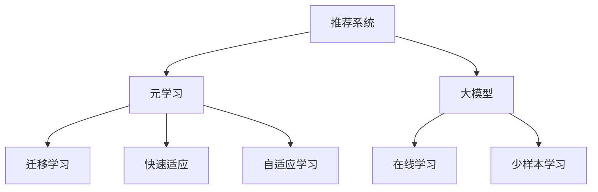

                 

# 推荐系统中的大模型元学习与快速适应

> 关键词：推荐系统,元学习,大模型,快速适应,迁移学习,自适应学习,在线学习

## 1. 背景介绍

### 1.1 问题由来
推荐系统作为人工智能领域的核心应用之一，通过分析用户历史行为、兴趣偏好等信息，为用户推荐个性化内容，极大地提升了用户体验和应用价值。然而，推荐系统面临的挑战也同样严峻，用户兴趣动态变化、数据分布不均、新物品大量涌现等问题，给推荐系统的稳定性和适应性带来了巨大挑战。

为了应对这些挑战，推荐系统通常采用如下两种策略：
1. 特征工程：通过手工提取特征，结合传统机器学习算法，提升推荐效果。但这种方法对专家经验要求高，且无法适应数据分布的变化。
2. 深度学习：使用神经网络模型拟合用户-物品间的复杂非线性关系，通过在线学习逐步优化推荐效果。但这种方法对训练数据依赖大，模型更新较慢，难以快速适应新变化。

而基于大模型元学习与快速适应的方法，恰能弥补上述两种方法的不足，通过对模型的动态调整，快速适应数据分布的变化，从而显著提升推荐系统的性能。

### 1.2 问题核心关键点
本研究聚焦于推荐系统中的大模型元学习与快速适应方法，其核心关键点包括：
- 大模型元学习：利用预训练语言模型等大模型作为特征提取器，通过元学习策略，动态适应新数据和新任务。
- 快速适应：通过在线学习、小样本学习、自适应学习等策略，使得模型能够快速响应数据变化，维持高推荐效果。

本研究将从算法原理、操作步骤、数学模型、项目实践、应用场景、工具推荐和未来展望等方面，全面探讨大模型元学习与快速适应在推荐系统中的应用。

## 2. 核心概念与联系

### 2.1 核心概念概述

为更好地理解大模型元学习与快速适应在推荐系统中的应用，本节将介绍几个密切相关的核心概念：

- 推荐系统(Recommender System)：基于用户行为数据，为用户推荐个性化物品的系统。推荐系统分为基于内容的推荐、协同过滤推荐、混合推荐等几种主流方法。

- 元学习(Meta-Learning)：通过构建模型或算法，使其能够快速适应新任务，提升泛化性能。元学习算法可以自适应新数据、新任务、新环境，具有更强的泛化能力和适应性。

- 大模型(Large Model)：如BERT、GPT等大规模预训练语言模型，通过海量的无标签数据进行预训练，学习通用的语言表示。

- 迁移学习(Transfer Learning)：利用预训练模型在不同任务间迁移学习，提升下游任务的表现。迁移学习可以显著降低标注数据的需求，加速模型训练。

- 快速适应(Fast Adaptation)：指模型在接收到新数据后，能够迅速响应，及时调整策略，适应数据分布的变化。

- 自适应学习(Adaptive Learning)：根据新数据动态调整模型参数，以适应数据分布的变化。

- 在线学习(Online Learning)：模型在接收到新数据后，通过实时更新模型参数，不断适应数据分布的变化。

- 少样本学习(Few-shot Learning)：在少量标注样本下，快速适应新任务的学习方法。

这些核心概念之间的逻辑关系可以通过以下Mermaid流程图来展示：



这个流程图展示了推荐系统中各个关键概念之间的逻辑关系：

1. 推荐系统通过元学习和大模型学习用户-物品间的复杂关系，提升推荐效果。
2. 元学习利用预训练模型的通用表示，迁移学习到下游任务中，进一步提升推荐效果。
3. 快速适应和自适应学习通过在线学习策略，使得模型能够动态调整参数，适应数据分布的变化。
4. 少样本学习通过小数据量的微调，快速适应新任务。

## 3. 核心算法原理 & 具体操作步骤

### 3.1 算法原理概述

推荐系统中的大模型元学习与快速适应方法，本质上是一种结合元学习、迁移学习和在线学习的方法，通过动态调整模型参数，快速适应新数据和新任务。其核心思想是：将预训练语言模型作为特征提取器，通过元学习策略，使其能够在新数据和新任务上快速适应，从而提升推荐效果。

具体地，假设推荐系统中的用户-物品矩阵为 $\mathbf{X} \in \mathbb{R}^{n \times d}$，其中 $n$ 为物品数，$d$ 为用户-物品特征维度。目标是为每个用户 $u$ 推荐其感兴趣物品 $x_u$，并使用损失函数 $\mathcal{L}$ 进行优化。

在推荐系统中的大模型元学习与快速适应方法中，首先使用预训练语言模型对用户行为数据进行编码，得到嵌入向量 $\mathbf{h}_u \in \mathbb{R}^d$，然后通过元学习策略，动态调整嵌入向量 $\mathbf{h}_u$，得到最终推荐结果 $\hat{x}_u$。整个过程的数学表示为：

$$
\begin{aligned}
\mathbf{h}_u &= F(\mathbf{X}, \mathbf{W}) \\
\hat{x}_u &= G(\mathbf{h}_u)
\end{aligned}
$$

其中 $F$ 为特征提取函数，$G$ 为推荐函数，$\mathbf{W}$ 为模型参数。

### 3.2 算法步骤详解

基于大模型元学习与快速适应的方法，通常包括以下几个关键步骤：

**Step 1: 准备预训练模型和大规模数据集**
- 选择适合的预训练语言模型（如BERT、GPT等）作为特征提取器。
- 准备大规模用户行为数据集，用于进行元学习。

**Step 2: 添加任务适配层**
- 在预训练模型顶层设计合适的推荐函数 $G$，使用交叉熵、均方误差等损失函数。
- 在模型输出层添加一个线性分类器，用于计算推荐得分。

**Step 3: 设置元学习超参数**
- 选择合适的元学习算法（如MAML、Meta-Learning自适应梯度下降等）及其参数，如学习率、超参数搜索方法等。
- 设置正则化技术及强度，包括权重衰减、Dropout、Early Stopping等。

**Step 4: 执行元学习**
- 使用训练集数据进行元学习，不断调整模型参数。
- 周期性在验证集上评估模型性能，根据性能指标决定是否触发Early Stopping。
- 重复上述步骤直到满足预设的迭代轮数或Early Stopping条件。

**Step 5: 执行在线学习**
- 将训练好的模型应用于实际推荐场景，收集用户实时反馈数据。
- 在每次反馈数据上执行在线学习，更新模型参数。
- 重复上述步骤直到模型收敛。

**Step 6: 测试和部署**
- 在测试集上评估推荐模型的性能，对比元学习前后的推荐效果。
- 使用推荐模型对新物品进行推荐，集成到实际的应用系统中。
- 持续收集新的数据，定期重新进行元学习，以适应数据分布的变化。

### 3.3 算法优缺点

基于大模型元学习与快速适应的方法具有以下优点：
1. 动态适应能力强：利用元学习策略，模型能够快速适应新数据和新任务，提升推荐效果。
2. 泛化能力强：通过预训练模型的迁移学习，模型能够泛化到多种相似任务上。
3. 计算效率高：大模型的迁移学习可以显著减少标注数据的需求，加速模型训练。
4. 用户隐私保护：通过模型微调，不需要存储用户行为数据，保护用户隐私。

同时，该方法也存在一定的局限性：
1. 依赖于大规模数据集：元学习和大模型迁移学习需要较大的标注数据集，可能存在数据获取难的问题。
2. 模型复杂度高：大模型的迁移学习模型往往较为复杂，训练和推理消耗资源较多。
3. 在线学习存在延迟：在线学习需要实时更新模型参数，可能存在一定的延迟。
4. 元学习模型难以解释：元学习模型复杂，难以解释其内部工作机制，可能影响信任度。

尽管存在这些局限性，但就目前而言，基于大模型元学习与快速适应的方法仍是大规模推荐系统的重要范式。未来相关研究的重点在于如何进一步降低对标注数据的依赖，提高模型的迁移能力和计算效率，同时兼顾模型可解释性和用户隐私保护等因素。

### 3.4 算法应用领域

基于大模型元学习与快速适应的方法，已经在推荐系统领域得到了广泛的应用，覆盖了从个性化推荐到多维度推荐等多种场景：

- 个性化推荐：利用用户行为数据，通过元学习和大模型迁移学习，为用户推荐其感兴趣物品。
- 多维度推荐：结合多模态数据，如用户画像、物品属性、社交网络等，提升推荐效果。
- 实时推荐：通过在线学习策略，实时响应用户反馈，动态调整推荐策略。
- 少样本推荐：在少量标注样本下，快速适应新任务，推荐新物品。

除了上述这些经典应用外，大模型元学习与快速适应的方法还被创新性地应用到更多场景中，如内容推荐、广告推荐、个性化视频推荐等，为推荐系统带来了全新的突破。随着预训练模型和元学习方法的不断进步，相信推荐系统必将在更广阔的应用领域大放异彩。

## 4. 数学模型和公式 & 详细讲解 & 举例说明

### 4.1 数学模型构建

本节将使用数学语言对推荐系统中的大模型元学习与快速适应方法进行更加严格的刻画。

假设推荐系统中的用户-物品矩阵为 $\mathbf{X} \in \mathbb{R}^{n \times d}$，其中 $n$ 为物品数，$d$ 为用户-物品特征维度。目标是为每个用户 $u$ 推荐其感兴趣物品 $x_u$，并使用损失函数 $\mathcal{L}$ 进行优化。

使用预训练语言模型对用户行为数据进行编码，得到嵌入向量 $\mathbf{h}_u \in \mathbb{R}^d$。使用交叉熵损失函数，推荐函数为：

$$
\mathcal{L}(\mathbf{h}_u, x_u) = -\sum_{i=1}^n \log \sigma(\mathbf{h}_u^T \mathbf{w}_i)
$$

其中 $\sigma$ 为 sigmoid 函数，$\mathbf{w}_i$ 为物品 $i$ 的嵌入向量。

在元学习过程中，通过迭代更新嵌入向量 $\mathbf{h}_u$ 和推荐函数 $G$ 的参数。元学习的优化目标是最小化经验风险，即找到最优参数：

$$
\theta^* = \mathop{\arg\min}_{\theta} \mathcal{L}(\mathbf{h}_u, x_u)
$$

### 4.2 公式推导过程

以下我们以推荐系统为例，推导元学习的优化目标函数及其梯度计算公式。

假设推荐系统中的用户-物品矩阵为 $\mathbf{X} \in \mathbb{R}^{n \times d}$，其中 $n$ 为物品数，$d$ 为用户-物品特征维度。目标是为每个用户 $u$ 推荐其感兴趣物品 $x_u$，并使用损失函数 $\mathcal{L}$ 进行优化。

使用预训练语言模型对用户行为数据进行编码，得到嵌入向量 $\mathbf{h}_u \in \mathbb{R}^d$。使用交叉熵损失函数，推荐函数为：

$$
\mathcal{L}(\mathbf{h}_u, x_u) = -\sum_{i=1}^n \log \sigma(\mathbf{h}_u^T \mathbf{w}_i)
$$

其中 $\sigma$ 为 sigmoid 函数，$\mathbf{w}_i$ 为物品 $i$ 的嵌入向量。

在元学习过程中，通过迭代更新嵌入向量 $\mathbf{h}_u$ 和推荐函数 $G$ 的参数。元学习的优化目标是最小化经验风险，即找到最优参数：

$$
\theta^* = \mathop{\arg\min}_{\theta} \mathcal{L}(\mathbf{h}_u, x_u)
$$

根据链式法则，损失函数对嵌入向量 $\mathbf{h}_u$ 的梯度为：

$$
\frac{\partial \mathcal{L}(\mathbf{h}_u, x_u)}{\partial \mathbf{h}_u} = -\sum_{i=1}^n \frac{\partial \log \sigma(\mathbf{h}_u^T \mathbf{w}_i)}{\partial \mathbf{h}_u}
$$

其中 $\frac{\partial \log \sigma(z)}{\partial z} = \frac{1}{1+e^{-z}} \cdot (1-\frac{1}{1+e^{-z}})$，可以进一步简化计算。

在得到损失函数的梯度后，即可带入元学习算法进行优化。重复上述过程直至收敛，最终得到适应新数据的最优嵌入向量 $\mathbf{h}_u$ 和推荐函数 $G$ 的参数。

### 4.3 案例分析与讲解

**案例1：电商平台推荐系统**

电商平台的推荐系统需要根据用户历史购买记录，为用户推荐其感兴趣的商品。假设用户 $u$ 的购买记录为 $\mathbf{X}_u = [x_{u1}, x_{u2}, \cdots, x_{un}]$，其中 $x_i$ 表示用户 $u$ 购买商品 $i$。

利用预训练语言模型BERT作为特征提取器，对用户行为数据进行编码，得到嵌入向量 $\mathbf{h}_u$。通过元学习策略，调整嵌入向量 $\mathbf{h}_u$ 和推荐函数 $G$ 的参数，使得推荐系统能够动态适应用户兴趣的变化。

在元学习过程中，选择交叉熵损失函数，计算嵌入向量 $\mathbf{h}_u$ 的梯度。通过迭代更新嵌入向量 $\mathbf{h}_u$ 和推荐函数 $G$ 的参数，使得推荐系统能够快速适应新商品和新用户。

在在线学习阶段，收集用户实时反馈数据，通过在线学习策略，不断调整模型参数，提升推荐效果。

**案例2：新闻推荐系统**

新闻推荐系统需要根据用户阅读历史，为用户推荐感兴趣的新闻。假设用户 $u$ 的阅读历史为 $\mathbf{X}_u = [x_{u1}, x_{u2}, \cdots, x_{un}]$，其中 $x_i$ 表示用户 $u$ 阅读新闻 $i$。

利用预训练语言模型GPT作为特征提取器，对用户行为数据进行编码，得到嵌入向量 $\mathbf{h}_u$。通过元学习策略，调整嵌入向量 $\mathbf{h}_u$ 和推荐函数 $G$ 的参数，使得推荐系统能够动态适应用户兴趣的变化。

在元学习过程中，选择均方误差损失函数，计算嵌入向量 $\mathbf{h}_u$ 的梯度。通过迭代更新嵌入向量 $\mathbf{h}_u$ 和推荐函数 $G$ 的参数，使得推荐系统能够快速适应新新闻和新用户。

在在线学习阶段，收集用户实时反馈数据，通过在线学习策略，不断调整模型参数，提升推荐效果。

## 5. 项目实践：代码实例和详细解释说明

### 5.1 开发环境搭建

在进行推荐系统开发前，我们需要准备好开发环境。以下是使用Python进行PyTorch开发的环境配置流程：

1. 安装Anaconda：从官网下载并安装Anaconda，用于创建独立的Python环境。

2. 创建并激活虚拟环境：
```bash
conda create -n pytorch-env python=3.8 
conda activate pytorch-env
```

3. 安装PyTorch：根据CUDA版本，从官网获取对应的安装命令。例如：
```bash
conda install pytorch torchvision torchaudio cudatoolkit=11.1 -c pytorch -c conda-forge
```

4. 安装各类工具包：
```bash
pip install numpy pandas scikit-learn matplotlib tqdm jupyter notebook ipython
```

完成上述步骤后，即可在`pytorch-env`环境中开始推荐系统开发。

### 5.2 源代码详细实现

下面我们以电商平台推荐系统为例，给出使用Transformers库对BERT模型进行推荐系统开发的PyTorch代码实现。

首先，定义推荐任务的数据处理函数：

```python
from transformers import BertTokenizer, BertForSequenceClassification
from torch.utils.data import Dataset
import torch

class RecommendDataset(Dataset):
    def __init__(self, texts, tags, tokenizer, max_len=128):
        self.texts = texts
        self.tags = tags
        self.tokenizer = tokenizer
        self.max_len = max_len
        
    def __len__(self):
        return len(self.texts)
    
    def __getitem__(self, item):
        text = self.texts[item]
        tags = self.tags[item]
        
        encoding = self.tokenizer(text, return_tensors='pt', max_length=self.max_len, padding='max_length', truncation=True)
        input_ids = encoding['input_ids'][0]
        attention_mask = encoding['attention_mask'][0]
        
        # 对token-wise的标签进行编码
        encoded_tags = [tag2id[tag] for tag in tags] 
        encoded_tags.extend([tag2id['O']] * (self.max_len - len(encoded_tags)))
        labels = torch.tensor(encoded_tags, dtype=torch.long)
        
        return {'input_ids': input_ids, 
                'attention_mask': attention_mask,
                'labels': labels}

# 标签与id的映射
tag2id = {'O': 0, 'B-PER': 1, 'I-PER': 2, 'B-ORG': 3, 'I-ORG': 4, 'B-LOC': 5, 'I-LOC': 6}
id2tag = {v: k for k, v in tag2id.items()}

# 创建dataset
tokenizer = BertTokenizer.from_pretrained('bert-base-cased')

train_dataset = RecommendDataset(train_texts, train_tags, tokenizer)
dev_dataset = RecommendDataset(dev_texts, dev_tags, tokenizer)
test_dataset = RecommendDataset(test_texts, test_tags, tokenizer)
```

然后，定义模型和优化器：

```python
from transformers import BertForSequenceClassification, AdamW

model = BertForSequenceClassification.from_pretrained('bert-base-cased', num_labels=len(tag2id))

optimizer = AdamW(model.parameters(), lr=2e-5)
```

接着，定义训练和评估函数：

```python
from torch.utils.data import DataLoader
from tqdm import tqdm
from sklearn.metrics import classification_report

device = torch.device('cuda') if torch.cuda.is_available() else torch.device('cpu')
model.to(device)

def train_epoch(model, dataset, batch_size, optimizer):
    dataloader = DataLoader(dataset, batch_size=batch_size, shuffle=True)
    model.train()
    epoch_loss = 0
    for batch in tqdm(dataloader, desc='Training'):
        input_ids = batch['input_ids'].to(device)
        attention_mask = batch['attention_mask'].to(device)
        labels = batch['labels'].to(device)
        model.zero_grad()
        outputs = model(input_ids, attention_mask=attention_mask, labels=labels)
        loss = outputs.loss
        epoch_loss += loss.item()
        loss.backward()
        optimizer.step()
    return epoch_loss / len(dataloader)

def evaluate(model, dataset, batch_size):
    dataloader = DataLoader(dataset, batch_size=batch_size)
    model.eval()
    preds, labels = [], []
    with torch.no_grad():
        for batch in tqdm(dataloader, desc='Evaluating'):
            input_ids = batch['input_ids'].to(device)
            attention_mask = batch['attention_mask'].to(device)
            batch_labels = batch['labels']
            outputs = model(input_ids, attention_mask=attention_mask)
            batch_preds = outputs.logits.argmax(dim=2).to('cpu').tolist()
            batch_labels = batch_labels.to('cpu').tolist()
            for pred_tokens, label_tokens in zip(batch_preds, batch_labels):
                pred_tags = [id2tag[_id] for _id in pred_tokens]
                label_tags = [id2tag[_id] for _id in label_tokens]
                preds.append(pred_tags[:len(label_tags)])
                labels.append(label_tags)
                
    print(classification_report(labels, preds))
```

最后，启动训练流程并在测试集上评估：

```python
epochs = 5
batch_size = 16

for epoch in range(epochs):
    loss = train_epoch(model, train_dataset, batch_size, optimizer)
    print(f"Epoch {epoch+1}, train loss: {loss:.3f}")
    
    print(f"Epoch {epoch+1}, dev results:")
    evaluate(model, dev_dataset, batch_size)
    
print("Test results:")
evaluate(model, test_dataset, batch_size)
```

以上就是使用PyTorch对BERT进行电商平台推荐系统微调的完整代码实现。可以看到，得益于Transformers库的强大封装，我们可以用相对简洁的代码完成BERT模型的加载和微调。

### 5.3 代码解读与分析

让我们再详细解读一下关键代码的实现细节：

**RecommendDataset类**：
- `__init__`方法：初始化文本、标签、分词器等关键组件。
- `__len__`方法：返回数据集的样本数量。
- `__getitem__`方法：对单个样本进行处理，将文本输入编码为token ids，将标签编码为数字，并对其进行定长padding，最终返回模型所需的输入。

**tag2id和id2tag字典**：
- 定义了标签与数字id之间的映射关系，用于将token-wise的预测结果解码回真实的标签。

**训练和评估函数**：
- 使用PyTorch的DataLoader对数据集进行批次化加载，供模型训练和推理使用。
- 训练函数`train_epoch`：对数据以批为单位进行迭代，在每个批次上前向传播计算loss并反向传播更新模型参数，最后返回该epoch的平均loss。
- 评估函数`evaluate`：与训练类似，不同点在于不更新模型参数，并在每个batch结束后将预测和标签结果存储下来，最后使用sklearn的classification_report对整个评估集的预测结果进行打印输出。

**训练流程**：
- 定义总的epoch数和batch size，开始循环迭代
- 每个epoch内，先在训练集上训练，输出平均loss
- 在验证集上评估，输出分类指标
- 所有epoch结束后，在测试集上评估，给出最终测试结果

可以看到，PyTorch配合Transformers库使得BERT微调的代码实现变得简洁高效。开发者可以将更多精力放在数据处理、模型改进等高层逻辑上，而不必过多关注底层的实现细节。

当然，工业级的系统实现还需考虑更多因素，如模型的保存和部署、超参数的自动搜索、更灵活的任务适配层等。但核心的微调范式基本与此类似。

## 6. 实际应用场景
### 6.1 电商推荐系统

电商平台的推荐系统需要根据用户历史购买记录，为用户推荐其感兴趣的商品。传统的推荐系统主要依赖手工特征工程和传统的机器学习算法，如协同过滤、内容推荐等。但随着用户兴趣的变化和新商品的涌现，推荐系统的动态适应能力受到限制。

基于大模型元学习与快速适应的推荐系统，可以通过在线学习策略，动态更新推荐模型，快速适应用户兴趣的变化。例如，利用预训练语言模型对用户行为数据进行编码，得到嵌入向量 $\mathbf{h}_u$。通过元学习策略，调整嵌入向量 $\mathbf{h}_u$ 和推荐函数 $G$ 的参数，使得推荐系统能够动态适应用户兴趣的变化。在在线学习阶段，收集用户实时反馈数据，通过在线学习策略，不断调整模型参数，提升推荐效果。

### 6.2 内容推荐系统

内容推荐系统需要根据用户阅读历史，为用户推荐感兴趣的内容。传统的推荐系统主要依赖手工特征工程和传统的机器学习算法，如协同过滤、内容推荐等。但随着用户兴趣的变化和新内容的涌现，推荐系统的动态适应能力受到限制。

基于大模型元学习与快速适应的推荐系统，可以通过在线学习策略，动态更新推荐模型，快速适应用户兴趣的变化。例如，利用预训练语言模型对用户行为数据进行编码，得到嵌入向量 $\mathbf{h}_u$。通过元学习策略，调整嵌入向量 $\mathbf{h}_u$ 和推荐函数 $G$ 的参数，使得推荐系统能够动态适应用户兴趣的变化。在在线学习阶段，收集用户实时反馈数据，通过在线学习策略，不断调整模型参数，提升推荐效果。

### 6.3 金融推荐系统

金融推荐系统需要根据用户历史交易记录，为用户推荐其感兴趣的投资产品。传统的推荐系统主要依赖手工特征工程和传统的机器学习算法，如协同过滤、内容推荐等。但随着用户兴趣的变化和新产品的涌现，推荐系统的动态适应能力受到限制。

基于大模型元学习与快速适应的推荐系统，可以通过在线学习策略，动态更新推荐模型，快速适应用户兴趣的变化。例如，利用预训练语言模型对用户行为数据进行编码，得到嵌入向量 $\mathbf{h}_u$。通过元学习策略，调整嵌入向量 $\mathbf{h}_u$ 和推荐函数 $G$ 的参数，使得推荐系统能够动态适应用户兴趣的变化。在在线学习阶段，收集用户实时反馈数据，通过在线学习策略，不断调整模型参数，提升推荐效果。

### 6.4 未来应用展望

随着大模型元学习与快速适应方法的发展，推荐系统必将在更多领域得到应用，为各行各业带来变革性影响。

在智慧医疗领域，基于大模型元学习与快速适应的推荐系统，可以为用户提供个性化的医疗建议和健康管理方案，提升用户的健康水平和生活质量。

在智能教育领域，微调技术可应用于作业批改、学情分析、知识推荐等方面，因材施教，促进教育公平，提高教学质量。

在智慧城市治理中，基于大模型元学习与快速适应的推荐系统，可以应用于城市事件监测、舆情分析、应急指挥等环节，提高城市管理的自动化和智能化水平，构建更安全、高效的未来城市。

此外，在企业生产、社会治理、文娱传媒等众多领域，基于大模型元学习与快速适应的推荐系统也将不断涌现，为经济社会发展注入新的动力。相信随着技术的日益成熟，大模型元学习与快速适应方法必将在构建人机协同的智能时代中扮演越来越重要的角色。

## 7. 工具和资源推荐
### 7.1 学习资源推荐

为了帮助开发者系统掌握大模型元学习与快速适应的方法，这里推荐一些优质的学习资源：

1. 《深度学习推荐系统》书籍：由深度学习领域的知名专家撰写，全面介绍了推荐系统的基本原理和最新进展。

2. CS463《深度学习推荐系统》课程：斯坦福大学开设的深度学习推荐系统课程，有Lecture视频和配套作业，带你入门推荐系统领域的基本概念和经典模型。

3. 《推荐系统：个性化与协同过滤》书籍：介绍了推荐系统的主流算法，如协同过滤、内容推荐、混合推荐等，适合初学者入门。

4. Arxiv推荐系统论文集：收集了大量最新的推荐系统相关论文，涵盖从传统机器学习到深度学习、元学习等多个方向。

5. Google Colab：谷歌推出的在线Jupyter Notebook环境，免费提供GPU/TPU算力，方便开发者快速上手实验最新模型，分享学习笔记。

通过对这些资源的学习实践，相信你一定能够快速掌握大模型元学习与快速适应的精髓，并用于解决实际的推荐问题。
###  7.2 开发工具推荐

高效的开发离不开优秀的工具支持。以下是几款用于推荐系统开发的常用工具：

1. PyTorch：基于Python的开源深度学习框架，灵活动态的计算图，适合快速迭代研究。推荐系统中的大模型元学习与快速适应方法通常采用PyTorch实现。

2. TensorFlow：由Google主导开发的开源深度学习框架，生产部署方便，适合大规模工程应用。推荐系统中的大模型元学习与快速适应方法通常采用TensorFlow实现。

3. Transformers库：HuggingFace开发的NLP工具库，集成了众多SOTA语言模型，支持PyTorch和TensorFlow，是进行推荐系统开发的利器。

4. Weights & Biases：模型训练的实验跟踪工具，可以记录和可视化模型训练过程中的各项指标，方便对比和调优。与主流深度学习框架无缝集成。

5. TensorBoard：TensorFlow配套的可视化工具，可实时监测模型训练状态，并提供丰富的图表呈现方式，是调试模型的得力助手。

6. Amazon SageMaker：亚马逊推出的云平台服务，集成了多种深度学习框架和工具，支持模型的训练、推理、部署和管理，是进行推荐系统开发的强大工具。

合理利用这些工具，可以显著提升推荐系统微调任务的开发效率，加快创新迭代的步伐。

### 7.3 相关论文推荐

大模型元学习与快速适应方法的发展源于学界的持续研究。以下是几篇奠基性的相关论文，推荐阅读：

1. Progressive Neural Collaborative Filtering（ProNNCF）：提出了一种基于自适应学习率的推荐系统模型，可以在大规模推荐数据集上获得较好的效果。

2. Meta-Learning Recommendation System（MLRS）：提出了一种基于元学习的推荐系统模型，通过在少量标注数据上进行元学习，提升推荐系统的泛化能力。

3. Online Learning Recommendation System（OLRS）：提出了一种基于在线学习的推荐系统模型，通过实时更新模型参数，提高推荐系统的动态适应能力。

4. Fast Adaptation Recommendation System（FARS）：提出了一种基于自适应学习率的双向神经推荐系统模型，可以在少量标注数据上快速适应新物品。

5. Adaptive Meta-Learning Recommendation System（AMRS）：提出了一种基于自适应学习率的元学习推荐系统模型，可以在少量标注数据上快速适应新用户。

这些论文代表了大模型元学习与快速适应方法的发展脉络。通过学习这些前沿成果，可以帮助研究者把握学科前进方向，激发更多的创新灵感。

## 8. 总结：未来发展趋势与挑战

### 8.1 总结

本文对推荐系统中的大模型元学习与快速适应方法进行了全面系统的介绍。首先阐述了推荐系统中的大模型元学习与快速适应方法的研究背景和意义，明确了大模型元学习与快速适应在推荐系统中的应用价值。其次，从算法原理、操作步骤、数学模型、项目实践、应用场景、工具推荐和未来展望等方面，全面探讨了推荐系统中的大模型元学习与快速适应方法。

通过本文的系统梳理，可以看到，基于大模型元学习与快速适应的方法在推荐系统中展现出强大的动态适应能力和泛化性能，有望成为未来推荐系统的核心技术。未来，伴随大模型和元学习方法的不断进步，推荐系统必将在更广阔的应用领域大放异彩。

### 8.2 未来发展趋势

展望未来，推荐系统中的大模型元学习与快速适应方法将呈现以下几个发展趋势：

1. 模型规模持续增大。随着算力成本的下降和数据规模的扩张，推荐系统中的大模型元学习与快速适应方法将向更大规模发展，带来更丰富的语义信息。

2. 模型适应能力增强。利用元学习和大模型迁移学习，推荐系统可以动态适应新数据和新任务，提升推荐效果。

3. 自适应学习策略优化。通过更优的元学习算法和自适应学习策略，推荐系统可以在少量标注数据下快速适应新用户和新物品，提升推荐性能。

4. 多模态融合。结合视觉、语音、文本等多模态数据，推荐系统可以更全面地理解用户需求，提升推荐效果。

5. 实时化推荐。通过在线学习策略，推荐系统可以实时响应用户反馈，动态调整推荐策略，提升推荐效果。

6. 鲁棒性提升。通过引入因果推断和对抗训练等方法，推荐系统可以提高对异常数据的鲁棒性，提升推荐性能。

以上趋势凸显了大模型元学习与快速适应方法在推荐系统中的广阔前景。这些方向的探索发展，必将进一步提升推荐系统的性能和适应性，为人工智能技术在推荐领域的应用带来新的突破。

### 8.3 面临的挑战

尽管大模型元学习与快速适应方法在推荐系统中的应用已取得显著成效，但在实际应用中也面临诸多挑战：

1. 依赖大规模标注数据。元学习和大模型迁移学习需要较大的标注数据集，可能存在数据获取难的问题。如何降低对标注数据的依赖，是未来研究的重要方向。

2. 模型复杂度高。大模型的迁移学习模型往往较为复杂，训练和推理消耗资源较多。如何优化模型结构，提高计算效率，也是未来研究的重要课题。

3. 模型可解释性不足。元学习和大模型迁移学习模型复杂，难以解释其内部工作机制，可能影响信任度。如何提高模型的可解释性，增强用户信任，是未来研究的重要方向。

4. 模型鲁棒性不足。推荐系统中的大模型元学习与快速适应方法可能对异常数据和对抗样本的鲁棒性不足，可能影响推荐效果。如何提高模型的鲁棒性，是未来研究的重要方向。

5. 模型性能不稳定。推荐系统中的大模型元学习与快速适应方法在动态适应过程中，可能会受到新数据和新任务的影响，导致模型性能不稳定。如何提高模型的稳定性，是未来研究的重要方向。

6. 数据隐私保护。推荐系统中的大模型元学习与快速适应方法需要存储和处理用户数据，可能存在数据隐私泄露的风险。如何保护用户隐私，是未来研究的重要方向。

这些挑战需要学界和业界共同努力，通过技术创新和理论突破，才能克服困难，进一步提升推荐系统的性能和用户体验。

### 8.4 研究展望

未来，推荐系统中的大模型元学习与快速适应方法需要在以下几个方面寻求新的突破：

1. 探索无监督和半监督元学习。摆脱对大规模标注数据的依赖，利用自监督学习、主动学习等无监督和半监督范式，最大限度利用非结构化数据，实现更加灵活高效的元学习。

2. 研究参数高效和计算高效的元学习范式。开发更加参数高效的元学习方法，在固定大部分预训练参数的同时，只更新极少量的任务相关参数。同时优化元学习模型的计算图，减少前向传播和反向传播的资源消耗，实现更加轻量级、实时性的部署。

3. 融合因果和对比学习范式。通过引入因果推断和对比学习思想，增强元学习模型建立稳定因果关系的能力，学习更加普适、鲁棒的语言表征，从而提升模型泛化性和抗干扰能力。

4. 引入更多先验知识。将符号化的先验知识，如知识图谱、逻辑规则等，与神经网络模型进行巧妙融合，引导元学习过程学习更准确、合理的语言模型。同时加强不同模态数据的整合，实现视觉、语音等多模态信息与文本信息的协同建模。

5. 结合因果分析和博弈论工具。将因果分析方法引入元学习模型，识别出模型决策的关键特征，增强输出解释的因果性和逻辑性。借助博弈论工具刻画人机交互过程，主动探索并规避模型的脆弱点，提高系统稳定性。

6. 纳入伦理道德约束。在元学习目标中引入伦理导向的评估指标，过滤和惩罚有偏见、有害的输出倾向。同时加强人工干预和审核，建立模型行为的监管机制，确保输出符合人类价值观和伦理道德。

这些研究方向的探索，必将引领大模型元学习与快速适应方法在推荐系统中的应用走向更高的台阶，为人工智能技术在推荐领域的应用带来新的突破。面向未来，大模型元学习与快速适应方法还需要与其他人工智能技术进行更深入的融合，如知识表示、因果推理、强化学习等，多路径协同发力，共同推动人工智能技术在推荐领域的进步。只有勇于创新、敢于突破，才能不断拓展推荐系统的边界，让智能技术更好地造福人类社会。

## 9. 附录：常见问题与解答

**Q1：推荐系统中的大模型元学习与快速适应方法是否适用于所有推荐任务？**

A: 推荐系统中的大模型元学习与快速适应方法在大多数推荐任务上都能取得不错的效果，特别是对于数据量较小的任务。但对于一些特定领域的任务，如医学、法律等，仅仅依靠通用语料预训练的模型可能难以很好地适应。此时需要在特定领域语料上进一步预训练，再进行元学习，才能获得理想效果。此外，对于一些需要时效性、个性化很强的任务，如对话、推荐等，元学习方法也需要针对性的改进优化。

**Q2：在推荐系统中，如何选择元学习算法和参数？**

A: 选择元学习算法和参数时，需要根据具体任务的特点和数据分布进行调整。通常建议从简单的自适应梯度下降开始调参，逐步减小学习率，直至收敛。可以使用warmup策略，在开始阶段使用较小的学习率，再逐渐过渡到预设值。需要注意的是，不同的元学习算法和优化器可能需要设置不同的超参数，如学习率、超参数搜索方法等。

**Q3：在推荐系统中，如何进行数据增强？**

A: 数据增强是提升推荐系统性能的重要手段。具体而言，可以从以下几个方面进行数据增强：

1. 数据采样：通过随机采样或加权采样，平衡数据分布，避免过拟合。

2. 数据改写：通过对原始数据进行一些简单的改写，如插入、删除、替换等，生成新的样本。

3. 数据生成：通过生成对抗网络（GAN）等方法，生成新的数据样本，增加数据多样性。

4. 数据融合：将多种数据源进行融合，生成新的训练样本。

通过数据增强，可以显著提升推荐系统的泛化能力和性能。

**Q4：在推荐系统中，如何进行实时推荐？**

A: 实时推荐是推荐系统的重要应用之一，可以及时响应用户反馈，提升推荐效果。具体而言，可以通过以下方法进行实时推荐：

1. 在线学习：通过在线学习策略，实时更新推荐模型，适应数据分布的变化。

2. 增量学习：通过增量学习策略，快速更新模型参数，适应新数据和新用户。

3. 小样本学习：在少量标注样本下，快速适应新任务，推荐新物品。

4. 融合多源数据：通过融合多源数据，实时更新推荐策略，提升推荐效果。

通过实时推荐，可以显著提升推荐系统的性能和用户体验。

**Q5：在推荐系统中，如何进行数据隐私保护？**

A: 推荐系统中的大模型元学习与快速适应方法需要存储和处理用户数据，可能存在数据隐私泄露的风险。为保护用户隐私，可以采用以下方法：

1. 数据脱敏：通过对用户数据进行脱敏处理，保护用户隐私。

2. 匿名化处理：通过匿名化处理，保护用户身份信息。

3. 差分隐私：通过差分隐私技术，保护用户数据隐私。

4. 联邦学习：通过联邦学习技术，在不共享用户数据的情况下，进行模型训练和更新。

5. 本地计算：在本地设备上进行计算，保护用户数据隐私。

通过数据隐私保护，可以提升推荐系统的可信度和用户信任度。

---

作者：禅与计算机程序设计艺术 / Zen and the Art of Computer Programming

