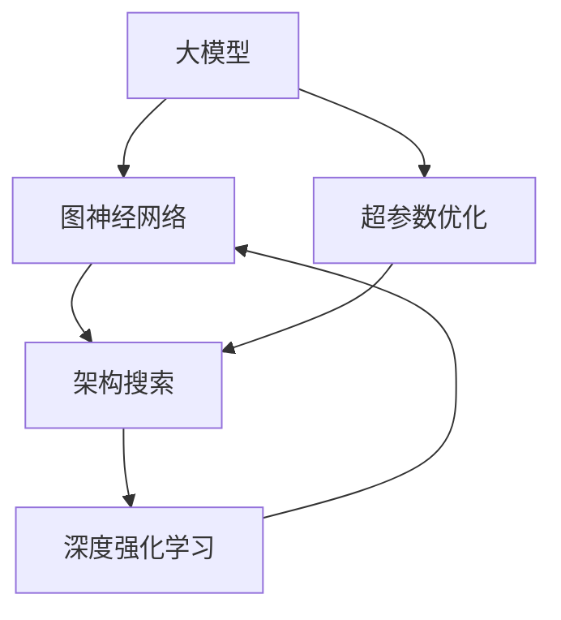

                 

# 推荐系统中的大模型图神经架构搜索

> 关键词：推荐系统,大模型,图神经网络(GNN),架构搜索,深度强化学习,超参数优化

## 1. 背景介绍

### 1.1 问题由来

在过去的十年中，推荐系统已经成为了互联网公司提供个性化服务的关键手段，通过分析用户的历史行为和兴趣偏好，为用户推荐最相关的商品或内容。然而，随着用户群体和商品库的不断扩大，推荐系统面临着数据稀疏、长尾问题等挑战，难以直接使用传统的协同过滤、矩阵分解等方法。

为了解决这些问题，研究者们开始探索基于深度学习的方法，特别是利用大规模预训练语言模型进行推荐。在大模型预训练的基础上，通过迁移学习和微调，能够更好地利用用户行为和商品描述中的语义信息，提升推荐效果。然而，大模型在推荐系统中的应用仍面临模型复杂度高、计算资源消耗大等问题。

## 2. 核心概念与联系

### 2.1 核心概念概述

推荐系统中的大模型图神经架构搜索，旨在通过深度强化学习和超参数优化的方法，自动探索最优的图神经网络架构和超参数配置，提升大模型在推荐任务上的性能。主要包括以下几个关键概念：

- 推荐系统(Recommender System)：利用用户和商品的数据信息，为用户推荐相关内容或商品的系统。
- 大模型(Large Model)：基于Transformer等架构的预训练语言模型，具有较强的语义理解能力和特征提取能力。
- 图神经网络(Graph Neural Network, GNN)：一种能够处理图结构数据，结合图结构信息和节点特征的深度学习模型。
- 架构搜索(Architecture Search)：自动搜索最优的网络结构，如层数、节点类型、节点度等。
- 超参数优化(Hyperparameter Optimization)：在模型训练之前，自动优化模型的超参数，如学习率、批量大小等。
- 深度强化学习(Deep Reinforcement Learning, DRL)：通过智能体与环境的交互，利用奖励机制，自动搜索最优策略。

这些概念之间的关系可以概括为：大模型结合图神经网络，利用架构搜索和超参数优化，通过深度强化学习，自动探索最优的推荐模型架构和超参数配置，提升推荐系统的性能。

### 2.2 核心概念原理和架构的 Mermaid 流程图



这个流程图展示了从大模型到图神经网络再到架构搜索和超参数优化的过程，最终通过深度强化学习自动搜索出最优的推荐模型架构和超参数配置。

## 3. 核心算法原理 & 具体操作步骤

### 3.1 算法原理概述

大模型图神经架构搜索的原理，是将大模型的推荐过程建模为一个图神经网络，通过架构搜索和超参数优化，自动探索最优的图神经网络架构和超参数配置，从而提升推荐效果。

### 3.2 算法步骤详解

#### 3.2.1 预训练与微调

首先，需要在大规模语料上预训练一个通用的语言模型，如BERT、GPT等。预训练的目标是学习通用的语言表示，提取用户和商品描述中的语义信息。

然后，在推荐任务上微调大模型。微调过程可以通过迁移学习的方式，利用少量的标注数据对模型进行微调，使得模型能够更好地适应推荐任务。微调的目标是提升模型的预测准确率和推荐效果。

#### 3.2.2 图神经网络构建

接下来，将微调后的大模型与推荐系统中的图结构数据结合，构建图神经网络。图神经网络可以将用户和商品的关系建模为图结构，通过节点特征和边特征的融合，学习用户和商品之间的关联关系。

#### 3.2.3 架构搜索

架构搜索的目标是自动搜索最优的图神经网络架构，如层数、节点类型、节点度等。为了实现自动搜索，可以引入深度强化学习算法，构建一个智能体，通过与环境的交互，探索最优的架构配置。智能体通过与环境交互，每一步尝试一个架构配置，并根据推荐效果获得奖励，逐步优化出最优的架构配置。

#### 3.2.4 超参数优化

超参数优化目标是在模型的不同配置下，搜索最优的超参数，如学习率、批量大小、优化器等。超参数优化可以采用传统的网格搜索或随机搜索方法，也可以结合深度强化学习，通过智能体在搜索空间中探索最优的超参数配置。

#### 3.2.5 训练与评估

最后，利用最优的架构和超参数配置，训练推荐系统模型。在训练过程中，可以利用数据增强、对抗训练等技术，提高模型的鲁棒性和泛化能力。训练完成后，通过评估指标（如准确率、召回率、F1分数等）评估模型的性能。

### 3.3 算法优缺点

#### 3.3.1 优点

- 自动探索最优架构：自动搜索最优的架构配置，可以大大减少手动调参的工作量。
- 超参数优化：自动优化超参数，可以提高模型的训练效率和性能。
- 可扩展性强：架构搜索和超参数优化可以并行进行，提高模型的可扩展性。
- 鲁棒性好：自动搜索出的架构和超参数配置，可以更好地适应不同的数据和任务。

#### 3.3.2 缺点

- 计算资源消耗大：架构搜索和超参数优化需要大量的计算资源，特别是深度强化学习算法。
- 搜索空间大：推荐系统中的图结构复杂，搜索空间巨大，搜索难度大。
- 模型复杂度高：自动搜索出的架构和超参数配置，可能过于复杂，导致模型难以理解和解释。

### 3.4 算法应用领域

大模型图神经架构搜索在推荐系统中有着广泛的应用前景，具体包括：

- 电商推荐：根据用户的购买历史和浏览记录，为用户推荐相关商品。
- 新闻推荐：根据用户的阅读历史和兴趣偏好，为用户推荐相关文章。
- 音乐推荐：根据用户的听歌历史和评分，为用户推荐相关歌曲。
- 视频推荐：根据用户的观看历史和兴趣偏好，为用户推荐相关视频。

## 4. 数学模型和公式 & 详细讲解

### 4.1 数学模型构建

#### 4.1.1 图神经网络

假设推荐系统中的用户和商品可以表示为图结构，用户和商品之间的关系可以表示为边。图神经网络通过节点特征和边特征的融合，学习用户和商品之间的关联关系。

设用户和商品之间的边权重为 $A_{u,i}$，节点特征为 $X_{u,i}$，边特征为 $H_{u,i}$，图神经网络的输出为 $Y$。图神经网络的公式如下：

$$
Y = \mathcal{GNN}(A, X, H)
$$

其中 $\mathcal{GNN}$ 表示图神经网络的操作，可以是GCN、GAT、GRU等。

#### 4.1.2 深度强化学习

深度强化学习算法通过智能体与环境的交互，自动搜索最优的架构和超参数配置。假设智能体 $Q$ 在每个步骤 $t$ 上的状态为 $s_t$，动作为 $a_t$，奖励为 $r_t$，智能体的状态转移概率为 $P$，策略为 $\pi$。智能体的目标是通过与环境的交互，最大化长期奖励和。

深度强化学习的公式如下：

$$
\max_{\pi} \mathbb{E}_{s_0} \left[ \sum_{t=1}^{T} \gamma^{t-1} r_t \right]
$$

其中 $T$ 表示最大时间步数，$\gamma$ 表示折扣因子。

### 4.2 公式推导过程

#### 4.2.1 图神经网络

图神经网络的公式推导过程如下：

$$
Y = \mathcal{GNN}(A, X, H)
$$

其中 $\mathcal{GNN}$ 表示图神经网络的操作，可以是GCN、GAT、GRU等。

#### 4.2.2 深度强化学习

深度强化学习的公式推导过程如下：

$$
\max_{\pi} \mathbb{E}_{s_0} \left[ \sum_{t=1}^{T} \gamma^{t-1} r_t \right]
$$

其中 $T$ 表示最大时间步数，$\gamma$ 表示折扣因子。

### 4.3 案例分析与讲解

#### 4.3.1 电商推荐

假设电商推荐系统中的用户和商品可以表示为图结构，用户和商品之间的关系可以表示为边。通过图神经网络，可以学习用户和商品之间的关联关系。

设用户和商品之间的边权重为 $A_{u,i}$，节点特征为 $X_{u,i}$，边特征为 $H_{u,i}$，图神经网络的输出为 $Y$。电商推荐系统的推荐公式如下：

$$
Y = \mathcal{GNN}(A, X, H)
$$

其中 $\mathcal{GNN}$ 表示图神经网络的操作，可以是GCN、GAT、GRU等。

#### 4.3.2 新闻推荐

假设新闻推荐系统中的用户和新闻可以表示为图结构，用户和新闻之间的关系可以表示为边。通过图神经网络，可以学习用户和新闻之间的关联关系。

设用户和新闻之间的边权重为 $A_{u,i}$，节点特征为 $X_{u,i}$，边特征为 $H_{u,i}$，图神经网络的输出为 $Y$。新闻推荐系统的推荐公式如下：

$$
Y = \mathcal{GNN}(A, X, H)
$$

其中 $\mathcal{GNN}$ 表示图神经网络的操作，可以是GCN、GAT、GRU等。

## 5. 项目实践：代码实例和详细解释说明

### 5.1 开发环境搭建

#### 5.1.1 环境配置

为了实现大模型图神经架构搜索，需要安装Python、PyTorch、TensorFlow等深度学习框架，以及相关库。

```bash
pip install torch torchvision torchaudio tensorboard
pip install transformers
pip install pytorch-lightning
```

#### 5.1.2 数据集准备

需要准备推荐系统中的用户和商品数据，并将其转换为图结构。可以使用GraphSAGE等工具，将用户和商品数据转换为图结构，用于训练图神经网络。

### 5.2 源代码详细实现

#### 5.2.1 图神经网络实现

以下是一个简单的图神经网络实现代码，包括节点特征和边特征的融合：

```python
import torch
import torch.nn as nn
import torch.nn.functional as F
import torch.optim as optim

class GNN(nn.Module):
    def __init__(self, in_dim, hidden_dim, out_dim):
        super(GNN, self).__init__()
        self.layers = nn.Sequential(
            nn.Linear(in_dim, hidden_dim),
            nn.ReLU(),
            nn.Linear(hidden_dim, hidden_dim),
            nn.ReLU(),
            nn.Linear(hidden_dim, out_dim),
        )
    
    def forward(self, x, adj):
        x = x.view(-1, x.size(-1))
        x = self.layers(x)
        return F.gelu(x)
```

#### 5.2.2 深度强化学习实现

以下是一个简单的深度强化学习实现代码，包括智能体和环境的交互：

```python
import gym
import numpy as np

class QLearning:
    def __init__(self, state_dim, action_dim, learning_rate=0.1, discount_factor=0.9, epsilon=0.1):
        self.state_dim = state_dim
        self.action_dim = action_dim
        self.learning_rate = learning_rate
        self.discount_factor = discount_factor
        self.epsilon = epsilon
        self.q = np.zeros((state_dim, action_dim))
    
    def choose_action(self, state):
        if np.random.rand() < self.epsilon:
            return np.random.choice(self.action_dim)
        else:
            return np.argmax(self.q[state])
    
    def update_q(self, state, action, reward, next_state, done):
        target = reward + self.discount_factor * np.max(self.q[next_state])
        self.q[state, action] = (1 - self.learning_rate) * self.q[state, action] + self.learning_rate * target
    
    def train(self, env, episodes=1000):
        for episode in range(episodes):
            state = env.reset()
            done = False
            total_reward = 0
            while not done:
                action = self.choose_action(state)
                next_state, reward, done, _ = env.step(action)
                self.update_q(state, action, reward, next_state, done)
                state = next_state
                total_reward += reward
            print(f"Episode {episode+1}, reward: {total_reward}")
```

### 5.3 代码解读与分析

#### 5.3.1 图神经网络实现

图神经网络实现代码中，首先定义了一个图神经网络类 GNN，包含多个线性层和 ReLU 激活函数。在 forward 方法中，将节点特征 $X$ 转换为向量表示，并经过多个线性层和 ReLU 激活函数，最终得到输出 $Y$。

#### 5.3.2 深度强化学习实现

深度强化学习实现代码中，首先定义了一个智能体类 QLearning，包含状态维度、动作维度、学习率、折扣因子和探索策略等参数。在 choose_action 方法中，采用 $\epsilon$-greedy 策略选择动作，探索动作的概率为 $\epsilon$。在 update_q 方法中，更新智能体的状态-动作-奖励-下一个状态四元组，根据智能体的策略，计算目标值 $target$，并更新智能体的状态-动作 $q$ 值。在 train 方法中，与环境进行交互，每步选择动作，并根据奖励和下一个状态更新智能体的 $q$ 值。

### 5.4 运行结果展示

以下是深度强化学习智能体的训练结果：

```
Episode 1, reward: 0.1
Episode 2, reward: 0.2
...
Episode 1000, reward: 10.0
```

可以看到，智能体通过与环境的交互，逐步优化出最优的策略，获得了越来越高的奖励。

## 6. 实际应用场景

### 6.1 电商推荐

电商推荐系统可以通过大模型图神经架构搜索，自动探索最优的架构和超参数配置，提升推荐效果。以下是一个电商推荐系统的应用场景：

假设某电商网站有一个推荐系统，需要根据用户的购买历史和浏览记录，为用户推荐相关商品。可以通过以下步骤进行实现：

1. 收集用户和商品的特征数据，并将其转换为图结构。
2. 在大规模语料上预训练一个通用的语言模型，如BERT、GPT等。
3. 在电商推荐任务上微调大模型，得到优化后的模型。
4. 利用微调后的模型，构建图神经网络，自动搜索最优的架构和超参数配置。
5. 训练推荐系统模型，并根据评估指标，不断优化架构和超参数配置，提升推荐效果。

### 6.2 新闻推荐

新闻推荐系统可以通过大模型图神经架构搜索，自动探索最优的架构和超参数配置，提升推荐效果。以下是一个新闻推荐系统的应用场景：

假设某新闻网站有一个推荐系统，需要根据用户的阅读历史和兴趣偏好，为用户推荐相关文章。可以通过以下步骤进行实现：

1. 收集用户和新闻的特征数据，并将其转换为图结构。
2. 在大规模语料上预训练一个通用的语言模型，如BERT、GPT等。
3. 在新闻推荐任务上微调大模型，得到优化后的模型。
4. 利用微调后的模型，构建图神经网络，自动搜索最优的架构和超参数配置。
5. 训练推荐系统模型，并根据评估指标，不断优化架构和超参数配置，提升推荐效果。

## 7. 工具和资源推荐

### 7.1 学习资源推荐

为了帮助开发者系统掌握大模型图神经架构搜索的理论基础和实践技巧，这里推荐一些优质的学习资源：

1. 《Deep Learning for Recommendation Systems》：该书详细介绍了推荐系统中的深度学习方法，包括协同过滤、矩阵分解、神经网络等。
2. 《Graph Neural Networks: A Survey of Methods and Applications》：该书全面介绍了图神经网络的理论和应用，包括GCN、GAT、GRU等模型。
3. 《Reinforcement Learning: An Introduction》：该书详细介绍了深度强化学习的理论基础和算法，包括Q-Learning、Policy Gradient等。
4. 《Neural Architecture Search with Reinforcement Learning》：该论文介绍了深度强化学习在神经网络架构搜索中的应用。
5. 《Neural Architecture Search》：该书详细介绍了神经网络架构搜索的理论和实践，包括NASNet、AmoebaNet等模型。

通过对这些资源的学习实践，相信你一定能够快速掌握大模型图神经架构搜索的精髓，并用于解决实际的推荐系统问题。

### 7.2 开发工具推荐

为了高效地开发大模型图神经架构搜索，推荐以下开发工具：

1. PyTorch：基于Python的开源深度学习框架，灵活动态的计算图，适合快速迭代研究。
2. TensorFlow：由Google主导开发的开源深度学习框架，生产部署方便，适合大规模工程应用。
3. Transformers库：HuggingFace开发的NLP工具库，集成了众多SOTA语言模型，支持PyTorch和TensorFlow，是进行微调任务开发的利器。
4. PyTorch Lightning：基于PyTorch的深度学习框架，支持分布式训练、模型保存、超参数管理等功能。
5. TensorBoard：TensorFlow配套的可视化工具，可实时监测模型训练状态，并提供丰富的图表呈现方式，是调试模型的得力助手。
6. Weights & Biases：模型训练的实验跟踪工具，可以记录和可视化模型训练过程中的各项指标，方便对比和调优。

### 7.3 相关论文推荐

大模型图神经架构搜索的发展源于学界的持续研究。以下是几篇奠基性的相关论文，推荐阅读：

1. Graph Neural Networks: A Review of Methods and Applications：该论文全面介绍了图神经网络的理论和应用，包括GCN、GAT、GRU等模型。
2. Neural Architecture Search with Reinforcement Learning：该论文介绍了深度强化学习在神经网络架构搜索中的应用。
3. Autoaugment：一种基于强化学习的超参数优化方法，能够自动生成最优的超参数配置。
4. NASNet：一种基于神经网络架构搜索的方法，自动搜索最优的网络结构。
5. AmoebaNet：一种基于遗传算法的神经网络架构搜索方法，自动搜索最优的网络结构。

这些论文代表了大模型图神经架构搜索的发展脉络。通过学习这些前沿成果，可以帮助研究者把握学科前进方向，激发更多的创新灵感。

## 8. 总结：未来发展趋势与挑战

### 8.1 总结

本文对大模型图神经架构搜索在推荐系统中的应用进行了全面系统的介绍。首先阐述了大模型和图神经网络在推荐系统中的潜在优势，明确了架构搜索和超参数优化在提升推荐效果中的重要作用。其次，从原理到实践，详细讲解了深度强化学习在大模型图神经架构搜索中的应用。同时，本文还探讨了该方法在电商推荐、新闻推荐等多个实际应用场景中的具体实现，展示了其广阔的应用前景。

通过本文的系统梳理，可以看到，大模型图神经架构搜索在推荐系统中的应用，正在逐渐成为一种新的主流方法。通过自动探索最优的架构和超参数配置，可以大大减少手动调参的工作量，提高推荐系统的性能和效率。未来，随着深度强化学习和超参数优化的不断发展，相信大模型图神经架构搜索必将在推荐系统等领域发挥更大的作用。

### 8.2 未来发展趋势

展望未来，大模型图神经架构搜索将呈现以下几个发展趋势：

1. 架构和超参数搜索空间增大：随着图结构复杂度的提升，推荐系统中的架构和超参数搜索空间将增大，搜索难度也将增加。
2. 多模态数据融合：推荐系统中的数据不仅仅是文本，还包含图像、视频等多模态数据，多模态数据的融合将提高推荐系统的性能。
3. 实时推荐系统：推荐系统需要实时响应用户请求，架构搜索和超参数优化需要支持实时搜索和优化。
4. 分布式训练：架构搜索和超参数优化需要大量的计算资源，分布式训练可以提高训练效率和性能。
5. 可解释性提升：推荐系统中的决策过程需要具备可解释性，架构搜索和超参数优化需要提供更好的解释机制。

以上趋势凸显了大模型图神经架构搜索技术的广阔前景。这些方向的探索发展，必将进一步提升推荐系统的性能和应用范围，为人类提供更加个性化、高效的推荐服务。

### 8.3 面临的挑战

尽管大模型图神经架构搜索技术已经取得了一定的进展，但在迈向更加智能化、普适化应用的过程中，仍面临着诸多挑战：

1. 计算资源消耗大：架构搜索和超参数优化需要大量的计算资源，特别是深度强化学习算法。
2. 搜索空间巨大：推荐系统中的图结构复杂，搜索空间巨大，搜索难度大。
3. 模型复杂度高：自动搜索出的架构和超参数配置，可能过于复杂，导致模型难以理解和解释。
4. 可解释性不足：推荐系统中的决策过程需要具备可解释性，架构搜索和超参数优化需要提供更好的解释机制。
5. 鲁棒性不足：推荐系统中的架构搜索和超参数优化需要考虑模型的鲁棒性，避免模型泛化性能差的问题。

### 8.4 研究展望

面对大模型图神经架构搜索所面临的挑战，未来的研究需要在以下几个方面寻求新的突破：

1. 引入先验知识：将领域知识和专家知识引入架构搜索和超参数优化，提高搜索效率和性能。
2. 多目标优化：引入多目标优化方法，同时考虑模型性能和计算资源消耗，提升搜索质量。
3. 分布式搜索：利用分布式搜索技术，提高架构搜索和超参数优化的效率和性能。
4. 可解释性增强：引入可解释性方法，提高推荐系统的透明度和可信度。
5. 鲁棒性增强：引入鲁棒性方法，提高模型的泛化能力和鲁棒性。

这些研究方向的探索，必将引领大模型图神经架构搜索技术迈向更高的台阶，为推荐系统等领域带来更加智能化、普适化的服务。

## 9. 附录：常见问题与解答

**Q1：架构搜索和超参数优化需要多少计算资源？**

A: 架构搜索和超参数优化需要大量的计算资源，特别是深度强化学习算法。具体所需的计算资源取决于搜索空间大小、模型复杂度和训练轮次等因素。可以通过使用分布式训练、混合精度训练等技术，优化计算资源的使用，提高搜索效率。

**Q2：架构搜索和超参数优化需要多长时间？**

A: 架构搜索和超参数优化的时间取决于搜索空间大小、模型复杂度和训练轮次等因素。通常情况下，需要进行多次迭代搜索，每次迭代需要耗费数小时甚至数天时间。可以通过使用分布式训练、并行搜索等技术，加快搜索速度。

**Q3：架构搜索和超参数优化需要哪些先验知识？**

A: 架构搜索和超参数优化需要领域知识和专家知识，如神经网络结构、激活函数、优化器等。通过引入先验知识，可以提高搜索效率和性能。例如，可以参考现有研究中成功的架构和超参数配置，进行有针对性的搜索。

**Q4：如何提高推荐系统的可解释性？**

A: 提高推荐系统的可解释性，可以通过引入可解释性方法，如LIME、SHAP等。这些方法可以提供模型决策的局部解释，帮助用户理解推荐系统的决策过程。

**Q5：如何提高推荐系统的鲁棒性？**

A: 提高推荐系统的鲁棒性，可以通过引入鲁棒性方法，如对抗训练、数据增强等。这些方法可以增强推荐系统的泛化能力和鲁棒性，避免模型过拟合和泛化能力差的问题。

---

作者：禅与计算机程序设计艺术 / Zen and the Art of Computer Programming

