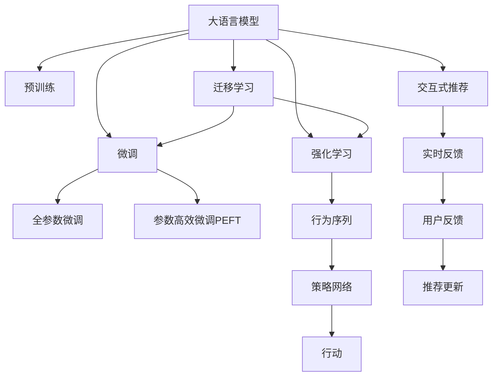

                 

# 推荐系统中的大模型对比强化学习应用

## 1. 背景介绍

推荐系统是当前互联网行业中最为核心的技术之一，广泛应用于电子商务、社交网络、视频平台等领域。推荐系统通过分析用户的历史行为和兴趣，预测用户可能感兴趣的商品或内容，为其提供个性化的推荐服务。在传统的推荐系统中，往往依赖于手工设计的特征工程和算法，但这些方法难以捕捉用户复杂多变的行为模式和个性化需求。

近年来，随着深度学习和大规模预训练模型的兴起，推荐系统逐渐向基于大模型的方向发展。大模型能够自动学习到高层次的特征表示，提升了推荐的精准度和个性化程度。此外，强化学习也在推荐系统中逐渐得到应用，通过模拟用户与环境的交互，优化推荐策略，提升了推荐的实时性和动态性。因此，将大模型与强化学习相结合，成为了推荐系统研究的前沿方向之一。

## 2. 核心概念与联系

### 2.1 核心概念概述

为更好地理解大模型和强化学习在推荐系统中的应用，本节将介绍几个密切相关的核心概念：

- 大语言模型(Large Language Model, LLM)：以自回归(如GPT)或自编码(如BERT)模型为代表的大规模预训练语言模型。通过在大规模无标签文本语料上进行预训练，学习通用的语言表示，具备强大的语言理解和生成能力。

- 强化学习(Reinforcement Learning, RL)：一种智能体与环境交互的决策过程，通过学习最优策略来最大化奖励。强化学习广泛应用于游戏、机器人、自然语言处理等领域。

- 大模型在推荐系统中的应用：通过在大模型上微调，学习用户行为和商品特征之间的关系，用于预测用户可能感兴趣的商品。

- 强化学习在推荐系统中的应用：通过模拟用户与环境的交互，优化推荐策略，实时调整推荐内容，提升用户体验。

- 迁移学习(Transfer Learning)：指将一个领域学习到的知识，迁移应用到另一个不同但相关的领域的学习范式。大模型的预训练-微调过程即是一种典型的迁移学习方式。

- 交互式推荐系统(Interactive Recommendation System)：用户通过交互式界面与系统进行互动，系统根据用户反馈实时调整推荐内容，提升推荐效果。

这些核心概念之间的逻辑关系可以通过以下Mermaid流程图来展示：



这个流程图展示了大模型和强化学习在推荐系统中的核心概念及其之间的关系：

1. 大语言模型通过预训练获得基础能力。
2. 微调对大模型进行特定任务适配，使其能够预测用户兴趣。
3. 强化学习通过模拟用户行为，实时优化推荐策略。
4. 迁移学习连接预训练模型与推荐任务，用于策略网络的初始化。
5. 交互式推荐通过用户反馈实时调整推荐策略，提升推荐效果。

## 3. 核心算法原理 & 具体操作步骤
### 3.1 算法原理概述

大模型在推荐系统中的应用，本质上是一种特征抽取和分类任务。通过在大模型上进行微调，模型能够学习用户行为和商品特征之间的关系，用于预测用户可能感兴趣的商品。而强化学习在推荐系统中的应用，则是通过模拟用户与环境的交互，优化推荐策略，提升推荐的实时性和动态性。

具体而言，我们可以将推荐系统中的推荐过程视为智能体与环境进行交互的过程。智能体为推荐系统，环境为用户和商品。智能体的目标是通过学习最优策略，最大化用户的满意度（即奖励）。

形式化地，假设推荐系统中的智能体为 $A$，环境为 $E$，当前状态为 $s$，动作为 $a$，状态奖励为 $r$。智能体的策略网络为 $\pi_\theta$，参数为 $\theta$。智能体的目标是通过策略 $\pi_\theta$ 学习最优策略 $\pi^*$，使得 $\pi^*$ 最大化期望奖励 $J$：

$$
\pi^* = \mathop{\arg\min}_{\theta} J_\theta(\pi_\theta) = \mathop{\arg\min}_{\theta} \mathbb{E}_{s\sim \rho} [\sum_{t=0}^{T} r(s_t, a_t)]
$$

其中 $\rho$ 为环境状态分布，$T$ 为时间步。智能体的策略网络 $\pi_\theta$ 的输出为策略 $\pi(a|s)$，表示在状态 $s$ 下采取动作 $a$ 的概率。通过优化策略网络 $\pi_\theta$，可以使得智能体在推荐过程中不断优化推荐策略，提升推荐的精准度和个性化程度。

### 3.2 算法步骤详解

基于大模型和强化学习的推荐系统一般包括以下几个关键步骤：

**Step 1: 准备预训练模型和数据集**
- 选择合适的预训练语言模型 $M_{\theta}$ 作为初始化参数，如 BERT、GPT 等。
- 准备推荐任务 $T$ 的标注数据集 $D=\{(x_i, y_i)\}_{i=1}^N$，划分为训练集、验证集和测试集。一般要求标注数据与预训练数据的分布不要差异过大。

**Step 2: 添加任务适配层**
- 根据任务类型，在预训练模型顶层设计合适的输出层和损失函数。
- 对于推荐任务，通常在顶层添加线性分类器或神经网络，用于预测用户对每个商品的兴趣度。

**Step 3: 设置强化学习超参数**
- 选择合适的强化学习算法及其参数，如 Q-learning、SARSA、DQN 等，设置学习率、折扣率、策略网络参数、状态特征等。
- 确定策略网络的优化目标函数，如交叉熵损失、均方误差损失等。

**Step 4: 执行策略优化**
- 将训练集数据分批次输入模型，前向传播计算策略网络的输出。
- 根据动作值函数计算每个动作的Q值或V值，选取最优动作进行预测。
- 根据Q值或V值更新策略网络参数，并根据策略网络输出采取相应动作。
- 周期性在验证集上评估策略网络的性能，根据性能指标决定是否触发策略更新。
- 重复上述步骤直到满足预设的迭代轮数或策略收敛。

**Step 5: 测试和部署**
- 在测试集上评估微调后模型 $M_{\hat{\theta}}$ 的性能，对比微调前后的精度提升。
- 使用微调后的模型对新用户和商品进行推荐，集成到实际的应用系统中。
- 持续收集用户的反馈和行为数据，定期重新微调和策略优化，以适应数据分布的变化。

以上是基于大模型和强化学习的推荐系统的一般流程。在实际应用中，还需要针对具体任务的特点，对微调和策略优化过程的各个环节进行优化设计，如改进训练目标函数，引入更多的正则化技术，搜索最优的超参数组合等，以进一步提升模型性能。

### 3.3 算法优缺点

基于大模型和强化学习的推荐系统具有以下优点：

1. 自动特征学习：大模型能够自动学习高层次的特征表示，避免了手工特征工程的繁琐和复杂。
2. 泛化能力强大：大模型通过大规模语料预训练，具备较强的泛化能力，能够适应不同领域的推荐任务。
3. 个性化推荐：通过微调和强化学习，推荐系统可以实时调整推荐策略，提供更加个性化和动态的推荐服务。
4. 鲁棒性高：通过强化学习，推荐系统能够处理大量非结构化数据和复杂的行为序列，提升鲁棒性。

同时，该方法也存在一定的局限性：

1. 资源消耗大：大模型和强化学习的计算复杂度高，对硬件资源和计算能力要求较高。
2. 收敛速度慢：微调和强化学习算法复杂，收敛速度较慢，需要大量训练样本和计算资源。
3. 解释性不足：大模型和强化学习的黑盒特性，使得推荐的决策过程难以解释。
4. 数据依赖强：微调和强化学习的效果很大程度上取决于标注数据的质量和数量，获取高质量标注数据的成本较高。

尽管存在这些局限性，但就目前而言，基于大模型和强化学习的推荐方法仍是推荐系统领域的研究热点和主流方向。未来相关研究的重点在于如何进一步降低资源消耗，提高收敛速度，增强模型的可解释性，同时兼顾个性化推荐和通用化的需求。

### 3.4 算法应用领域

基于大模型和强化学习的推荐方法已经在多个领域得到了应用，例如：

- 电子商务：推荐个性化商品、商品组合等。通过大模型学习用户行为，利用强化学习优化推荐策略。
- 社交网络：推荐用户可能感兴趣的朋友、帖子、群组等。通过大模型学习用户兴趣，利用强化学习调整推荐内容。
- 视频平台：推荐用户可能感兴趣的视频、频道等。通过大模型学习用户观看行为，利用强化学习优化推荐策略。
- 新闻媒体：推荐用户可能感兴趣的新闻、文章等。通过大模型学习用户阅读行为，利用强化学习调整推荐内容。

除了上述这些经典领域外，大模型和强化学习在推荐系统的应用还在不断拓展，如医疗推荐、金融推荐、游戏推荐等，为推荐技术带来了新的发展空间。随着预训练模型和强化学习方法的不断进步，相信推荐系统将迎来更加智能化、个性化的未来。

## 4. 数学模型和公式 & 详细讲解  
### 4.1 数学模型构建

本节将使用数学语言对基于大模型和强化学习的推荐系统进行更加严格的刻画。

记推荐系统中的智能体为 $A$，环境为 $E$，当前状态为 $s$，动作为 $a$，状态奖励为 $r$。智能体的策略网络为 $\pi_\theta$，参数为 $\theta$。环境的状态空间为 $\mathcal{S}$，动作空间为 $\mathcal{A}$。智能体的状态转移函数为 $P(s'|s,a)$，状态奖励函数为 $r(s,a)$。智能体的优化目标是最大化期望奖励 $J$，优化策略 $\pi_\theta$ 如下：

$$
\pi^* = \mathop{\arg\min}_{\theta} J_\theta(\pi_\theta) = \mathop{\arg\min}_{\theta} \mathbb{E}_{s\sim \rho} [\sum_{t=0}^{T} r(s_t, a_t)]
$$

其中 $\rho$ 为环境状态分布，$T$ 为时间步。

在实践中，我们通常使用基于梯度的优化算法（如SGD、Adam等）来近似求解上述最优化问题。设 $\eta$ 为学习率，$\lambda$ 为正则化系数，则策略网络的更新公式为：

$$
\theta \leftarrow \theta - \eta \nabla_{\theta}J_\theta(\pi_\theta) - \eta\lambda\theta
$$

其中 $\nabla_{\theta}J_\theta(\pi_\theta)$ 为优化目标函数对参数 $\theta$ 的梯度，可通过反向传播算法高效计算。

### 4.2 公式推导过程

以下我们以推荐任务为例，推导强化学习的目标函数及其梯度的计算公式。

假设推荐系统中的智能体为 $A$，环境为 $E$，当前状态为 $s$，动作为 $a$，状态奖励为 $r$。智能体的策略网络为 $\pi_\theta$，参数为 $\theta$。环境的状态空间为 $\mathcal{S}$，动作空间为 $\mathcal{A}$。智能体的状态转移函数为 $P(s'|s,a)$，状态奖励函数为 $r(s,a)$。智能体的优化目标是最大化期望奖励 $J$，优化策略 $\pi_\theta$ 如下：

$$
\pi^* = \mathop{\arg\min}_{\theta} J_\theta(\pi_\theta) = \mathop{\arg\min}_{\theta} \mathbb{E}_{s\sim \rho} [\sum_{t=0}^{T} r(s_t, a_t)]
$$

在具体计算时，可以采用蒙特卡罗方法，通过采样状态序列 $(s_0, a_0, r_1, s_1, a_1, r_2, \ldots, s_T, a_T)$，计算出策略的平均奖励 $\bar{R}$ 如下：

$$
\bar{R} = \frac{1}{n} \sum_{i=1}^n \left[ r_1 + \gamma r_2 + \gamma^2 r_3 + \ldots + \gamma^{n-1} r_n \right]
$$

其中 $\gamma$ 为折扣率，$n$ 为状态序列的长度。通过平均奖励 $\bar{R}$，可以计算出策略的Q值：

$$
Q_\theta(s,a) = \mathbb{E}_{s\sim \rho} [\sum_{t=0}^{T} \gamma^t r(s_t, a_t)]
$$

根据策略网络 $\pi_\theta$ 的输出，可以计算出每个动作的Q值：

$$
Q_\theta(s,a) = r + \gamma \max_{a'} \left[ Q_\theta(s', a') \right]
$$

其中 $s'$ 为状态转移后的新状态，$a'$ 为状态转移后的新动作。通过计算每个动作的Q值，可以选取最优动作进行预测，计算策略网络 $\pi_\theta$ 的梯度：

$$
\nabla_{\theta} J_\theta(\pi_\theta) = \nabla_{\theta} \mathbb{E}_{s\sim \rho} [\sum_{t=0}^{T} r(s_t, a_t)]
$$

在得到策略网络的梯度后，即可带入梯度下降等优化算法，完成策略的迭代优化。重复上述过程直至收敛，最终得到适应推荐任务的最优策略网络参数 $\theta^*$。

## 5. 项目实践：代码实例和详细解释说明
### 5.1 开发环境搭建

在进行推荐系统微调实践前，我们需要准备好开发环境。以下是使用Python进行PyTorch开发的环境配置流程：

1. 安装Anaconda：从官网下载并安装Anaconda，用于创建独立的Python环境。

2. 创建并激活虚拟环境：
```bash
conda create -n pytorch-env python=3.8 
conda activate pytorch-env
```

3. 安装PyTorch：根据CUDA版本，从官网获取对应的安装命令。例如：
```bash
conda install pytorch torchvision torchaudio cudatoolkit=11.1 -c pytorch -c conda-forge
```

4. 安装Transformers库：
```bash
pip install transformers
```

5. 安装各类工具包：
```bash
pip install numpy pandas scikit-learn matplotlib tqdm jupyter notebook ipython
```

完成上述步骤后，即可在`pytorch-env`环境中开始微调实践。

### 5.2 源代码详细实现

下面我们以推荐任务为例，给出使用Transformers库对BERT模型进行微调的PyTorch代码实现。

首先，定义推荐任务的数据处理函数：

```python
from transformers import BertTokenizer
from torch.utils.data import Dataset
import torch

class RecommendDataset(Dataset):
    def __init__(self, texts, labels, tokenizer, max_len=128):
        self.texts = texts
        self.labels = labels
        self.tokenizer = tokenizer
        self.max_len = max_len
        
    def __len__(self):
        return len(self.texts)
    
    def __getitem__(self, item):
        text = self.texts[item]
        label = self.labels[item]
        
        encoding = self.tokenizer(text, return_tensors='pt', max_length=self.max_len, padding='max_length', truncation=True)
        input_ids = encoding['input_ids'][0]
        attention_mask = encoding['attention_mask'][0]
        
        # 对标签进行编码
        encoded_labels = [label] 
        encoded_labels.extend([0]*(self.max_len - len(encoded_labels)))
        labels = torch.tensor(encoded_labels, dtype=torch.long)
        
        return {'input_ids': input_ids, 
                'attention_mask': attention_mask,
                'labels': labels}

# 标签与id的映射
label2id = {'1': 1, '0': 0}
id2label = {v: k for k, v in label2id.items()}

# 创建dataset
tokenizer = BertTokenizer.from_pretrained('bert-base-cased')

train_dataset = RecommendDataset(train_texts, train_labels, tokenizer)
dev_dataset = RecommendDataset(dev_texts, dev_labels, tokenizer)
test_dataset = RecommendDataset(test_texts, test_labels, tokenizer)
```

然后，定义模型和优化器：

```python
from transformers import BertForTokenClassification, AdamW

model = BertForTokenClassification.from_pretrained('bert-base-cased', num_labels=len(label2id))

optimizer = AdamW(model.parameters(), lr=2e-5)
```

接着，定义训练和评估函数：

```python
from torch.utils.data import DataLoader
from tqdm import tqdm
from sklearn.metrics import classification_report

device = torch.device('cuda') if torch.cuda.is_available() else torch.device('cpu')
model.to(device)

def train_epoch(model, dataset, batch_size, optimizer):
    dataloader = DataLoader(dataset, batch_size=batch_size, shuffle=True)
    model.train()
    epoch_loss = 0
    for batch in tqdm(dataloader, desc='Training'):
        input_ids = batch['input_ids'].to(device)
        attention_mask = batch['attention_mask'].to(device)
        labels = batch['labels'].to(device)
        model.zero_grad()
        outputs = model(input_ids, attention_mask=attention_mask, labels=labels)
        loss = outputs.loss
        epoch_loss += loss.item()
        loss.backward()
        optimizer.step()
    return epoch_loss / len(dataloader)

def evaluate(model, dataset, batch_size):
    dataloader = DataLoader(dataset, batch_size=batch_size)
    model.eval()
    preds, labels = [], []
    with torch.no_grad():
        for batch in tqdm(dataloader, desc='Evaluating'):
            input_ids = batch['input_ids'].to(device)
            attention_mask = batch['attention_mask'].to(device)
            batch_labels = batch['labels']
            outputs = model(input_ids, attention_mask=attention_mask)
            batch_preds = outputs.logits.argmax(dim=2).to('cpu').tolist()
            batch_labels = batch_labels.to('cpu').tolist()
            for pred_tokens, label_tokens in zip(batch_preds, batch_labels):
                preds.append(pred_tokens[:len(label_tokens)])
                labels.append(label_tokens)
                
    print(classification_report(labels, preds))
```

最后，启动训练流程并在测试集上评估：

```python
epochs = 5
batch_size = 16

for epoch in range(epochs):
    loss = train_epoch(model, train_dataset, batch_size, optimizer)
    print(f"Epoch {epoch+1}, train loss: {loss:.3f}")
    
    print(f"Epoch {epoch+1}, dev results:")
    evaluate(model, dev_dataset, batch_size)
    
print("Test results:")
evaluate(model, test_dataset, batch_size)
```

以上就是使用PyTorch对BERT进行推荐任务微调的完整代码实现。可以看到，得益于Transformers库的强大封装，我们可以用相对简洁的代码完成BERT模型的加载和微调。

### 5.3 代码解读与分析

让我们再详细解读一下关键代码的实现细节：

**RecommendDataset类**：
- `__init__`方法：初始化文本、标签、分词器等关键组件。
- `__len__`方法：返回数据集的样本数量。
- `__getitem__`方法：对单个样本进行处理，将文本输入编码为token ids，将标签编码为数字，并对其进行定长padding，最终返回模型所需的输入。

**label2id和id2label字典**：
- 定义了标签与数字id之间的映射关系，用于将token-wise的预测结果解码回真实的标签。

**训练和评估函数**：
- 使用PyTorch的DataLoader对数据集进行批次化加载，供模型训练和推理使用。
- 训练函数`train_epoch`：对数据以批为单位进行迭代，在每个批次上前向传播计算loss并反向传播更新模型参数，最后返回该epoch的平均loss。
- 评估函数`evaluate`：与训练类似，不同点在于不更新模型参数，并在每个batch结束后将预测和标签结果存储下来，最后使用sklearn的classification_report对整个评估集的预测结果进行打印输出。

**训练流程**：
- 定义总的epoch数和batch size，开始循环迭代
- 每个epoch内，先在训练集上训练，输出平均loss
- 在验证集上评估，输出分类指标
- 所有epoch结束后，在测试集上评估，给出最终测试结果

可以看到，PyTorch配合Transformers库使得BERT微调的代码实现变得简洁高效。开发者可以将更多精力放在数据处理、模型改进等高层逻辑上，而不必过多关注底层的实现细节。

当然，工业级的系统实现还需考虑更多因素，如模型的保存和部署、超参数的自动搜索、更灵活的任务适配层等。但核心的微调范式基本与此类似。

## 6. 实际应用场景
### 6.1 智能推荐系统

基于大模型和强化学习的推荐系统，可以广泛应用于智能推荐系统的构建。传统推荐系统往往依赖于手工设计的特征工程和算法，难以捕捉用户复杂多变的行为模式和个性化需求。

在技术实现上，可以收集用户的历史行为数据，如浏览、点击、评分等，将这些数据作为监督数据，在此基础上对预训练模型进行微调。微调后的模型能够自动学习用户行为和商品特征之间的关系，用于预测用户可能感兴趣的商品。结合强化学习，推荐系统可以实时调整推荐策略，根据用户反馈动态优化推荐内容。如此构建的智能推荐系统，能大幅提升推荐精准度和个性化程度，提供更符合用户需求的推荐服务。

### 6.2 金融风险预测

金融行业需要实时预测用户行为，识别潜在的风险点，以便及时规避金融风险。传统的人工建模方法难以满足实时性要求，且模型的复杂度和维护成本较高。

基于大模型和强化学习的推荐系统，可以用于金融风险预测任务。具体而言，可以收集用户的历史交易记录、行为数据等，将这些数据作为监督数据，对预训练模型进行微调。微调后的模型能够自动学习用户行为和交易特征之间的关系，用于预测用户可能采取的金融行为。结合强化学习，推荐系统可以实时调整推荐策略，根据用户反馈动态优化推荐内容，提升金融风险预测的准确性和及时性。

### 6.3 电商个性化推荐

电商行业需要为每个用户推荐个性化商品，提升用户体验和转化率。传统的手工推荐方法难以兼顾个性化和多样性，且难以应对用户行为模式的变化。

基于大模型和强化学习的推荐系统，可以用于电商个性化推荐任务。具体而言，可以收集用户的历史行为数据，如浏览、点击、购买等，将这些数据作为监督数据，对预训练模型进行微调。微调后的模型能够自动学习用户行为和商品特征之间的关系，用于预测用户可能感兴趣的商品。结合强化学习，推荐系统可以实时调整推荐策略，根据用户反馈动态优化推荐内容，提升电商个性化推荐的精准度和个性化程度。

### 6.4 未来应用展望

随着大模型和强化学习方法的不断发展，基于微调范式将在更多领域得到应用，为各行各业带来变革性影响。

在智慧医疗领域，基于微调的医疗推荐系统可以提升医疗服务的智能化水平，辅助医生诊疗，加速新药开发进程。

在智能教育领域，微调技术可应用于作业批改、学情分析、知识推荐等方面，因材施教，促进教育公平，提高教学质量。

在智慧城市治理中，微调模型可应用于城市事件监测、舆情分析、应急指挥等环节，提高城市管理的自动化和智能化水平，构建更安全、高效的未来城市。

此外，在企业生产、社会治理、文娱传媒等众多领域，基于大模型微调的人工智能应用也将不断涌现，为经济社会发展注入新的动力。相信随着技术的日益成熟，微调方法将成为人工智能落地应用的重要范式，推动人工智能技术在垂直行业的规模化落地。总之，微调需要开发者根据具体任务，不断迭代和优化模型、数据和算法，方能得到理想的效果。

## 7. 工具和资源推荐
### 7.1 学习资源推荐

为了帮助开发者系统掌握大模型和强化学习在推荐系统中的应用，这里推荐一些优质的学习资源：

1. 《深度学习与推荐系统》书籍：全面介绍深度学习在推荐系统中的应用，包括大模型和强化学习等前沿方向。

2. CS400《推荐系统》课程：斯坦福大学开设的推荐系统课程，涵盖传统推荐算法和大模型推荐算法。

3. 《强化学习》书籍：由机器学习专家撰写的强化学习经典教材，涵盖基础理论和应用实例。

4. Kaggle竞赛：推荐系统相关的数据竞赛，提供大量真实推荐数据，助力实践学习。

5. AI Challenger：国内知名的推荐系统竞赛，涵盖多种推荐任务和数据集，挑战自我，提升能力。

通过对这些资源的学习实践，相信你一定能够快速掌握大模型和强化学习在推荐系统中的应用，并用于解决实际的推荐问题。
###  7.2 开发工具推荐

高效的开发离不开优秀的工具支持。以下是几款用于大模型和强化学习推荐系统开发的常用工具：

1. PyTorch：基于Python的开源深度学习框架，灵活动态的计算图，适合快速迭代研究。大部分预训练语言模型都有PyTorch版本的实现。

2. TensorFlow：由Google主导开发的开源深度学习框架，生产部署方便，适合大规模工程应用。同样有丰富的预训练语言模型资源。

3. Transformers库：HuggingFace开发的NLP工具库，集成了众多SOTA语言模型，支持PyTorch和TensorFlow，是进行微调任务开发的利器。

4. Weights & Biases：模型训练的实验跟踪工具，可以记录和可视化模型训练过程中的各项指标，方便对比和调优。与主流深度学习框架无缝集成。

5. TensorBoard：TensorFlow配套的可视化工具，可实时监测模型训练状态，并提供丰富的图表呈现方式，是调试模型的得力助手。

6. Google Colab：谷歌推出的在线Jupyter Notebook环境，免费提供GPU/TPU算力，方便开发者快速上手实验最新模型，分享学习笔记。

合理利用这些工具，可以显著提升大模型和强化学习推荐系统的开发效率，加快创新迭代的步伐。

### 7.3 相关论文推荐

大模型和强化学习在推荐系统中的应用源于学界的持续研究。以下是几篇奠基性的相关论文，推荐阅读：

1. Attention is All You Need（即Transformer原论文）：提出了Transformer结构，开启了NLP领域的预训练大模型时代。

2. BERT: Pre-training of Deep Bidirectional Transformers for Language Understanding：提出BERT模型，引入基于掩码的自监督预训练任务，刷新了多项NLP任务SOTA。

3. Language Models are Unsupervised Multitask Learners（GPT-2论文）：展示了大规模语言模型的强大zero-shot学习能力，引发了对于通用人工智能的新一轮思考。

4. Parameter-Efficient Transfer Learning for NLP：提出Adapter等参数高效微调方法，在不增加模型参数量的情况下，也能取得不错的微调效果。

5. Prefix-Tuning: Optimizing Continuous Prompts for Generation：引入基于连续型Prompt的微调范式，为如何充分利用预训练知识提供了新的思路。

6. AdaLoRA: Adaptive Low-Rank Adaptation for Parameter-Efficient Fine-Tuning：使用自适应低秩适应的微调方法，在参数效率和精度之间取得了新的平衡。

这些论文代表了大模型和强化学习在推荐系统中的应用进展。通过学习这些前沿成果，可以帮助研究者把握学科前进方向，激发更多的创新灵感。

## 8. 总结：未来发展趋势与挑战

### 8.1 总结

本文对基于大模型和强化学习的推荐系统进行了全面系统的介绍。首先阐述了大模型和强化学习在推荐系统中的应用背景和意义，明确了微调在拓展预训练模型应用、提升推荐系统性能方面的独特价值。其次，从原理到实践，详细讲解了大模型和强化学习的数学原理和关键步骤，给出了推荐任务开发的完整代码实例。同时，本文还广泛探讨了微调方法在智能推荐、金融风险预测、电商个性化推荐等多个领域的应用前景，展示了微调范式的巨大潜力。此外，本文精选了微调技术的各类学习资源，力求为读者提供全方位的技术指引。

通过本文的系统梳理，可以看到，基于大模型和强化学习的推荐系统正在成为推荐系统研究的前沿方向，极大地拓展了推荐系统的应用边界，催生了更多的落地场景。受益于大规模语料的预训练和强化学习算法的强大能力，推荐系统将迎来更加智能化、个性化的未来。未来，伴随预训练模型和强化学习方法的不断进步，相信推荐系统必将在更广阔的应用领域大放异彩，深刻影响人类的生产生活方式。

### 8.2 未来发展趋势

展望未来，大模型和强化学习在推荐系统中的应用将呈现以下几个发展趋势：

1. 模型规模持续增大。随着算力成本的下降和数据规模的扩张，预训练语言模型的参数量还将持续增长。超大规模语言模型蕴含的丰富语言知识，有望支撑更加复杂多变的推荐任务。

2. 微调和强化学习方法的持续演进。未来的微调方法将更加参数高效和计算高效，能够在资源有限的条件下，提升推荐系统的性能。

3. 跨领域和跨模态的推荐。未来推荐系统将不仅关注文本数据，还将涵盖图像、视频、语音等多模态数据，提升推荐的全面性和多样性。

4. 实时性和动态性提升。结合强化学习，推荐系统能够实时调整推荐策略，根据用户反馈动态优化推荐内容，提升推荐的实时性和个性化程度。

5. 模型鲁棒性增强。随着模型的不断优化，推荐系统的鲁棒性也将显著提升，能够处理更多不确定性因素和噪声数据。

6. 隐私保护和安全保障。推荐系统需要处理大量用户数据，隐私保护和安全保障将成为未来研究的重要方向。

以上趋势凸显了大模型和强化学习在推荐系统中的广阔前景。这些方向的探索发展，必将进一步提升推荐系统的性能和应用范围，为推荐技术带来新的突破。

### 8.3 面临的挑战

尽管大模型和强化学习在推荐系统中的应用已经取得了瞩目成就，但在迈向更加智能化、普适化应用的过程中，它仍面临着诸多挑战：

1. 资源消耗大。大模型和强化学习的高计算复杂度，使得推荐系统对硬件资源和计算能力要求较高。

2. 收敛速度慢。微调和强化学习算法复杂，收敛速度较慢，需要大量训练样本和计算资源。

3. 解释性不足。大模型和强化学习的黑盒特性，使得推荐的决策过程难以解释。

4. 数据依赖强。微调和强化学习的效果很大程度上取决于标注数据的质量和数量，获取高质量标注数据的成本较高。

尽管存在这些局限性，但就目前而言，基于大模型和强化学习的推荐方法仍是推荐系统领域的研究热点和主流方向。未来相关研究的重点在于如何进一步降低资源消耗，提高收敛速度，增强模型的可解释性，同时兼顾个性化推荐和通用化的需求。

### 8.4 研究展望

面对大模型和强化学习在推荐系统中面临的挑战，未来的研究需要在以下几个方面寻求新的突破：

1. 探索无监督和半监督微调方法。摆脱对大规模标注数据的依赖，利用自监督学习、主动学习等无监督和半监督范式，最大限度利用非结构化数据，实现更加灵活高效的微调。

2. 研究参数高效和计算高效的微调范式。开发更加参数高效的微调方法，在固定大部分预训练参数的同时，只更新极少量的任务相关参数。同时优化微调模型的计算图，减少前向传播和反向传播的资源消耗，实现更加轻量级、实时性的部署。

3. 融合因果和对比学习范式。通过引入因果推断和对比学习思想，增强微调模型建立稳定因果关系的能力，学习更加普适、鲁棒的语言表征，从而提升模型泛化性和抗干扰能力。

4. 引入更多先验知识。将符号化的先验知识，如知识图谱、逻辑规则等，与神经网络模型进行巧妙融合，引导微调过程学习更准确、合理的语言模型。同时加强不同模态数据的整合，实现视觉、语音等多模态信息与文本信息的协同建模。

5. 结合因果分析和博弈论工具。将因果分析方法引入微调模型，识别出模型决策的关键特征，增强输出解释的因果性和逻辑性。借助博弈论工具刻画人机交互过程，主动探索并规避模型的脆弱点，提高系统稳定性。

6. 纳入伦理道德约束。在模型训练目标中引入伦理导向的评估指标，过滤和惩罚有偏见、有害的输出倾向。同时加强人工干预和审核，建立模型行为的监管机制，确保输出符合人类价值观和伦理道德。

这些研究方向的探索，必将引领大模型和强化学习在推荐系统中的进一步发展，为构建安全、可靠、可解释、可控的智能推荐系统铺平道路。面向未来，大模型和强化学习需要与其他人工智能技术进行更深入的融合，如知识表示、因果推理、强化学习等，多路径协同发力，共同推动推荐系统技术的进步。只有勇于创新、敢于突破，才能不断拓展推荐系统的边界，让智能技术更好地造福人类社会。

## 9. 附录：常见问题与解答

**Q1：大模型和强化学习在推荐系统中的优势和劣势是什么？**

A: 大模型和强化学习在推荐系统中的优势在于：
1. 自动特征学习：大模型能够自动学习高层次的特征表示，避免了手工特征工程的繁琐和复杂。
2. 泛化能力强大：大模型通过大规模语料预训练，具备较强的泛化能力，能够适应不同领域的推荐任务。
3. 个性化推荐：通过微调和强化学习，推荐系统可以实时调整推荐策略，提供更加个性化和动态的推荐服务。
4. 鲁棒性高：通过强化学习，推荐系统能够处理大量非结构化数据和复杂的行为序列，提升鲁棒性。

大模型和强化学习在推荐系统中的劣势在于：
1. 资源消耗大：大模型和强化学习的计算复杂度高，对硬件资源和计算能力要求较高。
2. 收敛速度慢：微调和强化学习算法复杂，收敛速度较慢，需要大量训练样本和计算资源。
3. 解释性不足：大模型和强化学习的黑盒特性，使得推荐的决策过程难以解释。
4. 数据依赖强：微调和强化学习的效果很大程度上取决于标注数据的质量和数量，获取高质量标注数据的成本较高。

尽管存在这些局限性，但就目前而言，基于大模型和强化学习的推荐方法仍是推荐系统领域的研究热点和主流方向。未来相关研究的重点在于如何进一步降低资源消耗，提高收敛速度，增强模型的可解释性，同时兼顾个性化推荐和通用化的需求。

**Q2：推荐系统中的大模型和强化学习如何进行优化？**

A: 推荐系统中的大模型和强化学习可以通过以下方式进行优化：
1. 数据增强：通过回译、近义替换等方式扩充训练集。
2. 正则化技术：使用L2正则、Dropout、Early Stopping等避免过拟合。
3. 对抗训练：加入对抗样本，提高模型鲁棒性。
4. 参数高效微调：只调整少量参数(如Adapter、Prefix等)，减小过拟合风险。
5. 多模型集成：训练多个微调模型，取平均输出，抑制过拟合。
6. 学习率调参：使用warmup策略，在开始阶段使用较小的学习率，再逐渐过渡到预设值。

这些优化方法需要根据具体任务和数据特点进行灵活组合，才能最大限度地发挥大模型和强化学习在推荐系统中的潜力。

**Q3：如何选择合适的推荐算法？**

A: 选择合适的推荐算法需要考虑多个因素，包括推荐任务的性质、数据分布、系统资源等。以下是一些常用的推荐算法：
1. 协同过滤：基于用户和商品的历史行为，推荐相似的用户或商品。适用于稀疏数据推荐。
2. 内容推荐：基于商品的属性和标签，推荐相关商品。适用于商品描述丰富的推荐。
3. 混合推荐：结合协同过滤和内容推荐，综合多种推荐方法。适用于多种数据源的推荐。
4. 矩阵分解：通过矩阵分解技术，求解用户对商品的评分预测。适用于高维度数据的推荐。
5. 深度学习推荐：使用深度学习模型，如CNN、RNN等，进行推荐预测。适用于大规模数据推荐。
6. 强化学习推荐：通过模拟用户与环境的交互，实时调整推荐策略。适用于动态推荐场景。

选择合适的推荐算法需要根据具体任务和数据特点进行细致分析，不同算法具有不同的优缺点，适用于不同的推荐场景。

**Q4：推荐系统中的大模型和强化学习如何与传统推荐算法结合？**

A: 推荐系统中的大模型和强化学习可以与传统推荐算法结合，优势互补，提升推荐效果。具体方法包括：
1. 特征增强：将传统推荐算法提取的特征与大模型提取的特征结合，提升推荐的泛化能力和精准度。
2. 数据融合：将传统推荐算法提取的数据与大模型预测的评分结合，进行加权平均，提升推荐的全面性和多样性。
3. 多模态融合：将传统推荐算法与多模态推荐方法结合，提升推荐的全面性和多样性。
4. 在线学习：将传统推荐算法与在线学习算法结合，实时更新推荐模型，提升推荐的时效性和动态性。
5. 多任务学习：将传统推荐算法与多任务学习算法结合，提升推荐模型的泛化能力和性能。

这些结合方法需要根据具体任务和数据特点进行灵活选择和优化，才能充分发挥大模型和强化学习在推荐系统中的潜力。

**Q5：推荐系统中的大模型和强化学习如何处理推荐偏差？**

A: 推荐系统中的大模型和强化学习可以通过以下方式处理推荐偏差：
1. 特征修正：通过特征工程手段，修正推荐模型中的偏差。例如，对用户特征进行归一化处理，减少偏差。
2. 偏见过滤：使用偏见过滤算法，去除推荐模型中的偏见。例如，使用对抗训练方法，去除模型中的偏见。
3. 数据增强：通过数据增强手段，扩充训练集，减少偏差。例如，加入对抗样本，提高模型鲁棒性。
4. 多模型集成：通过多模型集成方法，减少推荐偏差。例如，训练多个微调模型，取平均输出，抑制偏差。
5. 对抗训练：通过对抗训练方法，增强模型的鲁棒性，减少偏差。例如，加入对抗样本，提高模型鲁棒性。

这些方法需要根据具体任务和数据特点进行灵活选择和优化，才能最大限度地减少推荐偏差，提升推荐效果。

---

作者：禅与计算机程序设计艺术 / Zen and the Art of Computer Programming

