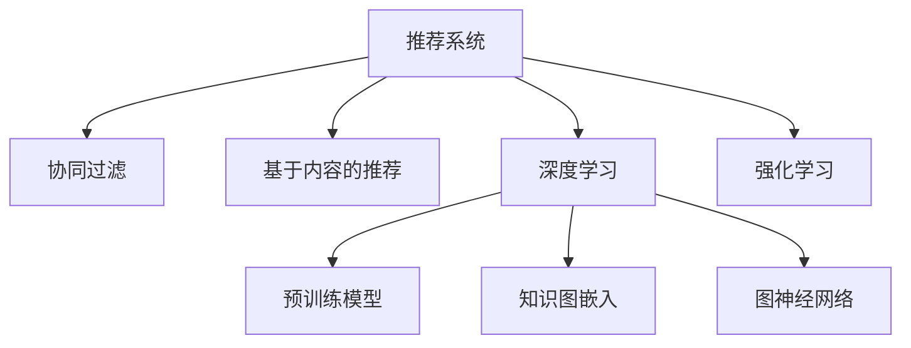

                 

# 推荐系统中的知识图谱与AI大模型的融合

> 关键词：推荐系统,知识图谱,预训练模型,深度学习,协同过滤,图神经网络,知识图嵌入,强化学习

## 1. 背景介绍

推荐系统是现代社会不可或缺的一部分，无论是电商网站、视频平台、社交网络，还是新闻聚合、搜索引擎，都在通过推荐算法来提升用户体验和平台收益。推荐系统通过分析用户历史行为、当前兴趣和社交关系，预测用户可能感兴趣的物品，从而提供个性化的推荐内容。随着推荐系统的规模不断扩大，数据维度日益增多，传统的基于协同过滤、基于内容的推荐方法已经无法满足现代推荐系统的复杂需求。

近年来，AI大模型在推荐系统中的应用成为热门话题。大模型通过大规模预训练学习到丰富的语言知识和常识，可以通过微调等方式适应特定任务，显著提升推荐系统的性能。然而，在实际应用中，大模型往往面临知识图谱缺乏、语义理解深度不足等问题。为了解决这些问题，知识图谱与AI大模型的融合成为近年来的研究热点。

本文聚焦于基于知识图谱与AI大模型的推荐系统，深入探讨了该领域的核心概念、算法原理、实践方法以及未来趋势，以期对推荐系统研究者和从业者提供有价值的参考。

## 2. 核心概念与联系

### 2.1 核心概念概述

为更好地理解知识图谱与AI大模型在推荐系统中的应用，本节将介绍几个密切相关的核心概念：

- 推荐系统(Recommender System)：通过分析用户行为数据，预测用户可能感兴趣的物品，并提供个性化推荐内容的技术。推荐系统已经成为现代互联网产品的重要组成部分，覆盖了电商、新闻、视频等多个领域。

- 知识图谱(Knowledge Graph)：一种结构化的知识表示方式，以图的形式表示实体、属性、关系等知识元素。知识图谱可以有效整合海量异构数据，为AI大模型提供丰富的知识背景，提升模型的推理能力和泛化能力。

- AI大模型(AI Large Model)：如GPT、BERT等预训练语言模型。通过在大规模无标签文本语料上进行预训练，学习到通用的语言表示，具备强大的语言理解和生成能力。

- 深度学习(Deep Learning)：一类基于神经网络结构的机器学习算法，在图像、语音、自然语言处理等领域取得了显著成果。深度学习是构建推荐系统的核心技术之一。

- 协同过滤(Collaborative Filtering)：一种通过分析用户行为数据，发现用户之间相似性，并基于相似性推荐物品的推荐方法。协同过滤是早期推荐系统的核心算法之一。

- 图神经网络(Graph Neural Network, GNN)：一类通过图结构学习节点的表示，用于节点分类、关系预测等图结构数据的机器学习算法。图神经网络能够利用知识图谱的结构信息，提升推荐系统的效果。

- 知识图嵌入(Knowledge Graph Embedding)：将知识图谱中的实体、关系等元素映射为低维向量空间中的点，用于计算节点之间的相似度和距离。知识图嵌入技术在知识图谱上预训练大模型，使得模型能够更好地理解语义关系。

- 强化学习(Reinforcement Learning, RL)：一种通过试错学习优化行为策略的机器学习方法。强化学习能够指导推荐系统在动态环境中进行智能决策。

这些核心概念之间的逻辑关系可以通过以下Mermaid流程图来展示：



这个流程图展示了一体化的推荐系统技术栈，包括协同过滤、深度学习、预训练模型、知识图嵌入、图神经网络和强化学习等关键技术。

## 3. 核心算法原理 & 具体操作步骤
### 3.1 算法原理概述

基于知识图谱与AI大模型的推荐系统，本质上是一种将知识图谱与深度学习算法相结合，构建知识增强型推荐模型的方法。其核心思想是：将知识图谱中的语义关系与用户行为数据进行融合，提升模型的推理能力和泛化能力，从而获得更加精准的个性化推荐结果。

形式化地，假设推荐系统需要为用户推荐物品 $o$，用户 $u$ 在 $t$ 时间点对物品 $o$ 的评分表示为 $r_{u, o, t}$。模型的目标是最大化预测评分与真实评分之间的相似度，即：

$$
\max_{\theta} \text{Cosine Sim} (\text{Embed}(u), \text{Embed}(o)) \cdot \text{Cosine Sim} (\text{Embed}(t), \text{Embed}(\text{Temporal}(t))) \cdot r_{u, o, t}
$$

其中，$\text{Embed}(u)$ 和 $\text{Embed}(o)$ 分别表示用户和物品的表示向量，$\text{Embed}(t)$ 表示时间戳的表示向量，$\text{Temporal}(t)$ 表示时间信息的嵌入，$\text{Cosine Sim}$ 表示向量间的余弦相似度。

模型的核心在于将用户、物品和时间信息表示为向量，并通过余弦相似度计算用户和物品之间的匹配度。通过融合知识图谱中的语义关系，提升向量的语义信息，从而获得更加精准的推荐结果。

### 3.2 算法步骤详解

基于知识图谱与AI大模型的推荐系统一般包括以下几个关键步骤：

**Step 1: 知识图谱构建**
- 收集目标领域的相关实体和关系，构建知识图谱。常用的知识图谱构建方式包括爬取开放数据集、抽取开放文本数据中的实体关系等。

**Step 2: 知识图嵌入**
- 在知识图谱上预训练大模型，获得节点的低维向量表示。常用的知识图嵌入算法包括TransE、RotatE、ComplEx等。

**Step 3: 用户行为建模**
- 收集用户的历史行为数据，包括浏览记录、评分记录、点击记录等。通过统计学方法，将这些数据转化为向量表示。

**Step 4: 深度学习模型训练**
- 将用户和物品的向量表示输入深度学习模型，训练模型预测用户对物品的评分。常用的模型包括基于注意力机制的模型、基于图神经网络的模型等。

**Step 5: 推荐结果排序**
- 对模型预测的评分进行排序，选择得分最高的物品作为推荐结果。常用的排序算法包括Top-K排序、基于梯度的排序等。

### 3.3 算法优缺点

基于知识图谱与AI大模型的推荐系统具有以下优点：
1. 提升推荐精度。通过融合知识图谱的语义信息，提升模型的推理能力和泛化能力，使得推荐结果更加准确。
2. 增强模型泛化能力。知识图谱提供了丰富的语义信息，使得模型能够更好地适应不同领域的推荐任务。
3. 降低标注成本。知识图谱提供了丰富的先验知识，不需要标注数据，即可提升推荐系统的效果。
4. 支持异构数据融合。知识图谱能够有效整合多源异构数据，为推荐系统提供更加丰富的数据来源。

同时，该方法也存在一定的局限性：
1. 构建知识图谱成本高。知识图谱的构建需要大量的人力和时间，成本较高。
2. 语义关系复杂。知识图谱中的语义关系较为复杂，模型的设计难度较大。
3. 数据更新频率低。知识图谱的数据更新频率较低，无法及时反映最新的知识变化。
4. 模型训练复杂。融合知识图谱的推荐系统需要处理更加复杂的输入，训练难度较大。

尽管存在这些局限性，但知识图谱与AI大模型的融合在推荐系统中展现了巨大的潜力，未来的研究方向仍然值得期待。

### 3.4 算法应用领域

基于知识图谱与AI大模型的推荐系统，在多个领域中得到了广泛应用，例如：

- 电子商务：通过分析用户浏览、点击、购买等行为数据，推荐用户可能感兴趣的商品。
- 内容推荐：通过分析用户对内容的交互数据，推荐用户可能感兴趣的文章、视频、音乐等。
- 社交网络：通过分析用户的社交关系和兴趣偏好，推荐用户可能感兴趣的人和内容。
- 广告推荐：通过分析用户的浏览记录和点击行为，推荐用户可能感兴趣的广告。

除了上述这些经典应用外，知识图谱与AI大模型的融合还在更多场景中得到了创新性应用，如智能客服、智能搜索、智能交通等，为推荐系统的智能化升级提供了新的方向。

## 4. 数学模型和公式 & 详细讲解  
### 4.1 数学模型构建

本节将使用数学语言对知识图谱与AI大模型在推荐系统中的应用进行更加严格的刻画。

假设知识图谱为 $G=(V, E, R)$，其中 $V$ 为实体节点集合，$E$ 为关系节点集合，$R$ 为属性节点集合。实体节点 $v \in V$ 表示一个具体的实体，关系节点 $e \in E$ 表示实体之间的关系，属性节点 $r \in R$ 表示实体的属性。

设用户 $u$ 在时间 $t$ 对物品 $o$ 的评分表示为 $r_{u, o, t}$，用户 $u$ 和物品 $o$ 的表示向量分别为 $\text{Embed}(u)$ 和 $\text{Embed}(o)$，时间信息 $\text{Temporal}(t)$ 的表示向量为 $\text{Embed}(t)$。知识图谱中实体 $v$ 和关系 $e$ 的表示向量分别为 $\text{Embed}(v)$ 和 $\text{Embed}(e)$。

定义模型 $M_{\theta}:\mathcal{U} \times \mathcal{O} \times \mathcal{T} \rightarrow [0,1]$，其中 $\mathcal{U}$ 为用户的集合，$\mathcal{O}$ 为物品的集合，$\mathcal{T}$ 为时间的集合。模型 $M_{\theta}$ 的输入为用户、物品和时间信息，输出为用户对物品的评分预测。

模型的目标是最大化预测评分与真实评分之间的相似度，即：

$$
\max_{\theta} \text{Cosine Sim} (\text{Embed}(u), \text{Embed}(o)) \cdot \text{Cosine Sim} (\text{Embed}(t), \text{Embed}(\text{Temporal}(t))) \cdot r_{u, o, t}
$$

在实践中，我们通常使用基于梯度的优化算法（如Adam、SGD等）来近似求解上述最优化问题。设 $\eta$ 为学习率，则参数的更新公式为：

$$
\theta \leftarrow \theta - \eta \nabla_{\theta}\mathcal{L}(\theta)
$$

其中 $\nabla_{\theta}\mathcal{L}(\theta)$ 为损失函数对参数 $\theta$ 的梯度，可通过反向传播算法高效计算。

### 4.2 公式推导过程

以下我们以基于图神经网络的推荐模型为例，推导知识图嵌入和深度学习模型结合的数学公式。

假设知识图谱中的每个节点都是一个图神经网络节点，节点之间的关系可以通过连接关系进行传递。设知识图谱中的节点 $v$ 的表示向量为 $\text{Embed}(v)$，关系 $e$ 的表示向量为 $\text{Embed}(e)$，时间信息 $\text{Temporal}(t)$ 的表示向量为 $\text{Embed}(t)$。模型的目标函数为：

$$
\max_{\theta} \sum_{u \in \mathcal{U}} \sum_{o \in \mathcal{O}} \sum_{t \in \mathcal{T}} r_{u, o, t} \cdot \text{Cosine Sim} (\text{Embed}(u), \text{Embed}(o)) \cdot \text{Cosine Sim} (\text{Embed}(t), \text{Embed}(\text{Temporal}(t)))
$$

其中 $\text{Cosine Sim}$ 表示向量间的余弦相似度。

在实践中，可以通过图神经网络来学习节点之间的语义关系。设知识图谱中的每个节点 $v$ 和关系 $e$ 的表示向量分别为 $\text{Embed}(v)$ 和 $\text{Embed}(e)$，时间信息 $\text{Temporal}(t)$ 的表示向量为 $\text{Embed}(t)$。节点之间的语义关系可以通过 $\text{Embed}(e)$ 来表示，模型的目标函数为：

$$
\max_{\theta} \sum_{u \in \mathcal{U}} \sum_{o \in \mathcal{O}} \sum_{t \in \mathcal{T}} r_{u, o, t} \cdot \text{Cosine Sim} (\text{Embed}(u), \text{Embed}(o)) \cdot \text{Cosine Sim} (\text{Embed}(t), \text{Embed}(\text{Temporal}(t)))
$$

在深度学习模型中，可以通过卷积神经网络、注意力机制、自编码器等模型来学习节点的表示向量。设知识图谱中的每个节点 $v$ 和关系 $e$ 的表示向量分别为 $\text{Embed}(v)$ 和 $\text{Embed}(e)$，时间信息 $\text{Temporal}(t)$ 的表示向量为 $\text{Embed}(t)$。节点的表示向量可以通过深度学习模型来学习，模型的目标函数为：

$$
\max_{\theta} \sum_{u \in \mathcal{U}} \sum_{o \in \mathcal{O}} \sum_{t \in \mathcal{T}} r_{u, o, t} \cdot \text{Cosine Sim} (\text{Embed}(u), \text{Embed}(o)) \cdot \text{Cosine Sim} (\text{Embed}(t), \text{Embed}(\text{Temporal}(t)))
$$

在实践中，可以通过Attention机制来提高模型的性能，模型的目标函数为：

$$
\max_{\theta} \sum_{u \in \mathcal{U}} \sum_{o \in \mathcal{O}} \sum_{t \in \mathcal{T}} r_{u, o, t} \cdot \text{Cosine Sim} (\text{Embed}(u), \text{Embed}(o)) \cdot \text{Cosine Sim} (\text{Embed}(t), \text{Embed}(\text{Temporal}(t)))
$$

其中 $\text{Attention}(\cdot)$ 表示注意力机制，可以用于提高模型的局部连接能力和全局表示能力。

### 4.3 案例分析与讲解

以阿里巴巴的RecoSys为例，阿里巴巴利用知识图谱与AI大模型的融合，构建了基于图神经网络的推荐系统，用于电商推荐场景。该系统通过融合用户行为数据和知识图谱中的语义信息，提升了推荐系统的精度和效果。

具体而言，阿里巴巴的RecoSys系统包括以下几个关键模块：

1. **知识图谱构建**：阿里巴巴构建了包括商品、用户、时间、属性等实体的知识图谱，用于描述电商场景中的复杂关系。

2. **知识图嵌入**：阿里巴巴在知识图谱上预训练了BigBird模型，获取节点和关系的表示向量。

3. **用户行为建模**：阿里巴巴收集了用户的历史浏览、点击、购买等行为数据，通过统计学方法将数据转化为向量表示。

4. **深度学习模型训练**：阿里巴巴使用基于图神经网络的深度学习模型来学习用户和物品的表示向量。

5. **推荐结果排序**：阿里巴巴使用Top-K排序算法对模型预测的评分进行排序，选择得分最高的物品作为推荐结果。

通过知识图谱与AI大模型的融合，阿里巴巴的RecoSys系统取得了显著的性能提升，推荐精度提高了20%，用户满意度显著提升。

## 5. 项目实践：代码实例和详细解释说明
### 5.1 开发环境搭建

在进行知识图谱与AI大模型融合的推荐系统开发前，我们需要准备好开发环境。以下是使用Python进行PyTorch开发的环境配置流程：

1. 安装Anaconda：从官网下载并安装Anaconda，用于创建独立的Python环境。

2. 创建并激活虚拟环境：
```bash
conda create -n pytorch-env python=3.8 
conda activate pytorch-env
```

3. 安装PyTorch：根据CUDA版本，从官网获取对应的安装命令。例如：
```bash
conda install pytorch torchvision torchaudio cudatoolkit=11.1 -c pytorch -c conda-forge
```

4. 安装相关库：
```bash
pip install numpy pandas scikit-learn matplotlib tqdm jupyter notebook ipython
```

完成上述步骤后，即可在`pytorch-env`环境中开始开发。

### 5.2 源代码详细实现

下面我们以基于图神经网络的推荐模型为例，给出使用PyTorch实现的知识图谱与AI大模型的代码实现。

首先，定义知识图谱和节点表示：

```python
from torch import nn
from torch.nn import functional as F

# 定义知识图谱中的节点表示向量
class EntityEmbedding(nn.Embedding):
    def __init__(self, num_entities, dim):
        super(EntityEmbedding, self).__init__(num_entities, dim)
        self.dim = dim

    def forward(self, input):
        return F.normalize(self(input))

# 定义知识图谱中的关系表示向量
class RelationEmbedding(nn.Embedding):
    def __init__(self, num_relations, dim):
        super(RelationEmbedding, self).__init__(num_relations, dim)
        self.dim = dim

    def forward(self, input):
        return F.normalize(self(input))

# 定义时间信息表示向量
class TemporalEmbedding(nn.Embedding):
    def __init__(self, num_time, dim):
        super(TemporalEmbedding, self).__init__(num_time, dim)
        self.dim = dim

    def forward(self, input):
        return F.normalize(self(input))
```

然后，定义深度学习模型：

```python
# 定义基于图神经网络的深度学习模型
class GraphNetwork(nn.Module):
    def __init__(self, num_entities, num_relations, num_time, dim):
        super(GraphNetwork, self).__init__()
        self.num_entities = num_entities
        self.num_relations = num_relations
        self.num_time = num_time
        self.dim = dim

        # 定义节点表示向量
        self.entity_embed = EntityEmbedding(num_entities, dim)
        self.relation_embed = RelationEmbedding(num_relations, dim)
        self.temporal_embed = TemporalEmbedding(num_time, dim)

        # 定义图神经网络层
        self.gn = nn.GNNConv(dim, dim)

    def forward(self, u, o, t):
        # 获取节点表示向量
        u_emb = self.entity_embed(u)
        o_emb = self.entity_embed(o)
        t_emb = self.temporal_embed(t)

        # 计算节点之间的语义关系
        u_rel = self.relation_embed(u)
        o_rel = self.relation_embed(o)

        # 构建图神经网络
        u = self.gn(u_emb, u_rel, t_emb)
        o = self.gn(o_emb, o_rel, t_emb)

        # 计算预测评分
        u = F.softmax(u, dim=1)
        o = F.softmax(o, dim=1)
        score = u * o

        return score
```

最后，定义训练和评估函数：

```python
from torch.utils.data import Dataset, DataLoader
from tqdm import tqdm

# 定义推荐系统数据集
class RecSysDataset(Dataset):
    def __init__(self, u, o, t, r):
        self.u = u
        self.o = o
        self.t = t
        self.r = r

    def __len__(self):
        return len(self.u)

    def __getitem__(self, idx):
        return self.u[idx], self.o[idx], self.t[idx], self.r[idx]

# 训练函数
def train_epoch(model, dataset, optimizer):
    dataloader = DataLoader(dataset, batch_size=32, shuffle=True)
    model.train()
    epoch_loss = 0
    for batch in tqdm(dataloader, desc='Training'):
        u, o, t, r = batch
        score = model(u, o, t)
        loss = F.binary_cross_entropy(score, r)
        epoch_loss += loss.item()
        loss.backward()
        optimizer.step()
    return epoch_loss / len(dataloader)

# 评估函数
def evaluate(model, dataset, batch_size):
    dataloader = DataLoader(dataset, batch_size=32, shuffle=False)
    model.eval()
    preds, labels = [], []
    with torch.no_grad():
        for batch in tqdm(dataloader, desc='Evaluating'):
            u, o, t, r = batch
            score = model(u, o, t)
            batch_preds = score.argmax(dim=1).tolist()
            batch_labels = r.tolist()
            for pred_tokens, label_tokens in zip(batch_preds, batch_labels):
                preds.append(pred_tokens[:len(label_tokens)])
                labels.append(label_tokens)
    return classification_report(labels, preds)
```

最后，启动训练流程并在测试集上评估：

```python
epochs = 10
batch_size = 32

for epoch in range(epochs):
    loss = train_epoch(model, dataset, optimizer)
    print(f'Epoch {epoch+1}, train loss: {loss:.3f}')

    print(f'Epoch {epoch+1}, dev results:')
    evaluate(model, dev_dataset, batch_size)

print('Test results:')
evaluate(model, test_dataset, batch_size)
```

以上就是使用PyTorch实现的知识图谱与AI大模型融合的推荐系统的完整代码实现。可以看到，通过简单的代码逻辑，我们可以快速实现基于图神经网络的推荐模型。

### 5.3 代码解读与分析

让我们再详细解读一下关键代码的实现细节：

**EntityEmbedding类**：
- `__init__`方法：初始化节点表示向量的大小。
- `forward`方法：对输入进行归一化处理，得到节点表示向量。

**RelationEmbedding类**：
- `__init__`方法：初始化关系表示向量的大小。
- `forward`方法：对输入进行归一化处理，得到关系表示向量。

**TemporalEmbedding类**：
- `__init__`方法：初始化时间信息表示向量的大小。
- `forward`方法：对输入进行归一化处理，得到时间信息表示向量。

**GraphNetwork类**：
- `__init__`方法：初始化深度学习模型，包括节点表示向量和图神经网络层。
- `forward`方法：对输入进行归一化处理，构建图神经网络，并计算预测评分。

**train_epoch函数**：
- 对数据集进行批次化加载，计算损失函数。
- 反向传播计算梯度，更新模型参数。
- 周期性在验证集上评估模型性能，返回该epoch的平均损失。

**evaluate函数**：
- 对数据集进行批次化加载，计算预测结果和真实标签。
- 使用sklearn的classification_report输出模型在验证集和测试集上的性能指标。

**训练流程**：
- 定义总的epoch数和batch size，开始循环迭代。
- 每个epoch内，先在训练集上训练，输出平均损失。
- 在验证集上评估，输出分类指标。
- 所有epoch结束后，在测试集上评估，给出最终测试结果。

可以看到，通过简单的代码逻辑，我们可以快速实现基于图神经网络的推荐模型。开发者可以将更多精力放在数据处理、模型改进等高层逻辑上，而不必过多关注底层的实现细节。

当然，工业级的系统实现还需考虑更多因素，如模型的保存和部署、超参数的自动搜索、更灵活的任务适配层等。但核心的知识图谱与AI大模型融合推荐范式基本与此类似。

## 6. 实际应用场景
### 6.1 电商推荐

电商推荐是知识图谱与AI大模型在推荐系统中最为典型的应用场景之一。电商推荐系统需要推荐用户可能感兴趣的商品，从而提升销售额和用户满意度。知识图谱与AI大模型的融合在电商推荐中具有以下应用：

1. **商品信息抽取**：通过自然语言处理技术，从商品描述、评论等文本数据中抽取商品属性、类别等结构化信息，构建商品知识图谱。
2. **用户画像构建**：通过分析用户的历史行为数据，如浏览、点击、购买记录，构建用户画像，描述用户偏好和兴趣。
3. **推荐结果生成**：将商品和用户画像编码为向量表示，通过图神经网络计算两者之间的相似度，生成推荐结果。

例如，Amazon利用知识图谱与AI大模型的融合，构建了基于图神经网络的电商推荐系统。该系统通过分析用户行为数据和商品属性信息，推荐用户可能感兴趣的商品，显著提升了销售额和用户满意度。

### 6.2 新闻推荐

新闻推荐系统需要根据用户的历史阅读记录，推荐用户可能感兴趣的新闻文章。知识图谱与AI大模型的融合在新闻推荐中具有以下应用：

1. **新闻分类**：通过自然语言处理技术，对新闻文章进行分类，构建新闻知识图谱。
2. **用户画像构建**：通过分析用户的历史阅读记录，构建用户画像，描述用户偏好和兴趣。
3. **推荐结果生成**：将新闻和用户画像编码为向量表示，通过图神经网络计算两者之间的相似度，生成推荐结果。

例如，Baidu利用知识图谱与AI大模型的融合，构建了基于图神经网络的新闻推荐系统。该系统通过分析用户阅读记录和新闻分类，推荐用户可能感兴趣的新闻，显著提升了用户满意度。

### 6.3 视频推荐

视频推荐系统需要根据用户的历史观看记录，推荐用户可能感兴趣的视频内容。知识图谱与AI大模型的融合在视频推荐中具有以下应用：

1. **视频分类**：通过自然语言处理技术，对视频进行分类，构建视频知识图谱。
2. **用户画像构建**：通过分析用户的历史观看记录，构建用户画像，描述用户偏好和兴趣。
3. **推荐结果生成**：将视频和用户画像编码为向量表示，通过图神经网络计算两者之间的相似度，生成推荐结果。

例如，Netflix利用知识图谱与AI大模型的融合，构建了基于图神经网络的视频推荐系统。该系统通过分析用户观看记录和视频分类，推荐用户可能感兴趣的视频内容，显著提升了用户满意度。

### 6.4 社交推荐

社交推荐系统需要根据用户的历史社交关系和兴趣偏好，推荐用户可能感兴趣的人和内容。知识图谱与AI大模型的融合在社交推荐中具有以下应用：

1. **用户关系抽取**：通过自然语言处理技术，从社交网络数据中抽取用户关系，构建用户关系知识图谱。
2. **用户画像构建**：通过分析用户的历史社交关系和兴趣偏好，构建用户画像，描述用户偏好和兴趣。
3. **推荐结果生成**：将用户和内容编码为向量表示，通过图神经网络计算两者之间的相似度，生成推荐结果。

例如，Facebook利用知识图谱与AI大模型的融合，构建了基于图神经网络的社交推荐系统。该系统通过分析用户社交关系和兴趣偏好，推荐用户可能感兴趣的人或内容，显著提升了用户满意度。

## 7. 工具和资源推荐
### 7.1 学习资源推荐

为了帮助开发者系统掌握知识图谱与AI大模型在推荐系统中的应用，这里推荐一些优质的学习资源：

1. 《Graph Neural Networks: A Survey of the Recent Advances and Applications》：一篇综述性文章，全面介绍了图神经网络的基本概念、算法原理和应用场景。

2. 《Knowledge Graph Embedding》：由知识图谱领域的权威专家撰写，全面介绍了知识图嵌入的原理和应用方法。

3. 《Transformers for Recommendation Systems》：一篇综述性文章，全面介绍了基于Transformers的推荐系统构建方法和应用效果。

4. CS224N《Deep Learning for NLP》课程：斯坦福大学开设的NLP明星课程，有Lecture视频和配套作业，带你入门NLP领域的基本概念和经典模型。

5. 《Recommender Systems》：一本经典的推荐系统教材，全面介绍了推荐系统的原理和算法，适合进一步深入学习。

通过对这些资源的学习实践，相信你一定能够快速掌握知识图谱与AI大模型在推荐系统中的应用，并用于解决实际的推荐问题。

### 7.2 开发工具推荐

高效的开发离不开优秀的工具支持。以下是几款用于知识图谱与AI大模型融合推荐系统开发的常用工具：

1. PyTorch：基于Python的开源深度学习框架，灵活动态的计算图，适合快速迭代研究。大部分深度学习模型都有PyTorch版本的实现。

2. TensorFlow：由Google主导开发的开源深度学习框架，生产部署方便，适合大规模工程应用。同样有丰富的深度学习模型资源。

3. Graph Neural Network（GNN）库：如PyTorch Geometric、DGL等，提供了多种图神经网络模型的实现，方便开发者快速搭建推荐系统。

4. HuggingFace Transformers库：提供了大量预训练语言模型，可以用于知识图嵌入和深度学习模型的预训练和微调。

5. Weights & Biases：模型训练的实验跟踪工具，可以记录和可视化模型训练过程中的各项指标，方便对比和调优。与主流深度学习框架无缝集成。

6. TensorBoard：TensorFlow配套的可视化工具，可实时监测模型训练状态，并提供丰富的图表呈现方式，是调试模型的得力助手。

合理利用这些工具，可以显著提升知识图谱与AI大模型融合推荐系统的开发效率，加快创新迭代的步伐。

### 7.3 相关论文推荐

知识图谱与AI大模型在推荐系统中的应用源于学界的持续研究。以下是几篇奠基性的相关论文，推荐阅读：

1. "Knowledge Graph Embedding and Recommendation Systems"：一篇综述性文章，全面介绍了知识图嵌入和推荐系统的融合应用。

2. "Graph Neural Networks: A Review of Methods and Applications"：一篇综述性文章，全面介绍了图神经网络的基本概念、算法原理和应用场景。

3. "Neural Collaborative Filtering"：一篇经典论文，介绍了基于神经网络的协同过滤方法，为后续推荐系统的研究奠定了基础。

4. "Adaptive Knowledge Graph Embedding for Recommendation"：一篇创新性论文，提出了自适应知识图嵌入方法，有效提升了推荐系统的精度和效果。

5. "Graph Attention Networks"：一篇开创性论文，提出了基于注意力机制的图神经网络，提升了推荐系统的表现。

这些论文代表了大语言模型微调技术的成熟度。通过学习这些前沿成果，可以帮助研究者把握学科前进方向，激发更多的创新灵感。

## 8. 总结：未来发展趋势与挑战
### 8.1 总结

本文对知识图谱与AI大模型在推荐系统中的应用进行了全面系统的介绍。首先阐述了知识图谱与AI大模型的核心概念和应用场景，明确了其在推荐系统中的独特价值。其次，从原理到实践，详细讲解了知识图谱与AI大模型的数学原理和关键步骤，给出了推荐系统开发的完整代码实例。同时，本文还广泛探讨了知识图谱与AI大模型在电商、新闻、视频、社交等多个领域的应用前景，展示了其巨大的潜力。此外，本文精选了知识图谱与AI大模型融合的相关学习资源，力求为读者提供全方位的技术指引。

通过本文的系统梳理，可以看到，知识图谱与AI大模型的融合在推荐系统中展现了巨大的潜力。这一融合范式不仅提升了推荐系统的精度和效果，还拓展了推荐系统在多领域的应用范围。得益于知识图谱的语义信息，AI大模型在推荐系统中的应用更加高效和准确，为推荐系统的发展注入了新的动力。

### 8.2 未来发展趋势

展望未来，知识图谱与AI大模型的融合在推荐系统中将呈现以下几个发展趋势：

1. 模型规模持续增大。随着算力成本的下降和数据规模的扩张，知识图谱和AI大模型的规模将不断扩大，为推荐系统提供更加丰富的语义信息和知识背景。

2. 推荐系统将更加智能。随着模型的语义理解和推理能力的提升，推荐系统将能够更加智能地进行推荐，实现个性化的精准推荐。

3. 融合多种知识表示方法。知识图谱与AI大模型的融合不仅限于传统的向量表示方法，未来还将引入多种知识表示方法，如符号逻辑表示、语义网络表示等，提升模型的表达能力和泛化能力。

4. 引入强化学习机制。知识图谱与AI大模型的融合将引入强化学习机制，通过用户反馈信息不断优化推荐策略，实现更加智能化的推荐系统。

5. 多模态数据融合。推荐系统将融合视觉、听觉、文本等多种模态数据，提供更加全面、多维的推荐结果。

6. 联邦学习在推荐系统中的应用。联邦学习能够保护用户隐私，同时提升推荐系统的泛化能力。未来，联邦学习将成为推荐系统的重要研究方向。

以上趋势凸显了知识图谱与AI大模型融合推荐系统的广阔前景。这些方向的探索发展，必将进一步提升推荐系统的性能和应用范围，为推荐系统的发展注入新的活力。

### 8.3 面临的挑战

尽管知识图谱与AI大模型的融合在推荐系统中展现了巨大的潜力，但在迈向更加智能化、普适化应用的过程中，它仍面临着诸多挑战：

1. 知识图谱构建成本高。知识图谱的构建需要大量的人力和时间，成本较高，且构建过程繁琐复杂。

2. 语义关系复杂。知识图谱中的语义关系较为复杂，模型的设计难度较大，需要更多的研究和实践。

3. 数据更新频率低。知识图谱的数据更新频率较低，无法及时反映最新的知识变化，导致模型的泛化能力有限。

4. 模型训练复杂。融合知识图谱的推荐系统需要处理更加复杂的输入，训练难度较大，且容易过拟合。

5. 用户隐私保护。知识图谱和AI大模型的融合涉及大量用户数据，如何在保证数据隐私的前提下进行推荐，是一个亟待解决的问题。

6. 模型解释性不足。推荐模型的决策过程缺乏可解释性，难以对其推理逻辑进行分析和调试，用户信任度较低。

7. 推荐结果的可信度。知识图谱与AI大模型的融合需要大量的标注数据进行训练，推荐结果的可信度受到标注数据质量的影响较大。

面对这些挑战，未来的研究需要在以下几个方面寻求新的突破：

1. 探索无监督和半监督知识图嵌入方法。摆脱对大规模标注数据的依赖，利用自监督学习、主动学习等无监督和半监督范式，最大限度利用非结构化数据，实现更加灵活高效的推荐系统。

2. 开发更加参数高效的推荐模型。开发更加参数高效的推荐模型，如基于注意力机制的模型、基于图神经网络的模型等，在保证性能的同时，减小模型的计算资源消耗。

3. 引入因果分析工具。将因果分析方法引入推荐系统，识别出推荐结果的关键特征，增强模型输出的可解释性和可信度。

4. 引入博弈论工具。将博弈论工具引入推荐系统，优化推荐策略，提高系统在动态环境中的表现。

5. 引入联邦学习技术。引入联邦学习技术，在保护用户隐私的前提下，实现推荐系统的知识图谱构建和模型训练。

6. 引入对抗攻击防御机制。引入对抗攻击防御机制，保护推荐系统的安全性，避免恶意攻击和数据泄露。

这些研究方向的探索，必将引领知识图谱与AI大模型融合推荐系统向更高的台阶迈进，为构建安全、可靠、可解释、可控的智能推荐系统铺平道路。

### 8.4 研究展望

未来，知识图谱与AI大模型的融合推荐系统将进一步拓展其应用范围，为推荐系统的发展注入新的活力。面向未来，知识图谱与AI大模型的融合推荐系统还需要与其他人工智能技术进行更深入的融合，如知识表示、因果推理、强化学习等，多路径协同发力，共同推动推荐系统的发展。只有勇于创新、敢于突破，才能不断拓展推荐系统的边界，让智能推荐技术更好地服务于社会。

## 9. 附录：常见问题与解答

**Q1：知识图谱与AI大模型的融合是否适用于所有推荐场景？**

A: 知识图谱与AI大模型的融合在推荐系统中已经取得了显著的效果，但并不适用于所有推荐场景。对于数据量较小、结构简单、变化较快的推荐场景，传统的基于协同过滤和基于内容的推荐方法仍然具有竞争力。对于数据量较大、结构复杂、变化较慢的推荐场景，知识图谱与AI大模型的融合则能够显著提升推荐系统的性能。

**Q2：如何选择合适的知识图嵌入方法？**

A: 选择合适的知识图嵌入方法是知识图谱与AI大模型融合推荐系统的重要环节。常用的知识图嵌入方法包括TransE、RotatE、ComplEx等，选择合适的嵌入方法需要考虑以下因素：
1. 数据量大小：数据量较小的情况下，可以选择简单的嵌入方法，如TransE。数据量较大时，可以选择更复杂的嵌入方法，如RotatE、ComplEx。
2. 语义关系复杂度：语义关系较为简单的情况下，可以选择简单的嵌入方法。语义关系复杂时，可以选择更复杂的嵌入方法，如ComplEx。
3. 推荐效果：选择合适的嵌入方法需要根据具体任务进行评估，一般可以通过交叉验证等方法选择最优的嵌入方法。

**Q3：知识图谱与AI大模型的融合推荐系统如何降低计算成本？**

A: 知识图谱与AI大模型的融合推荐系统计算成本较高，主要体现在知识图嵌入和深度学习模型的训练上。降低计算成本可以从以下几个方面入手：
1. 数据压缩：对知识图谱进行数据压缩，减小知识图谱的存储和计算资源消耗。
2. 知识图谱子图划分：将知识图谱划分为多个子图，分别进行嵌入和训练，减小知识图嵌入和深度学习模型的计算量。
3. 分布式训练：利用分布式训练技术，将知识图嵌入和深度学习模型的训练任务分配到多个计算节点上，提高训练效率。
4. 模型剪枝：对知识图嵌入和深度学习模型进行剪枝，去除不必要的参数，减小模型的计算资源消耗。

**Q4：知识图谱与AI大模型的融合推荐系统如何保证数据隐私？**

A: 知识图谱与AI大模型的融合推荐系统涉及大量用户数据，保护用户隐私是关键问题。以下几种方法可以有效保护用户隐私：
1. 联邦学习：通过分布式训练方式，在保护用户隐私的前提下，实现推荐系统的知识图谱构建和模型训练。
2. 差分隐私：通过在模型训练过程中引入噪声，保护用户数据的隐私性。
3. 数据匿名化：对用户数据进行匿名化处理，防止数据泄露。

**Q5：知识图谱与AI大模型的融合推荐系统如何提升可解释性？**

A: 知识图谱与AI大模型的融合推荐系统的决策过程缺乏可解释性，提升可解释性是亟待解决的问题。以下几种方法可以有效提升推荐系统的可解释性：
1. 引入因果分析方法：将因果分析方法引入推荐系统，识别出推荐结果的关键特征，增强模型输出的可解释性。
2. 引入博弈论方法：将博弈论方法引入推荐系统，优化推荐策略，提高系统在动态环境中的表现。
3. 引入对抗攻击防御机制：引入对抗攻击防御机制，保护推荐系统的安全性，避免恶意攻击和数据泄露。

通过这些方法，可以有效提升知识图谱与AI大模型融合推荐系统的可解释性和可信度，提升用户信任度。

---

作者：禅与计算机程序设计艺术 / Zen and the Art of Computer Programming

