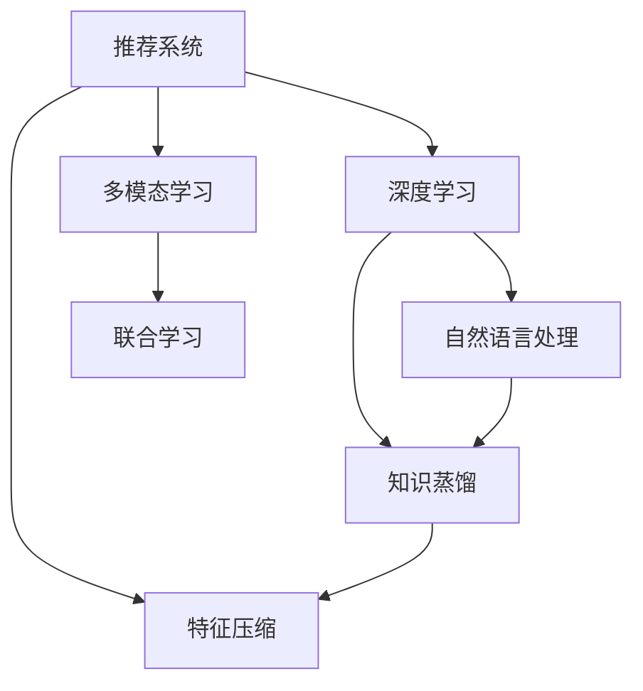

                 

# 推荐系统中的知识蒸馏：大模型技术

> 关键词：知识蒸馏, 推荐系统, 大模型, 知识表示, 蒸馏损失, 特征压缩, 深度学习, 自然语言处理(NLP)

## 1. 背景介绍

### 1.1 问题由来

推荐系统是现代互联网应用的核心之一，旨在通过分析用户行为数据，为用户推荐最相关的物品，提升用户体验和平台收益。随着数据量和复杂性的不断增加，推荐系统的准确性和可扩展性面临巨大挑战。

当前推荐系统通常依赖于特征工程、模型训练、以及优化算法等。然而，这些方法往往需要大量数据和计算资源，且对专业技能要求较高。大模型技术通过利用预训练语言模型和知识蒸馏技术，可以显著提升推荐系统的性能，降低开发成本，并提升系统的可扩展性。

### 1.2 问题核心关键点

本节将介绍大模型技术和知识蒸馏在推荐系统中的应用，重点在于：
- 大模型：指基于大规模预训练语言模型，具备强大的语言表示和推理能力，能够捕捉复杂的语言模式。
- 知识蒸馏：指通过将知识从一个模型迁移到另一个模型，提高后者性能的技术。
- 蒸馏损失：用于度量知识源和蒸馏目标之间的差异，指导蒸馏过程。
- 特征压缩：指利用蒸馏过程，提取并压缩知识源的特征表示，形成更高效的知识表示。
- 推荐系统：指通过模型预测和推荐，为用户推荐感兴趣的物品的系统。

这些核心概念共同构成了大模型在推荐系统中的应用框架，使其能够在处理大规模用户数据、提供高效推荐的同时，还能保持模型的可解释性和鲁棒性。

## 2. 核心概念与联系

### 2.1 核心概念概述

为更好地理解大模型在推荐系统中的应用，本节将介绍几个密切相关的核心概念：

- 推荐系统：通过分析用户行为数据，为用户推荐最相关物品的系统。常见类型包括协同过滤、基于内容的推荐、混合推荐等。
- 深度学习：通过构建多层神经网络，利用数据自动学习特征表示，以实现高效的推荐任务。
- 自然语言处理(NLP)：涉及语言理解、生成和分析等，是推荐系统中处理用户评论、商品描述等文本数据的必备技术。
- 知识蒸馏：通过将知识从一个模型迁移到另一个模型，提高后者性能的技术。在推荐系统中，通常用于将大模型中积累的丰富知识，迁移到较小的、更高效的模型中。
- 特征压缩：通过蒸馏过程，提取并压缩知识源的特征表示，形成更高效的知识表示。
- 多模态学习：指将不同类型的特征（如文本、图像、音频等）整合起来，进行联合学习，提高推荐的全面性和准确性。

这些核心概念之间的逻辑关系可以通过以下Mermaid流程图来展示：



这个流程图展示了大模型在推荐系统中的应用核心概念及其之间的关系：

1. 推荐系统依赖深度学习进行建模，通过多模态学习整合不同类型的数据，提高推荐效果。
2. 深度学习中，自然语言处理技术是处理文本数据的重要工具，知识蒸馏和特征压缩则是提升模型效率和性能的关键技术。
3. 知识蒸馏通过将大模型中积累的丰富知识迁移到较小的模型中，提高了模型的泛化能力和可解释性。
4. 特征压缩通过蒸馏过程提取并压缩知识源的特征表示，提高了模型的计算效率。
5. 多模态学习通过联合不同类型的数据，丰富了推荐系统的特征表示，提升了推荐的全面性和准确性。

这些概念共同构成了大模型在推荐系统中的应用框架，使其能够在各种场景下发挥强大的语言理解和推荐能力。通过理解这些核心概念，我们可以更好地把握大模型在推荐系统中的应用原理和优化方向。

## 3. 核心算法原理 & 具体操作步骤

### 3.1 算法原理概述

在大模型技术中，知识蒸馏是一种常见的技术，通过将知识从一个模型（知识源）迁移到另一个模型（蒸馏目标），以提升后者的性能。具体到推荐系统中，知识源通常是一个大型的预训练语言模型，而蒸馏目标则是一个小型模型，用于实际推荐。

知识蒸馏的核心是定义一个蒸馏损失函数，该函数度量知识源和蒸馏目标之间的差异，指导蒸馏过程。蒸馏损失通常包括两个部分：特征损失和预测损失。特征损失用于衡量知识源和蒸馏目标在特征表示上的差异，而预测损失用于衡量两者在预测结果上的差异。

通过最小化蒸馏损失，知识源的知识逐渐传递到蒸馏目标，最终形成具有优异性能的推荐模型。

### 3.2 算法步骤详解

基于大模型的推荐系统通常遵循以下步骤：

**Step 1: 准备数据集**
- 收集用户行为数据，如浏览、点击、评分等，构建推荐系统的训练数据集。
- 处理文本数据，如商品描述、用户评论等，使用NLP技术进行分词、向量化等预处理。

**Step 2: 构建蒸馏任务**
- 选择合适的蒸馏任务，如情感分析、语义匹配等，利用知识源对数据进行预训练。
- 定义蒸馏目标，如线性回归、二分类等，用于实际推荐任务。

**Step 3: 设置蒸馏损失**
- 定义特征损失和预测损失，将两者加权求和得到蒸馏损失。
- 选择合适的权重，平衡特征表示和预测结果在蒸馏过程中的重要性。

**Step 4: 执行蒸馏训练**
- 将蒸馏目标模型作为初始化参数，与知识源进行联合训练。
- 通过最小化蒸馏损失，更新蒸馏目标的参数。
- 在训练过程中，逐步降低知识源的权重，使其知识逐渐传递到蒸馏目标。

**Step 5: 测试和部署**
- 在测试集上评估蒸馏目标模型的性能，对比蒸馏前后的精度提升。
- 使用蒸馏目标模型进行实际推荐，集成到推荐系统中。
- 持续收集新数据，定期重新蒸馏模型，以适应数据分布的变化。

以上是基于大模型的推荐系统的一般流程。在实际应用中，还需要针对具体任务的特点，对蒸馏过程的各个环节进行优化设计，如改进蒸馏损失函数，引入更多的正则化技术，搜索最优的超参数组合等，以进一步提升模型性能。

### 3.3 算法优缺点

基于大模型的知识蒸馏方法具有以下优点：
1. 简单高效。只需收集少量标注数据，即可对知识源进行蒸馏，获得性能提升。
2. 通用适用。适用于各种推荐系统任务，如协同过滤、基于内容的推荐、混合推荐等。
3. 参数高效。利用蒸馏过程，可以固定大部分知识源参数，减少需优化的参数量，提高计算效率。
4. 效果显著。在学术界和工业界的诸多推荐系统任务上，基于蒸馏的方法已经刷新了最先进的性能指标。

同时，该方法也存在一定的局限性：
1. 依赖标注数据。蒸馏的效果很大程度上取决于标注数据的质量和数量，获取高质量标注数据的成本较高。
2. 知识传递有限。当知识源和蒸馏目标之间存在较大结构差异时，蒸馏的效果可能较差。
3. 可解释性不足。蒸馏目标模型的决策过程通常缺乏可解释性，难以对其推理逻辑进行分析和调试。

尽管存在这些局限性，但就目前而言，基于知识蒸馏的方法仍是大模型推荐系统应用的主流范式。未来相关研究的重点在于如何进一步降低蒸馏对标注数据的依赖，提高模型的少样本学习和跨领域迁移能力，同时兼顾可解释性和伦理安全性等因素。

### 3.4 算法应用领域

基于大模型的知识蒸馏方法，在推荐系统中已经被广泛应用，涵盖了大规模推荐、个性化推荐、实时推荐等多个领域，如：

- 电商推荐：如亚马逊、淘宝等电商平台，通过蒸馏用户行为数据，为用户提供个性化商品推荐。
- 视频推荐：如Netflix、YouTube等视频平台，利用用户观看行为和评论数据，推荐相关视频内容。
- 新闻推荐：如今日头条、知乎等新闻应用，通过蒸馏用户阅读行为和反馈，推荐相关新闻内容。
- 音乐推荐：如Spotify、网易云音乐等音乐平台，利用用户听歌行为和评分，推荐用户喜爱的音乐。

除了上述这些经典任务外，大模型蒸馏技术还被创新性地应用到更多场景中，如可控推荐、长尾推荐、跨域推荐等，为推荐系统带来了全新的突破。随着蒸馏方法的不断演进，相信推荐系统必将在更广阔的应用领域大放异彩。

## 4. 数学模型和公式 & 详细讲解  

### 4.1 数学模型构建

本节将使用数学语言对基于大模型的推荐系统中的知识蒸馏过程进行更加严格的刻画。

记知识源模型为 $M_{\theta}:\mathcal{X} \rightarrow \mathcal{Y}$，其中 $\mathcal{X}$ 为输入空间，$\mathcal{Y}$ 为输出空间，$\theta$ 为知识源模型参数。蒸馏目标模型为 $M_{\phi}:\mathcal{X} \rightarrow \mathcal{Y}$，其中 $\phi$ 为蒸馏目标模型参数。

定义蒸馏任务 $T$ 的数据集为 $D=\{(x_i,y_i)\}_{i=1}^N, x_i \in \mathcal{X}, y_i \in \mathcal{Y}$。知识源和蒸馏目标在训练数据集 $D$ 上的蒸馏损失函数为：

$$
\mathcal{L}_{\text{distill}}(\theta,\phi) = \lambda_{\text{feat}}\mathcal{L}_{\text{feat}}(\theta,\phi) + \lambda_{\text{pred}}\mathcal{L}_{\text{pred}}(\theta,\phi)
$$

其中，$\lambda_{\text{feat}}$ 和 $\lambda_{\text{pred}}$ 分别为特征损失和预测损失的权重，$\mathcal{L}_{\text{feat}}$ 和 $\mathcal{L}_{\text{pred}}$ 分别为特征损失和预测损失。

### 4.2 公式推导过程

以下我们以二分类任务为例，推导蒸馏损失函数及其梯度的计算公式。

假设蒸馏目标模型 $M_{\phi}$ 在输入 $x$ 上的输出为 $\hat{y}=M_{\phi}(x)$，真实标签 $y \in \{0,1\}$。知识源模型 $M_{\theta}$ 在输入 $x$ 上的输出为 $\tilde{y}=M_{\theta}(x)$。

二分类交叉熵损失函数定义为：

$$
\ell(y,\tilde{y}) = -[y\log \tilde{y} + (1-y)\log (1-\tilde{y})]
$$

特征损失 $\mathcal{L}_{\text{feat}}$ 用于衡量知识源和蒸馏目标在特征表示上的差异，通常可以定义为：

$$
\mathcal{L}_{\text{feat}}(\theta,\phi) = ||M_{\theta}(x) - M_{\phi}(x)||^2
$$

预测损失 $\mathcal{L}_{\text{pred}}$ 用于衡量知识源和蒸馏目标在预测结果上的差异，通常可以定义为：

$$
\mathcal{L}_{\text{pred}}(\theta,\phi) = \ell(y,M_{\phi}(x))
$$

将上述公式代入蒸馏损失函数中，得：

$$
\mathcal{L}_{\text{distill}}(\theta,\phi) = \lambda_{\text{feat}}||M_{\theta}(x) - M_{\phi}(x)||^2 + \lambda_{\text{pred}}\ell(y,M_{\phi}(x))
$$

根据链式法则，蒸馏损失对知识源模型参数 $\theta_k$ 和蒸馏目标模型参数 $\phi_k$ 的梯度分别为：

$$
\frac{\partial \mathcal{L}_{\text{distill}}(\theta,\phi)}{\partial \theta_k} = -2\lambda_{\text{feat}}\frac{\partial M_{\theta}(x)}{\partial \theta_k}^T(M_{\theta}(x) - M_{\phi}(x)) + \lambda_{\text{pred}}\frac{\partial M_{\phi}(x)}{\partial \phi_k}\frac{\partial \ell(y,M_{\phi}(x))}{\partial M_{\phi}(x)}
$$

$$
\frac{\partial \mathcal{L}_{\text{distill}}(\theta,\phi)}{\partial \phi_k} = -2\lambda_{\text{feat}}\frac{\partial M_{\phi}(x)}{\partial \phi_k}^T(M_{\theta}(x) - M_{\phi}(x)) + \lambda_{\text{pred}}\frac{\partial \ell(y,M_{\phi}(x))}{\partial M_{\phi}(x)}\frac{\partial M_{\phi}(x)}{\partial \phi_k}
$$

其中，$\frac{\partial M_{\theta}(x)}{\partial \theta_k}$ 和 $\frac{\partial M_{\phi}(x)}{\partial \phi_k}$ 为知识源模型和蒸馏目标模型对输入 $x$ 的梯度。

在得到损失函数的梯度后，即可带入参数更新公式，完成模型的迭代优化。重复上述过程直至收敛，最终得到适应蒸馏任务的最优模型参数 $\theta^*$ 和 $\phi^*$。

## 5. 项目实践：代码实例和详细解释说明

### 5.1 开发环境搭建

在进行知识蒸馏实践前，我们需要准备好开发环境。以下是使用Python进行PyTorch开发的环境配置流程：

1. 安装Anaconda：从官网下载并安装Anaconda，用于创建独立的Python环境。

2. 创建并激活虚拟环境：
```bash
conda create -n distill-env python=3.8 
conda activate distill-env
```

3. 安装PyTorch：根据CUDA版本，从官网获取对应的安装命令。例如：
```bash
conda install pytorch torchvision torchaudio cudatoolkit=11.1 -c pytorch -c conda-forge
```

4. 安装Transformers库：
```bash
pip install transformers
```

5. 安装各类工具包：
```bash
pip install numpy pandas scikit-learn matplotlib tqdm jupyter notebook ipython
```

完成上述步骤后，即可在`distill-env`环境中开始知识蒸馏实践。

### 5.2 源代码详细实现

下面我们以电商推荐任务为例，给出使用Transformers库对BERT模型进行知识蒸馏的PyTorch代码实现。

首先，定义电商推荐任务的数据处理函数：

```python
from transformers import BertTokenizer
from torch.utils.data import Dataset
import torch

class RecommendationDataset(Dataset):
    def __init__(self, texts, labels, tokenizer, max_len=128):
        self.texts = texts
        self.labels = labels
        self.tokenizer = tokenizer
        self.max_len = max_len
        
    def __len__(self):
        return len(self.texts)
    
    def __getitem__(self, item):
        text = self.texts[item]
        label = self.labels[item]
        
        encoding = self.tokenizer(text, return_tensors='pt', max_length=self.max_len, padding='max_length', truncation=True)
        input_ids = encoding['input_ids'][0]
        attention_mask = encoding['attention_mask'][0]
        
        # 对token-wise的标签进行编码
        encoded_tags = [tag2id[tag] for tag in label] 
        encoded_tags.extend([tag2id['O']] * (self.max_len - len(encoded_tags)))
        labels = torch.tensor(encoded_tags, dtype=torch.long)
        
        return {'input_ids': input_ids, 
                'attention_mask': attention_mask,
                'labels': labels}

# 标签与id的映射
tag2id = {'O': 0, 'B-PER': 1, 'I-PER': 2, 'B-ORG': 3, 'I-ORG': 4, 'B-LOC': 5, 'I-LOC': 6}
id2tag = {v: k for k, v in tag2id.items()}

# 创建dataset
tokenizer = BertTokenizer.from_pretrained('bert-base-cased')

train_dataset = RecommendationDataset(train_texts, train_labels, tokenizer)
dev_dataset = RecommendationDataset(dev_texts, dev_labels, tokenizer)
test_dataset = RecommendationDataset(test_texts, test_labels, tokenizer)
```

然后，定义知识源和蒸馏目标模型：

```python
from transformers import BertForTokenClassification, AdamW

knowledge_source = BertForTokenClassification.from_pretrained('bert-base-cased', num_labels=len(tag2id))

target_model = BertForTokenClassification.from_pretrained('bert-base-cased', num_labels=len(tag2id))
```

接着，定义蒸馏损失和训练函数：

```python
from transformers import BertForTokenClassification, AdamW

knowledge_source = BertForTokenClassification.from_pretrained('bert-base-cased', num_labels=len(tag2id))

target_model = BertForTokenClassification.from_pretrained('bert-base-cased', num_labels=len(tag2id))

optimizer = AdamW(target_model.parameters(), lr=2e-5)

def train_epoch(knowledge_source, target_model, dataset, batch_size, optimizer):
    dataloader = DataLoader(dataset, batch_size=batch_size, shuffle=True)
    knowledge_source.train()
    target_model.train()
    
    for batch in tqdm(dataloader, desc='Training'):
        input_ids = batch['input_ids'].to(device)
        attention_mask = batch['attention_mask'].to(device)
        labels = batch['labels'].to(device)
        
        knowledge_source.zero_grad()
        target_model.zero_grad()
        
        knowledge_output = knowledge_source(input_ids, attention_mask=attention_mask)
        target_output = target_model(input_ids, attention_mask=attention_mask)
        
        knowledge_loss = knowledge_output.loss
        target_loss = target_output.loss
        
        # 定义蒸馏损失
        distill_loss = 0.5 * (target_output.logits - knowledge_output.logits)**2
        
        # 将知识源输出作为监督信号
        target_model.zero_grad()
        target_model_classifier.zero_grad()
        
        knowledge_output = knowledge_source(input_ids, attention_mask=attention_mask)
        target_output = target_model(input_ids, attention_mask=attention_mask)
        
        # 特征损失
        feat_loss = 0.5 * (target_output.logits - knowledge_output.logits)**2
        
        # 预测损失
        pred_loss = target_output.loss
        
        # 联合损失
        loss = feat_loss + pred_loss
        
        # 更新目标模型
        loss.backward()
        optimizer.step()
        
    return epoch_loss / len(dataloader)

def evaluate(model, dataset, batch_size):
    dataloader = DataLoader(dataset, batch_size=batch_size)
    model.eval()
    
    with torch.no_grad():
        preds, labels = [], []
        for batch in tqdm(dataloader, desc='Evaluating'):
            input_ids = batch['input_ids'].to(device)
            attention_mask = batch['attention_mask'].to(device)
            labels = batch['labels']
            
            model = model.to(device)
            output = model(input_ids, attention_mask=attention_mask)
            preds.append(output.logits.argmax(dim=2).to('cpu').tolist())
            labels = labels.to('cpu').tolist()
            
    print(classification_report(labels, preds))
```

最后，启动训练流程并在测试集上评估：

```python
epochs = 5
batch_size = 16

for epoch in range(epochs):
    loss = train_epoch(knowledge_source, target_model, train_dataset, batch_size, optimizer)
    print(f"Epoch {epoch+1}, train loss: {loss:.3f}")
    
    print(f"Epoch {epoch+1}, dev results:")
    evaluate(target_model, dev_dataset, batch_size)
    
print("Test results:")
evaluate(target_model, test_dataset, batch_size)
```

以上就是使用PyTorch对BERT进行知识蒸馏的完整代码实现。可以看到，得益于Transformers库的强大封装，我们可以用相对简洁的代码完成蒸馏过程。

### 5.3 代码解读与分析

让我们再详细解读一下关键代码的实现细节：

**RecommendationDataset类**：
- `__init__`方法：初始化文本、标签、分词器等关键组件。
- `__len__`方法：返回数据集的样本数量。
- `__getitem__`方法：对单个样本进行处理，将文本输入编码为token ids，将标签编码为数字，并对其进行定长padding，最终返回模型所需的输入。

**tag2id和id2tag字典**：
- 定义了标签与数字id之间的映射关系，用于将token-wise的预测结果解码回真实的标签。

**知识源和蒸馏目标模型**：
- 使用BertForTokenClassification从预训练模型初始化，同时设置标签数目为具体任务所需的数目。

**训练和评估函数**：
- 使用PyTorch的DataLoader对数据集进行批次化加载，供模型训练和推理使用。
- 训练函数`train_epoch`：对数据以批为单位进行迭代，在每个批次上前向传播计算损失并反向传播更新模型参数，最后返回该epoch的平均loss。
- 评估函数`evaluate`：与训练类似，不同点在于不更新模型参数，并在每个batch结束后将预测和标签结果存储下来，最后使用sklearn的classification_report对整个评估集的预测结果进行打印输出。

**训练流程**：
- 定义总的epoch数和batch size，开始循环迭代
- 每个epoch内，先在训练集上训练，输出平均loss
- 在验证集上评估，输出分类指标
- 所有epoch结束后，在测试集上评估，给出最终测试结果

可以看到，PyTorch配合Transformers库使得BERT蒸馏的代码实现变得简洁高效。开发者可以将更多精力放在数据处理、模型改进等高层逻辑上，而不必过多关注底层的实现细节。

当然，工业级的系统实现还需考虑更多因素，如模型的保存和部署、超参数的自动搜索、更灵活的任务适配层等。但核心的蒸馏范式基本与此类似。

## 6. 实际应用场景
### 6.1 电商推荐系统

基于知识蒸馏的大模型推荐系统，可以广泛应用于电商推荐系统的构建。传统电商推荐系统往往需要配备大量推荐算法和特征工程，成本高、效率低，且难以满足多样化的推荐需求。

通过将大模型作为知识源，利用其在语义理解上的优势，结合用户行为数据进行蒸馏，可以得到更加准确、个性化的商品推荐。大模型蒸馏出的推荐模型能够实时处理用户查询，并快速推荐相关商品，同时能够适配多维度的用户需求，如搜索、浏览、购买等行为。

### 6.2 智能客服系统

智能客服系统是电商推荐系统的重要组成部分，通过大模型蒸馏出的推荐模型，可以快速响应用户咨询，解答常见问题。大模型蒸馏能够融合用户对话数据，学习用户意图，生成符合用户期望的回答，提升客服系统的响应速度和质量。

在实际应用中，可以构建智能客服代理，利用蒸馏出的模型对用户查询进行分析和匹配，自动生成回答或转接人工客服。这不仅提升了用户体验，还大大降低了客服成本。

### 6.3 视频推荐系统

视频推荐系统如Netflix等，通过大模型蒸馏，能够学习用户观看行为和评论，生成个性化的视频推荐。蒸馏过程通过融合视频标签、用户评分等数据，学习用户偏好，生成推荐结果。这种推荐方式不仅能够提升推荐准确度，还能够丰富推荐内容，满足用户的多样化需求。

在实际应用中，可以构建视频推荐引擎，利用蒸馏出的模型对用户视频观看行为进行分析和匹配，生成相关视频推荐。同时，通过实时更新用户行为数据，不断优化推荐模型，提升推荐效果。

### 6.4 未来应用展望

随着大模型技术和知识蒸馏方法的不断发展，基于蒸馏范式的推荐系统将在更多领域得到应用，为各行各业带来变革性影响。

在智慧医疗领域，基于蒸馏的推荐系统能够为医生提供个性化的医疗知识推荐，辅助诊疗决策，提升医疗服务的智能化水平。

在智能教育领域，蒸馏技术可以用于个性化推荐学习资源，根据学生的学习进度和兴趣，推荐适合的学习内容，提升教育效果。

在智慧城市治理中，蒸馏技术可以用于推荐城市事件、舆情等，辅助城市管理决策，提高治理效率。

此外，在企业生产、社会治理、文娱传媒等众多领域，基于蒸馏的推荐系统也将不断涌现，为传统行业数字化转型升级提供新的技术路径。相信随着技术的日益成熟，蒸馏方法将成为推荐系统应用的重要范式，推动人工智能技术在各个领域的深入应用。

## 7. 工具和资源推荐
### 7.1 学习资源推荐

为了帮助开发者系统掌握大模型知识蒸馏的理论基础和实践技巧，这里推荐一些优质的学习资源：

1. 《Transformer from Practice to Theory》系列博文：由大模型技术专家撰写，深入浅出地介绍了Transformer原理、蒸馏技术、多模态学习等前沿话题。

2. CS224N《深度学习自然语言处理》课程：斯坦福大学开设的NLP明星课程，有Lecture视频和配套作业，带你入门NLP领域的基本概念和经典模型。

3. 《Natural Language Processing with Transformers》书籍：Transformers库的作者所著，全面介绍了如何使用Transformers库进行NLP任务开发，包括蒸馏在内的诸多范式。

4. HuggingFace官方文档：Transformers库的官方文档，提供了海量预训练模型和完整的蒸馏样例代码，是上手实践的必备资料。

5. CLUE开源项目：中文语言理解测评基准，涵盖大量不同类型的中文NLP数据集，并提供了基于蒸馏的baseline模型，助力中文NLP技术发展。

通过对这些资源的学习实践，相信你一定能够快速掌握大模型蒸馏的精髓，并用于解决实际的NLP问题。
###  7.2 开发工具推荐

高效的开发离不开优秀的工具支持。以下是几款用于大模型知识蒸馏开发的常用工具：

1. PyTorch：基于Python的开源深度学习框架，灵活动态的计算图，适合快速迭代研究。大部分预训练语言模型都有PyTorch版本的实现。

2. TensorFlow：由Google主导开发的开源深度学习框架，生产部署方便，适合大规模工程应用。同样有丰富的预训练语言模型资源。

3. Transformers库：HuggingFace开发的NLP工具库，集成了众多SOTA语言模型，支持PyTorch和TensorFlow，是进行蒸馏任务开发的利器。

4. Weights & Biases：模型训练的实验跟踪工具，可以记录和可视化模型训练过程中的各项指标，方便对比和调优。与主流深度学习框架无缝集成。

5. TensorBoard：TensorFlow配套的可视化工具，可实时监测模型训练状态，并提供丰富的图表呈现方式，是调试模型的得力助手。

6. Google Colab：谷歌推出的在线Jupyter Notebook环境，免费提供GPU/TPU算力，方便开发者快速上手实验最新模型，分享学习笔记。

合理利用这些工具，可以显著提升大模型蒸馏任务的开发效率，加快创新迭代的步伐。

### 7.3 相关论文推荐

大模型知识蒸馏技术的发展源于学界的持续研究。以下是几篇奠基性的相关论文，推荐阅读：

1. Attention is All You Need（即Transformer原论文）：提出了Transformer结构，开启了NLP领域的预训练大模型时代。

2. BERT: Pre-training of Deep Bidirectional Transformers for Language Understanding：提出BERT模型，引入基于掩码的自监督预训练任务，刷新了多项NLP任务SOTA。

3. Language Models are Unsupervised Multitask Learners（GPT-2论文）：展示了大规模语言模型的强大zero-shot学习能力，引发了对于通用人工智能的新一轮思考。

4. Knowledge Distillation: A New Way to Prepare the Student for Transfer Learning：提出知识蒸馏的概念，通过将教师模型中的知识迁移到学生模型中，提高学生模型的性能。

5. distillation: A General Framework for Transfer Learning：提出蒸馏框架，将蒸馏过程形式化为图神经网络，并分析了蒸馏效果的影响因素。

6. Contextualized Representations for Zero-Shot Question Answering：提出上下文表示，通过知识蒸馏方法，在零样本情况下，实现问答任务的推理。

这些论文代表了大模型蒸馏技术的发展脉络。通过学习这些前沿成果，可以帮助研究者把握学科前进方向，激发更多的创新灵感。

## 8. 总结：未来发展趋势与挑战

### 8.1 总结

本文对基于大模型的知识蒸馏方法进行了全面系统的介绍。首先阐述了知识蒸馏在推荐系统中的应用背景，明确了蒸馏在提升推荐系统性能、降低开发成本方面的独特价值。其次，从原理到实践，详细讲解了蒸馏过程的数学原理和关键步骤，给出了蒸馏任务开发的完整代码实例。同时，本文还广泛探讨了蒸馏方法在电商推荐、智能客服、视频推荐等多个行业领域的应用前景，展示了蒸馏范式的巨大潜力。此外，本文精选了蒸馏技术的各类学习资源，力求为读者提供全方位的技术指引。

通过本文的系统梳理，可以看到，基于大模型的知识蒸馏技术正在成为推荐系统应用的重要范式，极大地拓展了知识源的应用边界，催生了更多的落地场景。受益于大规模语料的预训练，蒸馏模型以更低的时间和标注成本，在推荐任务上取得了不俗的效果，有力推动了推荐系统的产业化进程。未来，伴随蒸馏方法的不断演进，推荐系统必将在更广阔的应用领域大放异彩，深刻影响人类的生产生活方式。

### 8.2 未来发展趋势

展望未来，大模型知识蒸馏技术将呈现以下几个发展趋势：

1. 模型规模持续增大。随着算力成本的下降和数据规模的扩张，蒸馏目标模型的参数量还将持续增长。超大批次的训练和推理也可能遇到显存不足的问题。如何提高蒸馏目标模型的参数效率，优化内存占用，将是重要的研究方向。

2. 蒸馏损失函数的多样化。除了传统的交叉熵损失和KL散度，未来可能出现更多形式的蒸馏损失，如生成对抗网络(GAN)蒸馏、目标检测蒸馏等。

3. 多模态蒸馏的普及。将文本、图像、音频等多种模态数据进行联合蒸馏，提高推荐系统的全面性和准确性。

4. 实时蒸馏技术的发展。通过边训练边推理，实时更新蒸馏目标模型，提升推荐模型的时效性。

5. 迁移蒸馏的应用。将蒸馏过程应用于多个任务或多个领域，提高模型的泛化能力。

6. 安全与隐私的保障。随着蒸馏模型在医疗、金融等高敏感领域的应用，如何确保数据安全、隐私保护，也将成为重要研究方向。

以上趋势凸显了大模型知识蒸馏技术的广阔前景。这些方向的探索发展，必将进一步提升推荐系统的性能和可扩展性，为人类智能化的推进注入新的动力。

### 8.3 面临的挑战

尽管知识蒸馏技术已经取得了瞩目成就，但在迈向更加智能化、普适化应用的过程中，它仍面临着诸多挑战：

1. 标注成本瓶颈。尽管蒸馏过程依赖的标注数据量较少，但对于一些特定领域的应用，标注数据的获取仍是一个难题。如何进一步降低蒸馏对标注样本的依赖，将是一大难题。

2. 知识传递有限。当知识源和蒸馏目标之间存在较大结构差异时，蒸馏的效果可能较差。如何提升蒸馏过程的鲁棒性，确保知识传递的有效性，还需要更多理论和实践的积累。

3. 可解释性不足。蒸馏目标模型的决策过程通常缺乏可解释性，难以对其推理逻辑进行分析和调试。如何赋予蒸馏模型更强的可解释性，将是亟待攻克的难题。

4. 安全性有待保障。蒸馏模型可能会学习到有偏见、有害的信息，通过蒸馏传递到下游任务，产生误导性、歧视性的输出，给实际应用带来安全隐患。如何从数据和算法层面消除模型偏见，避免恶意用途，确保输出的安全性，也将是重要的研究课题。

5. 参数效率有待提升。虽然蒸馏过程可以固定大部分知识源参数，但仍然需要优化蒸馏目标模型的参数量和结构，提升计算效率。

6. 模型融合复杂。蒸馏过程涉及知识源和蒸馏目标的联合训练，如何高效融合两者的特征表示，确保蒸馏效果，也是一大挑战。

这些研究方向的探索，必将引领知识蒸馏技术迈向更高的台阶，为构建安全、可靠、可解释、可控的智能系统铺平道路。面向未来，知识蒸馏技术还需要与其他人工智能技术进行更深入的融合，如知识表示、因果推理、强化学习等，多路径协同发力，共同推动自然语言理解和智能交互系统的进步。只有勇于创新、敢于突破，才能不断拓展知识蒸馏的边界，让智能技术更好地造福人类社会。

### 8.4 研究展望

面对知识蒸馏技术所面临的种种挑战，未来的研究需要在以下几个方面寻求新的突破：

1. 探索无监督和半监督蒸馏方法。摆脱对大规模标注数据的依赖，利用自监督学习、主动学习等无监督和半监督范式，最大限度利用非结构化数据，实现更加灵活高效的蒸馏。

2. 研究多模态蒸馏方法。将文本、图像、音频等多种模态数据进行联合蒸馏，提高推荐系统的全面性和准确性。

3. 引入更多先验知识。将符号化的先验知识，如知识图谱、逻辑规则等，与神经网络模型进行巧妙融合，引导蒸馏过程学习更准确、合理的语言模型。

4. 结合因果分析和博弈论工具。将因果分析方法引入蒸馏模型，识别出模型决策的关键特征，增强输出解释的因果性和逻辑性。借助博弈论工具刻画人机交互过程，主动探索并规避模型的脆弱点，提高系统稳定性。

5. 纳入伦理道德约束。在模型训练目标中引入伦理导向的评估指标，过滤和惩罚有偏见、有害的输出倾向。同时加强人工干预和审核，建立模型行为的监管机制，确保输出符合人类价值观和伦理道德。

这些研究方向的探索，必将引领知识蒸馏技术迈向更高的台阶，为构建安全、可靠、可解释、可控的智能系统铺平道路。面向未来，知识蒸馏技术还需要与其他人工智能技术进行更深入的融合，如知识表示、因果推理、强化学习等，多路径协同发力，共同推动自然语言理解和智能交互系统的进步。只有勇于创新、敢于突破，才能不断拓展知识蒸馏的边界，让智能技术更好地造福人类社会。

## 9. 附录：常见问题与解答

**Q1：大模型知识蒸馏是否适用于所有推荐系统任务？**

A: 大模型知识蒸馏在大多数推荐系统任务上都能取得不错的效果，特别是对于数据量较小的任务。但对于一些特定领域的任务，如医学、法律等，仅仅依靠通用语料预训练的模型可能难以很好地适应。此时需要在特定领域语料上进一步预训练，再进行蒸馏，才能获得理想效果。

**Q2：蒸馏过程中如何选择合适的损失函数？**

A: 蒸馏损失函数的选择需根据具体任务和数据特点进行灵活调整。常见的蒸馏损失包括交叉熵损失、KL散度损失、生成对抗网络(GAN)损失等。一般建议先尝试交叉熵损失，在无法收敛时再尝试其他形式。同时，可以引入加权损失、混合损失等方法，平衡不同损失因素的影响。

**Q3：采用大模型蒸馏时会面临哪些资源瓶颈？**

A: 目前主流的预训练大模型动辄以亿计的参数规模，对算力、内存、存储都提出了很高的要求。GPU/TPU等高性能设备是必不可少的，但即便如此，超大批次的训练和推理也可能遇到显存不足的问题。因此需要采用一些资源优化技术，如梯度积累、混合精度训练、模型并行等，来突破硬件瓶颈。同时，模型的存储和读取也可能占用大量时间和空间，需要采用模型压缩、稀疏化存储等方法进行优化。

**Q4：如何缓解蒸馏过程中的过拟合问题？**

A: 过拟合是蒸馏面临的主要挑战，尤其是在标注数据不足的情况下。常见的缓解策略包括：
1. 数据增强：通过回译、近义替换等方式扩充训练集
2. 正则化：使用L2正则、Dropout、Early Stopping等避免过拟合
3. 对抗训练：引入对抗样本，提高模型鲁棒性
4. 参数高效蒸馏：只调整少量参数(如Adapter、Prefix等)，减小过拟合风险
5. 多模型集成：训练多个蒸馏模型，取平均输出，抑制过拟合

这些策略往往需要根据具体任务和数据特点进行灵活组合。只有在数据、模型、训练、推理等各环节进行全面优化，才能最大限度地发挥蒸馏技术的威力。

**Q5：蒸馏模型在落地部署时需要注意哪些问题？**

A: 将蒸馏模型转化为实际应用，还需要考虑以下因素：
1. 模型裁剪：去除不必要的层和参数，减小模型尺寸，加快推理速度
2. 量化加速：将浮点模型转为定点模型，压缩存储空间，提高计算效率
3. 服务化封装：将模型封装为标准化服务接口，便于集成调用
4. 弹性伸缩：根据请求流量动态调整资源配置，平衡服务质量和成本
5. 监控告警：实时采集系统指标，设置异常告警阈值，确保服务稳定性
6. 安全防护：采用访问鉴权、数据脱敏等措施，保障数据和模型安全

大模型蒸馏为推荐系统构建带来了广阔的想象空间，但如何将强大的性能转化为稳定、高效、安全的业务价值，还需要工程实践的不断打磨。唯有从数据、算法、工程、业务等多个维度协同发力，才能真正实现人工智能技术在垂直行业的规模化落地。总之，蒸馏需要开发者根据具体任务，不断迭代和优化模型、数据和算法，方能得到理想的效果。

---

作者：禅与计算机程序设计艺术 / Zen and the Art of Computer Programming

