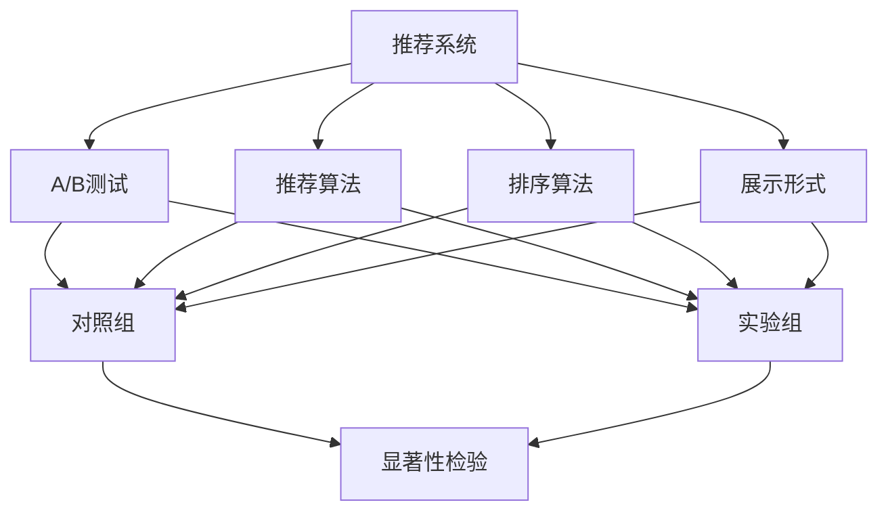

                 

# 推荐系统的A/B测试方法论

## 1. 背景介绍

### 1.1 问题由来
推荐系统(Assisted Recommendation System)是一种智能信息推荐系统，通过分析用户行为数据，为用户推荐符合其兴趣和需求的物品或内容。推荐系统广泛应用于电商、社交网络、视频平台等诸多领域，为提升用户体验、增加转化率提供了强有力的支撑。

然而，推荐系统的优化与迭代过程是一个动态的反馈过程，如何在每一步决策中都能保证推荐的精准性和有效性，始终是一个重要的研究课题。A/B测试(A/B Testing)作为一种常用的实验方法，通过对比不同策略的表现，在无标注数据或少样本数据的情况下，提供了客观的决策依据。本文将系统介绍推荐系统的A/B测试方法论，涵盖核心概念、算法原理、具体操作步骤等方面，并结合实际案例进行深入分析。

### 1.2 问题核心关键点
A/B测试的核心在于通过实际的用户行为数据，对比不同策略的效果，从而决定哪一种策略更能满足用户需求。在推荐系统领域，常见的策略有：个性化推荐、召回策略、排序算法等。A/B测试可以涵盖这些策略的各个方面，包括推荐算法本身、推荐结果的展示形式、推荐算法与外部数据的结合方式等。

通过A/B测试，可以验证以下关键点：

- 个性化推荐策略的效果：如基于内容的推荐、基于协同过滤的推荐、基于深度学习的推荐等，哪种策略更能提升用户体验和转化率。
- 召回策略的效果：如基于频率、基于时间、基于相似性等召回策略，哪种策略在限定时间和资源的前提下，能覆盖更多的潜在用户。
- 排序算法的效果：如基于点击率排序、基于相关度排序、基于时间排序等，哪种排序方式能生成更符合用户需求的推荐列表。
- 推荐系统的效果：如推荐系统的准确率、召回率、覆盖率等指标，哪种策略更能提升系统整体的性能。

## 2. 核心概念与联系

### 2.1 核心概念概述

为更好地理解推荐系统A/B测试方法论，本节将介绍几个密切相关的核心概念：

- 推荐系统(Recommendation System)：一种基于用户行为数据进行物品推荐的信息系统，涵盖推荐算法、召回策略、展示形式等多个方面。

- A/B测试(A/B Testing)：通过对比两个或多个版本的效果，决定哪个版本更优的实验方法。在推荐系统领域，可以用于对比不同的推荐算法、排序策略、展示形式等。

- 对照组(Control Group)与实验组(Experimental Group)：A/B测试的两个版本，其中对照组保持不变，实验组则进行某一策略的改变。通过对比两组数据的效果，评估策略改变对推荐系统的影响。

- 随机化(随机化)与分组(分组)：A/B测试的关键，通过随机分组确保两组数据的一致性，从而避免外界因素的干扰。

- 样本大小与显著性检验(显著性检验)：决定样本大小和是否具有统计意义的判断标准，通过显著性检验评估实验结果的可靠性。

这些核心概念之间的逻辑关系可以通过以下Mermaid流程图来展示：



这个流程图展示了他推荐系统的核心概念及其之间的关系：

1. 推荐系统通过多种推荐算法、排序策略和展示形式，为用户推荐物品。
2. A/B测试用于对比不同策略的效果，确保推荐的精准性。
3. 对照组与实验组分别代表不同的策略，通过显著性检验评估其优劣。
4. 随机化与分组确保实验的公平性，避免外界干扰。
5. 样本大小与显著性检验决定实验的可靠性。

这些概念共同构成了推荐系统A/B测试的理论基础，为其设计实施提供了指导。

## 3. 核心算法原理 & 具体操作步骤
### 3.1 算法原理概述

A/B测试的根本目的是评估不同策略的效果，通过对比两组数据的表现，选择效果最优的策略。推荐系统的A/B测试一般包括以下关键步骤：

1. 定义策略：选择不同的推荐算法、排序策略、展示形式等，设计具体的实验方案。
2. 分组实验：将用户随机分成对照组和实验组，确保两组数据的一致性。
3. 实验对比：在实验组中实施新策略，在对照组中保持原策略，收集两组用户行为数据。
4. 效果评估：通过统计指标（如点击率、转化率、停留时间等）评估两组数据的表现。
5. 决策迭代：根据效果评估结果，决定是否实施新策略，并不断迭代优化。

### 3.2 算法步骤详解

#### 3.2.1 定义策略
策略的定义是A/B测试的第一步。常见的策略包括：

1. 推荐算法：如基于内容的推荐、基于协同过滤的推荐、基于深度学习的推荐等。

2. 排序算法：如基于点击率排序、基于相关度排序、基于时间排序等。

3. 展示形式：如卡片式、列表式、混合展示等。

选择策略时，需要考虑其适用范围、技术难度、实验成本等因素。

#### 3.2.2 分组实验
分组实验是确保实验公平性的关键步骤。通常采用随机分组的方法，将用户随机分为对照组和实验组，确保两组用户在基础属性（如年龄、性别、地域等）、行为特征（如浏览历史、购买历史等）等方面的一致性。

具体步骤如下：

1. 确定分组比例：一般选择1:1或2:1的分组比例，确保实验结果的可靠性。

2. 随机生成ID：为每个用户生成一个随机ID，用于标识其分组。

3. 分配策略：根据随机ID，将用户分配到对照组或实验组。

#### 3.2.3 实验对比
实验对比是A/B测试的核心步骤。在实验组中实施新策略，在对照组中保持原策略，收集两组用户行为数据。

具体步骤如下：

1. 数据收集：在对照组和实验组中，分别记录用户的推荐结果、点击行为、转化行为等数据。

2. 数据清洗：去除无效数据，处理异常值，确保数据的准确性和一致性。

3. 数据存储：将数据存储到数据库中，便于后续分析。

#### 3.2.4 效果评估
效果评估是决定是否实施新策略的关键步骤。通过统计指标评估两组数据的表现，决定哪个策略更优。

具体步骤如下：

1. 确定评估指标：如点击率、转化率、停留时间等。

2. 计算统计量：如均值、方差、标准差等。

3. 显著性检验：通过显著性检验（如t检验、卡方检验等）评估两组数据的差异性，决定是否具有统计意义。

#### 3.2.5 决策迭代
决策迭代是A/B测试的最终步骤。根据效果评估结果，决定是否实施新策略，并不断迭代优化。

具体步骤如下：

1. 效果评估：评估两组数据的效果，决定哪个策略更优。

2. 实施策略：在实验组中实施效果更好的策略，在对照组中保持原策略。

3. 重复实验：重复进行A/B测试，不断优化推荐系统。

### 3.3 算法优缺点

推荐系统的A/B测试方法论具有以下优点：

1. 基于实际数据：A/B测试的实验结果基于实际用户行为数据，更能反映真实情况。

2. 客观性高：通过对比两组数据的表现，可以客观评估策略的效果，避免主观偏差。

3. 灵活性强：可以应用于多种推荐算法、排序策略、展示形式等，覆盖推荐系统的各个方面。

4. 适用性强：适用于无标注数据或少样本数据的情况，可以通过实验结果指导推荐系统的优化。

同时，该方法也存在一定的局限性：

1. 实验成本高：A/B测试需要收集大量用户行为数据，存在数据收集和存储成本。

2. 样本大小要求高：样本大小必须足够大，才能保证实验结果的可靠性。

3. 实验周期长：从实验设计到结果评估，实验周期较长，影响推荐系统的迭代速度。

4. 外部因素干扰：实验过程中可能存在外部因素的干扰，影响实验结果的可靠性。

尽管存在这些局限性，但A/B测试仍是推荐系统优化与迭代的重要手段。未来相关研究的重点在于如何降低实验成本、提高样本效率、缩短实验周期，同时兼顾实验的公平性和可靠性。

### 3.4 算法应用领域

推荐系统的A/B测试方法论，在以下领域得到了广泛应用：

1. 电商推荐：通过A/B测试不同推荐算法和展示形式，提升商品推荐的效果，增加用户购买转化率。

2. 视频推荐：通过A/B测试不同的排序算法和推荐策略，提升视频播放量，提高用户留存率。

3. 音乐推荐：通过A/B测试不同的推荐算法和展示形式，提升音乐推荐的多样性和精准性。

4. 新闻推荐：通过A/B测试不同的排序算法和推荐策略，提升新闻文章的阅读量，提高用户粘性。

5. 社交推荐：通过A/B测试不同的推荐算法和展示形式，提升社交网络的关系匹配度，增强用户互动。

除了上述这些经典领域外，A/B测试方法论还被创新性地应用到更多场景中，如广告投放、内容推荐、金融风控等，为推荐系统的发展提供了新的思路。随着A/B测试方法的不断演进，相信推荐系统将在更广泛的领域实现智能化优化，为用户带来更好的体验。

## 4. 数学模型和公式 & 详细讲解 & 举例说明

### 4.1 数学模型构建

A/B测试的效果评估通常采用统计学中的假设检验方法。假设检验的基本思想是：提出一个原假设（H0），假设两组数据无差异；提出一个备择假设（H1），假设两组数据有差异。通过统计量（如t值）和显著性水平（如0.05），决定是否拒绝原假设，接受备择假设。

具体而言，假设推荐系统有K组数据，每组数据N个样本，分别为X1、X2、...、Xk，每组数据的均值分别为$\mu_1$、$\mu_2$、...、$\mu_k$，方差分别为$\sigma_1^2$、$\sigma_2^2$、...、$\sigma_k^2$。根据统计学原理，t值的计算公式为：

$$ t = \frac{\bar{x}_1 - \bar{x}_2}{\sqrt{\frac{S_1^2}{n_1} + \frac{S_2^2}{n_2}} $$

其中，$\bar{x}_1$、$\bar{x}_2$分别为两组数据的均值，$S_1^2$、$S_2^2$分别为两组数据的方差，$n_1$、$n_2$分别为两组数据的样本数。

### 4.2 公式推导过程

假设推荐系统有对照组和实验组，分别收集K1、K2组数据，每组数据N1、N2个样本，方差分别为$\sigma_1^2$、$\sigma_2^2$。根据上述公式，计算t值：

$$ t = \frac{\bar{x}_1 - \bar{x}_2}{\sqrt{\frac{S_1^2}{n_1} + \frac{S_2^2}{n_2}} $$

其中，$\bar{x}_1$、$\bar{x}_2$分别为两组数据的均值，$S_1^2$、$S_2^2$分别为两组数据的方差，$n_1$、$n_2$分别为两组数据的样本数。

根据t值的计算结果，进行显著性检验。如果t值大于临界值（如t(0.05)），则拒绝原假设，接受备择假设，认为两组数据有显著差异。反之，则无法拒绝原假设，认为两组数据无显著差异。

### 4.3 案例分析与讲解

以下是一个具体的推荐系统A/B测试案例分析：

假设推荐系统收集了K1=100个用户的数据，每组数据N1=50个样本，计算其均值$\mu_1$和方差$\sigma_1^2$。同样，收集K2=100个用户的数据，每组数据N2=50个样本，计算其均值$\mu_2$和方差$\sigma_2^2$。根据公式计算t值：

$$ t = \frac{\bar{x}_1 - \bar{x}_2}{\sqrt{\frac{S_1^2}{n_1} + \frac{S_2^2}{n_2}} $$

其中，$\bar{x}_1$、$\bar{x}_2$分别为两组数据的均值，$S_1^2$、$S_2^2$分别为两组数据的方差，$n_1$、$n_2$分别为两组数据的样本数。

根据显著性水平为0.05的t分布表，查找t(0.05, 50)的临界值。假设临界值为2。如果t值大于2，则拒绝原假设，认为两组数据有显著差异；反之，则无法拒绝原假设，认为两组数据无显著差异。

## 5. 项目实践：代码实例和详细解释说明
### 5.1 开发环境搭建

在进行A/B测试实践前，我们需要准备好开发环境。以下是使用Python进行Pandas开发的环境配置流程：

1. 安装Anaconda：从官网下载并安装Anaconda，用于创建独立的Python环境。

2. 创建并激活虚拟环境：
```bash
conda create -n a_b_test_env python=3.8 
conda activate a_b_test_env
```

3. 安装Pandas：
```bash
pip install pandas
```

4. 安装各类工具包：
```bash
pip install numpy matplotlib scipy jupyter notebook ipython
```

完成上述步骤后，即可在`a_b_test_env`环境中开始A/B测试实践。

### 5.2 源代码详细实现

下面我们以推荐系统的A/B测试为例，给出使用Pandas库进行A/B测试的Python代码实现。

首先，定义推荐系统的基础数据：

```python
import pandas as pd

# 基础数据集
data = pd.read_csv('data.csv')
data.head()
```

然后，定义A/B测试的基本流程：

```python
from scipy import stats

# 定义实验组和对照组的数据
experimental_group = data[data['group'] == 'experimental']
control_group = data[data['group'] == 'control']

# 计算两组数据的均值和方差
experimental_mean = experimental_group['rating'].mean()
experimental_var = experimental_group['rating'].var()
control_mean = control_group['rating'].mean()
control_var = control_group['rating'].var()

# 计算t值
t = (experimental_mean - control_mean) / np.sqrt(experimental_var / experimental_group.shape[0] + control_var / control_group.shape[0])

# 进行显著性检验
p_value = stats.ttest_ind(experimental_group['rating'], control_group['rating']).pvalue
```

最后，输出显著性检验结果：

```python
print(f"t值: {t}")
print(f"p值: {p_value}")
```

以上就是使用Pandas进行推荐系统A/B测试的完整代码实现。可以看到，Pandas库提供了强大的数据处理和统计分析功能，使得A/B测试的实施变得简洁高效。

### 5.3 代码解读与分析

让我们再详细解读一下关键代码的实现细节：

**数据集定义**：
- 使用`pd.read_csv`函数读取基础数据集，包含用户推荐评分、分组信息等字段。

**实验组和对照组**：
- 根据分组信息，将数据集分成实验组和对照组。

**均值和方差计算**：
- 使用`mean`和`var`函数计算两组数据的均值和方差。

**t值计算**：
- 根据公式计算t值，`np.sqrt`函数用于计算平方根，`np.array`函数将数组转化为numpy数组。

**显著性检验**：
- 使用`ttest_ind`函数进行显著性检验，返回p值。

**结果输出**：
- 输出t值和p值，判断两组数据是否有显著差异。

可以看到，Pandas库提供了丰富的数据处理和统计分析功能，使得A/B测试的实施变得简洁高效。开发者可以将更多精力放在实验设计和结果解读上，而不必过多关注底层实现细节。

当然，工业级的系统实现还需考虑更多因素，如样本大小的设定、显著性水平的设定、实验的连续性等。但核心的A/B测试范式基本与此类似。

## 6. 实际应用场景
### 6.1 电商推荐

基于A/B测试的电商推荐系统，通过对比不同推荐算法和展示形式的效果，能够提升推荐商品的效果，增加用户购买转化率。具体应用场景包括：

1. 个性化推荐算法对比：通过对比基于内容的推荐、基于协同过滤的推荐和基于深度学习的推荐等算法，找出效果最好的推荐算法。

2. 推荐结果展示形式对比：通过对比卡片式展示、列表式展示和混合展示等形式，找出最适合用户的展示形式。

3. 推荐排序策略对比：通过对比基于点击率排序、基于相关度排序和基于时间排序等策略，找出最优的排序方式。

### 6.2 视频推荐

基于A/B测试的视频推荐系统，通过对比不同的推荐算法和展示形式，提升视频播放量，提高用户留存率。具体应用场景包括：

1. 视频推荐算法对比：通过对比不同的推荐算法，找出最适合用户的推荐算法。

2. 视频推荐排序策略对比：通过对比不同的排序策略，找出最优的排序方式。

3. 视频推荐展示形式对比：通过对比不同的展示形式，找出最适合用户的展示形式。

### 6.3 音乐推荐

基于A/B测试的音乐推荐系统，通过对比不同的推荐算法和展示形式，提升音乐推荐的多样性和精准性。具体应用场景包括：

1. 音乐推荐算法对比：通过对比不同的推荐算法，找出最适合用户的推荐算法。

2. 音乐推荐展示形式对比：通过对比不同的展示形式，找出最适合用户的展示形式。

3. 音乐推荐排序策略对比：通过对比不同的排序策略，找出最优的排序方式。

### 6.4 未来应用展望

随着推荐系统的不断优化，A/B测试方法论将在更多领域得到应用，为推荐系统的发展提供新的思路。

在智慧医疗领域，A/B测试可用于对比不同的个性化推荐算法和展示形式，提升医疗推荐的效果，辅助医生诊疗，加速新药开发进程。

在智能教育领域，A/B测试可用于对比不同的个性化推荐算法和展示形式，因材施教，促进教育公平，提高教学质量。

在智慧城市治理中，A/B测试可用于对比不同的推荐算法和展示形式，提高城市管理的自动化和智能化水平，构建更安全、高效的未来城市。

此外，在企业生产、社会治理、文娱传媒等众多领域，A/B测试方法论也将不断涌现，为推荐系统的发展提供新的方向。相信随着A/B测试方法的不断演进，推荐系统将在更广泛的领域实现智能化优化，为用户带来更好的体验。

## 7. 工具和资源推荐
### 7.1 学习资源推荐

为了帮助开发者系统掌握推荐系统的A/B测试方法论，这里推荐一些优质的学习资源：

1. 《推荐系统实战》书籍：详细介绍了推荐系统的原理和实践方法，包括A/B测试在内的多种实验方法。

2. 《A/B Testing: The Most Powerful Way to Turn Clicks into Customers》书籍：介绍A/B测试的原理和实际应用案例，适合理解A/B测试的核心思想。

3. 《统计学习方法》书籍：介绍了统计学中的假设检验方法，为A/B测试提供了理论基础。

4. Kaggle：Kaggle平台提供了丰富的推荐系统竞赛数据集，可以通过实际数据集进行A/B测试的实践和验证。

5. Coursera推荐系统课程：斯坦福大学的推荐系统课程，详细介绍了推荐系统的原理和实践方法，包括A/B测试在内的多种实验方法。

通过对这些资源的学习实践，相信你一定能够快速掌握推荐系统的A/B测试方法论，并用于解决实际的推荐问题。

### 7.2 开发工具推荐

高效的开发离不开优秀的工具支持。以下是几款用于推荐系统A/B测试开发的常用工具：

1. Pandas：Python中强大的数据处理和统计分析库，提供了丰富的数据处理和统计分析功能，使得A/B测试的实施变得简洁高效。

2. R语言：R语言是数据分析和统计分析的首选语言，提供了多种统计学方法和数据可视化工具，适合进行复杂的A/B测试分析。

3. Jupyter Notebook：Jupyter Notebook提供了交互式的代码执行环境，支持Python、R等多种语言，适合进行数据分析和可视化。

4. Tableau：Tableau是一款强大的数据可视化工具，支持多种数据源和统计分析方法，适合进行数据可视化和结果展示。

5. Google Analytics：Google Analytics是一款免费的数据分析工具，支持A/B测试和多变量测试，适合进行线上广告和推荐系统的A/B测试。

合理利用这些工具，可以显著提升推荐系统A/B测试的开发效率，加快创新迭代的步伐。

### 7.3 相关论文推荐

推荐系统的A/B测试方法论源于学界的持续研究。以下是几篇奠基性的相关论文，推荐阅读：

1. "Online Bandit Algorithms for Ad Serving"：介绍了在线广告推荐系统的A/B测试方法，详细介绍了在线竞价机制和推荐算法。

2. "A/B Testing in Action"：介绍了A/B测试的原理和实际应用案例，适合理解A/B测试的核心思想。

3. "A/B Testing with Confidence"：介绍了A/B测试的显著性检验方法，为推荐系统的A/B测试提供了理论基础。

4. "A/B Testing and Statistical Learning: The Choice is Yours"：介绍了A/B测试的显著性检验方法和多种统计学方法，适合进行复杂的A/B测试分析。

5. "A/B Testing with Unbalanced Data: A Benchmarking Approach"：介绍了A/B测试在数据不均衡情况下的方法，适合理解推荐系统的A/B测试中的数据问题。

这些论文代表了大语言模型微调技术的发展脉络。通过学习这些前沿成果，可以帮助研究者把握学科前进方向，激发更多的创新灵感。

## 8. 总结：未来发展趋势与挑战

### 8.1 总结

本文对推荐系统的A/B测试方法论进行了全面系统的介绍。首先阐述了推荐系统的背景和意义，明确了A/B测试在推荐系统优化与迭代中的重要地位。其次，从原理到实践，详细讲解了A/B测试的数学原理和关键步骤，给出了推荐系统A/B测试的完整代码实现。同时，本文还广泛探讨了A/B测试方法论在电商、视频、音乐等多个领域的应用前景，展示了A/B测试方法论的广阔前景。最后，本文精选了A/B测试技术的各类学习资源，力求为读者提供全方位的技术指引。

通过本文的系统梳理，可以看到，推荐系统的A/B测试方法论正在成为推荐系统优化与迭代的重要手段，极大地拓展了推荐系统的应用边界，催生了更多的落地场景。受益于大规模数据和强大的统计学工具，A/B测试方法论在推荐系统领域取得了显著的成果，为推荐系统的持续优化提供了有力的支撑。未来，伴随推荐系统的不断演进，A/B测试方法论也将不断演进，为推荐系统的智能化优化提供更广阔的空间。

### 8.2 未来发展趋势

展望未来，推荐系统的A/B测试方法论将呈现以下几个发展趋势：

1. 数据驱动与算法优化结合：A/B测试将更多依赖数据驱动的决策，通过大规模数据集和先进的统计学方法，优化推荐算法和展示形式。

2. 自动化与智能化结合：A/B测试将更多依赖自动化工具和算法，通过机器学习等技术，自动化进行数据处理和结果分析。

3. 多维度与跨领域结合：A/B测试将更多关注多维度的数据和跨领域的结合，通过多种维度的数据，优化推荐效果。

4. 实时性与动态性结合：A/B测试将更多依赖实时数据和动态调整，通过实时数据反馈，动态优化推荐策略。

5. 用户友好性与可解释性结合：A/B测试将更多关注用户体验和算法可解释性，通过用户反馈和解释性工具，提升推荐系统的用户友好性和可解释性。

以上趋势凸显了推荐系统A/B测试方法论的广阔前景。这些方向的探索发展，必将进一步提升推荐系统的性能和应用范围，为用户带来更好的体验。

### 8.3 面临的挑战

尽管推荐系统的A/B测试方法论已经取得了瞩目成就，但在迈向更加智能化、普适化应用的过程中，它仍面临着诸多挑战：

1. 实验成本高：A/B测试需要收集大量用户行为数据，存在数据收集和存储成本。

2. 样本大小要求高：样本大小必须足够大，才能保证实验结果的可靠性。

3. 实验周期长：从实验设计到结果评估，实验周期较长，影响推荐系统的迭代速度。

4. 外部因素干扰：实验过程中可能存在外部因素的干扰，影响实验结果的可靠性。

尽管存在这些挑战，但A/B测试仍是推荐系统优化与迭代的重要手段。未来相关研究的重点在于如何降低实验成本、提高样本效率、缩短实验周期，同时兼顾实验的公平性和可靠性。

### 8.4 研究展望

面对推荐系统A/B测试所面临的种种挑战，未来的研究需要在以下几个方面寻求新的突破：

1. 探索无标注数据和半监督数据的A/B测试方法：摆脱对大规模标注数据的依赖，利用自监督学习、主动学习等无监督和半监督范式，最大限度利用非结构化数据，实现更加灵活高效的A/B测试。

2. 研究多目标优化与动态调整的A/B测试方法：通过多目标优化和动态调整，兼顾准确率、召回率、覆盖率等指标，优化推荐系统的整体性能。

3. 引入因果推断和对比学习范式：通过引入因果推断和对比学习思想，增强A/B测试模型建立稳定因果关系的能力，学习更加普适、鲁棒的语言表征，从而提升模型泛化性和抗干扰能力。

4. 结合外部知识库和规则库：将符号化的先验知识，如知识图谱、逻辑规则等，与神经网络模型进行巧妙融合，引导A/B测试过程学习更准确、合理的语言模型。

5. 引入元学习与自适应算法：通过元学习和自适应算法，提高A/B测试模型的自适应能力和泛化能力，优化推荐系统的长期表现。

这些研究方向的探索，必将引领推荐系统A/B测试技术迈向更高的台阶，为推荐系统的智能化优化提供新的思路。面向未来，A/B测试方法论还需要与其他人工智能技术进行更深入的融合，如知识表示、因果推理、强化学习等，多路径协同发力，共同推动推荐系统的进步。只有勇于创新、敢于突破，才能不断拓展推荐系统的边界，让智能技术更好地造福人类社会。

## 9. 附录：常见问题与解答

**Q1：推荐系统A/B测试的实验设计有哪些关键点？**

A: 推荐系统A/B测试的实验设计关键点包括：

1. 确定实验目标：明确实验需要优化的推荐算法、展示形式等。

2. 确定分组比例：选择1:1或2:1的分组比例，确保实验结果的可靠性。

3. 随机生成ID：为每个用户生成一个随机ID，用于标识其分组。

4. 定义评估指标：如点击率、转化率、停留时间等。

5. 进行显著性检验：通过显著性检验（如t检验、卡方检验等）评估实验结果的可靠性。

6. 决策迭代：根据实验结果，决定是否实施新策略，并不断优化。

**Q2：推荐系统A/B测试的实验结果如何评估？**

A: 推荐系统A/B测试的实验结果评估主要通过统计指标来衡量，如点击率、转化率、停留时间等。具体步骤如下：

1. 计算两组数据的均值和方差。

2. 计算t值，进行显著性检验，判断两组数据是否有显著差异。

3. 根据显著性检验结果，决定是否实施新策略，并不断优化。

**Q3：推荐系统A/B测试的样本大小如何确定？**

A: 推荐系统A/B测试的样本大小通常需要满足以下条件：

1. 样本大小必须足够大，以保证实验结果的可靠性。

2. 样本大小通常需要大于等于30，以满足显著性检验的统计学要求。

3. 样本大小应根据推荐系统的复杂度和实验目标进行调整，选择适当的大小。

**Q4：推荐系统A/B测试中的显著性检验如何进行？**

A: 推荐系统A/B测试中的显著性检验通常采用t检验或卡方检验等方法，具体步骤如下：

1. 计算两组数据的均值和方差。

2. 计算t值，进行显著性检验。

3. 根据显著性水平（如0.05），查找临界值。

4. 如果t值大于临界值，则拒绝原假设，接受备择假设，认为两组数据有显著差异。

**Q5：推荐系统A/B测试的实验周期如何确定？**

A: 推荐系统A/B测试的实验周期需要考虑以下因素：

1. 实验周期通常需要满足一定的时间长度，以保证实验结果的可靠性。

2. 实验周期通常需要大于等于2周，以满足显著性检验的统计学要求。

3. 实验周期应根据推荐系统的复杂度和实验目标进行调整，选择适当的时间长度。

**Q6：推荐系统A/B测试中如何避免外部因素的干扰？**

A: 推荐系统A/B测试中，外部因素的干扰是不可避免的。为了避免外部因素的干扰，可以采取以下措施：

1. 随机化分组：通过随机分组，确保两组数据的一致性。

2. 控制变量：控制实验中的其他变量，避免其对实验结果的影响。

3. 数据清洗：去除无效数据，处理异常值，确保数据的准确性和一致性。

**Q7：推荐系统A/B测试中如何确保实验的公平性？**

A: 推荐系统A/B测试中，确保实验的公平性是关键。以下是一些确保实验公平性的措施：

1. 随机化分组：通过随机分组，确保两组数据的一致性。

2. 控制变量：控制实验中的其他变量，避免其对实验结果的影响。

3. 数据清洗：去除无效数据，处理异常值，确保数据的准确性和一致性。

通过这些措施，可以最大限度地避免外部因素的干扰，确保实验的公平性和可靠性。

---

作者：禅与计算机程序设计艺术 / Zen and the Art of Computer Programming

