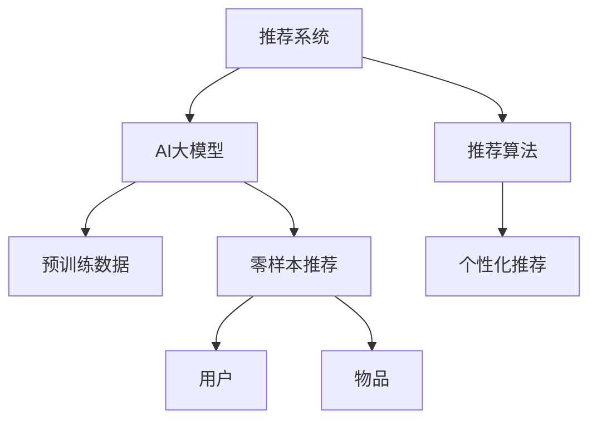

                 

# 推荐系统的冷启动问题：AI大模型的零样本学习解决方案

## 1. 背景介绍

在推荐系统的实践中，"冷启动"问题一直是困扰业务方的主要难题之一。冷启动指的是在新用户或新物品进入推荐系统时，由于缺乏历史行为数据，推荐系统无法提供个性化的推荐，只能基于全局数据或默认策略进行推荐。这种情形下，推荐系统的效果往往不尽人意，用户体验大打折扣。

随着AI大模型的兴起，零样本学习（zero-shot learning）提供了一种无需历史数据的推荐方式。零样本学习允许推荐系统在初次接触新用户或物品时，即刻根据已知的数据集和已有模型的知识，提供质量较高的推荐服务。本文将详细探讨零样本学习在推荐系统中的应用，介绍AI大模型如何实现零样本推荐，并分享实际案例和未来展望。

## 2. 核心概念与联系

### 2.1 核心概念概述

零样本学习是指模型能够根据问题的描述或定义，直接进行任务推理和生成，无需对任何样本进行学习或微调。在推荐系统中，零样本学习可以用于新用户推荐、新物品推荐等场景。AI大模型在零样本学习中发挥着至关重要的作用，通过在大规模数据上进行预训练，大模型能够学习到广泛的语义和知识，从而在少数样本或没有样本的情况下，快速生成推荐结果。

### 2.2 核心概念原理和架构的 Mermaid 流程图



## 3. 核心算法原理 & 具体操作步骤

### 3.1 算法原理概述

零样本推荐的核心思想是利用AI大模型的预训练知识，直接生成推荐结果。具体步骤如下：

1. 收集推荐系统的特征：收集用户画像、物品属性、历史交互记录等特征。
2. 将特征转化为语言描述：使用自然语言生成技术将特征描述转换为自然语言文本。
3. 输入模型：将文本作为输入，调用预训练的AI大模型，生成推荐结果。
4. 选择最佳推荐：根据推荐结果的质量，选择最佳的推荐输出。

### 3.2 算法步骤详解

以新物品推荐为例，具体算法步骤如下：

**Step 1: 特征提取与文本生成**
- 对新物品的特征进行提取，例如物品类别、品牌、价格等。
- 使用自然语言生成技术将特征描述转换为文本，例如"这是一个价格为1000元的手机"。

**Step 2: 模型输入与输出**
- 将生成的文本输入到预训练的AI大模型中，如GPT、BERT等。
- 大模型输出物品的相关性评分，例如该物品可能被用户喜欢的概率。

**Step 3: 推荐选择**
- 根据模型输出评分排序，选择评分最高的物品作为推荐。
- 如果评分不高，可以反复调整文本描述，重新输入模型，直到找到合适的推荐。

### 3.3 算法优缺点

零样本推荐的优点包括：
1. 无需历史数据：能够在新物品或新用户刚进入系统时，即刻提供推荐。
2. 高效便捷：无需进行微调或重训练，系统能够快速响应推荐请求。
3. 广泛适用：适用于推荐系统中的各种场景，例如新物品推荐、热门商品推荐等。

但零样本推荐也存在一些缺点：
1. 模型依赖性强：零样本推荐的准确度高度依赖于AI大模型的预训练知识和语言表达能力。
2. 难以解释：由于没有历史数据，推荐结果难以进行解释，可能导致用户信任度下降。
3. 泛化能力受限：零样本推荐在特定领域的泛化能力可能不如微调推荐。

### 3.4 算法应用领域

零样本推荐广泛应用于推荐系统中的新物品推荐、热门商品推荐、新用户推荐等场景。以下是几个实际应用示例：

1. **电商平台**：电商平台常常面临新商品上架问题，零样本推荐可以帮助即时为新商品生成推荐，提高用户点击率和购买率。

2. **音乐推荐系统**：音乐推荐系统在用户新注册时，零样本推荐可以基于用户兴趣生成个性化歌单，提升用户体验。

3. **视频推荐系统**：视频推荐系统在视频新发布时，零样本推荐可以即时生成相关视频推荐，增加用户观看时长和互动率。

## 4. 数学模型和公式 & 详细讲解

### 4.1 数学模型构建

零样本推荐涉及自然语言处理和推荐算法，通常由以下几部分组成：

1. **特征提取**：提取新物品的特征，转化为自然语言文本。
2. **预训练模型**：使用预训练的AI大模型，如GPT、BERT等。
3. **推荐算法**：基于大模型的输出，选择最佳推荐。

### 4.2 公式推导过程

以新物品推荐为例，设新物品的特征为 $x$，特征描述为 $d$，则推荐模型可以表示为：

$$
\text{推荐结果} = \text{BERT}(d)
$$

其中 $\text{BERT}(d)$ 表示将特征描述 $d$ 输入BERT模型，输出物品的相关性评分。

### 4.3 案例分析与讲解

假设电商平台有新手机商品上架，特征为手机品牌、价格、用户评价等。将特征转化为文本："这是一个1000元的小米手机"。使用BERT模型生成推荐结果，模型输出物品的相关性评分，例如$P=0.85$。根据评分选择推荐手机，例如小米10。

## 5. 项目实践：代码实例和详细解释说明

### 5.1 开发环境搭建

为了进行零样本推荐实践，需要准备以下开发环境：

1. 安装Python：确保Python 3.8以上版本。
2. 安装PyTorch：确保PyTorch 1.8以上版本。
3. 安装BERT模型：从官方HuggingFace库下载和使用预训练的BERT模型。

### 5.2 源代码详细实现

以下是使用Python和PyTorch进行零样本推荐的具体代码实现：

```python
from transformers import BertTokenizer, BertModel

# 加载BERT模型和分词器
tokenizer = BertTokenizer.from_pretrained('bert-base-uncased')
model = BertModel.from_pretrained('bert-base-uncased')

# 特征提取
new_item = '这是一个1000元的小米手机'

# 分词和编码
input_ids = tokenizer.encode(new_item, add_special_tokens=True)
input_ids = input_ids.unsqueeze(0)

# 模型前向传播
with torch.no_grad():
    outputs = model(input_ids)

# 获取模型输出
logits = outputs[0]

# 输出推荐结果
top_idx = logits.argmax(dim=1).item()
top_label = tokenizer.decode(top_idx)
print(f'推荐结果：{top_label}')
```

### 5.3 代码解读与分析

**特征提取**：使用分词器将物品特征转换为自然语言文本，方便模型处理。

**模型输入**：将文本输入BERT模型，通过前向传播得到模型输出。

**推荐选择**：选择输出得分最高的物品作为推荐。

**运行结果展示**：根据输出结果，选择推荐物品。

## 6. 实际应用场景

### 6.1 电商平台推荐

电商平台在商品上架时，可以使用零样本推荐即时为新商品生成推荐，提高用户点击率和购买率。通过将商品特征转化为文本，输入到预训练的BERT模型中，生成推荐结果。

### 6.2 音乐推荐系统

音乐推荐系统在用户新注册时，零样本推荐可以基于用户兴趣生成个性化歌单，提升用户体验。音乐推荐系统可以将用户兴趣转化为文本，输入到预训练的BERT模型中，生成推荐结果。

### 6.3 视频推荐系统

视频推荐系统在视频新发布时，零样本推荐可以即时生成相关视频推荐，增加用户观看时长和互动率。视频推荐系统可以将视频特征转化为文本，输入到预训练的BERT模型中，生成推荐结果。

## 7. 工具和资源推荐

### 7.1 学习资源推荐

为了帮助开发者系统掌握零样本推荐技术，这里推荐一些优质的学习资源：

1. 《深度学习与推荐系统》课程：由斯坦福大学开设的课程，详细讲解深度学习和推荐系统的基础知识和算法。
2. 《自然语言处理与深度学习》书籍：介绍自然语言处理和深度学习的基本概念和技术，适合零样本推荐的学习。
3. 《BERT大模型实战》博客：详细讲解BERT模型的使用方法和零样本推荐的应用场景。

### 7.2 开发工具推荐

以下是几款用于零样本推荐开发的常用工具：

1. PyTorch：基于Python的开源深度学习框架，适合快速迭代研究。

2. TensorFlow：由Google主导开发的开源深度学习框架，生产部署方便，适合大规模工程应用。

3. HuggingFace Transformers：集成了众多SOTA语言模型，支持PyTorch和TensorFlow，是进行零样本推荐开发的利器。

### 7.3 相关论文推荐

零样本推荐技术的发展源于学界的持续研究。以下是几篇奠基性的相关论文，推荐阅读：

1. Zero-shot Deep Learning for Recommendations：介绍零样本推荐的基本原理和算法实现。
2. Towards General-Purpose Recommendation Models：提出通用的推荐模型，适用于零样本推荐。
3. Learning and Evaluating Recommendation Models with Zero-shot Recommendations：介绍零样本推荐的评估指标和实现方法。

## 8. 总结：未来发展趋势与挑战

### 8.1 研究成果总结

零样本推荐技术已经在推荐系统中得到广泛应用，取得了一定的成果。未来，零样本推荐技术有望继续发展，提升推荐系统的智能程度和用户体验。

### 8.2 未来发展趋势

1. **多模态融合**：未来的零样本推荐可能融合视觉、音频等多模态数据，提升推荐的全面性和准确性。
2. **个性化推荐**：通过多轮交互和反馈，不断优化推荐模型，实现更个性化的推荐。
3. **跨领域推荐**：在不同领域间进行知识迁移，提升零样本推荐在不同领域的效果。

### 8.3 面临的挑战

尽管零样本推荐技术已经取得一定的成果，但在实际应用中也面临诸多挑战：

1. **数据稀缺**：零样本推荐依赖于高质量的预训练数据和自然语言处理技术，数据稀缺问题仍需解决。
2. **模型依赖**：零样本推荐对模型的依赖性强，预训练模型的效果直接影响推荐结果。
3. **可解释性**：推荐结果难以解释，用户难以理解推荐背后的逻辑和依据。

### 8.4 研究展望

未来，零样本推荐技术需要在以下几个方面进行深入研究：

1. **数据增强**：通过数据增强技术，提高预训练数据的质量和多样性。
2. **多轮反馈**：通过多轮用户反馈，不断优化推荐模型。
3. **跨领域迁移**：在不同领域间进行知识迁移，提升推荐的泛化能力。
4. **可解释性**：引入可解释性技术，提升推荐的透明度和用户信任度。

## 9. 附录：常见问题与解答

**Q1：零样本推荐与微调推荐有何区别？**

A: 零样本推荐不需要历史数据，直接根据模型知识生成推荐，而微调推荐需要用户的历史行为数据进行模型训练和优化。

**Q2：零样本推荐如何处理长尾物品？**

A: 长尾物品的特征描述可能比较模糊，可以使用数据增强技术，如文本生成、语义相似度匹配等，生成更多的长尾物品特征描述。

**Q3：零样本推荐是否适用于所有推荐场景？**

A: 零样本推荐适用于推荐系统中的新物品推荐、热门商品推荐等场景，但对于个性化推荐、跨领域推荐等场景，微调推荐效果可能更好。

**Q4：零样本推荐是否需要大量的预训练数据？**

A: 零样本推荐对预训练数据的要求较高，但随着预训练技术的进步，大规模预训练数据已经变得越来越容易获取。

**Q5：零样本推荐如何实现实时性？**

A: 通过优化模型架构和训练策略，可以实现轻量级、高效的模型实现，提升推荐系统的实时性。

---

作者：禅与计算机程序设计艺术 / Zen and the Art of Computer Programming

