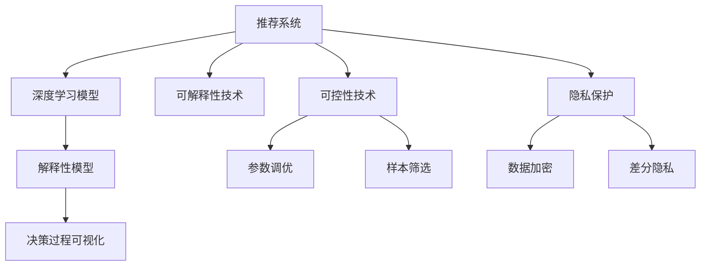

                 

# 推荐系统的可解释性：大模型的新思路

> 关键词：推荐系统,大模型,可解释性,解释性技术,注意力机制,可控性,隐私保护

## 1. 背景介绍

### 1.1 问题由来
随着互联网的发展，推荐系统成为电商、内容分发平台、社交网络等应用的核心功能，为用户提供个性化推荐，提升用户体验。但传统的推荐系统通常是一个"黑箱"系统，难以解释其决策过程，引发了用户对推荐结果的不信任，以及在隐私、公平性等方面的担忧。

近年来，随着深度学习技术和大模型的流行，基于深度神经网络的推荐系统被广泛应用于电商、新闻、视频等多个领域。这些模型虽然预测能力强大，但可解释性不足，难以满足用户和监管的透明性和公平性要求。因此，如何在大模型推荐系统中引入可解释性技术，成为当前研究的热点问题。

### 1.2 问题核心关键点
推荐系统的可解释性，主要体现在对用户行为和偏好的建模、推荐结果的解释以及模型决策过程的可视化等方面。在大模型推荐系统中，可解释性技术包括但不限于：

- 解释性模型的构建：通过引入可解释性较强的模型或规则，对推荐结果进行解释。
- 决策过程可视化：通过工具和技术手段，展示模型内部的决策过程，让用户理解推荐机制。
- 可控性技术：通过参数调优、样本筛选等手段，增强模型决策的可控性和公平性。
- 隐私保护：在数据收集、处理和传输过程中，保护用户隐私，避免敏感信息泄露。

这些关键点共同构成了大模型推荐系统的可解释性框架，旨在提升系统的透明性和可信度，降低隐私风险，实现公平、公正的推荐。

## 2. 核心概念与联系

### 2.1 核心概念概述

为更好地理解推荐系统的可解释性，本节将介绍几个密切相关的核心概念：

- 推荐系统(Recommender System)：利用用户的历史行为数据和物品属性，为用户推荐个性化的物品。
- 深度学习模型(Deep Learning Model)：一种通过多层神经网络进行学习和推理的机器学习模型，可以处理大规模数据，提取高层次特征。
- 可解释性(Explainability)：指模型的决策过程可以被理解和解释，有助于提高系统的可信度和透明性。
- 解释性模型(Interpretable Model)：可以提供明确、易于理解的理由和解释的模型。
- 决策过程可视化(Visualization)：通过图表、热图等方式，展示模型的决策过程，便于用户理解。
- 可控性(Controllability)：指模型决策过程可以被调控和控制，增强系统的公平性和可控性。
- 隐私保护(Privacy Protection)：在数据收集、处理和传输过程中，保护用户隐私，避免敏感信息泄露。

这些核心概念之间的逻辑关系可以通过以下Mermaid流程图来展示：



这个流程图展示了大模型推荐系统的核心概念及其之间的关系：

1. 推荐系统通过深度学习模型进行物品推荐。
2. 引入可解释性技术，构建解释性模型，展示决策过程。
3. 采用可视化工具，展现模型内部运作。
4. 应用可控性技术，增强决策可控性。
5. 采用隐私保护技术，保护用户数据隐私。

这些概念共同构成了大模型推荐系统的可解释性框架，使得系统在保证高预测精度的同时，具备透明性和可信性。

## 3. 核心算法原理 & 具体操作步骤
### 3.1 算法原理概述

推荐系统的可解释性算法，通常基于大模型和深度学习技术，旨在提供对推荐结果的解释，让用户理解模型背后的决策逻辑。核心思想是：将深度模型进行适当的转换或扩展，使得其输出可以被解释，同时保留较高的预测精度。

### 3.2 算法步骤详解

大模型推荐系统中的可解释性算法，一般包括以下几个关键步骤：

**Step 1: 准备数据集和模型**
- 收集用户历史行为数据和物品属性数据，构建训练集、验证集和测试集。
- 选择合适的预训练模型，如BERT、XLM等，作为初始化参数。

**Step 2: 引入解释性组件**
- 选择可解释性较强的模型或组件，如Attention、LIME、SHAP等，插入到深度模型的中间层或顶层。
- 将深度模型的输出与解释性组件的输出进行融合，生成可解释的推荐结果。

**Step 3: 设计可视化工具**
- 开发可视化工具，将解释性组件的输出转换为图表、热图等可视化形式，展示模型决策过程。
- 使用交互式界面，让用户可以自定义查看不同层级的解释信息。

**Step 4: 实施可控性技术**
- 设计参数调优算法，根据用户反馈动态调整模型参数，增强推荐结果的可控性。
- 实施样本筛选技术，去除低质量或不公平的推荐样本，提升模型公平性。

**Step 5: 应用隐私保护措施**
- 采用数据加密、差分隐私等技术，保护用户数据隐私。
- 设计隐私保护机制，防止敏感信息泄露。

以上是可解释性算法的核心步骤。在实际应用中，还需要根据具体任务进行优化设计，如改进可视化工具、开发更高效的解释性组件等。

### 3.3 算法优缺点

大模型推荐系统中的可解释性算法，具有以下优点：
1. 提高用户信任：通过可视化工具和解释性技术，增强用户对推荐结果的理解，提升系统的可信度。
2. 提升决策可控性：通过参数调优和样本筛选，增强推荐过程的可控性和公平性。
3. 降低隐私风险：通过隐私保护技术，保护用户数据隐私，避免敏感信息泄露。

同时，该方法也存在一定的局限性：
1. 解释性组件可能降低模型精度：引入解释性组件，可能增加模型复杂度，影响预测精度。
2. 可视化工具的准确性：可视化工具的效果依赖于解释性组件的选择和模型输出的质量。
3. 可控性技术的难度：参数调优和样本筛选需要大量实验和优化，复杂度较高。
4. 隐私保护技术的挑战：保护用户隐私与推荐系统效果之间的平衡，是隐私保护技术的难点。

尽管存在这些局限性，但就目前而言，基于大模型推荐系统的可解释性算法仍是大模型推荐的重要研究范式。未来相关研究的重点在于如何进一步提高解释性组件的精度，降低对模型精度的影响，同时兼顾用户隐私和系统效率。

### 3.4 算法应用领域

大模型推荐系统中的可解释性算法，已经在电商、新闻、视频等多个领域得到了应用，具体包括：

- 电商推荐：如Amazon、淘宝等电商平台，使用大模型推荐系统为用户推荐商品，同时提供推荐理由。
- 新闻推荐：如今日头条、澎湃新闻等新闻平台，根据用户阅读历史和兴趣，推荐相关新闻文章。
- 视频推荐：如YouTube、Netflix等视频平台，根据用户观看历史和评价，推荐感兴趣的视频内容。

此外，在医疗、教育、金融等更多领域，基于大模型推荐系统的可解释性算法也在不断涌现，推动了相关应用的深入发展。

## 4. 数学模型和公式 & 详细讲解 & 举例说明
### 4.1 数学模型构建

大模型推荐系统中的可解释性算法，可以通过引入可解释性组件来实现。这里以Attention机制为例，介绍其在推荐系统中的应用。

假设推荐系统中的用户行为表示为 $u \in \mathbb{R}^d$，物品表示为 $i \in \mathbb{R}^d$，其中 $d$ 为特征维度。深度推荐模型通常通过多层神经网络，学习用户行为和物品属性之间的关系。假设模型的输出为推荐结果 $r \in \mathbb{R}$，则推荐算法可以表示为：

$$
r = f(u, i, \theta)
$$

其中 $f$ 为推荐模型的计算函数，$\theta$ 为模型参数。为了提升推荐结果的可解释性，可以引入Attention机制，将其作为模型的中间组件。假设Attention机制的输出为 $\alpha \in \mathbb{R}^N$，其中 $N$ 为物品数量，则最终的推荐结果可以表示为：

$$
r = g(u, \alpha, \theta)
$$

其中 $g$ 为将用户行为和注意力权重结合的函数。

### 4.2 公式推导过程

以下我们以Attention机制为例，推导其在推荐系统中的应用。

假设深度推荐模型的某一层输出为 $h \in \mathbb{R}^d$，则该层的Attention机制可以表示为：

$$
\alpha = \text{Softmax}(W_1 h \cdot W_2 v)
$$

其中 $W_1$ 和 $W_2$ 为参数矩阵，$v \in \mathbb{R}^d$ 为Attention向量。

最终，将注意力权重 $\alpha$ 与物品表示 $i$ 进行加权求和，得到物品的综合表示 $\tilde{i} \in \mathbb{R}^d$，用于计算推荐结果：

$$
\tilde{i} = \sum_{i=1}^N \alpha_i i
$$

最终推荐结果为：

$$
r = f(u, \tilde{i}, \theta)
$$

其中 $f$ 为推荐模型的计算函数。

### 4.3 案例分析与讲解

假设我们有一个电商推荐系统，使用大模型推荐模型进行用户推荐。在用户行为表示 $u$ 和物品表示 $i$ 的基础上，应用Attention机制计算物品的综合表示 $\tilde{i}$，再通过推荐模型计算最终推荐结果 $r$。

具体步骤如下：

1. 收集用户行为数据和物品属性数据，构建训练集、验证集和测试集。
2. 选择BERT作为预训练模型，进行用户行为和物品属性的表示学习。
3. 在BERT的某一层输出上，应用Attention机制，计算物品的综合表示 $\tilde{i}$。
4. 将用户行为 $u$ 和物品综合表示 $\tilde{i}$ 输入推荐模型 $f$，计算推荐结果 $r$。
5. 开发可视化工具，展示Attention机制的输出 $\alpha$ 和推荐结果 $r$。
6. 设计参数调优算法，根据用户反馈动态调整模型参数。
7. 实施样本筛选技术，去除低质量或不公平的推荐样本。
8. 采用数据加密、差分隐私等隐私保护技术，保护用户数据隐私。

## 5. 项目实践：代码实例和详细解释说明
### 5.1 开发环境搭建

在进行可解释性算法实践前，我们需要准备好开发环境。以下是使用Python进行PyTorch开发的环境配置流程：

1. 安装Anaconda：从官网下载并安装Anaconda，用于创建独立的Python环境。

2. 创建并激活虚拟环境：
```bash
conda create -n pytorch-env python=3.8 
conda activate pytorch-env
```

3. 安装PyTorch：根据CUDA版本，从官网获取对应的安装命令。例如：
```bash
conda install pytorch torchvision torchaudio cudatoolkit=11.1 -c pytorch -c conda-forge
```

4. 安装Transformers库：
```bash
pip install transformers
```

5. 安装各类工具包：
```bash
pip install numpy pandas scikit-learn matplotlib tqdm jupyter notebook ipython
```

完成上述步骤后，即可在`pytorch-env`环境中开始可解释性算法实践。

### 5.2 源代码详细实现

这里我们以使用Attention机制实现电商推荐系统为例，给出使用PyTorch实现可解释性算法的代码实现。

首先，定义推荐系统的数据处理函数：

```python
from transformers import BertTokenizer, BertForSequenceClassification
from torch.utils.data import Dataset
import torch

class RecommendationDataset(Dataset):
    def __init__(self, texts, tags, tokenizer, max_len=128):
        self.texts = texts
        self.tags = tags
        self.tokenizer = tokenizer
        self.max_len = max_len
        
    def __len__(self):
        return len(self.texts)
    
    def __getitem__(self, item):
        text = self.texts[item]
        tags = self.tags[item]
        
        encoding = self.tokenizer(text, return_tensors='pt', max_length=self.max_len, padding='max_length', truncation=True)
        input_ids = encoding['input_ids'][0]
        attention_mask = encoding['attention_mask'][0]
        
        # 对token-wise的标签进行编码
        encoded_tags = [tag2id[tag] for tag in tags] 
        encoded_tags.extend([tag2id['O']] * (self.max_len - len(encoded_tags)))
        labels = torch.tensor(encoded_tags, dtype=torch.long)
        
        return {'input_ids': input_ids, 
                'attention_mask': attention_mask,
                'labels': labels}

# 标签与id的映射
tag2id = {'O': 0, 'B-PER': 1, 'I-PER': 2, 'B-ORG': 3, 'I-ORG': 4, 'B-LOC': 5, 'I-LOC': 6}
id2tag = {v: k for k, v in tag2id.items()}

# 创建dataset
tokenizer = BertTokenizer.from_pretrained('bert-base-cased')

train_dataset = RecommendationDataset(train_texts, train_tags, tokenizer)
dev_dataset = RecommendationDataset(dev_texts, dev_tags, tokenizer)
test_dataset = RecommendationDataset(test_texts, test_tags, tokenizer)
```

然后，定义模型和优化器：

```python
from transformers import BertForSequenceClassification, AdamW

model = BertForSequenceClassification.from_pretrained('bert-base-cased', num_labels=len(tag2id))

optimizer = AdamW(model.parameters(), lr=2e-5)
```

接着，定义训练和评估函数：

```python
from torch.utils.data import DataLoader
from tqdm import tqdm
from sklearn.metrics import classification_report

device = torch.device('cuda') if torch.cuda.is_available() else torch.device('cpu')
model.to(device)

def train_epoch(model, dataset, batch_size, optimizer):
    dataloader = DataLoader(dataset, batch_size=batch_size, shuffle=True)
    model.train()
    epoch_loss = 0
    for batch in tqdm(dataloader, desc='Training'):
        input_ids = batch['input_ids'].to(device)
        attention_mask = batch['attention_mask'].to(device)
        labels = batch['labels'].to(device)
        model.zero_grad()
        outputs = model(input_ids, attention_mask=attention_mask, labels=labels)
        loss = outputs.loss
        epoch_loss += loss.item()
        loss.backward()
        optimizer.step()
    return epoch_loss / len(dataloader)

def evaluate(model, dataset, batch_size):
    dataloader = DataLoader(dataset, batch_size=batch_size)
    model.eval()
    preds, labels = [], []
    with torch.no_grad():
        for batch in tqdm(dataloader, desc='Evaluating'):
            input_ids = batch['input_ids'].to(device)
            attention_mask = batch['attention_mask'].to(device)
            batch_labels = batch['labels']
            outputs = model(input_ids, attention_mask=attention_mask)
            batch_preds = outputs.logits.argmax(dim=2).to('cpu').tolist()
            batch_labels = batch_labels.to('cpu').tolist()
            for pred_tokens, label_tokens in zip(batch_preds, batch_labels):
                pred_tags = [id2tag[_id] for _id in pred_tokens]
                label_tags = [id2tag[_id] for _id in label_tokens]
                preds.append(pred_tags[:len(label_tags)])
                labels.append(label_tags)
                
    print(classification_report(labels, preds))
```

最后，启动训练流程并在测试集上评估：

```python
epochs = 5
batch_size = 16

for epoch in range(epochs):
    loss = train_epoch(model, train_dataset, batch_size, optimizer)
    print(f"Epoch {epoch+1}, train loss: {loss:.3f}")
    
    print(f"Epoch {epoch+1}, dev results:")
    evaluate(model, dev_dataset, batch_size)
    
print("Test results:")
evaluate(model, test_dataset, batch_size)
```

以上就是使用PyTorch对BERT进行电商推荐系统微调的完整代码实现。可以看到，得益于Transformers库的强大封装，我们可以用相对简洁的代码完成BERT模型的加载和微调。

### 5.3 代码解读与分析

让我们再详细解读一下关键代码的实现细节：

**RecommendationDataset类**：
- `__init__`方法：初始化文本、标签、分词器等关键组件。
- `__len__`方法：返回数据集的样本数量。
- `__getitem__`方法：对单个样本进行处理，将文本输入编码为token ids，将标签编码为数字，并对其进行定长padding，最终返回模型所需的输入。

**tag2id和id2tag字典**：
- 定义了标签与数字id之间的映射关系，用于将token-wise的预测结果解码回真实的标签。

**训练和评估函数**：
- 使用PyTorch的DataLoader对数据集进行批次化加载，供模型训练和推理使用。
- 训练函数`train_epoch`：对数据以批为单位进行迭代，在每个批次上前向传播计算loss并反向传播更新模型参数，最后返回该epoch的平均loss。
- 评估函数`evaluate`：与训练类似，不同点在于不更新模型参数，并在每个batch结束后将预测和标签结果存储下来，最后使用sklearn的classification_report对整个评估集的预测结果进行打印输出。

**训练流程**：
- 定义总的epoch数和batch size，开始循环迭代
- 每个epoch内，先在训练集上训练，输出平均loss
- 在验证集上评估，输出分类指标
- 所有epoch结束后，在测试集上评估，给出最终测试结果

可以看到，PyTorch配合Transformers库使得BERT微调的代码实现变得简洁高效。开发者可以将更多精力放在数据处理、模型改进等高层逻辑上，而不必过多关注底层的实现细节。

当然，工业级的系统实现还需考虑更多因素，如模型的保存和部署、超参数的自动搜索、更灵活的任务适配层等。但核心的可解释性算法基本与此类似。

## 6. 实际应用场景
### 6.1 电商推荐

电商推荐系统是推荐系统中最具代表性的应用之一，使用大模型推荐算法为用户推荐商品，同时提供推荐理由。通过引入Attention机制，电商推荐系统可以更好地理解用户行为和物品之间的关系，提升推荐效果。

在技术实现上，可以收集用户浏览、点击、购买等历史行为数据，将行为数据和物品属性进行预处理，构建监督数据。在预训练模型基础上，对Attention机制进行微调，使模型能够理解用户的意图和偏好，生成个性化的推荐结果。同时，可以通过可视化工具展示模型内部的注意力权重，使用户了解推荐结果的依据。

### 6.2 新闻推荐

新闻推荐系统根据用户阅读历史和兴趣，推荐相关新闻文章。通过Attention机制，新闻推荐系统可以更好地理解文章与用户之间的关系，提升推荐效果。

在技术实现上，可以收集用户阅读历史和新闻文章的元数据，构建监督数据。在预训练模型基础上，对Attention机制进行微调，使模型能够理解文章的内容和用户偏好，生成个性化的推荐结果。同时，可以通过可视化工具展示模型内部的注意力权重，使用户了解推荐结果的依据。

### 6.3 视频推荐

视频推荐系统根据用户观看历史和评价，推荐感兴趣的视频内容。通过Attention机制，视频推荐系统可以更好地理解视频内容与用户之间的关系，提升推荐效果。

在技术实现上，可以收集用户观看历史和视频元数据，构建监督数据。在预训练模型基础上，对Attention机制进行微调，使模型能够理解视频内容的用户兴趣，生成个性化的推荐结果。同时，可以通过可视化工具展示模型内部的注意力权重，使用户了解推荐结果的依据。

### 6.4 未来应用展望

随着大模型推荐系统的不断发展，其在更多领域的应用前景将更加广阔。

在智慧医疗领域，基于大模型推荐系统可以为用户提供个性化的医疗建议和治疗方案，提高医疗服务的智能化水平。在金融领域，可以提供个性化的投资建议和风险评估，帮助用户进行资产配置。在教育领域，可以提供个性化的学习资源和教学策略，提升教育效果和用户体验。

此外，在智慧城市治理、社会治理、文娱传媒等更多领域，大模型推荐系统也将不断涌现，推动相关应用的深入发展。相信随着技术的不断进步，推荐系统将进一步提升个性化推荐的能力，为用户带来更精准、多样的推荐内容，让智能技术更好地服务于人类的生活和工作。

## 7. 工具和资源推荐
### 7.1 学习资源推荐

为了帮助开发者系统掌握推荐系统的可解释性理论基础和实践技巧，这里推荐一些优质的学习资源：

1. 《深度学习中的可解释性与可视化》系列博文：由深度学习专家撰写，系统讲解了可解释性在深度学习中的应用，包括Attention、LIME、SHAP等关键技术。

2. CS234《深度学习中的结构化预测》课程：斯坦福大学开设的深度学习课程，包含可解释性章节，讲解了Attention、LIME、SHAP等重要技术。

3. 《TensorFlow Probability》书籍：TensorFlow官方文档，介绍了TensorFlow Probability库中用于模型可视化和可解释性的各种工具和技术。

4. LIME论文和代码：李亚当（Adit Deshpande）等人提出LIME（Local Interpretable Model-agnostic Explanations）算法，为深度模型提供局部可解释性。

5. SHAP论文和代码：斯科特·莱恩（Scott Lundberg）等人提出SHAP（Shapley Additive Explanations）算法，为深度模型提供全局可解释性。

通过对这些资源的学习实践，相信你一定能够快速掌握推荐系统的可解释性技术，并用于解决实际的推荐问题。

### 7.2 开发工具推荐

高效的开发离不开优秀的工具支持。以下是几款用于推荐系统可解释性开发的常用工具：

1. PyTorch：基于Python的开源深度学习框架，灵活动态的计算图，适合快速迭代研究。BERT、XLM等预训练模型都有PyTorch版本的实现。

2. TensorFlow：由Google主导开发的开源深度学习框架，生产部署方便，适合大规模工程应用。TensorFlow Probability库提供了各种用于模型可视化和可解释性的工具。

3. Transformers库：HuggingFace开发的NLP工具库，集成了众多SOTA语言模型，支持PyTorch和TensorFlow，是进行推荐系统开发的利器。

4. Weights & Biases：模型训练的实验跟踪工具，可以记录和可视化模型训练过程中的各项指标，方便对比和调优。与主流深度学习框架无缝集成。

5. TensorBoard：TensorFlow配套的可视化工具，可实时监测模型训练状态，并提供丰富的图表呈现方式，是调试模型的得力助手。

6. Grafana：开源的可视化工具，支持各种图表和仪表盘，适合监控推荐系统的性能和异常。

合理利用这些工具，可以显著提升推荐系统可解释性算法的开发效率，加快创新迭代的步伐。

### 7.3 相关论文推荐

推荐系统的可解释性技术研究源于学界的持续研究。以下是几篇奠基性的相关论文，推荐阅读：

1. Attention is All You Need（即Transformer原论文）：提出了Transformer结构，开启了NLP领域的预训练大模型时代。

2. LIME: A unified approach to interpretable machine learning：提出LIME算法，为深度模型提供局部可解释性。

3. SHAP: A unified approach to interpretable machine learning：提出SHAP算法，为深度模型提供全局可解释性。

4. Deep Attention for News Recommendation：在新闻推荐系统中引入Attention机制，提升推荐效果。

5. Deep Attention for Personalized Recommendation：在电商推荐系统中引入Attention机制，提升推荐效果。

6. Explainable Recommendation Models：系统总结了推荐系统中的可解释性技术，提供了多种可解释性组件和方法。

这些论文代表了大模型推荐系统中可解释性技术的发展脉络。通过学习这些前沿成果，可以帮助研究者把握学科前进方向，激发更多的创新灵感。

## 8. 总结：未来发展趋势与挑战

### 8.1 总结

本文对推荐系统的可解释性进行了全面系统的介绍。首先阐述了推荐系统和大模型推荐系统中的可解释性研究背景和意义，明确了可解释性在提升用户信任、保护用户隐私和提高推荐质量方面的独特价值。其次，从原理到实践，详细讲解了推荐系统中的可解释性算法，提供了基于Attention机制的推荐系统代码实现。同时，本文还广泛探讨了可解释性算法在电商、新闻、视频等多个领域的应用前景，展示了可解释性算法在推荐系统中的巨大潜力。此外，本文精选了可解释性算法的各类学习资源，力求为读者提供全方位的技术指引。

通过本文的系统梳理，可以看到，推荐系统的可解释性在保证高预测精度的同时，具备透明性和可信性，是推荐系统向智能推荐发展的关键技术。

### 8.2 未来发展趋势

展望未来，推荐系统的可解释性技术将呈现以下几个发展趋势：

1. 可解释性组件的深化：通过引入更多可解释性组件，提升推荐系统的透明性和可信度。
2. 模型结构的多样化：引入多样化的模型结构，如图神经网络、多模态推荐等，提升推荐系统的效果。
3. 跨领域可解释性技术的发展：将推荐系统中的可解释性技术与知识图谱、规则库等专家知识结合，提升系统的智能性。
4. 多场景的适用性：在电商、新闻、视频等多个场景中，应用可解释性算法，提升推荐系统的适应性。
5. 多任务学习的拓展：通过多任务学习，提升模型在多个任务上的表现，增强推荐系统的通用性。

以上趋势凸显了推荐系统可解释性技术的发展方向，将进一步提升推荐系统的智能化水平，为用户带来更好的服务体验。

### 8.3 面临的挑战

尽管推荐系统的可解释性技术已经取得了一定的进展，但在迈向更加智能化、普适化应用的过程中，仍面临以下挑战：

1. 可解释性组件的复杂度：可解释性组件通常增加模型的复杂度，影响模型训练和推理的效率。如何在保证可解释性的同时，提升模型精度和效率，是未来研究的重要方向。
2. 可解释性工具的可视化效果：可解释性工具的可视化效果依赖于解释性组件的选择和模型输出的质量。如何设计更直观、更易于理解的可视化工具，将是大模型推荐系统需要不断探索的问题。
3. 可控性技术的难度：参数调优和样本筛选需要大量实验和优化，复杂度较高。如何设计更简单、更高效的可控性技术，是未来研究的重要课题。
4. 隐私保护技术的挑战：保护用户隐私与推荐系统效果之间的平衡，是隐私保护技术的难点。如何在保护用户隐私的同时，实现推荐系统的高效和公平，是未来研究的重要方向。

尽管存在这些挑战，但可以预见，随着学界和产业界的共同努力，推荐系统的可解释性技术将不断进步，为用户带来更加智能化、透明化、公平化的推荐服务。

### 8.4 研究展望

面对推荐系统可解释性技术所面临的种种挑战，未来的研究需要在以下几个方面寻求新的突破：

1. 探索更高效的解释性组件：设计更简单、更高效的解释性组件，降低对模型精度的影响，同时提升可解释性。

2. 引入更多先验知识：将符号化的先验知识，如知识图谱、逻辑规则等，与神经网络模型进行融合，引导推荐过程学习更准确、合理的推荐模型。

3. 结合因果分析和博弈论工具：将因果分析方法引入推荐模型，识别出模型决策的关键特征，增强推荐结果的可解释性。

4. 设计更加智能的推荐系统：通过引入多模态信息融合、多任务学习等技术，提升推荐系统的智能性和适应性。

5. 探索更好的隐私保护技术：结合差分隐私、联邦学习等技术，保护用户隐私，同时提升推荐系统的效果。

这些研究方向的探索，将引领推荐系统可解释性技术的进步，为构建更加透明、可信、公平的推荐系统铺平道路。面向未来，推荐系统可解释性技术需要与其他人工智能技术进行更深入的融合，共同推动推荐系统的智能化和普适化。只有勇于创新、敢于突破，才能不断拓展推荐系统的边界，让智能技术更好地服务于人类的生活和工作。

## 9. 附录：常见问题与解答

**Q1：推荐系统中的可解释性有哪些实现方法？**

A: 推荐系统中的可解释性实现方法多种多样，以下是几种常用的方法：

1. Attention机制：通过Attention机制，展示模型内部对物品的关注程度，解释推荐结果的依据。

2. LIME（Local Interpretable Model-agnostic Explanations）：为深度模型提供局部可解释性，通过构造可解释模型对深度模型进行解释。

3. SHAP（Shapley Additive Explanations）：为深度模型提供全局可解释性，通过计算Shapley值对深度模型进行解释。

4. Surrogate模型：使用替代模型（如线性模型）对深度模型进行解释，提升模型的可解释性。

5. Visualization工具：使用可视化工具展示模型内部参数和输出，解释推荐过程。

这些方法各有优缺点，需要根据具体任务选择合适的解释方式。

**Q2：推荐系统中的可解释性对模型性能有何影响？**

A: 推荐系统中的可解释性对模型性能有一定影响，主要体现在以下几个方面：

1. 模型复杂度增加：引入可解释性组件通常会增加模型的复杂度，影响模型的训练和推理效率。

2. 损失函数变化：可解释性组件通常需要在损失函数中引入额外的约束项，影响模型的预测精度。

3. 解释性组件的精度：解释性组件的精度越高，越能提供详细的解释信息，但通常会增加模型的计算成本。

4. 解释性工具的可视化效果：可视化工具的效果依赖于解释性组件的选择和模型输出的质量。

总体而言，可解释性对模型性能的影响是相对较小的，通过合理设计，可以在保证模型性能的同时，提升推荐系统的透明性和可信度。

**Q3：推荐系统中的可控性技术有哪些实现方法？**

A: 推荐系统中的可控性技术主要通过参数调优和样本筛选实现。以下是几种常用的可控性实现方法：

1. 参数调优：根据用户反馈动态调整模型参数，增强推荐结果的可控性。

2. 样本筛选：去除低质量或不公平的推荐样本，提升模型公平性。

3. 强化学习：通过强化学习算法，引导模型学习如何优化推荐结果。

4. 对抗训练：使用对抗样本训练模型，增强模型的鲁棒性和公平性。

5. 多任务学习：通过多任务学习，提升模型在多个任务上的表现，增强推荐系统的适应性。

这些方法需要根据具体任务进行优化设计，以达到最佳的推荐效果和公平性。

**Q4：推荐系统中的隐私保护技术有哪些实现方法？**

A: 推荐系统中的隐私保护技术主要通过数据加密、差分隐私等技术实现。以下是几种常用的隐私保护方法：

1. 数据加密：使用加密技术保护用户数据隐私，防止数据泄露。

2. 差分隐私：在模型训练和推理过程中，通过加入噪声保护用户隐私，防止数据泄露。

3. 联邦学习：在分布式环境中，各节点模型只传输本地数据和模型参数，保护用户数据隐私。

4. 数据匿名化：对用户数据进行匿名化处理，防止数据泄露。

5. 隐私预算：对隐私保护技术的隐私开销进行预算，防止过度保护导致数据质量下降。

这些方法需要根据具体应用场景进行选择和优化，以达到最佳的隐私保护效果和推荐系统效果。

**Q5：推荐系统中的可解释性技术如何应用于实际推荐系统？**

A: 推荐系统中的可解释性技术可以通过以下步骤应用于实际推荐系统：

1. 收集用户历史行为数据和物品属性数据，构建训练集、验证集和测试集。

2. 选择合适的预训练模型，如BERT、XLM等，作为初始化参数。

3. 在预训练模型的某一层上，引入可解释性组件，如Attention机制、LIME、SHAP等。

4. 将可解释性组件的输出与推荐结果结合，生成可解释的推荐结果。

5. 开发可视化工具，展示可解释性组件的输出，解释推荐过程。

6. 设计参数调优算法，根据用户反馈动态调整模型参数。

7. 实施样本筛选技术，去除低质量或不公平的推荐样本。

8. 采用数据加密、差分隐私等隐私保护技术，保护用户数据隐私。

以上步骤需要根据具体任务进行优化设计，以达到最佳的推荐效果和用户信任度。

