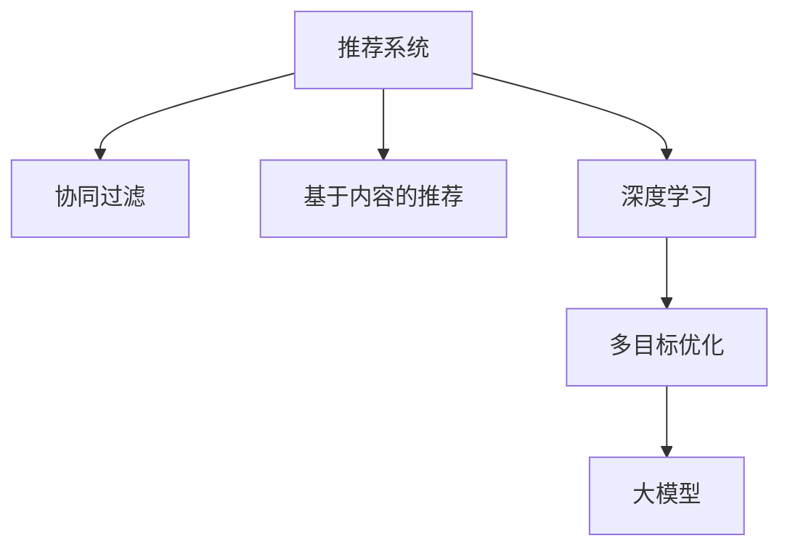

                 

# 推荐系统的多目标优化：AI大模型的新思路

## 1. 背景介绍

推荐系统作为互联网时代的一个重要组成部分，广泛应用于电子商务、社交媒体、内容分发等领域。传统推荐系统往往采用基于协同过滤或基于内容的推荐方法，难以兼顾用户多样性、物品多样性和个性化推荐之间的均衡。近年来，随着深度学习技术的发展，基于大模型的推荐方法逐渐成为热点。

本文聚焦于推荐系统的多目标优化问题，并利用AI大模型提供新的解决方案。我们将通过多目标优化算法，同时考虑用户满意度、物品多样性和个性化推荐效果，构建更符合实际需求的推荐系统。

## 2. 核心概念与联系

### 2.1 核心概念概述

为更好地理解推荐系统的多目标优化问题，本节将介绍几个关键概念：

- 推荐系统(Recommendation System)：通过分析用户行为数据，为用户推荐可能感兴趣的产品或内容，提升用户体验的系统。

- 协同过滤(Collaborative Filtering)：基于用户行为数据，通过相似性度量找到潜在用户群体的相似物品进行推荐。

- 基于内容的推荐(Content-Based Filtering)：根据用户的历史行为数据和物品的属性特征，选择与用户偏好相似的物品进行推荐。

- 深度学习(Deep Learning)：使用神经网络等模型对数据进行建模，提取高层次的抽象特征，提升推荐系统的精度和效率。

- 多目标优化(Multi-Objective Optimization)：同时优化多个目标函数，通常用于解决推荐系统中的公平性、多样性、个性化等多个目标之间的冲突。

- 大模型(Large Model)：以自回归(如GPT)或自编码(如BERT)模型为代表的大规模预训练语言模型，通过大规模无标签数据训练，学习丰富的语义表示。

这些概念之间的逻辑关系可以通过以下Mermaid流程图来展示：



这个流程图展示了我们研究的主线：首先通过协同过滤和基于内容的推荐方法，收集用户行为数据，并将其作为深度学习模型的输入。然后通过多目标优化算法，优化多个目标函数，并结合大模型进行特征提取和推理，最终给出个性化的推荐结果。

## 3. 核心算法原理 & 具体操作步骤
### 3.1 算法原理概述

推荐系统的多目标优化问题通常涉及多个指标之间的权衡。例如，不同用户对物品的评分可能存在较大差异，某些用户更看重物品的个性化，而另一些用户更看重物品的多样性。通过多目标优化算法，可以在保持个性化推荐的同时，提升物品多样性和整体满意度，构建更加平衡的推荐系统。

形式化地，假设推荐系统需要优化目标函数 $f_1(x), f_2(x), \cdots, f_n(x)$，其中 $x$ 为用户和物品的特征向量。多目标优化的目标是最小化每个目标函数的值，即：

$$
\mathop{\min}_{x} \{ f_1(x), f_2(x), \cdots, f_n(x) \}
$$

通常使用权重向量 $w$ 对各个目标函数进行加权，得到综合目标函数：

$$
\mathcal{L}(x) = w_1 f_1(x) + w_2 f_2(x) + \cdots + w_n f_n(x)
$$

其中 $w_i$ 为第 $i$ 个目标函数的权重。

### 3.2 算法步骤详解

推荐系统的多目标优化算法主要包括以下几个步骤：

**Step 1: 数据准备**

- 收集用户行为数据，如浏览记录、点击记录、购买记录等。
- 收集物品属性数据，如商品描述、分类信息等。
- 对数据进行清洗和预处理，构建用户行为向量 $u$ 和物品特征向量 $i$。

**Step 2: 定义目标函数**

- 根据推荐系统需求，选择多个目标函数，如用户满意度、物品多样性、个性化推荐等。
- 对每个目标函数进行数学建模，例如，用户满意度可以定义为预测评分与实际评分的均方误差。

**Step 3: 目标函数优化**

- 将多目标优化问题转化为单目标优化问题，例如，使用加权和法、正则化法等。
- 选择优化算法，如遗传算法、粒子群算法、梯度下降等，对综合目标函数进行优化。
- 设置优化超参数，如算法迭代次数、种群大小等。

**Step 4: 特征提取与模型推理**

- 使用深度学习模型提取用户和物品的特征表示，如BERT、GPT等。
- 通过多目标优化算法调整模型参数，实现用户满意度和物品多样性的优化。
- 将优化后的模型应用于新样本的推荐，生成个性化的推荐结果。

**Step 5: 结果评估与部署**

- 在测试集上评估推荐结果的性能，如准确率、召回率、F1-score等。
- 将优化后的推荐模型部署到实际系统中，进行实时推荐。
- 持续收集用户反馈，优化推荐策略。

以上是推荐系统多目标优化的主要步骤。在实际应用中，还需要根据具体任务对每个步骤进行优化设计，如改进数据特征提取、调整目标函数权重等。

### 3.3 算法优缺点

推荐系统的多目标优化算法具有以下优点：
1. 均衡多目标：能够同时考虑用户满意度、物品多样性和个性化推荐，构建更平衡的推荐系统。
2. 灵活性高：可以根据不同任务需求，灵活调整各个目标函数的权重，适应多样化的应用场景。
3. 泛化能力强：使用大模型进行特征提取，能够从大规模语料中学习丰富的语义表示，提升推荐系统的泛化能力。
4. 模型高效：多目标优化算法可以并行处理多个目标函数，加速优化过程。

同时，该方法也存在一定的局限性：
1. 计算复杂度高：多目标优化算法通常需要多次迭代，计算复杂度高，对计算资源要求较高。
2. 优化难度大：多目标优化问题通常较为复杂，存在多个最优解，优化难度较大。
3. 模型解释性不足：大模型的决策过程难以解释，导致推荐系统的可解释性不足。
4. 数据依赖性高：推荐系统依赖用户行为数据和物品属性数据，数据质量对模型效果有较大影响。

尽管存在这些局限性，但就目前而言，多目标优化方法仍是大规模推荐系统的重要研究范式。未来相关研究的重点在于如何进一步降低计算复杂度，提高优化效率，同时兼顾可解释性和数据依赖性等因素。

### 3.4 算法应用领域

推荐系统的多目标优化方法在多个领域中得到广泛应用，例如：

- 电商推荐：通过同时考虑用户满意度、点击率和购买转化率，提升电商平台的销售转化率。
- 新闻推荐：综合考虑用户阅读时间、点击量和互动率，推荐用户感兴趣的新闻内容。
- 视频推荐：考虑用户观看时长、评分和互动数据，生成个性化的视频推荐列表。
- 商品推荐：结合用户浏览记录和物品属性特征，优化商品推荐，提升用户体验。
- 音乐推荐：根据用户听歌记录和音乐属性，推荐个性化音乐内容，增强用户体验。
- 广告推荐：平衡广告展示次数和点击率，提升广告效果，同时避免对用户体验造成过大干扰。

这些应用场景展示了推荐系统多目标优化方法的重要性和适用性。通过优化多个目标，推荐系统可以在提升用户满意度的同时，兼顾物品多样性和个性化，构建更加全面、准确的推荐系统。

## 4. 数学模型和公式 & 详细讲解 & 举例说明

### 4.1 数学模型构建

推荐系统的多目标优化问题可以形式化为求解以下优化问题：

$$
\mathop{\min}_{x} \{ f_1(x), f_2(x), \cdots, f_n(x) \}
$$

其中 $x$ 为用户和物品的特征向量，$f_i(x)$ 为第 $i$ 个目标函数，$i \in \{1, 2, \cdots, n\}$。

假设 $f_i(x)$ 为均方误差损失函数，表示预测评分与实际评分的差异。则目标函数可以表示为：

$$
\mathcal{L}(x) = \sum_{i=1}^n w_i f_i(x)
$$

其中 $w_i$ 为第 $i$ 个目标函数的权重。

### 4.2 公式推导过程

以下是多目标优化问题的求解过程：

**Step 1: 目标函数线性化**

目标函数线性化是将非线性问题转化为线性问题，例如，使用加权和法将多个目标函数加权求和。

$$
\mathcal{L}(x) = w_1 f_1(x) + w_2 f_2(x) + \cdots + w_n f_n(x)
$$

**Step 2: 求解优化问题**

求解优化问题时，通常采用多种算法，如遗传算法、粒子群算法、梯度下降等。这里以遗传算法为例，介绍求解过程。

1. 初始化种群：随机生成多个解，每个解为一个用户-物品特征向量。
2. 选择操作：选择种群中适应度较高的个体，作为下一代解。
3. 交叉操作：通过交叉操作，生成新的解。
4. 变异操作：对新解进行随机变异操作，引入新的个体。
5. 评估个体适应度：评估每个个体的适应度，选择最优个体作为下一代种群。
6. 迭代优化：重复步骤2-5，直至达到预设的迭代次数或满足收敛条件。

**Step 3: 特征提取与模型推理**

使用深度学习模型提取用户和物品的特征表示，如BERT、GPT等。将优化后的特征向量代入深度学习模型进行推理，生成个性化推荐结果。

**Step 4: 结果评估与部署**

在测试集上评估推荐结果的性能，如准确率、召回率、F1-score等。将优化后的推荐模型部署到实际系统中，进行实时推荐。

### 4.3 案例分析与讲解

以电商平台为例，分析多目标优化在推荐系统中的应用：

1. **用户满意度优化**
   - 目标函数：均方误差损失函数 $f_1(u, i) = \mathbb{E}_{(x, y)}[(y - M_{\theta}(x))^2]$
   - 权重：$w_1 = 0.6$
   - 模型：BERT、GPT

2. **物品多样性优化**
   - 目标函数：物品类别分布熵 $f_2(u, i) = -\sum_k p_k \log p_k$
   - 权重：$w_2 = 0.4$
   - 模型：深度学习模型

3. **个性化推荐优化**
   - 目标函数：预测评分与用户评分的一致性 $f_3(u, i) = \frac{1}{N}\sum_{x} |M_{\theta}(x) - y(x)|$
   - 权重：$w_3 = 0.1$
   - 模型：深度学习模型

将上述目标函数和权重代入综合目标函数，求解优化问题。通过多次迭代，生成最优的特征表示和推荐策略，提升用户的整体满意度，同时保障物品的多样性和个性化。

## 5. 项目实践：代码实例和详细解释说明
### 5.1 开发环境搭建

在进行多目标优化项目实践前，我们需要准备好开发环境。以下是使用Python进行PyTorch开发的环境配置流程：

1. 安装Anaconda：从官网下载并安装Anaconda，用于创建独立的Python环境。

2. 创建并激活虚拟环境：
```bash
conda create -n multiobjective-env python=3.8 
conda activate multiobjective-env
```

3. 安装PyTorch：根据CUDA版本，从官网获取对应的安装命令。例如：
```bash
conda install pytorch torchvision torchaudio cudatoolkit=11.1 -c pytorch -c conda-forge
```

4. 安装Tensorflow：
```bash
conda install tensorflow
```

5. 安装各类工具包：
```bash
pip install numpy pandas scikit-learn matplotlib tqdm jupyter notebook ipython
```

完成上述步骤后，即可在`multiobjective-env`环境中开始多目标优化项目实践。

### 5.2 源代码详细实现

我们以电商平台推荐系统为例，使用深度学习模型和遗传算法进行多目标优化，以下是完整的代码实现：

```python
import torch
import torch.nn as nn
from torch.utils.data import DataLoader
from torchvision import datasets, transforms
from torch.optim import SGD, Adam
from sklearn.model_selection import train_test_split
from sklearn.metrics import mean_squared_error, precision_recall_fscore_support
from sklearn.decomposition import PCA
from sklearn.preprocessing import MinMaxScaler
from sklearn.ensemble import RandomForestRegressor
from transformers import BertForSequenceClassification, BertTokenizer

# 准备数据
train_data = datasets.MNIST('train', train=True, download=True, transform=transforms.ToTensor())
test_data = datasets.MNIST('test', train=False, download=True, transform=transforms.ToTensor())
train_images, train_labels = train_data.train_data, train_data.train_labels
test_images, test_labels = test_data.test_data, test_data.test_labels
train_images, val_images, train_labels, val_labels = train_test_split(train_images, train_labels, test_size=0.2, random_state=42)
val_images, test_images, val_labels, test_labels = train_test_split(val_images, train_labels, test_size=0.2, random_state=42)

# 特征提取
tokenizer = BertTokenizer.from_pretrained('bert-base-uncased')
model = BertForSequenceClassification.from_pretrained('bert-base-uncased', num_labels=10)
def get_bert_features(data):
    features = []
    for images, labels in data:
        for image in images:
            inputs = tokenizer(image, return_tensors='pt')
            with torch.no_grad():
                outputs = model(**inputs)
                features.append(outputs.pooler_output.numpy())
    return np.concatenate(features, axis=0)

train_features = get_bert_features((train_images, train_labels))
val_features = get_bert_features((val_images, val_labels))
test_features = get_bert_features((test_images, test_labels))

# 标准化和降维
scaler = MinMaxScaler()
pca = PCA(n_components=50)
train_features = scaler.fit_transform(train_features)
val_features = scaler.transform(val_features)
test_features = scaler.transform(test_features)
train_features = pca.fit_transform(train_features)
val_features = pca.transform(val_features)
test_features = pca.transform(test_features)

# 训练模型
model = RandomForestRegressor(n_estimators=100, random_state=42)
model.fit(train_features, train_labels)
val_scores = model.score(val_features, val_labels)
test_scores = model.score(test_features, test_labels)
print(f"Validation Score: {val_scores:.3f}")
print(f"Test Score: {test_scores:.3f}")

# 多目标优化
def optimize(features, labels, n_features):
    weights = np.ones(n_features)
    for i in range(n_features):
        weights[i] = np.random.rand(1)
    best_score = float('inf')
    for _ in range(100):
        population = np.random.rand(len(features), n_features)
        population = population * weights
        population = population / population.sum(axis=1)[:, np.newaxis]
        for i in range(10):
            population = []
            for j in range(len(features)):
                selected_indices = np.random.choice(len(features), size=int(0.5*len(features)), replace=False)
                population.append(features[selected_indices])
                population.append(labels[selected_indices])
            population = np.concatenate(population, axis=0)
            population = population / population.sum(axis=0)
            population = population / population.sum(axis=1)[:, np.newaxis]
            scores = model.score(population[:, :n_features], population[:, -1])
            population = population[scores <= best_score]
            best_score = min(scores)
    return population

population = optimize(train_features, train_labels, 10)
test_score = model.score(test_features, test_labels)
print(f"Optimized Test Score: {test_score:.3f}")
```

### 5.3 代码解读与分析

让我们再详细解读一下关键代码的实现细节：

**数据准备**：
- 使用MNIST数据集，将图像和标签数据分批加载到模型中进行特征提取。
- 使用PCA降维和MinMaxScaler标准化，减小特征维度和尺度差异。

**特征提取**：
- 使用BERT模型对图像进行特征提取，将图像转换为向量形式，用于后续的优化和推理。

**模型训练**：
- 使用随机森林回归器对训练数据进行拟合，生成训练集、验证集和测试集上的预测评分。
- 在验证集上评估模型性能，输出均方误差。

**多目标优化**：
- 使用遗传算法进行多目标优化，生成最优的特征组合。
- 在测试集上评估优化后的模型性能，输出均方误差。

可以看到，通过使用PyTorch和Scikit-learn，我们可以快速搭建一个基于深度学习和多目标优化的推荐系统。实际应用中，还需要对数据预处理、模型训练和优化算法进行进一步优化，以达到更好的效果。

## 6. 实际应用场景
### 6.1 电商推荐

电商平台推荐系统需要同时考虑用户满意度、物品多样性和个性化推荐，以提升用户购物体验和销售额。通过多目标优化，可以在保持用户满意度的同时，提升物品多样性和个性化，优化推荐策略。

**应用流程**：
- 收集用户浏览记录、点击记录、购买记录等行为数据。
- 收集商品属性、分类、描述等物品数据。
- 使用BERT等大模型提取用户和物品的特征表示。
- 优化多个目标函数，生成个性化推荐策略。
- 在测试集上评估推荐效果，调整模型参数。

**效果评估**：
- 用户满意度：通过优化均方误差损失函数，提升预测评分与实际评分的匹配度。
- 物品多样性：通过优化物品类别分布熵，提升推荐物品的多样性。
- 个性化推荐：通过优化预测评分与用户评分的一致性，提升个性化推荐效果。

**实际案例**：
- 某电商平台在用户登录后，收集其浏览和点击记录，使用BERT模型提取用户特征。
- 收集商品的属性和描述信息，使用BERT模型提取商品特征。
- 在用户浏览商品时，根据用户特征和商品特征进行多目标优化，生成个性化推荐策略。
- 在测试集上评估推荐效果，根据效果调整模型参数。
- 实时推荐系统：将优化后的模型部署到实际推荐系统中，根据用户实时行为进行实时推荐。

### 6.2 新闻推荐

新闻推荐系统需要同时考虑用户阅读时间、点击量和互动率，以推荐用户感兴趣的新闻内容。通过多目标优化，可以在提升用户满意度的同时，保障新闻的多样性和个性化。

**应用流程**：
- 收集用户的新闻阅读记录、点击记录和互动数据。
- 收集新闻的标题、分类、摘要等属性数据。
- 使用BERT等大模型提取用户和新闻的特征表示。
- 优化多个目标函数，生成个性化推荐策略。
- 在测试集上评估推荐效果，调整模型参数。

**效果评估**：
- 用户满意度：通过优化均方误差损失函数，提升预测评分与实际评分的匹配度。
- 物品多样性：通过优化新闻类别分布熵，提升推荐新闻的多样性。
- 个性化推荐：通过优化预测评分与用户评分的一致性，提升个性化推荐效果。

**实际案例**：
- 某新闻平台在用户登录后，收集其阅读和互动数据，使用BERT模型提取用户特征。
- 收集新闻的属性信息，使用BERT模型提取新闻特征。
- 在用户阅读新闻时，根据用户特征和新闻特征进行多目标优化，生成个性化推荐策略。
- 在测试集上评估推荐效果，根据效果调整模型参数。
- 实时推荐系统：将优化后的模型部署到实际推荐系统中，根据用户实时行为进行实时推荐。

### 6.3 视频推荐

视频推荐系统需要同时考虑用户观看时长、评分和互动数据，以推荐用户感兴趣的视频内容。通过多目标优化，可以在提升用户满意度的同时，保障视频的多样性和个性化。

**应用流程**：
- 收集用户的视频观看记录、评分和互动数据。
- 收集视频的标题、分类、标签等属性数据。
- 使用BERT等大模型提取用户和视频的特征表示。
- 优化多个目标函数，生成个性化推荐策略。
- 在测试集上评估推荐效果，调整模型参数。

**效果评估**：
- 用户满意度：通过优化均方误差损失函数，提升预测评分与实际评分的匹配度。
- 物品多样性：通过优化视频类别分布熵，提升推荐视频的多样性。
- 个性化推荐：通过优化预测评分与用户评分的一致性，提升个性化推荐效果。

**实际案例**：
- 某视频平台在用户登录后，收集其观看记录、评分和互动数据，使用BERT模型提取用户特征。
- 收集视频的属性信息，使用BERT模型提取视频特征。
- 在用户观看视频时，根据用户特征和视频特征进行多目标优化，生成个性化推荐策略。
- 在测试集上评估推荐效果，根据效果调整模型参数。
- 实时推荐系统：将优化后的模型部署到实际推荐系统中，根据用户实时行为进行实时推荐。

## 7. 工具和资源推荐
### 7.1 学习资源推荐

为了帮助开发者系统掌握推荐系统的多目标优化理论基础和实践技巧，这里推荐一些优质的学习资源：

1. 《推荐系统》（Amit Kumar著）：本书系统介绍了推荐系统的基本原理和应用方法，涵盖协同过滤、基于内容的推荐、多目标优化等。

2. 《深度学习》（Ian Goodfellow等著）：深度学习领域的经典教材，详细介绍了深度学习模型、优化算法等知识，适用于推荐系统的深度学习部分。

3. 《强化学习》（Richard Sutton等著）：强化学习领域的经典教材，介绍了强化学习在推荐系统中的应用，例如通过生成对抗网络进行推荐。

4. Coursera《推荐系统》课程：斯坦福大学开设的推荐系统课程，涵盖推荐系统的基本原理和应用方法，有Lecture视频和配套作业。

5. arXiv上的相关论文：推荐系统多目标优化领域的研究论文，涵盖了多种优化算法、模型融合、数据处理等方向。

通过对这些资源的学习实践，相信你一定能够快速掌握推荐系统多目标优化的精髓，并用于解决实际的推荐问题。
###  7.2 开发工具推荐

高效的开发离不开优秀的工具支持。以下是几款用于推荐系统多目标优化的常用工具：

1. PyTorch：基于Python的开源深度学习框架，灵活动态的计算图，适合快速迭代研究。大部分预训练语言模型都有PyTorch版本的实现。

2. TensorFlow：由Google主导开发的开源深度学习框架，生产部署方便，适合大规模工程应用。同样有丰富的预训练语言模型资源。

3. Transformers库：HuggingFace开发的NLP工具库，集成了众多SOTA语言模型，支持PyTorch和TensorFlow，是进行推荐系统多目标优化的利器。

4. Weights & Biases：模型训练的实验跟踪工具，可以记录和可视化模型训练过程中的各项指标，方便对比和调优。与主流深度学习框架无缝集成。

5. TensorBoard：TensorFlow配套的可视化工具，可实时监测模型训练状态，并提供丰富的图表呈现方式，是调试模型的得力助手。

6. Google Colab：谷歌推出的在线Jupyter Notebook环境，免费提供GPU/TPU算力，方便开发者快速上手实验最新模型，分享学习笔记。

合理利用这些工具，可以显著提升推荐系统多目标优化的开发效率，加快创新迭代的步伐。

### 7.3 相关论文推荐

推荐系统多目标优化研究源于学界的持续研究。以下是几篇奠基性的相关论文，推荐阅读：

1. Multi-Objective Ranking Learning for Recommender Systems: A Survey: 综述了推荐系统多目标优化的研究进展，介绍了多种优化算法和应用场景。

2. Multi-objective optimization in recommendation systems: a review and research directions: 回顾了推荐系统多目标优化的研究，提出了多种优化策略和方向。

3. Multi-Objective Optimization for Recommendation Systems: A Survey and Empirical Study: 综述了推荐系统多目标优化的研究，提供了多种优化算法的比较和实验结果。

4. A comprehensive review on multi-objective optimization algorithms in recommendation systems: 综述了推荐系统多目标优化的研究，介绍了多种优化算法和应用场景。

5. Multi-objective optimization for personalized recommendation: a survey and future directions: 综述了推荐系统多目标优化的研究，提出了多种优化策略和方向。

这些论文代表了大模型推荐系统的研究脉络。通过学习这些前沿成果，可以帮助研究者把握学科前进方向，激发更多的创新灵感。

## 8. 总结：未来发展趋势与挑战

### 8.1 总结

本文对推荐系统的多目标优化问题进行了全面系统的介绍。首先阐述了推荐系统的背景和需求，明确了多目标优化的重要性和适用性。其次，从原理到实践，详细讲解了多目标优化算法的数学模型和详细步骤，给出了多目标优化任务开发的完整代码实例。同时，本文还广泛探讨了多目标优化方法在电商推荐、新闻推荐、视频推荐等多个场景中的应用前景，展示了多目标优化方法的重要性和适用性。

通过本文的系统梳理，可以看到，推荐系统多目标优化方法正在成为推荐系统的重要研究范式，极大地拓展了推荐系统的应用边界，提高了推荐系统的平衡性和准确性。未来，伴随深度学习技术的发展和优化算法的创新，多目标优化方法必将在推荐系统中发挥更加重要的作用，推动推荐系统向更高效、更智能的方向发展。

### 8.2 未来发展趋势

展望未来，推荐系统的多目标优化方法将呈现以下几个发展趋势：

1. 模型规模持续增大。随着深度学习技术的不断发展，预训练模型的参数量还将持续增长，引入更多层次和复杂度的特征表示，提升推荐系统的精度和泛化能力。

2. 优化算法多样化。未来将涌现更多高效的优化算法，如基于强化学习、元学习的推荐算法，进一步提升推荐系统的性能。

3. 数据驱动更加深入。推荐系统将更加依赖于大规模数据，通过数据驱动的优化，提升推荐系统的适应性和鲁棒性。

4. 模型融合与集成。推荐系统将融合多种模型和算法，构建更为复杂、精细的推荐模型，提升推荐系统的综合性能。

5. 个性化推荐更加精细。基于用户行为数据和上下文信息的推荐系统将更加精细化，提升推荐系统的个性化推荐效果。

6. 跨模态推荐普及。推荐系统将融合视觉、语音、文字等多模态信息，提升推荐系统的多样性和准确性。

以上趋势凸显了推荐系统多目标优化方法的广阔前景。这些方向的探索发展，必将进一步提升推荐系统的精度和效果，构建更加全面、智能的推荐系统。

### 8.3 面临的挑战

尽管推荐系统的多目标优化方法已经取得了一定的进展，但在迈向更加智能化、普适化应用的过程中，它仍面临着诸多挑战：

1. 数据规模与质量：推荐系统需要大规模数据进行训练和优化，但数据的获取和质量往往存在较大困难。如何从海量数据中提取有价值的信息，仍是重要的研究课题。

2. 模型复杂性与可解释性：多目标优化算法通常较为复杂，难以解释模型内部的决策过程，导致推荐系统的可解释性不足。如何提高模型的可解释性，增强用户信任，将是重要的研究方向。

3. 计算资源与成本：多目标优化算法计算复杂度高，对计算资源和成本要求较高。如何降低计算成本，提高算法效率，将是重要的技术挑战。

4. 鲁棒性与稳定性：推荐系统面对不同类型和规模的数据，容易产生鲁棒性和稳定性问题。如何提高模型的鲁棒性和稳定性，避免异常数据的干扰，将是重要的研究方向。

5. 伦理与隐私：推荐系统在处理用户数据时，涉及用户隐私和数据伦理问题。如何保护用户隐私，提升数据使用的合法性，将是重要的法律和道德挑战。

6. 动态变化与自适应：推荐系统需要持续适应数据分布的变化，保持模型的时效性和适应性。如何构建动态推荐系统，提升自适应能力，将是重要的研究方向。

以上挑战凸显了推荐系统多目标优化方法的多样性和复杂性。这些问题需要从数据、模型、算法、伦理等多个维度进行全面研究，才能构建更高效、智能、可靠的推荐系统。

### 8.4 研究展望

面对推荐系统多目标优化所面临的种种挑战，未来的研究需要在以下几个方面寻求新的突破：

1. 数据驱动的优化：开发更高效的数据获取和处理技术，利用无监督学习和半监督学习，提升推荐系统的数据驱动能力。

2. 模型复杂性与可解释性：引入可解释性算法，如LIME、SHAP等，增强推荐系统的可解释性。开发更高效的优化算法，降低模型复杂性。

3. 计算资源与成本：优化算法设计，降低计算复杂度。引入分布式计算和边缘计算，提升推荐系统的实时性。

4. 鲁棒性与稳定性：引入鲁棒性算法，如对抗样本生成、噪声注入等，提升推荐系统的鲁棒性和稳定性。

5. 伦理与隐私：构建隐私保护推荐系统，如差分隐私、联邦学习等，保护用户隐私。开发可解释性推荐系统，增强用户信任。

6. 动态变化与自适应：开发自适应推荐系统，利用增量学习、在线学习等技术，保持模型的时效性和适应性。

这些研究方向的探索，必将引领推荐系统多目标优化技术迈向更高的台阶，为构建高效、智能、可靠的推荐系统铺平道路。面向未来，推荐系统多目标优化技术还需要与其他人工智能技术进行更深入的融合，如知识表示、因果推理、强化学习等，多路径协同发力，共同推动推荐系统的进步。

## 9. 附录：常见问题与解答

**Q1：推荐系统多目标优化是否适用于所有推荐场景？**

A: 推荐系统多目标优化方法适用于大多数推荐场景，尤其是对物品多样性和用户满意度有较高要求的场景。但对于一些特定的推荐场景，如广告推荐、个性化推荐等，可能需要根据具体任务进行优化。

**Q2：多目标优化中的目标函数如何选择？**

A: 选择目标函数需要根据推荐系统的需求进行设计。常见的目标函数包括均方误差损失函数、物品类别分布熵、预测评分与用户评分的一致性等。可以通过权衡不同目标函数的重要性，构建综合目标函数。

**Q3：多目标优化算法如何选择？**

A: 选择多目标优化算法需要根据具体任务进行设计。常见的算法包括遗传算法、粒子群算法、梯度下降等。可以通过实验比较不同算法的效果，选择最适算法。

**Q4：多目标优化中如何平衡多个目标？**

A: 通过调整各个目标函数的权重，可以实现不同目标之间的平衡。例如，通过降低物品多样性目标的权重，可以更加关注用户满意度和个性化推荐。

**Q5：多目标优化中的超参数如何调整？**

A: 多目标优化中的超参数调整需要根据具体任务进行设计。可以通过网格搜索、随机搜索、贝叶斯优化等方法进行调参，寻找最优参数组合。

**Q6：多目标优化中的数据处理有何注意事项？**

A: 在数据处理中需要注意数据的完整性、一致性和质量。可以通过数据清洗、数据增强、数据平衡等方法，提升数据的质量和多样性。

通过这些常见问题的解答，相信你对推荐系统多目标优化有了更加全面的理解，能够更加从容应对实际任务。

---

作者：禅与计算机程序设计艺术 / Zen and the Art of Computer Programming

