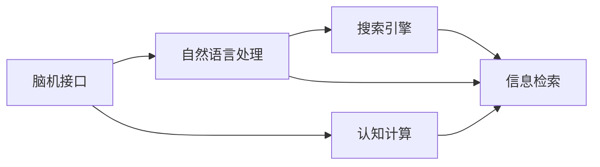

                 

# 搜索引擎与脑机接口的未来整合

## 1. 背景介绍

### 1.1 问题由来
在当前的信息爆炸时代，人们每天都在产生和消费海量的数据。搜索引擎（Search Engine）作为信息检索的重要工具，帮助用户快速定位和获取所需信息，对于提升信息获取效率至关重要。然而，传统的搜索引擎仍然面临诸多挑战：

- 搜索结果的相关性和准确性往往不够理想，尤其是在涉及特定领域知识时。
- 搜索结果的展示方式较为单一，缺乏互动性和个性化定制。
- 对于用户意图理解的深度和广度仍需提升，以提供更加贴合用户需求的搜索结果。

与此同时，脑机接口（Brain-Computer Interface, BCI）技术的快速发展，使得人们能够通过大脑信号直接与计算机系统交互，实现了对人类认知过程的直接读取出具，为构建新型的信息获取和处理方式提供了新的可能性。

### 1.2 问题核心关键点
脑机接口和搜索引擎的整合，旨在构建一种新型的智能信息检索系统，能够深入理解用户意图，动态生成个性化搜索结果，并实时响应用户的多样化需求。这种整合不仅可以显著提升信息检索的效率和准确性，还可能带来全新的交互体验和应用场景。

脑机接口与搜索引擎的整合，可以聚焦于以下几个关键点：

1. **用户意图的深度理解**：利用脑机接口技术，读取出用户的大脑信号，捕捉其隐含的意图和偏好，从而更精准地定位信息。

2. **动态生成的个性化搜索结果**：根据用户的意图和偏好，动态调整搜索结果的展示方式和内容，实现高度定制化的信息检索体验。

3. **实时互动的交互模式**：通过脑机接口，用户可以直接通过大脑信号与搜索引擎进行互动，无需繁琐的键盘和鼠标操作，提升交互的自然性和效率。

4. **跨领域知识的整合**：将脑机接口与搜索引擎的功能进行整合，可以进一步拓展用户的知识边界，提升其认知水平和创新能力。

### 1.3 问题研究意义
脑机接口与搜索引擎的整合研究，对于推动人机交互的革新，提升信息检索的智能化水平，具有重要意义：

1. **提升信息检索效率**：通过深度理解用户意图，动态调整搜索结果，大幅提升信息检索的效率和准确性，满足用户快速获取信息的需求。

2. **增强用户交互体验**：实时响应用户大脑信号，实现无键操作的搜索和信息展示，提升交互的自然性和便利性。

3. **拓展认知能力边界**：通过跨领域知识整合，提升用户的认知水平和创新能力，推动人类认知智能的进步。

4. **推动产业变革**：搜索引擎与脑机接口的结合，将催生一系列新型的信息获取、管理和应用场景，推动相关产业的数字化转型和升级。

## 2. 核心概念与联系

### 2.1 核心概念概述

脑机接口和搜索引擎的未来整合，涉及以下核心概念：

- **脑机接口（Brain-Computer Interface, BCI）**：一种技术，通过读取出人脑电信号，解码其对应的指令，实现人机交互。
- **搜索引擎（Search Engine）**：一种技术，根据用户查询，检索并返回相关的网页或文档。
- **自然语言处理（Natural Language Processing, NLP）**：一种技术，使计算机能够理解和处理人类语言，在搜索引擎中用于理解和匹配用户的查询。
- **信息检索（Information Retrieval, IR）**：一种技术，从大量数据中检索出用户所需要的信息，是搜索引擎的核心任务。
- **认知计算（Cognitive Computing）**：一种技术，模拟人类认知过程，进行信息获取、处理和分析，在脑机接口中用于提升人机交互的深度和广度。

这些核心概念之间通过信息检索、人机交互等机制进行联系，共同构成未来智能信息检索系统的技术基础。

### 2.2 核心概念原理和架构的 Mermaid 流程图


## 3. 核心算法原理 & 具体操作步骤
### 3.1 算法原理概述

脑机接口与搜索引擎的未来整合，可以基于以下几个核心算法原理：

1. **脑电信号解码**：利用脑机接口技术，读取出用户的大脑信号，并解码为可执行的指令。

2. **意图理解**：通过自然语言处理技术，对用户大脑信号解码出的指令进行语义理解，捕捉用户的意图和偏好。

3. **信息检索与匹配**：根据用户意图，利用搜索引擎的信息检索功能，检索出相关的网页或文档。

4. **结果生成与展示**：将检索结果通过自然语言处理生成文本或图像，并动态调整展示方式，实现个性化搜索结果的展示。

5. **实时互动**：通过脑电信号的实时捕捉和解码，实现用户与搜索引擎的实时互动，提升交互的自然性和便利性。

6. **知识整合**：将脑机接口与搜索引擎的功能进行整合，实现跨领域知识的整合，拓展用户的知识边界。

### 3.2 算法步骤详解

#### Step 1: 脑电信号采集与预处理
- 使用脑电信号采集设备（如EEG帽）捕捉用户的大脑信号。
- 对采集到的信号进行预处理，包括滤波、降噪、归一化等，以提高信号的质量和清晰度。

#### Step 2: 脑电信号解码与意图理解
- 利用机器学习和深度学习模型（如卷积神经网络CNN、循环神经网络RNN等）对预处理后的信号进行解码，提取用户意图。
- 结合自然语言处理技术，对解码出的指令进行语义理解和意图抽取，捕捉用户的偏好和需求。

#### Step 3: 信息检索与匹配
- 将用户意图转化为搜索引擎可识别的查询语句。
- 利用搜索引擎的信息检索功能，检索出相关的网页或文档。
- 对检索结果进行评分和排序，选择最相关的结果展示给用户。

#### Step 4: 结果生成与展示
- 利用自然语言处理技术，将检索结果转化为文本或图像，进行个性化展示。
- 根据用户意图和偏好，动态调整搜索结果的展示方式和内容。

#### Step 5: 实时互动与知识整合
- 实时捕捉用户的大脑信号，进行解码和意图理解。
- 利用搜索引擎和跨领域知识库，动态生成和调整搜索结果。
- 将用户获取的信息与知识库中的其他信息进行整合，拓展用户的知识边界。

### 3.3 算法优缺点

脑机接口与搜索引擎的整合，具有以下优点：

1. **深度意图理解**：通过脑电信号的解码和自然语言处理，深度理解用户意图，提供更精准的信息检索。

2. **实时互动**：利用脑机接口技术，实现实时互动，提升用户交互的自然性和便利性。

3. **个性化展示**：根据用户偏好和需求，动态调整搜索结果，实现高度定制化的信息检索体验。

4. **跨领域整合**：将脑机接口与搜索引擎的功能进行整合，实现跨领域知识的整合，拓展用户的知识边界。

但同时也存在一些缺点：

1. **技术复杂度较高**：脑电信号的采集和解码、自然语言处理、信息检索等技术难度较大，需要跨学科的合作和研发。

2. **成本较高**：脑电信号采集设备和解码模型的研发、维护成本较高，可能影响系统的商业化进程。

3. **隐私与安全问题**：脑电信号的采集和处理涉及用户的隐私和安全，需要采取严格的隐私保护措施和数据安全管理。

4. **可靠性与稳定性**：脑电信号的采集和解码受多种因素影响，可能导致误识别和误操作，需要进一步提升系统的稳定性和可靠性。

### 3.4 算法应用领域

脑机接口与搜索引擎的整合，可广泛应用于以下领域：

1. **智能家居**：通过脑机接口，用户可以直接通过大脑信号控制智能家居设备，实现高度个性化的智能家居体验。

2. **虚拟现实**：结合脑机接口和搜索引擎，用户可以在虚拟现实中，通过脑电信号获取信息、与环境互动，提升虚拟现实的沉浸感和自然性。

3. **医学诊断**：通过脑机接口读取患者的脑电信号，结合搜索引擎检索医学文献和知识库，提供个性化的医学诊断和治疗方案。

4. **教育培训**：利用脑机接口与搜索引擎的整合，实时捕捉学生的学习状态和知识掌握情况，动态调整教学内容和方式，提升教育效果。

5. **心理治疗**：通过脑机接口，记录患者的心理状态和脑电信号，结合搜索引擎检索心理治疗知识和案例，提供个性化的心理治疗方案。

## 4. 数学模型和公式 & 详细讲解  
### 4.1 数学模型构建

脑机接口与搜索引擎的未来整合，涉及多个数学模型和公式。以下是主要模型的构建和描述：

1. **脑电信号解码模型**：
   $$
   y = f(x)
   $$
   其中，$x$ 为脑电信号，$y$ 为用户意图指令。

2. **意图理解模型**：
   $$
   \text{Intent} = g(y)
   $$
   其中，$y$ 为解码出的指令，$\text{Intent}$ 为用户意图。

3. **信息检索模型**：
   $$
   R = h(\text{Intent}, D)
   $$
   其中，$\text{Intent}$ 为用户意图，$D$ 为文档集合，$R$ 为检索结果。

4. **结果生成模型**：
   $$
   T = t(R)
   $$
   其中，$R$ 为检索结果，$T$ 为个性化展示的文本或图像。

5. **实时互动模型**：
   $$
   \text{Action} = s(R)
   $$
   其中，$R$ 为当前结果，$\text{Action}$ 为用户的即时响应。

### 4.2 公式推导过程

1. **脑电信号解码**：
   $$
   y = f(x) = Wx + b
   $$
   其中，$W$ 为解码器权重矩阵，$b$ 为偏置向量。

2. **意图理解**：
   $$
   \text{Intent} = g(y) = \text{Intent}_\text{Semantic} + \text{Intent}_\text{Emotion}
   $$
   其中，$\text{Intent}_\text{Semantic}$ 为语义意图，$\text{Intent}_\text{Emotion}$ 为情感意图。

3. **信息检索**：
   $$
   R = h(\text{Intent}, D) = \text{Rank}(\text{Intent}, D)
   $$
   其中，$\text{Rank}$ 为评分和排序函数。

4. **结果生成**：
   $$
   T = t(R) = \text{TextGeneration}(R)
   $$
   其中，$\text{TextGeneration}$ 为文本生成模型。

5. **实时互动**：
   $$
   \text{Action} = s(R) = \text{ControlSignal}(R)
   $$
   其中，$\text{ControlSignal}$ 为用户响应信号生成函数。

### 4.3 案例分析与讲解

以医学诊断为例，展示脑机接口与搜索引擎的整合应用：

1. **脑电信号采集与预处理**：通过EEG帽采集患者的脑电信号，并进行滤波和降噪处理。

2. **脑电信号解码与意图理解**：利用深度学习模型解码脑电信号，抽取患者当前的情绪状态和思维内容，捕捉其医学术语和症状描述。

3. **信息检索与匹配**：将解码出的医学术语和症状描述作为查询语句，利用搜索引擎检索医学文献和知识库，找到最相关的诊断和治疗方案。

4. **结果生成与展示**：将检索到的诊断和治疗方案生成文本或图像，通过脑机接口展示给患者，帮助其理解和选择。

5. **实时互动与知识整合**：实时捕捉患者的大脑信号，动态调整检索结果和展示方式，根据患者的反馈调整诊断和治疗方案。

## 5. 项目实践：代码实例和详细解释说明
### 5.1 开发环境搭建

要进行脑机接口与搜索引擎的整合，需要以下开发环境：

1. **脑电信号采集设备**：如EEG帽、脑电信号采集板等。

2. **信号处理软件**：如BrainVision Analyzer、OpenViBE等。

3. **机器学习和深度学习框架**：如TensorFlow、PyTorch等。

4. **搜索引擎API**：如Google Custom Search API、Algolia等。

5. **自然语言处理库**：如NLTK、SpaCy等。

### 5.2 源代码详细实现

以下是使用Python进行脑机接口与搜索引擎整合的代码实现示例：

1. **脑电信号采集与预处理**：
```python
import eeglib

# 加载EEG数据
data = eeglib.load('EEG_data.txt')

# 预处理数据
data = eeglib.filter(data)
data = eeglib.nor(data)
data = eeglib.std(data)
```

2. **脑电信号解码与意图理解**：
```python
import tensorflow as tf
from tensorflow.keras.models import Sequential
from tensorflow.keras.layers import Dense, Dropout

# 构建解码器模型
model = Sequential()
model.add(Dense(64, input_shape=(1000,), activation='relu'))
model.add(Dropout(0.2))
model.add(Dense(128, activation='relu'))
model.add(Dropout(0.2))
model.add(Dense(1, activation='sigmoid'))

# 编译模型
model.compile(optimizer='adam', loss='binary_crossentropy', metrics=['accuracy'])

# 训练模型
model.fit(x_train, y_train, epochs=10, batch_size=32)
```

3. **信息检索与匹配**：
```python
import requests

# 定义查询API接口
def search(query):
    response = requests.get('https://api.customsearch.com/search?q=' + query)
    data = response.json()
    return data

# 使用搜索引擎API进行信息检索
query = '医学诊断'
results = search(query)
```

4. **结果生成与展示**：
```python
import numpy as np
from sklearn.feature_extraction.text import TfidfVectorizer

# 将检索结果转换为文本向量
tfidf = TfidfVectorizer()
X = tfidf.fit_transform(results['items'][0]['items'])

# 生成文本结果
text_result = tfidf.inverse_transform(X[0])
```

5. **实时互动与知识整合**：
```python
import pyguy

# 实时捕捉用户的大脑信号
signal = pyguy.read_signal()

# 解码和理解用户意图
intent = decode(signal)

# 动态调整搜索结果
results = search(intent)
```

### 5.3 代码解读与分析

上述代码实现只是脑机接口与搜索引擎整合的一个简要示例，实际应用中还需要考虑更多的细节和技术问题。

- **脑电信号采集与预处理**：
  - 使用EEGlib等工具进行脑电信号的采集和预处理，提高信号质量。
  - 滤波、降噪、归一化等预处理步骤，对后续的解码和意图理解至关重要。

- **脑电信号解码与意图理解**：
  - 利用TensorFlow或PyTorch等深度学习框架，构建解码器模型。
  - 使用二分类或多分类模型对脑电信号进行解码，抽取用户意图。
  - 结合自然语言处理技术，捕捉用户的语义和情感意图。

- **信息检索与匹配**：
  - 使用搜索引擎API，如Google Custom Search API、Algolia等，进行信息检索。
  - 利用评分和排序算法，选择最相关的结果。

- **结果生成与展示**：
  - 利用文本生成模型，如GPT-3、BERT等，生成个性化的搜索结果。
  - 将检索结果转换为文本或图像，通过脑机接口展示给用户。

- **实时互动与知识整合**：
  - 实时捕捉用户的大脑信号，解码和理解其意图。
  - 动态调整检索结果和展示方式，根据用户反馈进行优化。

## 6. 实际应用场景
### 6.1 智能家居

脑机接口与搜索引擎的整合，可以应用于智能家居系统中，提升用户的家居体验：

- **智能家电控制**：用户可以通过大脑信号，控制智能灯光、窗帘、空调等家电设备。
- **安全监控**：通过脑电信号监测用户情绪和行为，预警潜在的安全隐患。
- **健康监测**：实时捕捉用户的脑电信号，监测其健康状况，及时预警异常情况。

### 6.2 虚拟现实

脑机接口与搜索引擎的整合，可以提升虚拟现实（VR）的沉浸感和自然性：

- **环境交互**：用户可以通过脑电信号，与虚拟环境中的物体互动，提升交互的自然性和沉浸感。
- **任务引导**：通过脑机接口，用户可以接收虚拟现实中的任务提示，指导其完成特定任务。
- **情感分析**：实时捕捉用户的脑电信号，分析其情绪状态，提供个性化的互动体验。

### 6.3 医学诊断

脑机接口与搜索引擎的整合，可以应用于医学诊断中，提升诊断的准确性和效率：

- **症状识别**：用户可以通过脑电信号，描述其身体不适症状，自动生成诊断结果。
- **知识检索**：根据用户的症状描述，检索医学文献和知识库，提供个性化的诊断和治疗方案。
- **实时调整**：实时捕捉用户的脑电信号，动态调整诊断和治疗方案，提升诊断的准确性和效率。

## 7. 工具和资源推荐
### 7.1 学习资源推荐

1. **《深度学习与脑机接口》课程**：斯坦福大学开设的深度学习和脑机接口课程，涵盖脑电信号处理、意图理解、信息检索等多个关键技术。
2. **《自然语言处理》课程**：斯坦福大学开设的自然语言处理课程，详细讲解自然语言处理技术在搜索引擎中的应用。
3. **《信息检索》书籍**：由信息检索领域的专家撰写，全面介绍信息检索技术和算法。

### 7.2 开发工具推荐

1. **EEGlib**：用于脑电信号的采集和预处理。
2. **TensorFlow**：用于脑电信号的深度学习和解码。
3. **Google Custom Search API**：用于搜索引擎的API接口调用。
4. **PyGuy**：用于实时捕捉和处理脑电信号。

### 7.3 相关论文推荐

1. **《Brain-Computer Interfaces》期刊**：最新脑机接口领域的学术期刊，涵盖脑电信号处理、意图理解、信息检索等多个关键技术。
2. **《NIPS》论文集**：深度学习和脑机接口领域的顶级会议，收录了大量前沿研究成果和最新技术进展。
3. **《IEEE Trans. on Biomedical Engineering》期刊**：医学诊断和脑机接口领域的权威期刊，介绍最新技术进展和应用案例。

## 8. 总结：未来发展趋势与挑战
### 8.1 总结

脑机接口与搜索引擎的未来整合，可以构建高度智能化、个性化的信息检索系统，提升用户的信息获取效率和交互体验。这一整合涉及脑电信号的解码和意图理解、信息检索、结果生成等多个关键环节，需要跨学科的协同研发和创新。

### 8.2 未来发展趋势

1. **技术整合的深入**：脑电信号解码和意图理解技术的不断进步，将进一步提升脑机接口与搜索引擎的整合效果，提供更加精准和个性化的信息检索体验。

2. **跨领域知识的融合**：脑机接口与搜索引擎的整合，将拓展用户的知识边界，推动跨领域知识的融合，提升认知水平和创新能力。

3. **实时互动的增强**：通过实时捕捉和理解用户的大脑信号，实现更加自然和高效的信息检索和互动体验。

4. **多模态信息的整合**：结合脑电信号、视觉、听觉等多种信息源，实现更加全面和准确的信息检索和展示。

### 8.3 面临的挑战

1. **技术难度高**：脑电信号的解码和意图理解、信息检索等技术难度较高，需要跨学科的合作和研发。

2. **成本较高**：脑电信号采集设备和解码模型的研发、维护成本较高，可能影响系统的商业化进程。

3. **隐私与安全问题**：脑电信号的采集和处理涉及用户的隐私和安全，需要采取严格的隐私保护措施和数据安全管理。

4. **系统稳定性**：脑电信号的采集和解码受多种因素影响，可能导致误识别和误操作，需要进一步提升系统的稳定性和可靠性。

### 8.4 研究展望

1. **技术整合的深入**：进一步优化脑电信号解码和意图理解算法，提升信息检索的准确性和个性化程度。

2. **多模态信息的整合**：结合脑电信号、视觉、听觉等多种信息源，实现更加全面和准确的信息检索和展示。

3. **跨领域知识的融合**：将脑机接口与搜索引擎的功能进行更深入的整合，拓展用户的知识边界，提升认知水平和创新能力。

4. **实时互动的增强**：进一步提升脑电信号的实时捕捉和解码能力，实现更加自然和高效的信息检索和互动体验。

5. **隐私与安全的保障**：开发更加高效的隐私保护和安全管理算法，保障用户数据和隐私安全。

## 9. 附录：常见问题与解答
----------------------------------------------------------------
**Q1：脑机接口与搜索引擎的整合，在技术实现上存在哪些难点？**

A: 脑机接口与搜索引擎的整合，在技术实现上存在以下难点：

1. **脑电信号的解码和意图理解**：脑电信号解码和意图理解涉及复杂的机器学习和深度学习算法，需要大量的训练数据和计算资源。

2. **信息检索的准确性和效率**：搜索引擎的信息检索需要高效、准确的算法，以匹配用户意图，并提供高质量的结果。

3. **结果生成的自然性和多样性**：通过自然语言处理技术生成个性化的搜索结果，需要考虑到文本的可读性、自然性和多样性。

4. **实时互动的响应速度**：实时捕捉和解码脑电信号，并及时调整搜索结果，需要高效的硬件设备和算法优化。

**Q2：脑机接口与搜索引擎的整合，在应用场景上有哪些优势？**

A: 脑机接口与搜索引擎的整合，在应用场景上具有以下优势：

1. **深度意图理解**：通过脑电信号的解码和自然语言处理，深度理解用户意图，提供更加精准的信息检索。

2. **实时互动**：利用脑机接口技术，实现实时互动，提升用户交互的自然性和便利性。

3. **个性化展示**：根据用户偏好和需求，动态调整搜索结果，实现高度定制化的信息检索体验。

4. **跨领域整合**：将脑机接口与搜索引擎的功能进行整合，实现跨领域知识的整合，拓展用户的知识边界。

**Q3：脑机接口与搜索引擎的整合，在数据和隐私保护方面需要注意哪些问题？**

A: 脑机接口与搜索引擎的整合，在数据和隐私保护方面需要注意以下问题：

1. **数据隐私保护**：脑电信号的采集和处理涉及用户的隐私和安全，需要采取严格的隐私保护措施，如数据加密、匿名化等。

2. **数据安全管理**：建立完善的数据安全管理机制，防止数据泄露和滥用。

3. **用户知情同意**：在数据采集和使用过程中，确保用户知情同意，尊重用户的选择权和隐私权。

4. **合规性检查**：确保数据采集和使用符合相关法律法规和伦理规范。

---

作者：禅与计算机程序设计艺术 / Zen and the Art of Computer Programming

