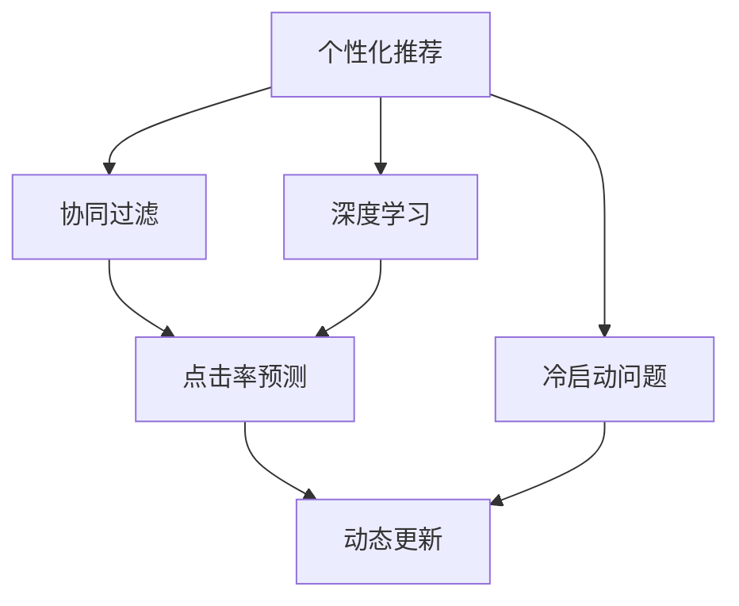

                 

# 搜索引擎的个性化推荐算法

> 关键词：搜索引擎,个性化推荐,协同过滤,深度学习,自然语言处理,点击率预测,冷启动问题,动态更新

## 1. 背景介绍

### 1.1 问题由来
搜索引擎已成为互联网时代人们获取信息的重要工具。传统的基于关键词检索的搜索引擎，其结果的个性化程度和相关性往往较低，用户体验有待提升。个性化推荐技术通过分析用户的行为和偏好，为用户提供更加符合其需求的搜索结果，从而大幅改善搜索引擎的用户体验。

### 1.2 问题核心关键点
当前个性化推荐技术主要基于以下几个关键点：
- 用户行为分析：通过分析用户的点击、浏览、搜索等行为数据，了解其兴趣和偏好。
- 协同过滤：利用相似用户或相似物品的互动数据，推断用户对新物品的评分或推荐。
- 深度学习：采用神经网络模型，从大量用户数据中挖掘特征，提升推荐效果。
- 自然语言处理：通过分析用户查询和网页摘要等文本信息，提升推荐的相关性。
- 点击率预测：预测用户对搜索结果的点击概率，指导排名算法。
- 冷启动问题：新用户的推荐难以进行，需要通过其他用户数据或用户行为推测来缓解。
- 动态更新：实时更新推荐结果，反映用户行为的变化。

### 1.3 问题研究意义
个性化推荐技术显著提升了搜索结果的相关性和用户满意度，对搜索引擎的商业价值也产生了深远影响。

- **用户体验优化**：个性化的搜索结果能更符合用户需求，提升搜索体验。
- **点击率提升**：通过推荐精准的搜索结果，提升用户点击率，增加用户停留时间。
- **数据利用率提高**：合理分配搜索结果，使海量数据被充分利用。
- **商业化转型**：通过精准广告推荐，增加商业广告收入。
- **搜索引擎竞争力**：个性化推荐成为搜索引擎区分化竞争的核心优势。

## 2. 核心概念与联系

### 2.1 核心概念概述

为了更好地理解搜索引擎个性化推荐算法，本节将介绍几个密切相关的核心概念：

- **个性化推荐**：根据用户的历史行为和特征，推荐其可能感兴趣的商品、服务或信息。
- **协同过滤**：通过分析用户与用户、物品与物品的互动数据，推断用户对新物品的评分或推荐。
- **深度学习**：利用神经网络模型，从大规模用户数据中挖掘特征，实现更加精准的推荐。
- **点击率预测**：预测用户对搜索结果的点击概率，指导排名算法，提升推荐效果。
- **冷启动问题**：新用户的推荐难以进行，需要通过其他用户数据或行为推测来缓解。
- **动态更新**：实时更新推荐结果，反映用户行为的变化。

这些概念之间存在紧密联系，协同过滤和深度学习是实现个性化推荐的重要手段，点击率预测则用于优化推荐结果，冷启动问题需通过数据和算法解决，动态更新则保证推荐的及时性。

### 2.2 核心概念原理和架构的 Mermaid 流程图



这个流程图展示了个性化推荐的主要流程和关键组件：

1. **个性化推荐**：从协同过滤和深度学习中获取用户兴趣特征。
2. **协同过滤**：基于用户-物品互动数据，推荐相似物品。
3. **深度学习**：利用用户行为数据，提取高阶特征。
4. **点击率预测**：基于模型输出，预测用户点击概率。
5. **冷启动问题**：通过用户行为推测或相似用户推荐，解决新用户推荐难题。
6. **动态更新**：实时更新推荐结果，保持最新性。

## 3. 核心算法原理 & 具体操作步骤
### 3.1 算法原理概述

搜索引擎个性化推荐算法的主要原理包括：

- **协同过滤**：利用用户-物品交互矩阵，推断用户对新物品的评分或推荐。
- **深度学习**：采用神经网络模型，从大规模用户数据中挖掘高阶特征，提升推荐效果。
- **点击率预测**：基于用户-物品互动数据，预测用户对搜索结果的点击概率，指导排名算法。

协同过滤和深度学习是目前常用的两种推荐算法，分别适用于不同场景。协同过滤适合数据量较少的场景，但可能面临稀疏性问题；深度学习则适合数据量大的场景，但计算成本较高。

### 3.2 算法步骤详解

以下是基于协同过滤和深度学习的主要推荐算法步骤：

**Step 1: 数据预处理**
- 收集用户历史行为数据，如浏览记录、点击记录、评分记录等。
- 收集物品特征数据，如商品描述、标签等。
- 将用户和物品数据进行整合，构建用户-物品交互矩阵。

**Step 2: 协同过滤推荐**
- 计算用户和物品的相似度，如余弦相似度、皮尔逊相关系数等。
- 根据相似度，推荐用户未交互过的物品。

**Step 3: 深度学习模型训练**
- 设计深度神经网络模型，如协同过滤网络(CRF)、深度协同过滤(DeepCF)等。
- 训练模型，优化损失函数。

**Step 4: 点击率预测**
- 基于用户和物品的特征，构建点击率预测模型。
- 利用点击率预测结果，优化排序算法。

**Step 5: 推荐排序**
- 结合协同过滤和深度学习的结果，进行综合排序。
- 返回排序后的推荐结果。

**Step 6: 实时更新**
- 实时接收用户行为数据，更新用户-物品交互矩阵。
- 根据新数据，重新计算推荐结果。

### 3.3 算法优缺点

基于协同过滤和深度学习的个性化推荐算法具有以下优点：

1. **准确性高**：能够充分挖掘用户行为特征，提升推荐精度。
2. **可解释性强**：推荐结果易于理解，便于用户接受。
3. **适应性强**：能够快速适应新的数据和用户行为变化。

但这些算法也存在一些缺点：

1. **计算成本高**：深度学习模型训练和推理计算量较大。
2. **稀疏性问题**：协同过滤算法面临数据稀疏性，难以处理新物品或新用户。
3. **冷启动问题**：新用户的推荐难以进行，需要通过其他用户数据或行为推测来缓解。

## 4. 数学模型和公式 & 详细讲解 & 举例说明
### 4.1 数学模型构建

推荐系统的数学模型通常由以下几部分构成：

- **用户行为数据**：表示为 $(x_u, y_u)$，其中 $x_u$ 为特征向量，$y_u$ 为评分或点击等标签。
- **物品特征数据**：表示为 $(x_i, y_i)$，其中 $x_i$ 为特征向量，$y_i$ 为标签。
- **用户-物品交互矩阵**：表示为 $R \in \mathbb{R}^{N \times M}$，其中 $R_{u,i}$ 为第 $u$ 个用户对第 $i$ 个物品的评分或点击概率。
- **模型参数**：表示为 $\theta$，用于训练深度学习模型。

### 4.2 公式推导过程

以下以基于协同过滤的推荐算法为例，推导推荐公式：

假设用户-物品交互矩阵为 $R$，用户 $u$ 对物品 $i$ 的评分表示为 $r_{u,i}$。协同过滤的推荐公式为：

$$
\hat{r}_{u,i} = \sum_{v \in \mathcal{N}(u)} \alpha_{u,v} \times r_{v,i}
$$

其中 $\mathcal{N}(u)$ 表示与用户 $u$ 交互过的物品集合，$\alpha_{u,v}$ 为相似度系数，通常使用余弦相似度：

$$
\alpha_{u,v} = \frac{\vec{x}_u \cdot \vec{x}_v}{\|\vec{x}_u\| \times \|\vec{x}_v\|}
$$

**Step 1: 计算相似度**
- 计算用户 $u$ 和物品 $i$ 的相似度 $\alpha_{u,i}$。

**Step 2: 计算推荐分数**
- 计算用户 $u$ 对物品 $i$ 的推荐分数 $\hat{r}_{u,i}$。

**Step 3: 推荐物品**
- 根据推荐分数，推荐物品 $i$ 给用户 $u$。

### 4.3 案例分析与讲解

以Amazon商品推荐系统为例，分析其协同过滤和深度学习结合的推荐过程：

**Step 1: 数据预处理**
- 收集用户的浏览、点击、评分数据。
- 收集商品的属性、标签数据。
- 构建用户-商品交互矩阵 $R$。

**Step 2: 协同过滤推荐**
- 计算用户和商品的相似度。
- 根据相似度，推荐用户未交互过的商品。

**Step 3: 深度学习模型训练**
- 构建深度协同过滤模型，如协同过滤网络(CRF)。
- 训练模型，优化损失函数。

**Step 4: 点击率预测**
- 构建点击率预测模型，如线性回归、神经网络等。
- 利用点击率预测结果，优化排序算法。

**Step 5: 推荐排序**
- 结合协同过滤和深度学习的结果，进行综合排序。
- 返回排序后的推荐结果。

## 5. 项目实践：代码实例和详细解释说明
### 5.1 开发环境搭建

在进行推荐系统开发前，我们需要准备好开发环境。以下是使用Python进行TensorFlow和Keras开发的环境配置流程：

1. 安装Anaconda：从官网下载并安装Anaconda，用于创建独立的Python环境。

2. 创建并激活虚拟环境：
```bash
conda create -n tf-env python=3.7 
conda activate tf-env
```

3. 安装TensorFlow：根据CUDA版本，从官网获取对应的安装命令。例如：
```bash
conda install tensorflow -c pytorch -c conda-forge
```

4. 安装Keras：
```bash
pip install keras
```

5. 安装各类工具包：
```bash
pip install numpy pandas scikit-learn matplotlib tqdm jupyter notebook ipython
```

完成上述步骤后，即可在`tf-env`环境中开始推荐系统开发。

### 5.2 源代码详细实现

下面我们以基于协同过滤的推荐系统为例，给出使用TensorFlow和Keras进行代码实现。

```python
import tensorflow as tf
from tensorflow.keras.layers import Input, Dense, Embedding, Dot, Flatten, RepeatVector
from tensorflow.keras.models import Model

# 定义输入层
user_input = Input(shape=(1,))
item_input = Input(shape=(1,))

# 定义用户和物品的嵌入层
user_embedding = Embedding(input_dim=1000, output_dim=64)(user_input)
item_embedding = Embedding(input_dim=1000, output_dim=64)(item_input)

# 定义相似度计算层
similarity = Dot(axes=1)([user_embedding, item_embedding])

# 定义用户和物品的特征层
user_features = Flatten()(similarity)
item_features = Flatten()(similarity)

# 定义深度协同过滤网络
deepcf_model = tf.keras.Sequential([
    RepeatVector(1),
    Dense(64, activation='relu'),
    Dense(1)
])

# 定义点击率预测模型
rating_model = tf.keras.Sequential([
    Flatten()(similarity),
    Dense(64, activation='relu'),
    Dense(1, activation='sigmoid')
])

# 定义推荐模型
recommendation_model = tf.keras.Sequential([
    Dot(axes=1)([user_features, item_features]),
    Flatten()(similarity),
    deepcf_model,
    rating_model
])

# 编译模型
recommendation_model.compile(optimizer='adam', loss='binary_crossentropy')

# 训练模型
recommendation_model.fit(x_train, y_train, epochs=10, batch_size=64)
```

以上代码展示了协同过滤与深度学习结合的推荐系统的主要实现流程。通过使用TensorFlow和Keras，开发者可以方便地构建和训练深度学习模型，实现个性化的商品推荐。

### 5.3 代码解读与分析

让我们再详细解读一下关键代码的实现细节：

**TensorFlow和Keras库**：
- TensorFlow：Google开源的深度学习框架，支持分布式计算和GPU加速。
- Keras：基于TensorFlow等框架的高级神经网络API，提供简洁易用的接口，适合快速原型开发和实验。

**定义输入层**：
- 使用Keras的`Input`层定义用户和物品的输入。

**定义嵌入层**：
- 使用Keras的`Embedding`层，将用户和物品的ID映射为低维向量表示。

**定义相似度计算层**：
- 使用Keras的`Dot`层，计算用户和物品的相似度。

**定义用户和物品的特征层**：
- 使用Keras的`Flatten`层，将相似度向量扁平化，方便后续的神经网络处理。

**定义深度协同过滤网络**：
- 使用Keras的`Sequential`模型，构建深度协同过滤网络。

**定义点击率预测模型**：
- 使用Keras的`Sequential`模型，构建点击率预测模型。

**定义推荐模型**：
- 将用户和物品的特征向量拼接，并输入到深度协同过滤网络和点击率预测模型中，最终输出推荐分数。

**编译和训练模型**：
- 使用Keras的`compile`方法，编译推荐模型，设置优化器和损失函数。
- 使用`fit`方法，训练推荐模型，指定训练数据和参数设置。

可以看到，TensorFlow和Keras的API设计简洁高效，极大地方便了深度学习模型的开发和调试。

## 6. 实际应用场景
### 6.1 电商平台个性化推荐

基于协同过滤和深度学习的推荐系统，广泛应用于电商平台的商品推荐中。通过分析用户的浏览、点击、评分数据，推荐用户可能感兴趣的商品，提升用户的购物体验和转化率。

**实际应用流程**：
- 收集用户的行为数据和商品的属性标签数据。
- 使用协同过滤算法，计算用户和商品的相似度。
- 结合深度学习模型，训练点击率预测模型。
- 根据用户行为数据，实时更新推荐模型。
- 返回推荐结果给用户。

**效果**：
- 显著提升用户的点击率和转化率。
- 提高用户满意度和平台留存率。
- 增加平台的销售额和用户粘性。

### 6.2 在线视频推荐

在线视频推荐系统通过分析用户的观看行为数据，推荐用户可能感兴趣的视频，提升用户的观看体验和平台用户粘性。

**实际应用流程**：
- 收集用户的观看记录和视频属性数据。
- 使用协同过滤算法，计算用户和视频的相似度。
- 结合深度学习模型，训练点击率预测模型。
- 根据用户观看行为数据，实时更新推荐模型。
- 返回推荐结果给用户。

**效果**：
- 提升用户的观看时长和平台留存率。
- 增加平台的广告收入和用户粘性。
- 优化视频推荐结果，提高用户体验。

### 6.3 新闻资讯推荐

新闻资讯推荐系统通过分析用户的阅读记录和行为数据，推荐用户可能感兴趣的新闻，提升用户的阅读体验和平台留存率。

**实际应用流程**：
- 收集用户的阅读记录和新闻文章属性数据。
- 使用协同过滤算法，计算用户和新闻文章的相似度。
- 结合深度学习模型，训练点击率预测模型。
- 根据用户阅读行为数据，实时更新推荐模型。
- 返回推荐结果给用户。

**效果**：
- 提升用户的阅读时长和平台留存率。
- 优化新闻推荐结果，提高用户体验。
- 增加平台的广告收入和用户粘性。

## 7. 工具和资源推荐
### 7.1 学习资源推荐

为了帮助开发者系统掌握推荐系统的理论基础和实践技巧，这里推荐一些优质的学习资源：

1. 《深度学习推荐系统》系列博文：由深度学习专家撰写，深入浅出地介绍了推荐系统的基本概念和前沿技术。

2. CS345N《大规模推荐系统》课程：斯坦福大学开设的推荐系统课程，有Lecture视频和配套作业，带你入门推荐系统领域的基本概念和经典模型。

3. 《Recommender Systems: The Textbook》书籍：全面介绍了推荐系统的理论基础和实际应用，是推荐系统学习的必备资料。

4. KDD Cup 2019竞赛数据集：推荐系统领域的经典竞赛数据集，包括协同过滤和深度学习模型的多种实现方案，适合竞赛和项目实践。

5. MLLab推荐系统开源项目：由微软开源的推荐系统框架，提供了丰富的推荐模型和算法实现，适合研究和工程实践。

通过对这些资源的学习实践，相信你一定能够快速掌握推荐系统的精髓，并用于解决实际的推荐问题。

### 7.2 开发工具推荐

高效的开发离不开优秀的工具支持。以下是几款用于推荐系统开发的常用工具：

1. TensorFlow：Google主导开发的深度学习框架，支持分布式计算和GPU加速，适合大规模推荐系统开发。

2. Keras：基于TensorFlow等框架的高级神经网络API，提供简洁易用的接口，适合快速原型开发和实验。

3. PyTorch：Facebook开发的深度学习框架，支持动态计算图，适合快速迭代研究和实验。

4. Weights & Biases：模型训练的实验跟踪工具，可以记录和可视化模型训练过程中的各项指标，方便对比和调优。

5. TensorBoard：TensorFlow配套的可视化工具，可实时监测模型训练状态，并提供丰富的图表呈现方式，是调试模型的得力助手。

合理利用这些工具，可以显著提升推荐系统的开发效率，加快创新迭代的步伐。

### 7.3 相关论文推荐

推荐系统的研究源于学界的持续研究。以下是几篇奠基性的相关论文，推荐阅读：

1. Collaborative Filtering for Recommender Systems：提出了协同过滤的基本思想，展示了协同过滤在推荐系统中的应用。

2. Neural Collaborative Filtering（即DeepCF）：提出深度协同过滤网络，通过神经网络学习用户和物品的隐式特征，提升推荐效果。

3. Learning Deep Architectures for Collaborative Filtering：提出了深度神经网络在协同过滤中的应用，通过多层次的非线性映射，提升推荐精度。

4. Adaptive Item Ranking for Recommendation Using Deep Neural Networks：提出自适应物品排名方法，通过神经网络自适应地调整推荐结果。

5. BPR-Max：提出BPR-Max损失函数，用于协同过滤模型的训练，提升推荐效果。

这些论文代表推荐系统的发展脉络。通过学习这些前沿成果，可以帮助研究者把握学科前进方向，激发更多的创新灵感。

## 8. 总结：未来发展趋势与挑战
### 8.1 总结

本文对搜索引擎个性化推荐算法进行了全面系统的介绍。首先阐述了推荐系统的研究背景和意义，明确了协同过滤和深度学习在推荐系统中的应用。其次，从原理到实践，详细讲解了推荐算法的数学模型和具体步骤，给出了推荐系统开发的完整代码实例。同时，本文还广泛探讨了推荐系统在电商、视频、新闻等领域的应用前景，展示了推荐系统技术的广阔前景。最后，精选了推荐系统的学习资源、开发工具和相关论文，力求为读者提供全方位的技术指引。

通过本文的系统梳理，可以看到，个性化推荐技术已经成为搜索引擎不可或缺的重要组件，显著提升了搜索结果的相关性和用户满意度。未来，伴随推荐算法的不断演进，个性化推荐系统必将更加智能、高效，为用户的搜索体验带来更深远的改变。

### 8.2 未来发展趋势

展望未来，推荐系统的研究将呈现以下几个发展趋势：

1. **个性化增强**：推荐系统将更加个性化，根据用户的实时行为数据，动态调整推荐结果。

2. **跨领域融合**：推荐系统将与其他领域的技术进行融合，如知识图谱、自然语言处理等，提升推荐效果。

3. **多模态推荐**：推荐系统将融合视觉、语音等多模态数据，提升推荐的相关性和鲁棒性。

4. **社交推荐**：推荐系统将利用社交网络数据，通过社交关系优化推荐结果。

5. **实时推荐**：推荐系统将实时更新推荐结果，反映用户行为的变化。

6. **隐私保护**：推荐系统将更加注重用户隐私保护，通过差分隐私等技术，确保数据安全。

这些趋势凸显了推荐系统的广阔前景，未来推荐系统将更加智能、全面、可控，为用户提供更加精准、个性化的推荐服务。

### 8.3 面临的挑战

尽管推荐系统已经取得了显著成效，但在迈向更加智能化、普适化应用的过程中，它仍面临诸多挑战：

1. **冷启动问题**：新用户的推荐难以进行，需要通过其他用户数据或行为推测来缓解。

2. **数据质量**：推荐系统的性能高度依赖数据质量，低质量数据会导致推荐效果下降。

3. **计算成本**：深度学习模型训练和推理计算量较大，对硬件资源要求较高。

4. **隐私保护**：推荐系统需要处理大量用户数据，如何保护用户隐私成为重要问题。

5. **公平性**：推荐系统需要避免推荐偏差，确保推荐结果的公平性和公正性。

6. **稳定性**：推荐系统需要保持稳定，避免频繁更新导致系统不稳定。

这些挑战需要通过更高效的数据处理、更先进的算法设计和更完善的隐私保护措施来解决。

### 8.4 研究展望

面对推荐系统面临的这些挑战，未来的研究需要在以下几个方面寻求新的突破：

1. **推荐模型优化**：开发更高效、更准确、更可解释的推荐模型。

2. **数据处理技术**：探索高效的数据处理和清洗技术，提升数据质量。

3. **分布式计算**：利用分布式计算技术，优化推荐系统的计算效率。

4. **隐私保护技术**：研究隐私保护技术，如差分隐私、联邦学习等，保护用户隐私。

5. **公平推荐算法**：开发公平推荐算法，确保推荐结果的公正性和可解释性。

6. **实时推荐系统**：研究实时推荐系统，及时更新推荐结果，提升用户体验。

这些研究方向将推动推荐系统迈向更高的台阶，为构建智能推荐系统铺平道路。相信随着技术的不断进步，推荐系统必将成为搜索引擎、电商、视频等领域的重要技术支撑，带来更深刻的用户体验和商业价值。

## 9. 附录：常见问题与解答

**Q1：推荐系统如何处理冷启动问题？**

A: 推荐系统可以通过以下几种方式处理冷启动问题：
1. 基于内容推荐：通过分析物品的属性和标签，推荐与用户兴趣相关的物品。
2. 基于用户特征推荐：通过分析用户的历史行为和特征，推荐与用户兴趣相关的物品。
3. 基于相似用户推荐：通过分析与用户相似的其他用户的行为，推荐相似用户喜欢的物品。
4. 利用协同过滤和深度学习：通过用户-物品互动数据，推荐用户未交互过的物品。

这些方法往往需要根据具体场景进行选择和组合。在实际应用中，可以多种方法结合，最大化解决冷启动问题。

**Q2：推荐系统如何平衡个性化推荐和多样性？**

A: 推荐系统可以通过以下几种方式平衡个性化推荐和多样性：
1. 增加多样性因子：在推荐算法中加入多样性因子，确保推荐结果的多样性。
2. 控制推荐数量：限制推荐结果的数量，保证用户能看到多样化的推荐。
3. 引入推荐机制：通过人工干预和推荐机制，控制推荐结果的个性化和多样性。

这些方法需要根据具体场景和用户需求进行调整，以实现最佳的推荐效果。

**Q3：推荐系统如何进行实时推荐？**

A: 推荐系统可以通过以下几种方式进行实时推荐：
1. 缓存推荐结果：将推荐结果缓存到内存或数据库中，实时查询获取。
2. 分布式计算：利用分布式计算框架，实时计算推荐结果。
3. 异步更新：使用异步计算和数据流技术，实时更新推荐模型和结果。

这些方法需要根据具体应用场景进行优化，以确保实时推荐的准确性和稳定性。

---

作者：禅与计算机程序设计艺术 / Zen and the Art of Computer Programming

