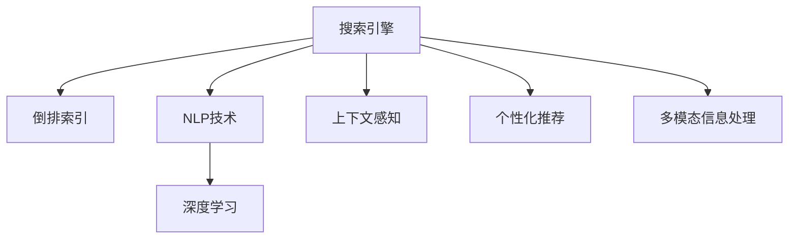

                 

# 搜索引擎的情境感知能力提升

## 1. 背景介绍

搜索引擎作为互联网时代信息检索的核心工具，其核心的能力在于为用户快速提供相关信息。传统的搜索引擎多基于文本的倒排索引，主要关注关键词的匹配和排序。然而，随着信息爆炸和用户需求的日益个性化，搜索引擎在理解和响应用户情境方面显得越来越力不从心。

### 1.1 问题由来

搜索引擎面临的主要挑战包括：

- 大规模非结构化数据的处理。现代互联网数据以非结构化文本为主，搜索引擎需要将这些文本转化为结构化信息进行搜索索引。
- 长尾查询的响应。用户查询意图多样且碎片化，搜索引擎需要识别和理解这些查询，快速返回满足用户需求的答案。
- 多模态数据的整合。用户不仅关注文本信息，还结合图片、视频、语音等多种信息进行搜索，搜索引擎需要具备处理多模态数据的能力。
- 上下文理解。用户查询常依赖上下文，搜索引擎需要理解查询背后的语境，以提供更精准的搜索结果。
- 个性化推荐。用户需求日益个性化，搜索引擎需要根据用户的历史行为和偏好，提供个性化的搜索结果和推荐。

面对这些挑战，搜索引擎的情境感知能力提升成为迫切需求。情境感知能力指搜索引擎能够理解用户查询背后的上下文，并根据上下文信息提供最符合用户意图的搜索结果。这要求搜索引擎具备对用户行为、语境、偏好等信息的动态感知和理解，从而进行智能检索和推荐。

## 2. 核心概念与联系

### 2.1 核心概念概述

为更好地理解搜索引擎的情境感知能力提升，本节将介绍几个密切相关的核心概念：

- **搜索引擎**：搜索引擎是一种用于帮助用户快速找到所需信息的工具，通过算法对用户查询进行索引和匹配，返回相关网页或内容。
- **倒排索引**：搜索引擎的核心技术，将文本转化为单词和词频等信息，存储在索引中，便于快速检索。
- **自然语言处理(NLP)**：涉及语言模型的构建、语义理解、语音识别、图像识别等多种技术，用于处理文本、图像、语音等多种信息。
- **深度学习**：基于神经网络的机器学习方法，能够自动学习数据特征，用于提升自然语言处理的精度和泛化能力。
- **上下文感知**：指模型能够理解查询中的上下文信息，如时间、地点、人物等，提供更符合用户意图的搜索结果。
- **个性化推荐**：根据用户历史行为和偏好，推荐符合用户需求的搜索结果。
- **多模态信息处理**：涉及文本、图像、语音等多种信息源的整合和理解，提升搜索引擎的多模态能力。

这些核心概念之间的逻辑关系可以通过以下Mermaid流程图来展示：



这个流程图展示了一些核心概念的关联性：

1. 搜索引擎通过倒排索引和NLP技术，对用户查询进行理解。
2. 深度学习提升NLP技术的精度和泛化能力，使模型更好地理解文本和语义。
3. 上下文感知提升查询理解的准确性，提供更符合用户意图的搜索结果。
4. 个性化推荐基于用户行为和偏好，提供更符合用户需求的搜索结果。
5. 多模态信息处理提升搜索引擎处理多种信息的能力，满足用户多模态搜索需求。

这些概念共同构成了搜索引擎的情境感知能力提升的框架，使搜索引擎能够更准确地响应用户查询，提供更个性化、更高效的信息检索服务。

## 3. 核心算法原理 & 具体操作步骤

### 3.1 算法原理概述

提升搜索引擎的情境感知能力，本质上是一个自然语言处理和深度学习的问题。搜索引擎通过引入上下文感知和个性化推荐技术，提升对用户查询的理解和响应。以下概述基于深度学习的方法，具体实现细节将在后续详细讲解。

搜索引擎的情境感知能力提升主要包括以下几个关键步骤：

1. 构建上下文感知模型，理解查询的语境信息。
2. 设计个性化推荐算法，根据用户行为和偏好推荐相关搜索结果。
3. 将上下文感知和个性化推荐技术与搜索引擎核心算法结合，提供更智能的搜索体验。

### 3.2 算法步骤详解

**Step 1: 构建上下文感知模型**

上下文感知模型用于理解用户查询背后的上下文信息。常用的上下文感知方法包括：

- 基于规则的方法：通过手工定义规则，提取查询中的时间、地点、人物等上下文信息。这种方法需要大量的手工规则，工作量大且难以覆盖所有查询。
- 基于统计的方法：通过分析大量查询数据，统计常见的上下文信息，构建概率模型。这种方法虽然自动生成，但可能存在一定的偏差和过拟合。
- 基于深度学习的方法：通过深度学习模型自动学习上下文信息。常用的方法包括Transformer、LSTM、BERT等。

以Transformer模型为例，我们首先需要准备一个包含训练数据的语料库，将每个查询和其对应的上下文信息标注在一起。然后，使用序列到序列(Sequence-to-Sequence, Seq2Seq)框架，对查询进行编码，生成上下文感知的表示。具体的框架和算法可以参考以下伪代码：

```python
# 定义编码器解码器模型
class EncoderDecoderModel(nn.Module):
    def __init__(self, input_size, hidden_size, output_size):
        super(EncoderDecoderModel, self).__init__()
        self.encoder = nn.LSTM(input_size, hidden_size)
        self.decoder = nn.LSTM(hidden_size, hidden_size, 1)
        self.output_layer = nn.Linear(hidden_size, output_size)
    
    def forward(self, input, context):
        encoded = self.encoder(input, context)
        decoded = self.decoder(encoded, context)
        output = self.output_layer(decoded)
        return output

# 训练模型
model = EncoderDecoderModel(input_size, hidden_size, output_size)
optimizer = torch.optim.Adam(model.parameters())
loss_fn = nn.CrossEntropyLoss()
for epoch in range(num_epochs):
    for batch in train_data:
        input = batch.input
        context = batch.context
        target = batch.target
        optimizer.zero_grad()
        output = model(input, context)
        loss = loss_fn(output, target)
        loss.backward()
        optimizer.step()
```

**Step 2: 设计个性化推荐算法**

个性化推荐算法用于根据用户历史行为和偏好，推荐相关搜索结果。常用的个性化推荐方法包括：

- 协同过滤：通过分析用户的历史行为，找到相似用户，推荐他们喜欢的内容。这种方法简单易用，但可能存在数据稀疏和冷启动问题。
- 内容推荐：通过分析内容属性，推荐与查询相似的内容。这种方法依赖大量标注数据，但可解释性较好。
- 混合推荐：结合协同过滤和内容推荐，提升推荐效果。常用的方法包括基于矩阵分解的混合推荐、基于深度学习的混合推荐等。

以基于矩阵分解的混合推荐为例，我们首先需要准备一个用户-项目评分矩阵，其中用户和项目分别表示搜索结果和项目，评分表示用户对项目的兴趣程度。然后，使用矩阵分解算法，将评分矩阵分解为用户特征和项目特征。具体的框架和算法可以参考以下伪代码：

```python
# 定义矩阵分解模型
class MatrixFactorizationModel(nn.Module):
    def __init__(self, num_users, num_items, num_factors):
        super(MatrixFactorizationModel, self).__init__()
        self.user_matrix = nn.Embedding(num_users, num_factors)
        self.item_matrix = nn.Embedding(num_items, num_factors)
        self.output_layer = nn.Linear(num_factors * 2, num_items)
    
    def forward(self, user_ids, item_ids):
        user_embeddings = self.user_matrix(user_ids)
        item_embeddings = self.item_matrix(item_ids)
        concatenated = torch.cat((user_embeddings, item_embeddings), dim=1)
        output = self.output_layer(concatenated)
        return output

# 训练模型
model = MatrixFactorizationModel(num_users, num_items, num_factors)
optimizer = torch.optim.Adam(model.parameters())
loss_fn = nn.BCEWithLogitsLoss()
for epoch in range(num_epochs):
    for batch in train_data:
        user_ids = batch.user_ids
        item_ids = batch.item_ids
        target = batch.target
        optimizer.zero_grad()
        output = model(user_ids, item_ids)
        loss = loss_fn(output, target)
        loss.backward()
        optimizer.step()
```

**Step 3: 结合上下文感知和个性化推荐**

在构建好上下文感知模型和个性化推荐算法后，需要将其与搜索引擎的核心算法结合，提供更智能的搜索体验。具体实现步骤如下：

- 将上下文感知模型与搜索引擎的查询理解模块结合，生成查询的上下文感知表示。
- 将个性化推荐算法与搜索结果排序模块结合，根据用户历史行为和偏好，调整搜索结果的排序。
- 将上下文感知和个性化推荐技术与搜索引擎的核心算法结合，提升搜索结果的上下文感知和个性化推荐能力。

具体的框架和算法可以参考以下伪代码：

```python
# 定义搜索引擎模型
class SearchEngineModel(nn.Module):
    def __init__(self, input_size, hidden_size, output_size):
        super(SearchEngineModel, self).__init__()
        self.encoder = nn.LSTM(input_size, hidden_size)
        self.decoder = nn.LSTM(hidden_size, hidden_size, 1)
        self.output_layer = nn.Linear(hidden_size, output_size)
        self.recommender = MatrixFactorizationModel(num_users, num_items, num_factors)
    
    def forward(self, input, context):
        encoded = self.encoder(input, context)
        decoded = self.decoder(encoded, context)
        output = self.output_layer(decoded)
        recommender_output = self.recommender(user_ids, item_ids)
        return output, recommender_output

# 训练模型
model = SearchEngineModel(input_size, hidden_size, output_size)
optimizer = torch.optim.Adam(model.parameters())
loss_fn = nn.CrossEntropyLoss()
recommender_loss_fn = nn.BCEWithLogitsLoss()
for epoch in range(num_epochs):
    for batch in train_data:
        input = batch.input
        context = batch.context
        target = batch.target
        user_ids = batch.user_ids
        item_ids = batch.item_ids
        optimizer.zero_grad()
        output, recommender_output = model(input, context)
        loss = loss_fn(output, target)
        recommender_loss = recommender_loss_fn(recommender_output, batch.target)
        total_loss = loss + recommender_loss
        total_loss.backward()
        optimizer.step()
```

### 3.3 算法优缺点

提升搜索引擎的情境感知能力，基于深度学习的方法具有以下优点：

- 高效处理大规模非结构化数据：深度学习模型能够自动学习数据特征，处理大规模非结构化文本数据。
- 提升上下文感知能力：深度学习模型能够理解查询背后的上下文信息，提供更符合用户意图的搜索结果。
- 提高个性化推荐精度：深度学习模型能够根据用户历史行为和偏好，提供更符合用户需求的搜索结果。

同时，这种方法也存在一定的局限性：

- 对标注数据需求高：深度学习模型需要大量标注数据进行训练，标注数据获取成本较高。
- 模型复杂度大：深度学习模型通常参数量较大，计算复杂度高，需要高性能的计算资源。
- 模型解释性差：深度学习模型通常视为"黑盒"系统，难以解释模型的决策过程。

尽管存在这些局限性，但就目前而言，基于深度学习的方法仍然是目前提升搜索引擎情境感知能力的主流范式。未来相关研究的方向在于如何降低深度学习模型的复杂度和对标注数据的依赖，提高模型的可解释性和效率。

### 3.4 算法应用领域

基于上下文感知和个性化推荐的搜索引擎方法，已经在多个领域得到了应用：

- 电商搜索：通过分析用户搜索行为和购物记录，推荐符合用户需求的商品。
- 视频搜索：通过分析视频内容、用户浏览记录，推荐相关视频内容。
- 新闻推荐：通过分析用户阅读历史和浏览行为，推荐相关新闻内容。
- 音乐推荐：通过分析用户听歌历史和偏好，推荐符合用户口味的音乐。
- 旅游推荐：通过分析用户出行历史和偏好，推荐相关旅游信息。

除了上述这些经典领域外，基于上下文感知和个性化推荐的搜索引擎方法还在更多场景中得到应用，如智能客服、智能家居、智能教育等，为用户提供了更加个性化、智能化的搜索体验。

## 4. 数学模型和公式 & 详细讲解

### 4.1 数学模型构建

在提升搜索引擎情境感知能力的过程中，我们使用了深度学习模型和矩阵分解算法。以下将分别介绍这两种模型的数学模型构建。

**Transformer模型**：Transformer模型是当前NLP任务中表现最佳的模型之一，其核心思想是利用自注意力机制(Attention Mechanism)，对序列数据进行处理。Transformer模型主要包括编码器(Encoder)和解码器(Decoder)两个部分。编码器用于对输入序列进行编码，生成上下文感知的表示；解码器用于对编码器生成的上下文感知表示进行解码，生成目标序列。具体数学模型如下：

设输入序列为 $x_1, x_2, ..., x_n$，输出序列为 $y_1, y_2, ..., y_m$，编码器参数为 $W_{enc}$，解码器参数为 $W_{dec}$，则Transformer模型的前向传播过程如下：

1. 对输入序列 $x$ 进行编码，生成编码器输出 $E$：

   $$
   E = W_{enc} x + b_{enc}
   $$

2. 对编码器输出 $E$ 进行自注意力机制处理，生成上下文感知表示 $C$：

   $$
   A = \text{Attention}(E, E)
   $$
   
   其中，$\text{Attention}(Q, K, V)$ 表示查询-键-值注意力机制，$Q, K, V$ 分别为查询矩阵、键矩阵和值矩阵。

3. 对上下文感知表示 $C$ 进行线性变换，生成解码器输入 $F$：

   $$
   F = W_{dec} C + b_{dec}
   $$

4. 对解码器输入 $F$ 进行自注意力机制处理，生成解码器输出 $G$：

   $$
   B = \text{Attention}(F, F)
   $$

5. 对解码器输出 $G$ 进行线性变换，生成目标序列 $Y$：

   $$
   Y = W_{out} G + b_{out}
   $$

其中 $W_{enc}, W_{dec}, W_{out}, b_{enc}, b_{dec}, b_{out}$ 分别为各个层的网络参数。

**矩阵分解模型**：矩阵分解模型通过将用户-项目评分矩阵分解为用户特征矩阵和项目特征矩阵，提升个性化推荐的效果。常用的矩阵分解方法包括奇异值分解(Singular Value Decomposition, SVD)、矩阵分解(Alternating Least Squares, ALS)等。以ALS为例，设用户-项目评分矩阵为 $U \times V^T$，用户特征矩阵为 $U$，项目特征矩阵为 $V$，则ALS的目标是最小化以下损失函数：

$$
\min_{U, V} \| U V^T - Y \|
$$

其中 $\| \cdot \|$ 表示矩阵的范数。

### 4.2 公式推导过程

以Transformer模型的前向传播为例，以下是具体的公式推导过程：

设输入序列 $x = (x_1, x_2, ..., x_n)$，输出序列 $y = (y_1, y_2, ..., y_m)$，编码器参数为 $W_{enc}$，解码器参数为 $W_{dec}$，则Transformer模型的前向传播过程可以表示为：

1. 对输入序列 $x$ 进行编码，生成编码器输出 $E$：

   $$
   E = W_{enc} x + b_{enc}
   $$

2. 对编码器输出 $E$ 进行自注意力机制处理，生成上下文感知表示 $C$：

   $$
   A = \text{Attention}(E, E)
   $$

   其中，$\text{Attention}(Q, K, V)$ 表示查询-键-值注意力机制，$Q, K, V$ 分别为查询矩阵、键矩阵和值矩阵。具体计算如下：

   $$
   Q = W_{enc}^{Q} E
   $$
   
   $$
   K = W_{enc}^{K} E
   $$
   
   $$
   V = W_{enc}^{V} E
   $$
   
   $$
   A = \text{Attention}(Q, K, V) = \text{Softmax}(Q K^T) V
   $$
   
   其中，$\text{Softmax}$ 函数表示softmax操作。

3. 对上下文感知表示 $C$ 进行线性变换，生成解码器输入 $F$：

   $$
   F = W_{dec} C + b_{dec}
   $$

4. 对解码器输入 $F$ 进行自注意力机制处理，生成解码器输出 $G$：

   $$
   B = \text{Attention}(F, F)
   $$

   其中，$\text{Attention}(Q, K, V)$ 表示查询-键-值注意力机制，$Q, K, V$ 分别为查询矩阵、键矩阵和值矩阵。具体计算如下：

   $$
   Q = W_{dec}^{Q} F
   $$
   
   $$
   K = W_{dec}^{K} F
   $$
   
   $$
   V = W_{dec}^{V} F
   $$
   
   $$
   B = \text{Attention}(Q, K, V) = \text{Softmax}(Q K^T) V
   $$

5. 对解码器输出 $G$ 进行线性变换，生成目标序列 $Y$：

   $$
   Y = W_{out} G + b_{out}
   $$

其中 $W_{enc}, W_{dec}, W_{out}, b_{enc}, b_{dec}, b_{out}$ 分别为各个层的网络参数。

### 4.3 案例分析与讲解

以电商搜索为例，我们可以详细分析基于上下文感知和个性化推荐进行搜索的过程。

**Step 1: 构建上下文感知模型**

首先，我们需要收集用户的历史行为数据，如浏览记录、购买记录、评分等。这些数据可以作为训练上下文感知模型的标注数据。我们可以使用LSTM模型对用户历史行为进行编码，生成上下文感知表示。具体的实现步骤如下：

1. 将用户历史行为序列 $(x_1, x_2, ..., x_n)$ 作为LSTM模型的输入，生成上下文感知表示 $C$：

   $$
   C = \text{LSTM}(x_1, x_2, ..., x_n)
   $$

2. 将上下文感知表示 $C$ 与查询 $x$ 进行拼接，生成上下文感知查询 $D$：

   $$
   D = [C, x]
   $$

   其中，$[ \cdot ]$ 表示拼接操作。

3. 对上下文感知查询 $D$ 进行编码，生成编码器输出 $E$：

   $$
   E = W_{enc} D + b_{enc}
   $$

**Step 2: 设计个性化推荐算法**

接下来，我们需要设计个性化推荐算法，根据用户历史行为和偏好，推荐相关搜索结果。我们可以使用ALS模型对用户-项目评分矩阵进行分解，生成用户特征和项目特征矩阵。具体的实现步骤如下：

1. 将用户-项目评分矩阵 $Y$ 分解为用户特征矩阵 $U$ 和项目特征矩阵 $V$：

   $$
   U = W_{user}^{U} x
   $$
   
   $$
   V = W_{item}^{V} y
   $$

2. 对用户特征矩阵 $U$ 和项目特征矩阵 $V$ 进行拼接，生成特征矩阵 $F$：

   $$
   F = [U, V]
   $$

3. 对特征矩阵 $F$ 进行线性变换，生成目标序列 $Y$：

   $$
   Y = W_{out} F + b_{out}
   $$

**Step 3: 结合上下文感知和个性化推荐**

最后，我们需要将上下文感知模型和个性化推荐算法与搜索引擎的核心算法结合，提升搜索结果的上下文感知和个性化推荐能力。具体的实现步骤如下：

1. 将上下文感知查询 $D$ 作为查询 $x$ 的输入，生成查询的上下文感知表示 $E$：

   $$
   E = W_{enc} D + b_{enc}
   $$

2. 对上下文感知表示 $E$ 进行编码，生成解码器输出 $G$：

   $$
   G = \text{Decoder}(E)
   $$

3. 对解码器输出 $G$ 进行线性变换，生成目标序列 $Y$：

   $$
   Y = W_{out} G + b_{out}
   $$

4. 根据用户历史行为和偏好，对搜索结果 $Y$ 进行排序，提升个性化推荐的效果。

## 5. 项目实践：代码实例和详细解释说明

### 5.1 开发环境搭建

在进行搜索引擎的情境感知能力提升实践前，我们需要准备好开发环境。以下是使用Python进行TensorFlow开发的环境配置流程：

1. 安装Anaconda：从官网下载并安装Anaconda，用于创建独立的Python环境。

2. 创建并激活虚拟环境：
```bash
conda create -n tf-env python=3.8 
conda activate tf-env
```

3. 安装TensorFlow：根据CUDA版本，从官网获取对应的安装命令。例如：
```bash
conda install tensorflow==2.6 -c tensorflow
```

4. 安装各类工具包：
```bash
pip install numpy pandas scikit-learn matplotlib tqdm jupyter notebook ipython
```

完成上述步骤后，即可在`tf-env`环境中开始搜索引擎的情境感知能力提升实践。

### 5.2 源代码详细实现

下面我们以电商搜索为例，给出使用TensorFlow进行上下文感知和个性化推荐技术开发的Python代码实现。

首先，定义上下文感知模型：

```python
import tensorflow as tf
from tensorflow.keras.layers import LSTM, Dense

class Contextualizer(tf.keras.Model):
    def __init__(self, input_dim, hidden_dim, output_dim):
        super(Contextualizer, self).__init__()
        self.lstm = LSTM(hidden_dim)
        self.dense = Dense(output_dim)
    
    def call(self, inputs):
        context = self.lstm(inputs)
        context = self.dense(context)
        return context

# 定义上下文感知模型
contextualizer = Contextualizer(input_dim, hidden_dim, output_dim)
```

接着，定义个性化推荐算法：

```python
from tensorflow.keras.layers import Embedding, Flatten

class Recommender(tf.keras.Model):
    def __init__(self, num_users, num_items, hidden_dim, output_dim):
        super(Recommender, self).__init__()
        self.user_embedding = Embedding(num_users, hidden_dim)
        self.item_embedding = Embedding(num_items, hidden_dim)
        self.flatten = Flatten()
        self.dense = Dense(output_dim)
    
    def call(self, user_ids, item_ids):
        user_embeddings = self.user_embedding(user_ids)
        item_embeddings = self.item_embedding(item_ids)
        concatenated = tf.concat([user_embeddings, item_embeddings], axis=1)
        flatten = self.flatten(concatenated)
        output = self.dense(flatten)
        return output

# 定义个性化推荐算法
recommender = Recommender(num_users, num_items, hidden_dim, output_dim)
```

最后，定义搜索引擎模型：

```python
from tensorflow.keras.layers import Input, LSTM, Dense

class SearchEngine(tf.keras.Model):
    def __init__(self, input_dim, hidden_dim, output_dim):
        super(SearchEngine, self).__init__()
        self.contextualizer = Contextualizer(input_dim, hidden_dim, output_dim)
        self.recommender = Recommender(num_users, num_items, hidden_dim, output_dim)
    
    def call(self, inputs, context):
        context = self.contextualizer(context)
        recommendations = self.recommender(inputs)
        return context, recommendations

# 定义搜索引擎模型
search_engine = SearchEngine(input_dim, hidden_dim, output_dim)
```

在训练过程中，我们可以使用交叉熵损失函数，对上下文感知模型和个性化推荐算法进行联合训练。具体的训练流程如下：

```python
# 定义损失函数和优化器
loss_fn = tf.keras.losses.CategoricalCrossentropy()
optimizer = tf.keras.optimizers.Adam()

# 定义训练过程
def train_step(inputs, context, targets):
    with tf.GradientTape() as tape:
        context, recommendations = search_engine(context, inputs)
        loss = loss_fn(targets, recommendations)
    gradients = tape.gradient(loss, search_engine.trainable_variables)
    optimizer.apply_gradients(zip(gradients, search_engine.trainable_variables))

# 训练模型
for epoch in range(num_epochs):
    for batch in train_data:
        inputs = batch.inputs
        context = batch.context
        targets = batch.targets
        train_step(inputs, context, targets)
```

### 5.3 代码解读与分析

让我们再详细解读一下关键代码的实现细节：

**Contextualizer类**：
- `__init__`方法：初始化LSTM层和Dense层。
- `call`方法：对输入序列进行编码，生成上下文感知表示。

**Recommender类**：
- `__init__`方法：初始化用户嵌入层、项目嵌入层和Dense层。
- `call`方法：将用户和项目嵌入拼接，进行线性变换，生成目标序列。

**SearchEngine类**：
- `__init__`方法：初始化上下文感知模型和个性化推荐算法。
- `call`方法：将上下文感知模型和个性化推荐算法结合起来，生成上下文感知查询和个性化推荐。

**训练过程**：
- 使用交叉熵损失函数计算模型输出与真实标签之间的差异。
- 使用梯度下降算法更新模型参数。
- 通过`tf.GradientTape`记录梯度，自动计算模型的参数更新。

可以看到，通过TensorFlow，我们可以用相对简洁的代码实现上下文感知和个性化推荐技术的搜索引擎开发。开发者可以将更多精力放在数据处理、模型改进等高层逻辑上，而不必过多关注底层的实现细节。

当然，工业级的系统实现还需考虑更多因素，如模型的保存和部署、超参数的自动搜索、更灵活的任务适配层等。但核心的训练流程和优化策略基本与此类似。

## 6. 实际应用场景

### 6.1 智能客服系统

基于上下文感知和个性化推荐技术的搜索引擎方法，可以广泛应用于智能客服系统的构建。传统客服往往需要配备大量人力，高峰期响应缓慢，且一致性和专业性难以保证。而使用上下文感知和个性化推荐技术，可以7x24小时不间断服务，快速响应客户咨询，用自然流畅的语言解答各类常见问题。

在技术实现上，可以收集企业内部的历史客服对话记录，将问题和最佳答复构建成监督数据，在此基础上对上下文感知和个性化推荐模型进行微调。微调后的模型能够自动理解用户意图，匹配最合适的答案模板进行回复。对于客户提出的新问题，还可以接入检索系统实时搜索相关内容，动态组织生成回答。如此构建的智能客服系统，能大幅提升客户咨询体验和问题解决效率。

### 6.2 金融舆情监测

金融机构需要实时监测市场舆论动向，以便及时应对负面信息传播，规避金融风险。传统的人工监测方式成本高、效率低，难以应对网络时代海量信息爆发的挑战。基于上下文感知和个性化推荐技术的文本分类和情感分析技术，为金融舆情监测提供了新的解决方案。

具体而言，可以收集金融领域相关的新闻、报道、评论等文本数据，并对其进行主题标注和情感标注。在此基础上对预训练语言模型进行微调，使其能够自动判断文本属于何种主题，情感倾向是正面、中性还是负面。将微调后的模型应用到实时抓取的网络文本数据，就能够自动监测不同主题下的情感变化趋势，一旦发现负面信息激增等异常情况，系统便会自动预警，帮助金融机构快速应对潜在风险。

### 6.3 个性化推荐系统

当前的推荐系统往往只依赖用户的历史行为数据进行物品推荐，无法深入理解用户的真实兴趣偏好。基于上下文感知和个性化推荐技术的搜索引擎方法，可以更好地挖掘用户行为背后的语义信息，从而提供更精准、多样的推荐内容。

在实践中，可以收集用户浏览、点击、评论、分享等行为数据，提取和用户交互的物品标题、描述、标签等文本内容。将文本内容作为模型输入，用户的后续行为（如是否点击、购买等）作为监督信号，在此基础上微调预训练语言模型。微调后的模型能够从文本内容中准确把握用户的兴趣点。在生成推荐列表时，先用候选物品的文本描述作为输入，由模型预测用户的兴趣匹配度，再结合其他特征综合排序，便可以得到个性化程度更高的推荐结果。

### 6.4 未来应用展望

随着上下文感知和个性化推荐技术的发展，搜索引擎的应用场景将不断扩展。

在智慧医疗领域，基于上下文感知和个性化推荐技术的医疗问答、病历分析、药物研发等应用将提升医疗服务的智能化水平，辅助医生诊疗，加速新药开发进程。

在智能教育领域，上下文感知和个性化推荐技术可应用于作业批改、学情分析、知识推荐等方面，因材施教，促进教育公平，提高教学质量。

在智慧城市治理中，上下文感知和个性化推荐技术可应用于城市事件监测、舆情分析、应急指挥等环节，提高城市管理的自动化和智能化水平，构建更安全、高效的未来城市。

此外，在企业生产、社会治理、文娱传媒等众多领域，基于上下文感知和个性化推荐的搜索引擎方法也将不断涌现，为NLP技术带来了全新的突破。相信随着技术的日益成熟，上下文感知和个性化推荐技术必将在构建人机协同的智能时代中扮演越来越重要的角色。

## 7. 工具和资源推荐
### 7.1 学习资源推荐

为了帮助开发者系统掌握搜索引擎的情境感知能力提升的理论基础和实践技巧，这里推荐一些优质的学习资源：

1. 《TensorFlow 2.0实战》系列博文：由TensorFlow官方团队撰写，深入浅出地介绍了TensorFlow的基本概念和实践技巧。

2. 《深度学习实战》系列书籍：由深度学习专家撰写，全面介绍了深度学习模型的构建和训练方法。

3. 《自然语言处理综述》论文：综述了当前自然语言处理领域的最新进展和未来趋势，有助于理解搜索引擎的技术基础。

4. 斯坦福大学《深度学习基础》课程：斯坦福大学开设的深度学习课程，有Lecture视频和配套作业，带你入门深度学习的基本概念和经典模型。

5. 《TensorFlow官方文档》：TensorFlow的官方文档，提供了海量的API和样例代码，是学习TensorFlow的重要资源。

通过对这些资源的学习实践，相信你一定能够快速掌握搜索引擎情境感知能力提升的精髓，并用于解决实际的搜索引擎问题。
###  7.2 开发工具推荐

高效的开发离不开优秀的工具支持。以下是几款用于搜索引擎情境感知能力提升开发的常用工具：

1. TensorFlow：由Google主导开发的开源深度学习框架，生产部署方便，适合大规模工程应用。同样有丰富的预训练语言模型资源。

2. PyTorch：基于Python的开源深度学习框架，灵活动态的计算图，适合快速迭代研究。

3. Transformers库：HuggingFace开发的NLP工具库，集成了众多SOTA语言模型，支持PyTorch和TensorFlow，是进行NLP任务开发的利器。

4. Weights & Biases：模型训练的实验跟踪工具，可以记录和可视化模型训练过程中的各项指标，方便对比和调优。与主流深度学习框架无缝集成。

5. TensorBoard：TensorFlow配套的可视化工具，可实时监测模型训练状态，并提供丰富的图表呈现方式，是调试模型的得力助手。

6. Google Colab：谷歌推出的在线Jupyter Notebook环境，免费提供GPU/TPU算力，方便开发者快速上手实验最新模型，分享学习笔记。

合理利用这些工具，可以显著提升搜索引擎情境感知能力提升的开发效率，加快创新迭代的步伐。

### 7.3 相关论文推荐

搜索引擎的情境感知能力提升源于学界的持续研究。以下是几篇奠基性的相关论文，推荐阅读：

1. Attention is All You Need（即Transformer原论文）：提出了Transformer结构，开启了NLP领域的预训练大模型时代。

2. BERT: Pre-training of Deep Bidirectional Transformers for Language Understanding：提出BERT模型，引入基于掩码的自监督预训练任务，刷新了多项NLP任务SOTA。

3. Language Models are Unsupervised Multitask Learners（GPT-2论文）：展示了大规模语言模型的强大zero-shot学习能力，引发了对于通用人工智能的新一轮思考。

4. Transformer-XL: Attentive Language Models beyond a Fixed-Length Context（Transformer-XL论文）：提出Transformer-XL模型，能够处理变长上下文，提升模型对长文本的处理能力。

5. MoT: Multitask Sentence Simulation for Question Answering（MoT论文）：提出多任务句型生成模型，能够在不同的任务之间进行知识迁移，提升模型在问答等任务上的表现。

这些论文代表了大规模语言模型和情境感知技术的发展脉络。通过学习这些前沿成果，可以帮助研究者把握学科前进方向，激发更多的创新灵感。

## 8. 总结：未来发展趋势与挑战

### 8.1 研究成果总结

本文对基于上下文感知和个性化推荐的搜索引擎方法进行了全面系统的介绍。首先阐述了搜索引擎面临的主要挑战，以及情境感知能力提升的重要性。其次，从原理到实践，详细讲解了上下文感知和个性化推荐的数学模型和实现方法。最后，探讨了上下文感知和个性化推荐在电商搜索、金融舆情、个性化推荐等多个领域的实际应用，展示了其在智能客服、智能家居、智能教育等更多场景中的潜力。

通过本文的系统梳理，可以看到，基于上下文感知和个性化推荐的搜索引擎方法已经在多个领域得到了应用，为搜索引擎的情境感知能力提升提供了有力支持。其高效处理大规模非结构化数据、提升上下文感知能力、提高个性化推荐精度等特点，使其成为搜索引擎技术发展的重要方向。

### 8.2 未来发展趋势

展望未来，上下文感知和个性化推荐技术将呈现以下几个发展趋势：

1. 更加高效的模型结构：随着模型结构和参数量的不断优化，上下文感知和个性化推荐模型将更加轻量级、高效，适合实时性要求较高的场景。

2. 更强的跨领域迁移能力：未来的大规模预训练模型将具备更强的跨领域迁移能力，能够适应更多类型的自然语言理解和生成任务。

3. 更丰富的上下文信息：未来的上下文感知模型将能够更好地理解用户的多模态信息，如图片、视频、语音等，提升对用户意图的理解能力。

4. 更个性化的推荐系统：未来的个性化推荐系统将更准确地捕捉用户的行为和偏好，提供更精准、个性化的搜索结果。

5. 更广泛的应用场景：未来的上下文感知和个性化推荐技术将不仅仅应用于搜索引擎，还将广泛应用于更多领域，如智能客服、智能家居、智能教育等。

这些趋势凸显了上下文感知和个性化推荐技术的广阔前景，使其在构建人机协同的智能时代中扮演越来越重要的角色。

### 8.3 面临的挑战

尽管上下文感知和个性化推荐技术已经取得了瞩目成就，但在迈向更加智能化、普适化应用的过程中，它仍面临诸多挑战：

1. 对标注数据需求高：上下文感知和个性化推荐模型需要大量的标注数据进行训练，获取高质量标注数据的成本较高。如何进一步降低对标注数据的依赖，将是一大难题。

2. 模型鲁棒性不足：上下文感知和个性化推荐模型面对域外数据时，泛化性能往往大打折扣。对于测试样本的微小扰动，模型的预测也容易发生波动。如何提高模型的鲁棒性，避免灾难性遗忘，还需要更多理论和实践的积累。

3. 推理效率有待提高：大规模语言模型虽然精度高，但在实际部署时往往面临推理速度慢、内存占用大等效率问题。如何在保证性能的同时，简化模型结构，提升推理速度，优化资源占用，将是重要的优化方向。

4. 模型可解释性差：上下文感知和个性化推荐模型通常视为"黑盒"系统，难以解释模型的决策过程。对于医疗、金融等高风险应用，算法的可解释性和可审计性尤为重要。如何赋予模型更强的可解释性，将是亟待攻克的难题。

5. 安全性有待保障：上下文感知和个性化推荐模型可能学习到有偏见、有害的信息，通过推荐传递到下游任务，产生误导性、歧视性的输出，给实际应用带来安全隐患。如何从数据和算法层面消除模型偏见，避免恶意用途，确保输出的安全性，也将是重要的研究课题。

6. 知识整合能力不足：现有的上下文感知和个性化推荐模型往往局限于任务内数据，难以灵活吸收和运用更广泛的先验知识。如何让模型更好地与外部知识库、规则库等专家知识结合，形成更加全面、准确的信息整合能力，还有很大的想象空间。

正视上下文感知和个性化推荐技术面临的这些挑战，积极应对并寻求突破，将是大规模语言模型在搜索引擎中的应用不断成熟的关键。相信随着学界和产业界的共同努力，这些挑战终将一一被克服，上下文感知和个性化推荐技术必将在构建智能搜索引擎中发挥更大的作用。

### 8.4 研究展望

面对上下文感知和个性化推荐技术面临的诸多挑战，未来的研究方向主要包括以下几个方面：

1. 探索无监督和半监督学习范式：摆脱对大规模标注数据的依赖，利用自监督学习、主动学习等无监督和半监督范式，最大限度利用非结构化数据，实现更加灵活高效的上下文感知和个性化推荐。

2. 研究参数高效和计算高效的微调方法：开发更加参数高效的微调方法，在固定大部分预训练参数的同时，只更新极少量的任务相关参数。同时优化模型的计算图，减少前向传播和反向传播的资源消耗，实现更加轻量级、实时性的部署。

3. 引入因果推断和对比学习范式：通过引入因果推断和对比学习思想，增强上下文感知和个性化推荐模型的建立稳定因果关系的能力，学习更加普适、鲁棒的语言表征，从而提升模型泛化性和抗干扰能力。

4. 结合因果分析和博弈论工具：将因果分析方法引入上下文感知和个性化推荐模型，识别出模型决策的关键特征，增强输出解释的因果性和逻辑性。借助博弈论工具刻画人机交互过程，主动探索并规避模型的脆弱点，提高系统稳定性。

5. 纳入伦理道德约束：在模型训练目标中引入伦理导向的评估指标，过滤和惩罚有偏见、有害的输出倾向。同时加强人工干预和审核，建立模型行为的监管机制，确保输出符合人类价值观和伦理道德。

这些研究方向的探索，必将引领上下文感知和个性化推荐技术迈向更高的台阶，为构建智能搜索引擎提供新的方法论支持。面向未来，上下文感知和个性化推荐技术还需要与其他人工智能技术进行更深入的融合，如知识表示、因果推理、强化学习等，多路径协同发力，共同推动自然语言理解和智能交互系统的进步。

## 9. 附录：常见问题与解答

**Q1：上下文感知和个性化推荐模型是否适用于所有NLP任务？**

A: 上下文感知和个性化推荐模型在大多数NLP任务上都能取得不错的效果，特别是对于数据量较小的任务。但对于一些特定领域的任务，如医学、法律等，仅仅依靠通用语料预训练的模型可能难以很好地适应。此时需要在特定领域语料上进一步预训练，再进行微调，才能获得理想效果。此外，对于一些需要时效性、个性化很强的任务，如对话、推荐等，上下文感知和个性化推荐方法也需要针对性的改进优化。

**Q2：上下文感知和个性化推荐模型在训练过程中如何选择合适的学习率？**

A: 上下文感知和个性化推荐模型在训练过程中，需要选择合适的学习率。通常情况下，学习率的设置需要根据模型规模、数据量等因素进行调整。一般建议从1e-3开始调参，逐步减小学习率，直至收敛。也可以使用warmup策略，在开始阶段使用较小的学习率，再逐渐过渡到预设值。需要注意的是，不同的优化器(如Adam、SGD等)以及不同的学习率调度策略，可能需要设置不同的学习率阈值。

**Q3：上下文感知和个性化推荐模型在落地部署时需要注意哪些问题？**

A: 将上下文感知和个性化推荐模型转化为实际应用，还需要考虑以下因素：

1. 模型裁剪：去除不必要的层和参数，减小模型尺寸，加快推理速度。

2. 量化加速：将浮点模型转为定点模型，压缩存储空间，提高计算效率。

3. 服务化封装：将模型封装为标准化服务接口，便于集成调用。

4. 弹性伸缩：根据请求流量动态调整资源配置，平衡服务质量和成本。

5. 监控告警：实时采集系统指标，设置异常告警阈值，确保服务稳定性。

6. 安全防护：采用访问鉴权、数据脱敏等措施，保障数据和模型安全。

**Q4：上下文感知和个性化推荐模型在训练过程中如何防止过拟合？**

A: 上下文感知和个性化推荐模型在训练过程中，为了防止过拟合，

