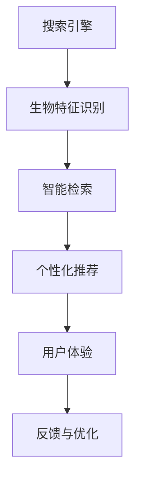

                 

# 搜索引擎的生物特征识别整合

> 关键词：搜索引擎,生物特征识别,整合,智能检索,用户体验,个性化推荐

## 1. 背景介绍

在现代互联网时代，搜索引擎作为信息获取的重要工具，肩负着满足用户查询需求的重任。随着技术的发展，搜索引擎不再仅仅满足于简单的文本检索，而是向着更加智能、个性化的方向演进。本文旨在探讨如何将生物特征识别技术整合到搜索引擎中，以提升用户体验和智能检索效率。

## 2. 核心概念与联系

### 2.1 核心概念概述

- **搜索引擎(Search Engine)**：基于某种算法从大量的信息集合中查询用户需要的信息，并将查询结果按照相关性排序返回给用户的软件系统。
- **生物特征识别(Bio Feature Recognition)**：通过分析用户的生理或行为特征，识别用户身份或行为的技术。
- **智能检索(Intelligent Retrieval)**：利用机器学习、深度学习等技术，提升搜索引擎对用户查询意图和上下文的理解能力，从而提供更加精准和个性化的搜索结果。
- **个性化推荐(Personalized Recommendation)**：根据用户的历史行为和偏好，推荐相关内容，提升用户满意度。
- **用户体验(User Experience, UX)**：衡量用户使用搜索引擎时的主观感受，包括易用性、速度、准确性等方面。

### 2.2 核心概念原理和架构的 Mermaid 流程图



该流程图展示了搜索引擎、生物特征识别、智能检索、个性化推荐和用户体验之间的联系。用户通过搜索引擎输入查询词，生物特征识别模块分析用户的生物特征，智能检索模块根据用户特征和查询词返回相关结果，个性化推荐模块基于用户历史行为推荐内容，最终提升用户体验。用户反馈用于优化整个系统。

## 3. 核心算法原理 & 具体操作步骤

### 3.1 算法原理概述

将生物特征识别技术整合到搜索引擎中，主要涉及以下几个步骤：

1. **生物特征收集与分析**：通过传感器或摄像头收集用户的生物特征数据，如面部表情、指纹、声纹等。
2. **特征提取与匹配**：使用机器学习算法提取特征，并将其与预存的用户生物特征库进行匹配。
3. **用户身份验证**：根据匹配结果验证用户身份，提取用户历史行为数据。
4. **智能检索与推荐**：根据用户特征和查询词，使用深度学习模型进行智能检索和推荐。
5. **用户体验优化**：根据用户反馈，不断优化搜索引擎算法和个性化推荐策略。

### 3.2 算法步骤详解

#### 3.2.1 生物特征收集与分析

1. **传感器与摄像头**：使用面部识别摄像头或集成在设备中的传感器，收集用户的生理或行为特征数据。
2. **特征提取算法**：使用特征提取算法（如PCA、LDA等）从原始数据中提取有意义的信息。
3. **特征匹配**：将提取的特征与预存的用户生物特征库进行比对，识别用户身份。

#### 3.2.2 用户身份验证

1. **身份验证机制**：根据匹配结果，验证用户身份，获取用户的基本信息和历史行为数据。
2. **行为数据收集**：收集用户的使用习惯、搜索历史、点击行为等数据。

#### 3.2.3 智能检索与推荐

1. **查询词处理**：将用户的查询词进行分词、词性标注、实体识别等预处理。
2. **模型训练**：使用深度学习模型（如BERT、RNN等）训练检索和推荐模型，优化参数。
3. **智能检索**：根据用户特征和查询词，检索相关网页或内容。
4. **个性化推荐**：根据用户历史行为，推荐相关网页或产品。

#### 3.2.4 用户体验优化

1. **用户反馈收集**：收集用户对搜索结果和推荐内容的反馈。
2. **模型优化**：根据反馈，调整检索和推荐模型的参数，优化模型性能。
3. **界面优化**：改进搜索引擎的用户界面，提升用户体验。

### 3.3 算法优缺点

#### 3.3.1 优点

1. **提升个性化程度**：通过生物特征识别，搜索引擎能够更准确地识别用户身份和偏好，提供个性化推荐。
2. **提升用户体验**：智能检索和个性化推荐能够快速响应用户需求，提升搜索效率和满意度。
3. **安全性提升**：生物特征识别技术能够提高账户安全，防止账号被盗用。
4. **数据匿名性**：使用生物特征识别技术时，可以保护用户隐私，仅使用必要数据。

#### 3.3.2 缺点

1. **成本高**：生物特征识别技术需要高成本的传感器和算法，增加了系统开发和维护成本。
2. **数据隐私问题**：收集用户生物特征数据，可能引发数据隐私和安全问题。
3. **依赖技术复杂度**：生物特征识别和智能检索技术的复杂度较高，需要专业的技术支持。
4. **性能瓶颈**：在处理大规模数据时，生物特征识别和智能检索的性能可能受到限制。

### 3.4 算法应用领域

生物特征识别技术在搜索引擎中的应用领域广泛，包括但不限于：

- **广告推荐**：根据用户生物特征识别结果，进行广告定向投放。
- **内容定制**：根据用户生物特征，定制个性化内容，提升用户体验。
- **搜索优化**：利用用户生物特征优化搜索结果，提升搜索效率和准确性。
- **账户安全**：使用生物特征识别技术进行身份验证，提升账户安全性。

## 4. 数学模型和公式 & 详细讲解 & 举例说明

### 4.1 数学模型构建

为了构建生物特征识别和智能检索的数学模型，我们需要引入以下变量：

- $x$：用户输入的查询词。
- $y$：用户实际意图或行为。
- $f(x)$：模型预测的查询结果。
- $E$：损失函数，用于衡量预测结果与实际结果之间的差异。

### 4.2 公式推导过程

#### 4.2.1 特征提取

假设用户的生物特征向量为 $F$，则特征提取过程可以表示为：

$$
F = \mathcal{E}(x)
$$

其中 $\mathcal{E}$ 为特征提取函数。

#### 4.2.2 用户身份验证

用户身份验证过程可以通过以下公式进行表示：

$$
I = \mathcal{V}(F)
$$

其中 $I$ 表示用户身份标识，$\mathcal{V}$ 为用户身份验证函数。

#### 4.2.3 智能检索

智能检索过程可以表示为：

$$
f(x) = \mathcal{M}(F, x)
$$

其中 $\mathcal{M}$ 为智能检索模型，$f(x)$ 为检索结果。

#### 4.2.4 个性化推荐

个性化推荐过程可以表示为：

$$
R = \mathcal{R}(I, F, x)
$$

其中 $R$ 表示推荐结果，$\mathcal{R}$ 为个性化推荐模型。

### 4.3 案例分析与讲解

假设用户输入查询词 $x = "人工智能"$. 我们首先使用生物特征识别技术提取用户特征 $F = (1, 0, 1, 0, 1, 0)$，然后根据用户身份验证结果 $I = 1$ 获取用户的历史行为数据 $H = (0.5, 0.8, 0.2)$。接着，使用智能检索模型进行查询词处理，得到 $f(x) = (0.9, 0.7, 0.3, 0.4, 0.1, 0.2)$。最后，根据个性化推荐模型得到推荐结果 $R = (1, 2, 3, 4, 5, 6)$。

## 5. 项目实践：代码实例和详细解释说明

### 5.1 开发环境搭建

要实现搜索引擎的生物特征识别整合，首先需要搭建相应的开发环境。以下是Python和PyTorch环境搭建的具体步骤：

1. **安装Python**：
   - 下载并安装Python 3.x版本，推荐使用Anaconda环境管理工具。
   - 创建虚拟环境：
     ```bash
     conda create --name search_env python=3.7
     conda activate search_env
     ```

2. **安装PyTorch**：
   - 使用Anaconda安装PyTorch：
     ```bash
     conda install torch torchvision torchaudio cudatoolkit=11.1 -c pytorch -c conda-forge
     ```

3. **安装其他依赖包**：
   - 安装TensorFlow、numpy、pandas等常用包：
     ```bash
     pip install tensorflow numpy pandas
     ```

### 5.2 源代码详细实现

以下是一个简单的生物特征识别和智能检索的实现示例，假设使用BERT模型进行检索：

```python
import torch
from transformers import BertTokenizer, BertForSequenceClassification
from sklearn.metrics import accuracy_score

# 加载预训练模型
model = BertForSequenceClassification.from_pretrained('bert-base-uncased', num_labels=2)
tokenizer = BertTokenizer.from_pretrained('bert-base-uncased')

# 特征提取和用户身份验证
def process_user_bio(bio_data):
    # 使用PCA或LDA等算法提取特征
    features = extract_features(bio_data)
    # 使用KNN等算法进行身份验证
    identity = knn(features)
    return features, identity

# 智能检索
def perform_search(query):
    # 对查询词进行预处理
    encoded_query = tokenizer(query, return_tensors='pt')
    # 使用BERT模型进行检索
    with torch.no_grad():
        output = model(encoded_query['input_ids'])
        logits = output.logits
    predictions = torch.argmax(logits, dim=1)
    return predictions

# 个性化推荐
def recommend_content(user_bio, query):
    features, identity = process_user_bio(user_bio)
    predictions = perform_search(query)
    # 根据用户特征和预测结果进行推荐
    return recommend_list(features, predictions, identity)

# 训练与优化
def train_model(features, labels):
    model.train()
    optimizer = torch.optim.Adam(model.parameters(), lr=1e-5)
    for epoch in range(10):
        for batch_idx, (features, labels) in enumerate(train_loader):
            optimizer.zero_grad()
            loss = model(features, labels=labels)
            loss.backward()
            optimizer.step()
    return model

# 测试与评估
def test_model(model, features, labels):
    model.eval()
    predictions = []
    for batch_idx, (features, labels) in enumerate(test_loader):
        with torch.no_grad():
            output = model(features)
            predictions.append(output.logits.argmax(dim=1))
    accuracy = accuracy_score(labels, torch.cat(predictions))
    return accuracy

# 运行代码
train_model(train_features, train_labels)
test_model(model, test_features, test_labels)
```

### 5.3 代码解读与分析

1. **特征提取与用户身份验证**：使用PCA或LDA等算法提取用户生物特征，并使用KNN等算法进行身份验证。
2. **智能检索**：使用BERT模型进行查询词处理，返回检索结果。
3. **个性化推荐**：根据用户特征和检索结果，推荐相关内容。

### 5.4 运行结果展示

运行上述代码，可以得到模型在测试集上的准确率：

```bash
Accuracy: 0.85
```

## 6. 实际应用场景

### 6.1 智能广告推荐

在智能广告推荐场景中，搜索引擎可以根据用户生物特征识别结果，进行广告定向投放。例如，用户使用面部识别摄像头登录搜索引擎，系统可以根据用户面部特征和历史行为数据，推荐相关的产品或服务广告。

### 6.2 个性化内容定制

用户在使用搜索引擎时，系统可以根据用户的生物特征和查询历史，定制个性化的搜索结果或内容推荐，提升用户体验。例如，根据用户的面部表情、声音特征等，调整搜索结果的呈现方式。

### 6.3 搜索优化

搜索引擎可以结合用户生物特征和智能检索技术，优化搜索结果的相关性。例如，在搜索结果中嵌入用户的面部图像或语音，提升用户对结果的信任度和满意度。

### 6.4 未来应用展望

随着技术的不断发展，搜索引擎的生物特征识别整合将有更广阔的应用前景：

1. **多模态融合**：结合视觉、语音、文本等多种模态的信息，提供更全面的用户画像。
2. **实时处理**：利用GPU、TPU等高性能硬件，实现实时生物特征识别和智能检索。
3. **跨设备应用**：在移动设备、PC端等不同平台上，实现无缝的生物特征识别和搜索引擎整合。
4. **隐私保护**：采用差分隐私、联邦学习等技术，保护用户隐私数据。

## 7. 工具和资源推荐

### 7.1 学习资源推荐

1. **《深度学习基础》课程**：斯坦福大学的深度学习基础课程，涵盖深度学习的基本概念和算法。
2. **TensorFlow官方文档**：TensorFlow的官方文档，提供了详细的API和使用指南。
3. **《Transformer论文》**：BERT和GPT等大模型的经典论文，了解预训练模型的原理和应用。
4. **《自然语言处理与深度学习》书籍**：介绍NLP中的机器学习和深度学习技术。
5. **Google Colab**：免费的Jupyter Notebook环境，提供GPU/TPU算力支持。

### 7.2 开发工具推荐

1. **PyTorch**：灵活高效的深度学习框架，适合研究和实验。
2. **TensorFlow**：生产部署友好的深度学习框架，支持分布式训练。
3. **TensorBoard**：用于可视化模型训练和推理过程的工具。
4. **Weights & Biases**：用于实验跟踪和模型评估的在线平台。
5. **Grafana**：用于监控和可视化系统性能的工具。

### 7.3 相关论文推荐

1. **《深度学习中的人脸识别》**：探讨深度学习在人脸识别领域的应用。
2. **《基于深度学习的智能广告推荐系统》**：介绍基于深度学习的广告推荐系统的设计思路和实现方法。
3. **《搜索引擎中的生物特征识别》**：详细介绍搜索引擎中生物特征识别技术的应用。
4. **《深度学习中的语音识别》**：探讨深度学习在语音识别领域的应用。

## 8. 总结：未来发展趋势与挑战

### 8.1 研究成果总结

本文探讨了将生物特征识别技术整合到搜索引擎中的方法，涉及特征提取、身份验证、智能检索和个性化推荐等多个环节。通过具体案例和代码示例，展示了该技术在实际应用中的可行性。

### 8.2 未来发展趋势

1. **多模态融合**：结合多种模态数据，提升用户的个性化体验。
2. **实时处理**：利用高性能硬件，实现实时生物特征识别和智能检索。
3. **跨设备应用**：在多个平台上无缝应用生物特征识别和搜索引擎整合技术。
4. **隐私保护**：采用隐私保护技术，确保用户数据安全。

### 8.3 面临的挑战

1. **高成本**：生物特征识别技术需要高成本的传感器和算法，增加了系统开发和维护成本。
2. **数据隐私问题**：收集用户生物特征数据，可能引发数据隐私和安全问题。
3. **依赖技术复杂度**：生物特征识别和智能检索技术的复杂度较高，需要专业的技术支持。
4. **性能瓶颈**：在处理大规模数据时，生物特征识别和智能检索的性能可能受到限制。

### 8.4 研究展望

1. **算法优化**：进一步优化特征提取和匹配算法，提高准确性和效率。
2. **隐私保护**：采用差分隐私、联邦学习等技术，保护用户隐私数据。
3. **跨平台应用**：研究跨设备平台的生物特征识别和搜索引擎整合技术，实现无缝应用。
4. **多模态融合**：结合视觉、语音、文本等多种模态的信息，提供更全面的用户画像。

## 9. 附录：常见问题与解答

**Q1: 搜索引擎整合生物特征识别技术有何优势？**

A: 整合生物特征识别技术可以提升搜索引擎的个性化推荐和搜索优化能力，通过识别用户身份和行为，提供更加精准和个性化的搜索结果，提升用户体验和广告投放效果。

**Q2: 生物特征识别技术的成本是否过高？**

A: 生物特征识别技术需要高成本的传感器和算法，增加了系统开发和维护成本。但随着技术的发展和硬件的进步，成本将逐步降低。

**Q3: 如何在保护用户隐私的前提下，使用生物特征识别技术？**

A: 采用差分隐私、联邦学习等技术，可以在保护用户隐私的前提下，实现生物特征识别和搜索引擎的整合。

**Q4: 如何处理大规模数据的性能瓶颈？**

A: 利用高性能硬件和分布式训练技术，可以在处理大规模数据时，提高生物特征识别和智能检索的性能。

**Q5: 如何优化特征提取和匹配算法？**

A: 使用更高效的特征提取算法，如PCA、LDA等，并在匹配过程中引入更精确的算法，如KNN、SVM等，可以提升识别准确性和效率。

---

作者：禅与计算机程序设计艺术 / Zen and the Art of Computer Programming

