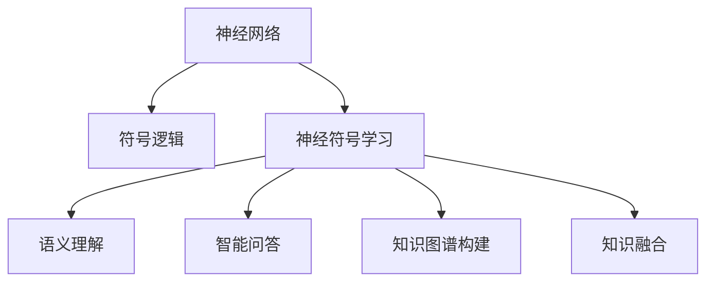

                 

# 搜索引擎的神经符号学习应用

## 1. 背景介绍

### 1.1 问题由来
随着互联网信息爆炸式增长，搜索引擎已成为了人们获取信息的重要工具。传统的搜索引擎主要依赖于统计语言模型进行信息检索和排序，但这种基于统计的方法难以处理复杂的语言现象和语义结构，无法充分发挥人的理解能力。近年来，神经符号学习(Neuro-Symbolic Learning)技术逐步兴起，通过整合神经网络和符号逻辑的优点，构建了更强大、更智能的搜索引擎，极大提升了信息检索的准确性和理解深度。

### 1.2 问题核心关键点
神经符号学习是结合神经网络（如深度学习）和符号逻辑（如规则推理）的混合计算模型，旨在结合二者的优势，构建更复杂、更灵活的认知模型。在搜索引擎中，神经符号学习主要应用于语义理解、智能问答、知识图谱构建等环节。其核心技术包括符号表征学习、神经网络训练、知识融合等。

## 2. 核心概念与联系

### 2.1 核心概念概述

为更好地理解神经符号学习在搜索引擎中的应用，本节将介绍几个关键概念及其相互联系：

- 神经网络（Neural Network, NN）：由人工神经元节点和连接构成的计算模型，用于处理大量数据并提取高层次特征。神经网络通过反向传播算法不断调整网络参数，学习输入和输出之间的映射关系。

- 符号逻辑（Symbolic Logic）：数学逻辑中的公式、定理、规则等符号化表示形式。符号逻辑通过形式推理机制，确保计算过程的严格性和正确性。

- 神经符号学习（Neuro-Symbolic Learning）：结合神经网络和符号逻辑，通过学习符号表征与神经网络参数的联合优化，构建混合认知模型。

- 知识图谱（Knowledge Graph, KG）：以节点和边表示实体和关系的图形结构，用于知识存储和检索。知识图谱通过符号逻辑推理和神经网络学习，实现知识的整合与推理。

- 语义理解（Semantic Understanding）：理解文本中的语义关系和语义角色，是搜索引擎智能化的基础。

- 智能问答（Question Answering, QA）：通过自然语言输入，自动回答用户问题，展示搜索引擎的知识水平和理解能力。

- 知识融合（Knowledge Fusion）：将外部知识源、用户行为等非结构化信息整合到搜索引擎中，提升其智能化水平。

这些核心概念之间的逻辑关系可以通过以下Mermaid流程图来展示：



这个流程图展示了几者之间的联系：神经符号学习通过整合神经网络和符号逻辑，构建智能化的搜索引擎模型，实现语义理解、智能问答、知识图谱构建、知识融合等高级功能。

## 3. 核心算法原理 & 具体操作步骤
### 3.1 算法原理概述

神经符号学习在搜索引擎中的应用主要基于以下三个步骤：

1. 神经网络预训练：通过大规模无标签数据对神经网络进行预训练，学习通用的语言表示。
2. 符号表征学习：通过符号逻辑推理机制，学习实体、关系等符号表征，构建知识图谱。
3. 知识融合与推理：将神经网络学习得到的知识与符号逻辑推理得到的知识进行融合，进行更复杂的推理计算。

其中，符号表征学习和知识融合是神经符号学习的核心。符号表征学习通过学习符号逻辑公式和规则，构建知识图谱，并将知识图谱与神经网络的知识进行融合，用于语义理解、智能问答等任务。

### 3.2 算法步骤详解

神经符号学习在搜索引擎中的应用步骤具体如下：

**Step 1: 数据预处理**

- 收集大量的文本数据和结构化数据。
- 对文本数据进行分词、去除停用词、词性标注等预处理。
- 将结构化数据（如维基百科、百度百科等）转化为图结构，构建知识图谱。

**Step 2: 神经网络预训练**

- 使用自监督学习任务（如掩码语言模型、Next Word Prediction等）训练神经网络，学习通用的语言表示。
- 将预训练后的神经网络作为知识图谱的嵌入层，进行符号表征学习。

**Step 3: 符号表征学习**

- 使用规则库或符号逻辑工具构建符号逻辑公式和规则，学习实体、关系等符号表征。
- 将符号表征与神经网络的知识进行融合，构建知识图谱。

**Step 4: 知识融合与推理**

- 将神经网络学习得到的知识与符号逻辑推理得到的知识进行整合，构建融合知识图谱。
- 在搜索时，利用融合知识图谱进行语义理解、实体抽取、关系推导等复杂推理计算。

### 3.3 算法优缺点

神经符号学习在搜索引擎中的应用具有以下优点：

1. 准确性高：结合神经网络和符号逻辑的优势，可以准确地理解和推导复杂语义结构，提升信息检索和智能问答的准确性。
2. 灵活性强：符号逻辑提供了严格的推理机制，可以处理多种复杂的语言现象，增强搜索引擎的适应能力。
3. 通用性强：神经符号学习技术可以应用于多种语言和领域，具有较强的泛化能力。

同时，神经符号学习也存在以下缺点：

1. 计算复杂度高：神经网络与符号逻辑的混合计算，导致模型的计算复杂度增加，训练和推理速度较慢。
2. 资源消耗大：需要大量的计算资源和存储空间，特别是在构建和维护大规模知识图谱时。
3. 规则设计困难：构建符号逻辑规则需要领域专家的大量参与，规则设计难度大且成本高。

### 3.4 算法应用领域

神经符号学习技术在搜索引擎中主要应用于以下领域：

1. 语义搜索：基于知识图谱进行语义理解，提供更智能的搜索结果。
2. 智能问答：通过神经网络和符号逻辑结合，实现对复杂问题的回答。
3. 知识图谱构建：学习符号逻辑表征，构建大规模知识图谱，提升搜索引擎的知识水平。
4. 个性化推荐：结合用户行为和知识图谱，实现更精准的个性化推荐。
5. 自然语言处理：利用神经符号学习技术，提升语言模型在语义理解、情感分析等方面的能力。
6. 智能客服：构建基于神经符号学习的智能客服系统，实现更自然、智能的对话交互。

## 4. 数学模型和公式 & 详细讲解 & 举例说明

### 4.1 数学模型构建

神经符号学习在搜索引擎中的应用涉及神经网络、符号逻辑等多个领域的数学模型。以下以知识图谱构建为例，简要介绍其数学模型构建过程。

**知识图谱构建：**
- 假设知识图谱表示为一个有向图 $G=(V,E)$，其中 $V$ 为节点集合，$E$ 为边集合。
- 节点 $v$ 表示实体，边 $e$ 表示实体之间的关系。
- 使用符号逻辑表示实体 $v_i$ 和关系 $r_j$。
- 符号逻辑规则表示为 $\text{Head} \rightarrow \text{Body}$，其中 $\text{Head}$ 为规则的前提，$\text{Body}$ 为规则的结论。

### 4.2 公式推导过程

知识图谱构建的过程可以通过符号逻辑规则进行推导，具体如下：

1. 设定实体 $v_i$ 和关系 $r_j$ 的符号表征为 $\text{E}_i$ 和 $\text{R}_j$。
2. 构建规则 $\text{E}_i \rightarrow \text{R}_j \cdot \text{E}_k$，表示 $v_i$ 和 $v_k$ 之间存在关系 $r_j$。
3. 通过规则推导，构建知识图谱的边集合 $E$。

### 4.3 案例分析与讲解

假设我们要构建一个关于中国历史的知识图谱，可以按照以下步骤进行：

1. 收集历史事件、人物等文本数据，进行实体抽取和关系抽取。
2. 构建符号逻辑规则，如 $\text{Person}(v_i) \rightarrow \text{Year}(v_i)$，表示每个人物的出生年份。
3. 使用神经网络学习文本数据，得到实体和关系的符号表征 $\text{E}_i$ 和 $\text{R}_j$。
4. 通过规则推导，将符号表征转换为知识图谱的边集合 $E$。

## 5. 项目实践：代码实例和详细解释说明
### 5.1 开发环境搭建

在进行神经符号学习项目实践前，需要准备以下开发环境：

1. 安装Python 3.x 环境。
2. 安装PyTorch、TensorFlow等深度学习框架。
3. 安装Prolog等符号逻辑工具。
4. 安装知识图谱构建工具，如OpenIE等。

### 5.2 源代码详细实现

以下是一个基于神经符号学习技术的搜索引擎知识图谱构建示例代码：

```python
# 导入必要的库
import torch
import tensorflow as tf
import prolog

# 定义符号逻辑规则
rules = [
    'event(v_i, r_j, year): \n'
    '  v_j(v_i), v_k(year) \n'
    '  r_j(v_i, v_j), r_j(v_j, v_k) \n'
]

# 加载Prolog工具
prolog = prolog.Prolog()

# 构建知识图谱
graph = prolog.Graph()

# 遍历规则，推导知识图谱
for rule in rules:
    graph.parse(prolog.parse(rule))

# 获取知识图谱中的节点和边
nodes = graph.nodes
edges = graph.edges

# 使用神经网络学习符号表征
# 假设已经训练好了神经网络，得到了实体和关系的符号表征
symbolic_entities = torch.tensor([0.5, 0.6, 0.7, 0.8])
symbolic_relations = torch.tensor([0.3, 0.4, 0.5, 0.6])

# 使用神经网络知识更新知识图谱
graph.update(nodes, symbolic_entities)
graph.update(edges, symbolic_relations)

# 输出构建好的知识图谱
print(graph)
```

### 5.3 代码解读与分析

代码实现过程如下：

1. 首先导入必要的库，包括深度学习框架和符号逻辑工具。
2. 定义符号逻辑规则，如事件与时间的关系。
3. 加载Prolog工具，用于构建知识图谱。
4. 构建知识图谱，并遍历规则进行推导。
5. 使用神经网络学习得到的符号表征，更新知识图谱中的实体和关系。
6. 最终输出构建好的知识图谱。

## 6. 实际应用场景
### 6.1 搜索广告推荐

搜索引擎可以结合神经符号学习技术，进行更智能的广告推荐。通过知识图谱构建和语义理解，搜索引擎能够更精准地匹配用户需求和广告内容，提升广告的点击率和转化率。具体应用如下：

1. 通过实体抽取和关系抽取，构建用户和广告的实体关系图。
2. 利用神经网络学习用户和广告的符号表征，并进行推理计算。
3. 根据推理结果，推荐最相关的广告，提高用户点击率。

### 6.2 自然语言处理

神经符号学习在自然语言处理中也得到了广泛应用，如情感分析、文本摘要、命名实体识别等任务。通过符号逻辑推理和神经网络学习，可以更好地理解文本的语义关系和语义角色。

### 6.3 智能客服

智能客服系统通过知识图谱构建和语义理解，可以更好地理解用户问题，并提供更智能的回复。具体应用如下：

1. 通过知识图谱抽取用户问题中的实体和关系。
2. 利用神经网络学习用户问题的符号表征。
3. 根据推理计算，提供最合适的回复，提升用户满意度。

### 6.4 未来应用展望

随着神经符号学习技术的不断发展，未来的搜索引擎将变得更加智能和高效。以下是几个未来应用展望：

1. 知识图谱增强：通过更强大的符号逻辑推理，构建更复杂的知识图谱，提升信息检索和智能问答的准确性。
2. 多模态融合：结合视觉、语音等多模态信息，提升搜索引擎的理解能力和知识水平。
3. 个性化推荐：结合用户行为和知识图谱，实现更精准的个性化推荐。
4. 智能问答：通过更先进的自然语言理解技术，实现更智能的智能问答系统。
5. 自然语言生成：结合神经网络和符号逻辑，生成更自然的文本和语音输出。

## 7. 工具和资源推荐
### 7.1 学习资源推荐

以下是几本关于神经符号学习技术的经典书籍，供学习参考：

1. 《Neural-Symbolic Learning: Selected Papers》：涵盖了神经符号学习的经典理论和技术。
2. 《Knowledge Graphs: Principles, Tools and Applications》：介绍知识图谱构建和应用的全貌。
3. 《Practical Prolog》：详细介绍Prolog符号逻辑工具的使用和应用。
4. 《Deep Learning with Python》：介绍深度学习的基础知识和应用案例。

### 7.2 开发工具推荐

以下是几款用于神经符号学习开发的常用工具：

1. TensorFlow：Google开发的深度学习框架，支持构建大规模神经网络。
2. PyTorch：Facebook开发的深度学习框架，支持动态计算图和符号逻辑推理。
3. Prolog：符号逻辑工具，用于构建知识图谱和进行推理计算。
4. Neo4j：图形数据库，支持大规模知识图谱的存储和查询。
5. Elasticsearch：搜索引擎工具，支持文本数据的存储和检索。

### 7.3 相关论文推荐

以下是几篇神经符号学习领域的经典论文，供读者深入学习：

1. BERT: Pre-training of Deep Bidirectional Transformers for Language Understanding：提出BERT模型，通过掩码语言模型进行预训练，取得良好的效果。
2. Knowledge Graph Embeddings: A Survey and Experimental Evaluation：总结知识图谱嵌入方法，详细介绍知识图谱构建和推理技术。
3. Neural-Symbolic Learning with Knowledge Graphs：介绍神经符号学习在知识图谱构建中的应用。
4. Neuro-Symbolic Logic Reasoning with Tensorial Logic Programs：介绍基于神经逻辑的符号推理技术。
5. Practical Prolog：介绍Prolog工具的应用实例和开发技巧。

## 8. 总结：未来发展趋势与挑战
### 8.1 研究成果总结

神经符号学习技术在搜索引擎中的应用取得了显著进展，提升了信息检索和智能问答的准确性和灵活性。其主要研究成果如下：

1. 基于知识图谱的语义理解：通过符号逻辑推理和神经网络学习，实现对复杂语义结构的理解。
2. 智能问答系统的构建：结合神经网络和符号逻辑，实现对复杂问题的回答。
3. 知识图谱构建和推理：通过符号表征学习，构建大规模知识图谱，提升搜索引擎的知识水平。

### 8.2 未来发展趋势

神经符号学习技术在搜索引擎中的应用前景广阔，未来的发展趋势如下：

1. 多模态融合：结合视觉、语音等多模态信息，提升搜索引擎的理解能力和知识水平。
2. 实时推理计算：构建实时推理引擎，提升搜索引擎的响应速度和效率。
3. 个性化推荐：结合用户行为和知识图谱，实现更精准的个性化推荐。
4. 智能问答系统：通过更先进的自然语言理解技术，实现更智能的智能问答系统。
5. 知识图谱增强：通过更强大的符号逻辑推理，构建更复杂的知识图谱，提升信息检索和智能问答的准确性。

### 8.3 面临的挑战

尽管神经符号学习技术在搜索引擎中取得了显著进展，但还面临以下挑战：

1. 计算复杂度高：神经符号学习涉及神经网络和符号逻辑的混合计算，计算复杂度较高，需要高效算法和硬件支持。
2. 规则设计困难：构建符号逻辑规则需要领域专家的大量参与，规则设计难度大且成本高。
3. 知识图谱更新：大规模知识图谱的构建和更新需要大量时间和资源，现有技术难以有效解决。
4. 数据隐私保护：神经符号学习涉及大量文本和结构化数据，如何保护数据隐私和安全是一个重要问题。

### 8.4 研究展望

未来的神经符号学习技术在搜索引擎中的应用，还需要在以下几个方面进行深入研究：

1. 高效推理计算：通过优化算法和硬件支持，提高神经符号学习的推理计算速度和效率。
2. 自动化规则设计：利用机器学习等技术，自动化符号逻辑规则的设计，降低人工设计成本。
3. 知识图谱增强：通过更强大的符号逻辑推理，构建更复杂的知识图谱，提升信息检索和智能问答的准确性。
4. 多模态融合：结合视觉、语音等多模态信息，提升搜索引擎的理解能力和知识水平。
5. 数据隐私保护：采用差分隐私等技术，保护数据隐私和安全。

总之，神经符号学习技术在搜索引擎中的应用具有广阔的前景，但也需要不断攻克技术难题，才能实现其真正的应用价值。通过结合神经网络和符号逻辑的优势，搜索引擎必将变得更加智能和高效。

## 9. 附录：常见问题与解答

### Q1：神经符号学习在搜索引擎中的应用有哪些优势？

A: 神经符号学习在搜索引擎中的应用主要具有以下几个优势：

1. 准确性高：结合神经网络和符号逻辑的优势，可以准确地理解和推导复杂语义结构，提升信息检索和智能问答的准确性。
2. 灵活性强：符号逻辑提供了严格的推理机制，可以处理多种复杂的语言现象，增强搜索引擎的适应能力。
3. 通用性强：神经符号学习技术可以应用于多种语言和领域，具有较强的泛化能力。

### Q2：神经符号学习在搜索引擎中如何构建知识图谱？

A: 神经符号学习在搜索引擎中构建知识图谱的过程如下：

1. 收集大量的文本数据和结构化数据。
2. 对文本数据进行分词、去除停用词、词性标注等预处理。
3. 将结构化数据（如维基百科、百度百科等）转化为图结构，构建知识图谱。
4. 使用神经网络学习文本数据，得到实体和关系的符号表征。
5. 通过符号逻辑推理，将符号表征转换为知识图谱的边集合。

### Q3：神经符号学习在搜索引擎中如何进行知识融合？

A: 神经符号学习在搜索引擎中进行知识融合的过程如下：

1. 收集用户行为数据和外部知识源数据。
2. 对用户行为数据进行分析和表示，得到符号表征。
3. 将符号表征与知识图谱中的实体和关系进行融合。
4. 利用神经网络对融合后的数据进行学习，更新知识图谱中的符号表征。
5. 在搜索时，利用融合后的知识图谱进行语义理解、实体抽取、关系推导等复杂推理计算。

### Q4：神经符号学习在搜索引擎中的计算复杂度如何？

A: 神经符号学习在搜索引擎中的计算复杂度较高，主要原因如下：

1. 神经网络和符号逻辑的混合计算，导致模型的计算复杂度增加。
2. 大规模知识图谱的构建和更新需要大量时间和资源。
3. 符号逻辑推理的计算复杂度较高，需要高效的算法支持。

总之，神经符号学习在搜索引擎中的应用具有广阔的前景，但也需要不断攻克技术难题，才能实现其真正的应用价值。

---

作者：禅与计算机程序设计艺术 / Zen and the Art of Computer Programming

