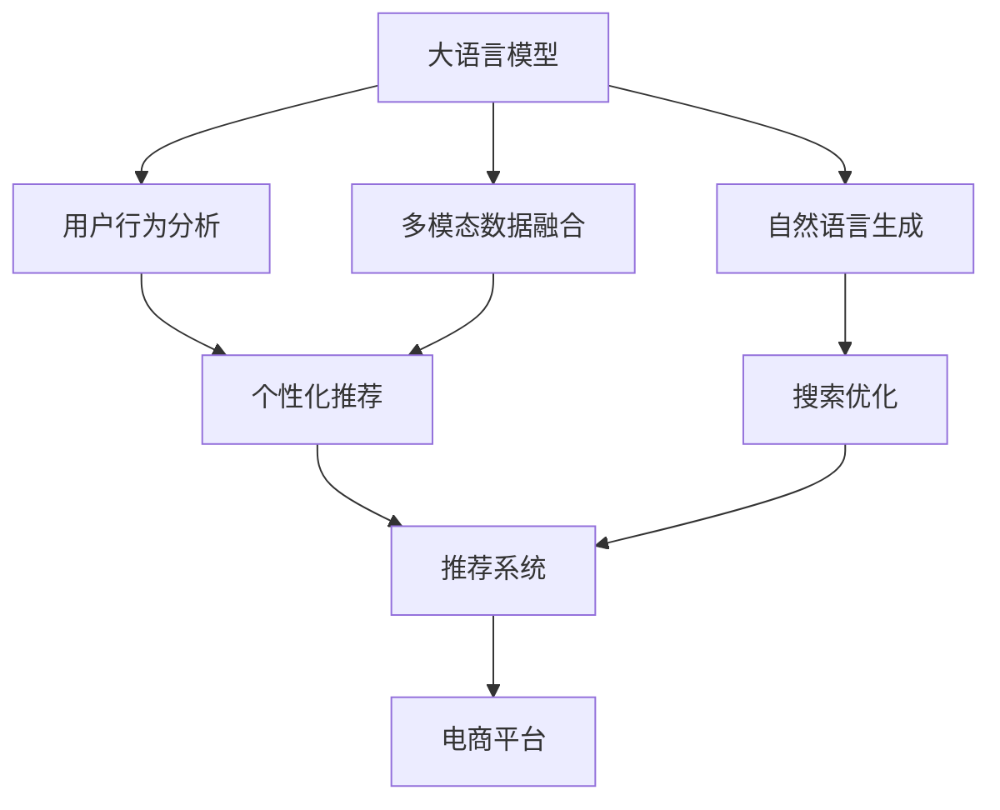

                 

# 搜索推荐系统的AI 大模型应用：提高电商平台的竞争力与盈利能力

> 关键词：大语言模型，推荐系统，电商平台，用户行为分析，个性化推荐，多模态数据融合，搜索优化，自然语言处理，深度学习，自然语言生成

## 1. 背景介绍

### 1.1 问题由来

在互联网时代，电子商务平台已经成为消费者获取商品信息、完成购物的主要渠道之一。然而，如何通过精准的个性化推荐和搜索优化，提升用户体验，增加平台交易转化率，是一个重要的研究方向。传统的推荐算法通常基于用户历史行为数据进行协同过滤、基于内容的推荐等，但随着数据量的增加和业务场景的复杂化，这些算法逐渐暴露出用户画像不全面、推荐精度不足、搜索体验不佳等问题。

随着深度学习和大语言模型的发展，推荐系统逐渐向更加智能、高效的方向演进。AI 大模型可以捕捉到更丰富的用户行为特征，通过多模态数据的融合，提升个性化推荐的效果。同时，大模型在自然语言处理(NLP)领域的应用，也进一步优化了搜索体验，让电商平台的运营更加智能化。

### 1.2 问题核心关键点

大语言模型在电商平台的搜索推荐中的应用，主要体现在以下几个方面：

1. **用户行为分析**：通过分析用户的搜索、浏览、点击等行为数据，提取用户的兴趣和偏好，构建详细的用户画像。
2. **多模态数据融合**：结合图像、视频、文本等多种模态数据，进行深度融合，生成更加精准的推荐结果。
3. **自然语言生成**：利用大语言模型生成更加符合用户需求的搜索结果，提升搜索效率和质量。
4. **个性化推荐**：根据用户的实时行为数据和历史数据，动态调整推荐策略，实现更精准的个性化推荐。
5. **搜索优化**：通过大模型的自然语言处理能力，优化搜索结果排序，减少用户搜索时间，提升搜索体验。

这些技术的应用，使得电商平台能够在数据驱动的框架下，实现更加智能化的推荐和搜索服务，提升用户的满意度和转化率。

## 2. 核心概念与联系

### 2.1 核心概念概述

为更好地理解AI 大模型在搜索推荐系统中的应用，本节将介绍几个密切相关的核心概念：

- **大语言模型(Large Language Model, LLM)**：以自回归(如GPT)或自编码(如BERT)模型为代表的大规模预训练语言模型。通过在海量无标签文本数据上进行预训练，学习通用的语言表示，具备强大的语言理解和生成能力。

- **推荐系统(Recommender System)**：通过分析用户行为数据和物品属性信息，为用户推荐可能感兴趣的物品的系统。常见的推荐算法包括协同过滤、基于内容的推荐、深度学习等。

- **电商平台(E-commerce Platform)**：以电子商务为商业模式，提供在线购物、交易、支付等服务的平台。电商平台的推荐和搜索功能是其核心竞争力之一。

- **个性化推荐(Personalized Recommendation)**：根据用户的历史行为数据和实时行为特征，动态生成符合用户偏好的推荐结果。能够显著提升用户体验和平台转化率。

- **多模态数据融合(Multi-modal Data Fusion)**：将文本、图像、音频等多种模态的数据进行深度融合，生成更加精准、全面的用户画像。

- **自然语言处理(Natural Language Processing, NLP)**：涉及计算机对人类语言文字的理解和生成，包括文本分类、信息抽取、对话系统等。

- **深度学习(Deep Learning)**：通过多层神经网络结构，自动学习数据中的特征和规律，广泛应用于计算机视觉、自然语言处理等领域。

这些核心概念之间的逻辑关系可以通过以下Mermaid流程图来展示：



这个流程图展示了大语言模型在推荐系统中的应用路径：

1. 通过大语言模型分析用户行为数据，提取兴趣特征。
2. 结合多模态数据融合，生成更全面的用户画像。
3. 使用个性化推荐算法，生成个性化推荐结果。
4. 结合自然语言生成技术，优化搜索结果。
5. 将推荐和搜索结果融入电商平台的推荐和搜索系统，提升用户体验和转化率。

## 3. 核心算法原理 & 具体操作步骤
### 3.1 算法原理概述

基于大语言模型的电商搜索推荐系统，主要通过以下几个步骤实现：

1. **数据收集**：收集用户的搜索、浏览、点击等行为数据，以及商品的图片、描述、价格等属性信息。
2. **用户行为分析**：利用大语言模型分析用户行为数据，提取用户的兴趣和偏好。
3. **多模态数据融合**：将文本、图像、音频等多种模态的数据进行深度融合，生成更加精准的推荐结果。
4. **个性化推荐**：根据用户的实时行为数据和历史数据，动态调整推荐策略，实现更精准的个性化推荐。
5. **自然语言生成**：利用大语言模型生成更加符合用户需求的搜索结果，提升搜索效率和质量。
6. **搜索优化**：通过大模型的自然语言处理能力，优化搜索结果排序，减少用户搜索时间，提升搜索体验。

### 3.2 算法步骤详解

**Step 1: 数据收集与预处理**

电商平台的推荐和搜索系统需要大量的用户行为数据和商品属性数据。这些数据通常来自于用户的操作记录、商品信息表、用户画像等。数据的预处理包括去重、清洗、标注等步骤，确保数据的准确性和完整性。

**Step 2: 用户行为分析**

用户行为分析是推荐系统的基础。通过分析用户的搜索、浏览、点击等行为数据，可以提取出用户的兴趣特征。常见的方法包括基于协同过滤的推荐算法、基于内容的推荐算法等。

**Step 3: 多模态数据融合**

电商平台上，商品不仅包含文本描述，还有图片、视频等多种模态的数据。将文本、图像、音频等多种模态的数据进行深度融合，生成更加精准、全面的用户画像。

**Step 4: 个性化推荐**

根据用户的实时行为数据和历史数据，动态调整推荐策略，实现更精准的个性化推荐。常见的推荐算法包括协同过滤、基于内容的推荐、深度学习等。

**Step 5: 自然语言生成**

利用大语言模型生成更加符合用户需求的搜索结果，提升搜索效率和质量。常见的方法包括使用GPT等模型生成搜索结果摘要，使用BERT等模型进行关键词提取等。

**Step 6: 搜索优化**

通过大模型的自然语言处理能力，优化搜索结果排序，减少用户搜索时间，提升搜索体验。常见的方法包括使用Transformer模型进行文本相似度计算，使用注意力机制优化搜索结果排序等。

### 3.3 算法优缺点

大语言模型在电商平台的推荐和搜索中的应用，具有以下优点：

1. **提升推荐精度**：通过大语言模型对多模态数据进行融合，生成更加精准的推荐结果。
2. **优化搜索体验**：利用大语言模型生成符合用户需求的搜索结果，提升搜索效率和质量。
3. **增强个性化推荐**：根据用户的实时行为数据和历史数据，动态调整推荐策略，实现更精准的个性化推荐。
4. **减少用户搜索时间**：通过优化搜索结果排序，减少用户搜索时间，提升搜索体验。

同时，该方法也存在一定的局限性：

1. **数据依赖**：推荐系统的效果很大程度上取决于数据的准确性和完整性，收集高质量数据成本较高。
2. **模型复杂度**：大语言模型需要大量的计算资源进行训练，模型复杂度高，部署难度大。
3. **泛化能力有限**：当目标任务与预训练数据的分布差异较大时，推荐系统的性能提升有限。
4. **模型可解释性不足**：大模型的决策过程通常缺乏可解释性，难以对其推理逻辑进行分析和调试。

尽管存在这些局限性，但就目前而言，基于大语言模型的推荐和搜索方法仍是电商平台的重要技术手段。未来相关研究的重点在于如何进一步降低数据收集成本，提高模型的泛化能力，同时兼顾可解释性和模型复杂度等因素。

### 3.4 算法应用领域

大语言模型在电商平台的推荐和搜索中的应用，已经在众多场景中得到了广泛应用，例如：

- **个性化推荐**：根据用户的搜索、浏览、点击等行为数据，为用户推荐可能感兴趣的商品。
- **搜索优化**：利用大语言模型生成符合用户需求的搜索结果，提升搜索效率和质量。
- **用户画像**：通过分析用户的搜索、浏览、点击等行为数据，提取用户的兴趣和偏好。
- **内容生成**：利用大语言模型生成商品描述、广告文案等文本内容，提升用户的浏览体验。
- **商品分类**：使用大语言模型对商品进行分类和标注，提升商品信息的管理效率。

除了上述这些经典场景外，大语言模型在电商平台的创新性应用也将不断涌现，如智能客服、情感分析、数据增强等，为电商平台带来新的技术突破。

## 4. 数学模型和公式 & 详细讲解 & 举例说明

### 4.1 数学模型构建

本节将使用数学语言对基于大语言模型的电商推荐系统进行更加严格的刻画。

记电商平台上的用户为 $U$，商品为 $I$，行为数据为 $B$，行为数据集为 $D=\{(u,b_i)\}_{i=1}^N$，其中 $u$ 表示用户，$b_i$ 表示用户 $u$ 的行为数据。假设推荐系统为 $R_{\theta}(u)$，其中 $\theta$ 为模型的参数。

定义推荐系统在数据集 $D$ 上的经验风险为：

$$
\mathcal{L}(\theta) = \frac{1}{N} \sum_{i=1}^N \ell(R_{\theta}(u_i),b_i)
$$

其中 $\ell$ 为损失函数，用于衡量推荐结果与实际行为之间的差异。常见的损失函数包括均方误差损失、交叉熵损失等。

### 4.2 公式推导过程

以协同过滤算法为例，推导推荐系统在用户行为数据上的损失函数。

假设用户 $u$ 的历史行为数据为 $\{b_i\}$，推荐系统的预测行为为 $R_{\theta}(u)$，实际行为为 $b$。推荐系统的预测结果与实际行为之间的损失函数为：

$$
\ell(R_{\theta}(u),b) = ||R_{\theta}(u) - b||^2
$$

将上式扩展到整个数据集，得到推荐系统的经验风险：

$$
\mathcal{L}(\theta) = \frac{1}{N} \sum_{i=1}^N ||R_{\theta}(u_i) - b_i||^2
$$

在得到损失函数后，可以使用梯度下降等优化算法进行模型的迭代优化，最小化经验风险，得到最优参数 $\theta^*$。

### 4.3 案例分析与讲解

**案例分析**：以电商平台上的个性化推荐系统为例，展示大语言模型在推荐系统中的应用。

1. **数据收集与预处理**：收集用户的搜索、浏览、点击等行为数据，以及商品的图片、描述、价格等属性信息。
2. **用户行为分析**：利用大语言模型分析用户行为数据，提取用户的兴趣和偏好。
3. **多模态数据融合**：将文本、图像、音频等多种模态的数据进行深度融合，生成更加精准的推荐结果。
4. **个性化推荐**：根据用户的实时行为数据和历史数据，动态调整推荐策略，实现更精准的个性化推荐。
5. **自然语言生成**：利用大语言模型生成更加符合用户需求的搜索结果，提升搜索效率和质量。
6. **搜索优化**：通过大模型的自然语言处理能力，优化搜索结果排序，减少用户搜索时间，提升搜索体验。

## 5. 项目实践：代码实例和详细解释说明
### 5.1 开发环境搭建

在进行推荐和搜索系统开发前，我们需要准备好开发环境。以下是使用Python进行PyTorch开发的环境配置流程：

1. 安装Anaconda：从官网下载并安装Anaconda，用于创建独立的Python环境。

2. 创建并激活虚拟环境：
```bash
conda create -n pytorch-env python=3.8 
conda activate pytorch-env
```

3. 安装PyTorch：根据CUDA版本，从官网获取对应的安装命令。例如：
```bash
conda install pytorch torchvision torchaudio cudatoolkit=11.1 -c pytorch -c conda-forge
```

4. 安装Transformers库：
```bash
pip install transformers
```

5. 安装各类工具包：
```bash
pip install numpy pandas scikit-learn matplotlib tqdm jupyter notebook ipython
```

完成上述步骤后，即可在`pytorch-env`环境中开始推荐和搜索系统的开发。

### 5.2 源代码详细实现

这里我们以基于大语言模型的个性化推荐系统为例，给出使用Transformers库的PyTorch代码实现。

首先，定义推荐系统的数据处理函数：

```python
from transformers import BertTokenizer
from torch.utils.data import Dataset
import torch

class RecommendationDataset(Dataset):
    def __init__(self, user_ids, item_ids, user_biased, item_biased, tokenizer, max_len=128):
        self.user_ids = user_ids
        self.item_ids = item_ids
        self.user_biased = user_biased
        self.item_biased = item_biased
        self.tokenizer = tokenizer
        self.max_len = max_len
        
    def __len__(self):
        return len(self.user_ids)
    
    def __getitem__(self, item):
        user_id = self.user_ids[item]
        item_id = self.item_ids[item]
        user_biased = self.user_biased[item]
        item_biased = self.item_biased[item]
        
        encoding = self.tokenizer(user_id + ' ' + item_id, return_tensors='pt', max_length=self.max_len, padding='max_length', truncation=True)
        input_ids = encoding['input_ids'][0]
        attention_mask = encoding['attention_mask'][0]
        
        # 对token-wise的标签进行编码
        encoded_biased = [tag2id[tag] for tag in user_biased] 
        encoded_biased.extend([tag2id['O']] * (self.max_len - len(encoded_biased)))
        labels = torch.tensor(encoded_biased, dtype=torch.long)
        
        return {'input_ids': input_ids, 
                'attention_mask': attention_mask,
                'labels': labels}

# 标签与id的映射
tag2id = {'O': 0, 'B-USER': 1, 'I-USER': 2, 'B-ITEM': 3, 'I-ITEM': 4}
id2tag = {v: k for k, v in tag2id.items()}

# 创建dataset
tokenizer = BertTokenizer.from_pretrained('bert-base-cased')

train_dataset = RecommendationDataset(train_user_ids, train_item_ids, train_user_biased, train_item_biased, tokenizer)
dev_dataset = RecommendationDataset(dev_user_ids, dev_item_ids, dev_user_biased, dev_item_biased, tokenizer)
test_dataset = RecommendationDataset(test_user_ids, test_item_ids, test_user_biased, test_item_biased, tokenizer)
```

然后，定义模型和优化器：

```python
from transformers import BertForTokenClassification, AdamW

model = BertForTokenClassification.from_pretrained('bert-base-cased', num_labels=len(tag2id))

optimizer = AdamW(model.parameters(), lr=2e-5)
```

接着，定义训练和评估函数：

```python
from torch.utils.data import DataLoader
from tqdm import tqdm
from sklearn.metrics import classification_report

device = torch.device('cuda') if torch.cuda.is_available() else torch.device('cpu')
model.to(device)

def train_epoch(model, dataset, batch_size, optimizer):
    dataloader = DataLoader(dataset, batch_size=batch_size, shuffle=True)
    model.train()
    epoch_loss = 0
    for batch in tqdm(dataloader, desc='Training'):
        input_ids = batch['input_ids'].to(device)
        attention_mask = batch['attention_mask'].to(device)
        labels = batch['labels'].to(device)
        model.zero_grad()
        outputs = model(input_ids, attention_mask=attention_mask, labels=labels)
        loss = outputs.loss
        epoch_loss += loss.item()
        loss.backward()
        optimizer.step()
    return epoch_loss / len(dataloader)

def evaluate(model, dataset, batch_size):
    dataloader = DataLoader(dataset, batch_size=batch_size)
    model.eval()
    preds, labels = [], []
    with torch.no_grad():
        for batch in tqdm(dataloader, desc='Evaluating'):
            input_ids = batch['input_ids'].to(device)
            attention_mask = batch['attention_mask'].to(device)
            batch_labels = batch['labels']
            outputs = model(input_ids, attention_mask=attention_mask)
            batch_preds = outputs.logits.argmax(dim=2).to('cpu').tolist()
            batch_labels = batch_labels.to('cpu').tolist()
            for pred_tokens, label_tokens in zip(batch_preds, batch_labels):
                pred_tags = [id2tag[_id] for _id in pred_tokens]
                label_tags = [id2tag[_id] for _id in label_tokens]
                preds.append(pred_tags[:len(label_tags)])
                labels.append(label_tags)
                
    print(classification_report(labels, preds))
```

最后，启动训练流程并在测试集上评估：

```python
epochs = 5
batch_size = 16

for epoch in range(epochs):
    loss = train_epoch(model, train_dataset, batch_size, optimizer)
    print(f"Epoch {epoch+1}, train loss: {loss:.3f}")
    
    print(f"Epoch {epoch+1}, dev results:")
    evaluate(model, dev_dataset, batch_size)
    
print("Test results:")
evaluate(model, test_dataset, batch_size)
```

以上就是使用PyTorch对BERT进行个性化推荐系统开发的完整代码实现。可以看到，得益于Transformers库的强大封装，我们可以用相对简洁的代码完成BERT模型的加载和推荐系统训练。

### 5.3 代码解读与分析

让我们再详细解读一下关键代码的实现细节：

**RecommendationDataset类**：
- `__init__`方法：初始化用户ID、物品ID、用户偏置、物品偏置等关键组件，以及分词器。
- `__len__`方法：返回数据集的样本数量。
- `__getitem__`方法：对单个样本进行处理，将用户ID和物品ID拼接为字符串，将其输入编码为token ids，对token-wise的标签进行编码，并对其进行定长padding，最终返回模型所需的输入。

**tag2id和id2tag字典**：
- 定义了标签与数字id之间的映射关系，用于将token-wise的预测结果解码回真实的标签。

**训练和评估函数**：
- 使用PyTorch的DataLoader对数据集进行批次化加载，供模型训练和推理使用。
- 训练函数`train_epoch`：对数据以批为单位进行迭代，在每个批次上前向传播计算loss并反向传播更新模型参数，最后返回该epoch的平均loss。
- 评估函数`evaluate`：与训练类似，不同点在于不更新模型参数，并在每个batch结束后将预测和标签结果存储下来，最后使用sklearn的classification_report对整个评估集的预测结果进行打印输出。

**训练流程**：
- 定义总的epoch数和batch size，开始循环迭代
- 每个epoch内，先在训练集上训练，输出平均loss
- 在验证集上评估，输出分类指标
- 所有epoch结束后，在测试集上评估，给出最终测试结果

可以看到，PyTorch配合Transformers库使得BERT推荐系统的代码实现变得简洁高效。开发者可以将更多精力放在数据处理、模型改进等高层逻辑上，而不必过多关注底层的实现细节。

当然，工业级的系统实现还需考虑更多因素，如模型的保存和部署、超参数的自动搜索、更灵活的任务适配层等。但核心的推荐和搜索范式基本与此类似。

## 6. 实际应用场景
### 6.1 智能客服系统

基于大语言模型推荐系统的智能客服系统，可以为用户提供24小时不间断的智能咨询服务。智能客服系统能够理解用户的咨询意图，提供精准的回复和解决方案，提升客户体验和满意度。

在技术实现上，可以收集客户的历史咨询记录，将问题-答案对作为监督数据，在此基础上对预训练语言模型进行微调。微调后的语言模型能够自动理解用户咨询的意图，匹配最合适的答案模板进行回复。对于客户提出的新问题，还可以接入检索系统实时搜索相关内容，动态生成回复，进一步提升系统的响应速度和准确性。

### 6.2 金融舆情监测

金融机构需要实时监测市场舆论动向，以便及时应对负面信息传播，规避金融风险。传统的人工监测方式成本高、效率低，难以应对网络时代海量信息爆发的挑战。基于大语言模型推荐系统的文本分类和情感分析技术，为金融舆情监测提供了新的解决方案。

具体而言，可以收集金融领域相关的新闻、报道、评论等文本数据，并对其进行主题标注和情感标注。在此基础上对预训练语言模型进行微调，使其能够自动判断文本属于何种主题，情感倾向是正面、中性还是负面。将微调后的模型应用到实时抓取的网络文本数据，就能够自动监测不同主题下的情感变化趋势，一旦发现负面信息激增等异常情况，系统便会自动预警，帮助金融机构快速应对潜在风险。

### 6.3 个性化推荐系统

当前的推荐系统往往只依赖用户的历史行为数据进行物品推荐，无法深入理解用户的真实兴趣偏好。基于大语言模型推荐系统的个性化推荐系统，可以更好地挖掘用户行为背后的语义信息，从而提供更精准、多样的推荐内容。

在实践中，可以收集用户浏览、点击、评论、分享等行为数据，提取和用户交互的物品标题、描述、标签等文本内容。将文本内容作为模型输入，用户的后续行为（如是否点击、购买等）作为监督信号，在此基础上微调预训练语言模型。微调后的模型能够从文本内容中准确把握用户的兴趣点。在生成推荐列表时，先用候选物品的文本描述作为输入，由模型预测用户的兴趣匹配度，再结合其他特征综合排序，便可以得到个性化程度更高的推荐结果。

### 6.4 未来应用展望

随着大语言模型推荐系统的发展，其在电商平台的推荐和搜索中的应用前景将更加广阔。未来，基于大语言模型的推荐和搜索系统将在更多领域得到应用，为传统行业带来变革性影响。

在智慧医疗领域，基于大语言模型的推荐系统可以推荐合适的治疗方案、药物等，提升医疗服务的智能化水平，辅助医生诊疗，加速新药开发进程。

在智能教育领域，推荐系统可以推荐适合学生个性化学习的内容，因材施教，促进教育公平，提高教学质量。

在智慧城市治理中，推荐系统可以推荐城市事件处理方案，优化城市管理资源配置，构建更安全、高效的未来城市。

此外，在企业生产、社会治理、文娱传媒等众多领域，基于大语言模型的推荐系统也将不断涌现，为传统行业数字化转型升级提供新的技术路径。相信随着技术的日益成熟，推荐系统必将在更广阔的应用领域大放异彩。

## 7. 工具和资源推荐
### 7.1 学习资源推荐

为了帮助开发者系统掌握大语言模型在推荐系统中的应用，这里推荐一些优质的学习资源：

1. 《Transformer from Principle to Practice》系列博文：由大模型技术专家撰写，深入浅出地介绍了Transformer原理、BERT模型、推荐系统等前沿话题。

2. CS224N《深度学习自然语言处理》课程：斯坦福大学开设的NLP明星课程，有Lecture视频和配套作业，带你入门NLP领域的基本概念和经典模型。

3. 《Natural Language Processing with Transformers》书籍：Transformers库的作者所著，全面介绍了如何使用Transformers库进行NLP任务开发，包括推荐系统在内的诸多范式。

4. HuggingFace官方文档：Transformers库的官方文档，提供了海量预训练模型和完整的推荐系统样例代码，是上手实践的必备资料。

5. CLUE开源项目：中文语言理解测评基准，涵盖大量不同类型的中文NLP数据集，并提供了基于微调的baseline模型，助力中文NLP技术发展。

通过对这些资源的学习实践，相信你一定能够快速掌握大语言模型在推荐系统中的应用，并用于解决实际的NLP问题。
###  7.2 开发工具推荐

高效的开发离不开优秀的工具支持。以下是几款用于大语言模型推荐系统开发的常用工具：

1. PyTorch：基于Python的开源深度学习框架，灵活动态的计算图，适合快速迭代研究。大部分预训练语言模型都有PyTorch版本的实现。

2. TensorFlow：由Google主导开发的开源深度学习框架，生产部署方便，适合大规模工程应用。同样有丰富的预训练语言模型资源。

3. Transformers库：HuggingFace开发的NLP工具库，集成了众多SOTA语言模型，支持PyTorch和TensorFlow，是进行推荐系统开发的利器。

4. Weights & Biases：模型训练的实验跟踪工具，可以记录和可视化模型训练过程中的各项指标，方便对比和调优。与主流深度学习框架无缝集成。

5. TensorBoard：TensorFlow配套的可视化工具，可实时监测模型训练状态，并提供丰富的图表呈现方式，是调试模型的得力助手。

6. Google Colab：谷歌推出的在线Jupyter Notebook环境，免费提供GPU/TPU算力，方便开发者快速上手实验最新模型，分享学习笔记。

合理利用这些工具，可以显著提升大语言模型推荐系统的开发效率，加快创新迭代的步伐。

### 7.3 相关论文推荐

大语言模型和推荐系统的发展源于学界的持续研究。以下是几篇奠基性的相关论文，推荐阅读：

1. Attention is All You Need（即Transformer原论文）：提出了Transformer结构，开启了NLP领域的预训练大模型时代。

2. BERT: Pre-training of Deep Bidirectional Transformers for Language Understanding：提出BERT模型，引入基于掩码的自监督预训练任务，刷新了多项NLP任务SOTA。

3. Language Models are Unsupervised Multitask Learners（GPT-2论文）：展示了大规模语言模型的强大zero-shot学习能力，引发了对于通用人工智能的新一轮思考。

4. Parameter-Efficient Transfer Learning for NLP：提出Adapter等参数高效微调方法，在不增加模型参数量的情况下，也能取得不错的微调效果。

5. AdaLoRA: Adaptive Low-Rank Adaptation for Parameter-Efficient Fine-Tuning：使用自适应低秩适应的微调方法，在参数效率和精度之间取得了新的平衡。

这些论文代表了大语言模型和推荐系统的发展脉络。通过学习这些前沿成果，可以帮助研究者把握学科前进方向，激发更多的创新灵感。

## 8. 总结：未来发展趋势与挑战
### 8.1 总结

本文对基于大语言模型的电商搜索推荐系统进行了全面系统的介绍。首先阐述了电商平台的搜索推荐系统面临的问题和挑战，明确了推荐系统在电商平台的竞争力和盈利能力提升方面的独特价值。其次，从原理到实践，详细讲解了推荐系统在大语言模型中的应用步骤，给出了推荐系统开发的完整代码实例。同时，本文还广泛探讨了推荐系统在多个行业领域的应用前景，展示了其巨大的应用潜力。

通过本文的系统梳理，可以看到，基于大语言模型的推荐和搜索系统正在成为电商平台的重要技术手段，极大地提升了用户的体验和平台转化率。未来，伴随大语言模型和推荐方法的持续演进，推荐系统必将在更广阔的领域实现应用，推动NLP技术的产业化进程。

### 8.2 未来发展趋势

展望未来，大语言模型推荐系统的发展趋势主要体现在以下几个方面：

1. **推荐精度提升**：通过大语言模型对多模态数据进行融合，生成更加精准的推荐结果。
2. **搜索体验优化**：利用大语言模型生成符合用户需求的搜索结果，提升搜索效率和质量。
3. **个性化推荐**：根据用户的实时行为数据和历史数据，动态调整推荐策略，实现更精准的个性化推荐。
4. **用户画像增强**：结合多模态数据融合，生成更加全面、精准的用户画像。
5. **智能客服系统**：基于大语言模型推荐系统的智能客服系统，能够理解用户的咨询意图，提供精准的回复和解决方案。
6. **金融舆情监测**：基于大语言模型推荐系统的文本分类和情感分析技术，为金融舆情监测提供新的解决方案。

这些趋势凸显了大语言模型推荐系统的广阔前景。这些方向的探索发展，必将进一步提升电商平台的推荐和搜索效果，增强用户体验和平台盈利能力。

### 8.3 面临的挑战

尽管大语言模型推荐系统已经取得了显著成果，但在迈向更加智能化、普适化应用的过程中，它仍面临诸多挑战：

1. **数据依赖**：推荐系统的效果很大程度上取决于数据的准确性和完整性，收集高质量数据成本较高。
2. **模型复杂度**：大语言模型需要大量的计算资源进行训练，模型复杂度高，部署难度大。
3. **泛化能力有限**：当目标任务与预训练数据的分布差异较大时，推荐系统的性能提升有限。
4. **模型可解释性不足**：大模型的决策过程通常缺乏可解释性，难以对其推理逻辑进行分析和调试。

尽管存在这些局限性，但就目前而言，基于大语言模型的推荐和搜索方法仍是电商平台的重要技术手段。未来相关研究的重点在于如何进一步降低数据收集成本，提高模型的泛化能力，同时兼顾可解释性和模型复杂度等因素。

### 8.4 研究展望

面对大语言模型推荐系统所面临的挑战，未来的研究需要在以下几个方面寻求新的突破：

1. **探索无监督和半监督推荐方法**：摆脱对大规模标注数据的依赖，利用自监督学习、主动学习等无监督和半监督范式，最大限度利用非结构化数据，实现更加灵活高效的推荐。
2. **研究参数高效和计算高效的推荐范式**：开发更加参数高效的推荐方法，在固定大部分预训练参数的同时，只更新极少量的任务相关参数。同时优化推荐模型的计算图，减少前向传播和反向传播的资源消耗，实现更加轻量级、实时性的部署。
3. **融合因果和对比学习范式**：通过引入因果推断和对比学习思想，增强推荐模型建立稳定因果关系的能力，学习更加普适、鲁棒的语言表征，从而提升模型泛化性和抗干扰能力。
4. **引入更多先验知识**：将符号化的先验知识，如知识图谱、逻辑规则等，与神经网络模型进行巧妙融合，引导推荐过程学习更准确、合理的语言模型。同时加强不同模态数据的整合，实现视觉、语音等多模态信息与文本信息的协同建模。
5. **结合因果分析和博弈论工具**：将因果分析方法引入推荐模型，识别出模型决策的关键特征，增强输出解释的因果性和逻辑性。借助博弈论工具刻画人机交互过程，主动探索并规避模型的脆弱点，提高系统稳定性。
6. **纳入伦理道德约束**：在推荐模型训练目标中引入伦理导向的评估指标，过滤和惩罚有偏见、有害的输出倾向。同时加强人工干预和审核，建立模型行为的监管机制，确保输出符合人类价值观和伦理道德。

这些研究方向的探索，必将引领大语言模型推荐系统迈向更高的台阶，为构建安全、可靠、可解释、可控的智能系统铺平道路。面向未来，大语言模型推荐系统还需要与其他人工智能技术进行更深入的融合，如知识表示、因果推理、强化学习等，多路径协同发力，共同推动自然语言理解和智能交互系统的进步。只有勇于创新、敢于突破，才能不断拓展语言模型的边界，让智能技术更好地造福人类社会。

## 9. 附录：常见问题与解答

**Q1：大语言模型推荐系统是否适用于所有电商平台？**

A: 大语言模型推荐系统在大多数电商平台上都能取得不错的效果，特别是对于数据量较小的平台。但对于一些特定领域的平台，如垂直行业、社交电商等，推荐系统的效果可能会受到平台特定因素的影响。此时需要在特定领域语料上进一步预训练，再进行微调，才能获得理想效果。

**Q2：如何选择合适的学习率？**

A: 推荐系统的学习率一般要比预训练时小1-2个数量级，如果使用过大的学习率，容易破坏预训练权重，导致过拟合。一般建议从1e-5开始调参，逐步减小学习率，直至收敛。也可以使用warmup策略，在开始阶段使用较小的学习率，再逐渐过渡到预设值。需要注意的是，不同的优化器(如AdamW、Adafactor等)以及不同的学习率调度策略，可能需要设置不同的学习率阈值。

**Q3：推荐系统如何处理推荐结果的冷启动问题？**

A: 冷启动问题是指新用户或新物品在系统中没有历史行为数据，难以进行有效的推荐。常见的处理方式包括：
1. 利用用户画像和物品属性，进行基于内容的推荐。
2. 利用用户行为预测模型，对新用户进行推荐。
3. 利用推荐系统中的协同过滤机制，为新物品推荐相似物品。

这些方法可以结合使用，以更好地应对推荐系统的冷启动问题。

**Q4：推荐系统如何避免推荐结果的同质化？**

A: 推荐系统同质化问题是指推荐结果中包含大量相似或重复的推荐内容。常见的处理方式包括：
1. 引入多臂老虎机算法，对推荐结果进行多样化处理。
2. 利用用户兴趣的多样性，对推荐结果进行多样化处理。
3. 引入噪声注入技术，对推荐结果进行扰动处理。

这些方法可以结合使用，以更好地应对推荐系统的同质化问题。

**Q5：推荐系统如何实现跨域推荐？**

A: 跨域推荐是指将推荐系统从特定的领域或平台，推广到其他领域或平台。常见的处理方式包括：
1. 在不同领域或平台上，进行独立训练和微调。
2. 利用领域迁移学习，在不同领域或平台之间进行迁移学习。
3. 利用预训练模型，在不同领域或平台之间进行迁移学习。

这些方法可以结合使用，以更好地应对推荐系统的跨域推荐问题。

总之，大语言模型推荐系统在电商平台的落地应用，需要结合具体场景和需求，灵活设计推荐算法和数据处理流程。只有不断迭代优化，才能实现推荐系统的智能化和精准化。相信随着大语言模型和推荐方法的持续演进，推荐系统必将在更广阔的应用领域大放异彩，为电商平台的竞争力和盈利能力带来新的突破。

---

作者：禅与计算机程序设计艺术 / Zen and the Art of Computer Programming

