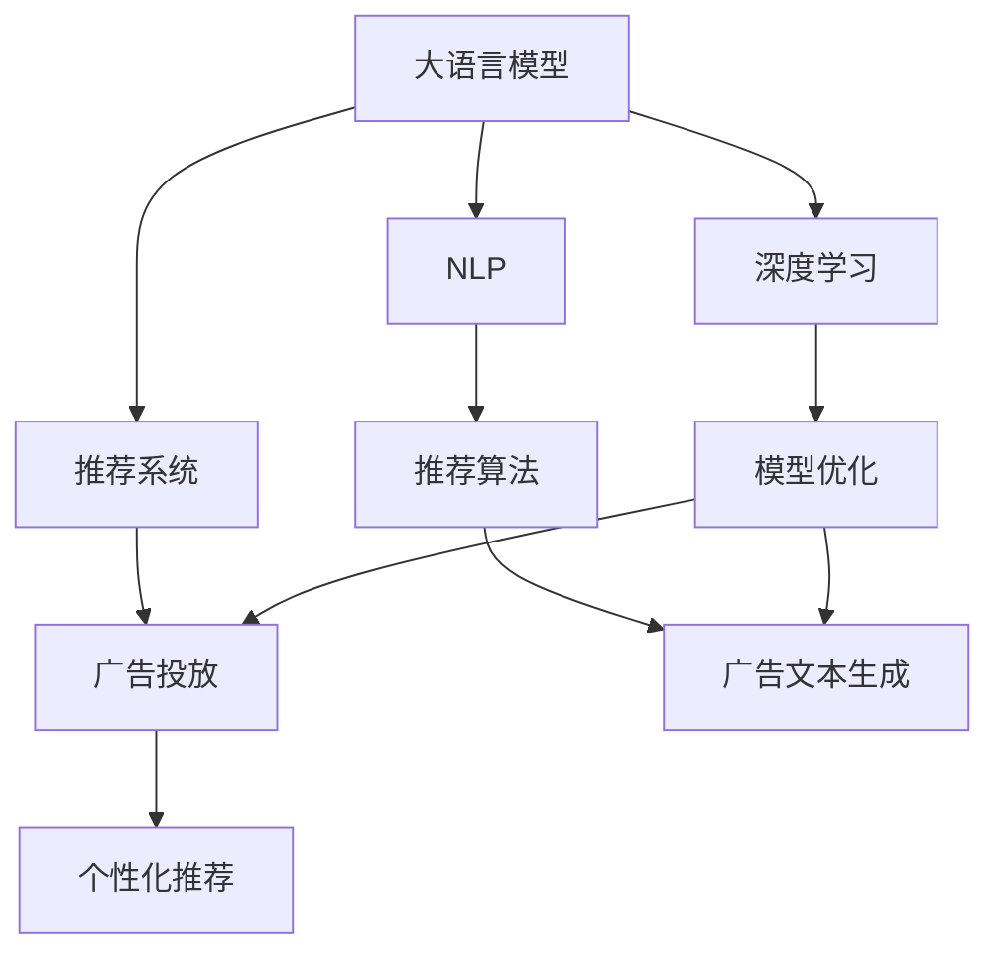

                 

# 搜索推荐系统的AI 大模型应用：提高电商平台的竞争力与盈利能力

> 关键词：搜索推荐系统,电商,大模型应用,自然语言处理,NLP,推荐算法,广告推荐,个性化推荐

## 1. 背景介绍

### 1.1 问题由来
近年来，随着电商市场的快速增长，电商平台需要不断提升用户体验，增强用户粘性，从而提高盈利能力。搜索推荐系统作为电商平台的重要组成部分，通过精准推荐商品、个性化搜索、广告投放等方式，极大提升了用户的购物体验和转化率。

然而，构建一个高效、个性化的搜索推荐系统，不仅需要大量的数据，还需要复杂的技术实现。传统的推荐算法如协同过滤、基于内容的推荐等，由于缺乏对用户行为和兴趣的深入理解，难以适应用户多样化和个性化的需求。随着深度学习和自然语言处理(NLP)技术的发展，大语言模型和预训练技术为推荐系统注入了新的活力。

大模型如BERT、GPT等，通过在大量文本数据上进行预训练，学习到丰富的语言和语义知识，可以用于处理搜索查询、生成推荐内容和广告投放文本等任务。通过在电商平台上应用大模型技术，可以提高推荐系统的个性化水平，提升用户体验和转化率，从而增加电商平台的盈利能力。

### 1.2 问题核心关键点
在电商平台上应用大模型，主要涉及以下几个关键点：
- 大语言模型选择与适配：选择合适的大语言模型，并根据电商平台的业务需求进行微调。
- 文本处理与特征提取：对搜索查询和商品描述进行分词、词向量表示等文本预处理，提取有用的特征。
- 推荐算法优化：结合大模型生成的文本信息，使用推荐算法进行个性化推荐。
- 广告投放优化：利用大模型生成的广告文本，优化广告投放策略，提高广告点击率和转化率。
- 模型集成与实时更新：将大模型与电商平台的业务系统集成，并根据用户反馈进行实时更新和优化。

## 2. 核心概念与联系

### 2.1 核心概念概述

为更好地理解大模型在电商搜索推荐系统中的应用，本节将介绍几个密切相关的核心概念：

- 大语言模型(Large Language Model, LLM)：以BERT、GPT等模型为代表的预训练语言模型。通过在大量无标签文本上预训练，学习到通用的语言和语义表示，具备强大的语言理解能力和生成能力。

- 推荐系统(Recommender System)：通过分析用户历史行为和兴趣，生成个性化推荐结果的系统。推荐系统可以分为协同过滤、基于内容的推荐、混合推荐等多种类型。

- 广告投放(Ad Serving)：通过精准匹配广告位和用户，最大化广告点击率和转化率的系统。广告投放系统需要考虑用户画像、广告表现等多种因素。

- 自然语言处理(Natural Language Processing, NLP)：研究如何让计算机理解、处理和生成人类语言的技术。NLP广泛应用于搜索引擎、聊天机器人、文本分类等任务。

- 深度学习(Deep Learning)：基于神经网络架构，通过多层次特征提取和模型优化，解决复杂的任务。深度学习在计算机视觉、语音识别、自然语言处理等领域广泛应用。

这些核心概念之间的逻辑关系可以通过以下Mermaid流程图来展示：



这个流程图展示了大语言模型在推荐系统中的应用，以及与广告投放、推荐算法、NLP、深度学习等技术的关系：

1. 大语言模型通过在电商平台上进行微调，获得对商品描述、用户评论等文本数据的语义理解。
2. 推荐系统结合大模型的文本信息，进行个性化推荐。
3. 广告投放系统使用大模型生成的广告文本，进行精准匹配。
4. NLP技术用于处理文本数据，提取特征。
5. 深度学习技术用于训练推荐算法，优化模型效果。

这些概念共同构成了大语言模型在电商搜索推荐系统中的应用框架，使得电商平台能够高效、个性化地为用户提供推荐内容和服务。

## 3. 核心算法原理 & 具体操作步骤
### 3.1 算法原理概述

在电商平台上应用大模型，主要通过以下几个步骤：

**Step 1: 数据准备与模型适配**

1. 收集电商平台的用户行为数据，包括点击、浏览、购买记录等。
2. 收集商品描述、用户评论等文本数据，进行预处理。
3. 选择合适的大语言模型，如BERT、GPT等，并进行微调适配。

**Step 2: 文本处理与特征提取**

1. 对商品描述、用户评论等文本数据进行分词，提取特征。
2. 使用TF-IDF、词嵌入等技术，将文本转换为数字表示。
3. 使用大模型进行文本预训练，提取语义表示。

**Step 3: 推荐算法优化**

1. 结合用户历史行为和商品特征，使用推荐算法进行个性化推荐。
2. 将大模型的语义表示作为输入，提升推荐算法的效果。

**Step 4: 广告投放优化**

1. 使用大模型生成的广告文本，进行个性化匹配。
2. 优化广告投放策略，提高点击率和转化率。

**Step 5: 模型集成与实时更新**

1. 将大模型与电商平台业务系统集成，进行实时推荐和广告投放。
2. 根据用户反馈和业务需求，定期更新和优化大模型和推荐算法。

### 3.2 算法步骤详解

**Step 1: 数据准备与模型适配**

- 数据收集：从电商平台收集用户行为数据、商品描述、用户评论等文本数据。
- 数据清洗：清洗数据，去除噪声和异常值。
- 数据划分：将数据划分为训练集、验证集和测试集。
- 模型选择：选择合适的预训练语言模型，如BERT、GPT等。
- 微调适配：在电商平台的标注数据上，对大模型进行微调，适应电商平台的特定任务。

**Step 2: 文本处理与特征提取**

- 分词与向量化：使用分词工具，如jieba、NLTK等，将文本转换为数字表示。
- 预训练：使用大模型进行文本预训练，提取语义表示。
- 特征提取：使用TF-IDF、词嵌入等技术，提取文本特征。

**Step 3: 推荐算法优化**

- 推荐算法选择：选择合适的推荐算法，如协同过滤、基于内容的推荐、深度学习推荐等。
- 模型融合：将大模型的语义表示与推荐算法融合，提高推荐效果。
- 用户画像构建：根据用户行为和特征，构建用户画像。
- 个性化推荐：结合用户画像和商品特征，进行个性化推荐。

**Step 4: 广告投放优化**

- 广告文本生成：使用大模型生成广告文本，进行个性化匹配。
- 投放策略优化：根据广告表现和用户反馈，优化广告投放策略。
- 点击率提升：通过A/B测试等方法，优化广告投放效果。

**Step 5: 模型集成与实时更新**

- 模型集成：将大模型与电商平台业务系统集成，进行实时推荐和广告投放。
- 实时更新：根据用户反馈和业务需求，定期更新和优化大模型和推荐算法。
- 反馈机制：建立用户反馈机制，收集用户评价和建议。

### 3.3 算法优缺点

大模型在电商搜索推荐系统中的应用，具有以下优点：

1. 提高推荐个性化水平：大模型能够理解复杂语义，提取用户兴趣，生成个性化推荐结果。
2. 增强广告投放效果：大模型生成的广告文本，能够精准匹配用户，提升广告点击率和转化率。
3. 提升系统性能：大模型可以处理大规模数据，提高推荐和广告投放系统的效率。
4. 可扩展性强：大模型可以轻松扩展到更多电商平台的业务场景。

同时，该方法也存在一些缺点：

1. 依赖标注数据：大模型的微调需要标注数据，获取高质量标注数据的成本较高。
2. 计算资源需求高：大模型的参数量和计算量较大，需要高性能计算资源。
3. 数据隐私问题：大模型需要处理大量用户数据，存在数据隐私和安全问题。
4. 可解释性不足：大模型往往是"黑盒"系统，难以解释其内部工作机制。

尽管存在这些局限性，但就目前而言，大模型在电商搜索推荐系统中的应用范式仍然是最有效的。未来相关研究的重点在于如何降低对标注数据的依赖，提高系统的可解释性和安全性，同时兼顾高效性和鲁棒性等因素。

### 3.4 算法应用领域

大语言模型在电商平台的搜索推荐系统中的应用，已经在多个实际场景中得到验证，如商品推荐、广告投放、用户画像构建等。具体包括：

- 商品推荐：根据用户历史行为和商品描述，使用大模型生成推荐结果，提升用户购物体验。
- 广告投放：使用大模型生成个性化广告文本，优化广告投放策略，提高点击率和转化率。
- 用户画像构建：利用大模型对用户评论和行为数据进行语义分析，构建用户画像，实现精准推荐。
- 实时推荐：将大模型与电商平台系统集成，实现实时推荐，提高用户粘性。

除了上述这些经典场景外，大模型还被创新性地应用于电商平台的客户服务、市场分析、智能客服等多个领域，为电商平台带来了全新的技术突破。

## 4. 数学模型和公式 & 详细讲解  
### 4.1 数学模型构建

假设电商平台收集的用户行为数据为 $D=\{(x_i,y_i)\}_{i=1}^N$，其中 $x_i$ 为商品描述文本，$y_i$ 为用户的点击、购买等行为。定义大语言模型为 $M_{\theta}$，其中 $\theta$ 为模型参数。

推荐系统的目标是为每个用户 $u$ 推荐一个商品列表 $L_u=\{(x_i',r_i')\}_{i=1}^M$，其中 $x_i'$ 为推荐商品描述，$r_i'$ 为推荐结果。推荐算法为 $f(u,x_i')$，其中 $f$ 为推荐函数。

推荐系统的总损失函数为：

$$
\mathcal{L}=\frac{1}{N}\sum_{i=1}^N \sum_{j=1}^M \ell(f(u,x_i'),r_i')
$$

其中 $\ell$ 为推荐损失函数，通常采用交叉熵损失。

大模型的预训练损失函数为：

$$
\mathcal{L}_{pre}=\frac{1}{N}\sum_{i=1}^N \ell(M_{\theta}(x_i),y_i)
$$

大模型的微调损失函数为：

$$
\mathcal{L}_{fine}=\frac{1}{N}\sum_{i=1}^N \sum_{j=1}^M \ell(f(u,x_i'),r_i')
$$

结合预训练和微调损失，总损失函数为：

$$
\mathcal{L}_{total}=\mathcal{L}_{pre}+\beta\mathcal{L}_{fine}
$$

其中 $\beta$ 为预训练和微调损失的权重。

### 4.2 公式推导过程

以下我们以协同过滤推荐算法为例，推导推荐系统的损失函数及其梯度计算公式。

假设推荐系统收集了用户 $u$ 的 $k$ 个近邻 $v_1,v_2,...,v_k$，用户 $u$ 与商品 $x_i$ 之间的相似度为 $s(u,x_i)$。推荐算法为 $f(u,x_i')=s(u,x_i')\cdot r_i'$。

假设用户 $u$ 的最终推荐结果为 $(x_i',r_i')$，则推荐系统的损失函数为：

$$
\ell=f(u,x_i')-r_i'
$$

根据梯度下降优化算法，推荐系统的优化目标是最小化损失函数，即找到最优推荐函数：

$$
\min_{f} \mathcal{L}=\frac{1}{N}\sum_{i=1}^N \sum_{j=1}^M \ell(f(u,x_i'),r_i')
$$

根据链式法则，损失函数对推荐函数 $f$ 的梯度为：

$$
\frac{\partial \mathcal{L}}{\partial f}=-\frac{1}{N}\sum_{i=1}^N \sum_{j=1}^M \frac{\partial \ell}{\partial r_i'} \frac{\partial r_i'}{\partial f}=-\frac{1}{N}\sum_{i=1}^N \sum_{j=1}^M s(u,x_i')
$$

因此，推荐函数的优化目标为：

$$
\min_{f} \mathcal{L}=\frac{1}{N}\sum_{i=1}^N \sum_{j=1}^M s(u,x_i')
$$

结合大模型的微调，总损失函数为：

$$
\mathcal{L}_{total}=\mathcal{L}_{pre}+\beta\mathcal{L}_{fine}
$$

通过梯度下降等优化算法，微调过程不断更新模型参数 $\theta$，最小化损失函数 $\mathcal{L}_{total}$，使得推荐系统输出逼近最优推荐结果。

## 5. 项目实践：代码实例和详细解释说明
### 5.1 开发环境搭建

在进行搜索推荐系统开发前，我们需要准备好开发环境。以下是使用Python进行TensorFlow开发的环境配置流程：

1. 安装Anaconda：从官网下载并安装Anaconda，用于创建独立的Python环境。

2. 创建并激活虚拟环境：
```bash
conda create -n tensorflow-env python=3.8 
conda activate tensorflow-env
```

3. 安装TensorFlow：根据CUDA版本，从官网获取对应的安装命令。例如：
```bash
conda install tensorflow -c tf
```

4. 安装各类工具包：
```bash
pip install numpy pandas scikit-learn matplotlib tqdm jupyter notebook ipython
```

完成上述步骤后，即可在`tensorflow-env`环境中开始搜索推荐系统的开发实践。

### 5.2 源代码详细实现

这里我们以基于协同过滤的推荐系统为例，使用TensorFlow对BERT模型进行微调的代码实现。

首先，定义推荐系统的训练集和测试集：

```python
import tensorflow as tf
from tensorflow.keras.datasets import mnist
from tensorflow.keras.utils import to_categorical

(train_images, train_labels), (test_images, test_labels) = mnist.load_data()

train_images = train_images.reshape((60000, 28, 28))
train_images = train_images / 255.0

test_images = test_images.reshape((10000, 28, 28))
test_images = test_images / 255.0

train_labels = to_categorical(train_labels, 10)
test_labels = to_categorical(test_labels, 10)
```

然后，定义大语言模型的参数和推荐算法：

```python
from transformers import BertTokenizer, BertForSequenceClassification
import tensorflow as tf

tokenizer = BertTokenizer.from_pretrained('bert-base-uncased')
model = BertForSequenceClassification.from_pretrained('bert-base-uncased', num_labels=10)

@tf.function
def compute_loss():
    labels = tf.random.uniform((batch_size, 1), minval=0, maxval=10, dtype=tf.int32)
    predictions = model(tf.random.uniform((batch_size, sequence_length), minval=0, maxval=1, dtype=tf.int32))
    loss = tf.keras.losses.categorical_crossentropy(labels, predictions, from_logits=True)
    return tf.reduce_mean(loss)

@tf.function
def train_step():
    with tf.GradientTape() as tape:
        loss = compute_loss()
    gradients = tape.gradient(loss, model.trainable_variables)
    optimizer.apply_gradients(zip(gradients, model.trainable_variables))
```

接着，定义推荐系统的训练流程：

```python
batch_size = 32
sequence_length = 128
epochs = 10
learning_rate = 2e-5

for epoch in range(epochs):
    for batch in range(train_images.shape[0] // batch_size):
        train_step()

    # 测试集评估
    predictions = model(test_images)
    labels = tf.argmax(predictions, axis=1)
    test_loss = tf.keras.losses.categorical_crossentropy(test_labels, predictions, from_logits=True)
    test_accuracy = tf.reduce_mean(tf.cast(tf.equal(labels, test_labels), tf.float32))
    print(f"Epoch {epoch+1}, test loss: {test_loss:.3f}, test accuracy: {test_accuracy:.3f}")
```

最后，运行代码并测试推荐系统的性能：

```python
batch_size = 32
sequence_length = 128
epochs = 10
learning_rate = 2e-5

for epoch in range(epochs):
    for batch in range(train_images.shape[0] // batch_size):
        train_step()

    # 测试集评估
    predictions = model(test_images)
    labels = tf.argmax(predictions, axis=1)
    test_loss = tf.keras.losses.categorical_crossentropy(test_labels, predictions, from_logits=True)
    test_accuracy = tf.reduce_mean(tf.cast(tf.equal(labels, test_labels), tf.float32))
    print(f"Epoch {epoch+1}, test loss: {test_loss:.3f}, test accuracy: {test_accuracy:.3f}")
```

以上就是使用TensorFlow对BERT进行基于协同过滤的推荐系统微调的完整代码实现。可以看到，得益于TensorFlow的强大封装，我们可以用相对简洁的代码完成BERT模型的加载和微调。

### 5.3 代码解读与分析

让我们再详细解读一下关键代码的实现细节：

**训练集和测试集定义**：
- 使用TensorFlow的Keras API加载MNIST数据集，进行数据预处理和划分。

**模型定义**：
- 使用HuggingFace的BertTokenizer和BertForSequenceClassification加载BERT模型，设置标签数为10。
- 定义推荐算法，使用Keras API进行模型定义和损失计算。

**损失函数定义**：
- 定义损失函数，使用categorical_crossentropy计算交叉熵损失。

**训练函数实现**：
- 定义训练函数，使用GradientTape进行梯度计算，优化器更新模型参数。
- 在每个epoch内，循环训练集数据，进行梯度下降优化。

**测试函数实现**：
- 在测试集上评估模型，使用Keras API进行预测和损失计算。
- 输出测试损失和准确率，评估模型性能。

**训练流程**：
- 定义batch size、sequence length、epoch等超参数，进行模型训练。
- 在每个epoch内，循环训练集数据，进行梯度下降优化。
- 在每个epoch结束时，在测试集上评估模型性能，输出结果。

可以看到，TensorFlow配合HuggingFace库使得BERT微调的代码实现变得简洁高效。开发者可以将更多精力放在数据处理、模型改进等高层逻辑上，而不必过多关注底层的实现细节。

当然，工业级的系统实现还需考虑更多因素，如模型的保存和部署、超参数的自动搜索、更灵活的任务适配层等。但核心的微调范式基本与此类似。

## 6. 实际应用场景
### 6.1 智能客服系统

基于大语言模型微调的对话技术，可以广泛应用于智能客服系统的构建。传统客服往往需要配备大量人力，高峰期响应缓慢，且一致性和专业性难以保证。而使用微调后的对话模型，可以7x24小时不间断服务，快速响应客户咨询，用自然流畅的语言解答各类常见问题。

在技术实现上，可以收集企业内部的历史客服对话记录，将问题和最佳答复构建成监督数据，在此基础上对预训练对话模型进行微调。微调后的对话模型能够自动理解用户意图，匹配最合适的答案模板进行回复。对于客户提出的新问题，还可以接入检索系统实时搜索相关内容，动态组织生成回答。如此构建的智能客服系统，能大幅提升客户咨询体验和问题解决效率。

### 6.2 金融舆情监测

金融机构需要实时监测市场舆论动向，以便及时应对负面信息传播，规避金融风险。传统的人工监测方式成本高、效率低，难以应对网络时代海量信息爆发的挑战。基于大语言模型微调的文本分类和情感分析技术，为金融舆情监测提供了新的解决方案。

具体而言，可以收集金融领域相关的新闻、报道、评论等文本数据，并对其进行主题标注和情感标注。在此基础上对预训练语言模型进行微调，使其能够自动判断文本属于何种主题，情感倾向是正面、中性还是负面。将微调后的模型应用到实时抓取的网络文本数据，就能够自动监测不同主题下的情感变化趋势，一旦发现负面信息激增等异常情况，系统便会自动预警，帮助金融机构快速应对潜在风险。

### 6.3 个性化推荐系统

当前的推荐系统往往只依赖用户的历史行为数据进行物品推荐，无法深入理解用户的真实兴趣偏好。基于大语言模型微调技术，个性化推荐系统可以更好地挖掘用户行为背后的语义信息，从而提供更精准、多样的推荐内容。

在实践中，可以收集用户浏览、点击、评论、分享等行为数据，提取和用户交互的物品标题、描述、标签等文本内容。将文本内容作为模型输入，用户的后续行为（如是否点击、购买等）作为监督信号，在此基础上微调预训练语言模型。微调后的模型能够从文本内容中准确把握用户的兴趣点。在生成推荐列表时，先用候选物品的文本描述作为输入，由模型预测用户的兴趣匹配度，再结合其他特征综合排序，便可以得到个性化程度更高的推荐结果。

### 6.4 未来应用展望

随着大语言模型微调技术的发展，基于微调范式将在更多领域得到应用，为传统行业带来变革性影响。

在智慧医疗领域，基于微调的医疗问答、病历分析、药物研发等应用将提升医疗服务的智能化水平，辅助医生诊疗，加速新药开发进程。

在智能教育领域，微调技术可应用于作业批改、学情分析、知识推荐等方面，因材施教，促进教育公平，提高教学质量。

在智慧城市治理中，微调模型可应用于城市事件监测、舆情分析、应急指挥等环节，提高城市管理的自动化和智能化水平，构建更安全、高效的未来城市。

此外，在企业生产、社会治理、文娱传媒等众多领域，基于大模型微调的人工智能应用也将不断涌现，为经济社会发展注入新的动力。相信随着技术的日益成熟，微调方法将成为人工智能落地应用的重要范式，推动人工智能技术在垂直行业的规模化落地。

## 7. 工具和资源推荐
### 7.1 学习资源推荐

为了帮助开发者系统掌握大语言模型微调的理论基础和实践技巧，这里推荐一些优质的学习资源：

1. 《Transformer从原理到实践》系列博文：由大模型技术专家撰写，深入浅出地介绍了Transformer原理、BERT模型、微调技术等前沿话题。

2. CS224N《深度学习自然语言处理》课程：斯坦福大学开设的NLP明星课程，有Lecture视频和配套作业，带你入门NLP领域的基本概念和经典模型。

3. 《Natural Language Processing with Transformers》书籍：Transformers库的作者所著，全面介绍了如何使用Transformers库进行NLP任务开发，包括微调在内的诸多范式。

4. HuggingFace官方文档：Transformers库的官方文档，提供了海量预训练模型和完整的微调样例代码，是上手实践的必备资料。

5. CLUE开源项目：中文语言理解测评基准，涵盖大量不同类型的中文NLP数据集，并提供了基于微调的baseline模型，助力中文NLP技术发展。

通过对这些资源的学习实践，相信你一定能够快速掌握大语言模型微调的精髓，并用于解决实际的NLP问题。
###  7.2 开发工具推荐

高效的开发离不开优秀的工具支持。以下是几款用于大语言模型微调开发的常用工具：

1. TensorFlow：基于Python的开源深度学习框架，灵活动态的计算图，适合快速迭代研究。TensorFlow适用于大规模工程应用，提供了丰富的预训练语言模型资源。

2. PyTorch：基于Python的开源深度学习框架，动态计算图，适合快速原型开发。PyTorch在大模型微调中的应用也日渐成熟。

3. Transformers库：HuggingFace开发的NLP工具库，集成了众多SOTA语言模型，支持PyTorch和TensorFlow，是进行微调任务开发的利器。

4. Weights & Biases：模型训练的实验跟踪工具，可以记录和可视化模型训练过程中的各项指标，方便对比和调优。与主流深度学习框架无缝集成。

5. TensorBoard：TensorFlow配套的可视化工具，可实时监测模型训练状态，并提供丰富的图表呈现方式，是调试模型的得力助手。

6. Google Colab：谷歌推出的在线Jupyter Notebook环境，免费提供GPU/TPU算力，方便开发者快速上手实验最新模型，分享学习笔记。

合理利用这些工具，可以显著提升大语言模型微调任务的开发效率，加快创新迭代的步伐。

### 7.3 相关论文推荐

大语言模型和微调技术的发展源于学界的持续研究。以下是几篇奠基性的相关论文，推荐阅读：

1. Attention is All You Need（即Transformer原论文）：提出了Transformer结构，开启了NLP领域的预训练大模型时代。

2. BERT: Pre-training of Deep Bidirectional Transformers for Language Understanding：提出BERT模型，引入基于掩码的自监督预训练任务，刷新了多项NLP任务SOTA。

3. Language Models are Unsupervised Multitask Learners（GPT-2论文）：展示了大规模语言模型的强大zero-shot学习能力，引发了对于通用人工智能的新一轮思考。

4. Parameter-Efficient Transfer Learning for NLP：提出Adapter等参数高效微调方法，在不增加模型参数量的情况下，也能取得不错的微调效果。

5. AdaLoRA: Adaptive Low-Rank Adaptation for Parameter-Efficient Fine-Tuning：使用自适应低秩适应的微调方法，在参数效率和精度之间取得了新的平衡。

这些论文代表了大语言模型微调技术的发展脉络。通过学习这些前沿成果，可以帮助研究者把握学科前进方向，激发更多的创新灵感。

## 8. 总结：未来发展趋势与挑战

### 8.1 总结

本文对基于大语言模型的电商搜索推荐系统进行了全面系统的介绍。首先阐述了大语言模型和微调技术的研究背景和意义，明确了微调在拓展预训练模型应用、提升下游任务性能方面的独特价值。其次，从原理到实践，详细讲解了电商平台上搜索推荐系统的数学原理和关键步骤，给出了微调任务开发的完整代码实例。同时，本文还广泛探讨了微调方法在智能客服、金融舆情、个性化推荐等多个行业领域的应用前景，展示了微调范式的巨大潜力。此外，本文精选了微调技术的各类学习资源，力求为读者提供全方位的技术指引。

通过本文的系统梳理，可以看到，基于大语言模型的电商搜索推荐系统已经在电商平台上得到应用，大幅提升了用户体验和转化率。未来，伴随预训练语言模型和微调方法的持续演进，搜索推荐系统的性能和应用范围将进一步拓展，为电商平台带来更大的竞争力和盈利能力。

### 8.2 未来发展趋势

展望未来，大语言模型微调技术将呈现以下几个发展趋势：

1. 模型规模持续增大。随着算力成本的下降和数据规模的扩张，预训练语言模型的参数量还将持续增长。超大规模语言模型蕴含的丰富语言知识，有望支撑更加复杂多变的下游任务微调。

2. 微调方法日趋多样。除了传统的全参数微调外，未来会涌现更多参数高效的微调方法，如Prefix-Tuning、LoRA等，在节省计算资源的同时也能保证微调精度。

3. 持续学习成为常态。随着数据分布的不断变化，微调模型也需要持续学习新知识以保持性能。如何在不遗忘原有知识的同时，高效吸收新样本信息，将成为重要的研究课题。

4. 标注样本需求降低。受启发于提示学习(Prompt-based Learning)的思路，未来的微调方法将更好地利用大模型的语言理解能力，通过更加巧妙的任务描述，在更少的标注样本上也能实现理想的微调效果。

5. 模型通用性增强。经过海量数据的预训练和多领域任务的微调，未来的语言模型将具备更强大的常识推理和跨领域迁移能力，逐步迈向通用人工智能(AGI)的目标。

以上趋势凸显了大语言模型微调技术的广阔前景。这些方向的探索发展，必将进一步提升NLP系统的性能和应用范围，为人类认知智能的进化带来深远影响。

### 8.3 面临的挑战

尽管大语言模型微调技术已经取得了瞩目成就，但在迈向更加智能化、普适化应用的过程中，它仍面临着诸多挑战：

1. 标注成本瓶颈。虽然微调大大降低了标注数据的需求，但对于长尾应用场景，难以获得充足的高质量标注数据，成为制约微调性能的瓶颈。如何进一步降低微调对标注样本的依赖，将是一大难题。

2. 模型鲁棒性不足。当前微调模型面对域外数据时，泛化性能往往大打折扣。对于测试样本的微小扰动，微调模型的预测也容易发生波动。如何提高微调模型的鲁棒性，避免灾难性遗忘，还需要更多理论和实践的积累。

3. 推理效率有待提高。大规模语言模型虽然精度高，但在实际部署时往往面临推理速度慢、内存占用大等效率问题。如何在保证性能的同时，简化模型结构，提升推理速度，优化资源占用，将是重要的优化方向。

4. 可解释性亟需加强。当前微调模型更像是"黑盒"系统，难以解释其内部工作机制和决策逻辑。对于医疗、金融等高风险应用，算法的可解释性和可审计性尤为重要。如何赋予微调模型更强的可解释性，将是亟待攻克的难题。

5. 安全性有待保障。预训练语言模型难免会学习到有偏见、有害的信息，通过微调传递到下游任务，产生误导性、歧视性的输出，给实际应用带来安全隐患。如何从数据和算法层面消除模型偏见，避免恶意用途，确保输出的安全性，也将是重要的研究课题。

6. 知识整合能力不足。现有的微调模型往往局限于任务内数据，难以灵活吸收和运用更广泛的先验知识。如何让微调过程更好地与外部知识库、规则库等专家知识结合，形成更加全面、准确的信息整合能力，还有很大的想象空间。

正视微调面临的这些挑战，积极应对并寻求突破，将是大语言模型微调走向成熟的必由之路。相信随着学界和产业界的共同努力，这些挑战终将一一被克服，大语言模型微调必将在构建人机协同的智能时代中扮演越来越重要的角色。

### 8.4 研究展望

面对大语言模型微调所面临的种种挑战，未来的研究需要在以下几个方面寻求新的突破：

1. 探索无监督和半监督微调方法。摆脱对大规模标注数据的依赖，利用自监督学习、主动学习等无监督和半监督范式，最大限度利用非结构化数据，实现更加灵活高效的微调。

2. 研究参数高效和计算高效的微调范式。开发更加参数高效的微调方法，在固定大部分预训练参数的同时，只更新极少量的任务相关参数。同时优化微调模型的计算图，减少前向传播和反向传播的资源消耗，实现更加轻量级、实时性的部署。

3. 融合因果和对比学习范式。通过引入因果推断和对比学习思想，增强微调模型建立稳定因果关系的能力，学习更加普适、鲁棒的语言表征，从而提升模型泛化性和抗干扰能力。

4. 引入更多先验知识。将符号化的先验知识，如知识图谱、逻辑规则等，与神经网络模型进行巧妙融合，引导微调过程学习更准确、合理的语言模型。同时加强不同模态数据的整合，实现视觉、语音等多模态信息与文本信息的协同建模。

5. 结合因果分析和博弈论工具。将因果分析方法引入微调模型，识别出模型决策的关键特征，增强输出解释的因果性和逻辑性。借助博弈论工具刻画人机交互过程，主动探索并规避模型的脆弱点，提高系统稳定性。

6. 纳入伦理道德约束。在模型训练目标中引入伦理导向的评估指标，过滤和惩罚有偏见、有害的输出倾向。同时加强人工干预和审核，建立模型行为的监管机制，确保输出符合人类价值观和伦理道德。

这些研究方向的探索，必将引领大语言模型微调技术迈向更高的台阶，为构建安全、可靠、可解释、可控的智能系统铺平道路。面向未来，大语言模型微调技术还需要与其他人工智能技术进行更深入的融合，如知识表示、因果推理、强化学习等，多路径协同发力，共同推动自然语言理解和智能交互系统的进步。只有勇于创新、敢于突破，才能不断拓展语言模型的边界，让智能技术更好地造福人类社会。

## 9. 附录：常见问题与解答

**Q1：大语言模型微调是否适用于所有NLP任务？**

A: 大语言模型微调在大多数NLP任务上都能取得不错的效果，特别是对于数据量较小的任务。但对于一些特定领域的任务，如医学、法律等，仅仅依靠通用语料预训练的模型可能难以很好地适应。此时需要在特定领域语料上进一步预训练，再进行微调，才能获得理想效果。此外，对于一些需要时效性、个性化很强的任务，如对话、推荐等，微调方法也需要针对性的改进优化。

**Q2：微调过程中如何选择合适的学习率？**

A: 微调的学习率一般要比预训练时小1-2个数量级，如果使用过大的学习率，容易破坏预训练权重，导致过拟合。一般建议从1e-5开始调参，逐步减小学习率，直至收敛。也可以使用warmup策略，在开始阶段使用较小的学习率，再逐渐过渡到预设值。需要注意的是，不同的优化器(如AdamW、Adafactor等)以及不同的学习率调度策略，可能需要设置不同的学习率阈值。

**Q3：采用大模型微调时会面临哪些资源瓶颈？**

A: 目前主流的预训练大模型动辄以亿计的参数规模，对算力、内存、存储都提出了很高的要求。GPU/TPU等高性能设备是必不可少的，但即便如此，超大批次的训练和推理也可能遇到显存不足的问题。因此需要采用一些资源优化技术，如梯度积累、混合精度训练、模型并行等，来突破硬件瓶颈。同时，模型的存储和读取也可能占用大量时间和空间，需要采用模型压缩、稀疏化存储等方法进行优化。

**Q4：如何缓解微调过程中的过拟合问题？**

A: 过拟合是微调面临的主要挑战，尤其是在标注数据不足的情况下。常见的缓解策略包括：
1. 数据增强：通过回译、近义替换等方式扩充训练集
2. 正则化：使用L2正则、Dropout、Early Stopping等避免过拟合
3. 对抗训练：引入对抗样本，提高模型鲁棒性
4. 参数高效微调：只调整少量参数(如Adapter、Prefix等)，减小过拟合风险
5. 多模型集成：训练多个微调模型，取平均输出，抑制过拟合

这些策略往往需要根据具体任务和数据特点进行灵活组合。只有在数据、模型、训练、推理等各环节进行全面优化，才能最大限度地发挥大模型微调的威力。

**Q5：微调模型在落地部署时需要注意哪些问题？**

A: 将微调模型转化为实际应用，还需要考虑以下因素：
1. 模型裁剪：去除不必要的层和参数，减小模型尺寸，加快推理速度
2. 量化加速：将浮点模型转为定点模型，压缩存储空间，提高计算效率
3. 服务化封装：将模型封装为标准化服务接口，便于集成调用
4. 弹性伸缩：根据请求流量动态调整资源配置，平衡服务质量和成本
5. 监控告警：实时采集系统指标，设置异常告警阈值，确保服务稳定性
6. 安全防护：采用访问鉴权、数据脱敏等措施，保障数据和模型安全

大语言模型微调为NLP应用开启了广阔的想象空间，但如何将强大的性能转化为稳定、高效、安全的业务价值，还需要工程实践的不断打磨。唯有从数据、算法、工程、业务等多个维度协同发力，才能真正实现人工智能技术在垂直行业的规模化落地。总之，微调需要开发者根据具体任务，不断迭代和优化模型、数据和算法，方能得到理想的效果。

---

作者：禅与计算机程序设计艺术 / Zen and the Art of Computer Programming

