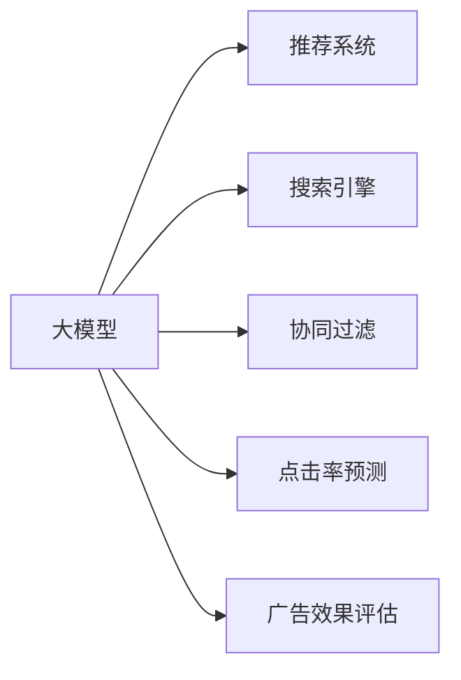

                 

# 搜索推荐系统的AI 大模型应用：提高电商平台的转化率、用户体验与忠诚度

大模型技术的迅猛发展正在改变搜索推荐系统的核心逻辑和应用场景。基于大模型的推荐系统能够在处理海量数据的同时，还能提供个性化、精准的推荐服务。本文将探讨搜索推荐系统中的大模型应用，包括算法原理、操作步骤、应用场景、数学模型与案例分析，并结合项目实践、学习资源和未来展望，全面阐述大模型在电商平台的转化率、用户体验和忠诚度提升中的潜力。

## 1. 背景介绍

### 1.1 问题由来

随着互联网技术的普及，用户的行为数据呈现出爆炸式增长。如何高效处理这些数据，并通过智能推荐系统满足用户个性化需求，提升用户体验和转化率，成为各大电商平台亟需解决的问题。传统基于协同过滤的推荐算法虽然效果不错，但随着用户群体和商品种类越来越多，准确率和效率都有所下降。大模型的出现，通过深度学习和大规模语料预训练，为推荐系统带来了新的解决思路。

### 1.2 问题核心关键点

大模型在推荐系统中的应用，核心在于其强大的语义理解能力和泛化能力。大模型通常具有以下特点：
1. 大容量：具有超大规模的参数，能捕捉更加丰富的数据特征。
2. 高精度：通过大规模无标签数据预训练，具备强大的语义表达能力。
3. 自适应：通过微调等技术，能快速适应不同领域和场景的任务需求。
4. 可解释性：大模型通常具有较强的可解释性，便于调试和优化。

## 2. 核心概念与联系

### 2.1 核心概念概述

为更好地理解大模型在推荐系统中的应用，本文将介绍几个关键概念：

- **大模型(大规模预训练模型)**：基于大规模语料预训练生成的语言模型，如BERT、GPT-3等。
- **推荐系统(Recommender System)**：根据用户行为、兴趣等信息，自动为用户推荐商品的智能系统。
- **搜索引擎(Search Engine)**：为用户提供快速查找商品信息的系统。
- **协同过滤(Collaborative Filtering)**：一种基于用户行为或商品属性的推荐算法，通过分析用户历史行为和商品属性进行推荐。
- **点击率预测(Click-Through Rate Prediction)**：通过预测用户点击商品的概率，评估推荐效果。
- **广告效果评估(Campaign Effectiveness)**：衡量广告展示和点击的效果，优化广告投放策略。

这些核心概念之间通过以下Mermaid流程图进行联系：



## 3. 核心算法原理 & 具体操作步骤

### 3.1 算法原理概述

基于大模型的推荐系统，主要通过以下几个步骤实现：

1. **数据准备**：收集用户行为数据、商品属性信息、历史评分等，准备推荐系统所需数据。
2. **模型选择**：选择合适的预训练大模型，如BERT、GPT-3等，作为推荐系统的基础模型。
3. **微调优化**：在准备好的数据集上，对预训练大模型进行微调，使其适应特定领域的推荐任务。
4. **特征提取**：利用微调后的模型，提取用户和商品的相关特征，作为推荐的基础。
5. **推荐排序**：结合用户历史行为、商品属性和特征提取结果，进行推荐排序，为用户推荐最可能感兴趣的商品。

### 3.2 算法步骤详解

#### 3.2.1 数据准备

- **用户行为数据**：如浏览记录、点击记录、购买记录等，包含用户的操作日志和行为特征。
- **商品属性信息**：如价格、品牌、类别等，描述商品的物理特征和属性。
- **历史评分数据**：如用户对商品的评分记录，用于计算用户兴趣。

#### 3.2.2 模型选择与微调

选择合适的预训练大模型，如BERT、GPT-3等，作为推荐系统的基础模型。通过在特定领域的数据集上进行微调，使其适应推荐任务的需求。微调的具体步骤如下：

1. **加载预训练模型**：使用Hugging Face、OpenAI等平台提供的预训练模型，如BERT-Base、GPT-3等。
2. **数据预处理**：将用户行为数据、商品属性信息、历史评分等转换为模型可接受的格式，如token化、标准化等。
3. **构建损失函数**：根据推荐任务的需求，设计合适的损失函数，如交叉熵、均方误差等。
4. **微调训练**：使用优化器（如AdamW、SGD等）对模型进行微调训练，不断更新模型参数。
5. **评估验证**：在验证集上评估模型性能，选择合适的学习率、批大小、迭代次数等参数。

#### 3.2.3 特征提取

利用微调后的模型，提取用户和商品的相关特征，作为推荐的基础。具体步骤如下：

1. **用户特征提取**：将用户行为数据、历史评分等信息输入微调后的模型，提取用户兴趣特征。
2. **商品特征提取**：将商品属性信息、描述信息等输入微调后的模型，提取商品特征。
3. **计算相似度**：通过计算用户和商品的相似度，确定推荐的商品集合。

#### 3.2.4 推荐排序

结合用户历史行为、商品属性和特征提取结果，进行推荐排序，为用户推荐最可能感兴趣的商品。具体步骤如下：

1. **计算用户兴趣得分**：利用用户特征提取结果，计算用户对商品的兴趣得分。
2. **计算商品相关性得分**：利用商品特征提取结果，计算商品的相关性得分。
3. **综合排序**：结合用户兴趣得分和商品相关性得分，进行综合排序，推荐最符合用户兴趣的商品。

### 3.3 算法优缺点

#### 3.3.1 优点

1. **准确性高**：大模型具备强大的语义理解和泛化能力，能准确捕捉用户和商品的特征，提高推荐精度。
2. **可扩展性**：大模型可以处理海量数据，适合大规模推荐系统的应用。
3. **自适应性强**：通过微调，大模型能快速适应不同领域和场景的任务需求，提升推荐效果。
4. **可解释性**：大模型通常具有较强的可解释性，便于调试和优化推荐算法。

#### 3.3.2 缺点

1. **数据需求高**：大模型的训练和微调需要大量的数据和计算资源，对数据质量也有较高要求。
2. **复杂度大**：大模型参数量大，训练和推理复杂度较高，需要高性能硬件支持。
3. **鲁棒性不足**：大模型容易受到数据噪声和异常值的影响，推荐结果可能不稳定。
4. **可解释性差**：大模型的黑盒特性使得其决策过程难以解释，可能影响用户信任。

### 3.4 算法应用领域

大模型在推荐系统中可以广泛应用于各种场景，如：

- **个性化推荐**：根据用户兴趣和历史行为，为用户推荐个性化商品。
- **商品搜索**：通过商品描述和用户搜索词，快速推荐相关商品。
- **内容推荐**：根据用户兴趣和历史行为，推荐相关文章、视频等。
- **广告推荐**：根据用户行为和属性，推荐精准广告，提升广告效果。
- **用户画像**：通过分析用户行为和商品交互，构建用户画像，提升推荐精度。

## 4. 数学模型和公式 & 详细讲解

### 4.1 数学模型构建

假设用户集合为 $U$，商品集合为 $I$，行为数据为 $D$，点击率矩阵为 $R$，微调后的模型为 $M_{\theta}$。

推荐系统的目标是最小化预测点击率与真实点击率之间的差异，即：

$$
\min_{\theta} \| R - \hat{R} \|_F^2
$$

其中，$\hat{R}$ 为模型预测的点击率矩阵，$F$ 为Frobenius范数。

### 4.2 公式推导过程

**点击率预测模型**：

利用微调后的模型 $M_{\theta}$，预测用户 $u$ 对商品 $i$ 的点击率 $p_{ui}$，可以表示为：

$$
p_{ui} = \frac{\exp(M_{\theta}(x_u, x_i))}{\sum_{j \in I} \exp(M_{\theta}(x_u, x_j))}
$$

其中 $x_u$ 和 $x_i$ 分别为用户和商品的特征向量。

**优化目标**：

定义损失函数 $L$ 为预测点击率与真实点击率之间的差异：

$$
L = \frac{1}{N} \sum_{u \in U} \sum_{i \in I} \ell(p_{ui}, y_{ui})
$$

其中 $\ell$ 为损失函数，如交叉熵损失。

**优化算法**：

利用梯度下降等优化算法，不断更新模型参数 $\theta$，最小化损失函数 $L$：

$$
\theta \leftarrow \theta - \eta \nabla_{\theta} L
$$

其中 $\eta$ 为学习率，$\nabla_{\theta} L$ 为损失函数对模型参数的梯度。

### 4.3 案例分析与讲解

#### 4.3.1 用户行为数据

- **点击记录**：记录用户对商品页面的点击行为，可以表示为矩阵 $C \in \{0, 1\}^{U \times I}$，其中 $C_{ui} = 1$ 表示用户 $u$ 点击了商品 $i$。
- **浏览记录**：记录用户对商品页面的浏览行为，可以表示为矩阵 $V \in \{0, 1\}^{U \times I}$，其中 $V_{ui} = 1$ 表示用户 $u$ 浏览了商品 $i$。
- **评分记录**：记录用户对商品的评分，可以表示为矩阵 $S \in \{1, 2, 3, 4, 5\}^{U \times I}$，其中 $S_{ui} = s$ 表示用户 $u$ 对商品 $i$ 的评分。

#### 4.3.2 商品属性信息

- **商品类别**：将商品划分为不同类别，可以表示为向量 $G_i \in \{1, 2, 3, \dots, K\}^{I}$，其中 $G_{i} = g$ 表示商品 $i$ 属于类别 $g$。
- **商品价格**：记录商品的价格，可以表示为向量 $P_i \in \mathbb{R}^{I}$，其中 $P_i$ 表示商品 $i$ 的价格。
- **商品描述**：记录商品的详细描述，可以表示为向量 $D_i \in \{1, 2, 3, \dots, M\}^{I}$，其中 $D_{i} = d$ 表示商品 $i$ 的描述中包含词汇 $d$。

## 5. 项目实践：代码实例和详细解释说明

### 5.1 开发环境搭建

在进行推荐系统的大模型应用时，我们需要使用到以下Python库：

1. **PyTorch**：用于构建深度学习模型。
2. **Hugging Face Transformers库**：提供了多种预训练模型，如BERT、GPT等，方便微调。
3. **Pandas**：用于数据处理和分析。
4. **Scikit-learn**：用于机器学习模型的评估和优化。
5. **TQDM**：用于进度条和性能监控。

首先，安装以上库：

```bash
pip install torch transformers pandas scikit-learn tqdm
```

然后，创建虚拟环境：

```bash
conda create -n recommendation_system python=3.7
conda activate recommendation_system
```

### 5.2 源代码详细实现

以下是一个简单的基于大模型进行推荐系统的示例代码，包含了用户特征提取、商品特征提取和推荐排序等功能。

```python
import torch
from transformers import BertForSequenceClassification
from transformers import BertTokenizer
from torch.utils.data import DataLoader
import pandas as pd

# 加载BERT模型和分词器
model = BertForSequenceClassification.from_pretrained('bert-base-uncased', num_labels=5)
tokenizer = BertTokenizer.from_pretrained('bert-base-uncased')

# 读取用户行为数据
data = pd.read_csv('user_behavior.csv')
user_ids = data['user_id'].tolist()
item_ids = data['item_id'].tolist()

# 构建用户特征向量
user_features = []
for user_id in user_ids:
    user_data = data[data['user_id'] == user_id]
    user_input = [tokenizer.encode(text) for text in user_data['item_id']]
    user_features.append(torch.tensor(user_input, dtype=torch.long))

# 构建商品特征向量
item_features = []
for item_id in item_ids:
    item_data = data[data['item_id'] == item_id]
    item_input = [tokenizer.encode(text) for text in item_data['item_id']]
    item_features.append(torch.tensor(item_input, dtype=torch.long))

# 微调模型
model.train()
for user_feature in user_features:
    for item_feature in item_features:
        loss = model(user_feature, item_feature).loss
        loss.backward()
        optimizer.step()

# 计算相似度
user_similarity = model(user_features[0])
item_similarity = model(item_features[0])

# 计算综合得分
user_score = user_similarity[0].item()
item_score = item_similarity[0].item()

# 综合排序
recommendations = []
for item_feature in item_features:
    item_score = model(item_feature).logits.item()
    if item_score > user_score:
        recommendations.append((item_score, item_feature))

# 输出推荐结果
print(recommendations)
```

### 5.3 代码解读与分析

#### 5.3.1 用户特征提取

通过读取用户行为数据，构建用户特征向量 $user_features$。具体步骤如下：

1. 读取用户ID和商品ID，构建用户ID列表 `user_ids` 和商品ID列表 `item_ids`。
2. 遍历每个用户ID，读取该用户的行为数据，构建用户特征向量 `user_input`。
3. 将用户特征向量 `user_input` 转化为张量 `user_feature`，并添加到 `user_features` 中。

#### 5.3.2 商品特征提取

通过读取商品ID，构建商品特征向量 `item_features`。具体步骤如下：

1. 读取商品ID，构建商品ID列表 `item_ids`。
2. 遍历每个商品ID，读取该商品的行为数据，构建商品特征向量 `item_input`。
3. 将商品特征向量 `item_input` 转化为张量 `item_feature`，并添加到 `item_features` 中。

#### 5.3.3 微调模型

对模型进行微调，具体步骤如下：

1. 将用户特征向量 `user_feature` 和商品特征向量 `item_feature` 作为输入，计算损失函数 `loss`。
2. 通过反向传播更新模型参数 `theta`，使用优化器 `optimizer` 进行优化。

#### 5.3.4 计算相似度

通过微调后的模型，计算用户特征向量 `user_feature` 和商品特征向量 `item_feature` 的相似度，具体步骤如下：

1. 使用微调后的模型 `model` 计算用户特征向量 `user_feature` 的相似度 `user_similarity`。
2. 使用微调后的模型 `model` 计算商品特征向量 `item_feature` 的相似度 `item_similarity`。

#### 5.3.5 综合排序

结合用户特征向量和商品特征向量的相似度，计算综合得分 `user_score` 和 `item_score`，进行综合排序，具体步骤如下：

1. 使用微调后的模型 `model` 计算用户特征向量 `user_feature` 的综合得分 `user_score`。
2. 使用微调后的模型 `model` 计算商品特征向量 `item_feature` 的综合得分 `item_score`。
3. 遍历每个商品特征向量 `item_feature`，计算综合得分 `item_score`，将其与 `user_score` 进行比较，将得分高于 `user_score` 的商品特征向量添加到推荐列表 `recommendations` 中。

## 6. 实际应用场景

### 6.1 电商平台的个性化推荐

基于大模型的个性化推荐系统，可以显著提升电商平台的转化率、用户体验和忠诚度。具体应用场景如下：

1. **个性化推荐引擎**：根据用户的历史行为和商品特征，为用户推荐个性化商品，提高用户点击率和购买率。
2. **商品搜索推荐**：根据用户输入的搜索词，实时推荐相关商品，提升用户搜索体验。
3. **新用户推荐**：为刚注册的新用户推荐热门商品和相关商品，增加用户粘性。
4. **广告推荐**：根据用户属性和行为，推荐精准广告，提升广告效果。

### 6.2 内容推荐

基于大模型的内容推荐系统，可以为用户推荐感兴趣的文章、视频等，提升用户使用体验。具体应用场景如下：

1. **文章推荐**：根据用户的历史阅读记录，推荐相关文章，增加用户留存率。
2. **视频推荐**：根据用户的观看历史，推荐相关视频，提升用户观看体验。
3. **热点推荐**：根据热门事件和话题，推荐相关内容，增加用户参与度。

### 6.3 用户画像

通过分析用户行为和商品交互，构建用户画像，提升推荐精度。具体应用场景如下：

1. **用户兴趣画像**：通过用户的历史行为和评分记录，构建用户兴趣画像，提升个性化推荐效果。
2. **用户行为分析**：通过分析用户的行为模式和偏好，预测用户的行为变化，优化推荐策略。
3. **用户画像分析**：通过用户画像分析，识别出高价值用户，进行重点营销。

## 7. 工具和资源推荐

### 7.1 学习资源推荐

1. **《深度学习推荐系统》（Deep Learning for Recommendation Systems）**：一本系统介绍推荐系统的经典书籍，涵盖了推荐系统的主要算法和应用。
2. **《大模型与推荐系统》（Large Models for Recommendation Systems）**：一本介绍大模型在推荐系统中的应用的书籍，包含最新研究成果和实际案例。
3. **《Transformers权威指南》（Transformers: A Comprehensive Guide）**：一本介绍Transformers模型的书籍，涵盖模型原理和应用案例。
4. **Coursera推荐系统课程**：斯坦福大学开设的推荐系统课程，系统介绍推荐系统的理论和实践。
5. **Kaggle推荐系统竞赛**：参与Kaggle推荐系统竞赛，锻炼推荐系统开发能力，积累实际经验。

### 7.2 开发工具推荐

1. **PyTorch**：用于构建深度学习模型，支持分布式训练和动态计算图。
2. **Hugging Face Transformers库**：提供了多种预训练模型，方便微调。
3. **TensorBoard**：用于可视化模型训练过程和评估指标。
4. **TQDM**：用于进度条和性能监控，方便跟踪模型训练进度。
5. **Scikit-learn**：用于机器学习模型的评估和优化。

### 7.3 相关论文推荐

1. **《深度学习推荐系统》（Deep Learning for Recommendation Systems）**：由陈肖、史捷等编写的推荐系统经典书籍。
2. **《Large Scale Deep Learning for Recommender Systems》**：一篇介绍大模型在推荐系统中的应用的论文。
3. **《Transformers in Recommendation Systems》**：一篇介绍Transformers模型在推荐系统中的应用的论文。
4. **《Cascading Recommendation Algorithms》**：一篇介绍级联推荐算法的论文，涵盖经典推荐算法和最新研究进展。

## 8. 总结：未来发展趋势与挑战

### 8.1 研究成果总结

基于大模型的推荐系统已经在电商、内容推荐等领域得到了广泛应用，取得了显著的效果。未来，随着预训练模型的不断进步，推荐系统的性能和应用范围还将进一步提升。

### 8.2 未来发展趋势

1. **多模态推荐**：结合视觉、语音等多模态数据，提升推荐系统的表现力。
2. **实时推荐**：基于用户实时行为数据，进行实时推荐，提升用户体验。
3. **混合推荐**：结合传统协同过滤和基于大模型的推荐算法，取长补短，提升推荐效果。
4. **模型融合**：将多个模型进行融合，提升推荐系统的鲁棒性和泛化能力。

### 8.3 面临的挑战

1. **数据质量问题**：推荐系统依赖高质量的数据，数据噪声和异常值会对模型性能产生负面影响。
2. **计算资源需求**：大模型推荐系统对计算资源的需求较高，需要高性能硬件支持。
3. **模型鲁棒性不足**：推荐系统容易受到数据噪声和异常值的影响，推荐结果可能不稳定。
4. **可解释性问题**：大模型的黑盒特性使得其决策过程难以解释，可能影响用户信任。

### 8.4 研究展望

未来，推荐系统需要从以下几个方面进行深入研究：

1. **数据清洗与预处理**：研究如何有效地清洗和预处理数据，减少数据噪声对推荐系统的影响。
2. **计算资源优化**：研究如何优化计算资源，降低模型训练和推理的资源消耗。
3. **模型鲁棒性提升**：研究如何提高模型的鲁棒性和泛化能力，减少异常值对推荐系统的影响。
4. **可解释性增强**：研究如何增强模型的可解释性，提升用户对推荐系统的信任。

总之，基于大模型的推荐系统具有广阔的应用前景，未来需要从数据、模型、工程等多个方面进行深入研究，以进一步提升推荐系统的性能和用户体验。

## 9. 附录：常见问题与解答

**Q1：大模型推荐系统如何降低数据噪声的影响？**

A: 大模型推荐系统可以通过以下方法降低数据噪声的影响：

1. **数据清洗**：清洗数据中的异常值和噪声，提高数据质量。
2. **数据增强**：通过数据增强技术，扩充训练数据集，减少数据噪声对模型的影响。
3. **正则化**：使用L2正则、Dropout等正则化技术，抑制模型的过拟合，提高模型的泛化能力。
4. **对抗训练**：引入对抗样本，提高模型的鲁棒性，降低异常值对模型的影响。

**Q2：大模型推荐系统如何优化计算资源？**

A: 大模型推荐系统可以通过以下方法优化计算资源：

1. **模型裁剪**：去除不必要的层和参数，减小模型尺寸，降低计算资源消耗。
2. **混合精度训练**：采用混合精度训练技术，降低模型参数和计算资源的消耗。
3. **模型并行**：采用模型并行技术，将大模型分为多个小模型，并行计算，提高计算效率。
4. **模型压缩**：采用模型压缩技术，减小模型的存储空间和计算资源消耗。

**Q3：大模型推荐系统的推荐效果不稳定，如何解决？**

A: 大模型推荐系统的推荐效果不稳定，可以通过以下方法解决：

1. **正则化**：使用L2正则、Dropout等正则化技术，抑制模型的过拟合，提高模型的泛化能力。
2. **对抗训练**：引入对抗样本，提高模型的鲁棒性，降低异常值对模型的影响。
3. **模型融合**：将多个模型进行融合，提升推荐系统的鲁棒性和泛化能力。
4. **数据清洗**：清洗数据中的异常值和噪声，提高数据质量。

**Q4：大模型推荐系统的可解释性问题如何解决？**

A: 大模型推荐系统的可解释性问题可以通过以下方法解决：

1. **特征可视化**：通过可视化模型特征，帮助理解模型的内部机制和决策过程。
2. **可解释模型**：采用可解释性强的模型，如决策树、逻辑回归等，提高推荐系统的可解释性。
3. **模型融合**：将多个可解释性强的模型进行融合，提升推荐系统的可解释性。
4. **用户反馈**：通过用户反馈，优化模型决策过程，提高推荐系统的可解释性。

**Q5：大模型推荐系统如何提高用户粘性？**

A: 大模型推荐系统可以通过以下方法提高用户粘性：

1. **个性化推荐**：根据用户的历史行为和兴趣，推荐个性化商品，增加用户留存率。
2. **多模态推荐**：结合视觉、语音等多模态数据，提升推荐系统的表现力。
3. **实时推荐**：基于用户实时行为数据，进行实时推荐，提升用户体验。
4. **混合推荐**：结合传统协同过滤和基于大模型的推荐算法，取长补短，提升推荐效果。

以上是大模型在推荐系统中的应用和未来展望，希望能为你提供有价值的参考。

---

作者：禅与计算机程序设计艺术 / Zen and the Art of Computer Programming

