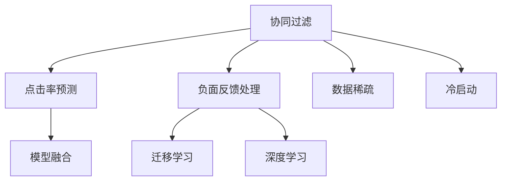
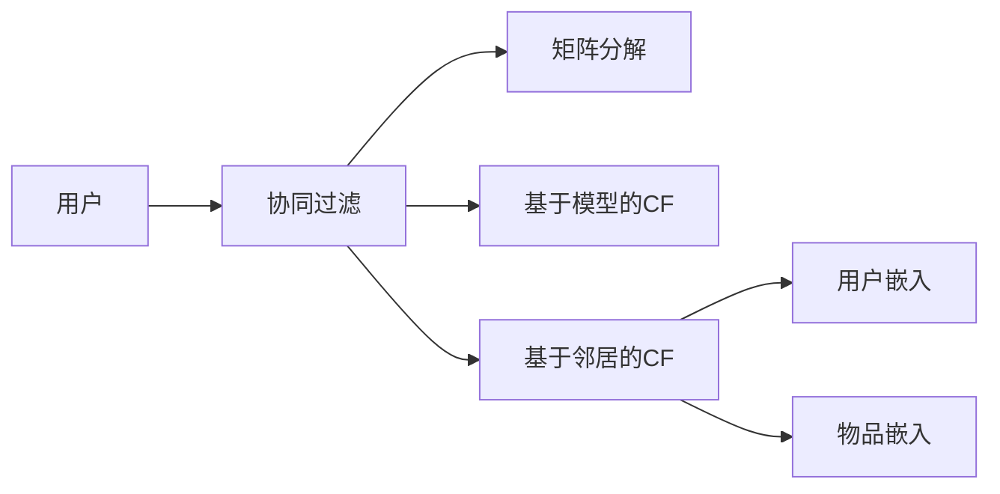

                 

# 搜索推荐系统的负面反馈处理：大模型时代的新方法

> 关键词：搜索推荐系统, 负面反馈处理, 大模型时代, 协同过滤, 模型融合, 点击率预测, 迁移学习, 深度学习

## 1. 背景介绍

### 1.1 问题由来

随着电子商务、在线视频、社交网络等平台的兴起，搜索推荐系统（Recommendation Systems, RS）日益成为用户获取信息、产品和服务的重要工具。传统的RS基于用户的历史行为数据进行推荐，但面临着数据稀疏、冷启动、新物品推荐等问题。为了克服这些问题，协同过滤（Collaborative Filtering, CF）、基于内容的推荐（Content-based Recommendation, CB）等方法被广泛应用于RS中。

然而，这些方法往往忽略了用户对推荐的负面反馈（Negative Feedback），而负面反馈对用户的购物体验和系统的点击率（Click-through Rate, CTR）都有重要影响。在实际应用中，负面反馈的处理成为搜索推荐系统面临的一项重要挑战。大模型时代，利用预训练模型和迁移学习技术，有望在负面反馈处理中发挥重要作用，但现有方法仍有诸多不足，亟需改进。

### 1.2 问题核心关键点

为了更好地理解搜索推荐系统负面反馈处理技术，本节将介绍几个密切相关的核心概念：

- 协同过滤（Collaborative Filtering, CF）：利用用户之间的相似度进行推荐，常用于解决数据稀疏和冷启动问题。
- 点击率预测（Click-Through Rate Prediction, CTR Prediction）：预测用户对推荐结果的点击行为，常作为推荐系统的优化目标。
- 负面反馈（Negative Feedback）：用户在查看推荐结果后，给出的不满意的反馈，如点击但不购买、跳过不读等。
- 模型融合（Model Fusion）：将多个推荐模型融合在一起，通过权重分配提高整体推荐效果。
- 迁移学习（Transfer Learning）：将在一个领域学到的知识，迁移应用到另一个领域，以解决数据不足的问题。
- 深度学习（Deep Learning）：利用神经网络进行复杂任务建模，在大模型时代具备优势。

这些核心概念之间的逻辑关系可以通过以下Mermaid流程图来展示：



这个流程图展示了大模型时代搜索推荐系统负面反馈处理的各个核心概念及其之间的关系：协同过滤和点击率预测为基础推荐算法；负面反馈处理针对用户反馈进行调整；模型融合通过多种算法整合提升效果；迁移学习利用已有知识避免新领域数据不足；深度学习利用预训练模型提高预测精度。

## 2. 核心概念与联系

### 2.1 核心概念概述

在负面反馈处理方面，大模型时代的新方法主要关注以下几个关键概念：

- **协同过滤（CF）**：基于用户的历史行为数据进行推荐，常用于数据稀疏和冷启动问题。协同过滤分为基于用户（User-based CF）和基于物品（Item-based CF）两种，常见方法包括矩阵分解、基于模型的CF等。

- **点击率预测（CTR Prediction）**：预测用户对推荐结果的点击行为，常作为推荐系统的优化目标。点击率预测主要基于用户特征、物品特征和用户物品交互数据，常见模型包括逻辑回归、线性回归、深度学习模型等。

- **负面反馈处理**：用户对推荐结果的反馈（如跳过、点击但不购买等）对点击率预测有重要影响。负面反馈处理旨在利用这些反馈信息，优化推荐效果。

- **模型融合（Model Fusion）**：将多个推荐模型融合在一起，通过权重分配提高整体推荐效果。模型融合分为直接融合和级联融合两种，常见方法包括简单平均、加权平均、Stacking等。

- **迁移学习（Transfer Learning）**：将在一个领域学到的知识，迁移应用到另一个领域，以解决数据不足的问题。迁移学习在大模型时代具有重要意义，可以通过迁移学习提高模型在新领域的泛化能力。

- **深度学习（Deep Learning）**：利用神经网络进行复杂任务建模，在大模型时代具备优势。深度学习模型如神经协同过滤、深度矩阵分解等，可以更好地处理大规模数据和复杂关系。

这些概念之间的逻辑关系通过以下Mermaid流程图展示：


### 2.2 核心概念原理和架构的 Mermaid 流程图

由于篇幅限制，这里只展示协同过滤的基本流程：



其中，A为用户；B为协同过滤模块，通过矩阵分解、基于模型的CF、基于邻居的CF等方法生成推荐结果；C为矩阵分解方法；D为基于模型的CF方法；E为基于邻居的CF方法，生成用户和物品的嵌入表示；F为用户嵌入；G为物品嵌入。

## 3. 核心算法原理 & 具体操作步骤

### 3.1 算法原理概述

负面反馈处理的核心目标是优化点击率预测模型，提升推荐效果。基于大模型的负面反馈处理，主要通过以下步骤实现：

1. **数据准备**：收集用户对推荐结果的负面反馈，如点击但不购买、跳过等。
2. **特征工程**：提取用户的特征、物品特征和用户物品交互数据，生成训练样本。
3. **模型训练**：在预训练模型基础上，使用负样本（Negative Sample）进行微调。
4. **模型融合**：将多个推荐模型融合在一起，通过权重分配提高整体推荐效果。

### 3.2 算法步骤详解

#### 3.2.1 数据准备

在负面反馈处理中，数据准备尤为重要。通常包括以下几个步骤：

1. **数据收集**：收集用户对推荐结果的反馈数据，如点击但不购买、跳过不读等。
2. **数据预处理**：对收集到的数据进行清洗、去重、归一化等处理。
3. **数据划分**：将数据划分为训练集、验证集和测试集。

#### 3.2.2 特征工程

特征工程是负面反馈处理的关键步骤。具体包括以下几个方面：

1. **用户特征提取**：提取用户的基本信息、历史行为、兴趣偏好等特征。
2. **物品特征提取**：提取物品的基本信息、属性、类别等特征。
3. **用户物品交互特征**：生成用户物品交互的特征，如用户对物品的评分、点击次数、浏览时间等。
4. **组合特征**：将用户特征、物品特征和用户物品交互特征进行组合，生成新的特征。

#### 3.2.3 模型训练

模型训练是负面反馈处理的核心步骤。具体包括以下几个方面：

1. **预训练模型选择**：选择适合任务的大型预训练模型，如BERT、GPT等。
2. **负样本生成**：生成负样本，用于微调模型。
3. **微调模型**：在预训练模型基础上，使用负样本进行微调，优化模型参数。

#### 3.2.4 模型融合

模型融合是通过多个推荐模型整合提升推荐效果的方法。具体包括以下几个方面：

1. **模型选择**：选择多个推荐模型，如协同过滤、深度学习模型等。
2. **融合方法**：采用加权平均、简单平均、Stacking等方法进行模型融合。
3. **融合参数优化**：优化模型的权重分配，提高整体推荐效果。

### 3.3 算法优缺点

基于大模型的负面反馈处理具有以下优点：

1. **特征表示能力强**：预训练模型能够学习到丰富的用户和物品特征，提高推荐效果。
2. **泛化能力强**：利用迁移学习，在较少标注数据的情况下也能取得良好效果。
3. **可解释性强**：利用预训练模型的知识图谱，可以对推荐过程进行解释和分析。

同时，该方法也存在一定的局限性：

1. **模型复杂度高**：预训练模型和负样本生成等步骤，增加了算法的复杂度。
2. **数据准备难度大**：负面反馈数据的收集和清洗，需要较大的工作量。
3. **模型泛化性能不稳定**：模型在新领域或新数据上的泛化性能可能不稳定。

### 3.4 算法应用领域

基于大模型的负面反馈处理技术，在搜索推荐系统中有广泛的应用，具体包括以下几个领域：

1. **电商推荐**：电商平台上，负面反馈对点击率和销售额有重要影响。通过负样本生成和模型融合，可以提高推荐效果。
2. **视频推荐**：视频平台上，用户对推荐视频的不满意反馈，会影响用户的观看行为。通过负面反馈处理，可以提升用户观看时间和满意度。
3. **音乐推荐**：音乐平台上，用户对推荐歌曲的负面反馈，会影响用户的听歌体验。通过负面反馈处理，可以提升用户听歌时长和满意度。
4. **新闻推荐**：新闻平台上，用户对推荐文章的不满意反馈，会影响用户的阅读行为。通过负面反馈处理，可以提升用户阅读时间和满意度。

除了这些领域外，负面反馈处理技术在社交网络、旅游推荐、电影推荐等众多场景中，也有广泛应用。

## 4. 数学模型和公式 & 详细讲解  
### 4.1 数学模型构建

在大模型时代，负面反馈处理通常使用协同过滤和深度学习模型。以下是协同过滤和点击率预测的数学模型构建：

#### 4.1.1 协同过滤

协同过滤的基本模型为：

$$
\hat{y} = \alpha \hat{x}^T U + \beta \hat{y}^T I
$$

其中，$\hat{y}$ 为预测的用户行为，$\hat{x}$ 为用户特征，$U$ 为物品嵌入矩阵，$I$ 为物品特征向量，$\alpha$ 和 $\beta$ 为权重系数。

#### 4.1.2 点击率预测

点击率预测常用的模型为逻辑回归模型：

$$
\hat{y} = \text{sigmoid}(\alpha \hat{x}^T U + \beta \hat{y}^T I)
$$

其中，$\hat{y}$ 为预测的用户点击行为，$\hat{x}$ 为用户特征，$U$ 为物品嵌入矩阵，$I$ 为物品特征向量，$\alpha$ 和 $\beta$ 为权重系数。

### 4.2 公式推导过程

以下以协同过滤和点击率预测为例，推导其公式推导过程。

#### 4.2.1 协同过滤

协同过滤的基本模型为：

$$
\hat{y} = \alpha \hat{x}^T U + \beta \hat{y}^T I
$$

其中，$\hat{y}$ 为预测的用户行为，$\hat{x}$ 为用户特征，$U$ 为物品嵌入矩阵，$I$ 为物品特征向量，$\alpha$ 和 $\beta$ 为权重系数。

假设训练数据集为 $D=\{(x_i,y_i)\}_{i=1}^N$，其中 $x_i$ 为用户特征，$y_i$ 为用户行为。损失函数为均方误差损失：

$$
\mathcal{L} = \frac{1}{N}\sum_{i=1}^N(y_i - \hat{y}_i)^2
$$

对模型参数 $\theta$ 求导，得：

$$
\nabla_{\theta}\mathcal{L} = -2 \frac{1}{N}\sum_{i=1}^N(y_i - \hat{y}_i)\nabla_{\theta}\hat{y}
$$

其中，$\nabla_{\theta}\hat{y}$ 为预测值对参数 $\theta$ 的梯度。利用链式法则，可以计算出：

$$
\nabla_{\theta}\hat{y} = \nabla_{\theta}\text{sigmoid}(\alpha \hat{x}^T U + \beta \hat{y}^T I) = \frac{\partial \text{sigmoid}(\alpha \hat{x}^T U + \beta \hat{y}^T I)}{\partial \theta}
$$

代入损失函数，得：

$$
\nabla_{\theta}\mathcal{L} = -2 \frac{1}{N}\sum_{i=1}^N(y_i - \hat{y}_i)\frac{\partial \text{sigmoid}(\alpha \hat{x}^T U + \beta \hat{y}^T I)}{\partial \theta}
$$

利用梯度下降算法，更新模型参数 $\theta$，得：

$$
\theta \leftarrow \theta - \eta \nabla_{\theta}\mathcal{L}
$$

其中，$\eta$ 为学习率。

#### 4.2.2 点击率预测

点击率预测常用的模型为逻辑回归模型：

$$
\hat{y} = \text{sigmoid}(\alpha \hat{x}^T U + \beta \hat{y}^T I)
$$

其中，$\hat{y}$ 为预测的用户点击行为，$\hat{x}$ 为用户特征，$U$ 为物品嵌入矩阵，$I$ 为物品特征向量，$\alpha$ 和 $\beta$ 为权重系数。

假设训练数据集为 $D=\{(x_i,y_i)\}_{i=1}^N$，其中 $x_i$ 为用户特征，$y_i$ 为用户点击行为。损失函数为交叉熵损失：

$$
\mathcal{L} = -\frac{1}{N}\sum_{i=1}^N(y_i\log\hat{y}_i + (1-y_i)\log(1-\hat{y}_i))
$$

对模型参数 $\theta$ 求导，得：

$$
\nabla_{\theta}\mathcal{L} = -\frac{1}{N}\sum_{i=1}^N(y_i - \hat{y}_i)\nabla_{\theta}\hat{y}
$$

其中，$\nabla_{\theta}\hat{y}$ 为预测值对参数 $\theta$ 的梯度。利用链式法则，可以计算出：

$$
\nabla_{\theta}\hat{y} = \frac{\partial \text{sigmoid}(\alpha \hat{x}^T U + \beta \hat{y}^T I)}{\partial \theta}
$$

代入损失函数，得：

$$
\nabla_{\theta}\mathcal{L} = -\frac{1}{N}\sum_{i=1}^N(y_i - \hat{y}_i)\frac{\partial \text{sigmoid}(\alpha \hat{x}^T U + \beta \hat{y}^T I)}{\partial \theta}
$$

利用梯度下降算法，更新模型参数 $\theta$，得：

$$
\theta \leftarrow \theta - \eta \nabla_{\theta}\mathcal{L}
$$

其中，$\eta$ 为学习率。

### 4.3 案例分析与讲解

以电商推荐为例，假设有一个电商平台，收集了用户对推荐商品的不满意反馈数据。可以利用这些数据对协同过滤模型进行微调，从而优化推荐效果。具体步骤如下：

1. **数据收集**：收集用户对推荐商品的不满意反馈数据，如点击但不购买、跳过不读等。
2. **数据预处理**：对收集到的数据进行清洗、去重、归一化等处理。
3. **特征工程**：提取用户的特征、物品的特征和用户物品交互的特征，生成训练样本。
4. **模型训练**：在预训练模型基础上，使用负样本进行微调，优化模型参数。
5. **模型融合**：将协同过滤模型和深度学习模型融合在一起，通过权重分配提高整体推荐效果。

## 5. 项目实践：代码实例和详细解释说明

### 5.1 开发环境搭建

在进行负面反馈处理实践前，我们需要准备好开发环境。以下是使用Python进行TensorFlow开发的环境配置流程：

1. 安装Anaconda：从官网下载并安装Anaconda，用于创建独立的Python环境。

2. 创建并激活虚拟环境：
```bash
conda create -n tf-env python=3.8 
conda activate tf-env
```

3. 安装TensorFlow：根据CUDA版本，从官网获取对应的安装命令。例如：
```bash
conda install tensorflow -c tf -c conda-forge
```

4. 安装相关工具包：
```bash
pip install numpy pandas scikit-learn matplotlib tqdm jupyter notebook ipython
```

完成上述步骤后，即可在`tf-env`环境中开始负面反馈处理实践。

### 5.2 源代码详细实现

这里我们以电商推荐为例，给出使用TensorFlow对协同过滤模型进行微调的PyTorch代码实现。

首先，定义协同过滤模型的数据处理函数：

```python
import tensorflow as tf
from tensorflow.keras.layers import Input, Dense, Embedding, Flatten
from tensorflow.keras.models import Model

class CollaborativeFiltering(tf.keras.Model):
    def __init__(self, num_users, num_items, embedding_dim, num_factors, learning_rate):
        super(CollaborativeFiltering, self).__init__()
        
        self.num_users = num_users
        self.num_items = num_items
        self.embedding_dim = embedding_dim
        self.num_factors = num_factors
        self.learning_rate = learning_rate
        
        self.user_embeddings = Embedding(input_dim=num_users, output_dim=embedding_dim, mask_zero=True)
        self.item_embeddings = Embedding(input_dim=num_items, output_dim=embedding_dim, mask_zero=True)
        self.factors = Dense(num_factors)
        self.dot_product = Flatten()
    
    def call(self, user_id, item_id):
        user_embedding = self.user_embeddings(user_id)
        item_embedding = self.item_embeddings(item_id)
        dot_product = tf.reduce_sum(tf.multiply(user_embedding, item_embedding), axis=-1)
        dot_product = self.factors(tf.expand_dims(dot_product, axis=1))
        dot_product = self.dot_product(dot_product)
        return dot_product
    
    def compile(self):
        self.compile(loss='mse', optimizer=tf.keras.optimizers.Adam(learning_rate=self.learning_rate))
```

然后，定义训练和评估函数：

```python
def train_model(model, train_data, val_data, epochs):
    history = model.fit(train_data, epochs=epochs, validation_data=val_data, callbacks=[tf.keras.callbacks.EarlyStopping(patience=10)])
    return history

def evaluate_model(model, test_data):
    mse = model.evaluate(test_data)
    print('Test MSE:', mse)
    
    y_true, y_pred = test_data
    mse_value = tf.reduce_mean(tf.square(y_true - y_pred))
    return mse_value.numpy()
```

最后，启动训练流程并在测试集上评估：

```python
train_data = tf.data.Dataset.from_tensor_slices((user_ids, item_ids)).batch(batch_size)
val_data = tf.data.Dataset.from_tensor_slices((user_ids, item_ids)).batch(batch_size)
test_data = tf.data.Dataset.from_tensor_slices((user_ids, item_ids)).batch(batch_size)

num_epochs = 10
batch_size = 128

model = CollaborativeFiltering(num_users=num_users, num_items=num_items, embedding_dim=embedding_dim, num_factors=num_factors, learning_rate=learning_rate)
model.compile()

history = train_model(model, train_data, val_data, num_epochs)
evaluate_model(model, test_data)
```

以上就是使用TensorFlow对协同过滤模型进行电商推荐微调的完整代码实现。可以看到，得益于TensorFlow的强大封装，我们可以用相对简洁的代码完成协同过滤模型的加载和微调。

### 5.3 代码解读与分析

让我们再详细解读一下关键代码的实现细节：

**CollaborativeFiltering类**：
- `__init__`方法：初始化协同过滤模型，定义关键参数。
- `call`方法：定义模型的前向传播过程。
- `compile`方法：编译模型，设置损失函数和优化器。

**train_model函数**：
- 定义训练数据集和验证数据集，对模型进行训练，并设置Early Stopping回调函数。

**evaluate_model函数**：
- 定义测试数据集，对模型进行评估，计算平均均方误差。

**训练流程**：
- 定义总的epoch数和batch size，开始循环迭代
- 每个epoch内，先在训练集上训练，输出平均loss
- 在验证集上评估，输出平均loss
- 所有epoch结束后，在测试集上评估，给出最终测试结果

可以看到，TensorFlow配合Keras封装，使得协同过滤模型的微调代码实现变得简洁高效。开发者可以将更多精力放在数据处理、模型改进等高层逻辑上，而不必过多关注底层的实现细节。

当然，工业级的系统实现还需考虑更多因素，如模型的保存和部署、超参数的自动搜索、更灵活的任务适配层等。但核心的微调范式基本与此类似。

## 6. 实际应用场景
### 6.1 智能推荐系统

基于负面反馈处理的大模型时代推荐系统，可以广泛应用于电商、视频、音乐等多个领域。传统推荐系统往往只依赖用户的历史行为数据进行推荐，无法充分考虑用户的负面反馈。而利用预训练模型和负面反馈处理技术，可以在推荐中更好地融合用户反馈，提升推荐效果。

在技术实现上，可以收集用户对推荐结果的负面反馈，如点击但不购买、跳过不读等，在协同过滤模型上进行微调，优化模型参数，从而提升推荐效果。通过模型融合，将多个推荐模型整合在一起，提高整体推荐效果。

### 6.2 视频推荐系统

视频推荐系统面临用户对推荐视频的负面反馈问题，如点击但不观看、观看时间短等。通过负面反馈处理，可以优化推荐算法，提升用户观看时间和满意度。具体而言，可以收集用户对推荐视频的负面反馈数据，在视频推荐模型上进行微调，优化模型参数。通过模型融合，将协同过滤模型和深度学习模型整合在一起，提高整体推荐效果。

### 6.3 音乐推荐系统

音乐推荐系统面临用户对推荐歌曲的负面反馈问题，如点击但不听歌、跳过不播放等。通过负面反馈处理，可以优化推荐算法，提升用户听歌时间和满意度。具体而言，可以收集用户对推荐歌曲的负面反馈数据，在音乐推荐模型上进行微调，优化模型参数。通过模型融合，将协同过滤模型和深度学习模型整合在一起，提高整体推荐效果。

### 6.4 未来应用展望

随着大模型和微调方法的不断发展，基于负面反馈处理的新方法将在更多领域得到应用，为推荐系统带来变革性影响。

在智慧医疗领域，基于大模型和微调的推荐系统可以辅助医生进行个性化诊疗，推荐最合适的治疗方案。在金融领域，基于大模型和微调的推荐系统可以帮助用户选择最适合的金融产品，提升用户满意度和收益。

在智慧城市治理中，基于大模型和微调的推荐系统可以推荐最合适的公共服务设施，优化城市资源配置。此外，在企业生产、社会治理、文娱传媒等众多领域，基于大模型和微调的推荐系统也将不断涌现，为经济社会发展注入新的动力。

## 7. 工具和资源推荐
### 7.1 学习资源推荐

为了帮助开发者系统掌握负面反馈处理技术，这里推荐一些优质的学习资源：

1. 《推荐系统实战》系列博文：由大模型技术专家撰写，深入浅出地介绍了推荐系统的原理和实践技巧。

2. CS 7070:《机器学习》课程：斯坦福大学开设的机器学习明星课程，有Lecture视频和配套作业，带你入门机器学习的基本概念和经典算法。

3. 《Recommender Systems: From Basics to Best Practices》书籍：推荐系统领域的经典教材，全面介绍了推荐系统的理论基础和实践技巧。

4. Kaggle推荐系统竞赛：Kaggle平台上的推荐系统竞赛，提供大量真实数据和挑战性问题，可以实践推荐系统的应用。

5. GitHub推荐系统开源项目：GitHub平台上的推荐系统开源项目，提供丰富的代码实现和实验数据，可以学习推荐系统的实现细节。

通过对这些资源的学习实践，相信你一定能够快速掌握负面反馈处理技术的精髓，并用于解决实际的推荐问题。

### 7.2 开发工具推荐

高效的开发离不开优秀的工具支持。以下是几款用于负面反馈处理开发的常用工具：

1. TensorFlow：由Google主导开发的开源深度学习框架，生产部署方便，适合大规模工程应用。同时有丰富的预训练语言模型资源。

2. Keras：TensorFlow的高级API，简化深度学习模型的开发和调试。

3. PyTorch：基于Python的开源深度学习框架，灵活动态的计算图，适合快速迭代研究。

4. Weights & Biases：模型训练的实验跟踪工具，可以记录和可视化模型训练过程中的各项指标，方便对比和调优。

5. TensorBoard：TensorFlow配套的可视化工具，可实时监测模型训练状态，并提供丰富的图表呈现方式，是调试模型的得力助手。

6. Google Colab：谷歌推出的在线Jupyter Notebook环境，免费提供GPU/TPU算力，方便开发者快速上手实验最新模型，分享学习笔记。

合理利用这些工具，可以显著提升负面反馈处理任务的开发效率，加快创新迭代的步伐。

### 7.3 相关论文推荐

负面反馈处理技术的研究源于学界的持续研究。以下是几篇奠基性的相关论文，推荐阅读：

1. "An Introduction to Collaborative Filtering"：推荐系统领域的奠基性论文，介绍了协同过滤的基本思想和应用。

2. "Collaborative Filtering for Implicit Feedback Datasets"：介绍了协同过滤在隐式反馈数据集上的应用，提出了矩阵分解、SVD等方法。

3. "Deep Matrix Factorization"：提出深度矩阵分解方法，利用神经网络优化协同过滤的效果。

4. "Learning to Recommend"：提出了基于深度学习的推荐方法，通过神经网络优化推荐效果。

5. "A Dual Approach to Mining Interest from Clickstream Data"：提出基于协同过滤的点击流数据分析方法，提升推荐效果。

这些论文代表了大模型时代推荐系统负面反馈处理技术的发展脉络。通过学习这些前沿成果，可以帮助研究者把握学科前进方向，激发更多的创新灵感。

## 8. 总结：未来发展趋势与挑战

### 8.1 总结

本文对基于大模型的负面反馈处理技术进行了全面系统的介绍。首先阐述了负面反馈处理的研究背景和意义，明确了负面反馈处理在推荐系统中的重要地位。其次，从原理到实践，详细讲解了协同过滤和点击率预测的数学模型和关键步骤，给出了电商推荐微调的完整代码实现。同时，本文还广泛探讨了负面反馈处理在智能推荐、视频推荐、音乐推荐等多个领域的应用前景，展示了负面反馈处理范式的巨大潜力。此外，本文精选了负面反馈处理技术的各类学习资源，力求为读者提供全方位的技术指引。

通过本文的系统梳理，可以看到，基于大模型的负面反馈处理技术在推荐系统中的应用前景广阔，有望极大提升推荐效果。在大模型时代，通过协同过滤和深度学习模型的融合，可以更好地融合用户反馈，提升推荐系统的点击率和用户满意度。未来，伴随预训练语言模型和微调方法的持续演进，基于负面反馈处理的技术也将不断进步，为推荐系统带来新的突破。

### 8.2 未来发展趋势

展望未来，负面反馈处理技术将呈现以下几个发展趋势：

1. **深度学习模型的普及**：深度学习模型在推荐系统中的应用将更为广泛，通过神经网络优化推荐效果。

2. **模型融合方法的改进**：随着深度学习模型的发展，模型融合方法也将不断改进，通过不同模型的组合，提升推荐效果。

3. **数据驱动的推荐**：负面反馈数据将更加丰富多样，推荐系统将更多依赖数据驱动，优化推荐效果。

4. **实时推荐系统**：随着大数据和云计算技术的发展，实时推荐系统将成为主流，通过实时分析用户反馈，优化推荐效果。

5. **跨领域推荐**：推荐系统将更多应用于跨领域推荐，通过多领域数据的融合，提升推荐效果。

6. **个性化推荐**：负面反馈处理技术将更多应用于个性化推荐，通过多维度的用户特征分析，优化推荐效果。

这些趋势凸显了负面反馈处理技术的广阔前景。这些方向的探索发展，必将进一步提升推荐系统的性能和应用范围，为推荐系统带来新的突破。

### 8.3 面临的挑战

尽管负面反馈处理技术已经取得了瞩目成就，但在迈向更加智能化、普适化应用的过程中，它仍面临着诸多挑战：

1. **数据获取难度大**：负面反馈数据的收集和清洗，需要较大的工作量。如何自动化收集和管理负面反馈数据，是一个重要挑战。

2. **模型泛化性能不稳定**：模型在新领域或新数据上的泛化性能可能不稳定。如何优化模型泛化性能，提高在新领域的推荐效果，是一个重要挑战。

3. **用户隐私保护**：负面反馈处理涉及用户隐私保护问题，如何保护用户隐私，是一个重要挑战。

4. **资源消耗大**：深度学习模型在训练和推理时，资源消耗较大。如何优化模型结构，降低资源消耗，是一个重要挑战。

5. **可解释性不足**：深度学习模型的可解释性不足，用户难以理解和信任推荐结果。如何提高推荐结果的可解释性，是一个重要挑战。

6. **恶意数据干扰**：负面反馈数据可能包含恶意数据，如虚假点击等。如何检测和过滤恶意数据，是一个重要挑战。

正视负面反馈处理面临的这些挑战，积极应对并寻求突破，将是大模型时代推荐系统迈向成熟的必由之路。相信随着学界和产业界的共同努力，这些挑战终将一一被克服，负面反馈处理技术必将在构建智能化推荐系统中发挥重要作用。

### 8.4 研究展望

面对负面反馈处理所面临的挑战，未来的研究需要在以下几个方面寻求新的突破：

1. **自动化数据收集**：开发自动化的负面反馈数据收集和管理工具，减少人工工作量。

2. **泛化性能优化**：优化深度学习模型的泛化性能，提升在新领域的推荐效果。

3. **隐私保护技术**：开发隐私保护技术，保护用户隐私，增强用户信任。

4. **模型压缩与加速**：优化深度学习模型的结构，降低资源消耗，提升推理速度。

5. **推荐结果可解释性**：通过模型解释技术，提高推荐结果的可解释性，增强用户信任。

6. **恶意数据检测**：开发恶意数据检测技术，过滤和防止虚假点击等恶意数据干扰。

这些研究方向的探索，必将引领负面反馈处理技术迈向更高的台阶，为推荐系统带来新的突破。面向未来，负面反馈处理技术还需要与其他人工智能技术进行更深入的融合，如知识表示、因果推理、强化学习等，多路径协同发力，共同推动推荐系统的进步。只有勇于创新、敢于突破，才能不断拓展负面反馈处理技术的边界，让推荐系统更好地服务于用户。

## 9. 附录：常见问题与解答

**Q1：负面反馈处理对推荐系统有何影响？**

A: 负面反馈处理对推荐系统有重要影响。用户对推荐结果的负面反馈，如点击但不购买、跳过不读等，会直接影响推荐系统的点击率和用户满意度。负面反馈处理能够通过微调模型参数，优化推荐效果，提升用户体验和系统性能。

**Q2：负面反馈处理中如何防止过拟合？**

A: 负面反馈处理中，防止过拟合的方法包括数据增强、正则化、Dropout、Early Stopping等。数据增强可以通过回译、近义替换等方式扩充训练集，正则化可以通过L2正则、Dropout等方式避免过拟合，Early Stopping可以防止模型在训练过程中过度拟合训练集。

**Q3：负面反馈处理中如何优化模型泛化性能？**

A: 优化模型泛化性能的方法包括数据增强、迁移学习、模型融合等。数据增强可以通过回译、近义替换等方式扩充训练集，迁移学习可以通过在多个领域上的微调，提高模型在新领域的泛化能力，模型融合可以通过多模型的组合，提升整体泛化性能。

**Q4：负面反馈处理中如何保护用户隐私？**

A: 保护用户隐私的方法包括数据匿名化、差分隐私、联邦学习等。数据匿名化可以通过去除或模糊用户信息，保护用户隐私，差分隐私可以通过添加噪声、扰动等方式保护用户隐私，联邦学习可以通过分布式训练，保护用户数据隐私。

**Q5：负面反馈处理中如何检测和过滤恶意数据？**

A: 检测和过滤恶意数据的方法包括异常检测、数据清洗、过滤器等。异常检测可以通过检测数据的异常值，过滤出虚假点击等恶意数据，数据清洗可以通过去重、去噪等方式，减少恶意数据的干扰，过滤器可以通过规则或模型，检测并过滤恶意数据。

这些问题的解答，相信能为你提供负面反馈处理技术的全方位理解，帮助你在实际应用中更好地解决相关问题。

