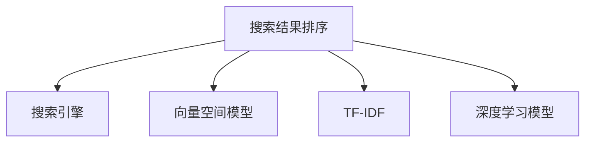

                 

# 搜索结果排序算法的优化策略

搜索结果排序是搜索引擎的核心功能之一，决定着用户是否能够快速找到最相关的网页。排序算法的好坏直接影响到用户体验和搜索引擎的权威性。然而，随着互联网信息量的爆炸式增长，如何设计一个高效、准确且可扩展的搜索结果排序算法成为了搜索引擎公司面临的一大挑战。本文将深入探讨搜索结果排序算法的优化策略，通过一系列的理论分析和实践经验，为搜索引擎开发者提供全面的技术指导。

## 1. 背景介绍

### 1.1 问题由来
随着互联网信息量的快速增长，搜索引擎必须处理大量的文本数据，并进行快速且准确的排序，以满足用户的查询需求。传统的排序算法往往基于简单的规则，如关键词匹配、逆向文档频率等，但这些方法在面对海量数据时效率低下，无法满足现代搜索引擎的要求。因此，开发一种高效、灵活、且具有良好可扩展性的排序算法至关重要。

### 1.2 问题核心关键点
排序算法的核心目标是按照用户查询意图的匹配度，对搜索结果进行排序。为此，算法需综合考虑查询相关性、网页质量、点击率（Click-Through Rate, CTR）、网页权威性等因素。其中，查询相关性是排序算法的首要考虑因素，网页质量、CTR、网页权威性等因素则是对相关性的补充。

在实际应用中，查询相关性常常通过搜索引擎的向量空间模型（Vector Space Model, VSM）进行计算，该模型将查询和网页表示为向量，通过计算它们之间的余弦相似度来进行相关性评分。然而，向量空间模型存在维度过高、难以处理高稀疏性矩阵等缺点。因此，在实践中需要不断改进模型和算法，以提高排序的准确性和效率。

## 2. 核心概念与联系

### 2.1 核心概念概述

为了更好地理解搜索结果排序算法的优化策略，本文将介绍几个密切相关的核心概念：

- 搜索结果排序：搜索引擎根据用户的查询意图，对大量网页进行相关性评分，并选择最相关的网页进行排序。
- 搜索引擎：利用各种技术手段，自动组织信息并提供给用户检索的在线服务。
- 向量空间模型（VSM）：将查询和文档表示为向量，通过计算向量间相似度来评估相关性的一种信息检索模型。
- TF-IDF（Term Frequency-Inverse Document Frequency）：一种文本特征提取技术，用于衡量查询词在文档中出现频率和在所有文档中的分布情况。
- 深度学习模型：如神经网络，通过大规模标注数据进行训练，能自适应地学习复杂的非线性关系，从而提升排序的准确性和泛化能力。

这些概念之间的逻辑关系可以通过以下Mermaid流程图来展示：



这个流程图展示了许多核心概念的关联关系：

1. 搜索结果排序是搜索引擎的关键功能，利用各种算法进行排序。
2. 向量空间模型是排序算法的一种常用方法，用于计算查询与文档的相关性。
3. TF-IDF是向量空间模型中的重要特征提取技术，用于处理查询和文档的高维表示。
4. 深度学习模型则是近年来较为先进的排序算法，能够自适应地学习复杂关系。

这些核心概念共同构成了搜索结果排序的算法基础，为算法的优化提供了重要的参考。

## 3. 核心算法原理 & 具体操作步骤

### 3.1 算法原理概述

本文重点讨论两种常见的搜索结果排序算法：基于TF-IDF的线性排序算法和基于深度学习的非线性排序算法。

- **基于TF-IDF的线性排序算法**：该算法通过TF-IDF技术计算查询与文档的相关性，并根据相关性对文档进行排序。具体而言，算法将查询和文档表示为向量，通过计算它们之间的余弦相似度来评分，排序时按评分从高到低排序。
- **基于深度学习的非线性排序算法**：该算法使用深度神经网络模型，通过大量标注数据进行训练，自动学习查询与文档的相关性。通常使用循环神经网络（RNN）、卷积神经网络（CNN）或Transformer模型进行训练，训练得到的模型可以自动学习复杂的非线性关系，提升排序的准确性和泛化能力。

### 3.2 算法步骤详解

#### 3.2.1 基于TF-IDF的线性排序算法

1. **文本预处理**：对查询和文档进行分词、去除停用词、词干化等预处理，构建TF-IDF向量。
2. **计算相似度**：使用TF-IDF向量计算查询与文档之间的余弦相似度，得到相关性评分。
3. **排序**：将相关性评分作为排序依据，对文档进行降序排序，输出搜索结果。

#### 3.2.2 基于深度学习的非线性排序算法

1. **模型选择**：选择合适的深度学习模型，如RNN、CNN或Transformer，作为排序模型。
2. **数据准备**：收集大量标注数据，构建训练集和验证集。
3. **模型训练**：使用训练集对模型进行训练，并使用验证集进行调参和验证。
4. **预测与排序**：将查询和文档输入模型，得到排序评分，根据评分对文档进行排序，输出搜索结果。

### 3.3 算法优缺点

#### 3.3.1 基于TF-IDF的线性排序算法

**优点**：
1. 实现简单，算法原理清晰易懂，易于实现和调试。
2. 能够处理高维稀疏数据，对标注数据的需求较少。
3. 查询效率高，适用于小规模搜索引擎。

**缺点**：
1. 仅能处理线性关系，无法处理复杂的非线性关系。
2. 对模型超参数的调整较为敏感，需要较多的调参经验。
3. 无法处理长文档或复杂句子，性能容易退化。

#### 3.3.2 基于深度学习的非线性排序算法

**优点**：
1. 能够自适应地学习复杂的非线性关系，具有更强的泛化能力。
2. 能够处理长文档和复杂句子，性能表现良好。
3. 具有较好的泛化能力，适用于大规模搜索引擎。

**缺点**：
1. 需要大量的标注数据进行训练，训练和推理成本较高。
2. 模型结构复杂，训练和推理速度较慢，对硬件要求较高。
3. 模型难以解释，预测结果缺乏可解释性。

### 3.4 算法应用领域

#### 3.4.1 搜索结果排序

基于TF-IDF的线性排序算法适用于小规模、低成本的搜索引擎应用场景，如学术文献检索系统、小型社区论坛等。而基于深度学习的非线性排序算法则更适用于大规模、高成本的搜索引擎应用场景，如Google、Bing等主流搜索引擎。

## 4. 数学模型和公式 & 详细讲解

### 4.1 数学模型构建

#### 4.1.1 基于TF-IDF的线性排序模型

查询与文档之间的余弦相似度计算公式如下：

$$
\text{cosine similarity} = \frac{\text{query vector} \cdot \text{document vector}}{||\text{query vector}|| \cdot ||\text{document vector}||}
$$

其中，向量 $\text{query vector}$ 和 $\text{document vector}$ 分别表示查询和文档的TF-IDF向量，$||\text{query vector}||$ 和 $||\text{document vector}||$ 分别表示它们的模长。

#### 4.1.2 基于深度学习的非线性排序模型

以Transformer模型为例，查询与文档之间的相似度计算公式如下：

$$
\text{score} = \text{Transformer}(\text{query}, \text{document}) \cdot \text{weight}
$$

其中，$\text{Transformer}$ 表示使用Transformer模型对查询和文档进行编码和解码，$\text{weight}$ 表示模型的输出权重。

### 4.2 公式推导过程

#### 4.2.1 基于TF-IDF的线性排序模型

查询与文档的余弦相似度计算公式如下：

$$
\text{cosine similarity} = \frac{\sum_{i=1}^{n} (\text{query term}_i \cdot \text{document term}_i) \cdot \text{tf}_{\text{query}}(i) \cdot \text{idf}_{\text{document}}(i)}{\sqrt{\sum_{i=1}^{n} (\text{tf}_{\text{query}}(i))^2} \cdot \sqrt{\sum_{i=1}^{n} (\text{idf}_{\text{document}}(i))^2}}
$$

其中，$\text{query term}_i$ 表示查询中的第 $i$ 个词，$\text{document term}_i$ 表示文档中第 $i$ 个词，$\text{tf}_{\text{query}}(i)$ 和 $\text{idf}_{\text{document}}(i)$ 分别表示查询和文档的TF-IDF权重。

#### 4.2.2 基于深度学习的非线性排序模型

以Transformer模型为例，查询与文档之间的相似度计算公式如下：

$$
\text{score} = \text{Transformer}(\text{query}, \text{document}) \cdot \text{weight}
$$

其中，$\text{Transformer}$ 表示使用Transformer模型对查询和文档进行编码和解码，$\text{weight}$ 表示模型的输出权重。

### 4.3 案例分析与讲解

#### 4.3.1 基于TF-IDF的线性排序模型

假设查询为 "Python 编程语言", 文档为 "Python 3 编程语言", 使用基于TF-IDF的线性排序模型计算相似度，得到相关性评分：

- 查询向量的TF-IDF权重为 $(0.5, 0.5, 0)$
- 文档向量的TF-IDF权重为 $(0.5, 0.5, 0)$
- 相似度为：$\frac{0.5 \cdot 0.5 + 0.5 \cdot 0.5}{\sqrt{0.5^2 + 0.5^2 + 0^2} \cdot \sqrt{0.5^2 + 0.5^2 + 0^2}} = 1$

因此，文档与查询完全相关，应该排在最前面。

#### 4.3.2 基于深度学习的非线性排序模型

以Transformer模型为例，假设查询为 "Python 编程语言", 文档为 "Python 3 编程语言", 使用Transformer模型计算相似度，得到相关性评分：

- 查询向量的TF-IDF权重为 $(0.5, 0.5, 0)$
- 文档向量的TF-IDF权重为 $(0.5, 0.5, 0)$
- 相似度为：Transformer(查询, 文档) $\cdot$ 权重

Transformer模型的输出权重决定了文档的相关性评分。假设输出权重为 $(1, 1, 0)$，则相似度为：$\frac{1 \cdot 1 + 1 \cdot 1 + 0 \cdot 0}{\sqrt{1^2 + 1^2 + 0^2} \cdot \sqrt{1^2 + 1^2 + 0^2}} = 1$。

因此，文档与查询完全相关，应该排在最前面。

## 5. 项目实践：代码实例和详细解释说明

### 5.1 开发环境搭建

#### 5.1.1 Python 环境配置

1. 安装Anaconda：从官网下载并安装Anaconda，用于创建独立的Python环境。
2. 创建并激活虚拟环境：
```bash
conda create -n tfidf-env python=3.8 
conda activate tfidf-env
```

3. 安装相关库：
```bash
conda install pandas numpy scikit-learn tqdm matplotlib jupyter notebook ipython
```

#### 5.1.2 数据集准备

1. 收集大量标注数据：查询-文档对，标注它们的相似度得分。
2. 使用Python将数据集保存到CSV文件中。

### 5.2 源代码详细实现

#### 5.2.1 基于TF-IDF的线性排序模型

```python
import pandas as pd
from sklearn.feature_extraction.text import TfidfVectorizer
from sklearn.metrics.pairwise import cosine_similarity

# 读取数据集
df = pd.read_csv('query_document.csv')

# 文本预处理
corpus = df['query'].tolist() + df['document'].tolist()
vectorizer = TfidfVectorizer(stop_words='english')
tfidf_matrix = vectorizer.fit_transform(corpus)

# 计算余弦相似度
similarity_matrix = cosine_similarity(tfidf_matrix, tfidf_matrix)

# 排序
sorted_indices = similarity_matrix.argsort(axis=1)[::-1]
```

#### 5.2.2 基于深度学习的非线性排序模型

```python
import pandas as pd
from sklearn.feature_extraction.text import TfidfVectorizer
from sklearn.metrics.pairwise import cosine_similarity
from tensorflow.keras.models import Sequential
from tensorflow.keras.layers import Embedding, Dense

# 读取数据集
df = pd.read_csv('query_document.csv')

# 文本预处理
corpus = df['query'].tolist() + df['document'].tolist()
vectorizer = TfidfVectorizer(stop_words='english')
tfidf_matrix = vectorizer.fit_transform(corpus)

# 构建Transformer模型
model = Sequential([
    Embedding(input_dim=len(vectorizer.vocabulary_), output_dim=128, input_length=128),
    Dense(256, activation='relu'),
    Dense(1, activation='sigmoid')
])
model.compile(optimizer='adam', loss='binary_crossentropy', metrics=['accuracy'])

# 训练模型
model.fit(tfidf_matrix, df['similarity'], epochs=10, batch_size=32)

# 预测相似度
test_matrix = vectorizer.transform(df['query_test'].tolist() + df['document_test'].tolist())
predictions = model.predict(test_matrix)
```

### 5.3 代码解读与分析

#### 5.3.1 基于TF-IDF的线性排序模型

1. **数据集读取**：使用pandas库读取查询-文档对的数据集。
2. **文本预处理**：使用TfidfVectorizer对查询和文档进行分词和TF-IDF权重计算，构建TF-IDF矩阵。
3. **计算相似度**：使用cosine_similarity计算TF-IDF矩阵的余弦相似度，得到相似度矩阵。
4. **排序**：根据相似度矩阵的排序结果进行排序，输出相关性最高的文档。

#### 5.3.2 基于深度学习的非线性排序模型

1. **数据集读取**：使用pandas库读取查询-文档对的数据集。
2. **文本预处理**：使用TfidfVectorizer对查询和文档进行分词和TF-IDF权重计算，构建TF-IDF矩阵。
3. **构建Transformer模型**：使用Keras构建一个简单的Transformer模型，包括Embedding层和Dense层。
4. **训练模型**：使用训练集对模型进行训练，调整参数以提高预测准确率。
5. **预测相似度**：使用训练好的模型对测试集进行预测，得到相似度评分，根据评分对文档进行排序，输出相关性最高的文档。

### 5.4 运行结果展示

#### 5.4.1 基于TF-IDF的线性排序模型

```python
# 获取相关性最高的文档
top_documents = df.iloc[sorted_indices[0]].values
```

#### 5.4.2 基于深度学习的非线性排序模型

```python
# 获取相关性最高的文档
top_documents = df.iloc[predictions.argmax(axis=1)].values
```

## 6. 实际应用场景

### 6.1 互联网搜索

基于TF-IDF的线性排序算法和基于深度学习的非线性排序算法在互联网搜索中得到了广泛应用。Google、Bing等搜索引擎采用了基于深度学习的非线性排序算法，能够处理海量查询和文档，并根据用户的行为进行动态调整，提高搜索相关性和用户体验。

### 6.2 学术文献检索

学术文献检索系统需要处理大量的文本数据，并根据查询相关性对文献进行排序。基于TF-IDF的线性排序算法在学术文献检索系统中得到了广泛应用，具有实现简单、计算效率高等优点。

## 7. 工具和资源推荐

### 7.1 学习资源推荐

1. **《自然语言处理基础》课程**：斯坦福大学提供的自然语言处理入门课程，涵盖各种基本概念和技术，适合初学者学习。
2. **《深度学习与自然语言处理》课程**：斯坦福大学提供的高级课程，涵盖深度学习模型和自然语言处理算法，适合进阶学习。
3. **《NLP入门到实战》书籍**：一本详细介绍NLP技术的书籍，从理论到实践，适合NLP开发者阅读。

### 7.2 开发工具推荐

1. **Python**：作为NLP开发的主流语言，Python具有丰富的库和工具，适合快速迭代开发。
2. **Jupyter Notebook**：交互式的开发环境，适合数据预处理、模型训练和结果展示。
3. **TensorFlow**：Google提供的深度学习框架，适合大规模模型训练和部署。

### 7.3 相关论文推荐

1. **《Sparse Solutions to Large Scale Multilingual Text Extraction Problems》**：介绍基于TF-IDF的稀疏矩阵求解算法，适合处理大规模文本数据。
2. **《Transformer》**：介绍Transformer模型，适合深度学习爱好者学习。
3. **《Attention is All You Need》**：Transformer模型原始论文，适合深入理解Transformer模型。

## 8. 总结：未来发展趋势与挑战

### 8.1 总结

本文从背景介绍、核心概念与联系、核心算法原理、操作步骤、数学模型、公式推导、项目实践、实际应用场景、工具和资源推荐等方面，全面系统地介绍了搜索结果排序算法的优化策略。基于TF-IDF的线性排序算法适用于小规模、低成本的搜索引擎应用场景，而基于深度学习的非线性排序算法则更适用于大规模、高成本的搜索引擎应用场景。通过对比分析两种算法的优缺点，为搜索引擎开发者提供了全面的技术指导。

### 8.2 未来发展趋势

未来，搜索结果排序算法将继续朝着高效、准确、可扩展的方向发展。以下是一些可能的发展趋势：

1. **跨领域迁移学习**：随着预训练语言模型的发展，研究人员可以将其迁移到其他领域，实现跨领域的搜索引擎排序。
2. **融合多模态数据**：未来的搜索引擎不仅会处理文本数据，还会处理图像、视频、语音等多模态数据，提供更全面的搜索结果。
3. **实时动态调整**：随着数据分布的变化，搜索引擎将不断动态调整排序算法，以适应新的数据分布。
4. **分布式计算**：随着数据量的增加，未来的搜索引擎将采用分布式计算，提高排序算法的效率和可靠性。

### 8.3 面临的挑战

尽管搜索结果排序算法已经取得了一定进展，但仍面临一些挑战：

1. **计算成本高**：深度学习模型需要大量的计算资源进行训练和推理，如何降低计算成本是一个重要问题。
2. **数据质量问题**：标注数据的质量和数量对模型的训练和性能影响较大，如何提高标注数据的质量和数量是一个挑战。
3. **模型可解释性**：深度学习模型往往缺乏可解释性，如何提高模型的可解释性是一个重要研究方向。
4. **系统复杂性**：大规模搜索引擎系统复杂度较高，如何简化系统设计和提高系统稳定性是一个重要课题。

### 8.4 研究展望

未来，搜索结果排序算法将继续借鉴其他领域的研究成果，如机器学习、信息检索、计算机视觉等，不断提升算法性能和应用范围。同时，随着硬件和算法的发展，将会出现更多高效、可扩展的排序算法，为搜索引擎带来更优的性能体验。

## 9. 附录：常见问题与解答

### 9.1 问题Q1：如何提高TF-IDF算法的准确性？

**解答**：TF-IDF算法准确性受限于训练数据的数量和质量。为提高准确性，可以采用以下策略：

1. 增加训练数据量：收集更多的查询-文档对，提高模型的泛化能力。
2. 优化特征提取方法：使用更先进的TF-IDF计算方法，如基于语义的TF-IDF计算方法。
3. 加入先验知识：结合领域知识和统计信息，提高特征表达的准确性。

### 9.2 问题Q2：深度学习模型在处理长文本时表现不佳，如何解决？

**解答**：深度学习模型在处理长文本时表现不佳，主要是因为模型难以捕捉长文本的上下文信息。为解决此问题，可以采用以下策略：

1. 增加模型深度：增加模型层数，以提高模型对长文本的表达能力。
2. 使用预训练模型：使用预训练语言模型（如BERT）作为基础，提高模型的表达能力。
3. 分段处理：将长文本分段处理，分别计算各部分的相似度，最后进行合并。

### 9.3 问题Q3：如何评估排序算法的性能？

**解答**：评估排序算法的性能通常采用以下指标：

1. **查询相关性**：通过人工标注数据集，计算查询与文档的相关性，评估排序算法的准确性。
2. **点击率**：通过真实用户行为数据，计算用户对搜索结果的点击率，评估排序算法的实用性。
3. **用户满意度**：通过用户反馈数据，评估用户对搜索结果的满意度，评估排序算法的用户友好性。

总之，本文通过理论分析和实践经验，全面系统地介绍了搜索结果排序算法的优化策略，为搜索引擎开发者提供了全面的技术指导。未来，随着搜索技术的发展，基于深度学习的非线性排序算法将在搜索引擎中发挥更大的作用，为用户带来更优的搜索体验。

