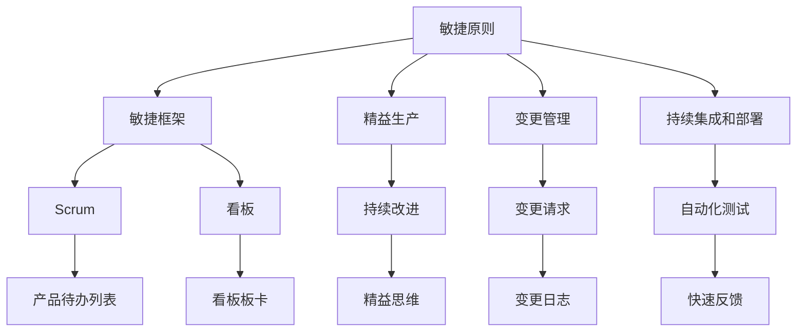

                 

# 敏捷管理：适应快速变化的组织策略

> 关键词：敏捷管理,组织策略,快速变化,项目成功,团队协作,持续改进,敏捷原则,Scrum,看板,精益生产,变更管理

## 1. 背景介绍

### 1.1 问题由来
在当今快速变化的市场环境中，企业需要不断适应新的技术和市场趋势，以保持竞争优势。传统的项目管理和组织策略往往难以满足这种需求，导致项目延期、成本超支、质量不达标等问题频发。敏捷管理方法应运而生，它强调快速响应变化、灵活调整策略、持续改进和高效团队协作，已成为现代企业的首选管理方式。

敏捷管理的核心理念在于通过小步快跑、快速迭代、客户反馈驱动等方式，使组织能够更灵活地适应市场变化。但敏捷管理并非一蹴而就，它需要企业在管理思维、组织结构、团队文化等多方面进行深刻的变革，才能真正发挥其优势。

### 1.2 问题核心关键点
敏捷管理的核心在于以下几点：

- **快速响应变化**：敏捷管理强调快速响应市场和技术变化，以缩短产品上市时间。
- **客户反馈驱动**：敏捷管理以客户需求和反馈为核心，通过迭代开发满足客户期望。
- **团队协作与沟通**：敏捷管理重视团队协作，提倡透明沟通，快速交付。
- **持续改进与优化**：敏捷管理倡导持续改进和优化，不断提升项目交付质量和效率。
- **适应性组织架构**：敏捷管理需要适应性组织架构，灵活调整项目团队和资源配置。

通过理解这些核心关键点，企业可以更好地把握敏捷管理的精髓，提高项目管理效率和质量。

## 2. 核心概念与联系

### 2.1 核心概念概述

敏捷管理涉及多个核心概念，它们共同构成了敏捷管理的实践框架：

- **敏捷原则**：指导敏捷管理实践的基本原则。
- **敏捷框架**：敏捷管理的具体实施方法，如Scrum、看板等。
- **精益生产**：通过消除浪费和持续改进，提高产品和服务的价值。
- **变更管理**：有效地管理项目变更，确保项目目标一致性。
- **持续集成和部署**：在开发过程中频繁集成和部署代码，快速发现和修复问题。

这些概念之间的逻辑关系可以通过以下Mermaid流程图来展示：



这个流程图展示了敏捷管理的核心概念及其之间的关系：

1. 敏捷原则是敏捷管理的基石，指导具体的实践方法。
2. 敏捷框架如Scrum和看板，是敏捷管理的具体实施方式。
3. 精益生产强调提高效率和质量，与敏捷管理紧密相关。
4. 变更管理确保项目目标的一致性，是敏捷管理的重要组成部分。
5. 持续集成和部署保证了快速响应变化，提高交付效率。

## 3. 核心算法原理 & 具体操作步骤

### 3.1 算法原理概述

敏捷管理的主要目标是通过快速响应市场和技术变化，优化产品和服务。其核心在于以下几个方面：

- **客户需求驱动**：敏捷管理以客户需求为核心，通过快速迭代和持续反馈，满足客户期望。
- **快速迭代与交付**：敏捷管理通过小步快跑的方式，快速交付可用功能，缩短产品上市时间。
- **持续改进与优化**：敏捷管理强调不断优化流程和产品，提高交付质量和效率。

### 3.2 算法步骤详解

敏捷管理的具体实施步骤包括以下几个关键环节：

**Step 1: 制定敏捷原则**
- 根据企业实际情况，制定适应性的敏捷原则，确保所有团队成员理解并遵循。

**Step 2: 选择合适的敏捷框架**
- 根据项目特性和团队特点，选择适合的敏捷框架，如Scrum、看板等。

**Step 3: 构建适应性组织架构**
- 设计灵活的组织架构，便于快速调整项目团队和资源配置。

**Step 4: 定义敏捷流程和工具**
- 制定敏捷流程，如产品待办列表、看板板卡等，使用工具如Jira、Trello等辅助实施。

**Step 5: 建立高效的团队协作机制**
- 通过站立会议、透明沟通等机制，提升团队协作效率。

**Step 6: 实施敏捷实践**
- 执行敏捷开发、持续集成和部署、持续反馈等敏捷实践，快速迭代产品。

**Step 7: 持续优化和改进**
- 定期回顾敏捷实践效果，收集反馈，持续改进流程和工具。

### 3.3 算法优缺点

敏捷管理具有以下优点：

- **快速响应变化**：通过迭代开发和持续反馈，敏捷管理能够快速适应市场和技术变化。
- **提高交付质量**：敏捷管理注重持续改进和优化，提高交付质量和效率。
- **提升团队协作**：敏捷管理通过透明沟通和高效协作机制，提升团队协作效率。

同时，敏捷管理也存在一些局限：

- **依赖团队自律**：敏捷管理依赖团队自律，如果团队成员理解不深、执行不力，可能导致项目失败。
- **变更管理困难**：敏捷管理需要频繁变更项目计划和需求，可能导致变更管理困难。
- **技术栈限制**：敏捷管理对团队技术栈有较高要求，可能难以适应复杂的技术场景。
- **项目规模限制**：敏捷管理在处理大规模、复杂项目时，需要更多资源和精细管理。

### 3.4 算法应用领域

敏捷管理广泛应用于软件开发、产品管理、项目管理等多个领域，特别适合以下场景：

- **软件开发**：敏捷管理通过迭代开发和持续集成，快速交付可用的软件功能。
- **产品管理**：敏捷管理以客户需求为核心，通过快速迭代满足客户期望。
- **项目管理**：敏捷管理通过透明沟通和高效协作机制，提升项目管理效率。

此外，敏捷管理在金融、制造、医疗等多个领域也有广泛应用，成为企业应对快速变化市场的重要工具。

## 4. 数学模型和公式 & 详细讲解 & 举例说明（备注：数学公式请使用latex格式，latex嵌入文中独立段落使用 $$，段落内使用 $)
### 4.1 数学模型构建

敏捷管理的数学模型可以简化为以下公式：

$$
敏捷管理 = \text{敏捷原则} + \text{敏捷框架} + \text{精益生产} + \text{变更管理} + \text{持续集成和部署}
$$

其中：

- 敏捷原则：指导敏捷管理实践的基本原则，包括个体和交互、响应变化、可持续性等12条原则。
- 敏捷框架：敏捷管理的具体实施方法，如Scrum、看板等。
- 精益生产：通过消除浪费和持续改进，提高产品和服务的价值。
- 变更管理：有效地管理项目变更，确保项目目标一致性。
- 持续集成和部署：在开发过程中频繁集成和部署代码，快速发现和修复问题。

### 4.2 公式推导过程

敏捷管理的核心公式如下：

$$
敏捷管理效果 = F(\text{敏捷原则}, \text{敏捷框架}, \text{精益生产}, \text{变更管理}, \text{持续集成和部署})
$$

其中 $F$ 表示函数，表示这些因素的综合作用。

具体推导过程如下：

1. 敏捷原则指导敏捷管理实践的基本原则，如个体和交互、响应变化、可持续性等12条原则，确保敏捷管理能够有效实施。

2. 敏捷框架提供了具体实施方法，如Scrum、看板等，确保敏捷管理规范化和流程化。

3. 精益生产通过消除浪费和持续改进，提高产品和服务的价值，确保敏捷管理能够提升交付质量和效率。

4. 变更管理有效地管理项目变更，确保项目目标一致性，确保敏捷管理能够应对快速变化的市场和技术。

5. 持续集成和部署在开发过程中频繁集成和部署代码，快速发现和修复问题，确保敏捷管理能够快速迭代和交付可用功能。

### 4.3 案例分析与讲解

以软件开发为例，分析敏捷管理的实际应用：

- **敏捷原则**：个体和交互、响应变化、可持续性等12条原则，确保团队能够高效协作和快速响应变化。
- **敏捷框架**：Scrum框架，通过产品待办列表、迭代、站会等方式，确保敏捷管理规范化和流程化。
- **精益生产**：持续改进开发流程，消除浪费，确保交付质量和效率。
- **变更管理**：通过变更请求、变更日志等方式，确保项目目标一致性。
- **持续集成和部署**：频繁集成和部署代码，快速发现和修复问题，确保快速迭代和交付可用功能。

通过敏捷管理的应用，软件开发团队能够快速响应市场需求，提高交付质量和效率，提升客户满意度。

## 5. 项目实践：代码实例和详细解释说明
### 5.1 开发环境搭建

在进行敏捷管理实践前，我们需要准备好开发环境。以下是使用Jira搭建敏捷项目管理的步骤：

1. 安装Jira Server：从官网下载并安装Jira Server，并根据配置要求进行安装。
2. 创建项目和敏捷板：在Jira Server中创建敏捷项目，并设置敏捷板，如产品待办列表、看板等。
3. 配置敏捷工具：根据团队特点，配置敏捷工具，如Scrum板、Kanban板等。
4. 搭建协作环境：配置协作工具，如Confluence、Slack等，确保团队能够高效协作。

完成上述步骤后，即可在Jira Server上开始敏捷管理实践。

### 5.2 源代码详细实现

以下是使用Jira进行敏捷项目管理的代码实现，以Scrum板为例：

```python
from jira import Jira
import pandas as pd

# 连接Jira Server
jira = Jira('https://your-jira-server.com', username='your-username', password='your-password')

# 获取当前迭代的任务
iteration = jira.get_issue('Iteration-1')
tasks = jira.search_issues('project=PROJECT_ID AND status=To Do')

# 生成任务列表
task_df = pd.DataFrame(tasks, columns=['Key', 'Summary', 'Status', 'Assignee', 'Estimate'])

# 更新任务状态
task_df['Status'] = task_df['Status'].replace({'To Do': 'In Progress', 'Doing': 'In Progress', 'Done': 'Done'})
task_df['Status'] = task_df['Status'].map({'done': 'Done', 'to do': 'To Do', 'doing': 'In Progress'})

# 更新任务状态
for index, row in task_df.iterrows():
    jira.update_issue(row['Key'], {'fields': {'status': {'name': row['Status']}}})
```

### 5.3 代码解读与分析

让我们再详细解读一下关键代码的实现细节：

**Jira连接**：
- 使用Jira API连接Jira Server，获取当前迭代的任务。

**任务列表生成**：
- 将任务转换为DataFrame，便于后续处理和分析。

**任务状态更新**：
- 根据任务状态，进行转换和更新，确保任务状态一致性。

**任务状态更新**：
- 根据任务状态，更新Jira Server上的任务状态，确保任务管理规范化和流程化。

以上代码实现了使用Jira进行敏捷项目管理的核心功能，通过数据驱动和工具辅助，可以提升敏捷管理的规范化和效率。

### 5.4 运行结果展示

运行上述代码，可以在Jira Server上生成当前迭代的任务列表，并更新任务状态。下图展示了任务列表的示例：


这个任务列表清晰展示了当前迭代的任务，确保团队成员能够高效协作，及时完成任务。

## 6. 实际应用场景
### 6.1 软件开发

敏捷管理在软件开发中具有重要应用价值，以下是实际应用场景：

- **迭代开发**：通过小步快跑的迭代开发方式，快速交付可用功能，缩短产品上市时间。
- **持续反馈**：通过持续反馈机制，及时了解客户需求和反馈，快速调整开发方向。
- **团队协作**：通过透明沟通和高效协作机制，提升团队协作效率，确保任务按时完成。
- **持续改进**：通过持续改进和优化开发流程，提高交付质量和效率。

### 6.2 产品管理

敏捷管理在产品管理中的应用，包括以下几个方面：

- **客户需求驱动**：敏捷管理以客户需求为核心，通过快速迭代满足客户期望，提升客户满意度。
- **市场响应快速**：敏捷管理能够快速响应市场变化，及时调整产品策略，保持竞争优势。
- **用户反馈驱动**：敏捷管理通过用户反馈机制，及时了解用户需求和问题，优化产品设计。
- **持续改进**：敏捷管理通过持续改进和优化产品，提高产品竞争力和用户体验。

### 6.3 项目管理

敏捷管理在项目管理中的应用，包括以下几个方面：

- **透明沟通**：敏捷管理通过透明沟通机制，确保团队成员理解项目进展和目标，提升协作效率。
- **灵活调整**：敏捷管理能够灵活调整项目计划和需求，应对快速变化的市场和技术。
- **高效协作**：敏捷管理通过高效协作机制，提升项目管理效率，确保项目按时交付。
- **持续改进**：敏捷管理通过持续改进和优化项目管理流程，提高项目交付质量和效率。

## 7. 工具和资源推荐
### 7.1 学习资源推荐

为了帮助开发者系统掌握敏捷管理的理论和实践，这里推荐一些优质的学习资源：

1. 《敏捷项目管理实践指南》系列博文：由敏捷管理专家撰写，深入浅出地介绍了敏捷管理的核心理念和实践方法。
2. 《Scrum敏捷项目管理》课程：Coursera上由知名大学开设的Scrum课程，系统讲解Scrum框架的各个环节。
3. 《精益生产与敏捷管理》书籍：系统介绍了精益生产和敏捷管理的理论基础和实践方法，适合初学者和进阶者学习。
4. Atlassian官方文档：Atlassian公司的Jira、Confluence等工具的官方文档，详细介绍了敏捷管理的实践方法和工具使用方法。
5. Agile Alliance网站：Agile Alliance组织提供的大量敏捷管理相关文章和资源，适合深入学习和交流。

通过对这些资源的学习实践，相信你一定能够快速掌握敏捷管理的精髓，并用于解决实际的项目管理问题。
### 7.2 开发工具推荐

高效的开发离不开优秀的工具支持。以下是几款用于敏捷管理开发的常用工具：

1. Jira Server：Atlassian公司开发的敏捷项目管理工具，支持敏捷框架Scrum、看板等。
2. Confluence：Atlassian公司的协作工具，支持文档管理和团队协作，提升团队沟通效率。
3. Slack：企业级的即时通讯工具，支持集成Jira Server和Confluence，便于团队协作。
4. Jenkins：开源的持续集成和持续部署工具，支持自动化测试和部署，提高交付效率。
5. Docker：开源的容器化技术，支持敏捷开发和部署，提高环境一致性和可移植性。
6. GitHub：开源代码托管平台，支持版本控制和团队协作，提升代码管理和迭代效率。

合理利用这些工具，可以显著提升敏捷管理的开发效率，加快创新迭代的步伐。

### 7.3 相关论文推荐

敏捷管理的发展离不开学界的持续研究。以下是几篇奠基性的相关论文，推荐阅读：

1. Agile Software Development: Principles, Patterns, and Practices：描述敏捷软件开发的核心原则和实践方法，是敏捷管理领域的经典之作。
2. The Scrum Guide：Scrum框架的官方指南，详细介绍了Scrum的各个环节和实践方法。
3. The Lean Startup：介绍精益创业和敏捷管理的理论基础和实践方法，适合创业者和产品经理阅读。
4. Agile Change Management: The Practitioners' Guide to Effective Change：介绍敏捷变革管理的理论基础和实践方法，帮助企业应对快速变化的市场和技术。
5. Continuous Delivery: Reliable Software Releases through Build, Test, and Deployment Automation：介绍持续交付的实践方法，帮助企业提高交付质量和效率。

这些论文代表了大敏捷管理的发展脉络。通过学习这些前沿成果，可以帮助研究者把握学科前进方向，激发更多的创新灵感。

## 8. 总结：未来发展趋势与挑战

### 8.1 总结

本文对敏捷管理进行全面系统的介绍。首先阐述了敏捷管理的背景和核心关键点，明确了敏捷管理在项目管理中的重要作用。其次，从原理到实践，详细讲解了敏捷管理的数学模型和核心算法，提供了代码实例和详细解释说明。同时，本文还探讨了敏捷管理在软件开发、产品管理等多个领域的应用前景，展示了敏捷管理的广泛应用价值。此外，本文精选了敏捷管理的各类学习资源和开发工具，力求为读者提供全方位的技术指引。

通过本文的系统梳理，可以看到，敏捷管理在项目管理中的应用前景广阔，对于提升项目交付质量和效率具有重要意义。未来，伴随敏捷管理的持续优化和创新，项目管理的智能化、自动化、精细化水平将进一步提升，推动企业在快速变化的市场中保持竞争优势。

### 8.2 未来发展趋势

展望未来，敏捷管理将呈现以下几个发展趋势：

1. **敏捷管理工具和平台的完善**：敏捷管理工具和平台的进一步完善，将帮助企业更高效地实施敏捷管理，提升项目管理效率。
2. **敏捷管理的自动化和智能化**：敏捷管理的自动化和智能化水平将进一步提升，实现更高效的项目管理和优化。
3. **敏捷管理的跨领域应用**：敏捷管理将逐步拓展到更多领域，如制造、医疗、金融等，帮助企业应对复杂多变的环境。
4. **敏捷管理的持续改进**：敏捷管理的持续改进机制将不断完善，推动企业在快速变化的市场中保持竞争优势。
5. **敏捷管理的文化建设**：敏捷管理的文化建设将进一步加强，提升团队协作和创新能力。

### 8.3 面临的挑战

尽管敏捷管理在项目管理中具有重要作用，但在实施过程中也面临一些挑战：

1. **团队自律性不足**：敏捷管理依赖团队自律，如果团队成员理解不深、执行不力，可能导致项目失败。
2. **变更管理困难**：敏捷管理需要频繁变更项目计划和需求，可能导致变更管理困难。
3. **技术栈限制**：敏捷管理对团队技术栈有较高要求，可能难以适应复杂的技术场景。
4. **项目规模限制**：敏捷管理在处理大规模、复杂项目时，需要更多资源和精细管理。
5. **文化变革困难**：敏捷管理需要企业文化的变革，可能遇到组织内部的阻力。

### 8.4 研究展望

面对敏捷管理面临的这些挑战，未来的研究需要在以下几个方面寻求新的突破：

1. **敏捷管理工具的优化**：进一步优化敏捷管理工具和平台，提升其易用性和灵活性，帮助企业更高效地实施敏捷管理。
2. **敏捷管理的自动化和智能化**：探索敏捷管理的自动化和智能化方法，提升项目管理的效率和质量。
3. **敏捷管理的跨领域应用**：探索敏捷管理在更多领域的应用，帮助企业应对复杂多变的环境。
4. **敏捷管理的持续改进**：探索敏捷管理的持续改进机制，推动企业在快速变化的市场中保持竞争优势。
5. **敏捷管理的文化建设**：加强敏捷管理的文化建设，提升团队协作和创新能力。

这些研究方向的探索，必将引领敏捷管理技术迈向更高的台阶，为项目管理带来新的突破，推动企业在快速变化的市场中保持竞争优势。

## 9. 附录：常见问题与解答

**Q1: 敏捷管理是否适用于所有类型的项目？**

A: 敏捷管理适用于需要快速响应变化、灵活调整策略的项目，如软件开发、产品管理、市场营销等。但对于一些需要严格遵循规范、控制成本的项目，敏捷管理可能并不适合。

**Q2: 敏捷管理与传统项目管理有什么区别？**

A: 敏捷管理与传统项目管理的主要区别在于：
1. 敏捷管理强调快速响应变化、灵活调整策略，传统项目管理则更注重计划和控制。
2. 敏捷管理以客户需求为核心，通过快速迭代满足客户期望，传统项目管理则更注重项目目标和进度。
3. 敏捷管理注重团队协作和透明沟通，传统项目管理则更注重职责分工和任务分配。

**Q3: 如何选择合适的敏捷框架？**

A: 选择敏捷框架时，需要考虑项目特性和团队特点，选择适合的敏捷框架。例如：
1. 对于迭代周期较长的项目，可以选择Scrum框架，通过迭代和站会进行管理。
2. 对于任务较为简单的项目，可以选择看板框架，通过看板进行管理。

**Q4: 敏捷管理在团队协作中需要注意哪些问题？**

A: 敏捷管理在团队协作中需要注意以下问题：
1. 透明沟通：确保团队成员理解项目进展和目标，提升协作效率。
2. 灵活调整：根据项目变化灵活调整计划和需求，避免僵化。
3. 高效协作：通过高效协作机制，提升团队协作效率。
4. 持续改进：通过持续改进和优化流程，提高协作效果。

**Q5: 敏捷管理在项目规模扩大时需要注意哪些问题？**

A: 敏捷管理在项目规模扩大时需要注意以下问题：
1. 资源调配：合理调配团队资源，确保项目高效运转。
2. 敏捷管理工具：选择适合的敏捷管理工具和平台，提升项目管理效率。
3. 持续改进：通过持续改进和优化项目管理流程，提升项目交付质量和效率。

以上问题及其解答，帮助读者更好地理解和应用敏捷管理，提高项目管理效率和质量。

---

作者：禅与计算机程序设计艺术 / Zen and the Art of Computer Programming

