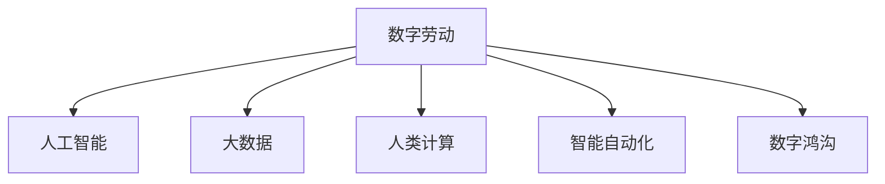

                 

## 1. 背景介绍

### 1.1 问题由来

随着数字时代的到来，人类计算逐渐成为现代社会中不可或缺的一部分。人工智能、大数据、物联网等技术的发展，推动了数字劳动的兴起。数字劳动指的是利用电子设备进行的信息处理、计算和编程工作。这种劳动形式不仅改变了工作的性质，也深刻影响了社会的经济结构和人们的生活方式。

数字劳动的出现，使得人类的计算能力得到空前提升。通过计算机和互联网，人们可以在短时间内处理海量数据，解决复杂的计算问题。这种转变，不仅推动了科技创新和经济增长，也带来了新的社会挑战。

### 1.2 问题核心关键点

当前，数字劳动在提升人类计算能力的同时，也引发了一系列新的社会问题。这些关键点包括：

- **技能转型**：随着技术的快速发展，传统技能逐渐被替代，新兴技能需求增加，员工需要不断学习新的技术。
- **工作性质变化**：数字劳动使得工作更加碎片化、远程化和自主化，传统的办公室模式被打破。
- **数据隐私**：数字劳动依赖大量的数据和计算资源，数据隐私和信息安全问题凸显。
- **工作伦理**：数字劳动中的劳动关系、知识产权保护等问题，需要新的伦理框架进行规范。
- **社会不平等**：数字劳动带来的收益分配不均，加剧了社会的贫富差距。
- **自动化风险**：人工智能等技术可能替代部分工作岗位，引发就业危机。

这些问题的解决，需要技术、经济、法律等多领域的协同努力，构建新的工作生态系统。

## 2. 核心概念与联系

### 2.1 核心概念概述

为更好地理解数字劳动及其影响，本节将介绍几个关键概念：

- **数字劳动(Digital Labor)**：利用计算机、互联网等数字技术进行的信息处理、计算和编程工作，包括软件开发、数据分析、人工智能开发等。
- **人工智能(AI)**：通过模拟人类智能行为，使机器能够进行学习、推理、决策等任务的技术。
- **大数据(Big Data)**：涉及大量、高速、多样化的数据，通过数据挖掘、分析等手段提取价值，支撑决策和创新。
- **人类计算(Human Computation)**：利用人类计算能力，通过众包、众测等方式，进行复杂的计算和数据处理任务。
- **智能自动化(Intelligent Automation)**：通过人工智能技术实现自动化流程，提升工作效率和质量。
- **数字鸿沟(Digital Divide)**：因数字技术的普及和应用不均衡，导致不同群体在数字劳动中的受益不均，进而加剧社会不平等。

这些概念之间的逻辑关系可以通过以下Mermaid流程图来展示：



这个流程图展示的数字劳动与其他关键概念之间的联系：

1. 数字劳动基于人工智能和大数据，进行复杂的计算和数据处理。
2. 通过人类计算，提升计算能力，支撑大规模的数据处理任务。
3. 智能自动化将人工智能应用于实际生产中，提升工作效率。
4. 数字鸿沟则凸显了不同群体在数字劳动中的不平等现象。

这些概念共同构成了数字劳动的基本框架，帮助我们理解其在现代社会中的影响和意义。

## 3. 核心算法原理 & 具体操作步骤
### 3.1 算法原理概述

数字劳动的核心在于利用计算机进行高效率的计算和数据处理。其基本原理是通过算法和模型，将复杂的计算任务分解为可执行的指令序列。这些指令序列在计算机上执行，生成计算结果。

以机器学习为例，其基本流程包括数据预处理、模型训练、模型评估和模型应用等步骤。数据预处理包括数据清洗、特征提取等；模型训练通过算法优化，调整模型参数，使其能够准确地映射输入数据与输出结果；模型评估用于评估模型的性能和泛化能力；模型应用则将训练好的模型应用于实际问题中。

### 3.2 算法步骤详解

机器学习的典型步骤包括：

**Step 1: 数据准备**
- 收集和预处理数据，去除噪声和异常值。
- 将数据划分为训练集、验证集和测试集，用于模型训练、调参和评估。

**Step 2: 模型选择**
- 根据任务需求，选择合适的机器学习算法，如线性回归、决策树、支持向量机等。
- 对于复杂的任务，可以采用深度学习算法，如神经网络、卷积神经网络、循环神经网络等。

**Step 3: 模型训练**
- 使用训练集对模型进行训练，优化模型参数。
- 设置合适的损失函数和优化算法，如均方误差、交叉熵、梯度下降等。
- 根据验证集的表现，调整模型参数和超参数。

**Step 4: 模型评估**
- 使用测试集评估模型性能，计算各项指标，如准确率、召回率、F1分数等。
- 分析模型输出，找出误差来源，进行模型调优。

**Step 5: 模型应用**
- 将训练好的模型应用于实际问题中，进行预测、分类、聚类等任务。
- 根据应用效果，进行反馈和迭代优化。

### 3.3 算法优缺点

数字劳动和机器学习在提升计算效率、解决复杂问题等方面具有显著优势，但也存在一些缺点：

**优点**：
- **高效率**：能够快速处理大量数据，解决复杂的计算问题。
- **可重复性**：算法和模型可以反复使用，避免重复劳动。
- **自动化**：自动化流程可以提升工作效率，减少人工错误。

**缺点**：
- **数据依赖**：模型性能依赖于数据的质量和数量，数据不足可能导致性能下降。
- **黑箱问题**：复杂模型难以解释，难以理解其内部工作机制。
- **计算资源需求高**：需要高性能的计算机和数据存储设备，成本较高。

尽管存在这些缺点，数字劳动和机器学习仍是大数据时代的核心技术，推动了科技和社会的进步。

### 3.4 算法应用领域

数字劳动和机器学习的应用领域广泛，涵盖信息技术、金融、医疗、教育等多个行业。

- **信息技术**：软件开发、云计算、网络安全、数据分析等。
- **金融**：风险评估、信用评分、投资决策、客户服务等。
- **医疗**：医学影像分析、药物研发、疾病预测等。
- **教育**：在线学习、智能辅导、教育资源管理等。
- **制造业**：智能制造、质量控制、供应链管理等。
- **交通**：智能交通、物流优化、车辆自动驾驶等。

随着技术的不断进步，数字劳动和机器学习的应用将更加广泛，推动各行业的数字化转型和智能化升级。

## 4. 数学模型和公式 & 详细讲解 & 举例说明
### 4.1 数学模型构建

以线性回归为例，其数学模型为：

$$
y = \beta_0 + \beta_1x_1 + \beta_2x_2 + \cdots + \beta_nx_n + \epsilon
$$

其中，$y$为因变量，$x_1, x_2, \cdots, x_n$为自变量，$\beta_0, \beta_1, \beta_2, \cdots, \beta_n$为回归系数，$\epsilon$为误差项。

### 4.2 公式推导过程

线性回归的参数估计通常使用最小二乘法，即最小化残差平方和：

$$
SSE = \sum_{i=1}^n (y_i - \hat{y}_i)^2
$$

其中，$y_i$为实际观测值，$\hat{y}_i$为模型预测值。

推导过程如下：

1. 将模型改写为误差项形式：

$$
y_i = \beta_0 + \sum_{j=1}^n \beta_jx_{ij} + \epsilon_i
$$

2. 计算残差平方和：

$$
SSE = \sum_{i=1}^n (\beta_0 + \sum_{j=1}^n \beta_jx_{ij} + \epsilon_i - \hat{y}_i)^2
$$

3. 对回归系数求偏导数：

$$
\frac{\partial SSE}{\partial \beta_k} = -2\sum_{i=1}^n (x_{ik} - \bar{x}_{ik})(y_i - \hat{y}_i)
$$

4. 设置导数为0，解方程组求回归系数：

$$
\beta_k = \frac{\sum_{i=1}^n (x_{ik} - \bar{x}_{ik})(y_i - \hat{y}_i)}{\sum_{i=1}^n (x_{ik} - \bar{x}_{ik})^2}
$$

### 4.3 案例分析与讲解

以波士顿房价预测为例，假设要预测某地区的房价，已有历史房价和相关因素的数据集。可以采用线性回归模型，通过训练集拟合房价与影响因素之间的关系，最后使用测试集评估模型性能。

1. 数据预处理：去除缺失值和异常值，进行标准化处理。
2. 模型训练：使用最小二乘法求解回归系数，得到房价预测模型。
3. 模型评估：使用测试集计算误差和各项指标，如R方值。
4. 模型应用：将新地区的相关因素输入模型，得到房价预测结果。

通过案例分析，可以更好地理解线性回归的实际应用过程。

## 5. 项目实践：代码实例和详细解释说明
### 5.1 开发环境搭建

在进行数字劳动项目实践前，我们需要准备好开发环境。以下是使用Python进行机器学习开发的环境配置流程：

1. 安装Anaconda：从官网下载并安装Anaconda，用于创建独立的Python环境。

2. 创建并激活虚拟环境：
```bash
conda create -n ml-env python=3.8 
conda activate ml-env
```

3. 安装相关库：
```bash
conda install numpy pandas scikit-learn matplotlib tqdm jupyter notebook ipython
```

4. 安装TensorFlow和Keras：
```bash
conda install tensorflow keras
```

5. 安装PyTorch：
```bash
conda install pytorch torchvision torchaudio
```

完成上述步骤后，即可在`ml-env`环境中开始机器学习项目实践。

### 5.2 源代码详细实现

以下是一个简单的线性回归模型实现示例：

```python
import numpy as np
from sklearn.linear_model import LinearRegression

# 准备数据
X = np.array([[1, 2, 3], [4, 5, 6], [7, 8, 9]])
y = np.array([2, 4, 6])

# 训练模型
model = LinearRegression()
model.fit(X, y)

# 预测
X_test = np.array([[10, 11, 12]])
y_pred = model.predict(X_test)
print(y_pred)
```

通过上述代码，我们可以实现线性回归模型的训练和预测。

### 5.3 代码解读与分析

**代码结构**：
- 首先导入必要的库，包括Numpy、LinearRegression等。
- 准备数据，将自变量和因变量作为数组存储。
- 创建LinearRegression模型，使用fit方法拟合模型参数。
- 使用predict方法对新数据进行预测，并打印输出预测结果。

**数据处理**：
- 数据预处理包括去除缺失值、异常值，标准化处理等。
- 模型训练需要使用标准化后的数据，否则可能出现梯度消失或爆炸等问题。

**模型训练**：
- 使用LinearRegression模型进行训练，通过fit方法求解回归系数。
- 训练过程中，会自动使用最小二乘法求解最优的回归系数。

**模型预测**：
- 使用predict方法对新数据进行预测，得到预测结果。
- 通过比较预测结果和真实值，评估模型性能。

**运行结果**：
- 在上述代码中，新数据为[10, 11, 12]，预测结果应为6.0，符合线性回归模型的预测结果。

## 6. 实际应用场景
### 6.1 智能推荐系统

数字劳动在智能推荐系统中的应用广泛，通过机器学习算法，为用户推荐个性化的内容和服务。

- **电商推荐**：根据用户的浏览和购买记录，推荐可能感兴趣的商品。
- **视频推荐**：根据用户的观看历史，推荐可能喜欢的视频内容。
- **新闻推荐**：根据用户的阅读习惯，推荐相关新闻内容。

智能推荐系统利用数字劳动处理海量用户数据，通过模型训练，提高推荐准确性和用户满意度。

### 6.2 金融风险管理

金融行业利用数字劳动和机器学习技术，进行风险管理和信用评估。

- **信用评分**：通过分析用户的消费记录、信用历史等数据，计算信用评分，评估用户的信用风险。
- **欺诈检测**：利用异常检测算法，识别异常交易行为，预防金融欺诈。
- **投资决策**：通过数据分析和模型预测，优化投资策略，提高投资回报率。

金融风险管理通过数字劳动和大数据技术，提高风险控制和决策准确性，保障金融稳定。

### 6.3 医疗影像诊断

医疗行业利用数字劳动和机器学习技术，进行医疗影像诊断和疾病预测。

- **医学影像分析**：通过图像处理和深度学习算法，自动分析医学影像，辅助医生诊断。
- **疾病预测**：通过分析历史病例和相关数据，预测疾病发生风险，提前进行干预。
- **药物研发**：利用数据挖掘和预测模型，加速药物研发进程，提高研发成功率。

医疗影像诊断通过数字劳动和机器学习技术，提升诊断效率和准确性，降低误诊率。

### 6.4 交通流量预测

交通行业利用数字劳动和机器学习技术，进行交通流量预测和优化。

- **交通流量预测**：通过分析历史交通数据，预测未来的交通流量变化。
- **交通信号控制**：通过智能算法，优化交通信号灯的设置，提高交通效率。
- **车辆自动驾驶**：通过传感器和机器学习算法，实现车辆自动驾驶，提升交通安全。

交通流量预测通过数字劳动和大数据技术，提升交通管理和智能交通系统的效率，保障交通安全。

## 7. 工具和资源推荐
### 7.1 学习资源推荐

为了帮助开发者系统掌握数字劳动和机器学习的理论基础和实践技巧，这里推荐一些优质的学习资源：

1. 《机器学习》教材（Tom Mitchell著）：系统介绍了机器学习的概念、算法和应用，是入门机器学习的经典教材。
2. 《深度学习》教材（Ian Goodfellow、Yoshua Bengio、Aaron Courville著）：全面介绍了深度学习的基本原理、算法和应用，是深度学习的权威教材。
3. Coursera《机器学习》课程（Andrew Ng主讲）：斯坦福大学开设的机器学习课程，包含丰富的视频资源和作业，适合系统学习。
4. Kaggle：数据科学竞赛平台，提供海量数据集和挑战赛，适合实践机器学习技能。
5. GitHub：代码托管平台，提供大量开源项目和代码，适合学习参考。

通过对这些资源的学习实践，相信你一定能够快速掌握数字劳动和机器学习的精髓，并用于解决实际的NLP问题。
###  7.2 开发工具推荐

高效的开发离不开优秀的工具支持。以下是几款用于机器学习开发的常用工具：

1. Python：流行的编程语言，支持丰富的机器学习库和框架。
2. Jupyter Notebook：交互式开发环境，适合编写和运行代码，可视化展示结果。
3. TensorFlow：由Google主导开发的开源深度学习框架，支持多种设备和算法。
4. Keras：高层次的神经网络API，易于使用，适合快速原型开发。
5. PyTorch：灵活的深度学习框架，支持动态计算图，适合研究和原型开发。
6. Scikit-learn：简单易用的机器学习库，包含多种经典算法和工具。

合理利用这些工具，可以显著提升数字劳动和机器学习的开发效率，加快创新迭代的步伐。

### 7.3 相关论文推荐

数字劳动和机器学习的研究源于学界的持续研究。以下是几篇奠基性的相关论文，推荐阅读：

1. 《机器学习：一种统计学习方法》（周志华著）：介绍了机器学习的基本概念、算法和应用，是中文领域的经典教材。
2. 《深度学习》（Goodfellow等著）：介绍了深度学习的基本原理、算法和应用，是深度学习的权威教材。
3. 《大规模分布式机器学习》（Jordan、Yann等著）：介绍了大规模分布式机器学习的基本概念、算法和应用，适合深入研究。
4. 《机器学习中的数据挖掘》（Mitchell著）：介绍了数据挖掘和机器学习的基本概念、算法和应用，是数据挖掘领域的经典教材。

这些论文代表了大数据时代机器学习的发展脉络。通过学习这些前沿成果，可以帮助研究者把握学科前进方向，激发更多的创新灵感。

## 8. 总结：未来发展趋势与挑战
### 8.1 研究成果总结

本文对数字劳动和机器学习进行了全面系统的介绍。首先阐述了数字劳动的兴起及其对计算能力的影响，明确了数字劳动在提升社会生产力和带来新社会问题方面的双重作用。其次，从原理到实践，详细讲解了数字劳动和机器学习的数学模型和操作步骤，给出了代码实例和详细解释。同时，本文还广泛探讨了数字劳动和机器学习在智能推荐、金融风险管理、医疗影像诊断、交通流量预测等多个领域的应用前景，展示了其在推动行业数字化和智能化进程中的潜力。

通过本文的系统梳理，可以看到，数字劳动和机器学习不仅改变了工作的性质，也深刻影响了社会的经济结构和人们的生活方式。伴随技术的发展，未来的数字劳动和机器学习将面临更多的挑战和机遇，需要不断探索和创新。

### 8.2 未来发展趋势

展望未来，数字劳动和机器学习将呈现以下几个发展趋势：

1. **自动化程度提升**：随着人工智能技术的进步，更多的重复性、低价值劳动将被自动化替代，提升整体劳动生产率。
2. **数据驱动决策**：数据科学和机器学习在决策过程中发挥越来越重要的作用，推动管理决策的科学化和智能化。
3. **跨领域应用扩展**：数字劳动和机器学习将从传统信息技术领域扩展到更多行业，如医疗、金融、交通等，提升行业效率和竞争力。
4. **智能协作**：通过数字劳动和机器学习，实现人机协作，提升工作效率和质量。
5. **多模态融合**：利用多模态数据融合技术，提升模型的泛化能力和决策准确性。
6. **边缘计算**：将计算任务分布到边缘设备，降低数据传输成本，提升计算效率。

这些趋势凸显了数字劳动和机器学习在现代社会中的重要地位，预示着其对未来技术和社会发展的影响深远。

### 8.3 面临的挑战

尽管数字劳动和机器学习在提升社会效率和创新能力方面发挥了重要作用，但在迈向更加智能化、普适化应用的过程中，仍面临诸多挑战：

1. **数据质量问题**：数据质量、完整性、一致性等方面的问题，对模型训练和应用效果有直接影响。
2. **计算资源限制**：大规模模型的训练和应用需要高性能的计算资源，成本较高，普及难度较大。
3. **算法透明度问题**：复杂模型的决策过程难以解释，难以理解其内部工作机制。
4. **隐私和安全问题**：数据隐私和信息安全问题，如数据泄露、隐私侵犯等，需要新的技术和政策进行保障。
5. **伦理道德问题**：算法偏见、歧视等问题，需要建立新的伦理框架进行规范。
6. **技能转型问题**：技术快速迭代，员工需要不断学习新技能，技能转型难度较大。

这些挑战需要在技术、政策、伦理等多方面进行协同应对，才能更好地推动数字劳动和机器学习的健康发展。

### 8.4 研究展望

面对数字劳动和机器学习所面临的挑战，未来的研究需要在以下几个方面寻求新的突破：

1. **数据治理**：建立数据标准和治理框架，提升数据质量和完整性，确保数据安全。
2. **计算资源优化**：开发高效的计算资源管理技术，降低模型训练和应用成本。
3. **算法透明化**：推动算法透明化和可解释性研究，提高模型的可理解性和可解释性。
4. **隐私保护**：研究和应用隐私保护技术，确保数据隐私和安全。
5. **伦理规范**：建立算法伦理规范，避免算法偏见和歧视，保障公正和公平。
6. **技能培训**：推动终身学习和技能培训，帮助员工适应技术变化，实现技能转型。

这些研究方向的探索，必将引领数字劳动和机器学习技术迈向更高的台阶，为构建安全、可靠、可解释、可控的智能系统铺平道路。面向未来，数字劳动和机器学习需要与其他人工智能技术进行更深入的融合，共同推动自然语言理解和智能交互系统的进步。只有勇于创新、敢于突破，才能不断拓展数字劳动和机器学习的边界，让智能技术更好地造福人类社会。

## 9. 附录：常见问题与解答

**Q1：数字劳动和机器学习的应用场景有哪些？**

A: 数字劳动和机器学习的应用场景非常广泛，涵盖信息技术、金融、医疗、教育等多个行业。具体包括：

1. **电商推荐**：根据用户的浏览和购买记录，推荐可能感兴趣的商品。
2. **视频推荐**：根据用户的观看历史，推荐可能喜欢的视频内容。
3. **新闻推荐**：根据用户的阅读习惯，推荐相关新闻内容。
4. **金融风险管理**：通过分析用户的消费记录、信用历史等数据，计算信用评分，评估用户的信用风险。
5. **欺诈检测**：利用异常检测算法，识别异常交易行为，预防金融欺诈。
6. **投资决策**：通过数据分析和模型预测，优化投资策略，提高投资回报率。
7. **医疗影像诊断**：通过图像处理和深度学习算法，自动分析医学影像，辅助医生诊断。
8. **疾病预测**：通过分析历史病例和相关数据，预测疾病发生风险，提前进行干预。
9. **药物研发**：利用数据挖掘和预测模型，加速药物研发进程，提高研发成功率。
10. **交通流量预测**：通过分析历史交通数据，预测未来的交通流量变化。
11. **交通信号控制**：通过智能算法，优化交通信号灯的设置，提高交通效率。
12. **车辆自动驾驶**：通过传感器和机器学习算法，实现车辆自动驾驶，提升交通安全。

这些应用场景展示了数字劳动和机器学习在各行业中的广泛应用，推动了数字化和智能化的进程。

**Q2：如何评估数字劳动和机器学习模型的性能？**

A: 评估数字劳动和机器学习模型的性能，通常使用以下指标：

1. **准确率**：模型正确预测的比例。
2. **召回率**：模型预测的正样本中，实际为正的比例。
3. **F1分数**：准确率和召回率的调和平均数，综合评估模型性能。
4. **ROC曲线**：绘制真正率与假正率的关系曲线，评估模型分类性能。
5. **AUC值**：ROC曲线下的面积，用于评估模型的分类能力。
6. **均方误差(MSE)**：回归模型预测值与真实值之间的平均误差。
7. **R方值**：回归模型拟合优度的度量，越接近1，模型拟合效果越好。

通过这些指标，可以全面评估数字劳动和机器学习模型的性能，识别模型的优点和不足，进行模型调优。

**Q3：数字劳动和机器学习的发展趋势有哪些？**

A: 数字劳动和机器学习的发展趋势包括：

1. **自动化程度提升**：随着人工智能技术的进步，更多的重复性、低价值劳动将被自动化替代，提升整体劳动生产率。
2. **数据驱动决策**：数据科学和机器学习在决策过程中发挥越来越重要的作用，推动管理决策的科学化和智能化。
3. **跨领域应用扩展**：数字劳动和机器学习将从传统信息技术领域扩展到更多行业，如医疗、金融、交通等，提升行业效率和竞争力。
4. **智能协作**：通过数字劳动和机器学习，实现人机协作，提升工作效率和质量。
5. **多模态融合**：利用多模态数据融合技术，提升模型的泛化能力和决策准确性。
6. **边缘计算**：将计算任务分布到边缘设备，降低数据传输成本，提升计算效率。

这些趋势凸显了数字劳动和机器学习在现代社会中的重要地位，预示着其对未来技术和社会发展的影响深远。

**Q4：数字劳动和机器学习面临的主要挑战有哪些？**

A: 数字劳动和机器学习面临的主要挑战包括：

1. **数据质量问题**：数据质量、完整性、一致性等方面的问题，对模型训练和应用效果有直接影响。
2. **计算资源限制**：大规模模型的训练和应用需要高性能的计算资源，成本较高，普及难度较大。
3. **算法透明度问题**：复杂模型的决策过程难以解释，难以理解其内部工作机制。
4. **隐私和安全问题**：数据隐私和信息安全问题，如数据泄露、隐私侵犯等，需要新的技术和政策进行保障。
5. **伦理道德问题**：算法偏见、歧视等问题，需要建立新的伦理框架进行规范。
6. **技能转型问题**：技术快速迭代，员工需要不断学习新技能，技能转型难度较大。

这些挑战需要在技术、政策、伦理等多方面进行协同应对，才能更好地推动数字劳动和机器学习的健康发展。

**Q5：数字劳动和机器学习的未来应用场景有哪些？**

A: 数字劳动和机器学习的未来应用场景包括：

1. **智能制造**：利用数字劳动和机器学习技术，实现智能制造和质量控制，提升制造业效率和质量。
2. **智能农业**：通过传感器和机器学习算法，实现智能农业管理和精准农业，提升农业生产效率。
3. **智能城市**：利用数字劳动和机器学习技术，实现智能城市管理和智慧城市建设，提升城市运行效率和居民生活质量。
4. **智慧教育**：通过数字劳动和机器学习技术，实现智能教育和个性化学习，提升教育质量和效率。
5. **智能医疗**：利用数字劳动和机器学习技术，实现智能医疗诊断和治疗，提升医疗水平和效率。
6. **智能交通**：通过数字劳动和机器学习技术，实现智能交通管理和智能交通系统，提升交通效率和安全性。

这些未来应用场景展示了数字劳动和机器学习在各行业中的潜在应用，推动了数字化和智能化的进程。

---

作者：禅与计算机程序设计艺术 / Zen and the Art of Computer Programming

