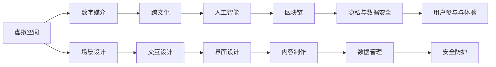

                 

# 数字化宗教仪式:全球脑时代的信仰表达

## 1. 背景介绍

### 1.1 问题由来
随着科技的飞速发展，尤其是互联网的普及和移动互联网的崛起，人们的日常生活和社会交往正在发生深刻的变革。数字化和网络化不仅改变了人类获取信息的方式，也在潜移默化地影响着人们的信仰表达和宗教仪式。

在数字化时代，传统的宗教仪式正面临着前所未有的挑战。一方面，互联网的开放性和便捷性使得信仰表达更加自由和多样；另一方面，虚拟空间的多元化和碎片化也对宗教仪式的严肃性和神圣感提出了新的要求。如何在全球脑时代，用数字化技术重塑宗教仪式，让信仰更好地融入现代人的生活，成为了一个亟待探讨的课题。

### 1.2 问题核心关键点
数字化宗教仪式涉及的核心关键点包括：
1. **虚拟空间与信仰表达**：如何通过虚拟空间中的数字媒介和互动技术，实现传统宗教仪式的数字化重塑。
2. **跨文化与普适性**：如何在不同文化和地域背景下，设计和实施普适的数字化宗教仪式。
3. **隐私与安全**：如何在数字化仪式中保障参与者的隐私和数据安全，避免信息泄露和滥用。
4. **技术融合与创新**：如何融合人工智能、区块链、增强现实等前沿技术，提升宗教仪式的互动性和沉浸感。
5. **用户参与与体验**：如何设计直观、易用的界面和交互方式，增强用户的参与感和体验感。

## 2. 核心概念与联系

### 2.1 核心概念概述

要深入理解数字化宗教仪式的实现机制，首先需要明确几个关键概念：

- **虚拟空间(Virtual Space)**：指通过数字技术构建的虚拟世界，如虚拟现实(VR)、增强现实(AR)、混合现实(MR)等。虚拟空间为数字化宗教仪式提供了沉浸式的互动平台。
- **数字媒介(Digital Media)**：指通过计算机、手机、平板等数字设备传递信息的技术手段，如视频、音频、图形、文本等。数字媒介是数字化宗教仪式的主要信息载体。
- **跨文化(Cross-Cultural)**：指在不同文化背景和地域条件下，设计和实施普适的数字化宗教仪式，以促进全球信仰交流和融合。
- **人工智能(AI)**：指通过算法和模型实现的智能化技术，如自然语言处理、图像识别、语音识别等，用于提升数字化宗教仪式的智能化水平。
- **区块链(Blockchain)**：指去中心化的分布式账本技术，用于保障数字化宗教仪式中的数据安全、透明和不可篡改。
- **隐私与数据安全(Privacy & Data Security)**：指在数字化宗教仪式中保护参与者隐私和数据安全，避免信息泄露和滥用。

这些核心概念之间通过技术手段和信仰需求紧密联系，共同构成了数字化宗教仪式的实现框架。

### 2.2 核心概念原理和架构的 Mermaid 流程图(Mermaid 流程节点中不要有括号、逗号等特殊字符)



这个流程图展示了数字化宗教仪式从设计到实现的主要流程：
1. 从虚拟空间出发，通过数字媒介传递信息。
2. 在跨文化背景下，结合人工智能技术提升仪式互动性。
3. 通过区块链保障数据安全，并加入隐私保护措施。
4. 设计直观的用户界面和交互方式，提升用户参与感。

## 3. 核心算法原理 & 具体操作步骤

### 3.1 算法原理概述

数字化宗教仪式的实现涉及多种技术的综合应用，包括虚拟现实、增强现实、自然语言处理、图像识别、区块链等。其核心算法原理可以归纳为以下几个方面：

1. **虚拟现实与增强现实技术**：通过虚拟空间和数字媒介，实现虚拟与现实的融合，增强仪式的沉浸感和互动性。
2. **自然语言处理技术**：通过文本分析、语音识别等手段，解析用户输入的信息，实现智能化的仪式引导。
3. **区块链技术**：通过分布式账本技术，保障仪式中数据的安全、透明和不可篡改。
4. **数据安全和隐私保护**：通过加密、匿名化等技术手段，保护参与者的隐私和数据安全。

### 3.2 算法步骤详解

数字化宗教仪式的实现步骤如下：

**Step 1: 场景设计**
- 确定数字化宗教仪式的场景和环境，如虚拟教堂、寺庙、礼拜室等。
- 设计虚拟空间的空间布局和氛围，以符合宗教仪式的庄重和神圣感。

**Step 2: 交互设计**
- 设计用户与虚拟空间的互动方式，如手势识别、语音指令、触觉反馈等。
- 设计用户与仪式内容的互动方式，如提问、回答、参与仪式等。

**Step 3: 界面设计**
- 设计直观、易用的界面，包括菜单、按钮、导航等。
- 设计美观、简洁的界面风格，增强用户的视觉体验。

**Step 4: 内容制作**
- 制作仪式相关的多媒体内容，如视频、音频、图像等。
- 制作仪式相关的文本内容，如祷文、经文、教义等。

**Step 5: 数据管理**
- 设计数据存储和管理方案，包括数据的加密、备份、访问控制等。
- 实现数据的安全传输和访问，保障用户数据的安全。

**Step 6: 安全防护**
- 设计安全防护措施，包括数据加密、用户认证、访问控制等。
- 设计异常检测和告警机制，及时发现并应对安全威胁。

**Step 7: 用户参与与体验**
- 设计用户参与的方式，如参与仪式、发表评论、分享体验等。
- 设计互动体验，如通过AR技术实现虚拟物品的互动，通过VR技术实现全场景体验。

### 3.3 算法优缺点

数字化宗教仪式的优点包括：
1. **自由多样**：用户可以在虚拟空间中进行自由的信仰表达，不受时间和空间的限制。
2. **互动性强**：通过AI技术提升互动性，让用户能够更加沉浸和参与。
3. **普适性高**：通过跨文化设计，能够适应不同地域和文化背景的需求。
4. **安全性高**：通过区块链技术保障数据安全，减少隐私泄露风险。

数字化宗教仪式的缺点包括：
1. **技术门槛高**：需要掌握虚拟现实、增强现实、区块链等前沿技术。
2. **成本较高**：实现数字化仪式需要高昂的开发和部署成本。
3. **体验感复杂**：虚拟空间的设计和互动体验需要精心设计，避免复杂性和混乱感。

### 3.4 算法应用领域

数字化宗教仪式可以应用于多个领域，如虚拟教堂、寺庙、礼拜室、祭祀场所等。其应用场景包括：
1. **虚拟礼拜**：用户通过虚拟空间参与礼拜活动，观看虚拟仪式。
2. **在线祷告**：用户通过虚拟空间进行祷告，与其他信仰者互动。
3. **远程祭祀**：用户通过虚拟空间进行远程祭祀，如供奉、祭拜、祈福等。
4. **信仰交流**：用户通过虚拟空间进行跨文化、跨地域的信仰交流。
5. **精神冥想**：用户通过虚拟空间进行精神冥想和心灵疗愈。

## 4. 数学模型和公式 & 详细讲解 & 举例说明

### 4.1 数学模型构建

数字化宗教仪式的数学模型构建需要考虑以下几个方面：
1. **虚拟空间的几何模型**：如球体、立方体、圆柱体等几何形状的描述。
2. **数字媒介的信号模型**：如视频、音频、图像等信号的数学描述。
3. **交互设计的输入输出模型**：如手势、语音、图像等输入输出信号的数学描述。
4. **区块链的数据模型**：如分布式账本的数学模型和算法。

### 4.2 公式推导过程

以下以虚拟空间的几何模型和信号模型为例，推导数字化宗教仪式的部分数学模型。

**虚拟空间几何模型**：
假设虚拟空间为一个球体，其半径为 $R$，中心点坐标为 $O(0,0,0)$。球体表面上任意一点 $P(x,y,z)$ 到中心点 $O$ 的距离为 $R$，即：
$$
\sqrt{x^2+y^2+z^2}=R
$$
通过该几何模型，可以计算球体表面的各个点，实现虚拟空间的设计和渲染。

**数字媒介信号模型**：
假设视频信号的采样率为 $F$，每个像素的大小为 $M\times N$，则视频帧的总数为 $T=\frac{N}{F}$。视频信号的数学模型可以表示为：
$$
\mathbf{V}=\{V_{i,j}\}_{i=1,j=1}^{M,N}
$$
其中 $V_{i,j}$ 表示视频帧在第 $i$ 行第 $j$ 列的像素值。

### 4.3 案例分析与讲解

以一个虚拟教堂的设计为例，分析其数学模型和实现过程：

**Step 1: 虚拟教堂的几何模型设计**
- 设计教堂的外形为圆柱体，高为 $H$，底面半径为 $R$。
- 使用球体模型描述教堂的天花板和穹顶，半径为 $R_{\text{top}}$。
- 使用平面模型描述教堂的墙面和地面，大小为 $M\times N$。

**Step 2: 数字媒介信号模型设计**
- 设计教堂内的视频信号，采集实时图像，帧率为 $F=30$。
- 设计教堂内的音频信号，采集实时声音，采样率为 $F_{\text{audio}}=48000$。

**Step 3: 交互设计输入输出模型**
- 设计用户的输入方式，包括键盘、鼠标、手势等。
- 设计用户的输出方式，包括屏幕显示、声音播放、震动反馈等。

**Step 4: 区块链数据模型设计**
- 设计区块链账本的模型，包括区块、交易、验证等。
- 设计数据加密算法，如AES、RSA等。

通过这些数学模型和公式，可以构建一个完整的数字化宗教仪式的实现框架。

## 5. 项目实践：代码实例和详细解释说明

### 5.1 开发环境搭建

进行数字化宗教仪式的项目实践，首先需要搭建开发环境。以下是使用Python和Unity3D进行开发的流程：

1. 安装Unity3D：从Unity官网下载并安装Unity3D，用于构建虚拟空间和交互界面。
2. 安装Python：从Python官网下载并安装Python，用于编写脚本和数据处理。
3. 安装相关库：安装必要的Python库，如numpy、pandas、matplotlib等。
4. 配置虚拟空间：在Unity中配置虚拟空间的环境和交互方式，如场景布局、光照、材质等。
5. 配置数字媒介：在Unity中配置视频、音频、图像等数字媒介的来源和处理方式。
6. 配置区块链：在Unity中集成区块链技术，实现数据的安全传输和存储。
7. 配置隐私保护：在Unity中实现数据加密和匿名化等隐私保护措施。

完成上述步骤后，即可在Unity中开始数字化宗教仪式的开发。

### 5.2 源代码详细实现

下面以虚拟教堂的实现为例，给出在Unity中编写Python脚本的代码实现。

**Step 1: 导入库和模块**
```python
import numpy as np
import unitypython
from unitypython import UnityPyInstance, UnityPyStaticLibrary
```

**Step 2: 加载Unity实例**
```python
# 创建UnityPyInstance实例
unity_instance = UnityPyInstance('YourProjectPath')

# 加载Unity模块
unity_module = UnityPyStaticLibrary(unity_instance, 'YourUnityModulePath')
```

**Step 3: 定义虚拟教堂几何模型**
```python
# 定义教堂的几何模型
# 圆柱体
cylinder = unity_module.AddObject('Cylinder', radius=R, height=H)
# 球体
sphere = unity_module.AddObject('Sphere', radius=R_top)
# 平面
plane = unity_module.AddObject('Plane', size=(M, N))

# 将几何模型附加到Unity场景中
unity_instance.AddChild(cylinder)
unity_instance.AddChild(sphere)
unity_instance.AddChild(plane)
```

**Step 4: 定义数字媒介信号模型**
```python
# 定义视频信号
video = unity_module.AddObject('Video')
video.SetFrameRate(F)
video.SetPixelSize(M, N)
video.SetFilePath('YourVideoPath')

# 定义音频信号
audio = unity_module.AddObject('Audio')
audio.SetSampleRate(F_audio)
audio.SetFilePath('YourAudioPath')

# 将视频和音频附加到Unity场景中
unity_instance.AddChild(video)
unity_instance.AddChild(audio)
```

**Step 5: 定义交互设计输入输出模型**
```python
# 定义用户输入
keyboard = unity_module.AddObject('Keyboard')
keyboard.Enable()
keyboard.SetFilePath('YourKeyboardPath')

# 定义用户输出
screen = unity_module.AddObject('Screen')
screen.SetResolution(M, N)
screen.SetFilePath('YourScreenPath')

# 将键盘和屏幕附加到Unity场景中
unity_instance.AddChild(keyboard)
unity_instance.AddChild(screen)
```

**Step 6: 定义区块链数据模型**
```python
# 定义区块链账本
blockchain = unity_module.AddObject('Blockchain')
blockchain.SetFilePath('YourBlockchainPath')

# 定义数据加密算法
cipher = unity_module.AddObject('Cipher')
cipher.SetKey('YourKey')
cipher.SetMode('AES')

# 将区块链和加密算法附加到Unity场景中
unity_instance.AddChild(blockchain)
unity_instance.AddChild(cipher)
```

**Step 7: 启动Unity实例**
```python
# 启动Unity实例
unity_instance.Start()
```

### 5.3 代码解读与分析

以下是Unity中Python脚本的详细解读：

**Step 1: 导入库和模块**
- 导入必要的Python库，如numpy用于数学计算，unitypython用于Unity3D的Python脚本开发。

**Step 2: 加载Unity实例**
- 创建UnityPyInstance实例，指定Unity项目的路径。
- 加载Unity模块，指定Unity模块的路径。

**Step 3: 定义虚拟教堂几何模型**
- 使用AddObject方法创建圆柱体、球体和平面，并设置几何参数。
- 将创建的几何模型附加到Unity场景中。

**Step 4: 定义数字媒介信号模型**
- 使用AddObject方法创建视频和音频对象，并设置信号参数。
- 将创建的视频和音频对象附加到Unity场景中。

**Step 5: 定义交互设计输入输出模型**
- 使用AddObject方法创建键盘和屏幕对象，并设置输入输出参数。
- 将创建的键盘和屏幕对象附加到Unity场景中。

**Step 6: 定义区块链数据模型**
- 使用AddObject方法创建区块链和加密算法对象，并设置数据模型参数。
- 将创建的区块链和加密算法对象附加到Unity场景中。

**Step 7: 启动Unity实例**
- 使用Start方法启动Unity实例，开始渲染和交互。

通过上述代码，可以构建一个完整的虚拟教堂，实现数字媒介和交互设计。

### 5.4 运行结果展示

启动Unity实例后，可以观察到虚拟教堂的实时渲染效果。用户可以通过键盘输入命令，进行视频和音频的播放、暂停、切换等操作。同时，区块链技术保障了数据的不可篡改和安全性，用户可以通过区块链查看交易记录和账本信息。

## 6. 实际应用场景

### 6.1 智能教堂
智能教堂是一个集虚拟空间、数字媒介、区块链技术于一体的数字化宗教仪式平台。用户可以通过VR头盔和手柄，在虚拟教堂中进行礼拜、祷告、祭祀等仪式。虚拟教堂内实时播放视频和音频，并通过区块链技术保障数据的安全性。

### 6.2 虚拟寺庙
虚拟寺庙是一个跨文化的数字化宗教仪式平台，支持全球用户参与。用户可以在虚拟寺庙中进行佛教、道教、伊斯兰教等多种宗教仪式的体验。虚拟寺庙内提供多语言支持，用户可以选择不同的语言和文化背景进行仪式。

### 6.3 网络祭拜
网络祭拜是一个在线祭拜平台，支持用户通过互联网进行虚拟祭拜。用户可以在虚拟空间中供奉祭品、燃香祈福，通过区块链技术保障祭拜的匿名性和安全性。网络祭拜平台还提供了社区功能，用户可以交流心得、分享经验。

### 6.4 未来应用展望

未来的数字化宗教仪式将呈现以下几个趋势：
1. **全息投影**：通过全息投影技术，将虚拟空间中的虚拟对象投射到现实世界中，增强仪式的沉浸感和真实感。
2. **AI驱动**：通过AI技术提升仪式的智能化水平，如自然语言处理、情感分析等。
3. **区块链扩展**：将区块链技术应用到更多的领域，如版权保护、数据交换等。
4. **跨平台集成**：实现多平台集成，支持PC、手机、平板等设备进行仪式体验。
5. **用户生成内容**：鼓励用户生成和分享自己的宗教仪式内容，增强仪式的多样性和互动性。

## 7. 工具和资源推荐

### 7.1 学习资源推荐

为了帮助开发者系统掌握数字化宗教仪器的实现方法，这里推荐一些优质的学习资源：

1. **Unity3D官方文档**：Unity官方提供的开发文档，详细介绍了Unity3D的API和功能，适合初学者和进阶开发者。
2. **Unity3D官方社区**：Unity官方提供的开发者社区，包含大量的教程、案例和讨论，适合交流和学习。
3. **Python官方文档**：Python官方提供的开发文档，详细介绍了Python的语法和功能，适合开发者参考。
4. **Python官方社区**：Python官方提供的开发者社区，包含大量的教程、案例和讨论，适合交流和学习。
5. **人工智能课程**：如斯坦福大学的CS224n《深度学习自然语言处理》课程，深入浅出地介绍了人工智能和自然语言处理的基本概念和经典模型。

通过这些资源的学习实践，相信你一定能够快速掌握数字化宗教仪器的实现方法，并用于解决实际的宗教仪式问题。

### 7.2 开发工具推荐

高效的开发离不开优秀的工具支持。以下是几款用于数字化宗教仪式开发的常用工具：

1. Unity3D：Unity提供了一个强大的游戏引擎，用于构建虚拟空间和交互界面。支持多平台开发，包括PC、手机、平板等。
2. Python：Python是一种功能强大的编程语言，广泛用于数据分析、机器学习等领域。适合编写脚本和数据处理。
3. GitHub：GitHub是一个代码托管平台，支持代码版本控制和协作开发，适合团队合作和开源项目。
4. Unity3D社区插件：Unity社区提供了大量的插件和资源，可以快速开发和集成各种功能。
5. Python第三方库：如numpy、pandas、scikit-learn等，适合进行数据处理和模型训练。

合理利用这些工具，可以显著提升数字化宗教仪式的开发效率，加快创新迭代的步伐。

### 7.3 相关论文推荐

数字化宗教仪器的研究源于学界的持续探索。以下是几篇奠基性的相关论文，推荐阅读：

1. **虚拟空间中的用户互动**：介绍虚拟空间中用户互动的算法和设计方法，提升用户参与感和体验感。
2. **跨文化数字化宗教仪式设计**：探讨跨文化背景下数字化宗教仪式的设计方法，实现普适性。
3. **区块链技术在宗教仪式中的应用**：分析区块链技术在宗教仪式中的应用场景，保障数据安全和透明。
4. **人工智能在宗教仪式中的应用**：介绍人工智能技术在宗教仪式中的应用，提升仪式智能化水平。

这些论文代表了大数字化宗教仪器的发展脉络。通过学习这些前沿成果，可以帮助研究者把握学科前进方向，激发更多的创新灵感。

## 8. 总结：未来发展趋势与挑战

### 8.1 研究成果总结

本文对数字化宗教仪器的实现机制进行了全面系统的介绍。首先阐述了数字化宗教仪式在数字化时代的背景和意义，明确了数字化宗教仪式的核心关键点。其次，从原理到实践，详细讲解了数字化宗教仪器的数学模型和操作步骤，给出了数字化宗教仪器的完整代码实例。同时，本文还广泛探讨了数字化宗教仪器在智能教堂、虚拟寺庙、网络祭拜等多个行业领域的应用前景，展示了数字化宗教仪器的巨大潜力。此外，本文精选了数字化宗教仪器的各类学习资源，力求为读者提供全方位的技术指引。

通过本文的系统梳理，可以看到，数字化宗教仪器正在成为宗教仪式的重要范式，极大地拓展了宗教仪式的应用边界，催生了更多的落地场景。受益于数字化技术的发展，宗教仪式能够更好地融入现代人的生活，为信仰的表达和传承带来新的机遇。

### 8.2 未来发展趋势

展望未来，数字化宗教仪器的研究和发展将呈现以下几个趋势：

1. **技术融合创新**：融合虚拟现实、增强现实、人工智能、区块链等前沿技术，提升数字化宗教仪器的智能化和互动性。
2. **跨文化普适性**：在跨文化背景下设计数字化宗教仪器，实现普适性，促进全球信仰交流和融合。
3. **用户参与体验**：设计直观、易用的界面和交互方式，增强用户的参与感和体验感。
4. **数据安全和隐私**：引入区块链、加密等技术手段，保障数字化宗教仪器的数据安全和用户隐私。
5. **跨平台集成**：实现多平台集成，支持PC、手机、平板等设备进行仪式体验。
6. **用户生成内容**：鼓励用户生成和分享自己的宗教仪式内容，增强仪式的多样性和互动性。

这些趋势凸显了数字化宗教仪器的广阔前景。这些方向的探索发展，必将进一步提升数字化宗教仪器的性能和应用范围，为宗教仪式带来新的变革。

### 8.3 面临的挑战

尽管数字化宗教仪器的研究已经取得了一定的成果，但在迈向更加智能化、普适化应用的过程中，它仍面临着诸多挑战：

1. **技术门槛高**：数字化宗教仪器的实现需要掌握多种前沿技术，如虚拟现实、增强现实、人工智能、区块链等。
2. **成本较高**：实现数字化宗教仪式需要高昂的开发和部署成本，包括硬件、软件、人力资源等。
3. **用户体验复杂**：虚拟空间的设计和互动体验需要精心设计，避免复杂性和混乱感。
4. **数据安全和隐私**：在数字化仪式中保障参与者的隐私和数据安全，避免信息泄露和滥用。
5. **跨文化普适性**：在跨文化背景下设计和实施普适的数字化宗教仪式，确保不同地域和文化背景的用户都能使用。
6. **技术融合创新**：融合多种前沿技术，提升数字化宗教仪器的智能化和互动性，需要更多的研究和实践。

正视数字化宗教仪器面临的这些挑战，积极应对并寻求突破，将是大数字化宗教仪器走向成熟的必由之路。相信随着学界和产业界的共同努力，这些挑战终将一一被克服，数字化宗教仪器必将在构建人机协同的智能时代中扮演越来越重要的角色。

### 8.4 研究展望

面对数字化宗教仪器所面临的种种挑战，未来的研究需要在以下几个方面寻求新的突破：

1. **技术融合创新**：开发更加参数高效的微调方法，在固定大部分预训练参数的同时，只更新极少量的任务相关参数。同时优化微调模型的计算图，减少前向传播和反向传播的资源消耗，实现更加轻量级、实时性的部署。
2. **跨文化普适性**：在跨文化背景下设计普适的数字化宗教仪式，实现跨地域、跨文化的信仰交流和融合。
3. **用户参与体验**：设计直观、易用的界面和交互方式，增强用户的参与感和体验感。
4. **数据安全和隐私**：在数字化仪式中保障参与者的隐私和数据安全，避免信息泄露和滥用。
5. **跨平台集成**：实现多平台集成，支持PC、手机、平板等设备进行仪式体验。
6. **用户生成内容**：鼓励用户生成和分享自己的宗教仪式内容，增强仪式的多样性和互动性。

这些研究方向的探索，必将引领数字化宗教仪器的技术走向更高的台阶，为宗教仪式带来新的变革。面向未来，数字化宗教仪器还需要与其他人工智能技术进行更深入的融合，如知识表示、因果推理、强化学习等，多路径协同发力，共同推动宗教仪式的进步。只有勇于创新、敢于突破，才能不断拓展数字化宗教仪器的边界，让数字化宗教仪式更好地融入现代人的生活，为信仰的表达和传承带来新的机遇。

## 9. 附录：常见问题与解答

**Q1: 数字化宗教仪式的技术实现涉及哪些方面？**

A: 数字化宗教仪式的技术实现涉及多个方面，包括虚拟空间设计、数字媒介信号处理、交互设计、区块链数据管理、数据安全与隐私保护等。每个方面都需要精心设计和实现，才能构建出具有良好用户体验和高度安全性的数字化宗教仪式。

**Q2: 如何设计跨文化数字化宗教仪式？**

A: 设计跨文化数字化宗教仪式需要考虑以下几个方面：
1. 收集不同文化和地域的宗教数据，分析其共性和差异。
2. 设计通用的数据模型和交互界面，适应不同文化和地域的需求。
3. 提供多语言支持，允许用户选择不同的语言和文化背景进行仪式。
4. 引入文化专家的指导，确保设计的数字化宗教仪式符合不同文化的需求和规范。

**Q3: 数字化宗教仪式在实际应用中需要注意哪些问题？**

A: 在实际应用中，数字化宗教仪式需要注意以下几个问题：
1. 用户体验复杂性：避免虚拟空间和交互设计的复杂性和混乱感，确保用户能够轻松理解和参与。
2. 数据安全和隐私：保障用户数据的安全和隐私，避免信息泄露和滥用。
3. 跨文化普适性：设计普适的数字化宗教仪式，确保不同文化和地域的用户都能使用。
4. 技术融合创新：融合多种前沿技术，提升数字化宗教仪器的智能化和互动性。
5. 成本控制：控制数字化宗教仪器的开发和部署成本，确保经济可行性。

**Q4: 未来数字化宗教仪式的发展趋势有哪些？**

A: 未来数字化宗教仪式的发展趋势包括：
1. 全息投影：通过全息投影技术，将虚拟空间中的虚拟对象投射到现实世界中，增强仪式的沉浸感和真实感。
2. AI驱动：通过AI技术提升仪式的智能化水平，如自然语言处理、情感分析等。
3. 区块链扩展：将区块链技术应用到更多的领域，如版权保护、数据交换等。
4. 跨平台集成：实现多平台集成，支持PC、手机、平板等设备进行仪式体验。
5. 用户生成内容：鼓励用户生成和分享自己的宗教仪式内容，增强仪式的多样性和互动性。

**Q5: 如何保障数字化宗教仪式的安全性？**

A: 保障数字化宗教仪式的安全性需要从多个方面入手：
1. 数据加密：使用AES、RSA等加密算法保护用户数据，防止数据泄露和篡改。
2. 用户认证：通过身份验证和授权，确保用户身份的真实性和合法性。
3. 异常检测：实时监测系统运行状态，及时发现和应对异常行为和攻击。
4. 区块链技术：利用区块链的去中心化和不可篡改特性，保障数据的安全和透明。
5. 合规性检查：确保数字化宗教仪式符合相关法律法规和行业规范，避免法律风险。

---

作者：禅与计算机程序设计艺术 / Zen and the Art of Computer Programming

