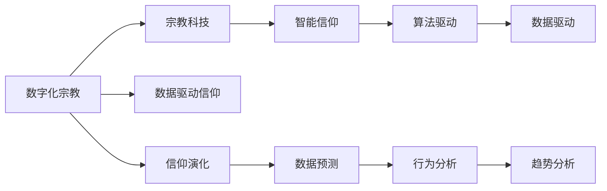

                 

# 数字化宗教：全球脑时代的信仰演变

> 关键词：数字化宗教,全球脑时代,信仰演变,人工智能,宗教科技,智能信仰,数据驱动信仰

## 1. 背景介绍

### 1.1 问题由来
随着技术的飞速发展，我们正处在一个以数据和计算能力为核心的“全球脑时代”。其中，人工智能（AI）和大数据技术无疑是最为关键的推动力量。人们开始重新审视传统信仰，探索将数字化手段与信仰实践结合的新途径。由此，“数字化宗教”这一概念应运而生，它涵盖了从宗教科技到智能信仰等多个层面，旨在通过数据、算法等现代技术手段，重新定义宗教体验和信仰传播。

### 1.2 问题核心关键点
数字化宗教的核心关键点包括：

- 数据驱动的信仰演化：利用大数据技术分析宗教行为和信仰变迁，预测信仰趋势。
- 宗教科技的创新应用：将AI、区块链等技术应用于宗教管理、信徒互动等场景，提升宗教活动效率。
- 智能信仰的构建：通过算法和机器学习，实现信仰内容和传播方式智能化。
- 数据隐私与伦理的考量：在数字化宗教中，如何确保信徒数据隐私，防止算法偏见等问题，是必须面对的挑战。

### 1.3 问题研究意义
数字化宗教的研究，对于理解人类信仰的多样性和复杂性，推动宗教科技的发展，以及探索数字时代的新信仰形式具有重要意义：

1. **信仰多样性的研究**：通过大数据分析，揭示信仰演变的规律，理解不同文化和历史背景下的信仰差异。
2. **宗教科技的推动**：帮助宗教组织提升管理效率，优化信徒互动体验，实现信仰传播的数字化转型。
3. **智能信仰的探索**：为宗教信仰的智能化提供新的思路和方法，如智能经文推荐、智能祷告等。
4. **伦理和隐私的探讨**：探讨在数字化宗教中，如何平衡数据利用与隐私保护，确保算法公正。

## 2. 核心概念与联系

### 2.1 核心概念概述

在探讨数字化宗教时，需要关注以下几个核心概念：

- **数字化宗教**：利用人工智能和大数据技术，通过数字化手段重构宗教体验和信仰传播的宗教形态。
- **宗教科技**：指将计算机技术、AI等应用于宗教管理和服务领域，提升宗教活动效率。
- **智能信仰**：通过算法和数据驱动，实现信仰内容的智能化推荐和传播。
- **数据驱动信仰**：基于大数据分析，预测信仰趋势和信徒行为，优化宗教活动设计。
- **信仰演化**：通过分析信仰数据，探索信仰在数字化时代的变迁和演进。

这些概念之间有着紧密的联系。宗教科技和智能信仰是数字化宗教的具体实践，数据驱动信仰则提供了理论基础，而信仰演化则描绘了信仰在数字化时代的未来趋势。

### 2.2 核心概念原理和架构的 Mermaid 流程图



### 2.3 核心概念的实际应用

- **数字化宗教**：如数字教堂、虚拟祷告室等，通过VR/AR等技术为信徒提供沉浸式体验。
- **宗教科技**：如区块链用于宗教资金管理，提高透明度和安全性。
- **智能信仰**：如智能经文推荐系统，根据信徒偏好自动推送相关经文和内容。
- **数据驱动信仰**：如基于信徒行为数据，优化教堂服务和宗教活动设计。
- **信仰演化**：如通过大数据分析，预测未来宗教信仰的趋势和变化。

## 3. 核心算法原理 & 具体操作步骤

### 3.1 算法原理概述

数字化宗教的核心算法原理包括以下几个方面：

- **数据挖掘与分析**：利用机器学习和深度学习算法，从大量宗教数据中挖掘出信仰行为和趋势。
- **自然语言处理（NLP）**：通过NLP技术，分析和理解宗教文本，如经文、祷告等，提供智能信仰服务。
- **计算机视觉（CV）**：应用CV技术，如图像识别、情感分析等，提升虚拟宗教体验的沉浸感。
- **区块链技术**：利用区块链的分布式账本和去中心化特性，保障宗教数据的透明性和安全性。

### 3.2 算法步骤详解

数字化宗教的算法步骤主要包括：

1. **数据收集与预处理**：收集宗教活动、信徒行为等数据，进行清洗和标准化处理。
2. **特征提取与选择**：使用特征工程技术，提取数据的关键特征，如祷告时长、教堂参与频率等。
3. **模型训练与优化**：应用机器学习算法，如随机森林、深度神经网络等，训练和优化预测模型。
4. **智能信仰服务**：根据训练好的模型，提供智能化的信仰服务，如智能经文推荐、虚拟祷告室等。
5. **隐私保护与伦理考量**：确保数据隐私和算法公正，防止数据滥用和算法偏见。

### 3.3 算法优缺点

数字化宗教的算法具有以下优点：

- **高效性**：利用算法快速分析大量数据，提高宗教活动管理的效率。
- **精准性**：通过精准的模型预测，提供个性化和定制化的信仰服务。
- **普及性**：数字化手段使得宗教服务更易于普及，跨越地域和时间限制。

同时，也存在以下缺点：

- **技术复杂性**：算法模型的设计、训练和优化需要较高的技术门槛。
- **数据依赖性**：算法的精准性和可靠性依赖于高质量的数据。
- **伦理挑战**：在数据隐私和算法公正性上可能面临诸多伦理问题。

### 3.4 算法应用领域

数字化宗教的应用领域包括：

- **智能教堂**：通过AI和大数据，优化教堂服务和管理。
- **虚拟宗教体验**：利用VR/AR等技术，提供沉浸式的宗教体验。
- **智能信仰推荐**：根据信徒偏好，推荐适合的经文和信仰活动。
- **宗教资金管理**：应用区块链技术，提升宗教资金管理的安全性和透明度。
- **信徒互动平台**：通过社交媒体和AI聊天机器人，增强信徒之间的互动。

## 4. 数学模型和公式 & 详细讲解 & 举例说明

### 4.1 数学模型构建

数字化宗教的数学模型构建主要基于以下几个方面：

- **数据驱动模型**：如回归模型、分类模型等，用于预测信徒行为和信仰趋势。
- **NLP模型**：如BERT、GPT等，用于分析和理解宗教文本。
- **图像识别模型**：如CNN等，用于情感分析和虚拟宗教体验。
- **区块链模型**：如分布式账本、共识算法等，用于宗教数据的透明和安全性保障。

### 4.2 公式推导过程

以下以智能经文推荐系统为例，推导其推荐算法。

假设宗教文本集合为 $C$，每个文本的关键词为 $K$，信仰者 $U$ 的偏好为 $P$，智能经文推荐系统通过训练模型 $M$，将 $U$ 的偏好映射到最相关的文本 $C$ 上。推荐算法公式如下：

$$
M(P) = \arg\min_{C \in C} \left( \sum_{k \in K} |P_k - C_k| \right)
$$

其中 $P_k$ 和 $C_k$ 分别表示文本 $P$ 和 $C$ 中关键词 $k$ 的权重。

### 4.3 案例分析与讲解

假设一个信徒 $U$ 对“爱”的关键词有较高的偏好（权重为0.8），系统通过模型 $M$ 找到与 $U$ 的偏好最匹配的经文集合 $C$，推荐给 $U$。具体推荐过程如下：

1. 系统收集大量宗教文本，提取关键词 $K$。
2. 每个信徒的偏好 $P$ 表示为 $K$ 的权重向量。
3. 模型 $M$ 通过训练学习 $P$ 和 $C$ 的映射关系。
4. 系统输入 $U$ 的偏好 $P$，通过模型 $M$ 找到最相关的经文集合 $C$。
5. 推荐 $C$ 给 $U$。

## 5. 项目实践：代码实例和详细解释说明

### 5.1 开发环境搭建

为了进行数字化宗教的实践，需要准备以下开发环境：

1. **Python环境**：安装Anaconda，创建虚拟环境。
2. **深度学习框架**：安装PyTorch、TensorFlow等深度学习框架。
3. **NLP库**：安装NLTK、spaCy等NLP库。
4. **计算机视觉库**：安装OpenCV、Pillow等计算机视觉库。
5. **区块链库**：安装web3.py、ethereum等区块链库。

### 5.2 源代码详细实现

以下是一个简单的智能经文推荐系统的Python代码实现：

```python
import torch
import torch.nn as nn
import torch.optim as optim
from sklearn.metrics import mean_squared_error
from sklearn.model_selection import train_test_split
from transformers import BertTokenizer, BertModel
from torch.utils.data import TensorDataset, DataLoader

class BERTBasedRecommender(nn.Module):
    def __init__(self, hidden_size, num_labels):
        super(BERTBasedRecommender, self).__init__()
        self.bert = BertModel.from_pretrained('bert-base-cased')
        self.fc = nn.Linear(hidden_size, num_labels)

    def forward(self, input_ids, attention_mask):
        _, pooled_output = self.bert(input_ids=input_ids, attention_mask=attention_mask)
        return self.fc(pooled_output)

def train_model(model, data, epochs, batch_size, learning_rate):
    optimizer = optim.Adam(model.parameters(), lr=learning_rate)
    criterion = nn.MSELoss()
    for epoch in range(epochs):
        for batch in data:
            input_ids, attention_mask, labels = batch
            optimizer.zero_grad()
            outputs = model(input_ids, attention_mask)
            loss = criterion(outputs, labels)
            loss.backward()
            optimizer.step()
        print(f"Epoch {epoch+1}, Loss: {loss:.4f}")

def evaluate_model(model, test_data):
    test_loss = []
    for batch in test_data:
        input_ids, attention_mask, labels = batch
        outputs = model(input_ids, attention_mask)
        loss = criterion(outputs, labels)
        test_loss.append(loss.item())
    print(f"Test Loss: {mean(test_loss):.4f}")

# 数据准备
train_data, test_data = train_test_split(data, test_size=0.2, random_state=42)
tokenizer = BertTokenizer.from_pretrained('bert-base-cased')
train_encodings = tokenizer(train_data, truncation=True, padding=True)
test_encodings = tokenizer(test_data, truncation=True, padding=True)

# 模型训练
model = BERTBasedRecommender(hidden_size=768, num_labels=len(set(train_data)))
train_data = TensorDataset(train_encodings.input_ids, train_encodings.attention_mask, train_data)
test_data = TensorDataset(test_encodings.input_ids, test_encodings.attention_mask, test_data)
train_model(model, train_data, epochs=5, batch_size=16, learning_rate=2e-5)
evaluate_model(model, test_data)
```

### 5.3 代码解读与分析

上述代码实现了一个基于BERT的智能经文推荐系统。主要步骤如下：

1. **数据准备**：将宗教文本数据预处理为BERT模型可以接受的格式。
2. **模型定义**：定义一个包含BERT模型和全连接层的推荐模型。
3. **模型训练**：使用Adam优化器训练模型，并在训练集上评估损失。
4. **模型评估**：在测试集上评估模型的损失，验证其性能。

## 6. 实际应用场景

### 6.1 智能教堂

智能教堂通过数字化手段，提升教堂管理效率和服务质量。例如，利用人脸识别技术，教堂可以实时统计信徒到场情况；通过智能信箱，信徒可以方便地提交祷告和建议；使用VR技术，教堂可以提供沉浸式的祷告体验。

### 6.2 虚拟宗教体验

虚拟宗教体验利用AR/VR技术，提供沉浸式和互动性的宗教活动。信徒可以在虚拟教堂中进行祷告、学习、社交等活动，提升宗教体验的沉浸感和参与度。

### 6.3 智能信仰推荐

智能信仰推荐系统可以根据信徒的偏好，推荐适合的经文、活动和课程。例如，根据信徒的祷告频率和兴趣，推荐相关经文和祷告时间；根据信徒的社交活动，推荐适合的社区和小组。

### 6.4 未来应用展望

未来，数字化宗教将进一步发展，涵盖更多应用场景和技术手段：

1. **多模态体验**：结合AR/VR、物联网等技术，提供多感官的宗教体验。
2. **个性化服务**：基于大数据和AI，提供更加个性化的信仰服务。
3. **智能教堂社区**：构建虚拟教堂社区，促进信徒之间的互动和交流。
4. **区块链技术**：利用区块链技术，保障宗教数据的透明和安全性。
5. **跨文化交流**：通过数字化手段，促进不同文化和宗教背景下的交流和理解。

## 7. 工具和资源推荐

### 7.1 学习资源推荐

- **《深度学习》系列课程**：由斯坦福大学Andrew Ng教授讲授，涵盖深度学习的基础和应用。
- **《机器学习实战》书籍**：由Peter Harrington撰写，提供丰富的实际案例和代码实现。
- **《自然语言处理》课程**：由Coursera提供，系统介绍NLP技术和应用。
- **Kaggle**：提供大量数据集和竞赛，适合学习和实践数据驱动的信仰研究。

### 7.2 开发工具推荐

- **Jupyter Notebook**：强大的交互式编程环境，支持代码编写、数据可视化和计算。
- **PyTorch Lightning**：简化深度学习模型的训练和部署，提供高效的框架。
- **TensorBoard**：可视化工具，帮助监控和调试深度学习模型的训练过程。
- **Blockchain Explorer**：用于探索区块链网络的工具，帮助理解和分析区块链数据。

### 7.3 相关论文推荐

- **《深度学习在宗教中的应用》**：探讨深度学习在宗教管理、信徒互动等方面的应用。
- **《区块链在宗教中的应用》**：研究区块链技术如何应用于宗教数据的透明和安全。
- **《智能信仰推荐系统》**：提出基于NLP和机器学习的智能信仰推荐算法。

## 8. 总结：未来发展趋势与挑战

### 8.1 研究成果总结

数字化宗教的研究已经取得了一定的进展，主要集中在以下几个方面：

1. **数据驱动的信仰演化**：通过大数据分析，揭示信仰演变的规律。
2. **宗教科技的创新应用**：将AI、区块链等技术应用于宗教管理和服务领域。
3. **智能信仰的构建**：利用算法和数据驱动，实现信仰内容的智能化推荐和传播。

### 8.2 未来发展趋势

未来，数字化宗教将呈现出以下几个发展趋势：

1. **技术融合**：将AI、VR/AR、物联网等技术融合，提供更加丰富和沉浸的宗教体验。
2. **数据驱动**：利用大数据和机器学习，预测信徒行为和信仰趋势，优化宗教活动设计。
3. **跨文化交流**：通过数字化手段，促进不同文化和宗教背景下的交流和理解。
4. **伦理和隐私**：探索如何在数字化宗教中平衡数据利用与隐私保护，确保算法公正。

### 8.3 面临的挑战

数字化宗教在发展过程中，仍面临以下挑战：

1. **数据隐私**：如何在保障信徒数据隐私的同时，利用大数据分析宗教趋势。
2. **算法偏见**：避免算法在宗教推荐中产生偏见和歧视。
3. **技术复杂性**：深度学习、NLP等技术的复杂性，增加了实践的难度。
4. **伦理问题**：数字化宗教在发展过程中，可能面临伦理和隐私问题。

### 8.4 研究展望

未来，数字化宗教的研究需要在以下几个方面进行深入探索：

1. **隐私保护**：研究如何在数据驱动信仰中，保障信徒数据隐私。
2. **算法公正**：构建公平无偏的算法模型，避免算法偏见和歧视。
3. **跨文化交流**：促进不同文化和宗教背景下的交流和理解，构建包容性信仰社区。
4. **伦理规范**：制定数字化宗教的伦理规范，确保技术应用的道德性和公正性。

## 9. 附录：常见问题与解答

**Q1: 什么是数字化宗教？**

A: 数字化宗教是指利用AI、大数据等现代技术手段，通过数字化手段重构宗教体验和信仰传播的宗教形态。

**Q2: 数字化宗教的优缺点有哪些？**

A: 优点包括高效性、精准性、普及性等，但缺点包括技术复杂性、数据依赖性、伦理挑战等。

**Q3: 如何构建一个智能信仰推荐系统？**

A: 首先需要收集和处理宗教文本数据，然后定义一个推荐模型，训练模型并评估其性能，最后将模型应用于信仰推荐。

**Q4: 数字化宗教在未来的发展趋势是什么？**

A: 未来将涵盖更多应用场景和技术手段，如多模态体验、个性化服务、智能教堂社区、区块链技术等。

**Q5: 如何在数字化宗教中保障数据隐私？**

A: 采用数据匿名化、加密技术等手段，确保数据在收集、存储和处理过程中的安全性。

---

作者：禅与计算机程序设计艺术 / Zen and the Art of Computer Programming

