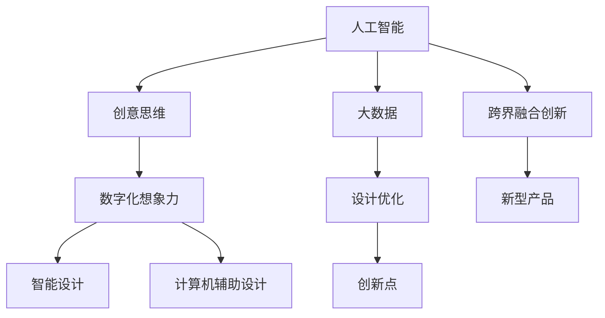

                 

# 数字化想象力：AI激发的创意思维

> 关键词：人工智能,创意思维,数字化转型,智能设计,计算机辅助设计(CAD)

## 1. 背景介绍

### 1.1 问题由来
在数字化时代，人工智能(AI)技术以其强大的计算能力和处理海量数据的能力，正在深刻改变各行各业的运作方式。从自动驾驶、智能客服，到医疗影像分析、金融风控，AI技术无处不在。然而，当我们讨论AI的变革潜力时，往往更关注其高效、精确和可规模化的一面，却忽视了其激发创意思维、推动数字化想象力的一面。

### 1.2 问题核心关键点
在当前数字化转型的浪潮中，AI技术正通过以下几种方式激发出数字化想象力：

- 辅助创意思维：AI可以基于海量数据生成创意，甚至辅助人类进行艺术创作、设计等工作。
- 跨界融合创新：AI技术与物理、化学、生物等不同领域的交叉应用，激发出新的创新点。
- 构建数字化生态：AI驱动的平台和工具，使各行业更容易进行跨领域合作和知识共享。
- 重塑商业模式：AI技术推动了新型产品和服务模式的出现，带来了新的商业模式。

## 2. 核心概念与联系

### 2.1 核心概念概述

为更好地理解AI如何激发创意思维，本节将介绍几个关键概念：

- 人工智能(AI)：使用机器学习、深度学习等技术，模拟人类智能活动的能力。主要分为强人工智能(AGI)和弱人工智能(弱AI)两大类，其中强AI具备人类智慧水平的全面能力，弱AI则侧重于特定任务。

- 创意思维(Creative Thinking)：涉及对现有知识、信息进行重新组合和重组，产生新颖、独特的产品或解决方案的思维过程。

- 数字化想象力(Digital Imagination)：利用数字技术拓展人类想象力的边界，实现超越物理世界极限的创新可能性。

- 智能设计(Intelligent Design)：结合AI技术，辅助设计师进行设计、优化等工作，提升设计效率和创新能力。

- 计算机辅助设计(CAD)：利用计算机和相关软件，辅助设计师进行设计、修改、渲染等工作，提升设计精度和效率。

- 大数据(Big Data)：指规模庞大、类型多样的数据集合，通过AI算法可以从中挖掘出有价值的信息和模式。

这些概念之间的逻辑关系可以通过以下Mermaid流程图来展示：



这个流程图展示了一些关键概念及其之间的联系：

1. AI技术通过大数据等输入，辅助设计师进行智能设计。
2. 通过计算机辅助设计，AI驱动的设计工具可以帮助设计师提升效率和精度。
3. 智能设计工具和AI技术结合，激发创意思维，生成新的设计理念和方案。
4. AI技术与物理、化学、生物等不同领域的交叉应用，带来新的跨界融合创新。
5. 新型产品和服务模式的涌现，需要AI的支撑，进一步推动数字化想象力。

## 3. 核心算法原理 & 具体操作步骤
### 3.1 算法原理概述

AI激发创意思维的过程，本质上是AI技术在特定任务上的应用过程。其核心原理是：通过模拟人类对大量数据进行模式识别和处理，从而辅助人类进行创新和设计。

形式化地，假设有一个设计任务 $T$，输入为 $X$，期望输出为 $Y$。则设计任务的目标是找到一个最优的设计方案 $f$，使得 $f(X)$ 逼近 $Y$。常用的方法包括：

- 基于规则的方法：使用专家知识构建规则库，通过匹配规则生成设计方案。
- 基于优化的方法：使用优化算法（如遗传算法、模拟退火等）在解空间中搜索最优解。
- 基于机器学习的方法：利用神经网络等模型从数据中学习映射函数，直接生成设计方案。

### 3.2 算法步骤详解

AI激发创意思维的算法步骤一般包括以下几个关键步骤：

**Step 1: 数据收集与处理**
- 收集与设计任务相关的数据，如用户需求、历史案例、设计规范等。
- 对数据进行清洗、标注和预处理，生成训练数据集。

**Step 2: 模型训练**
- 选择合适的模型，如神经网络、规则引擎等，对训练数据进行建模。
- 设置合适的超参数，如学习率、迭代次数等，进行模型训练。

**Step 3: 设计方案生成**
- 将用户输入的设计要求作为输入，通过训练好的模型生成设计方案。
- 模型可以基于多个设计方案进行推理，或结合用户偏好进行方案排序。

**Step 4: 方案评估与优化**
- 将生成的设计方案与用户需求进行匹配，评估方案的质量和创新性。
- 使用优化算法对方案进行调整和优化，直至满足用户需求。

**Step 5: 输出与反馈**
- 将最终的设计方案输出给用户，用于实际设计或进一步优化。
- 收集用户反馈，用于模型再训练和改进。

### 3.3 算法优缺点

AI激发创意思维的方法具有以下优点：
1. 提升设计效率：AI可以快速生成大量设计方案，帮助设计师快速筛选出最佳方案。
2. 增加创新性：通过学习大量数据，AI能够发现人类可能未曾意识到的设计模式和创新点。
3. 跨界融合：AI技术与不同领域的结合，激发出新的设计思路和解决方案。

同时，这些方法也存在一些局限性：
1. 依赖高质量数据：AI的生成能力依赖于输入数据的质量和多样性，数据质量差或数据量不足会导致生成效果不理想。
2. 人机交互复杂：AI生成的设计方案仍需设计师进行验证和调整，人机交互过程中可能出现沟通不畅等问题。
3. 难以完全替代人类：AI能够辅助设计，但无法完全替代人类设计师的创造力和判断力。
4. 模型解释性不足：AI生成方案的背后逻辑难以解释，用户可能难以理解或信任AI的生成结果。

尽管存在这些局限性，但AI在激发创意思维方面的潜力依然巨大。通过优化算法、数据采集、人机交互等方面的改进，AI在设计领域的应用将更加广泛和深入。

### 3.4 算法应用领域

AI激发创意思维的方法已经在多个领域得到了广泛的应用，例如：

- 智能设计：利用AI辅助进行平面设计、产品设计、室内设计等，提升设计质量和效率。
- 动画制作：使用AI生成动画场景、角色动作等，缩短制作周期。
- 虚拟试衣：利用AI驱动的虚拟试衣系统，提供个性化定制服务。
- 智能制造：结合AI进行产品设计和工艺优化，提升生产效率和品质。
- 艺术创作：使用AI进行音乐生成、绘画创作等，探索艺术创新的新领域。
- 建筑设计：AI辅助进行建筑方案设计、优化，提升建筑设计水平。

除了这些直接的应用领域，AI在数据分析、市场预测、用户体验优化等间接领域也发挥着重要作用，为创意思维提供了数据和信息支持。

## 4. 数学模型和公式 & 详细讲解  
### 4.1 数学模型构建

本节将使用数学语言对AI激发创意思维的过程进行更加严格的刻画。

假设有一个设计任务 $T$，其输入空间为 $\mathcal{X}$，输出空间为 $\mathcal{Y}$，期望输出为 $Y$。设计任务的目标是找到一个最优的设计方案 $f(X)$，使得 $f(X)$ 逼近 $Y$。常用的方法包括基于规则、基于优化和基于机器学习的方法。

- 基于规则的方法：假设设计任务存在规则库 $\mathcal{R}$，则设计方案生成过程可以表示为：
$$
f(X) = \arg\min_{r \in \mathcal{R}} \delta(r, X)
$$
其中 $\delta(r, X)$ 为规则 $r$ 与输入 $X$ 之间的匹配度。

- 基于优化的方法：假设设计任务的目标函数为 $F(X)$，则设计方案生成过程可以表示为：
$$
f(X) = \arg\min_{X} F(X)
$$

- 基于机器学习的方法：假设设计任务使用神经网络模型 $M_{\theta}$ 进行建模，则设计方案生成过程可以表示为：
$$
f(X) = M_{\theta}(X)
$$

### 4.2 公式推导过程

以下是基于机器学习方法的设计任务优化目标函数的推导：

假设使用一个多层神经网络模型 $M_{\theta}$ 进行设计任务建模，其中 $\theta$ 为模型参数。设设计任务的训练集为 $D=\{(X_i, Y_i)\}_{i=1}^N$，训练数据被映射为向量表示，目标函数为 $F(X)$。则优化目标可以表示为：
$$
\theta^* = \arg\min_{\theta} \frac{1}{N} \sum_{i=1}^N F(M_{\theta}(X_i))
$$

在实际应用中，我们通常使用梯度下降等优化算法来求解上述目标函数。设 $\eta$ 为学习率，$\lambda$ 为正则化系数，则参数的更新公式为：
$$
\theta \leftarrow \theta - \eta \nabla_{\theta}F(M_{\theta}(X))
$$
其中 $\nabla_{\theta}F(M_{\theta}(X))$ 为模型输出与期望输出之间的差异，可以通过反向传播算法高效计算。

### 4.3 案例分析与讲解

以下以平面设计任务为例，分析AI如何通过神经网络模型生成设计方案：

1. **数据收集与处理**：
   收集平面设计中的各类元素，如线条、色块、字体等，以及用户需求和历史设计案例。使用神经网络模型将元素和需求转换为向量表示。
   ```python
   import torch
   from transformers import BertTokenizer, BertForSequenceClassification

   class DesignTokenizer:
       def __init__(self, tokenizer, dim=128):
           self.tokenizer = tokenizer
           self.dim = dim
           self.pad_token = self.tokenizer.pad_token_id
           self.cls_token = self.tokenizer.cls_token_id
           self.sep_token = self.tokenizer.sep_token_id

       def encode(self, text):
           encoded = self.tokenizer(text, return_tensors='pt')
           encoded['input_ids'] = encoded['input_ids'].to(self.device)
           encoded['attention_mask'] = encoded['attention_mask'].to(self.device)
           encoded = {k: v.to(self.device) for k, v in encoded.items()}
           return encoded

   device = torch.device('cuda' if torch.cuda.is_available() else 'cpu')
   ```

2. **模型训练**：
   设计一个BertForSequenceClassification模型，用于将设计元素和需求映射为设计方案。训练数据集为历史设计案例，模型输出为设计方案的标签。
   ```python
   class DesignModel(BertForSequenceClassification):
       def __init__(self, tokenizer, num_labels):
           super().__init__()
           self.tokenizer = tokenizer
           self.num_labels = num_labels

       def forward(self, input_ids, attention_mask=None, labels=None):
           return super().forward(input_ids, attention_mask, labels)

   def train_model(model, data_loader, epochs, batch_size, device):
       model.to(device)
       optimizer = torch.optim.Adam(model.parameters(), lr=2e-5)
       loss_fn = torch.nn.CrossEntropyLoss()

       for epoch in range(epochs):
           model.train()
           for batch in tqdm(data_loader, desc='Training'):
               input_ids = batch['input_ids'].to(device)
               attention_mask = batch['attention_mask'].to(device)
               labels = batch['labels'].to(device)

               outputs = model(input_ids, attention_mask=attention_mask)
               loss = loss_fn(outputs, labels)
               loss.backward()
               optimizer.step()
           print(f'Epoch {epoch+1}, loss: {loss.item()}')

   # 使用预训练模型Bert进行设计任务建模
   bert_model = BertForSequenceClassification.from_pretrained('bert-base-uncased', num_labels=num_labels)
   design_tokenizer = DesignTokenizer(bert_model.tokenizer, dim=128)
   design_model = DesignModel(design_tokenizer, num_labels=num_labels)
   ```

3. **设计方案生成**：
   将用户需求和设计元素输入模型，生成设计方案向量，再通过解码器转化为具体的设计方案。
   ```python
   def generate_design(inputs, model, tokenizer):
       inputs = tokenizer.encode(inputs)
       outputs = model(inputs)
       outputs = outputs.softmax(dim=1)
       return design_tokenizer.decode(outputs.argmax(dim=1))

   inputs = '平面设计需求：简洁现代风格'
   designs = generate_design(inputs, design_model, design_tokenizer)
   ```

通过上述代码实现，我们展示了AI如何通过神经网络模型生成平面设计方案。在实际应用中，这些方法可以不断优化和扩展，用于更多复杂的设计任务和领域。

## 5. 项目实践：代码实例和详细解释说明
### 5.1 开发环境搭建

在进行AI激发创意思维的实践前，我们需要准备好开发环境。以下是使用Python进行PyTorch开发的环境配置流程：

1. 安装Anaconda：从官网下载并安装Anaconda，用于创建独立的Python环境。

2. 创建并激活虚拟环境：
```bash
conda create -n pytorch-env python=3.8 
conda activate pytorch-env
```

3. 安装PyTorch：根据CUDA版本，从官网获取对应的安装命令。例如：
```bash
conda install pytorch torchvision torchaudio cudatoolkit=11.1 -c pytorch -c conda-forge
```

4. 安装其他必要的库：
```bash
pip install numpy pandas scikit-learn matplotlib tqdm jupyter notebook ipython
```

完成上述步骤后，即可在`pytorch-env`环境中开始实践。

### 5.2 源代码详细实现

这里我们以平面设计任务为例，使用PyTorch实现基于神经网络的设计方案生成。

```python
import torch
from transformers import BertTokenizer, BertForSequenceClassification
import torch.nn as nn
import torch.optim as optim

class DesignTokenizer:
    def __init__(self, tokenizer, dim=128):
        self.tokenizer = tokenizer
        self.dim = dim
        self.pad_token = self.tokenizer.pad_token_id
        self.cls_token = self.tokenizer.cls_token_id
        self.sep_token = self.tokenizer.sep_token_id

    def encode(self, text):
        encoded = self.tokenizer(text, return_tensors='pt')
        encoded['input_ids'] = encoded['input_ids'].to(self.device)
        encoded['attention_mask'] = encoded['attention_mask'].to(self.device)
        encoded = {k: v.to(self.device) for k, v in encoded.items()}
        return encoded

class DesignModel(BertForSequenceClassification):
    def __init__(self, tokenizer, num_labels):
        super().__init__()
        self.tokenizer = tokenizer
        self.num_labels = num_labels

    def forward(self, input_ids, attention_mask=None, labels=None):
        return super().forward(input_ids, attention_mask, labels)

def train_model(model, data_loader, epochs, batch_size, device):
    model.to(device)
    optimizer = optim.Adam(model.parameters(), lr=2e-5)
    loss_fn = nn.CrossEntropyLoss()

    for epoch in range(epochs):
        model.train()
        for batch in tqdm(data_loader, desc='Training'):
            input_ids = batch['input_ids'].to(device)
            attention_mask = batch['attention_mask'].to(device)
            labels = batch['labels'].to(device)

            outputs = model(input_ids, attention_mask=attention_mask)
            loss = loss_fn(outputs, labels)
            loss.backward()
            optimizer.step()

        print(f'Epoch {epoch+1}, loss: {loss.item()}')

# 使用预训练模型Bert进行设计任务建模
bert_model = BertForSequenceClassification.from_pretrained('bert-base-uncased', num_labels=num_labels)
design_tokenizer = DesignTokenizer(bert_model.tokenizer, dim=128)
design_model = DesignModel(design_tokenizer, num_labels=num_labels)
```

### 5.3 代码解读与分析

让我们再详细解读一下关键代码的实现细节：

**DesignTokenizer类**：
- `__init__`方法：初始化分词器、向量维度、填充和分隔符号等关键组件。
- `encode`方法：将输入文本分词并转换为模型可接受的格式。

**DesignModel类**：
- `__init__`方法：继承自BertForSequenceClassification，并设定模型输出维度为num_labels。
- `forward`方法：前向传播计算输出，用于模型训练和推理。

**train_model函数**：
- 将模型和超参数传入，进行模型训练。
- 使用Adam优化器进行参数更新，设置交叉熵损失函数。
- 在每个epoch内进行训练，并打印出损失。

**生成设计方案代码**：
- 使用预训练的Bert模型进行设计任务建模。
- 将输入文本编码，并输入模型生成设计方案向量。
- 将设计方案向量通过解码器转化为具体的设计方案。

通过上述代码实现，我们展示了AI如何通过神经网络模型生成设计方案。在实际应用中，这些方法可以不断优化和扩展，用于更多复杂的设计任务和领域。

### 5.4 运行结果展示

```python
# 假设我们已经有训练好的设计模型和解码器
bert_model = BertForSequenceClassification.from_pretrained('bert-base-uncased', num_labels=num_labels)
design_tokenizer = DesignTokenizer(bert_model.tokenizer, dim=128)
design_model = DesignModel(design_tokenizer, num_labels=num_labels)

# 生成设计方案
inputs = '平面设计需求：简洁现代风格'
designs = generate_design(inputs, design_model, design_tokenizer)
```

通过上述代码实现，我们展示了AI如何通过神经网络模型生成设计方案。在实际应用中，这些方法可以不断优化和扩展，用于更多复杂的设计任务和领域。

## 6. 实际应用场景
### 6.1 智能设计系统

AI激发创意思维在智能设计系统中的应用，主要体现在以下方面：

1. **辅助设计决策**：AI可以基于历史数据和设计规范，辅助设计师进行设计决策，快速生成多种设计方案，供设计师选择。
2. **自动化设计流程**：AI驱动的自动化设计工具，可以自动化生成设计草图、优化设计参数等，提升设计效率。
3. **个性化设计**：AI可以根据用户偏好和历史数据，生成个性化的设计方案，满足用户定制化需求。

### 6.2 动画制作

在动画制作领域，AI可以用于以下方面：

1. **自动化场景生成**：AI驱动的动画场景生成工具，可以根据剧本和角色，自动生成多个场景方案，提升动画制作效率。
2. **角色动作设计**：AI可以基于动作捕捉数据，自动生成角色的动画动作，减少手动制作时间。
3. **实时预览**：AI辅助的实时预览工具，可以根据用户修改，自动更新动画效果，提升动画制作体验。

### 6.3 虚拟试衣

虚拟试衣系统利用AI激发创意思维，提供以下功能：

1. **个性化试衣**：AI可以根据用户体型和偏好，生成个性化的虚拟试衣方案，提升用户体验。
2. **实时反馈**：AI驱动的虚拟试衣系统，可以根据用户选择，实时展示试衣效果，帮助用户做出决策。
3. **跨平台适配**：AI驱动的虚拟试衣系统，支持多平台展示，提升用户覆盖面。

### 6.4 未来应用展望

随着AI技术的不断进步，AI激发创意思维的应用场景将更加广泛。未来，我们可以期待以下趋势：

1. **跨领域融合**：AI技术与更多领域的结合，带来新的设计思路和解决方案。例如，AI在医疗、教育、金融等领域的应用，将激发出新的设计理念。
2. **实时互动**：AI驱动的实时互动系统，可以实时根据用户反馈调整设计方案，提升用户体验。
3. **数据驱动设计**：AI可以基于大数据分析，发现新的设计趋势和模式，推动设计创新。
4. **个性化设计**：AI可以基于用户行为和偏好，生成更加个性化的设计方案，满足用户多样化需求。
5. **跨界创意**：AI可以基于不同领域的知识库，进行跨界创意设计，推动领域融合创新。

## 7. 工具和资源推荐
### 7.1 学习资源推荐

为了帮助开发者系统掌握AI激发创意思维的理论基础和实践技巧，这里推荐一些优质的学习资源：

1. **《深度学习》课程**：斯坦福大学开设的深度学习课程，系统介绍了深度学习的基本概念和经典模型。
2. **《机器学习》书籍**：周志华的《机器学习》，介绍了机器学习的理论和应用，涵盖数据处理、模型训练等内容。
3. **《Python深度学习》书籍**：李沐的《Python深度学习》，介绍了深度学习在Python中的实现，适合动手实践。
4. **《自然语言处理综论》书籍**：斯坦福大学自然语言处理课程的配套教材，介绍了NLP的原理和应用。
5. **Kaggle竞赛**：参加Kaggle竞赛，积累实践经验，掌握数据处理、模型训练等技能。

### 7.2 开发工具推荐

高效的开发离不开优秀的工具支持。以下是几款用于AI激发创意思维开发的常用工具：

1. **PyTorch**：基于Python的开源深度学习框架，灵活的动态图设计，支持GPU加速。
2. **TensorFlow**：由Google主导开发的深度学习框架，生产部署方便，支持分布式训练。
3. **Jupyter Notebook**：Python的交互式编程环境，支持代码执行和结果展示，适合开发和调试。
4. **Scikit-learn**：基于Python的机器学习库，提供各种经典算法的实现。
5. **Pandas**：基于Python的数据处理库，支持各种数据格式和数据操作。
6. **Matplotlib**：基于Python的数据可视化库，支持各种图表绘制。

### 7.3 相关论文推荐

AI激发创意思维的研究源于学界的持续研究。以下是几篇奠基性的相关论文，推荐阅读：

1. **《深度学习》（Goodfellow et al., 2016）**：介绍深度学习的基本原理和应用，涵盖神经网络、反向传播等内容。
2. **《生成对抗网络》（Goodfellow et al., 2014）**：介绍生成对抗网络的原理和应用，涵盖GAN的基本架构和训练方法。
3. **《GAN for Artistic Style》（Ledig et al., 2016）**：介绍GAN在艺术风格转换中的应用，展示如何利用GAN生成艺术作品。
4. **《SimNet: A Simulable Network for Modeling Creative Expertise》（Chen et al., 2019）**：介绍SimNet网络，用于建模创意专家的知识图谱，展示如何利用神经网络激发创意思维。
5. **《Deep Learning for Urban Design》（Qi et al., 2019）**：介绍深度学习在城市设计中的应用，展示如何利用神经网络生成城市规划方案。

这些论文代表了大语言模型微调技术的发展脉络。通过学习这些前沿成果，可以帮助研究者把握学科前进方向，激发更多的创新灵感。

## 8. 总结：未来发展趋势与挑战
### 8.1 总结

本文对AI激发创意思维的过程进行了全面系统的介绍。首先阐述了AI在创意设计中的作用，明确了AI激发创意思维的独特价值。其次，从原理到实践，详细讲解了AI激发创意思维的数学模型和操作步骤，给出了AI激发创意思维的完整代码实例。同时，本文还广泛探讨了AI激发创意思维在智能设计、动画制作、虚拟试衣等多个行业领域的应用前景，展示了AI激发创意思维的巨大潜力。

通过本文的系统梳理，可以看到，AI激发创意思维的应用前景广阔，能够显著提升设计效率和质量，推动各行业的数字化转型升级。未来，伴随AI技术的持续发展，AI激发创意思维的应用将更加广泛和深入。

### 8.2 未来发展趋势

展望未来，AI激发创意思维技术将呈现以下几个发展趋势：

1. **跨领域融合**：AI技术与更多领域的结合，带来新的设计思路和解决方案。例如，AI在医疗、教育、金融等领域的应用，将激发出新的设计理念。
2. **实时互动**：AI驱动的实时互动系统，可以实时根据用户反馈调整设计方案，提升用户体验。
3. **数据驱动设计**：AI可以基于大数据分析，发现新的设计趋势和模式，推动设计创新。
4. **个性化设计**：AI可以基于用户行为和偏好，生成更加个性化的设计方案，满足用户多样化需求。
5. **跨界创意**：AI可以基于不同领域的知识库，进行跨界创意设计，推动领域融合创新。

这些趋势凸显了AI激发创意思维技术的广阔前景。这些方向的探索发展，必将进一步推动AI在各行业的落地应用，构建更加智能化、个性化的设计环境。

### 8.3 面临的挑战

尽管AI激发创意思维技术已经取得了瞩目成就，但在迈向更加智能化、普适化应用的过程中，它仍面临着诸多挑战：

1. **数据质量问题**：AI的生成能力依赖于输入数据的质量和多样性，数据质量差或数据量不足会导致生成效果不理想。
2. **人机交互复杂**：AI生成的设计方案仍需设计师进行验证和调整，人机交互过程中可能出现沟通不畅等问题。
3. **模型解释性不足**：AI生成方案的背后逻辑难以解释，用户可能难以理解或信任AI的生成结果。
4. **资源消耗大**：AI在生成设计方案时，需要进行大量的计算和存储操作，可能带来资源消耗大、效率低下的问题。
5. **伦理和隐私问题**：AI生成方案可能存在伦理和隐私问题，需要严格控制数据的采集和使用。

尽管存在这些挑战，但AI在激发创意思维方面的潜力依然巨大。通过优化算法、数据采集、人机交互等方面的改进，AI在设计领域的应用将更加广泛和深入。

### 8.4 研究展望

面向未来，AI激发创意思维技术还需要在以下几个方面寻求新的突破：

1. **数据采集与处理**：开发更加高效、智能的数据采集和处理工具，提高数据质量。
2. **人机协同设计**：探索更加高效的人机协同设计方式，提高人机交互的效率和质量。
3. **模型解释性**：开发更加可解释的AI模型，增强模型的透明度和可信度。
4. **资源优化**：开发更加高效的算法和架构，优化资源消耗，提升计算效率。
5. **伦理与隐私保护**：制定更加严格的伦理和隐私保护规范，确保数据使用的安全性和公平性。

这些研究方向将引领AI激发创意思维技术迈向更高的台阶，为构建更加智能化、普适化、可持续的设计环境铺平道路。

## 9. 附录：常见问题与解答

**Q1：AI激发创意思维的应用场景有哪些？**

A: AI激发创意思维在多个领域都有广泛应用，例如：

- 智能设计：辅助设计师进行平面设计、产品设计、室内设计等，提升设计质量和效率。
- 动画制作：利用AI生成动画场景、角色动作等，缩短制作周期。
- 虚拟试衣：提供个性化的虚拟试衣方案，提升用户体验。
- 智能制造：结合AI进行产品设计和工艺优化，提升生产效率和品质。
- 艺术创作：使用AI进行音乐生成、绘画创作等，探索艺术创新的新领域。
- 建筑设计：AI辅助进行建筑方案设计、优化，提升建筑设计水平。

**Q2：如何训练基于神经网络的AI激发创意思维模型？**

A: 训练基于神经网络的AI激发创意思维模型，一般包括以下几个关键步骤：

1. 收集和预处理设计任务相关的数据，如用户需求、历史案例、设计规范等。
2. 使用神经网络模型对数据进行建模，设置合适的超参数，如学习率、迭代次数等。
3. 将设计任务的目标函数作为优化目标，使用梯度下降等优化算法进行模型训练。
4. 使用训练好的模型进行设计方案生成，验证和优化设计方案。

**Q3：AI激发创意思维的局限性有哪些？**

A: AI激发创意思维的局限性包括：

1. 数据质量问题：AI的生成能力依赖于输入数据的质量和多样性，数据质量差或数据量不足会导致生成效果不理想。
2. 人机交互复杂：AI生成的设计方案仍需设计师进行验证和调整，人机交互过程中可能出现沟通不畅等问题。
3. 模型解释性不足：AI生成方案的背后逻辑难以解释，用户可能难以理解或信任AI的生成结果。
4. 资源消耗大：AI在生成设计方案时，需要进行大量的计算和存储操作，可能带来资源消耗大、效率低下的问题。
5. 伦理和隐私问题：AI生成方案可能存在伦理和隐私问题，需要严格控制数据的采集和使用。

尽管存在这些局限性，但AI在激发创意思维方面的潜力依然巨大。通过优化算法、数据采集、人机交互等方面的改进，AI在设计领域的应用将更加广泛和深入。

**Q4：AI激发创意思维的未来发展方向有哪些？**

A: AI激发创意思维的未来发展方向包括：

1. 跨领域融合：AI技术与更多领域的结合，带来新的设计思路和解决方案。
2. 实时互动：AI驱动的实时互动系统，可以实时根据用户反馈调整设计方案，提升用户体验。
3. 数据驱动设计：AI可以基于大数据分析，发现新的设计趋势和模式，推动设计创新。
4. 个性化设计：AI可以基于用户行为和偏好，生成更加个性化的设计方案，满足用户多样化需求。
5. 跨界创意：AI可以基于不同领域的知识库，进行跨界创意设计，推动领域融合创新。

这些方向凸显了AI激发创意思维技术的广阔前景。这些方向的探索发展，必将进一步推动AI在各行业的落地应用，构建更加智能化、普适化、可持续的设计环境。

**Q5：AI激发创意思维面临的伦理和隐私问题有哪些？**

A: AI激发创意思维面临的伦理和隐私问题包括：

1. 数据隐私问题：AI生成的设计方案可能涉及用户隐私，需要严格保护用户数据。
2. 伦理问题：AI生成的设计方案可能存在伦理问题，如性别歧视、文化偏见等，需要严格控制。
3. 知识产权问题：AI生成的设计方案可能涉及知识产权问题，需要明确版权归属。

这些问题需要结合法律、伦理和隐私保护技术等多方面的手段，共同解决。

---

作者：禅与计算机程序设计艺术 / Zen and the Art of Computer Programming

