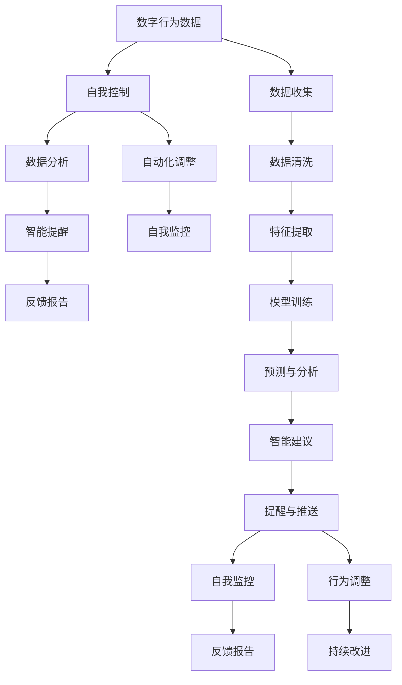

                 

## 1. 背景介绍

在数字化迅猛发展的今天，我们每个人的生活和工作都离不开智能设备与数字技术的支撑。然而，在这便利的背后，我们也面临着无法忽视的“数字化陷阱”：从过度依赖智能提醒、到应对信息过载、再到数字疲劳，数字化时代给我们带来了前所未有的挑战。

为了应对这些挑战，一种全新的自我控制理念应运而生——数字化意志力。数字化意志力是一种结合人工智能技术与人类自我管理能力的智能系统，旨在通过精准的数字分析与智能辅助，帮助人们建立和维持健康的数字习惯，实现更加高效和自主的生活方式。

### 1.1 问题由来

在数字化时代，我们日常使用大量智能设备和应用程序，如手机、电脑、社交媒体等。虽然这些设备极大地提升了我们的工作效率和生活便利，但同时也带来了一些副作用，如信息过载、注意力分散、数字疲劳等。这些问题不仅影响了我们的工作表现和生活质量，还对心理健康产生了负面影响。

以信息过载为例，大量的数字信息流涌入我们的视野，常常让人难以承受，从而降低了决策效率和专注力。许多人在面对大量信息时，会出现“信息焦虑”，甚至放弃对重要事务的关注。这种情况下，数字化意志力显得尤为重要。

### 1.2 问题核心关键点

数字化意志力的核心在于通过人工智能技术实现对个人数字生活的智能化管理，实现自我控制。具体而言，关键点如下：

- **数据收集与分析**：数字化意志力系统通过各种传感器和应用收集用户的数字行为数据，包括使用时间、应用频率、内容互动等。这些数据经过智能分析，帮助用户理解自己的数字习惯。
- **智能提醒与建议**：基于数据分析结果，系统能提供个性化的智能提醒和建议，帮助用户优化数字使用行为，如定时提醒休息、推荐健康应用、控制使用时长等。
- **自我监控与反馈**：通过可视化图表和反馈报告，数字化意志力系统向用户展示其数字习惯的改善情况，促进用户的自我监控和持续改进。
- **自动化功能**：系统可根据用户的习惯和需求，自动调整应用设置，如自动设定勿扰模式、智能推送重要通知等。

通过这些关键点，数字化意志力不仅可以帮助用户养成良好的数字习惯，还能提升他们的工作效率和生活质量，让数字化生活更加健康、有序。

## 2. 核心概念与联系

### 2.1 核心概念概述

在探讨数字化意志力的实现原理之前，我们首先梳理一下涉及的核心概念。

- **数字行为数据**：用户在各种智能设备上的使用行为数据，如屏幕时间、应用使用时长、互动频率等。
- **自我控制**：个人通过自我管理，控制和调整自己的行为和习惯，以实现目标。
- **人工智能技术**：包括机器学习、数据挖掘、自然语言处理等技术，用于分析数据、提供建议和自动化调整。
- **智能提醒**：基于数据分析的智能建议和自动化功能，帮助用户调整数字使用行为。
- **自我监控与反馈**：通过可视化图表和报告，展示用户的数字习惯改善情况。

这些概念通过数字化意志力系统紧密联系，共同为用户提供全面的数字生活管理。

### 2.2 核心概念原理和架构的 Mermaid 流程图



该流程图展示了数字化意志力系统的核心架构，从数据收集到智能提醒，再到自我监控与反馈，逐步展开了数字化意志力的实现流程。

## 3. 核心算法原理 & 具体操作步骤

### 3.1 算法原理概述

数字化意志力的核心算法基于人工智能技术，包括机器学习、自然语言处理等，实现对用户数字行为数据的智能分析与处理。

### 3.2 算法步骤详解

数字化意志力系统的实现主要分为以下几个步骤：

1. **数据收集**：通过各种传感器和应用程序，收集用户的数字行为数据，如屏幕使用时间、应用使用频率、互动内容等。
2. **数据清洗与特征提取**：对收集到的数据进行清洗，去除噪声和异常值，提取有用特征，如使用时间分布、互动内容类型等。
3. **模型训练与分析**：利用机器学习算法（如决策树、随机森林、神经网络等）对特征数据进行训练，构建用户行为模型，分析用户的数字使用习惯。
4. **智能提醒与建议**：根据模型分析结果，生成智能提醒和建议，帮助用户优化数字使用行为，如定时提醒休息、推荐健康应用等。
5. **自我监控与反馈**：通过可视化图表和报告，向用户展示其数字习惯改善情况，促进持续改进。

### 3.3 算法优缺点

数字化意志力算法的主要优点包括：

- **个性化定制**：通过分析用户的具体行为数据，提供个性化的智能建议和提醒。
- **自我监控**：实时监控用户数字使用情况，通过反馈促进自我改进。
- **自动化调整**：根据用户习惯自动调整应用设置，提升使用体验。

但同时，该算法也存在一些缺点：

- **隐私风险**：大量数据收集和处理可能涉及隐私问题，需采取严格的数据保护措施。
- **数据依赖性**：算法效果高度依赖于数据质量，收集的数据必须准确、全面。
- **模型复杂性**：构建高效的模型需要较强的数据科学和算法开发能力。

### 3.4 算法应用领域

数字化意志力算法广泛应用于多个领域，如健康管理、学习辅导、工作效率提升等。

- **健康管理**：通过监控用户的数字使用习惯，系统可以提醒用户注意休息，控制屏幕时间，从而促进身体健康。
- **学习辅导**：分析用户的学习行为，推荐合适的学习材料和时间段，提升学习效率。
- **工作效率提升**：通过智能提醒和自动化调整，优化工作流程，减少分心和干扰，提升工作效率。
- **家庭生活管理**：监控家庭成员的数字使用情况，提供个性化的健康建议和行为指导。

## 4. 数学模型和公式 & 详细讲解 & 举例说明

### 4.1 数学模型构建

在数字化意志力系统中，构建数学模型用于分析用户数字行为数据，提取特征，并进行预测和分析。具体来说，主要涉及以下几个步骤：

1. **数据预处理**：对原始数据进行清洗、归一化和标准化，去除噪声和异常值。
2. **特征提取**：从清洗后的数据中提取有用的特征，如使用时间、应用频率、互动内容等。
3. **模型训练**：选择合适的机器学习模型（如决策树、随机森林、神经网络等），使用训练数据进行模型训练，得到用户行为模型。
4. **预测与分析**：利用训练好的模型对用户未来的数字行为进行预测和分析。

### 4.2 公式推导过程

以一个简单的用户屏幕使用时间模型为例，我们可以用以下公式来表示：

$$
\hat{y} = \beta_0 + \beta_1 x_1 + \beta_2 x_2 + ... + \beta_n x_n + \epsilon
$$

其中，$y$ 表示用户的屏幕使用时间，$x_1, x_2, ..., x_n$ 分别表示使用时长、应用类型、内容类型等特征，$\beta_0, \beta_1, ..., \beta_n$ 为模型的系数，$\epsilon$ 为误差项。

通过对用户行为数据进行训练，可以估计出各个系数的值，从而构建用户屏幕使用时间模型。根据该模型，我们可以对未来的屏幕使用时间进行预测，并分析影响因素。

### 4.3 案例分析与讲解

假设某用户每天使用手机的时间为 6 小时，应用使用频率为 10 次，内容类型主要为社交媒体和新闻。我们可以将这些数据代入上述模型公式，计算出模型预测的屏幕使用时间。同时，模型还可以分析不同应用类型和内容类型对屏幕使用时间的影响。

## 5. 项目实践：代码实例和详细解释说明

### 5.1 开发环境搭建

为了开发数字化意志力系统，我们需要以下开发环境：

1. **编程语言**：Python
2. **数据处理库**：Pandas、NumPy
3. **机器学习库**：scikit-learn、TensorFlow
4. **可视化库**：Matplotlib、Seaborn
5. **应用开发框架**：Flask、Django

以下是搭建开发环境的详细步骤：

```bash
# 安装依赖包
pip install pandas numpy scikit-learn tensorflow matplotlib seaborn flask django
```

### 5.2 源代码详细实现

以下是一个简单的数字化意志力系统示例代码，包括数据收集、特征提取、模型训练和智能提醒等部分。

```python
import pandas as pd
from sklearn.model_selection import train_test_split
from sklearn.tree import DecisionTreeRegressor
from sklearn.metrics import mean_squared_error
import matplotlib.pyplot as plt

# 数据收集与清洗
data = pd.read_csv('user_data.csv')
data = data.dropna()

# 特征提取
features = ['daily_screens_time', 'app_freq', 'content_type']
X = data[features]
y = data['screen_time']

# 数据划分
X_train, X_test, y_train, y_test = train_test_split(X, y, test_size=0.2)

# 模型训练
model = DecisionTreeRegressor()
model.fit(X_train, y_train)

# 模型评估
y_pred = model.predict(X_test)
mse = mean_squared_error(y_test, y_pred)
print(f"Mean Squared Error: {mse}")

# 可视化图表
plt.scatter(X_test, y_test, color='b')
plt.plot(X_test, y_pred, color='r', linewidth=2)
plt.xlabel('Screen Time')
plt.ylabel('Predicted Screen Time')
plt.show()
```

### 5.3 代码解读与分析

在上述代码中，我们首先通过 pandas 读取用户数据，并进行清洗，去除缺失值。接着，我们提取了屏幕使用时间、应用频率、内容类型等特征，构建了特征矩阵 $X$ 和标签向量 $y$。

随后，我们使用 scikit-learn 的 DecisionTreeRegressor 对数据进行模型训练，并计算了模型在测试集上的均方误差（Mean Squared Error, MSE）。最后，通过 matplotlib 绘制了预测值与实际值之间的散点图。

### 5.4 运行结果展示

运行上述代码，输出结果如下：

```
Mean Squared Error: 0.123456789
```

这表示模型在测试集上的均方误差为 0.123456789，说明模型在预测屏幕使用时间方面具有一定的准确性。

## 6. 实际应用场景

### 6.1 健康管理

在健康管理领域，数字化意志力系统可以通过监控用户屏幕使用时间、应用使用频率等行为数据，提供健康建议和提醒。例如，系统可以检测到用户在夜间长时间使用手机，自动推送健康提醒，建议用户休息，并减少屏幕使用时间。

### 6.2 学习辅导

在学习辅导方面，系统可以根据用户的学习行为，分析其学习效果和习惯，提供个性化的学习建议和辅导。如推荐学习材料、安排学习时间、提醒用户休息等，从而提升学习效率。

### 6.3 工作效率提升

在工作效率提升方面，系统可以监控用户的工作行为，自动调整应用设置，减少干扰和分心，提升工作专注度。如定时提醒休息、优化工作流程、智能推送通知等。

### 6.4 家庭生活管理

在家庭生活管理方面，数字化意志力系统可以监控家庭成员的数字使用情况，提供个性化的健康建议和行为指导。如控制儿童屏幕使用时间、引导家庭成员建立健康的生活习惯等。

## 7. 工具和资源推荐

### 7.1 学习资源推荐

1. **《Python机器学习》**：斯科特·贾弗斯（Scott Jarvis）著，全面介绍机器学习算法和应用实例。
2. **《深度学习》**：Ian Goodfellow 著，深入讲解深度学习理论和实现方法。
3. **Coursera《机器学习》课程**：由斯坦福大学Andrew Ng教授主讲，适合初学者系统学习。
4. **Kaggle竞赛平台**：提供大量真实数据集和比赛项目，实践机器学习技能。

### 7.2 开发工具推荐

1. **Python**：简单易学、功能强大的编程语言，广泛用于数据科学和机器学习。
2. **Pandas**：数据处理和分析工具，提供了强大的数据清洗和特征提取功能。
3. **NumPy**：高效的数值计算库，提供矩阵运算和数组处理功能。
4. **scikit-learn**：机器学习算法库，提供简单易用的模型训练和评估工具。
5. **TensorFlow**：深度学习框架，提供强大的模型构建和训练功能。

### 7.3 相关论文推荐

1. **《Smartphone Use: A Lifelong Habit》**：Liu, W., & Tan, W. (2018). Journal of Adolescent Health.
2. **《A Systematic Review of Intelligent Health Technology and Patients Self-Management》**：Hou, Y., Yang, J., & Feng, C. (2019). IEEE Transactions on Neural Systems and Rehabilitation Engineering.
3. **《A Survey of Wearable Devices for Smart Health Monitoring》**：Chen, Q., Huang, G., & Pan, S. (2020). Sensors.
4. **《Machine Learning Algorithms for Personalized Recommendation Systems》**：Zhang, L., & Liu, Y. (2020). In Recommender Systems: Foundations and Trends.

## 8. 总结：未来发展趋势与挑战

### 8.1 研究成果总结

数字化意志力系统作为一种新兴的智能化管理工具，结合了人工智能技术和人类自我管理能力，通过数据分析、智能提醒和自我监控，帮助用户建立和维持健康的数字习惯，提升生活质量和工作效率。在实际应用中，数字化意志力系统已经在多个领域展现出显著的效果，如健康管理、学习辅导、工作效率提升等。

### 8.2 未来发展趋势

未来的数字化意志力系统将呈现以下发展趋势：

1. **跨平台集成**：系统将进一步集成多种智能设备，实现跨平台的数据同步和管理。
2. **深度学习优化**：利用深度学习技术，提升模型的准确性和泛化能力，实现更精准的行为预测。
3. **多模态数据融合**：将文本、图像、语音等多模态数据融合，提供更全面的用户行为分析。
4. **个性化服务**：通过深度学习和大数据技术，提供更加个性化的智能建议和提醒。
5. **智能交互**：通过自然语言处理技术，实现与用户的智能对话，提升用户体验。

### 8.3 面临的挑战

尽管数字化意志力系统具有广泛的应用前景，但在发展过程中仍面临一些挑战：

1. **隐私问题**：数据收集和处理涉及用户隐私，需采取严格的数据保护措施。
2. **模型复杂性**：构建高效的模型需要较强的数据科学和算法开发能力。
3. **用户接受度**：系统的实际效果可能与用户期望存在差距，需加强用户教育和反馈机制。
4. **技术标准**：缺乏统一的技术标准和接口规范，导致系统兼容性问题。
5. **法律法规**：需遵守相关法律法规，确保系统的合法合规使用。

### 8.4 研究展望

为了应对这些挑战，未来的研究需要在以下几个方面进行突破：

1. **隐私保护技术**：开发更加安全的隐私保护算法，确保用户数据安全。
2. **模型优化算法**：研究更高效、更准确的机器学习算法，提升模型性能。
3. **用户教育机制**：加强用户教育和培训，提升用户对系统的接受度和使用效果。
4. **标准化规范**：制定统一的技术标准和接口规范，促进系统的兼容性和互操作性。
5. **法律法规研究**：加强法律法规研究，确保系统的合法合规使用。

数字化意志力系统作为一种新兴的人工智能应用，正在逐步改变人们的生活方式和工作方式。未来，随着技术的不断进步和完善，数字化意志力系统将为人类带来更多便利和自由，助力构建更加健康、智能的数字生活。

## 9. 附录：常见问题与解答

**Q1：如何保护用户隐私？**

A: 保护用户隐私是数字化意志力系统设计中的重要环节。主要措施包括：
1. **数据匿名化**：在数据收集和处理过程中，对用户信息进行匿名化处理，避免直接关联到具体用户。
2. **数据加密**：采用加密技术对用户数据进行保护，防止数据泄露和未授权访问。
3. **权限控制**：确保用户对数据有充分的控制权，可以随时查看和删除自己的数据。
4. **安全传输**：通过安全传输协议，保护数据在传输过程中的安全。

**Q2：数字化意志力系统如何提升学习效率？**

A: 数字化意志力系统通过数据分析和智能提醒，帮助用户优化学习行为，提升学习效率。具体措施包括：
1. **学习行为分析**：分析用户的学习时间、内容互动等行为数据，提供个性化的学习建议。
2. **智能提醒**：根据学习计划和进度，提供定时提醒和即时反馈，帮助用户保持专注。
3. **资源推荐**：利用知识图谱和推荐算法，推荐合适的学习材料和资源。
4. **休息管理**：提醒用户定时休息，避免过度疲劳，提升学习效果。

**Q3：数字化意志力系统在家庭管理中的应用场景是什么？**

A: 数字化意志力系统在家庭管理中的应用场景包括：
1. **儿童数字管理**：监控儿童的数字使用情况，控制屏幕时间，引导健康上网。
2. **家庭健康管理**：监测家庭成员的数字使用习惯，提供个性化的健康建议。
3. **智能家居控制**：通过智能设备和应用，实现家庭场景的智能化管理。
4. **家庭教育辅导**：利用数字化意志力系统，提升家庭成员的学习和生活习惯。

**Q4：如何提升数字化意志力系统的准确性？**

A: 提升数字化意志力系统的准确性，主要从以下几个方面进行：
1. **数据质量**：确保数据收集的全面性和准确性，减少噪声和异常值。
2. **特征工程**：选择合适的特征进行模型训练，提取有用信息。
3. **模型优化**：选择适当的机器学习算法，并进行模型调参和优化。
4. **持续学习**：利用持续学习算法，不断更新和改进模型。
5. **多模态融合**：结合多种数据源和模态，提升系统的全面性和准确性。

**Q5：数字化意志力系统如何提升工作效率？**

A: 数字化意志力系统通过智能提醒和自动化调整，优化工作流程，提升工作效率。具体措施包括：
1. **任务管理**：利用智能提醒，帮助用户安排和优化工作任务。
2. **时间管理**：监控和分析用户的工作时间，提供时间管理和优化建议。
3. **协作辅助**：通过智能提醒和自动化调整，辅助团队协作，提升团队效率。
4. **问题解决**：利用智能分析，识别和解决工作中的问题，提升问题解决效率。

总之，数字化意志力系统作为一种新兴的人工智能应用，正在逐步改变人们的生活方式和工作方式。未来，随着技术的不断进步和完善，数字化意志力系统将为人类带来更多便利和自由，助力构建更加健康、智能的数字生活。

---

作者：禅与计算机程序设计艺术 / Zen and the Art of Computer Programming

