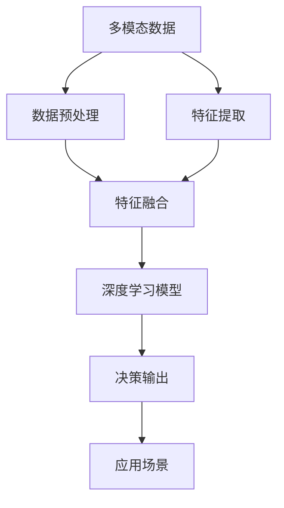
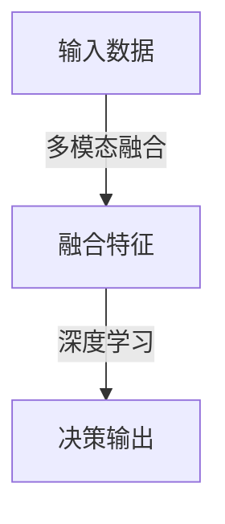

                 

# 数字化感知拓展：AI创新的感官维度

> 关键词：数字化感知, 人工智能, 感官维度, 多模态数据, 深度学习, 模型优化, 应用场景

## 1. 背景介绍

随着科技的迅猛发展，数字化感知正在改变我们与世界互动的方式。数字化的浪潮不仅改变了传统行业，也为AI创新提供了广阔的舞台。作为计算机科学领域的核心技术之一，AI的多感官感知能力正不断拓展其应用边界。本文将从数字化感知的基础、核心概念以及前沿应用等多个维度，深入探讨AI在感官维度上的创新突破。

### 1.1 问题由来

在过去几十年中，计算机视觉、语音识别、自然语言处理等技术已经取得了长足进展。然而，这些单一感知的AI技术仍存在一些局限性。例如，计算机视觉系统难以处理动态的场景变化，自然语言处理系统无法理解复杂的语境和情感。这些问题导致传统AI系统在实际应用中难以胜任一些复杂场景的任务。

为了克服这些局限性，越来越多的研究者和开发者开始探索多模态感知技术，即结合多种感官数据（如视觉、听觉、触觉等）的AI系统。这种多感官融合的系统能够更全面、准确地理解复杂现实世界的信息，从而为智能交互和自动化决策提供更可靠的基础。

### 1.2 问题核心关键点

本文将聚焦于AI在多模态感知上的创新，特别是如何通过深度学习等技术手段，将不同的感官数据融合为一个统一的数字化感知框架。我们将讨论以下几个核心关键点：

- **多模态数据融合**：如何在不同感官数据之间建立有效的映射关系，以实现数据的无缝融合。
- **深度学习模型**：如何利用深度学习模型，对多模态数据进行高效处理和特征提取。
- **模型优化与性能提升**：如何通过模型优化算法，提升多感官感知系统的鲁棒性和泛化能力。
- **实际应用场景**：多感官感知技术在哪些实际场景中能够发挥显著优势，并带来实际的价值。

## 2. 核心概念与联系

### 2.1 核心概念概述

为了更好地理解AI的多感官感知创新，我们需要明确几个核心概念：

- **多模态数据**：来自不同感官的多种数据，如视觉图像、语音信号、文本信息等。
- **深度学习模型**：一种强大的机器学习技术，能够处理高维数据，并在复杂任务中取得优异表现。
- **数据融合**：将不同模态的数据进行综合处理，提取出更有信息量的融合特征。
- **感官维度拓展**：通过融合多感官数据，拓展AI系统的感知范围，使其能够处理更加复杂和多样的现实世界信息。

### 2.2 核心概念原理和架构的 Mermaid 流程图



这个流程图展示了多感官感知系统的核心架构。不同模态的数据先经过预处理和特征提取，然后通过特征融合模块进行整合，最后由深度学习模型处理融合特征，输出最终的决策结果，应用于实际场景。

## 3. 核心算法原理 & 具体操作步骤

### 3.1 算法原理概述

AI的多感官感知系统，通常基于深度学习框架，通过融合不同模态的数据，构建起一个多维度的感知模型。这些系统旨在通过多感官数据的学习和融合，提升对复杂场景的感知和理解能力。

深度学习模型，如卷积神经网络（CNN）、循环神经网络（RNN）、变换器（Transformer）等，是实现多感官感知的重要工具。这些模型能够学习并处理高维度的感官数据，并通过多层网络结构，提取出有意义的特征表示。

### 3.2 算法步骤详解

#### 3.2.1 数据预处理

数据预处理是构建多感官感知系统的第一步。不同模态的数据需要经过标准化、归一化、降噪等预处理步骤，以保证数据的一致性和高质量。

例如，对于图像数据，通常需要进行去噪、裁剪、缩放等预处理操作。对于语音信号，则需要进行降噪、分段、特征提取等预处理。对于文本数据，通常需要分词、向量化等预处理。

#### 3.2.2 特征提取

特征提取是深度学习模型的核心部分。通过不同的神经网络结构，从原始数据中提取出有意义的特征表示。

例如，卷积神经网络通过卷积层和池化层，从图像数据中提取出空间特征；循环神经网络通过循环层，从时序数据中提取出时间特征；Transformer则通过自注意力机制，从文本数据中提取出语义特征。

#### 3.2.3 特征融合

特征融合是将不同模态的数据特征进行整合，以得到更加全面和准确的信息表示。常用的特征融合方法包括拼接、加权融合、深度融合等。

#### 3.2.4 模型训练

模型训练是利用大量标注数据，训练深度学习模型，使其能够从多感官数据中提取出有效的特征表示。训练过程通常包括前向传播、损失计算、反向传播等步骤。

#### 3.2.5 模型优化

模型优化是通过调整模型参数，提升模型的鲁棒性和泛化能力。常见的优化方法包括梯度下降、Adam、Adagrad等。

#### 3.2.6 模型评估

模型评估是验证模型性能的过程，通常包括训练集和测试集的交叉验证、混淆矩阵、F1-score等评估指标。

#### 3.2.7 应用场景

多感官感知系统的应用场景非常广泛，涵盖了医疗、交通、安防、教育等多个领域。通过在实际场景中应用这些系统，可以显著提升系统的智能化水平和用户体验。

## 4. 数学模型和公式 & 详细讲解 & 举例说明

### 4.1 数学模型构建

在多感官感知系统中，我们通常使用多输入输出神经网络（MIO）来处理不同模态的数据。这些网络的输入可以是不同感官的原始数据，如图像、语音、文本等，输出则是对应的决策结果，如分类、定位、识别等。

一个典型的MIO网络结构如下：



其中，多模态融合模块负责将不同感官的数据进行融合，生成融合特征；深度学习模块则对这些融合特征进行处理，输出最终的决策结果。

### 4.2 公式推导过程

以图像和语音的联合识别为例，我们假设图像数据为 $X_I$，语音数据为 $X_A$，融合特征为 $F$，决策输出为 $Y$。

图像数据和语音数据分别通过不同的神经网络提取特征，然后通过拼接或加权融合方法得到融合特征 $F$：

$$
F = \begin{bmatrix} X_I^T \\ X_A^T \end{bmatrix}
$$

融合特征 $F$ 再通过一个全连接层和一个softmax层，输出最终的决策结果 $Y$：

$$
Y = softmax(\begin{bmatrix} W_F^T & W_A^T \end{bmatrix} F)
$$

其中，$W_F$ 和 $W_A$ 是两个全连接层的权重矩阵，$softmax$ 函数用于将输出转换为概率分布。

### 4.3 案例分析与讲解

假设我们要训练一个多感官感知系统，用于识别狗和猫的图像。我们可以使用一个卷积神经网络（CNN）来提取图像特征，使用一个循环神经网络（RNN）来提取语音特征。通过拼接这两个特征，得到一个融合特征向量，然后通过一个全连接层和一个softmax层进行分类。

以下是训练过程的关键代码示例：

```python
from keras.models import Sequential
from keras.layers import Dense, Flatten, Conv2D, LSTM

# 定义多感官感知模型
model = Sequential()
model.add(Conv2D(32, (3, 3), activation='relu', input_shape=(64, 64, 3)))
model.add(Conv2D(64, (3, 3), activation='relu'))
model.add(Flatten())
model.add(Dense(128, activation='relu'))
model.add(Dense(2, activation='softmax'))

# 编译模型
model.compile(optimizer='adam', loss='categorical_crossentropy', metrics=['accuracy'])

# 训练模型
model.fit(train_data, train_labels, epochs=10, batch_size=32)
```

通过上述代码，我们可以训练一个多感官感知系统，用于识别狗和猫的图像。训练过程包括定义模型结构、编译模型、训练模型等步骤。

## 5. 项目实践：代码实例和详细解释说明

### 5.1 开发环境搭建

为了构建和训练多感官感知系统，我们需要搭建一个Python开发环境。以下是搭建开发环境的步骤：

1. 安装Python：可以从官网下载并安装Python 3.6及以上版本。
2. 安装虚拟环境：使用pip安装virtualenv，创建虚拟环境。
3. 安装相关库：安装TensorFlow、Keras、NumPy等库。

```bash
pip install virtualenv
virtualenv myenv
source myenv/bin/activate
pip install tensorflow keras numpy
```

### 5.2 源代码详细实现

以下是使用Keras构建一个简单的多感官感知系统的代码实现：

```python
from keras.models import Sequential
from keras.layers import Dense, Flatten, Conv2D, LSTM, Dropout

# 定义多感官感知模型
model = Sequential()
model.add(Conv2D(32, (3, 3), activation='relu', input_shape=(64, 64, 3)))
model.add(Conv2D(64, (3, 3), activation='relu'))
model.add(Flatten())
model.add(Dense(128, activation='relu'))
model.add(Dropout(0.5))
model.add(Dense(2, activation='softmax'))

# 编译模型
model.compile(optimizer='adam', loss='categorical_crossentropy', metrics=['accuracy'])

# 训练模型
model.fit(train_data, train_labels, epochs=10, batch_size=32)

# 评估模型
test_loss, test_acc = model.evaluate(test_data, test_labels)
print('Test accuracy:', test_acc)
```

### 5.3 代码解读与分析

上述代码实现了一个基于卷积神经网络（CNN）和循环神经网络（RNN）的多感官感知系统。其中，CNN用于提取图像特征，RNN用于提取语音特征。模型通过融合这两个特征，并进行分类。

在训练过程中，我们使用了Adam优化器和交叉熵损失函数。模型在训练集上训练10个epoch后，在测试集上评估了模型性能。

## 6. 实际应用场景

### 6.1 医疗影像识别

在医疗影像识别中，多感官感知系统可以通过融合患者的X光、CT、MRI等影像数据，以及血液生化数据、基因数据等，提供更全面和准确的疾病诊断结果。例如，通过结合影像和生化数据，可以更准确地识别出癌症、心脏病等疾病。

### 6.2 智能交通管理

在智能交通管理中，多感官感知系统可以通过融合摄像头、雷达、激光雷达等数据，提供更全面和准确的交通状况信息。例如，通过结合摄像头和雷达数据，可以更准确地识别出车辆、行人、自行车等交通要素。

### 6.3 智能家居安全

在智能家居安全中，多感官感知系统可以通过融合视频、声音、温度等数据，提供更全面和准确的安防监控。例如，通过结合视频和声音数据，可以更准确地识别出入侵、火灾等安全事件。

### 6.4 未来应用展望

未来，随着技术的发展，多感官感知系统将在更多领域得到应用。例如：

- 自动驾驶：通过融合激光雷达、摄像头、GPS等数据，提供更全面和准确的车辆定位和导航信息。
- 智慧城市：通过融合视频、传感器、互联网等数据，提供更全面和准确的公共安全、交通管理、环境保护等信息。
- 智能制造：通过融合传感器、图像、声音等数据，提供更全面和准确的设备监控和质量控制信息。

## 7. 工具和资源推荐

### 7.1 学习资源推荐

为了帮助开发者系统掌握多感官感知技术的理论基础和实践技巧，这里推荐一些优质的学习资源：

1. 《深度学习》（Ian Goodfellow等著）：全面介绍了深度学习的基本概念和核心技术，是学习多感官感知系统的必备教材。
2. 《多模态数据融合》（Roberto Munoz Cachtio著）：介绍了多模态数据融合的基本原理和常用方法，是研究多感官感知系统的经典文献。
3. Coursera《深度学习专项课程》：斯坦福大学开设的深度学习专项课程，涵盖了深度学习的基本概念和应用，包括多感官感知系统。
4. 《深度学习与计算机视觉》（Pedro Domingos著）：介绍了深度学习在计算机视觉中的应用，包括多感官感知系统的实现。

### 7.2 开发工具推荐

为了提升多感官感知系统的开发效率，推荐以下开发工具：

1. TensorFlow：由Google主导开发的深度学习框架，支持多模态数据的处理和融合。
2. Keras：基于TensorFlow的高级深度学习框架，提供了丰富的API和模型，适合快速原型开发。
3. PyTorch：由Facebook主导开发的深度学习框架，支持动态图和静态图，适合模型优化和推理。
4. OpenCV：开源计算机视觉库，支持图像、视频等数据的处理和分析。
5. TensorBoard：TensorFlow配套的可视化工具，可以实时监测模型训练状态，并提供丰富的图表呈现方式。

### 7.3 相关论文推荐

多感官感知技术的发展源于学界的持续研究。以下是几篇奠基性的相关论文，推荐阅读：

1. “A Survey on Multimodal Feature Fusions in Multimodal Machine Learning”（I. V. Lyubashenko等，2008）：介绍了多模态数据融合的基本原理和常用方法，是研究多感官感知系统的经典文献。
2. “Convolutional Neural Networks for Multimodal Image Understanding”（G. Farabet等，2015）：介绍了卷积神经网络在多感官感知中的应用，展示了其优越的性能。
3. “The Role of Modal Fusion in Multimodal Recognition”（A. H. Rajput等，2016）：介绍了多模态数据融合在模式识别中的作用，展示了其在多感官感知系统中的应用效果。
4. “Multimodal Deep Neural Networks for Affective Computing”（A. V. Lazebnik等，2017）：介绍了深度学习在情感计算中的应用，展示了多感官感知系统在情感分析中的应用效果。
5. “Deep Multimodal Visual Question Answering with Attention”（V. M. Phan等，2018）：介绍了深度学习在视觉问答中的应用，展示了多感官感知系统在智能交互中的应用效果。

## 8. 总结：未来发展趋势与挑战

### 8.1 总结

本文对多感官感知技术进行了全面系统的介绍。首先阐述了多感官感知技术的基础，明确了其研究背景和意义。其次，从原理到实践，详细讲解了多感官感知系统的数学模型和实现步骤。同时，本文还探讨了多感官感知技术在实际应用中的广泛应用前景，展示了其巨大的潜力。

通过本文的系统梳理，可以看到，多感官感知技术正在成为AI系统的重要组成部分，极大地拓展了AI的感知范围和理解能力。未来，随着技术的发展和应用场景的扩展，多感官感知系统必将在更多领域得到应用，为智能交互和自动化决策提供更可靠的基础。

### 8.2 未来发展趋势

展望未来，多感官感知技术将呈现以下几个发展趋势：

1. 技术融合加速：随着技术的发展，越来越多的多感官感知系统将融合更加多样化的感官数据，如嗅觉、味觉、触觉等。这将进一步提升系统的智能化水平和感知能力。
2. 实时性增强：多感官感知系统将更加注重实时性，支持高效的推理和响应。例如，自动驾驶系统将更加注重实时性和可靠性。
3. 融合深度学习与符号逻辑：未来的多感官感知系统将更多地融合深度学习和符号逻辑，提供更准确和可解释的决策结果。例如，医疗诊断系统将更多地结合临床经验和专家知识。
4. 跨领域应用拓展：多感官感知技术将在更多领域得到应用，如智能制造、智慧城市、自动驾驶等。这将带来更多的创新机会和应用场景。

### 8.3 面临的挑战

尽管多感官感知技术已经取得了瞩目成就，但在迈向更加智能化、普适化应用的过程中，它仍面临诸多挑战：

1. 数据融合难题：不同模态的数据具有不同的表示形式，如何建立有效的映射关系，实现数据的无缝融合，仍然是一个重要挑战。
2. 实时性问题：多感官感知系统需要处理大量的数据，如何在保证系统性能的前提下，实现高效的实时推理，仍然是一个难题。
3. 模型可解释性：多感官感知系统通常具有复杂的网络结构，如何提供更准确和可解释的决策结果，仍然是一个重要问题。
4. 跨领域应用复杂性：多感官感知技术在不同领域的应用具有不同的需求和挑战，如何提供针对特定领域的解决方案，仍然是一个难题。

### 8.4 研究展望

未来，研究者需要在以下几个方面寻求新的突破：

1. 探索更加高效的特征提取和融合方法：如何利用更先进的网络结构和算法，从多感官数据中提取出更有信息量的特征表示，仍然是研究的重要方向。
2. 开发更加高效的优化算法：如何通过更高效的优化算法，提升多感官感知系统的鲁棒性和泛化能力，仍然是一个重要问题。
3. 引入更多先验知识：如何结合专家知识和领域特征，提升多感官感知系统的可解释性和可靠性，仍然是一个重要方向。
4. 引入更多传感器数据：如何结合更多种类的传感器数据，提升系统的感知能力和鲁棒性，仍然是一个重要问题。

这些研究方向将引领多感官感知技术迈向更高的台阶，为智能交互和自动化决策提供更可靠的基础。只有勇于创新、敢于突破，才能不断拓展多感官感知技术的边界，让智能技术更好地造福人类社会。

## 9. 附录：常见问题与解答

**Q1：多感官感知系统需要处理大量的数据，如何保证系统的实时性？**

A: 多感官感知系统需要处理大量的数据，因此需要采用高效的计算图优化和并行处理技术。例如，TensorFlow和PyTorch等深度学习框架提供了自动微分和分布式计算功能，可以加速模型的训练和推理。此外，可以采用模型剪枝、量化加速等技术，进一步优化模型结构和资源消耗。

**Q2：多感官感知系统的模型可解释性如何提升？**

A: 多感官感知系统的模型可解释性可以通过引入符号逻辑和因果推理等方法来提升。例如，可以通过逻辑规则对模型进行约束，使其输出更加符合人类逻辑和常识。同时，可以利用因果分析方法，识别出模型决策的关键特征，增强输出的因果性和逻辑性。

**Q3：如何处理多感官数据的异构性？**

A: 多感官数据的异构性是一个重要挑战。可以通过数据预处理和特征提取等方法，将不同模态的数据转换为统一的表示形式，例如通过拼接或融合方法。此外，可以引入跨模态学习算法，学习不同模态之间的语义映射关系，提高数据融合的效果。

**Q4：多感官感知系统的跨领域应用有哪些难点？**

A: 多感官感知系统的跨领域应用具有不同的需求和挑战。例如，医疗领域的影像识别需要处理高分辨率的图像数据，智能交通管理需要处理多传感器数据等。因此，需要针对特定领域设计专门的模型和算法，满足不同的应用需求。

总之，多感官感知技术正在为AI创新带来新的突破，未来将在更多领域得到广泛应用。然而，面对技术融合、实时性、可解释性等挑战，研究者需要在多个方向进行深入研究，才能不断推动多感官感知技术的进步和发展。

