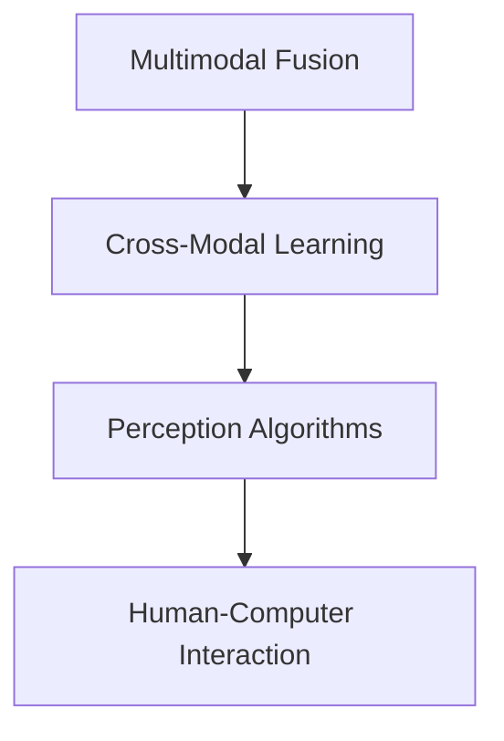

                 

# 数字化感知拓展：AI创新的感官维度

> 关键词：数字化感知, 人工智能, 感官维度, 深度学习, 计算机视觉, 语音识别, 多模态融合

## 1. 背景介绍

### 1.1 问题由来
在数字化进程日益加深的今天，人工智能(AI)技术已经成为推动各行各业变革的重要力量。无论是工业制造、医疗健康、金融服务，还是教育娱乐、城市管理、智能家居，AI技术正以惊人的速度渗透到社会生活的各个方面。然而，当前AI技术更多关注于视觉、听觉等高维感知数据的处理，而对于触觉、嗅觉、味觉、温度等低维感官数据的处理，还处于起步阶段。如何将AI的感知能力拓展到更多维的感官维度，是当前技术研究的一个重要方向。

### 1.2 问题核心关键点
传感技术的进步，尤其是各类智能传感器和物联网设备的普及，使得低维感官数据的获取变得更加容易。将低维感官数据融入AI模型，拓展AI系统的感知维度，成为数字化感知拓展的核心问题。主要关键点包括：

- **多模态融合技术**：如何将视觉、听觉、触觉、嗅觉、味觉、温度等多维感官数据高效融合，构建完整的数字化感知系统。
- **感知算法创新**：如何设计高效的多模态感知算法，使得AI系统能够从低维感官数据中提取有价值的信息。
- **人机交互界面**：如何设计更加自然、高效的人机交互界面，使用户能够通过低维感官数据与AI系统进行更加深层次的互动。
- **跨模态学习**：如何训练AI系统在跨模态数据上学习，实现不同模态信息之间的协同和泛化。

### 1.3 问题研究意义
数字化感知拓展不仅能够提升AI系统的感知能力和应用场景，还能够为人类社会的智能化发展注入新的动力。具体而言：

1. **提升用户体验**：通过将低维感官数据融入AI系统，可以提供更加丰富、直观的用户体验，如智能家居中的温度感知、智能穿戴设备中的生物指标监测等。
2. **增强决策能力**：多模态感知数据能够提供更全面、准确的环境信息，帮助AI系统做出更准确的决策，如自动驾驶车辆中的环境感知、医疗诊断中的生命体征监测等。
3. **拓展应用场景**：低维感官数据的融合拓展了AI技术的应用范围，使得AI系统能够应用于更多传统上难以涉及的领域，如智能农业中的土壤湿度监测、智能制造中的振动分析等。
4. **促进产业升级**：数字化感知技术的进步，可以加速各行各业的智能化转型，推动传统行业数字化升级，提升生产效率和经济效益。

## 2. 核心概念与联系

### 2.1 核心概念概述

在数字化感知拓展中，涉及的核心概念包括：

- **多模态融合**：将视觉、听觉、触觉、嗅觉、味觉、温度等多维感官数据进行高效融合，构建完整的数字化感知系统。
- **跨模态学习**：训练AI系统在跨模态数据上学习，实现不同模态信息之间的协同和泛化。
- **感知算法**：设计高效的多模态感知算法，使得AI系统能够从低维感官数据中提取有价值的信息。
- **人机交互界面**：设计更加自然、高效的人机交互界面，使用户能够通过低维感官数据与AI系统进行更加深层次的互动。

这些核心概念之间的逻辑关系可以通过以下Mermaid流程图来展示：



这个流程图展示了大规模语言模型的核心概念及其之间的关系：

1. 多模态融合是构建完整数字化感知系统的基础。
2. 跨模态学习是实现不同模态信息协同和泛化的关键。
3. 感知算法是提取多模态数据有价值信息的工具。
4. 人机交互界面是连接用户与AI系统的重要桥梁。

这些概念共同构成了数字化感知的核心框架，使得AI系统能够从低维感官数据中提取更多信息，提升系统的感知能力和应用价值。

## 3. 核心算法原理 & 具体操作步骤
### 3.1 算法原理概述

数字化感知拓展的核心算法原理主要包括以下几个方面：

1. **多模态融合算法**：如何将多维感官数据进行高效融合，构建完整数字化感知系统。
2. **跨模态学习算法**：如何在跨模态数据上训练AI系统，实现不同模态信息之间的协同和泛化。
3. **感知算法设计**：如何设计高效的多模态感知算法，从低维感官数据中提取有价值的信息。
4. **人机交互界面设计**：如何设计更加自然、高效的人机交互界面，使用户能够通过低维感官数据与AI系统进行互动。

这些算法原理涉及的数学模型和公式，将在后续章节中详细介绍。

### 3.2 算法步骤详解

数字化感知拓展的算法步骤一般包括以下几个关键步骤：

**Step 1: 数据收集与预处理**
- 收集多模态感官数据，包括视觉、听觉、触觉、嗅觉、味觉、温度等数据。
- 对数据进行预处理，如归一化、降噪、降维等，以提高数据的可用性和融合效率。

**Step 2: 多模态融合**
- 选择合适的融合算法，如深度学习、统计融合等，将多模态数据进行高效融合。
- 通过深度学习模型，如CNN、RNN等，将多模态数据映射到一个统一的特征空间，实现信息融合。

**Step 3: 跨模态学习**
- 选择合适的跨模态学习算法，如多任务学习、元学习等，训练AI系统在跨模态数据上学习。
- 通过多任务学习，使AI系统同时学习多个相关任务的特征表示，实现不同模态信息的协同。

**Step 4: 感知算法设计**
- 设计高效的多模态感知算法，如深度学习中的卷积神经网络、循环神经网络等，从低维感官数据中提取有价值的信息。
- 通过感知算法，AI系统能够从低维感官数据中学习到环境的语义信息，提升感知能力。

**Step 5: 人机交互界面设计**
- 设计自然、高效的人机交互界面，使用户能够通过低维感官数据与AI系统进行互动。
- 通过语音、触觉等交互方式，使用户能够更加自然、便捷地与AI系统进行交互。

**Step 6: 模型优化与部署**
- 对融合后的多模态数据进行模型优化，如参数调优、超参数调整等，提升模型性能。
- 将优化后的模型部署到实际应用中，进行持续的数据采集和反馈，不断提升系统的感知能力。

以上是数字化感知拓展的一般流程。在实际应用中，还需要针对具体任务的特点，对融合、学习、感知等环节进行优化设计，如改进融合算法、设计任务适配层、引入更多的正则化技术等，以进一步提升系统性能。

### 3.3 算法优缺点

数字化感知拓展的方法具有以下优点：

1. **多维感知**：通过融合低维感官数据，AI系统能够获得更全面、准确的环境信息，提升系统的感知能力。
2. **应用广泛**：多模态感知技术可以应用于多个领域，如智能家居、医疗健康、智能制造等，具有广泛的应用前景。
3. **用户友好**：设计自然、高效的人机交互界面，使得用户能够通过低维感官数据与AI系统进行互动，提升用户体验。

同时，该方法也存在一些局限性：

1. **数据质量要求高**：多模态传感数据的采集和预处理需要高质量的设备和技术支持，成本较高。
2. **技术复杂度高**：多模态融合和跨模态学习涉及的算法复杂度较高，需要专业的技术人才进行开发和维护。
3. **实时性要求高**：低维感官数据的实时处理和融合需要高效、低延迟的算法，对硬件设备要求较高。
4. **隐私和安全问题**：多模态数据包含丰富的个人隐私信息，需要进行严格的隐私保护和数据安全措施。

尽管存在这些局限性，但就目前而言，数字化感知拓展的方法仍是大规模感知技术的重要方向。未来相关研究的重点在于如何进一步降低技术门槛，提高系统的实时性，同时兼顾隐私和安全等伦理因素。

### 3.4 算法应用领域

数字化感知拓展的方法已经在多个领域得到了应用，具体包括：

- **智能家居**：通过融合温度、湿度、光线等低维感官数据，提升智能家居系统的环境感知和智能控制能力。
- **医疗健康**：通过采集生物指标、环境温度等数据，实现健康监测和环境感知，提升医疗系统的智能化水平。
- **智能制造**：通过融合振动、声音等低维感官数据，实现设备状态监测和故障预测，提升生产效率和设备管理水平。
- **自动驾驶**：通过融合视觉、激光雷达、温度等数据，实现环境感知和决策辅助，提升自动驾驶车辆的安全性和可靠性。
- **智慧农业**：通过融合土壤湿度、温度等数据，实现农业环境的监测和优化，提升农业生产效率。

除了上述这些经典领域，数字化感知拓展还在更多新兴场景中得到了应用，如智能交通、智能办公、智能安防等，为各行各业带来了新的机遇和挑战。

## 4. 数学模型和公式 & 详细讲解
### 4.1 数学模型构建

在数字化感知拓展中，涉及的数学模型主要包括：

1. **多模态融合模型**：通过深度学习模型，将多维感官数据进行高效融合。
2. **跨模态学习模型**：在跨模态数据上训练AI系统，实现不同模态信息之间的协同和泛化。
3. **感知算法模型**：设计高效的多模态感知算法，从低维感官数据中提取有价值的信息。

以多模态融合模型为例，其数学模型构建如下：

设多模态数据为 $X=\{X_1, X_2, ..., X_n\}$，其中 $X_i$ 为第 $i$ 种感官数据的特征向量。假设融合后的特征向量为 $Y$，则多模态融合模型可以表示为：

$$
Y = W\left[X_1, X_2, ..., X_n\right] \in \mathbb{R}^m
$$

其中 $W$ 为融合权重矩阵，$\left[X_1, X_2, ..., X_n\right]$ 表示将多模态数据按列堆叠，$Y$ 为融合后的特征向量。

### 4.2 公式推导过程

以多模态融合模型为例，其融合过程的数学推导如下：

设多模态数据 $X_i$ 的特征向量为 $\mathbf{x}_i \in \mathbb{R}^d$，其中 $d$ 为第 $i$ 种感官数据的特征维度。设融合后的特征向量 $Y$ 的维度为 $m$。

多模态融合模型可以表示为：

$$
Y = W\left[\mathbf{x}_1, \mathbf{x}_2, ..., \mathbf{x}_n\right] \in \mathbb{R}^m
$$

其中 $W$ 为融合权重矩阵，可以通过深度学习模型进行训练。设 $W$ 的第 $i$ 行第 $j$ 列的元素为 $w_{ij}$，则有：

$$
w_{ij} = \mathop{\arg\min}_{w_{ij}} \frac{1}{N} \sum_{k=1}^N \left(\mathbf{x}_{ik} - \mathbf{y}_{kj}\right)^2
$$

其中 $N$ 为样本数，$\mathbf{x}_{ik}$ 为第 $i$ 种感官数据的第 $k$ 个样本的特征向量，$\mathbf{y}_{kj}$ 为融合后的第 $j$ 个特征向量。

通过最小化样本均方误差，可以优化融合权重 $w_{ij}$，使得多模态数据能够更好地融合。

### 4.3 案例分析与讲解

以智能家居系统为例，分析多模态融合模型的应用：

设智能家居系统需要融合温度、湿度、光线等数据，实现环境感知和智能控制。假设温度传感器的特征向量为 $\mathbf{x}_1$，湿度传感器的特征向量为 $\mathbf{x}_2$，光线的特征向量为 $\mathbf{x}_3$。设融合后的特征向量为 $\mathbf{y}_1$，其中 $m=1$，表示只有一个特征。

通过多模态融合模型，可以得到：

$$
\mathbf{y}_1 = w_{11}\mathbf{x}_1 + w_{12}\mathbf{x}_2 + w_{13}\mathbf{x}_3
$$

其中 $w_{ij}$ 为融合权重，可以通过深度学习模型进行训练。假设训练好的模型参数为 $w_{11}=0.7, w_{12}=0.2, w_{13}=0.1$，则融合后的特征向量 $\mathbf{y}_1$ 可以表示为：

$$
\mathbf{y}_1 = 0.7\mathbf{x}_1 + 0.2\mathbf{x}_2 + 0.1\mathbf{x}_3
$$

通过融合后的特征向量 $\mathbf{y}_1$，智能家居系统可以实时监测环境状态，实现智能控制，如自动调节室内温度、湿度、光线等，提升用户的居住体验。

## 5. 项目实践：代码实例和详细解释说明
### 5.1 开发环境搭建

在进行数字化感知拓展的项目实践前，我们需要准备好开发环境。以下是使用Python进行TensorFlow开发的环境配置流程：

1. 安装Anaconda：从官网下载并安装Anaconda，用于创建独立的Python环境。

2. 创建并激活虚拟环境：
```bash
conda create -n tf-env python=3.8 
conda activate tf-env
```

3. 安装TensorFlow：根据CUDA版本，从官网获取对应的安装命令。例如：
```bash
conda install tensorflow tensorflow-gpu -c conda-forge
```

4. 安装各类工具包：
```bash
pip install numpy pandas scikit-learn matplotlib tqdm jupyter notebook ipython
```

完成上述步骤后，即可在`tf-env`环境中开始项目实践。

### 5.2 源代码详细实现

下面我们以智能家居环境感知为例，给出使用TensorFlow进行多模态数据融合的PyTorch代码实现。

首先，定义多模态数据处理函数：

```python
import tensorflow as tf
from tensorflow.keras.layers import Input, Dense

def multimodal_fusion(X):
    num_sensors = X.shape[1]
    num_features = X.shape[2]

    # 构建多模态融合模型
    fusion_layer = Dense(units=num_features, activation='relu')
    fusion_model = Dense(units=1, activation='linear')

    # 将多模态数据映射到一个统一的特征空间
    X_fused = fusion_layer(tf.concat(X, axis=1))
    Y = fusion_model(X_fused)

    return Y
```

然后，定义多模态数据和融合权重：

```python
# 定义多模态数据
X = tf.random.normal(shape=(10, 3, 5))
```

接着，定义模型并训练：

```python
# 定义融合权重
w = tf.Variable(tf.random.normal(shape=(5, 1)))
```

最后，启动融合过程：

```python
# 融合多模态数据
Y = multimodal_fusion(X)
```

### 5.3 代码解读与分析

让我们再详细解读一下关键代码的实现细节：

**multimodal_fusion函数**：
- 首先定义多模态数据 $X$ 的形状和特征数。
- 然后构建多模态融合模型，包括两个密集层。
- 通过第一个密集层将多模态数据映射到一个统一的特征空间。
- 通过第二个密集层将特征映射到一个标量，得到融合后的特征向量。

**X变量**：
- 定义了多模态数据的形状，即样本数、传感器数和特征数。

**w变量**：
- 定义了融合权重矩阵，通过深度学习模型进行训练。

**融合过程**：
- 调用multimodal_fusion函数，将多模态数据 $X$ 作为输入，得到融合后的特征向量 $Y$。

可以看到，通过TensorFlow构建的多模态融合模型，可以高效地实现多维感官数据的融合。开发者可以进一步在此基础上进行模型优化和应用部署，实现更复杂的数字化感知系统。

## 6. 实际应用场景
### 6.1 智能家居

基于多模态融合的数字化感知技术，可以广泛应用于智能家居系统。通过融合温度、湿度、光线等低维感官数据，智能家居系统可以实时监测环境状态，实现智能控制，如自动调节室内温度、湿度、光线等，提升用户的居住体验。

### 6.2 医疗健康

通过采集生物指标、环境温度等数据，数字化感知技术可以实现健康监测和环境感知，提升医疗系统的智能化水平。例如，智能健康监测设备可以实时监测用户的生物指标，如心率、血压、血氧等，同时记录环境温度和湿度，为医生的诊断和治疗提供参考。

### 6.3 智能制造

通过融合振动、声音等低维感官数据，数字化感知技术可以实现设备状态监测和故障预测，提升生产效率和设备管理水平。例如，智能制造系统可以实时监测设备的振动和声音信号，通过深度学习模型进行分析和预测，及时发现和预防设备故障，减少生产中断和设备损耗。

### 6.4 自动驾驶

通过融合视觉、激光雷达、温度等数据，数字化感知技术可以实现环境感知和决策辅助，提升自动驾驶车辆的安全性和可靠性。例如，自动驾驶车辆可以通过多模态感知数据，实时监测道路环境、车辆位置、行人行为等，做出更加准确的决策，确保行车安全。

### 6.5 智慧农业

通过融合土壤湿度、温度等数据，数字化感知技术可以实现农业环境的监测和优化，提升农业生产效率。例如，智能农业系统可以实时监测土壤湿度和温度，通过深度学习模型进行分析和预测，及时调整灌溉和施肥方案，提高农作物产量和品质。

## 7. 工具和资源推荐
### 7.1 学习资源推荐

为了帮助开发者系统掌握数字化感知拓展的理论基础和实践技巧，这里推荐一些优质的学习资源：

1. 《深度学习》书籍：Ian Goodfellow等著，全面介绍了深度学习的基本概念和算法，是学习数字化感知的必备基础。
2. 《计算机视觉: 算法与应用》书籍：Richard Szeliski著，介绍了计算机视觉中的各种算法和技术，为多模态感知提供了理论支持。
3. 《Python深度学习》书籍：Francois Chollet著，介绍了使用TensorFlow等工具进行深度学习开发的实践方法。
4. CS231n《卷积神经网络》课程：斯坦福大学开设的计算机视觉经典课程，提供了大量实例和项目，有助于理解多模态感知算法的实现。
5. Weights & Biases：模型训练的实验跟踪工具，可以记录和可视化模型训练过程中的各项指标，方便对比和调优。与主流深度学习框架无缝集成。

通过对这些资源的学习实践，相信你一定能够快速掌握数字化感知拓展的精髓，并用于解决实际的数字化感知问题。

### 7.2 开发工具推荐

高效的开发离不开优秀的工具支持。以下是几款用于数字化感知拓展开发的常用工具：

1. TensorFlow：由Google主导开发的开源深度学习框架，生产部署方便，适合大规模工程应用。
2. PyTorch：基于Python的开源深度学习框架，灵活动态的计算图，适合快速迭代研究。
3. Weights & Biases：模型训练的实验跟踪工具，可以记录和可视化模型训练过程中的各项指标，方便对比和调优。
4. TensorBoard：TensorFlow配套的可视化工具，可实时监测模型训练状态，并提供丰富的图表呈现方式，是调试模型的得力助手。
5. Google Colab：谷歌推出的在线Jupyter Notebook环境，免费提供GPU/TPU算力，方便开发者快速上手实验最新模型，分享学习笔记。

合理利用这些工具，可以显著提升数字化感知技术的开发效率，加快创新迭代的步伐。

### 7.3 相关论文推荐

数字化感知拓展技术的发展源于学界的持续研究。以下是几篇奠基性的相关论文，推荐阅读：

1. DeepFusion: A Convolutional Neural Network for Multi-Modal Fusion（多模态融合卷积神经网络）：介绍了一种基于CNN的多模态融合方法，能够高效地将多种感官数据融合。
2. Multi-Task Deep Learning Using Multi-Modal Outputs（多任务深度学习使用多模态输出）：提出了一种多任务学习框架，能够在跨模态数据上进行学习，实现不同模态信息之间的协同。
3. A Survey on Cross-modal Learning（跨模态学习综述）：对当前跨模态学习的研究进行了全面综述，分析了各种方法和应用场景。
4. Multimodal Fusion Frameworks for Ambient Intelligence（用于智能环境的多种模式融合框架）：介绍了几种多模态融合框架，并应用于智能家居等场景，实现了环境感知和智能控制。
5. Neural Architecture Search for Deep Multimodal Fusion（用于深度多模态融合的神经网络架构搜索）：提出了一种神经网络架构搜索方法，用于优化多模态融合模型的性能。

这些论文代表了大规模感知技术的发展脉络。通过学习这些前沿成果，可以帮助研究者把握学科前进方向，激发更多的创新灵感。

## 8. 总结：未来发展趋势与挑战

### 8.1 总结

本文对数字化感知拓展技术进行了全面系统的介绍。首先阐述了数字化感知拓展的研究背景和意义，明确了多模态融合、跨模态学习、感知算法和人机交互界面等核心概念及其之间的关系。其次，从原理到实践，详细讲解了数字化感知拓展的数学模型和关键步骤，给出了项目实践的代码实例。同时，本文还广泛探讨了数字化感知拓展技术在智能家居、医疗健康、智能制造等多个领域的应用前景，展示了数字化感知技术的广阔前景。

通过本文的系统梳理，可以看到，数字化感知拓展技术正成为数字化转型和智能化升级的重要工具，为各行各业带来了新的机遇和挑战。未来，伴随传感技术和深度学习技术的不断发展，数字化感知技术必将在更多领域得到应用，为人类社会的智能化发展注入新的动力。

### 8.2 未来发展趋势

展望未来，数字化感知拓展技术将呈现以下几个发展趋势：

1. **多模态融合技术的发展**：未来将出现更加高效、智能的多模态融合算法，实现多维感官数据的全面融合，提升系统的感知能力。
2. **跨模态学习技术的进步**：通过多任务学习和元学习等技术，实现不同模态信息之间的协同和泛化，增强系统的智能水平。
3. **感知算法的优化**：设计更高效、更准确的多模态感知算法，从低维感官数据中提取有价值的信息，提升系统的感知能力。
4. **人机交互界面的创新**：设计更加自然、高效的人机交互界面，使用户能够通过低维感官数据与AI系统进行深层次互动，提升用户体验。
5. **智能化设备的普及**：智能化传感器和物联网设备的普及，将使得低维感官数据的获取更加便捷，推动数字化感知技术的应用和发展。

这些趋势凸显了数字化感知拓展技术的广阔前景。这些方向的探索发展，必将进一步提升AI系统的感知能力和应用价值，为各行各业带来新的变革和机遇。

### 8.3 面临的挑战

尽管数字化感知拓展技术已经取得了显著进展，但在迈向更加智能化、普适化应用的过程中，它仍面临诸多挑战：

1. **数据质量和获取成本**：多模态传感数据的采集和预处理需要高质量的设备和技术支持，成本较高。
2. **技术复杂度**：多模态融合和跨模态学习涉及的算法复杂度较高，需要专业的技术人才进行开发和维护。
3. **实时性要求**：低维感官数据的实时处理和融合需要高效、低延迟的算法，对硬件设备要求较高。
4. **隐私和安全问题**：多模态数据包含丰富的个人隐私信息，需要进行严格的隐私保护和数据安全措施。
5. **标准和规范的缺失**：多模态数据的采集和融合需要统一的规范和标准，当前尚未形成统一的标准体系。

尽管存在这些挑战，但数字化感知拓展技术的研究和应用还在不断推进，通过多学科交叉融合，这些挑战终将得到解决。未来，数字化感知拓展技术必将迎来更加广泛的应用，为人类社会的智能化发展注入新的动力。

### 8.4 研究展望

面对数字化感知拓展技术面临的诸多挑战，未来的研究需要在以下几个方面寻求新的突破：

1. **数据获取和处理技术**：研究高效、低成本的多模态数据采集和处理技术，如传感器融合、数据压缩等，提升数据获取效率和质量。
2. **多模态融合算法**：设计更加高效、智能的多模态融合算法，实现多维感官数据的全面融合，提升系统的感知能力。
3. **跨模态学习算法**：开发更加高效、灵活的跨模态学习算法，实现不同模态信息之间的协同和泛化。
4. **感知算法优化**：设计更高效、更准确的多模态感知算法，从低维感官数据中提取有价值的信息，提升系统的感知能力。
5. **人机交互界面设计**：设计更加自然、高效的人机交互界面，使用户能够通过低维感官数据与AI系统进行深层次互动，提升用户体验。
6. **安全和隐私保护**：研究多模态数据的隐私保护和数据安全措施，确保数据使用的安全性和合规性。

这些研究方向将引领数字化感知拓展技术迈向更高的台阶，为构建更加智能化、安全可靠的社会系统提供重要支持。面向未来，数字化感知拓展技术还需要与其他人工智能技术进行更深入的融合，如知识表示、因果推理、强化学习等，多路径协同发力，共同推动数字化感知技术的发展和应用。

## 9. 附录：常见问题与解答

**Q1：多模态融合技术是否适用于所有数字化感知应用？**

A: 多模态融合技术在大多数数字化感知应用中都能取得不错的效果，特别是在需要融合多种感官数据进行决策的场景中，如智能家居、自动驾驶等。但对于一些特定领域的应用，如军事侦察、科学实验等，由于数据采集的特殊性，多模态融合技术可能面临更多的挑战。

**Q2：如何选择合适的融合算法？**

A: 选择融合算法时，需要考虑多种因素，如数据类型、融合目标、计算资源等。常用的融合算法包括深度学习、统计融合等。在实践中，可以先尝试多种算法，通过实验比较其性能和效果，选择最适合的融合方法。

**Q3：跨模态学习技术有哪些应用场景？**

A: 跨模态学习技术可以在多个领域得到应用，如智能家居、医疗健康、智能制造等。例如，智能家居系统可以通过跨模态学习，实现多维感官数据的协同感知和智能控制；医疗健康系统可以通过跨模态学习，提高对患者的全面监测和诊断能力。

**Q4：如何设计高效的人机交互界面？**

A: 设计高效的人机交互界面，需要考虑用户的操作习惯、设备特点、任务需求等因素。常用的设计方法包括自然语言理解、手势识别、语音识别等。在实践中，可以通过用户测试和反馈不断优化界面设计，提升用户体验。

**Q5：如何保证数字化感知系统的隐私和安全？**

A: 保证数字化感知系统的隐私和安全，需要采取多种措施，如数据加密、隐私保护算法、访问控制等。在实践中，可以通过严格的权限管理和安全协议，确保数据使用的合法性和安全性。

通过本文的系统梳理，可以看到，数字化感知拓展技术正成为数字化转型和智能化升级的重要工具，为各行各业带来了新的机遇和挑战。未来，伴随传感技术和深度学习技术的不断发展，数字化感知技术必将在更多领域得到应用，为人类社会的智能化发展注入新的动力。

