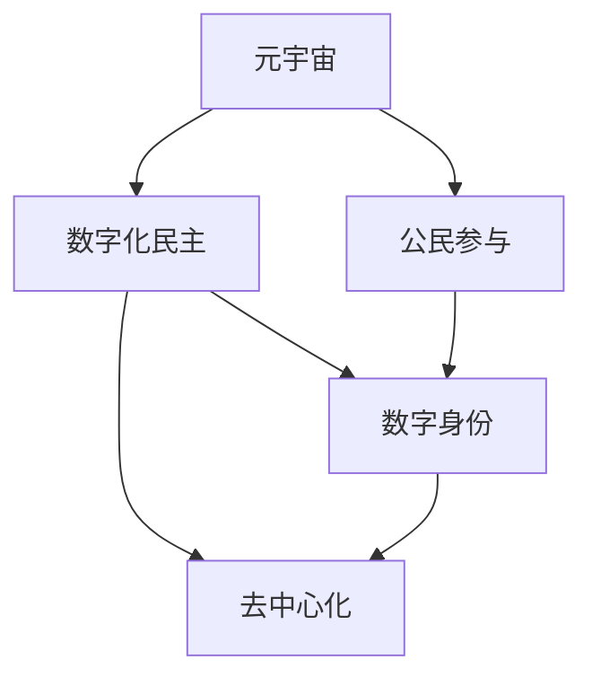

                 

# 数字化民主:元宇宙时代的公民参与

## 1. 背景介绍

### 1.1 问题由来
随着技术的不断演进，数字化的浪潮正在重塑我们的生活方式和社会结构。尤其是近年来兴起的元宇宙（Metaverse），正逐步构建起一个跨越虚拟与现实、现实与虚拟世界的数字社会。在这个过程中，数字化民主的实践变得尤为重要。数字化民主不仅关乎公民的政治参与权利，还涉及到如何利用技术手段提升民主决策的科学性和透明度，以及如何保护公民的隐私与数据安全。

### 1.2 问题核心关键点
数字化民主的核心关键点在于：
- **民主参与的数字化**：通过数字化手段，使公民的政治参与更加便利和高效。
- **决策过程的透明化**：利用技术手段，提高决策过程的透明度和可追溯性。
- **数据隐私与安全**：在数字化民主实践中，如何保护公民的个人隐私和数据安全，是一个重要的挑战。
- **技术平台的普适性**：构建的平台需要被广泛的社会群体接受和使用，才能真正实现数字化民主。
- **民主理论与技术的结合**：如何将民主理论中的核心原则和价值，与最新的技术相结合，推动民主实践的发展。

## 2. 核心概念与联系

### 2.1 核心概念概述

为了更好地理解元宇宙时代数字化民主的实践，我们需要明确以下几个核心概念：

- **元宇宙（Metaverse）**：一个虚拟与现实融合的数字空间，用户可以通过VR/AR设备等技术手段，进入一个由数字内容构成的虚拟世界。
- **数字化民主（Digital Democracy）**：利用数字技术手段，实现民主参与、决策和监督等民主过程的电子化。
- **公民参与（Civic Engagement）**：公民通过各种渠道，积极参与到公共事务的讨论和决策中，表达自己的意见和诉求。
- **数字身份（Digital Identity）**：在数字空间中，公民拥有独特的数字身份，可以安全、便捷地进行各类数字活动。
- **去中心化（Decentralization）**：在数字化民主中，去除中心化的决策和信息控制，使得决策更加公平、透明。

这些概念之间的关系可以通过以下Mermaid流程图来展示：



这个流程图展示了这个数字化民主系统的几个关键组成部分及其相互关系：

1. 元宇宙提供了一个虚拟的交互平台，为数字化民主的实现提供了技术基础。
2. 公民参与是数字化民主的核心，它通过各种数字渠道，使得公民能够更加便捷地参与到公共事务中。
3. 数字身份是公民在虚拟和现实世界中行动的基础，确保公民在数字空间中的安全和权益。
4. 去中心化是数字化民主的核心原则，它保证了决策过程的公平性和透明度。

## 3. 核心算法原理 & 具体操作步骤
### 3.1 算法原理概述

数字化民主的算法原理主要基于分布式计算和智能合约等技术，以确保公民参与和决策过程的公平性和透明性。其核心思想是：通过区块链等去中心化技术，构建一个开放、透明、可信任的数字化民主平台。

### 3.2 算法步骤详解

数字化民主的实现过程一般包括以下几个步骤：

**Step 1: 数据收集与处理**
- 收集公民的意见、建议、投诉等信息，并进行清洗、整理和分类。
- 确保数据的真实性和完整性，避免虚假信息和噪音数据的干扰。

**Step 2: 投票机制设计**
- 设计科学、公平的投票机制，确保每个公民的投票权利得到保障。
- 引入随机抽样、加密投票等技术手段，保护公民的投票隐私。

**Step 3: 智能合约执行**
- 使用智能合约，确保投票结果的公正性和透明性。
- 智能合约可以根据预设的规则，自动执行投票结果，形成决策。

**Step 4: 决策反馈与监督**
- 将决策过程和结果反馈给公民，确保公民了解并认可。
- 建立监督机制，对决策过程进行审计和评估，防止任何形式的不公和腐败。

**Step 5: 持续优化与迭代**
- 基于公民的反馈和监督结果，持续优化投票机制和智能合约。
- 引入新的技术手段，如机器学习、人工智能等，提升决策的科学性和准确性。

### 3.3 算法优缺点

数字化民主的算法具有以下优点：
- **透明性**：通过区块链等技术手段，确保投票和决策过程的透明性和可追溯性。
- **安全性**：去中心化的架构和智能合约的设计，提高了系统的安全性和防篡改能力。
- **便利性**：数字化手段使得公民参与更加便捷，降低参与门槛。
- **公平性**：去除中心化的决策机制，提高了决策的公平性和公正性。

同时，该算法也存在以下局限性：
- **技术复杂性**：实现复杂的投票和智能合约，需要较高的技术门槛。
- **数据隐私**：在保护公民隐私的同时，需要确保数据的完整性和真实性。
- **去中心化**：虽然去中心化提高了公平性，但也可能导致决策效率低下。
- **技术依赖**：对于技术不普及的地区，数字化民主的推广存在难度。

### 3.4 算法应用领域

数字化民主的算法已经在以下几个领域得到了应用：

- **电子投票系统**：如Swiss Airline等航空公司使用的电子投票系统，使公民能够在线投票，提升投票便利性。
- **区块链投票平台**：如Wyzowl等平台，利用区块链技术实现透明、安全的投票机制。
- **公共决策支持系统**：如MathBallot等系统，通过机器学习分析公民意见，辅助决策制定。
- **智能合约选举**：利用以太坊等区块链平台，实现智能合约驱动的选举过程，确保选举的公正性和透明性。

## 4. 数学模型和公式 & 详细讲解  
### 4.1 数学模型构建

在数字化民主的实现中，我们通常会构建以下数学模型：

- **投票模型**：用于描述公民投票过程，通常可以表示为概率模型，如隐马尔可夫模型、贝叶斯网络等。
- **决策模型**：用于描述决策过程，如线性回归、逻辑回归、决策树等。
- **监督模型**：用于监督和审计投票和决策过程，如支持向量机、神经网络等。

### 4.2 公式推导过程

以最简单的隐马尔可夫模型为例，假设公民有m个投票选项，投票过程可以用如下公式表示：

$$
P(Y_i = y|X_i = x) = \frac{P(Y_i = y)P(X_i = x|Y_i = y)}{\sum_j P(Y_i = j)P(X_i = x|Y_i = j)}
$$

其中，$X_i$ 表示第i个公民的投票选项，$Y_i$ 表示其真实意图，$P(Y_i = y|X_i = x)$ 表示在给定选项x的情况下，公民投票y的概率。

### 4.3 案例分析与讲解

假设在一家公司的年度股东大会上，公司决定是否要将部分资产投资于新兴技术项目。公司董事会和股东在会上进行了公开投票，共有1000名股东参与投票。使用上述投票模型，可以计算每个股东投票“赞成”和“反对”的概率，并根据投票结果进行决策。

## 5. 项目实践：代码实例和详细解释说明
### 5.1 开发环境搭建

在进行数字化民主的开发前，我们需要准备好开发环境。以下是使用Python进行Flask开发的环境配置流程：

1. 安装Flask：从官网下载并安装Flask，用于构建Web应用。

2. 创建并激活虚拟环境：
```bash
conda create -n democracy-env python=3.8 
conda activate democracy-env
```

3. 安装Flask和相关库：
```bash
pip install flask flask-wtf flask-sqlalchemy flask-restful
```

4. 安装SQLAlchemy数据库：
```bash
pip install sqlalchemy
```

5. 安装Jinja2模板引擎：
```bash
pip install jinja2
```

完成上述步骤后，即可在`democracy-env`环境中开始开发。

### 5.2 源代码详细实现

这里我们以一个简单的电子投票系统为例，给出使用Flask实现数字化民主的Python代码。

```python
from flask import Flask, render_template, request, jsonify
from flask_sqlalchemy import SQLAlchemy
from flask_wtf import FlaskForm
from wtforms import StringField, SubmitField
from wtforms.validators import DataRequired

app = Flask(__name__)
app.config['SQLALCHEMY_DATABASE_URI'] = 'sqlite:///democracy.db'
db = SQLAlchemy(app)

class Voter(db.Model):
    id = db.Column(db.Integer, primary_key=True)
    name = db.Column(db.String(100), nullable=False)
    email = db.Column(db.String(100), nullable=False, unique=True)
    voted = db.Column(db.Boolean, default=False)

class VoteForm(FlaskForm):
    name = StringField('Name', validators=[DataRequired()])
    email = StringField('Email', validators=[DataRequired()])
    vote = StringField('Vote', choices=[('赞成', '赞成'), ('反对', '反对')], validators=[DataRequired()])
    submit = SubmitField('提交')

@app.route('/', methods=['GET', 'POST'])
def index():
    form = VoteForm()
    if form.validate_on_submit():
        voter = Voter(name=form.name.data, email=form.email.data)
        db.session.add(voter)
        db.session.commit()
        return jsonify({'result': '已投票'})
    return render_template('index.html', form=form)

@app.route('/result', methods=['GET'])
def result():
    voters = Voter.query.filter_by(voted=True).all()
    vote_count = voters.groupby('email').count()
    total_votes = vote_count.sum()
    return jsonify({'赞成票': vote_count['赞成'].sum(), '反对票': total_votes - vote_count['赞成'].sum()})

if __name__ == '__main__':
    app.run(debug=True)
```

这段代码实现了简单的投票功能，包括用户提交投票和显示投票结果两个页面。

### 5.3 代码解读与分析

让我们再详细解读一下关键代码的实现细节：

**Voter类**：
- `id`字段：用于存储用户ID，作为主键。
- `name`字段：用户姓名。
- `email`字段：用户邮箱，作为唯一标识。
- `voted`字段：标记用户是否已投票。

**VoteForm类**：
- `name`字段：用户姓名。
- `email`字段：用户邮箱。
- `vote`字段：用户投票选项，包含两个选项：赞成和反对。
- `submit`字段：提交按钮。

**index路由**：
- 渲染包含投票表单的HTML页面。
- 当用户提交投票后，保存用户信息和投票结果，并返回JSON格式的响应。

**result路由**：
- 查询已投票的用户信息，统计赞成票和反对票的数量，并返回JSON格式的投票结果。

可以看到，Flask框架使得数字化民主系统的实现变得简单高效。开发者可以将更多精力放在模型设计、用户体验等高层逻辑上，而不必过多关注底层的实现细节。

当然，工业级的系统实现还需考虑更多因素，如用户身份认证、数据加密、访问控制等安全措施，以及如何与智能合约等技术结合，构建更加完整的数字化民主系统。但核心的民主投票流程基本与此类似。

## 6. 实际应用场景
### 6.1 电子投票系统

电子投票系统是数字化民主的重要应用场景之一。传统的纸质投票方式存在诸多问题，如投票效率低、投票过程不透明、统计困难等。而通过数字化手段，可以构建一个安全、高效、透明的电子投票系统，使公民能够便捷地进行投票，同时确保投票结果的真实性和公正性。

在技术实现上，电子投票系统一般需要具备以下功能：
- 用户注册与登录：确保每个用户都有唯一的数字身份。
- 投票接口：用户可以随时随地提交投票。
- 投票统计：根据投票结果，计算出总票数和占比。
- 投票结果发布：将投票结果公开发布，确保所有公民都能了解。

### 6.2 智能合约选举

智能合约选举是数字化民主的另一种重要应用。通过区块链技术，可以实现透明、公正、高效的选举过程。每个候选人在区块链上提交自己的竞选资料和政纲，公民可以在平台上查看并投票。智能合约会根据投票结果，自动计算胜出者，并发布选举结果。

在技术实现上，智能合约选举系统一般需要具备以下功能：
- 候选人注册与信息展示：候选人提交资料并公开展示。
- 投票接口：公民可以投票并选择支持的候选人。
- 投票统计与验证：确保投票过程的透明性和公正性。
- 智能合约执行：根据投票结果，自动选出胜出者，并公开宣布结果。

### 6.3 公共决策支持系统

公共决策支持系统可以帮助政府机构更好地进行政策制定。通过数字化民主平台，政府可以收集公民的意见和建议，并结合大数据分析，形成科学、合理的决策依据。

在技术实现上，公共决策支持系统一般需要具备以下功能：
- 意见征集：政府发布政策草案，征集公民意见。
- 意见分析：利用机器学习等技术手段，分析公民意见，提取关键信息。
- 决策制定：根据分析结果，制定政策方案。
- 决策反馈：将政策方案公开，并根据公民反馈进行优化。

## 7. 工具和资源推荐
### 7.1 学习资源推荐

为了帮助开发者系统掌握数字化民主的理论基础和实践技巧，这里推荐一些优质的学习资源：

1. 《区块链技术与数字化民主》系列博文：由区块链技术专家撰写，深入浅出地介绍了区块链技术在数字化民主中的应用，涵盖了投票、选举、审计等多个方面。

2. 《人工智能与公民参与》课程：斯坦福大学开设的课程，讲解了人工智能技术在公民参与中的应用，包括选举、政策制定等。

3. 《智能合约与数字民主》书籍：智能合约领域的权威著作，详细介绍了智能合约在数字化民主中的应用，包括设计、实现、优化等。

4. HuggingFace官方文档：介绍了一系列的自然语言处理工具，如BERT、GPT等，并提供了丰富的文档和样例代码，是学习数字化民主中的语言处理技术的重要资源。

5. CLUE开源项目：中文语言理解测评基准，涵盖大量不同类型的中文NLP数据集，并提供了基于数字化民主的baseline模型，助力中文数字化民主技术发展。

通过对这些资源的学习实践，相信你一定能够快速掌握数字化民主的技术框架，并用于解决实际的民主参与问题。

### 7.2 开发工具推荐

高效的开发离不开优秀的工具支持。以下是几款用于数字化民主开发的常用工具：

1. Flask：基于Python的开源Web框架，灵活高效，适合快速迭代研究。

2. SQLAlchemy：Python的ORM框架，用于与数据库进行交互，支持多种数据库。

3. WTForms：Python的表单库，用于构建用户输入表单，支持验证和处理。

4. Jinja2：Python的模板引擎，用于渲染HTML页面，灵活方便。

5. Flask-RESTful：用于构建API接口，方便前后端数据交换。

6. SQLAlchemy：用于管理数据库，支持复杂的数据库操作。

合理利用这些工具，可以显著提升数字化民主的开发效率，加快创新迭代的步伐。

### 7.3 相关论文推荐

数字化民主的算法和应用已经引起了学界的广泛关注，以下是几篇奠基性的相关论文，推荐阅读：

1. Blockchain Voting Systems: A Survey：全面总结了区块链技术在投票系统中的应用，并展望了未来的研究方向。

2. Digital Democracy: A Survey：从理论和技术两个角度，回顾了数字化民主的发展历程和前沿技术。

3. Smart Contracts and Digital Democracy：探讨了智能合约在数字化民主中的应用，并提出了一些优化建议。

4. Participation in the Age of Algorithms：从算法透明性、公民参与等方面，探讨了数字化民主中的算法问题。

5. Privacy-Preserving Digital Democracy：讨论了在数字化民主中保护公民隐私的技术手段，如差分隐私、同态加密等。

这些论文代表了大规模语言模型微调技术的发展脉络。通过学习这些前沿成果，可以帮助研究者把握学科前进方向，激发更多的创新灵感。

## 8. 总结：未来发展趋势与挑战
### 8.1 总结

本文对数字化民主的算法原理和具体操作步骤进行了全面系统的介绍。首先阐述了数字化民主的研究背景和意义，明确了数字化民主在元宇宙时代的重要作用。其次，从原理到实践，详细讲解了数字化民主的数学模型和核心步骤，给出了数字化民主任务开发的完整代码实例。同时，本文还广泛探讨了数字化民主在电子投票、智能合约、公共决策支持等领域的实际应用，展示了数字化民主技术的巨大潜力。此外，本文精选了数字化民主技术的各类学习资源，力求为读者提供全方位的技术指引。

通过本文的系统梳理，可以看到，数字化民主技术正在成为公共事务处理的重要范式，极大地提升了公民参与的便利性和决策的科学性。未来，伴随技术的发展和社会的进步，数字化民主必将在更广泛的领域得到应用，为构建智慧社会和智能治理提供新的路径。

### 8.2 未来发展趋势

展望未来，数字化民主技术将呈现以下几个发展趋势：

1. **智能合约普及化**：随着区块链技术的发展，智能合约将在更多的公共事务处理中得到应用，如选举、政府采购、公共资金管理等。

2. **数据隐私保护加强**：数字化民主的发展将带动数据隐私保护技术的进步，如差分隐私、同态加密等，确保公民数据的安全和匿名性。

3. **去中心化治理的探索**：去中心化的治理结构将成为数字化民主的重要组成部分，去除中心化的决策和信息控制，提高决策的公平性和透明性。

4. **跨平台集成**：不同平台之间的互操作性和数据共享将成为数字化民主的重要方向，确保公民在不同平台间的无缝切换。

5. **多模态交互**：数字化民主将不仅仅局限于文本和数据，还会引入语音、视频等多模态交互方式，提升公民的参与体验。

6. **伦理与法律框架的完善**：数字化民主的发展需要完善的伦理和法律框架，确保技术应用的合法性和合规性。

以上趋势凸显了数字化民主技术的发展方向，未来的技术演进将进一步提升民主参与的便利性和决策的科学性，推动民主实践的进步。

### 8.3 面临的挑战

尽管数字化民主技术已经取得了显著成就，但在迈向更加智能化、普适化应用的过程中，它仍面临着诸多挑战：

1. **技术复杂性**：实现复杂的数字化民主系统需要较高的技术门槛，对于技术不普及的地区，推广存在难度。

2. **数据隐私和安全**：在保护公民隐私的同时，需要确保数据的完整性和真实性，防止数据泄露和滥用。

3. **去中心化与治理**：去中心化的治理结构需要设计合理的激励机制和监督机制，防止治理失效。

4. **算法透明性**：数字化民主中的算法需要具备透明性和可解释性，避免算法的黑盒问题。

5. **跨平台互通**：不同平台之间的数据共享和互操作性问题，需要标准化和规范化的接口和协议。

6. **伦理与法律**：数字化民主技术的应用需要完善的伦理和法律框架，确保技术的合法性和合规性。

这些挑战需要通过技术进步、政策支持和社会共识等多方面的努力，逐步解决。唯有如此，数字化民主才能真正落地，服务于公民和社会的共同利益。

### 8.4 研究展望

面对数字化民主面临的种种挑战，未来的研究需要在以下几个方面寻求新的突破：

1. **去中心化治理机制的探索**：设计合理的激励机制和监督机制，确保去中心化治理的高效性和公平性。

2. **多模态交互技术的引入**：引入语音、视频等多模态交互方式，提升公民的参与体验。

3. **数据隐私保护技术的创新**：开发更加先进的数据隐私保护技术，确保公民数据的隐私和安全。

4. **算法透明性与可解释性**：提升算法透明性和可解释性，使决策过程更透明、可追溯。

5. **跨平台互通标准的制定**：制定标准化和规范化的接口和协议，确保不同平台之间的数据共享和互操作性。

6. **伦理与法律框架的完善**：构建完善的伦理和法律框架，确保数字化民主技术的合法性和合规性。

这些研究方向的探索，必将引领数字化民主技术迈向更高的台阶，为构建公平、透明、高效的民主系统铺平道路。

## 9. 附录：常见问题与解答

**Q1：数字化民主是否适用于所有民主形式？**

A: 数字化民主主要适用于基于互联网和数字技术的民主实践，如电子投票、智能合约等。但对于一些传统民主形式，如选举、立法等，数字化民主的推广和应用还需要更多的技术支持和社会共识。

**Q2：在数字化民主中，如何保护公民的隐私？**

A: 在数字化民主中，保护公民隐私是至关重要的。常见的保护措施包括：
- 数据加密：使用加密技术，确保数据在传输和存储过程中的安全。
- 匿名化处理：对公民数据进行匿名化处理，防止身份信息的泄露。
- 差分隐私：在数据统计和分析过程中，引入差分隐私技术，保护个体数据的隐私。
- 访问控制：对系统进行严格的身份验证和授权管理，确保只有授权人员才能访问敏感数据。

**Q3：数字化民主的实现需要哪些技术支持？**

A: 数字化民主的实现需要以下技术支持：
- 区块链技术：用于构建透明、可追溯的投票和决策系统。
- 大数据技术：用于分析公民意见，辅助决策制定。
- 人工智能技术：用于优化投票和决策过程，提高效率和公平性。
- 网络技术：用于实现数字化民主平台的接入和互动。

**Q4：数字化民主的实现过程中需要注意哪些问题？**

A: 数字化民主的实现过程中，需要注意以下问题：
- 技术复杂性：确保技术实现可行，不引入新的风险和安全隐患。
- 用户接受度：确保数字化民主平台易于使用，能够被广泛接受。
- 数据隐私和安全：确保公民数据的安全，防止数据泄露和滥用。
- 法规合规性：确保数字化民主技术符合相关法律法规的要求。

**Q5：数字化民主的推广过程中需要注意哪些问题？**

A: 数字化民主的推广过程中，需要注意以下问题：
- 技术普及度：确保技术能够被普及，消除技术普及的障碍。
- 社会共识：确保公民和社会对数字化民主的接受和支持。
- 信息透明性：确保信息公开透明，防止信息不对称。
- 政策支持：确保政策支持数字化民主的推广和应用。

总之，数字化民主需要技术、法律、政策等多方面的支持，才能真正落地。唯有从多方面协同发力，才能构建公平、透明、高效的数字化民主系统。

