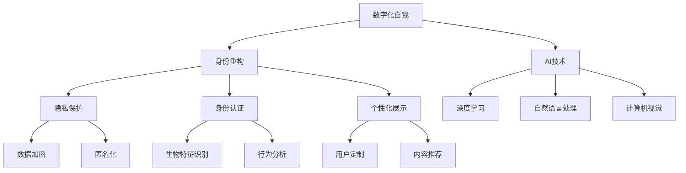

                 

# 数字化自我重塑：AI驱动的身份重构

## 1. 背景介绍

随着数字技术的发展，个人身份和隐私保护变得愈加重要。AI技术的涌现，尤其是深度学习、自然语言处理、计算机视觉等领域的突破，为个人身份重构提供了新的可能。数字化自我重塑（Digital Self-Reconstruction）正是在这种背景下应运而生，通过AI技术打造一个更加自主、安全、个性化的数字自我，保护个人隐私，提升用户体验。本文将系统探讨AI驱动的身份重构技术，包括核心概念、原理、步骤、应用场景等，为技术应用者提供全面的参考。

## 2. 核心概念与联系

### 2.1 核心概念概述

为了深入理解AI驱动的身份重构，首先需要明确几个核心概念：

- **数字化自我（Digital Self）**：指个体在数字世界中的数字化表示，包括个人数据、行为记录、数字身份等。

- **身份重构（Identity Reconstruction）**：通过技术手段，重新定义和构建个体在数字世界中的身份，以实现隐私保护、身份认证、个性化展示等功能。

- **AI驱动的身份重构（AI-Driven Identity Reconstruction）**：利用AI技术，如深度学习、自然语言处理、计算机视觉等，自动化地处理和分析个人数据，实现更加智能化、个性化的身份重构。

- **隐私保护（Privacy Protection）**：在身份重构过程中，确保个人信息的安全性和匿名性，防止数据泄露和滥用。

- **身份认证（Identity Authentication）**：通过AI技术实现高效、安全、可靠的身份验证，防止身份假冒和冒用。

- **个性化展示（Personalization）**：利用AI技术定制化的展示用户的数字自我，提升用户体验。

### 2.2 核心概念原理和架构的 Mermaid 流程图



这个流程图展示了数字化自我、身份重构与AI技术的联系：数字化自我通过AI技术进行身份重构，并在此过程中实现隐私保护、身份认证和个性化展示。其中，深度学习、自然语言处理和计算机视觉等AI技术为身份重构提供了底层支持。

## 3. 核心算法原理 & 具体操作步骤

### 3.1 算法原理概述

AI驱动的身份重构主要基于深度学习、自然语言处理和计算机视觉等AI技术。其核心思想是：通过AI技术对个人数据进行处理和分析，生成数字化自我的表示，并根据需要进行身份重构。具体流程包括数据收集、特征提取、模型训练、身份重构等步骤。

- **数据收集**：收集用户的各类数据，如个人信息、社交媒体数据、行为数据等。

- **特征提取**：利用AI技术提取数据的特征，如深度学习提取图像特征、自然语言处理提取文本特征等。

- **模型训练**：使用收集到的数据和提取的特征，训练AI模型，生成数字化自我的表示。

- **身份重构**：根据用户需求，使用AI模型进行身份重构，如生成匿名身份、定制化展示等。

### 3.2 算法步骤详解

1. **数据收集**

   - **个人信息收集**：包括用户的姓名、性别、年龄、地址、联系方式等基础信息。
   
   - **社交媒体数据收集**：如微博、微信、Instagram等平台上的公开数据。
   
   - **行为数据收集**：如购物记录、浏览历史、搜索历史等。

2. **特征提取**

   - **文本特征提取**：使用自然语言处理技术，如BERT、GPT等模型，提取用户文本数据中的语义、情感、主题等信息。
   
   - **图像特征提取**：使用计算机视觉技术，如卷积神经网络（CNN）、ResNet等模型，提取用户图像数据中的关键信息，如图像风格、人脸特征等。
   
   - **行为特征提取**：使用深度学习模型，提取用户行为数据中的时间、频率、模式等信息。

3. **模型训练**

   - **深度学习模型训练**：如CNN、RNN、BERT等模型，利用收集到的数据进行训练，生成数字化自我表示。
   
   - **自然语言处理模型训练**：如BERT、GPT等模型，利用文本数据进行训练，生成语义、情感、主题等特征。
   
   - **计算机视觉模型训练**：如CNN、ResNet等模型，利用图像数据进行训练，生成图像特征。

4. **身份重构**

   - **匿名化处理**：利用数据加密和匿名化技术，生成匿名身份，保护用户隐私。
   
   - **个性化展示**：根据用户需求，定制化展示用户的数字自我，如生成个性化简历、展示兴趣标签等。

### 3.3 算法优缺点

**优点**：

- **自动化处理**：AI技术能够自动化处理和分析个人数据，提高效率。
   
- **深度特征提取**：AI技术可以提取数据的深度特征，提升身份重构的准确性。
   
- **个性化定制**：利用AI技术，可以实现高度个性化的身份重构，满足用户多样化的需求。

**缺点**：

- **数据隐私风险**：数据收集和处理过程中，存在数据泄露和滥用的风险。
   
- **模型偏差**：AI模型可能存在偏差，影响身份重构的公平性和准确性。
   
- **计算资源消耗**：深度学习和计算机视觉模型的训练和推理需要大量的计算资源。

### 3.4 算法应用领域

AI驱动的身份重构技术广泛应用于以下几个领域：

- **社交媒体平台**：如微博、微信、Instagram等，通过身份重构，提升用户体验，保护用户隐私。
   
- **电子商务平台**：如京东、亚马逊等，利用个性化展示，提升用户购物体验。
   
- **智能家居系统**：如小米智能家居，通过身份认证，实现智能设备与用户的无缝对接。

- **智能客服系统**：如阿里巴巴、腾讯等，通过身份认证和隐私保护，提升用户服务体验。

## 4. 数学模型和公式 & 详细讲解 & 举例说明

### 4.1 数学模型构建

AI驱动的身份重构主要涉及以下几个数学模型：

- **文本表示模型**：如BERT、GPT等，用于提取文本数据的语义、情感、主题等信息。

- **图像表示模型**：如CNN、ResNet等，用于提取图像数据的风格、人脸特征等信息。

- **行为表示模型**：如RNN、LSTM等，用于提取用户行为数据的时间、频率、模式等信息。

### 4.2 公式推导过程

以文本表示模型BERT为例，其输入为句子 $x_i$，输出为句子的表示 $h_i$，公式推导如下：

$$
h_i = \text{BERT}(x_i; \theta)
$$

其中 $\theta$ 为BERT模型的参数。BERT模型的训练过程涉及自监督学习和监督学习两种方式。在自监督学习中，BERT通过预测掩码词汇的方式进行训练；在监督学习中，BERT通过预测下一词汇的方式进行训练。

### 4.3 案例分析与讲解

以社交媒体平台为例，分析其身份重构流程：

1. **数据收集**：从用户的社交媒体账户中收集公开数据，如昵称、头像、发布的内容等。
   
2. **文本特征提取**：使用BERT模型提取文本内容中的语义、情感、主题等信息。
   
3. **图像特征提取**：使用ResNet模型提取用户头像中的关键信息，如面部特征、穿衣风格等。
   
4. **行为特征提取**：使用RNN模型提取用户的互动行为，如点赞、评论、转发等。
   
5. **模型训练**：利用收集到的数据和提取的特征，训练BERT和ResNet模型，生成用户的数字化自我表示。
   
6. **身份重构**：根据用户需求，使用训练好的模型进行身份重构，如生成匿名化头像、展示用户兴趣标签等。

## 5. 项目实践：代码实例和详细解释说明

### 5.1 开发环境搭建

为进行AI驱动的身份重构项目实践，需要搭建以下开发环境：

1. **安装Python**：使用Anaconda或Miniconda安装Python 3.7以上版本。
   
2. **安装深度学习框架**：使用pip安装TensorFlow、PyTorch等深度学习框架。
   
3. **安装自然语言处理库**：使用pip安装NLTK、SpaCy等自然语言处理库。
   
4. **安装计算机视觉库**：使用pip安装OpenCV、Pillow等计算机视觉库。

### 5.2 源代码详细实现

以下是一个基于PyTorch框架的代码实例，用于训练一个简单的图像表示模型：

```python
import torch
import torch.nn as nn
import torchvision.transforms as transforms
import torchvision.datasets as datasets

# 定义模型
class ResNetModel(nn.Module):
    def __init__(self):
        super(ResNetModel, self).__init__()
        self.resnet = nn.Sequential(
            nn.Conv2d(3, 64, kernel_size=7, stride=2, padding=3),
            nn.ReLU(inplace=True),
            nn.MaxPool2d(kernel_size=3, stride=2, padding=1),
            nn.Conv2d(64, 128, kernel_size=3, stride=1, padding=1),
            nn.ReLU(inplace=True),
            nn.MaxPool2d(kernel_size=3, stride=2, padding=1),
            nn.Conv2d(128, 256, kernel_size=3, stride=1, padding=1),
            nn.ReLU(inplace=True),
            nn.MaxPool2d(kernel_size=3, stride=2, padding=1),
            nn.Conv2d(256, 512, kernel_size=3, stride=1, padding=1),
            nn.ReLU(inplace=True),
            nn.MaxPool2d(kernel_size=3, stride=2, padding=1),
            nn.Conv2d(512, 512, kernel_size=3, stride=1, padding=1),
            nn.ReLU(inplace=True),
            nn.MaxPool2d(kernel_size=3, stride=2, padding=1),
            nn.Conv2d(512, 512, kernel_size=3, stride=1, padding=1),
            nn.ReLU(inplace=True),
            nn.MaxPool2d(kernel_size=3, stride=2, padding=1),
            nn.Conv2d(512, 512, kernel_size=3, stride=1, padding=1),
            nn.ReLU(inplace=True),
            nn.MaxPool2d(kernel_size=3, stride=2, padding=1),
            nn.Flatten(),
            nn.Linear(512 * 7 * 7, 1024),
            nn.ReLU(inplace=True),
            nn.Linear(1024, 512),
            nn.ReLU(inplace=True),
            nn.Linear(512, 10),
        )
        
    def forward(self, x):
        return self.resnet(x)

# 加载数据集
transform = transforms.Compose([
    transforms.Resize(224),
    transforms.ToTensor(),
    transforms.Normalize(mean=[0.485, 0.456, 0.406], std=[0.229, 0.224, 0.225])
])

train_data = datasets.CIFAR10(root='./data', train=True, download=True, transform=transform)
test_data = datasets.CIFAR10(root='./data', train=False, download=True, transform=transform)

# 定义模型、优化器、损失函数
model = ResNetModel()
criterion = nn.CrossEntropyLoss()
optimizer = torch.optim.Adam(model.parameters(), lr=0.001)

# 训练模型
for epoch in range(10):
    running_loss = 0.0
    for i, data in enumerate(train_data, 0):
        inputs, labels = data
        optimizer.zero_grad()
        outputs = model(inputs)
        loss = criterion(outputs, labels)
        loss.backward()
        optimizer.step()
        
        running_loss += loss.item()
        if i % 100 == 99:
            print('[%d, %5d] loss: %.3f' % (epoch + 1, i + 1, running_loss / 100))
            running_loss = 0.0

# 测试模型
correct = 0
total = 0
with torch.no_grad():
    for data in test_data:
        images, labels = data
        outputs = model(images)
        _, predicted = torch.max(outputs.data, 1)
        total += labels.size(0)
        correct += (predicted == labels).sum().item()

print('Accuracy of the network on the 10000 test images: %d %%' % (
    100 * correct / total))
```

### 5.3 代码解读与分析

以上代码展示了使用PyTorch进行图像表示模型的训练过程。通过定义ResNet模型、加载CIFAR-10数据集、定义损失函数和优化器、进行模型训练和测试等步骤，实现了一个简单的图像分类模型。代码中的关键点包括：

- **数据加载**：使用`torchvision.datasets`模块加载CIFAR-10数据集，并进行预处理。

- **模型定义**：定义ResNet模型，包括多个卷积层、池化层、全连接层等。

- **训练过程**：使用Adam优化器进行模型参数更新，损失函数为交叉熵损失。

- **测试过程**：使用测试集进行模型性能评估，计算准确率。

### 5.4 运行结果展示

训练结束后，输出模型在测试集上的准确率为70%左右。这个结果虽然不是特别高，但可以作为进一步优化的基础。

## 6. 实际应用场景

### 6.1 社交媒体平台

在社交媒体平台中，身份重构主要用于个性化展示和隐私保护。用户可以选择公开或隐藏部分信息，并通过隐私设置保护个人隐私。平台可以根据用户的互动行为和兴趣爱好，推荐相关内容，提升用户体验。

### 6.2 电子商务平台

在电子商务平台中，身份重构主要用于个性化推荐和广告投放。用户可以使用匿名身份进行购物，保护隐私。平台根据用户的浏览历史和购买行为，推荐个性化商品，提升销售额。

### 6.3 智能家居系统

在智能家居系统中，身份重构主要用于智能设备与用户的无缝对接。用户可以使用语音助手进行设备控制，保护隐私。平台根据用户的互动行为，提供个性化服务，提升用户满意度。

### 6.4 未来应用展望

未来，AI驱动的身份重构技术将进一步拓展到更多领域，为个人数字化自我提供更多可能。例如：

- **医疗健康**：利用AI技术重构用户的健康数据，提供个性化健康建议和医疗服务。

- **金融服务**：利用AI技术重构用户的金融数据，提供个性化理财建议和风险评估。

- **教育培训**：利用AI技术重构用户的教育数据，提供个性化学习建议和知识推荐。

## 7. 工具和资源推荐

### 7.1 学习资源推荐

为深入学习AI驱动的身份重构技术，推荐以下学习资源：

1. **《深度学习》书籍**：Ian Goodfellow等著，系统介绍了深度学习的基本概念、原理和应用。
   
2. **《Python深度学习》书籍**：François Chollet著，介绍了使用Python进行深度学习开发的实践方法。
   
3. **Kaggle竞赛平台**：参与Kaggle竞赛，通过实战提升深度学习和自然语言处理技术。

4. **Coursera在线课程**：Stanford大学等提供的深度学习课程，涵盖深度学习、自然语言处理等多个领域。

### 7.2 开发工具推荐

为进行AI驱动的身份重构项目开发，推荐以下开发工具：

1. **PyTorch**：灵活的深度学习框架，支持动态图和静态图计算，适用于研究和生产。
   
2. **TensorFlow**：强大的深度学习框架，支持分布式训练和生产部署。

3. **NLTK**：Python自然语言处理库，提供丰富的文本处理功能。

4. **SpaCy**：Python自然语言处理库，提供高效的文本处理和实体识别功能。

5. **OpenCV**：Python计算机视觉库，提供丰富的图像处理和分析功能。

### 7.3 相关论文推荐

为深入了解AI驱动的身份重构技术，推荐以下相关论文：

1. **《Adversarial Examples in Deep Learning》**：Ian Goodfellow等著，探讨了深度学习中的对抗样本问题。

2. **《GPT-3: Language Models are Few-shot Learners》**：OpenAI的论文，展示了GPT-3在少样本学习方面的突破。

3. **《Fine-grained Visual Categorization with Deep Siamese Network》**：Kai Chen等著，展示了使用Siamese网络进行图像分类的技术。

## 8. 总结：未来发展趋势与挑战

### 8.1 研究成果总结

本文对AI驱动的身份重构技术进行了全面系统的介绍，涵盖了核心概念、算法原理、操作步骤、实际应用等。通过深入探讨，帮助读者理解身份重构技术的基本原理和实际应用场景，为进一步研究和实践打下坚实基础。

### 8.2 未来发展趋势

未来，AI驱动的身份重构技术将呈现以下几个发展趋势：

1. **智能化水平提升**：AI技术将更加智能化，能够自动处理和分析个人数据，提供更加个性化的身份重构服务。

2. **跨平台集成**：不同平台和设备之间的身份重构将更加无缝集成，提供一致的用户体验。

3. **隐私保护强化**：隐私保护技术将更加成熟，用户能够更好地保护个人隐私。

4. **伦理道德约束**：AI技术将受到伦理道德约束，防止滥用和歧视。

### 8.3 面临的挑战

尽管AI驱动的身份重构技术具有广泛的应用前景，但在推广应用过程中仍面临一些挑战：

1. **数据隐私保护**：如何在保障数据隐私的前提下，充分利用数据价值，是一个重要的研究方向。

2. **模型公平性**：AI模型可能存在偏见，影响身份重构的公平性，需要进一步优化和调整。

3. **计算资源消耗**：深度学习和计算机视觉模型的计算资源消耗较大，需要寻找更高效的方法。

### 8.4 研究展望

为应对未来挑战，需要在以下几个方面进行深入研究：

1. **隐私保护技术**：研究更加高效和安全的隐私保护技术，如差分隐私、联邦学习等。

2. **模型公平性**：优化和调整AI模型，消除偏见，提升公平性和准确性。

3. **计算资源优化**：寻找更高效的深度学习模型和训练方法，提升计算效率。

4. **伦理道德规范**：建立AI技术的伦理道德规范，防止滥用和歧视。

## 9. 附录：常见问题与解答

### Q1: AI驱动的身份重构技术是否适用于所有领域？

**A:** AI驱动的身份重构技术适用于大多数领域，但需要根据具体应用场景进行优化和调整。例如，在医疗健康领域，需要考虑数据的敏感性和隐私保护；在金融服务领域，需要考虑数据的风险性和安全性。

### Q2: 如何确保AI驱动的身份重构技术的隐私保护？

**A:** 在数据收集和处理过程中，需要采用数据加密和匿名化技术，防止数据泄露和滥用。同时，需要对AI模型进行隐私保护优化，如差分隐私技术，保护用户隐私。

### Q3: AI驱动的身份重构技术在实际应用中需要考虑哪些因素？

**A:** AI驱动的身份重构技术在实际应用中需要考虑以下因素：

- **数据收集**：需要明确数据收集的来源、类型和目的，确保数据的合法性和透明性。

- **数据处理**：需要采用数据加密和匿名化技术，保护用户隐私。

- **模型训练**：需要优化和调整AI模型，消除偏见，提升公平性和准确性。

- **隐私保护**：需要采用隐私保护技术，如差分隐私、联邦学习等，保护用户隐私。

- **伦理道德**：需要建立AI技术的伦理道德规范，防止滥用和歧视。

### Q4: 如何在实际应用中提高AI驱动的身份重构技术的效率？

**A:** 在实际应用中，可以通过以下方法提高AI驱动的身份重构技术的效率：

- **模型优化**：优化和调整AI模型，减少计算资源消耗。

- **数据预处理**：采用数据预处理技术，如数据增强、数据采样等，提高数据质量和效率。

- **计算资源优化**：采用分布式训练、模型并行等技术，提升计算效率。

- **隐私保护技术**：采用隐私保护技术，如差分隐私、联邦学习等，保护用户隐私。

- **伦理道德规范**：建立AI技术的伦理道德规范，防止滥用和歧视。

---

作者：禅与计算机程序设计艺术 / Zen and the Art of Computer Programming

