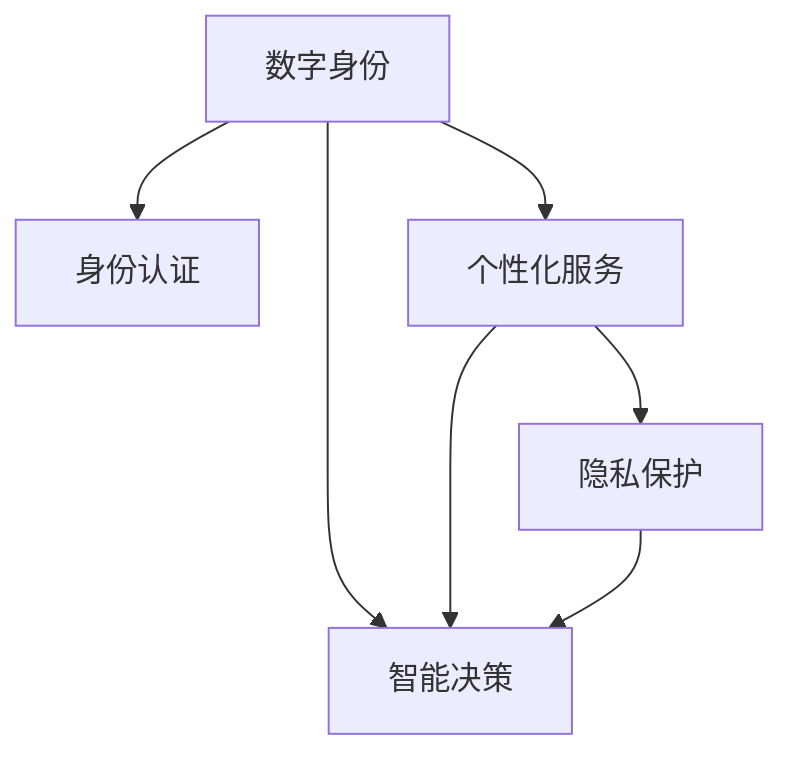

                 

# 数字化身份：AI时代的自我认知

在数字化时代，我们的生活方式、工作模式和社会互动方式正在经历深刻的变革。随着人工智能(AI)技术的飞速发展，我们越来越依赖于数字工具来获取、处理和分享信息。在这样的背景下，数字化身份(Digital Identity)的概念应运而生，它不仅包括了我们的线上身份标识，还囊括了基于AI的自我认知、个性化服务和智能决策。本文旨在深入探讨数字化身份的核心概念及其在AI时代的应用，提供全面的技术解读和实践指南，帮助读者理解数字化身份背后的技术原理和应用前景。

## 1. 背景介绍

### 1.1 数字化身份的兴起背景

随着移动互联网和物联网技术的普及，人们的生活变得更加数字化和互联互通。在虚拟世界中，我们每个人都是一个数字化身份，这些身份通过各种数字平台和应用得以体现和维护。从社交网络到电子商务，从在线学习到远程工作，数字化身份在各个领域扮演着越来越重要的角色。

### 1.2 数字化身份的核心价值

数字化身份的核心价值在于其能够提供更高效、安全和个性化的服务。AI技术的引入使得数字化身份不仅能够进行身份验证和授权，还能够在用户行为分析、智能推荐、个性化互动等方面发挥重要作用。

### 1.3 技术发展趋势

AI时代，数字化身份技术正经历从基础身份验证向深度个性化和智能决策的转变。这一转变不仅提升了用户体验，也打开了新的商业模式和应用场景，如智能合同、虚拟资产管理、自动化金融服务等。

## 2. 核心概念与联系

### 2.1 核心概念概述

为了更好地理解数字化身份，我们首先要明晰几个关键概念：

- **数字身份**：即通过数字手段标识和验证个人或组织身份的方式，包括姓名、证件号码、电子邮件、社交媒体账号等。
- **身份认证**：验证数字身份真实性的过程，确保用户登录和交易的安全性。
- **个性化服务**：利用AI技术，根据用户行为和偏好提供定制化的服务。
- **智能决策**：基于AI算法的自动化决策系统，用于风险管理、推荐系统等。
- **隐私保护**：在数字化身份设计和应用中，确保用户数据安全和隐私不被滥用。

这些概念之间相互联系，共同构成了数字化身份的完整框架。

### 2.2 核心概念原理和架构的 Mermaid 流程图



这张流程图展示了数字化身份的基本架构，其中数字身份是基础，通过身份认证确保安全，个性化服务和智能决策提升用户体验和效率，隐私保护保障数据安全。

## 3. 核心算法原理 & 具体操作步骤

### 3.1 算法原理概述

数字化身份的核心算法主要涉及身份验证、行为分析、个性化推荐和智能决策等多个方面。这些算法的原理和操作过程可以分为以下几个步骤：

1. **身份验证**：通过密码、指纹、面部识别等手段验证用户的真实身份。
2. **行为分析**：利用机器学习算法分析用户的行为模式，识别出异常行为。
3. **个性化推荐**：基于用户历史行为和偏好，使用推荐系统算法提供定制化服务。
4. **智能决策**：通过构建决策模型，自动处理复杂决策问题，如信用评估、风险管理等。

### 3.2 算法步骤详解

以个性化推荐为例，详细阐述其操作步骤：

1. **数据收集**：从用户的浏览历史、购物记录、社交网络互动等渠道收集数据。
2. **特征提取**：使用特征工程技术从原始数据中提取有意义的特征，如兴趣标签、行为序列等。
3. **模型训练**：选择合适的推荐算法（如协同过滤、内容推荐、深度学习等），使用历史数据进行模型训练。
4. **推荐计算**：将新数据输入训练好的模型，计算出个性化推荐结果。
5. **结果反馈**：根据用户反馈调整推荐模型，提升推荐效果。

### 3.3 算法优缺点

数字化身份算法的优点在于：

- **高效性**：自动化处理和推荐，减少了人工干预。
- **个性化**：能够根据用户行为提供定制化服务，提升用户体验。
- **安全性**：AI技术提升了身份验证和风险管理的准确性和效率。

但其缺点也不容忽视：

- **隐私风险**：大量数据收集和处理可能导致隐私泄露。
- **偏见和歧视**：算法可能基于历史数据存在偏见，影响推荐公平性。
- **复杂度**：算法模型复杂，需要持续优化和调整。

### 3.4 算法应用领域

数字化身份算法在多个领域有着广泛的应用，包括但不限于：

- **电子商务**：推荐系统、支付授权、客户服务。
- **社交网络**：好友推荐、内容过滤、广告投放。
- **金融服务**：信用评估、风险管理、智能投顾。
- **医疗健康**：个性化诊疗、健康管理、远程咨询。
- **教育培训**：学习路径推荐、智能辅导、个性化评估。

## 4. 数学模型和公式 & 详细讲解 & 举例说明

### 4.1 数学模型构建

以个性化推荐系统为例，构建推荐模型的数学框架如下：

$$
R_{ui} = \sum_{i=1}^n \alpha_i f(u,X_i)
$$

其中 $R_{ui}$ 表示用户 $u$ 对商品 $i$ 的评分，$n$ 为商品数量，$\alpha_i$ 为商品权重，$f(u,X_i)$ 为评分函数，$X_i$ 为商品特征向量。

### 4.2 公式推导过程

假设评分函数为线性函数：

$$
f(u,X_i) = \theta_0 + \sum_{j=1}^m \theta_j x_{ij}
$$

其中 $\theta_0$ 为截距，$\theta_j$ 为特征权重，$x_{ij}$ 为商品特征。

根据最小二乘法，模型参数 $\theta$ 的最优解为：

$$
\hat{\theta} = (X^T X)^{-1} X^T Y
$$

其中 $X = [\vec{1}, \vec{x}_1, \vec{x}_2, ..., \vec{x}_n]$，$Y = [y_1, y_2, ..., y_m]$。

### 4.3 案例分析与讲解

以一个简单的电商推荐系统为例，该系统基于用户的浏览和购买历史，推荐可能感兴趣的商品。首先收集用户的浏览数据和商品信息，构建特征向量 $X$ 和用户评分向量 $Y$。然后使用上述线性回归模型进行训练，得到推荐模型 $\hat{R}$。最后，根据新商品的特征向量 $x$，计算预测评分 $\hat{r}$，选取评分最高的商品推荐给用户。

## 5. 项目实践：代码实例和详细解释说明

### 5.1 开发环境搭建

为了搭建一个基本的个性化推荐系统，我们建议使用Python和PyTorch作为开发环境。具体步骤如下：

1. **安装Python和PyTorch**：
   ```bash
   pip install torch torchvision torchaudio
   ```

2. **安装推荐系统库**：
   ```bash
   pip install rec-util
   ```

3. **准备数据集**：
   从公开数据集或生成模拟数据集，如Amazon产品数据集，准备用户数据和商品数据。

### 5.2 源代码详细实现

以下是一个简单的基于协同过滤的推荐系统代码实现：

```python
import torch
import numpy as np
from rec_util import CollaborativeFiltering

# 准备数据
user_data = np.array([[1, 1, 1], [1, 0, 1], [0, 1, 1]])
item_data = np.array([[1, 0], [0, 1], [1, 1]])

# 初始化协同过滤模型
model = CollaborativeFiltering(dim=10, learning_rate=0.01)

# 训练模型
model.train(user_data, item_data, num_epochs=10)

# 推荐商品
new_user = np.array([1, 0, 1])
new_item = np.array([[1, 1]])
recommendation = model.predict(new_user, new_item)
```

### 5.3 代码解读与分析

在上述代码中，我们使用了`CollaborativeFiltering`类来实现协同过滤推荐模型。模型通过训练历史数据，预测新用户的推荐商品。协同过滤是一种基于用户和物品之间共现频率的推荐方法，计算简单，易于实现。

## 6. 实际应用场景

### 6.1 智能客服

数字化身份技术在智能客服中有着广泛的应用。通过分析用户的行为和语言特征，智能客服系统能够自动识别用户的需求，提供个性化服务。例如，某电商平台通过数字化身份分析用户的历史购买记录和浏览行为，推荐可能感兴趣的商品，提升用户体验。

### 6.2 金融服务

在金融服务领域，数字化身份技术用于信用评估、风险管理、智能投顾等方面。例如，银行可以通过分析用户的消费记录和社交网络行为，评估用户的信用风险，制定个性化的贷款和理财方案。

### 6.3 健康医疗

在健康医疗领域，数字化身份技术用于个性化诊疗、健康管理、远程咨询等方面。例如，某医疗平台通过分析用户的健康数据和医疗行为，推荐适合的诊疗方案，提供个性化的健康管理建议。

## 7. 工具和资源推荐

### 7.1 学习资源推荐

- **Coursera**：提供多个关于个性化推荐和智能决策的课程，如《Machine Learning》（Andrew Ng）、《Recommender Systems》（Joseph Bergstra）。
- **Udacity**：提供《AI for Everyone》课程，适合零基础入门。
- **Kaggle**：数据科学竞赛平台，提供丰富的数据集和算法竞赛，适合实践和锻炼。

### 7.2 开发工具推荐

- **PyTorch**：深度学习框架，易于使用，支持GPU加速。
- **TensorFlow**：Google开发的深度学习框架，支持分布式计算。
- **Recommender Systems Library**：开源的推荐系统库，提供多种推荐算法和评估工具。

### 7.3 相关论文推荐

- **《A Survey of Recommender Systems》（Kumar et al.）**：全面综述推荐系统算法和技术。
- **《Deep Neural Networks for NLP》（Goodfellow et al.）**：介绍深度学习在自然语言处理中的应用，包括推荐系统。
- **《Fusing User-Item Interaction Models and Contextual Information for Personalized Recommendation》（Wu et al.）**：提出基于上下文信息的推荐系统，提升推荐效果。

## 8. 总结：未来发展趋势与挑战

### 8.1 研究成果总结

数字化身份技术已经取得了显著的进展，广泛应用于多个领域。其核心在于利用AI技术提升用户体验和服务质量。未来，随着AI技术的进一步发展，数字化身份将变得更加智能和个性化。

### 8.2 未来发展趋势

1. **深度学习的应用**：未来推荐系统将更多地采用深度学习技术，如神经协同过滤、深度矩阵分解等，提升推荐的准确性和个性化程度。
2. **跨领域融合**：数字化身份技术将与其他AI技术融合，如自然语言处理、计算机视觉等，提供更全面的服务。
3. **隐私保护技术**：随着数据隐私意识的增强，隐私保护技术将成为数字化身份的重要组成部分。
4. **联邦学习**：通过分布式学习，降低数据集中的隐私风险，同时提升推荐效果。

### 8.3 面临的挑战

1. **数据隐私**：如何在大数据背景下保护用户隐私，是数字化身份技术面临的主要挑战。
2. **算法公平性**：算法的公平性和公正性问题需要进一步研究和解决。
3. **跨平台兼容性**：不同平台和系统之间的兼容性问题需要解决，确保数字化身份技术在不同环境中都能无缝运行。

### 8.4 研究展望

未来的研究将围绕以下几个方面展开：

1. **隐私保护技术**：发展更加安全和高效的隐私保护算法，如差分隐私、同态加密等。
2. **公平性算法**：研究和开发更加公平和透明的推荐算法，减少偏见和歧视。
3. **跨平台互操作**：构建跨平台、跨系统的数字化身份标准和协议，提升互操作性。
4. **联邦学习**：探索分布式学习和联邦学习的应用，保护用户隐私的同时提升推荐效果。

## 9. 附录：常见问题与解答

### Q1: 什么是数字化身份？

A: 数字化身份是指通过数字手段标识和验证个人或组织身份的方式，包括姓名、证件号码、电子邮件、社交媒体账号等。

### Q2: 数字化身份和传统身份验证有什么区别？

A: 数字化身份利用AI技术进行身份验证和授权，更加高效、安全且个性化。相比传统身份验证，数字化身份能够提供更丰富的服务，如个性化推荐、智能决策等。

### Q3: 如何保护用户数据隐私？

A: 采用差分隐私、同态加密等隐私保护技术，确保用户数据在传输和存储过程中不被泄露。同时，合理设计和限制数据访问权限，防止数据滥用。

### Q4: 如何提高推荐系统的公平性？

A: 使用公平性算法，如对抗性训练、正则化等，减少算法偏见。同时，引入多维度特征，如年龄、性别、地区等，提升推荐的多样性和公平性。

### Q5: 未来数字化身份技术的发展方向是什么？

A: 未来数字化身份技术将朝着深度学习、跨领域融合、隐私保护、联邦学习等方向发展，提供更智能、个性化、安全的服务。

作者：禅与计算机程序设计艺术 / Zen and the Art of Computer Programming

