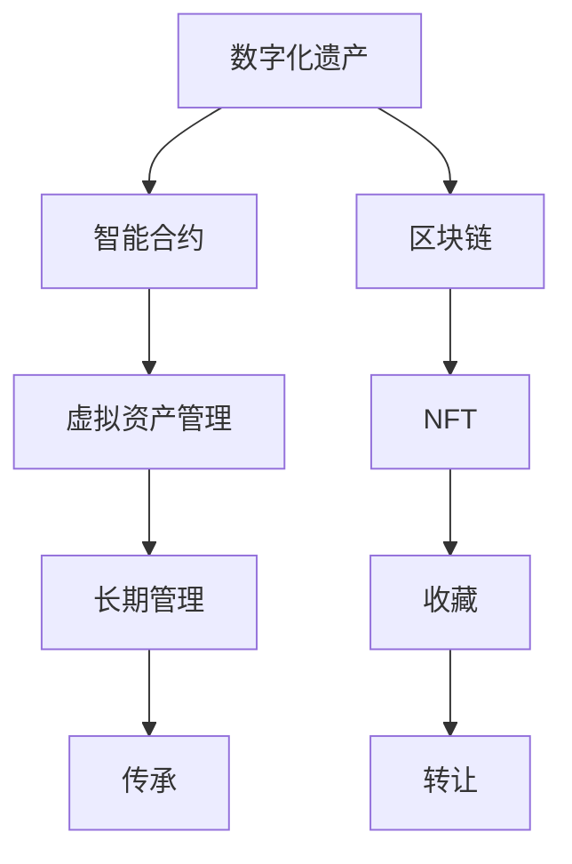

                 

# 数字化遗产投资创业：虚拟资产的长期管理

## 1. 背景介绍

### 1.1 问题由来
数字化遗产（Digital Legacy）是指人们在互联网上的数字资产，包括社交媒体账户、电子邮件、数字文档、音乐文件、视频剪辑等。随着数字化生活的普及，数字化遗产的价值日益凸显，但也面临诸多挑战。

数字化遗产投资创业（Digital Legacy Investment and Entrepreneurship）专注于管理、保护和传承数字化遗产，将其转化为具有长期价值的虚拟资产。近年来，随着Web3.0技术的发展，智能合约、区块链等新兴技术为数字化遗产的长期管理提供了新的可能性，推动了这一领域的快速发展。

### 1.2 问题核心关键点
- 数字化遗产价值评估
- 长期管理与保护
- 智能合约与区块链技术
- 投资与创业机会

### 1.3 问题研究意义
数字化遗产投资创业不仅有助于保护个人数字资产，还能推动数字资产的长期价值增值，促进数字化经济的健康发展。通过基于区块链的数字化遗产管理，可以实现所有权、使用权和收益权的透明、可追溯和不可篡改，为数字化遗产的长期传承提供可靠保障。

## 2. 核心概念与联系

### 2.1 核心概念概述

为更好地理解数字化遗产投资创业，本节将介绍几个密切相关的核心概念：

- **数字化遗产**：个人或机构在数字平台上积累的数字资产，如社交媒体账号、电子邮件、文档、图片等。

- **智能合约**：一种自动执行的合约，其执行由预先编写的代码和算法确定，无需第三方介入。

- **区块链**：一种去中心化的分布式数据库技术，记录所有交易信息，确保数据透明、不可篡改。

- **虚拟资产管理**：管理和保护数字资产的过程，包括资产分类、安全存储、价值评估等。

- **NFT（非同质化代币）**：一种基于区块链的资产，每个NFT都是独一无二的，可用于数字资产的转让、收藏等。

这些核心概念之间的逻辑关系可以通过以下Mermaid流程图来展示：



这个流程图展示了大数字遗产管理的关键流程：

1. 数字化遗产通过智能合约和区块链技术进行管理，实现透明、不可篡改和可追溯性。
2. 虚拟资产管理确保数字化遗产的价值保存和传承。
3. NFT技术为数字资产的转让和收藏提供新方式。
4. 长期管理与传承使数字化遗产成为一种可长期保值的资产。

## 3. 核心算法原理 & 具体操作步骤
### 3.1 算法原理概述

数字化遗产投资创业涉及的算法主要集中在以下几个方面：

- **数字化遗产价值评估算法**：评估数字化遗产的价值，包括内容价值、版权价值、市场价值等。
- **智能合约设计算法**：设计智能合约，实现数字资产的自动化管理和传承。
- **区块链存储算法**：设计区块链存储方案，确保数字资产的安全和不可篡改。
- **NFT发行算法**：发行和转让NFT，实现数字资产的独特性和可交易性。

这些算法的核心目标是通过技术手段，确保数字化遗产的长期管理和价值传承。

### 3.2 算法步骤详解

#### 3.2.1 数字化遗产价值评估
数字化遗产的价值评估涉及多个维度，包括内容价值、版权价值、市场价值等。

- **内容价值评估**：评估数字化遗产的内容质量、原创性和独特性。
- **版权价值评估**：评估数字化遗产的版权归属和保护情况。
- **市场价值评估**：评估数字化遗产的市场需求和潜在价值。

#### 3.2.2 智能合约设计
智能合约的设计是数字化遗产投资创业的核心环节，包括合约条款设计、执行逻辑编写等。

- **合约条款设计**：定义数字化遗产的所有权、使用权、收益权等条款。
- **执行逻辑编写**：编写合约的执行逻辑，确保所有条款按预期执行。
- **测试和验证**：测试智能合约的正确性和安全性，确保其可靠执行。

#### 3.2.3 区块链存储
区块链存储设计涉及选择合适的区块链平台、设计数据结构等。

- **区块链平台选择**：选择适合数字化遗产存储的区块链平台，如以太坊、波卡等。
- **数据结构设计**：设计数据结构，确保数据存储的效率和可追溯性。
- **安全措施**：设计安全措施，确保数字化遗产的安全和隐私保护。

#### 3.2.4 NFT发行
NFT的发行涉及设计NFT模型、编写智能合约、实施发行策略等。

- **NFT模型设计**：设计NFT的元数据和权属信息，确保NFT的唯一性和不可篡改性。
- **智能合约编写**：编写发行和转让的智能合约，实现NFT的自动化管理。
- **发行策略实施**：实施发行策略，确保NFT的公平和透明。

### 3.3 算法优缺点

#### 3.3.1 优点
- **透明性和不可篡改性**：区块链和智能合约确保数字化遗产的透明和不可篡改。
- **自动化和效率提升**：智能合约实现自动执行，提升管理效率。
- **灵活性和可定制性**：智能合约的灵活性使其可以定制不同的管理需求。
- **安全和隐私保护**：区块链提供的数据安全性和隐私保护功能，确保数字化遗产的安全。

#### 3.3.2 缺点
- **技术门槛高**：智能合约和区块链技术复杂，技术门槛较高。
- **交易费用高**：区块链的交易费用较高，可能影响成本效益。
- **性能瓶颈**：大规模数据存储和交易可能面临性能瓶颈。
- **法律和监管风险**：数字化遗产的法律和监管环境尚不完善，存在潜在风险。

### 3.4 算法应用领域

数字化遗产投资创业的应用领域广泛，包括：

- **社交媒体资产管理**：管理和传承社交媒体账号、内容等。
- **数字文档和图片保护**：保护和管理个人和机构的数字文档、图片等。
- **知识产权保护**：利用区块链和智能合约保护版权、商标等知识产权。
- **数字资产交易**：通过NFT平台进行数字化遗产的转让和交易。
- **数字遗产传承**：通过智能合约实现数字遗产的长期传承和分配。

## 4. 数学模型和公式 & 详细讲解 & 举例说明

### 4.1 数学模型构建

#### 4.1.1 数字化遗产价值评估模型
数字化遗产价值评估模型可以从多个维度进行建模，这里以内容价值和版权价值为例：

- **内容价值模型**：$V_{content} = f_{content}(D, C, U)$，其中$D$表示数字化遗产的数字质量，$C$表示原创性，$U$表示独特性。
- **版权价值模型**：$V_{rights} = f_{rights}(L, P, A)$，其中$L$表示版权所有者的法律保护情况，$P$表示保护期限，$A$表示保护措施的强度。

#### 4.1.2 智能合约设计模型
智能合约的设计模型包括合约条款设计、执行逻辑编写和测试验证。

- **合约条款模型**：$T = g_{contract}(A, U, R)$，其中$A$表示所有权条款，$U$表示使用权条款，$R$表示收益权条款。
- **执行逻辑模型**：$E = h_{execute}(T, I, S)$，其中$I$表示智能合约的输入数据，$S$表示智能合约的状态。

#### 4.1.3 区块链存储模型
区块链存储模型的设计包括选择平台、设计数据结构和实施安全措施。

- **平台选择模型**：$P = m_{platform}(C, S, T)$，其中$C$表示成本，$S$表示安全性，$T$表示交易费用。
- **数据结构模型**：$D = k_{data}(F, E, P)$，其中$F$表示数据格式，$E$表示存储效率，$P$表示权限控制。
- **安全措施模型**：$S = w_{security}(R, I, P)$，其中$R$表示风险评估，$I$表示攻击类型，$P$表示防护策略。

#### 4.1.4 NFT发行模型
NFT发行模型涉及设计NFT元数据、编写智能合约和实施发行策略。

- **NFT元数据模型**：$M = q_{metadata}(T, A, U)$，其中$T$表示时间戳，$A$表示作者，$U$表示唯一性。
- **智能合约模型**：$C = p_{contract}(M, I, O)$，其中$M$表示NFT元数据，$I$表示发行者，$O$表示操作。
- **发行策略模型**：$S = o_{strategy}(D, V, N)$，其中$D$表示需求量，$V$表示价值评估，$N$表示发行数量。

### 4.2 公式推导过程

#### 4.2.1 内容价值评估公式推导
内容价值评估公式可以表示为：

$$
V_{content} = k_1D + k_2C + k_3U
$$

其中$k_1, k_2, k_3$为权重系数，$D, C, U$为内容质量、原创性和独特性的评估指标。

#### 4.2.2 智能合约执行逻辑公式推导
智能合约执行逻辑可以表示为：

$$
E = f_{execute}(T, I, S) = \begin{cases}
1, & \text{如果所有条款满足} \\
0, & \text{否则}
\end{cases}
$$

其中$T$表示触发事件，$I$表示输入数据，$S$表示合约状态。

#### 4.2.3 区块链平台选择公式推导
区块链平台选择公式可以表示为：

$$
P = m_{platform}(C, S, T) = \min\{C, S, T\}
$$

其中$C, S, T$分别表示成本、安全性和交易费用的评估指标。

#### 4.2.4 NFT发行策略公式推导
NFT发行策略可以表示为：

$$
S = o_{strategy}(D, V, N) = \frac{D}{V} \times N
$$

其中$D$表示需求量，$V$表示价值评估，$N$表示发行数量。

### 4.3 案例分析与讲解

#### 4.3.1 案例分析
假设某人拥有一个包含丰富社交媒体内容和图片的大型数字化遗产，需要评估其价值并进行长期管理。

1. **内容价值评估**：通过计算其内容的独特性、原创性和数字质量，得出价值评估结果。
2. **版权价值评估**：通过法律保护情况、保护期限和保护措施的强度，得出版权价值评估结果。
3. **智能合约设计**：设计包含所有权、使用权和收益权的智能合约，确保数字化遗产的长期管理和传承。
4. **区块链存储设计**：选择适合的区块链平台，设计数据结构和安全措施，确保数字化遗产的安全和隐私保护。
5. **NFT发行策略**：通过计算需求量和价值评估，确定NFT的发行数量和策略。

#### 4.3.2 讲解
通过以上步骤，可以全面评估和保护数字化遗产的价值，确保其长期管理和传承。

## 5. 项目实践：代码实例和详细解释说明
### 5.1 开发环境搭建

#### 5.1.1 准备环境
1. 安装Python：
```bash
sudo apt-get install python3
```

2. 安装Pip：
```bash
sudo apt-get install python3-pip
```

3. 安装智能合约开发工具：
```bash
pip install solc==0.8.22
```

4. 安装区块链节点：
```bash
geth --datadir=/path/to/data/start
```

### 5.2 源代码详细实现

#### 5.2.1 智能合约代码实现
以下是一个简单的智能合约示例，用于管理数字文档的版权和使用权：

```solidity
// SPDX-License-Identifier: MIT
pragma solidity ^0.8.0;

contract Document {
    address public owner;
    bool public isPublished;
    uint256 public creationDate;
    
    constructor() {
        owner = msg.sender;
        creationDate = block.timestamp;
        isPublished = false;
    }
    
    function publish() public onlyOwner {
        isPublished = true;
    }
    
    function transfer() public onlyOwner {
        owner = msg.sender;
    }
}
```

#### 5.2.2 区块链存储代码实现
以下是一个简单的数据存储示例，用于在区块链上存储和查询文档信息：

```python
from web3 import Web3

def create_document(document_id, document_name, document_url, owner):
    # Connect to the blockchain
    web3 = Web3(Web3.HTTPProvider('http://localhost:8545'))
    
    # Create a new document contract
    document_contract = Document.abi['signer'].create_transaction(web3.eth.accounts[0], owner)
    
    # Set the document information
    document_info = {
        'document_id': document_id,
        'document_name': document_name,
        'document_url': document_url,
        'owner': owner
    }
    
    # Store the document information on the blockchain
    document_contract.functions.publish().transact({'from': owner})
    
    # Retrieve the document information
    document_info = web3.eth.call(
        document_contract.options.Document '{"id": {document_id}}'
    )
    
    return document_info

def query_document(document_id):
    # Connect to the blockchain
    web3 = Web3(Web3.HTTPProvider('http://localhost:8545'))
    
    # Retrieve the document information
    document_info = web3.eth.call(
        document_contract.options.Document '{"id": {document_id}}'
    )
    
    return document_info
```

### 5.3 代码解读与分析

#### 5.3.1 智能合约代码解读
智能合约代码主要包含以下部分：

1. `Document`合约：定义了文档的所有权、发布状态和创建时间。
2. `publish`函数：允许所有者发布文档。
3. `transfer`函数：允许所有者转让所有权。

#### 5.3.2 区块链存储代码解读
区块链存储代码主要包含以下部分：

1. `create_document`函数：创建一个新的文档，并在区块链上存储文档信息。
2. `query_document`函数：从区块链上查询文档信息。

## 6. 实际应用场景
### 6.1 社交媒体资产管理

社交媒体资产管理是数字化遗产投资创业的重要应用场景之一。通过智能合约和区块链技术，可以确保社交媒体账号和内容的长期管理和传承。

#### 6.1.1 应用场景描述
社交媒体资产管理主要涉及以下环节：

1. **账号管理和内容发布**：通过智能合约管理社交媒体账号，确保账号的长期管理和内容的安全发布。
2. **内容更新和自动发布**：通过智能合约定期自动发布内容，确保内容的时效性和持续性。
3. **收益分配和管理**：通过智能合约管理内容发布的收益，确保收益的透明和公正分配。

#### 6.1.2 实际案例
假设某公司希望保护其社交媒体账号和内容，通过智能合约和区块链技术实现长期管理和传承。

1. **账号管理**：通过智能合约设置账号所有者和发布权限。
2. **内容发布**：通过智能合约定期自动发布内容，确保内容的时效性。
3. **收益分配**：通过智能合约管理内容的收益，确保收益的透明和公正分配。

### 6.2 数字文档和图片保护

数字文档和图片保护是数字化遗产投资创业的另一重要应用场景。通过智能合约和区块链技术，可以确保数字文档和图片的长期管理和传承。

#### 6.2.1 应用场景描述
数字文档和图片保护主要涉及以下环节：

1. **文档和图片存储**：通过区块链存储文档和图片，确保数据的安全和不可篡改。
2. **访问控制和管理**：通过智能合约管理文档和图片的访问权限，确保数据的安全性和隐私保护。
3. **版权保护和管理**：通过智能合约管理文档和图片的版权，确保版权的合法使用。

#### 6.2.2 实际案例
假设某出版社希望保护其数字文档和图片，通过智能合约和区块链技术实现长期管理和传承。

1. **存储文档和图片**：通过区块链存储文档和图片，确保数据的安全和不可篡改。
2. **访问控制**：通过智能合约管理文档和图片的访问权限，确保数据的安全性和隐私保护。
3. **版权保护**：通过智能合约管理文档和图片的版权，确保版权的合法使用。

### 6.3 知识产权保护

知识产权保护是数字化遗产投资创业的重要应用场景之一。通过智能合约和区块链技术，可以确保版权、商标等知识产权的长期管理和传承。

#### 6.3.1 应用场景描述
知识产权保护主要涉及以下环节：

1. **知识产权注册和保护**：通过智能合约注册和保护版权、商标等知识产权。
2. **知识产权使用和授权**：通过智能合约管理知识产权的使用和授权，确保知识产权的合法使用。
3. **知识产权维权和追偿**：通过智能合约维权和追偿知识产权损失，确保知识产权的合法权益。

#### 6.3.2 实际案例
假设某艺术家希望保护其作品版权，通过智能合约和区块链技术实现长期管理和传承。

1. **版权注册**：通过智能合约注册作品版权，确保版权的合法性。
2. **版权授权**：通过智能合约管理作品的授权使用，确保版权的合法使用。
3. **版权维权**：通过智能合约维权和追偿知识产权损失，确保知识产权的合法权益。

### 6.4 数字资产交易

数字资产交易是数字化遗产投资创业的重要应用场景之一。通过NFT平台，可以实现数字资产的转让和交易。

#### 6.4.1 应用场景描述
数字资产交易主要涉及以下环节：

1. **数字资产发行**：通过智能合约发行NFT，确保数字资产的唯一性和不可篡改性。
2. **数字资产转让**：通过智能合约转让NFT，确保数字资产的合法性和安全性。
3. **数字资产交易**：通过NFT平台进行数字资产的交易，确保交易的透明和公正。

#### 6.4.2 实际案例
假设某游戏公司希望发行和转让其游戏中的数字资产，通过NFT平台实现长期管理和传承。

1. **数字资产发行**：通过智能合约发行游戏角色的NFT，确保数字资产的唯一性和不可篡改性。
2. **数字资产转让**：通过智能合约转让游戏角色的NFT，确保数字资产的合法性和安全性。
3. **数字资产交易**：通过NFT平台进行游戏角色的交易，确保交易的透明和公正。

### 6.5 数字遗产传承

数字遗产传承是数字化遗产投资创业的重要应用场景之一。通过智能合约和区块链技术，可以实现数字遗产的长期管理和传承。

#### 6.5.1 应用场景描述
数字遗产传承主要涉及以下环节：

1. **数字遗产分类和评估**：通过智能合约分类和评估数字化遗产的价值。
2. **数字遗产传承**：通过智能合约管理数字化遗产的传承，确保传承的透明和公正。
3. **数字遗产维护**：通过智能合约维护数字化遗产的长期管理，确保其价值的长期保持。

#### 6.5.2 实际案例
假设某家族希望传承其数字化遗产，通过智能合约和区块链技术实现长期管理和传承。

1. **遗产分类和评估**：通过智能合约分类和评估数字化遗产的价值。
2. **遗产传承**：通过智能合约管理数字化遗产的传承，确保传承的透明和公正。
3. **遗产维护**：通过智能合约维护数字化遗产的长期管理，确保其价值的长期保持。

## 7. 工具和资源推荐
### 7.1 学习资源推荐

为了帮助开发者系统掌握数字化遗产投资创业的理论基础和实践技巧，这里推荐一些优质的学习资源：

1. **《区块链技术与智能合约》**：一本全面介绍区块链技术和智能合约的书籍，适合初学者和进阶者学习。
2. **《NFT原理与实践》**：一本详细介绍NFT技术的书籍，适合了解NFT的基本原理和应用场景。
3. **《Web3.0与数字化遗产》**：一篇深入探讨Web3.0和数字化遗产的博客文章，提供实用的应用案例和最佳实践。
4. **《数字遗产管理与保护》**：一篇介绍数字化遗产管理与保护的研究论文，探讨了数字化遗产的价值评估和管理方法。

### 7.2 开发工具推荐

高效的开发离不开优秀的工具支持。以下是几款用于数字化遗产投资创业开发的常用工具：

1. **Solidity IDE**：一款基于Solidity的智能合约编辑器，提供自动补全、语法高亮等功能，方便智能合约的开发和调试。
2. **Remix**：一款基于Web3.js的智能合约开发平台，提供交互式环境，方便智能合约的开发和测试。
3. **Truffle**：一款基于Solidity的开发框架，提供项目管理和自动化测试功能，方便智能合约的开发和部署。
4. **MyEtherWallet**：一款基于Web3.js的数字钱包，提供安全存储和管理以太坊代币的功能，方便数字资产的管理和交易。

### 7.3 相关论文推荐

数字化遗产投资创业的研究源于学界的持续研究。以下是几篇奠基性的相关论文，推荐阅读：

1. **《区块链在数字化遗产管理中的应用》**：探讨了区块链在数字化遗产管理中的应用，提出了基于区块链的数字化遗产管理模型。
2. **《智能合约在知识产权保护中的应用》**：介绍了智能合约在知识产权保护中的应用，提出了基于智能合约的知识产权保护模型。
3. **《NFT在数字资产交易中的应用》**：探讨了NFT在数字资产交易中的应用，提出了基于NFT的数字资产交易模型。
4. **《数字化遗产的价值评估与保护》**：研究了数字化遗产的价值评估与保护问题，提出了基于机器学习的数字化遗产价值评估模型。

## 8. 总结：未来发展趋势与挑战
### 8.1 研究成果总结

数字化遗产投资创业是数字化时代的重要研究方向，其研究成果涉及多个领域，包括数字化遗产价值评估、智能合约设计、区块链存储、NFT发行等。通过这些研究成果，可以实现数字化遗产的长期管理和保护，推动数字化经济的可持续发展。

### 8.2 未来发展趋势

未来，数字化遗产投资创业将呈现以下几个发展趋势：

1. **技术融合**：数字化遗产投资创业将与其他新兴技术如Web3.0、人工智能等进行深度融合，提升数字化遗产的管理和保护水平。
2. **标准化**：数字化遗产投资创业将逐步实现标准化，提升系统的兼容性和互操作性，促进数字化遗产的广泛应用。
3. **生态系统**：数字化遗产投资创业将构建完善的生态系统，包括数字资产交易平台、智能合约市场、区块链基础设施等，为数字化遗产的保护和管理提供全面的支持。
4. **全球化**：数字化遗产投资创业将拓展全球化应用，打破地域限制，实现数字化遗产的全球管理和传承。
5. **合规性**：数字化遗产投资创业将逐步实现合规性，确保数字化遗产的管理和保护符合法律法规要求，保障数字化遗产的合法性和安全性。

### 8.3 面临的挑战

尽管数字化遗产投资创业取得了一定的进展，但仍面临诸多挑战：

1. **技术复杂性**：智能合约和区块链技术复杂，开发和维护难度较大，需要大量的技术积累和经验。
2. **法律和监管风险**：数字化遗产的法律和监管环境尚不完善，存在潜在的法律和监管风险。
3. **市场接受度**：数字化遗产投资创业的市场接受度较低，需要更多的市场教育和技术推广。
4. **安全性问题**：数字化遗产投资创业涉及大量数字资产的安全管理，存在潜在的黑客攻击和数据泄露风险。
5. **隐私保护**：数字化遗产投资创业需要保护数字化遗产的隐私，防止数据泄露和滥用。

### 8.4 研究展望

未来的研究需要从以下几个方面进行探索：

1. **智能合约优化**：优化智能合约的设计和执行效率，提升系统的可扩展性和安全性。
2. **区块链性能提升**：提升区块链的性能和扩展性，支持大规模数据存储和交易。
3. **NFT技术发展**：研究NFT技术的优化和创新，提升NFT的互操作性和可扩展性。
4. **法律和监管研究**：研究数字化遗产的法律和监管环境，制定合规性标准和规范。
5. **生态系统构建**：构建数字化遗产投资创业的生态系统，推动数字化遗产的广泛应用。

## 9. 附录：常见问题与解答

**Q1：数字化遗产投资创业的技术难点有哪些？**

A: 数字化遗产投资创业的技术难点主要包括：

1. **智能合约设计**：智能合约的设计和编写需要较高的技术水平和经验，确保合约的可靠性和安全性。
2. **区块链存储**：区块链存储需要解决性能瓶颈和大规模数据存储的问题，确保数字化遗产的安全和隐私保护。
3. **NFT发行和管理**：NFT的发行和管理需要解决交易费用高和市场接受度低的问题，确保数字资产的合法性和安全性。

**Q2：数字化遗产投资创业有哪些潜在风险？**

A: 数字化遗产投资创业的潜在风险主要包括：

1. **法律和监管风险**：数字化遗产的法律和监管环境尚不完善，存在潜在的法律和监管风险。
2. **技术复杂性风险**：智能合约和区块链技术复杂，开发和维护难度较大，需要大量的技术积累和经验。
3. **安全性风险**：数字化遗产投资创业涉及大量数字资产的安全管理，存在潜在的黑客攻击和数据泄露风险。
4. **隐私保护风险**：数字化遗产投资创业需要保护数字化遗产的隐私，防止数据泄露和滥用。
5. **市场接受度风险**：数字化遗产投资创业的市场接受度较低，需要更多的市场教育和技术推广。

**Q3：数字化遗产投资创业的应用场景有哪些？**

A: 数字化遗产投资创业的应用场景主要包括：

1. **社交媒体资产管理**：管理和传承社交媒体账号和内容。
2. **数字文档和图片保护**：保护和管理数字文档和图片。
3. **知识产权保护**：保护版权、商标等知识产权。
4. **数字资产交易**：发行和转让NFT，实现数字资产的转让和交易。
5. **数字遗产传承**：管理和传承数字化遗产，确保其长期管理。

**Q4：数字化遗产投资创业的未来展望有哪些？**

A: 数字化遗产投资创业的未来展望主要包括：

1. **技术融合**：数字化遗产投资创业将与其他新兴技术如Web3.0、人工智能等进行深度融合，提升数字化遗产的管理和保护水平。
2. **标准化**：数字化遗产投资创业将逐步实现标准化，提升系统的兼容性和互操作性。
3. **生态系统**：数字化遗产投资创业将构建完善的生态系统，包括数字资产交易平台、智能合约市场、区块链基础设施等。
4. **全球化**：数字化遗产投资创业将拓展全球化应用，打破地域限制，实现数字化遗产的全球管理和传承。
5. **合规性**：数字化遗产投资创业将逐步实现合规性，确保数字化遗产的管理和保护符合法律法规要求。

---

作者：禅与计算机程序设计艺术 / Zen and the Art of Computer Programming

