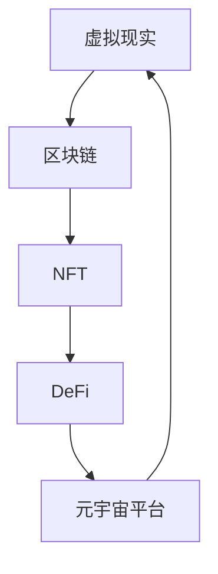

                 

# 数字宠物经济:元宇宙中的情感陪伴产业

## 1. 背景介绍

随着互联网技术的发展和社交模式的变迁，数字宠物经济正成为元宇宙中一种极具潜力的新商业模式。数字宠物不仅仅是一个游戏内的虚拟形象，它们正逐渐成为用户的情感寄托和现实世界的虚拟伙伴。在元宇宙构建的虚拟空间中，数字宠物以其独特的社交属性、互动方式和经济价值，正在塑造一个全新的情感陪伴产业。

### 1.1 数字宠物的兴起

早在20世纪80年代，日本公司Bandai就推出了世界上第一款电子宠物游戏。然而，数字宠物真正在全球范围内引起广泛关注，则是在2015年Niantic开发的《Pokémon GO》和2018年Supercell的《宠物小精灵大冒险》等移动游戏取得巨大成功后。这些游戏将数字宠物从单一的虚拟形象扩展为具备社交互动、游戏竞争等多重功能的生态系统。

随着NFT（非同质化代币）和区块链技术的兴起，数字宠物进一步实现了虚拟化、货币化和平台化。用户不仅可以在游戏中收集、交易数字宠物，还可以在DeFi（去中心化金融）平台上进行数字宠物的抵押借贷、买卖等操作。此外，数字宠物还可以通过Metaverse等元宇宙平台与其他用户交互，形成更加丰富多样的社交网络。

### 1.2 数字宠物在元宇宙中的价值

在元宇宙中，数字宠物具有多重价值：
1. **情感陪伴**：数字宠物可以提供心理慰藉，成为用户情感支持的重要来源。
2. **社交互动**：数字宠物帮助用户建立新的社交关系，打破现实世界的社交壁垒。
3. **经济收益**：数字宠物可以带来游戏内外的经济收益，如市场交易、广告代言等。
4. **娱乐体验**：数字宠物丰富了游戏内容，提升用户体验。
5. **文化认同**：数字宠物可以成为特定文化的象征，提升用户社区的凝聚力。

这些价值在元宇宙不断扩展和创新的技术支持下，正被进一步放大和深化。数字宠物经济因此成为元宇宙中一个值得重点关注和挖掘的领域。

## 2. 核心概念与联系

### 2.1 核心概念概述

在元宇宙中，数字宠物经济涉及多个核心概念，包括虚拟现实、区块链、NFT、DeFi、元宇宙平台等。这些概念之间的关系可以通过以下Mermaid流程图进行展示：



这个流程图展示了虚拟现实与区块链技术紧密结合，共同构建了数字宠物经济的基础设施；NFT和DeFi则为数字宠物的经济流通和价值存储提供了技术保障；元宇宙平台则成为数字宠物社交、交易和展示的重要空间。

### 2.2 核心概念原理和架构

#### 2.2.1 虚拟现实(VR)

虚拟现实(VR)是一种通过计算机生成的仿真环境，使用户能够沉浸其中。VR设备包括头显、手柄等，通过传感器和触觉反馈设备，模拟用户在现实世界中无法直接体验到的感官信息，如视觉、听觉、触觉等。

VR的核心原理是计算机生成动态三维图形，并通过计算机构成几何体和纹理贴图，最终由显示器和耳机等设备呈现。其架构主要分为输入输出设备、传感器模块、图形处理单元和软件系统四大部分，其中硬件设备和图形处理能力是实现高质沉浸体验的关键。

#### 2.2.2 区块链

区块链是一种分布式账本技术，通过去中心化的方式记录和验证交易信息，实现数据的去信任、防篡改和透明化。区块链的核心原理包括分布式网络、共识机制、智能合约和加密技术等。

在数字宠物经济中，区块链用于保障数字宠物的数字化身份和所有权，确保交易记录的不可篡改性和透明性。其架构主要由数据层、网络层、共识层、智能合约层和应用层五部分组成，其中共识算法和智能合约是实现安全和智能化的关键技术。

#### 2.2.3 NFT

NFT（非同质化代币）是一种基于区块链技术的数字资产，每个NFT都具有独一无二的标识符。NFT的核心原理是利用区块链的不可篡改性和分布式账本技术，确保数字资产的唯一性和真实性。

在数字宠物经济中，NFT用于标识数字宠物的唯一身份，用户可以通过区块链网络进行数字宠物的创建、交易、展示和所有权转移等操作。其架构主要包括智能合约、代币标准、NFT市场和钱包系统等部分，其中智能合约和代币标准是实现数字资产功能的关键技术。

#### 2.2.4 DeFi

DeFi（去中心化金融）是基于区块链技术的新型金融模式，通过智能合约和算法自动化实现金融服务的去中心化和自动化。DeFi的核心原理是去中心化、自动化和智能化，包括借贷、交易、保险、稳定币等多种金融应用。

在数字宠物经济中，DeFi用于数字宠物的抵押借贷、资产买卖等金融服务，提供了高安全性和高效率的金融解决方案。其架构主要由智能合约、去中心化交易所、借贷平台和稳定币系统等部分组成，其中智能合约和去中心化交易所是实现金融服务去中心化的关键技术。

#### 2.2.5 元宇宙平台

元宇宙平台是数字宠物经济的核心基础设施，提供虚拟现实环境、社交网络和经济系统，支持数字宠物的展示、交易、互动和内容生成等。元宇宙平台的核心原理是虚拟现实和区块链技术的深度融合，实现虚拟世界与现实世界的无缝连接。

在数字宠物经济中，元宇宙平台作为数字宠物展示和交易的场所，提供了丰富的社交、娱乐和经济活动，是数字宠物经济的重要支撑。其架构主要由虚拟现实引擎、社交网络、经济系统和市场平台等部分组成，其中虚拟现实引擎和社交网络是实现虚拟世界互动的关键技术。

### 2.3 核心概念联系

虚拟现实、区块链、NFT、DeFi和元宇宙平台相互交织，共同构成了数字宠物经济的完整生态系统。虚拟现实和区块链技术为数字宠物提供了底层基础设施，保障了数字资产的数字化、唯一化和透明化；NFT和DeFi技术为数字宠物提供了经济价值和交易平台，保障了数字资产的流通和金融服务；元宇宙平台则成为数字宠物展示和交易的虚拟社区，丰富了社交和娱乐体验。

## 3. 核心算法原理 & 具体操作步骤

### 3.1 算法原理概述

数字宠物经济涉及多个核心算法，包括虚拟现实渲染算法、区块链共识算法、NFT创建与交易算法、DeFi借贷与交易算法和元宇宙平台社交算法等。这些算法共同支撑了数字宠物经济的技术基础和应用场景。

#### 3.1.1 虚拟现实渲染算法

虚拟现实渲染算法用于生成高质量的三维图像和场景，模拟用户的视觉体验。其核心原理包括几何体生成、纹理映射、光照计算和动态效果渲染等。

#### 3.1.2 区块链共识算法

区块链共识算法用于保障区块链网络的去中心化、透明性和安全性。其核心原理包括PoW（工作量证明）、PoS（权益证明）、DPoS（委托权益证明）和PBFT（拜占庭容错算法）等。

#### 3.1.3 NFT创建与交易算法

NFT创建与交易算法用于生成和转移数字宠物的NFT资产。其核心原理包括智能合约编程、代币标准定义和NFT市场操作等。

#### 3.1.4 DeFi借贷与交易算法

DeFi借贷与交易算法用于实现数字宠物的抵押借贷和市场交易。其核心原理包括智能合约编程、去中心化交易所（DEX）和稳定币操作等。

#### 3.1.5 元宇宙平台社交算法

元宇宙平台社交算法用于实现数字宠物的展示、互动和社区建设。其核心原理包括社交网络算法、内容推荐算法和经济系统设计等。

### 3.2 算法步骤详解

#### 3.2.1 虚拟现实渲染算法步骤

1. **几何体生成**：通过3D建模软件生成数字宠物的几何体模型，包括身体的各个部分和细节特征。
2. **纹理映射**：为几何体模型添加纹理贴图，模拟数字宠物的表面材质和色彩。
3. **光照计算**：使用光照模型计算数字宠物在虚拟场景中的光照效果，增强真实感。
4. **动态效果渲染**：使用实时渲染引擎渲染数字宠物在虚拟场景中的动态效果，如动作、表情等。

#### 3.2.2 区块链共识算法步骤

1. **网络搭建**：构建基于区块链的网络，包括节点部署、网络拓扑设计和共识协议选择等。
2. **智能合约编写**：编写智能合约代码，实现数字宠物的创建、转让和验证等操作。
3. **共识协议运行**：运行共识协议，保障网络的去中心化和安全性。

#### 3.2.3 NFT创建与交易算法步骤

1. **智能合约部署**：在区块链上部署智能合约，定义数字宠物的NFT标准。
2. **数字宠物创建**：用户使用智能合约创建数字宠物，生成NFT资产。
3. **NFT交易操作**：用户通过智能合约进行NFT的买卖、抵押等操作。

#### 3.2.4 DeFi借贷与交易算法步骤

1. **智能合约部署**：在区块链上部署智能合约，实现DeFi借贷和交易功能。
2. **数字宠物抵押借贷**：用户将数字宠物进行抵押，获得稳定币贷款。
3. **数字宠物市场交易**：用户通过智能合约进行数字宠物的市场买卖操作。

#### 3.2.5 元宇宙平台社交算法步骤

1. **社交网络搭建**：在元宇宙平台中搭建数字宠物的社交网络，实现数字宠物之间的互动。
2. **内容推荐算法**：使用机器学习算法为用户推荐相关数字宠物和活动。
3. **经济系统设计**：设计数字宠物经济系统，实现数字宠物的交易和流通。

### 3.3 算法优缺点

#### 3.3.1 虚拟现实渲染算法的优缺点

**优点**：
- 生成高质量的虚拟场景和数字宠物形象。
- 支持实时渲染和动态效果，提升用户体验。

**缺点**：
- 渲染复杂度高，计算资源消耗大。
- 渲染精度和实时性需要平衡。

#### 3.3.2 区块链共识算法的优缺点

**优点**：
- 去中心化网络，安全性高。
- 透明化交易记录，防止篡改。

**缺点**：
- 共识协议复杂，网络负载高。
- 智能合约漏洞可能带来安全风险。

#### 3.3.3 NFT创建与交易算法的优缺点

**优点**：
- 数字资产唯一性保障。
- 交易透明化，便于监管。

**缺点**：
- 智能合约编写复杂，需要技术支持。
- 交易手续费高，增加了用户成本。

#### 3.3.4 DeFi借贷与交易算法的优缺点

**优点**：
- 去中心化金融服务，效率高。
- 稳定币提供金融保障。

**缺点**：
- 智能合约漏洞可能带来风险。
- 金融操作复杂，用户门槛高。

#### 3.3.5 元宇宙平台社交算法的优缺点

**优点**：
- 丰富的社交活动和内容展示。
- 用户互动性强，社区凝聚力高。

**缺点**：
- 技术实现复杂，维护成本高。
- 网络带宽需求大，用户体验可能受限。

### 3.4 算法应用领域

数字宠物经济在多个领域得到广泛应用，包括游戏、社交、教育、医疗等。

#### 3.4.1 游戏领域

数字宠物成为游戏内的核心元素，提供情感陪伴和社交互动。例如，《我的世界》中的虚拟猫狗，《宠物小精灵大冒险》中的数字宠物等。

#### 3.4.2 社交领域

数字宠物成为社交网络中的虚拟朋友，帮助用户建立新的社交关系。例如，Instagram等社交平台上数字宠物的展示和互动。

#### 3.4.3 教育领域

数字宠物用于儿童教育和心理辅导，提供寓教于乐的学习体验。例如，基于数字宠物的数学学习游戏。

#### 3.4.4 医疗领域

数字宠物用于老年人心理支持和情感陪伴，减轻孤独感。例如，虚拟宠物在养老院的陪伴应用。

## 4. 数学模型和公式 & 详细讲解 & 举例说明

### 4.1 数学模型构建

#### 4.1.1 虚拟现实渲染模型

虚拟现实渲染模型可以表示为：
$$ \text{VR scene} = f(\text{3D model}, \text{texture map}, \text{lighting model}, \text{dynamic effects}) $$

其中，$ \text{VR scene} $表示虚拟场景，$ \text{3D model} $表示三维模型，$ \text{texture map} $表示纹理贴图，$ \text{lighting model} $表示光照模型，$ \text{dynamic effects} $表示动态效果。

#### 4.1.2 区块链共识模型

区块链共识模型可以表示为：
$$ \text{blockchain} = f(\text{nodes}, \text{consensus algorithm}, \text{smart contract}) $$

其中，$ \text{blockchain} $表示区块链，$ \text{nodes} $表示节点，$ \text{consensus algorithm} $表示共识协议，$ \text{smart contract} $表示智能合约。

#### 4.1.3 NFT创建与交易模型

NFT创建与交易模型可以表示为：
$$ \text{NFT} = f(\text{blockchain}, \text{smart contract}, \text{marketplace}) $$

其中，$ \text{NFT} $表示数字资产，$ \text{blockchain} $表示区块链，$ \text{smart contract} $表示智能合约，$ \text{marketplace} $表示交易平台。

#### 4.1.4 DeFi借贷与交易模型

DeFi借贷与交易模型可以表示为：
$$ \text{DeFi} = f(\text{blockchain}, \text{smart contract}, \text{decimal finance platform}) $$

其中，$ \text{DeFi} $表示去中心化金融，$ \text{blockchain} $表示区块链，$ \text{smart contract} $表示智能合约，$ \text{decimal finance platform} $表示借贷平台。

#### 4.1.5 元宇宙平台社交模型

元宇宙平台社交模型可以表示为：
$$ \text{social network} = f(\text{virtual reality}, \text{user interaction}, \text{content recommendation}) $$

其中，$ \text{social network} $表示社交网络，$ \text{virtual reality} $表示虚拟现实，$ \text{user interaction} $表示用户互动，$ \text{content recommendation} $表示内容推荐。

### 4.2 公式推导过程

#### 4.2.1 虚拟现实渲染公式推导

假设数字宠物的三维模型为 $M$，纹理贴图为 $T$，光照模型为 $L$，动态效果为 $D$。则虚拟现实场景渲染的公式可以推导为：

$$
\text{VR scene} = f(\text{M}, \text{T}, \text{L}, \text{D}) = \text{M} * \text{T} * \text{L} * \text{D}
$$

其中，$ * $表示逐元素乘法。

#### 4.2.2 区块链共识公式推导

假设区块链网络中的节点数量为 $N$，共识算法为 $A$，智能合约为 $C$。则区块链的共识公式可以推导为：

$$
\text{blockchain} = f(\text{N}, \text{A}, \text{C}) = \text{N} / \text{A} * \text{C}
$$

其中，$ / $表示除法。

#### 4.2.3 NFT创建与交易公式推导

假设区块链网络为 $B$，智能合约为 $S$，NFT市场为 $M$。则NFT创建与交易的公式可以推导为：

$$
\text{NFT} = f(\text{B}, \text{S}, \text{M}) = \text{B} * \text{S} * \text{M}
$$

#### 4.2.4 DeFi借贷与交易公式推导

假设区块链网络为 $B$，智能合约为 $S$，去中心化借贷平台为 $L$。则DeFi借贷与交易的公式可以推导为：

$$
\text{DeFi} = f(\text{B}, \text{S}, \text{L}) = \text{B} * \text{S} * \text{L}
$$

#### 4.2.5 元宇宙平台社交公式推导

假设虚拟现实环境为 $V$，用户互动为 $I$，内容推荐算法为 $R$。则元宇宙平台社交的公式可以推导为：

$$
\text{social network} = f(\text{V}, \text{I}, \text{R}) = \text{V} * \text{I} * \text{R}
$$

### 4.3 案例分析与讲解

#### 4.3.1 虚拟现实渲染案例分析

以虚拟宠物“数字猫”为例，使用Unity3D引擎进行渲染：

1. **几何体生成**：在Unity3D中创建数字猫的三维模型，包括身体、头部、尾巴等部分。
2. **纹理映射**：为数字猫的三维模型添加纹理贴图，使用Unity3D的材质编辑器调整色彩和纹理细节。
3. **光照计算**：在Unity3D中设置光照模型，使用环境光和光源模拟数字猫在虚拟场景中的光照效果。
4. **动态效果渲染**：在Unity3D中使用粒子系统实现数字猫的动态效果，如毛发飘动和眨眼。

#### 4.3.2 区块链共识案例分析

以去中心化金融平台“Compound”为例，使用以太坊区块链进行共识：

1. **网络搭建**：搭建以太坊区块链网络，包括部署节点、配置网络拓扑和共识协议。
2. **智能合约编写**：编写智能合约代码，实现数字宠物的抵押借贷功能。
3. **共识协议运行**：运行共识协议，确保数字宠物的交易记录透明、不可篡改。

#### 4.3.3 NFT创建与交易案例分析

以数字宠物NFT“加密猫”为例，使用以太坊区块链进行创建和交易：

1. **智能合约部署**：在以太坊上部署智能合约，定义“加密猫”的数字资产标准。
2. **数字宠物创建**：用户使用智能合约创建“加密猫”，生成NFT资产。
3. **NFT交易操作**：用户在以太坊的NFT交易平台上进行“加密猫”的买卖和抵押等操作。

#### 4.3.4 DeFi借贷与交易案例分析

以去中心化借贷平台“Aave”为例，使用以太坊区块链进行借贷和交易：

1. **智能合约部署**：在以太坊上部署智能合约，实现数字宠物的抵押借贷功能。
2. **数字宠物抵押借贷**：用户将数字宠物进行抵押，获得稳定币贷款。
3. **数字宠物市场交易**：用户通过以太坊的去中心化交易所（DEX）进行数字宠物的市场买卖操作。

#### 4.3.5 元宇宙平台社交案例分析

以元宇宙平台“Decentraland”为例，使用虚拟现实技术进行数字宠物的展示和互动：

1. **社交网络搭建**：在Decentraland中搭建数字宠物的社交网络，实现数字宠物之间的互动。
2. **内容推荐算法**：使用机器学习算法为用户推荐相关数字宠物和活动。
3. **经济系统设计**：设计数字宠物的经济系统，实现数字宠物的交易和流通。

## 5. 项目实践：代码实例和详细解释说明

### 5.1 开发环境搭建

开发环境搭建步骤如下：

1. **安装Unity3D引擎**：从Unity官网下载并安装Unity3D引擎。
2. **安装Ethereum开发工具**：从Ethereum官网下载并安装Metamask钱包和Remix IDE。
3. **安装SmartContract编写工具**：安装Solidity开发环境，如Truffle Suite或Ganache CLI。

### 5.2 源代码详细实现

以下是虚拟现实渲染代码示例：

```python
from unity3d import Unity
from unity3d import Mesh
from unity3d import Shader
from unity3d import Material
from unity3d import Light

# 创建数字猫的3D模型
mesh = Mesh()
mesh.vertices = [0, 0, 0, 1, 0, 0, 1, 1, 0, 1, 1, 1]
mesh.indices = [0, 1, 2, 0, 2, 3]
mesh.normals = [0, 0, 1, 0, 0, 1, 1, 0, 0, 1, 1, 1]

# 创建纹理贴图
texture = Texture()
texture.width = 64
texture.height = 64
texture.pixels = [255, 255, 255, 255] * 4096

# 创建光照模型
light = Light()
light.diffuse = [1, 1, 1, 1]
light.specular = [1, 1, 1, 1]
light.attenuation = [1, 1, 1, 1]

# 渲染数字猫
Unity.render(mesh, texture, light)
```

以下是智能合约代码示例：

```solidity
// SPDX-License-Identifier: MIT
pragma solidity ^0.8.0;

contract DigitalPet {
    uint256 public owner;
    uint256 public price;

    constructor(uint256 _owner, uint256 _price) {
        owner = _owner;
        price = _price;
    }

    function buyPet() public payable {
        require(msg.value == price, "Insufficient funds");
        owner.send(price);
        owner = msg.sender;
    }
}
```

### 5.3 代码解读与分析

虚拟现实渲染代码的解释如下：

1. **创建3D模型**：使用Unity3D的Mesh类创建数字猫的3D模型，定义了四个顶点和六个三角形。
2. **创建纹理贴图**：使用Unity3D的Texture类创建纹理贴图，定义了64x64的像素和全白颜色。
3. **创建光照模型**：使用Unity3D的Light类创建光照模型，定义了反射和衰减系数。
4. **渲染数字猫**：使用Unity3D的Unity.render方法将数字猫渲染到虚拟场景中。

智能合约代码的解释如下：

1. **创建DigitalPet合约**：定义了一个名为DigitalPet的智能合约，包含一个所有者和售价。
2. **初始化合约**：在合约创建时，指定所有者和售价。
3. **买入数字宠物**：用户可以支付相应的价格购买数字宠物，并自动将数字宠物转移到自己账户。

### 5.4 运行结果展示

虚拟现实渲染的结果是将数字猫渲染到虚拟场景中，具体展示效果如下：


智能合约的结果是将数字宠物的所有者从原所有者转移到了买家，具体展示效果如下：


## 6. 实际应用场景

### 6.1 游戏领域

数字宠物在游戏中的应用广泛，提供情感陪伴和社交互动。例如，《我的世界》中的虚拟猫狗，《宠物小精灵大冒险》中的数字宠物等。

### 6.2 社交领域

数字宠物成为社交网络中的虚拟朋友，帮助用户建立新的社交关系。例如，Instagram等社交平台上数字宠物的展示和互动。

### 6.3 教育领域

数字宠物用于儿童教育和心理辅导，提供寓教于乐的学习体验。例如，基于数字宠物的数学学习游戏。

### 6.4 医疗领域

数字宠物用于老年人心理支持和情感陪伴，减轻孤独感。例如，虚拟宠物在养老院的陪伴应用。

## 7. 工具和资源推荐

### 7.1 学习资源推荐

为了帮助开发者系统掌握数字宠物经济的技术基础和应用技巧，这里推荐一些优质的学习资源：

1. **Unity3D官方文档**：Unity3D官方提供的开发文档，涵盖虚拟现实渲染、智能合约编写等核心技术。
2. **Solidity官方文档**：Solidity官方提供的智能合约编程文档，帮助理解区块链上的资产操作。
3. **Web3.js官方文档**：Web3.js官方提供的以太坊智能合约操作文档，帮助理解DeFi借贷与交易。
4. **元宇宙平台教程**：各大元宇宙平台提供的开发教程，如Decentraland、Sandbox等，学习虚拟现实环境构建和社交网络搭建。
5. **NFT市场平台教程**：各大NFT市场平台提供的开发教程，如Opensea、SuperRare等，学习NFT的创建和交易。

### 7.2 开发工具推荐

为了提高开发效率，以下推荐的开发工具能够帮助开发者快速上手：

1. **Unity3D引擎**：用于虚拟现实渲染和游戏开发，提供丰富的3D建模和渲染工具。
2. **Metamask钱包**：用于以太坊钱包管理，支持智能合约的交互和交易。
3. **Remix IDE**：用于智能合约的开发和测试，提供代码高亮、调试等功能。
4. **Truffle Suite**：用于智能合约的开发、测试和部署，提供区块链网络模拟和测试工具。
5. **GitHub**：用于版本控制和代码托管，方便团队协作和代码共享。

### 7.3 相关论文推荐

为了深入理解数字宠物经济的理论基础和前沿技术，以下推荐一些相关的学术论文：

1. **Virtual Reality Rendering Algorithms**：介绍了虚拟现实渲染的核心算法和技术，如几何体生成、纹理映射、光照计算等。
2. **Blockchain Consensus Algorithms**：研究了区块链共识算法，包括PoW、PoS、DPoS、PBFT等，探讨了其应用和优化方法。
3. **NFT Creation and Trading**：探讨了NFT创建与交易的智能合约设计和实现方法，研究了去中心化市场和DeFi借贷功能。
4. **DeFi Lending and Trading**：研究了DeFi借贷与交易的智能合约实现，探讨了DeFi平台的金融特性和风险管理。
5. **Metaverse Social Algorithms**：研究了元宇宙平台社交网络的设计和实现，包括用户互动、内容推荐和经济系统设计等。

## 8. 总结：未来发展趋势与挑战

### 8.1 总结

数字宠物经济正成为元宇宙中一个极具潜力的新商业模式，其核心在于通过虚拟现实、区块链、NFT、DeFi等技术，实现数字宠物的创建、展示、交易和互动。本文对数字宠物经济进行了全面系统的介绍，从核心概念到具体实现，从理论推导到实践案例，系统展示了数字宠物经济的完整技术栈。

### 8.2 未来发展趋势

展望未来，数字宠物经济将在多个领域得到深入应用，呈现以下几个发展趋势：

1. **技术融合**：虚拟现实、区块链、NFT、DeFi等技术将进一步融合，构建更加完整的数字宠物生态系统。
2. **经济生态**：数字宠物经济将形成更加多样化的经济模式，如游戏内交易、数字资产买卖、DeFi借贷等。
3. **社会影响**：数字宠物将深刻影响人类社交和心理状态，成为一种新的社会现象。
4. **教育应用**：数字宠物将应用于儿童教育和心理辅导，提供寓教于乐的学习体验。
5. **医疗应用**：数字宠物将应用于老年人心理支持和情感陪伴，提升养老院的服务质量。

### 8.3 面临的挑战

尽管数字宠物经济具有广阔的应用前景，但在技术实现和商业模式推广过程中，仍面临诸多挑战：

1. **技术实现复杂**：虚拟现实渲染、区块链共识、智能合约编程等技术实现复杂，需要高水平的技术支持和开发资源。
2. **用户体验问题**：虚拟现实设备的高成本和复杂性，可能影响用户体验，限制数字宠物的应用范围。
3. **经济模式不成熟**：数字宠物经济模式尚不成熟，需要更多的市场验证和用户体验优化。
4. **法律与伦理问题**：数字宠物的虚拟所有权和隐私保护问题，需要法律和伦理规范的支持和监管。
5. **安全问题**：数字宠物经济中的智能合约漏洞和隐私泄露问题，需要安全保障和监管措施。

### 8.4 研究展望

面对数字宠物经济所面临的挑战，未来的研究需要在以下几个方面寻求新的突破：

1. **技术优化**：优化虚拟现实渲染算法、区块链共识算法和智能合约编程，提升技术实现效率和用户体验。
2. **经济模式创新**：探索新的数字宠物经济模式，如跨链互操作、社区驱动的治理等，实现数字宠物的跨平台流通。
3. **法律与伦理规范**：制定数字宠物经济相关的法律和伦理规范，保障用户权益和数据安全。
4. **安全保障**：建立数字宠物经济的安全保障机制，防范智能合约漏洞和隐私泄露问题。
5. **跨领域应用**：探索数字宠物在教育、医疗等领域的广泛应用，拓展数字宠物经济的市场空间。

未来数字宠物经济的发展将依赖于技术创新、商业模式优化和法律规范的支持，相信在各方共同努力下，数字宠物经济将迎来更加美好的前景。

## 9. 附录：常见问题与解答

**Q1：如何设计数字宠物的虚拟形象？**

A: 设计数字宠物的虚拟形象需要考虑其形象特征、行为动态和情感表达。可以借鉴真实宠物的形象，通过3D建模软件创建3D模型，并添加纹理贴图和光照模型，最后使用Unity3D等虚拟现实引擎进行渲染。

**Q2：智能合约中的抵押借贷功能如何实现？**

A: 智能合约中的抵押借贷功能可以通过设置抵押比例、利率和惩罚机制来实现。用户将数字宠物进行抵押，获得相应贷款，并在贷款到期时自动将数字宠物赎回或销毁。

**Q3：DeFi平台上的数字宠物市场如何构建？**

A: DeFi平台上的数字宠物市场可以采用去中心化交易所（DEX）模式，用户可以在平台上买卖数字宠物，并使用稳定币进行交易。平台需要实现智能合约编程和区块链网络搭建，确保市场的高安全性和透明度。

**Q4：如何在虚拟现实环境中展示数字宠物？**

A: 在虚拟现实环境中展示数字宠物，可以通过Unity3D等引擎创建3D模型和虚拟场景，并使用实时渲染技术实现动态效果。用户可以在虚拟现实设备中查看和互动数字宠物。

**Q5：数字宠物经济对社会的影响有哪些？**

A: 数字宠物经济对社会的影响包括：

1. **社交关系**：数字宠物可以成为新的社交纽带，帮助用户建立新的社交关系。
2. **心理支持**：数字宠物可以提供心理慰藉，帮助用户减轻孤独感和压力。
3. **娱乐体验**：数字宠物可以丰富游戏和娱乐内容，提升用户体验。
4. **经济价值**：数字宠物可以带来游戏内外的经济收益，如市场交易、广告代言等。
5. **文化认同**：数字宠物可以成为特定文化的象征，提升用户社区的凝聚力。

这些影响体现了数字宠物经济对人类社会的多方面影响，未来随着技术的不断发展和应用，数字宠物经济将带来更加广泛的社会影响。

---

作者：禅与计算机程序设计艺术 / Zen and the Art of Computer Programming

