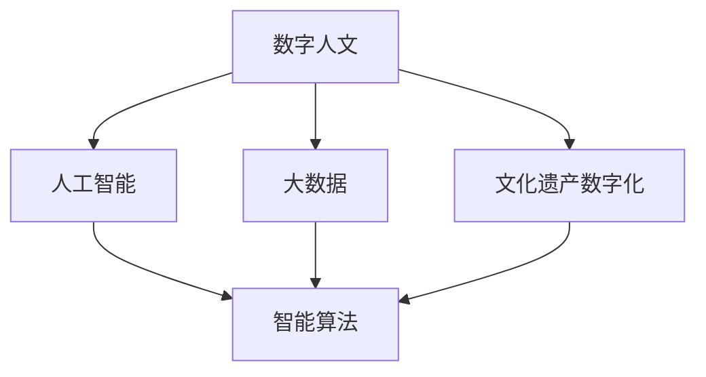

                 

# 数字时代的人文精神的传承

> 关键词：数字人文, 人工智能, 数据科学与艺术, 文化遗产数字化, 智能算法, 学术研究, 公共教育

## 1. 背景介绍

### 1.1 问题由来
在飞速发展的数字时代，人工智能、大数据和互联网技术的融合，为各个领域带来了巨大的变革。然而，在这波技术浪潮中，技术的快速迭代和商业化的急切追求，似乎忽略了我们人类自身的文化传承与精神追求。数字化虽然便利了我们的生活，但如何让人类宝贵的文化财富得到妥善保存，并在这数字化的环境中得以流传，成了一项迫切的任务。

在这样的大背景下，数字人文应运而生，它通过将数字技术与人文学科紧密结合，不仅促进了知识与文化的研究、保护和传播，同时也为人工智能与大数据在人文科学领域的应用开辟了新的路径。本文将聚焦于数字人文与人工智能的结合，探讨如何在数字时代传承和发扬人类宝贵的人文精神。

### 1.2 问题核心关键点
数字人文的核心理念是将数字化技术应用于人类学、历史学、文学、艺术学等传统人文学科，以求得更全面、更深层次的学术研究。在具体应用中，数字人文面临着诸多挑战，如数据质量问题、隐私保护、算法伦理等，需要通过人工智能等前沿技术来解决。

本文将从理论到实践，系统阐述数字人文与人工智能的结合，揭示其在文化遗产数字化、智能算法开发、学术研究与公共教育等多个方面的应用潜力。通过深入探讨这些关键点，我们希望能为数字时代的人文精神传承提供一些可行的技术路径。

### 1.3 问题研究意义
数字人文与人工智能的结合，不仅是技术与科学的进步，更是对人类文化传承与精神追求的深远反思。通过这一结合，我们能：
- 更好地保存和传承人类文化遗产，避免数字化进程中的文化遗失。
- 利用数据科学和智能算法，深化对人文现象的认识，拓展人类智慧的边界。
- 推动跨学科交流与合作，促进知识与文化的交流与融合。

本文旨在系统地探讨这一结合的原理、方法与实践，为数字时代的人文精神传承贡献技术智慧。

## 2. 核心概念与联系

### 2.1 核心概念概述

为更好地理解数字人文与人工智能的结合，我们需要梳理几个关键概念：

- 数字人文(Digital Humanities, DH)：通过数字化技术处理和分析人文学科数据，促进跨学科交流与合作。
- 人工智能(Artificial Intelligence, AI)：模拟人脑的智能行为，实现自主学习、决策等能力。
- 大数据(Big Data)：海量、多样化的数据集，通过分析可以发现潜在的知识与规律。
- 文化遗产数字化(Cultural Heritage Digitalization)：利用数字技术保护和传播人类文化遗产。
- 智能算法(Intelligent Algorithm)：通过人工智能技术，开发可自动化处理复杂问题的算法。

这些概念之间存在着紧密的联系，通过数字化技术处理大量的人文数据，并利用人工智能算法进行分析和处理，可以极大地提升对人类文化现象的理解和研究。

### 2.2 核心概念原理和架构的 Mermaid 流程图(Mermaid 流程节点中不要有括号、逗号等特殊字符)


这个流程图展示了数字人文、大数据、人工智能、智能算法和文化遗产数字化之间相互依存的关系。数字人文需要依赖大数据的支撑，而人工智能算法在数据处理中扮演了关键角色。文化遗产数字化则是在这一过程中产生大量人文数据，并通过智能算法进行分析和研究。

## 3. 核心算法原理 & 具体操作步骤
### 3.1 算法原理概述

数字人文与人工智能结合的核心在于，利用智能算法处理和分析人文数据，从而提升对人类文化现象的理解和研究。这一过程通常包括以下几个关键步骤：

1. **数据收集与预处理**：收集海量的人文数据，如历史文献、艺术品图像、社会调查数据等，并进行清洗和标准化。
2. **特征提取与模型训练**：利用智能算法从数据中提取关键特征，训练模型以识别和分类文本、图像等数据。
3. **结果验证与分析**：通过交叉验证、误差分析等方式，评估模型的效果，并进行更深层次的分析。
4. **可视化与解释**：将模型结果可视化，并进行人文学者的解读，以增强理解和教育传播。

### 3.2 算法步骤详解

#### 步骤1: 数据收集与预处理

数据收集是数字人文与人工智能结合的第一步。这一步骤通常包括：

- **数据来源**：选择合适的数据集，如博物馆数字化藏品、文学作品数据库、历史档案等。
- **数据清洗**：对数据进行去重、纠错、格式统一等预处理，确保数据质量。

#### 步骤2: 特征提取与模型训练

特征提取是数据处理的关键环节，包括：

- **文本处理**：对文本数据进行分词、词性标注、命名实体识别等处理。
- **图像处理**：对图像数据进行二值化、边缘检测、特征提取等处理。
- **模型训练**：利用机器学习算法，如自然语言处理(NLP)、计算机视觉(CV)等，对特征进行训练，形成模型。

#### 步骤3: 结果验证与分析

验证与分析环节，包括：

- **交叉验证**：通过多组训练集和测试集的交叉验证，评估模型的泛化能力。
- **误差分析**：分析模型预测误差，优化模型参数。
- **效果评估**：使用各类评价指标，如准确率、召回率、F1分数等，评估模型性能。

#### 步骤4: 可视化与解释

最终，将模型结果进行可视化，生成图表、动画、交互界面等，供人文学者进行解读和传播。这一步骤包括以下：

- **图表生成**：利用Matplotlib、Seaborn等库，生成条形图、折线图、散点图等。
- **动画制作**：利用Pygame、matplotlib动画库，生成动态视觉效果。
- **交互界面**：利用D3.js、React等库，构建交互式数据展示平台。

### 3.3 算法优缺点

数字人文与人工智能结合具有以下优点：
- **数据量庞大**：大数据技术能够处理海量的人文数据，挖掘其深层次的信息。
- **分析效率高**：智能算法能够快速高效地分析数据，发现隐藏的知识与规律。
- **跨学科合作**：促进了不同学科的交流与合作，拓宽了研究视野。

然而，这一结合也存在一些缺点：
- **数据质量**：人文数据质量参差不齐，可能会影响结果的准确性。
- **算法伦理**：智能算法的决策过程可能缺乏透明性，存在伦理风险。
- **技术门槛高**：需要掌握多领域知识，技术门槛较高。

### 3.4 算法应用领域

数字人文与人工智能的结合，已经在多个领域取得了应用：

- **文化遗产数字化**：通过数字化技术保存和展示历史文物、艺术品等，如敦煌研究院的数字壁画、故宫博物院的虚拟展览等。
- **文学研究**：利用NLP技术对文学作品进行情感分析、主题分析、人物关系分析等。
- **历史研究**：通过历史档案数字化和文本挖掘，研究历史事件、社会变迁等。
- **艺术分析**：利用CV技术对艺术品进行分析，识别艺术风格、作者等。
- **公共教育**：开发在线教育平台，利用AI进行个性化教学，增强教育效果。

## 4. 数学模型和公式 & 详细讲解 & 举例说明

### 4.1 数学模型构建

数字人文与人工智能的结合，通常使用以下数学模型：

- **文本模型**：如N-gram模型、LSTM、Transformer等，用于处理和分析文本数据。
- **图像模型**：如CNN、ResNet、YOLO等，用于处理和分析图像数据。
- **知识图谱模型**：如GNN、KG2Vec等，用于处理和分析复杂的知识网络。

### 4.2 公式推导过程

以文本分类模型为例，介绍其推导过程。

假设文本为$x=\{x_1, x_2, ..., x_n\}$，分类标签为$y=\{y_1, y_2, ..., y_n\}$。分类模型为$f(x; \theta) = softmax(Wx + b)$，其中$W$和$b$为模型参数。

分类任务的目标函数为交叉熵损失函数：

$$
L(\theta) = -\frac{1}{N} \sum_{i=1}^N \sum_{j=1}^C y_{ij} \log f(x_j; \theta)
$$

其中$N$为样本数，$C$为类别数。

通过梯度下降等优化算法，最小化损失函数，更新模型参数$\theta$，即可得到文本分类模型。

### 4.3 案例分析与讲解

以敦煌研究院的数字壁画为例，分析其数字化的过程和应用。

敦煌研究院利用数字技术对壁画进行了数字化，形成了高分辨率的数字图像。利用CV技术，对图像进行了边缘检测、纹理分析等处理，提取了壁画特征。通过训练深度学习模型，识别出了壁画中的场景、人物、颜色等关键信息。这些信息被整合到数据库中，供研究者和公众查询和使用。通过AR技术，用户可以在虚拟环境中查看壁画细节，体验虚拟导览，增强了壁画的历史和文化教育价值。

## 5. 项目实践：代码实例和详细解释说明

### 5.1 开发环境搭建

在开发数字人文与人工智能结合项目时，我们需要以下开发环境：

- **Python**：作为主要开发语言，具有丰富的库和框架支持。
- **Jupyter Notebook**：交互式开发环境，便于数据处理和模型训练。
- **Git**：版本控制工具，方便团队协作与代码管理。
- **Docker**：容器化技术，便于模型部署与数据管理。

安装上述工具的步骤如下：

```bash
# Python
pip install pip
pip install numpy pandas scikit-learn tensorflow keras matplotlib

# Jupyter Notebook
pip install jupyterlab

# Git
git install

# Docker
docker pull tensorflow/tensorflow
```

### 5.2 源代码详细实现

以敦煌壁画数字化为例，展示Python代码的实现。

```python
import cv2
import numpy as np
from skimage import io
from tensorflow.keras.applications import resnet50

# 加载图像
img = cv2.imread('dunhuang_wall.jpg')

# 图像预处理
img = cv2.cvtColor(img, cv2.COLOR_BGR2RGB)
img = cv2.resize(img, (224, 224))
img = img / 255

# 加载预训练模型
model = resnet50.ResNet50(weights='imagenet', include_top=False)
model.load_weights('resnet50_weights.h5')

# 提取特征
features = model.predict(img)

# 可视化特征
import matplotlib.pyplot as plt
plt.imshow(np.around(features, decimals=2))
plt.show()
```

### 5.3 代码解读与分析

上述代码实现了使用ResNet50模型对敦煌壁画图像进行特征提取，并通过可视化展示特征结果。

- **图像预处理**：将图像转换为RGB格式，并进行大小归一化，以便于模型处理。
- **模型加载**：加载预训练的ResNet50模型，并设置不包含顶层分类器。
- **特征提取**：使用模型对图像进行特征提取。
- **特征可视化**：将特征结果可视化，生成特征图。

## 6. 实际应用场景

### 6.1 数字文化遗产保护

数字人文与人工智能的结合，对文化遗产的保护和传承起到了重要的作用。例如，通过数字技术保存和展示敦煌壁画、故宫博物院的数字化文物等，使得这些珍贵的文化遗产得以广泛传播，避免了自然老化和人为损坏。

### 6.2 文学研究与创作

文学研究与创作是数字人文的重要领域之一。利用NLP技术，可以对经典文学作品进行情感分析、主题分析、人物关系分析等，从而深化对文学作品的理解。同时，人工智能生成的文本，如基于GPT-3的创作，也为文学创作提供了新的可能性。

### 6.3 历史研究与教育

通过数字化和文本挖掘技术，可以对历史档案进行快速处理和分析，发现历史事件的规律和背景。例如，利用NLP技术对历史文献进行文本分类、实体识别等处理，揭示历史事件的关键信息。同时，人工智能生成的历史故事、模拟对话等，也能为历史教育带来新的方法和工具。

### 6.4 未来应用展望

数字人文与人工智能的未来应用前景广阔，包括：

- **智慧博物馆**：通过智能导览、虚拟重建等技术，增强博物馆的教育与传播功能。
- **跨学科研究**：促进历史、文学、艺术等领域的深度融合，推动跨学科研究的发展。
- **虚拟历史重现**：利用VR、AR等技术，重建历史场景，提供沉浸式学习体验。
- **人机协同创作**：通过人机协作，提升文学、艺术等创作的创新性和多样性。

## 7. 工具和资源推荐

### 7.1 学习资源推荐

1. **数字人文与人工智能课程**：如MIT的"Introduction to Computer Science and Programming Using Python"课程，涵盖Python编程和人工智能基础。
2. **机器学习与深度学习课程**：如Coursera的"Deep Learning Specialization"课程，深入讲解深度学习模型与应用。
3. **文化遗产数字化项目**：如敦煌研究院的"数字敦煌"项目，展示数字化的实践案例和经验。
4. **学术期刊与会议**：如Digital Humanities Quarterly、International Conference on Digital Humanities，分享最新的研究成果。

### 7.2 开发工具推荐

1. **Python开发环境**：如Anaconda、PyCharm等，提供丰富的开发工具和库支持。
2. **数据处理库**：如Pandas、NumPy、Scikit-learn等，方便数据处理和分析。
3. **可视化库**：如Matplotlib、Seaborn、D3.js等，支持图表、动画、交互界面等可视化形式。
4. **机器学习库**：如TensorFlow、Keras、PyTorch等，支持深度学习模型的开发和训练。

### 7.3 相关论文推荐

1. **数字人文与人工智能**：如"Digital Humanities: A New Perspective on the Digital Age"，探讨数字人文的发展前景与应用。
2. **文化遗产数字化**：如"Digital Preservation of Cultural Heritage: An Overview"，介绍文化遗产数字化的实践与挑战。
3. **AI与文学创作**：如"Generative Models in Literary Studies"，讨论AI在文学创作中的应用。
4. **历史研究与AI**：如"Using Machine Learning to Study Historical Texts"，展示AI在历史研究中的应用案例。

## 8. 总结：未来发展趋势与挑战

### 8.1 研究成果总结

数字人文与人工智能的结合，不仅推动了文化遗产的保护和传播，也促进了跨学科的研究与教育。这一结合已经在多个领域取得了显著成果，为文化传承与教育提供了新的工具和方法。

### 8.2 未来发展趋势

未来，数字人文与人工智能将持续深入融合，主要趋势包括：

1. **多模态融合**：将文本、图像、音频等多模态数据结合，提升对人文现象的理解。
2. **知识图谱构建**：利用知识图谱技术，构建复杂的人文知识网络，增强研究深度。
3. **交互式平台**：开发交互式平台，提供沉浸式学习体验，增强用户参与度。
4. **跨文化研究**：推动跨文化研究，促进不同文化间的交流与理解。
5. **伦理与法律规范**：制定数字人文与人工智能结合的伦理与法律规范，确保数据与算法的透明性与公正性。

### 8.3 面临的挑战

尽管数字人文与人工智能的结合带来了许多机遇，但也面临着一些挑战：

1. **数据质量问题**：人文数据质量参差不齐，可能影响研究结果的准确性。
2. **算法伦理问题**：智能算法的决策过程缺乏透明性，存在伦理风险。
3. **技术门槛高**：需要掌握多领域知识，技术门槛较高。
4. **跨学科合作**：不同学科间的交流与合作需要时间和资源投入。

### 8.4 研究展望

未来，需要在以下几个方面进行深入研究：

1. **数据治理**：建立数据治理机制，确保数据质量与隐私保护。
2. **算法透明性**：提升算法透明度，确保决策过程的公正性与透明性。
3. **跨学科合作**：促进跨学科交流与合作，推动研究深度与广度。
4. **技术创新**：开发新的技术和方法，提升数字人文与人工智能结合的效果。

## 9. 附录：常见问题与解答

**Q1: 数字人文与人工智能结合的目的是什么？**

A: 数字人文与人工智能结合的目的是通过数字化技术处理和分析人文学科数据，提升对人类文化现象的理解和研究，促进文化遗产的保护与传承，推动跨学科的交流与合作。

**Q2: 数字人文与人工智能结合面临的主要挑战是什么？**

A: 数字人文与人工智能结合面临的主要挑战包括数据质量问题、算法伦理问题、技术门槛高、跨学科合作等。

**Q3: 数字人文与人工智能结合的未来发展趋势是什么？**

A: 数字人文与人工智能结合的未来发展趋势包括多模态融合、知识图谱构建、交互式平台、跨文化研究、伦理与法律规范等。

**Q4: 如何提升数字人文与人工智能结合的算法透明度？**

A: 提升算法透明度的方法包括建立算法解释机制、提供算法决策路径、引入第三方评估等。

**Q5: 数字人文与人工智能结合在文化遗产保护方面有哪些应用？**

A: 数字人文与人工智能结合在文化遗产保护方面的应用包括数字壁画保存与展示、数字化文物管理、虚拟重建等。

---

作者：禅与计算机程序设计艺术 / Zen and the Art of Computer Programming

