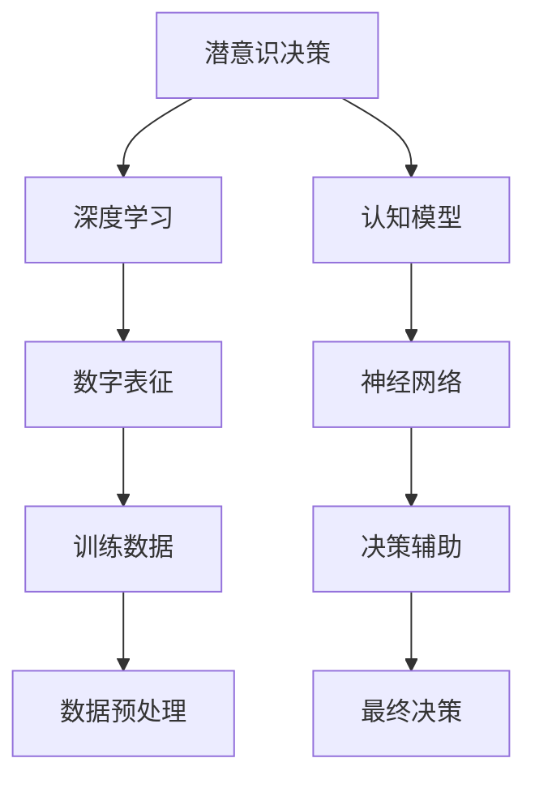

                 

# 数字直觉训练法：AI辅助的潜意识决策强化

> 关键词：数字直觉, AI辅助决策, 潜意识强化, 深度学习, 数字表征, 认知模型, 案例分析, 实践指南

## 1. 背景介绍

### 1.1 问题由来
在当今信息爆炸的时代，数据量呈指数级增长，决策的复杂性也随之增加。许多专业人士，尤其是金融、商业、医疗等领域的决策者，面临着在大量数据中迅速做出准确决策的挑战。传统的决策方式往往依赖经验和直觉，但在数据复杂性不断上升的背景下，这种依赖显得捉襟见肘。

为了应对这一挑战，AI技术尤其是深度学习的发展提供了一种新的可能性。通过机器学习算法，可以从海量数据中提取有用信息，并辅助决策者进行更为精准的预测和决策。数字直觉训练法就是一种基于AI技术的新型决策辅助方法，旨在通过深度学习和认知模型的结合，提升决策者的潜意识决策能力。

### 1.2 问题核心关键点
数字直觉训练法的核心在于将潜意识决策与深度学习相结合，通过算法强化潜意识能力。具体而言：

- **潜意识强化**：通过深度学习算法，训练出能够辅助决策者快速识别模式、提取关键信息的能力。
- **深度学习**：利用神经网络对大量数据进行学习，提取数据中的潜在规律和模式。
- **认知模型**：结合心理学和认知科学的理论，构建模型以解释和预测人的潜意识决策行为。
- **实践指南**：提供系统化的实践步骤，确保理论在实际应用中的有效性和实用性。

### 1.3 问题研究意义
数字直觉训练法的意义在于：

1. **提高决策速度和准确性**：通过潜意识强化，使决策者能够在瞬间识别关键信息，减少传统决策过程的耗时。
2. **降低决策错误率**：通过AI辅助，减少人为错误，提升决策的科学性和可靠性。
3. **支持复杂决策**：在面对复杂、多变的环境时，数字直觉训练法能够提供更为精准的预测和决策支持。
4. **降低认知负荷**：通过自动提取数据特征，减轻决策者的认知负担，使其能够集中注意力在更具挑战性的任务上。
5. **提升培训效率**：通过AI辅助的潜意识强化，能够快速培训新员工，提高组织整体的决策水平。

## 2. 核心概念与联系

### 2.1 核心概念概述

要理解数字直觉训练法，需要先了解以下核心概念：

- **潜意识决策**：决策者在不经意间做出的决策，这些决策往往基于经验和直觉，而非系统性的分析和计算。
- **深度学习**：通过多层次神经网络结构，对数据进行复杂抽象和模式学习。
- **认知模型**：结合心理学和认知科学的理论，构建的模型用于解释和预测人的决策行为。
- **数字表征**：将决策数据转换为数字形式，便于神经网络进行学习和处理。

这些概念之间的逻辑关系可以通过以下Mermaid流程图来展示：



这个流程图展示了数字直觉训练法的核心流程：

1. 从潜意识决策出发，通过深度学习和认知模型结合的方式，进行数字表征和训练。
2. 神经网络通过大量数据进行学习，提取潜意识决策的特征和模式。
3. 通过数字表征和认知模型，解释和预测潜意识决策行为。
4. 最终形成决策辅助系统，提升决策者的潜意识决策能力。

## 3. 核心算法原理 & 具体操作步骤
### 3.1 算法原理概述

数字直觉训练法的基本原理是利用深度学习技术，对潜意识决策进行强化训练。通过构建一个多层次的神经网络模型，该模型能够从大量数据中学习并提取潜意识决策的关键特征。结合认知科学模型，进一步解释和预测这些决策行为。

具体而言，算法包括以下步骤：

1. **数据收集与预处理**：收集决策者的历史数据，进行预处理，如归一化、降维等。
2. **神经网络训练**：构建一个多层神经网络，对处理后的数据进行训练，学习潜意识决策的特征。
3. **认知模型构建**：根据心理学和认知科学的理论，构建认知模型，用于解释和预测潜意识决策行为。
4. **数字表征**：将数据转换为数字形式，便于神经网络进行学习和处理。
5. **决策辅助系统构建**：结合神经网络和认知模型，构建决策辅助系统，提供潜意识决策强化。

### 3.2 算法步骤详解

#### 3.2.1 数据收集与预处理
数据收集与预处理是数字直觉训练法的基础步骤，具体步骤如下：

1. **数据来源**：收集决策者的历史数据，如业务决策记录、市场分析报告等。
2. **数据清洗**：去除数据中的噪声和异常值，确保数据质量。
3. **特征提取**：提取数据中的关键特征，如时间戳、市场指标、交易量等。
4. **数据标准化**：对数据进行归一化和标准化处理，确保不同特征在同一尺度上进行比较。

#### 3.2.2 神经网络训练
神经网络的训练步骤主要包括以下几个环节：

1. **模型选择**：选择合适的神经网络模型，如CNN、RNN等，用于训练潜意识决策的特征。
2. **损失函数设计**：设计合适的损失函数，如交叉熵损失、均方误差损失等，用于评估模型性能。
3. **训练流程**：采用梯度下降等优化算法，对模型进行迭代优化，最小化损失函数。
4. **正则化技术**：应用L2正则化、Dropout等技术，防止过拟合。
5. **超参数调优**：通过网格搜索、随机搜索等方法，寻找最优超参数组合。

#### 3.2.3 认知模型构建
认知模型的构建主要包括以下几个步骤：

1. **理论基础**：结合心理学和认知科学的理论，如期望效用理论、启发式认知模型等。
2. **模型设计**：根据理论基础，设计认知模型，如决策树、贝叶斯网络等。
3. **参数训练**：通过学习历史数据，对认知模型进行训练，调整模型参数。
4. **模型验证**：在验证集上评估模型性能，确保模型具有良好的泛化能力。

#### 3.2.4 数字表征
数字表征是将决策数据转换为数字形式，以便于神经网络进行学习和处理。具体步骤如下：

1. **特征编码**：将决策数据中的文本、图像、音频等非数字数据转换为数字形式，如使用嵌入向量表示文本。
2. **特征映射**：将数字特征映射到低维空间中，如使用PCA、t-SNE等技术。
3. **数据归一化**：对映射后的数据进行归一化处理，确保数据在同一尺度上进行比较。

#### 3.2.5 决策辅助系统构建
决策辅助系统的构建主要包括以下几个步骤：

1. **系统集成**：将训练好的神经网络和认知模型集成到决策辅助系统中。
2. **决策逻辑设计**：根据具体应用场景，设计决策逻辑，如自动推荐、预警机制等。
3. **用户界面设计**：设计用户界面，使决策者能够方便地使用辅助系统。
4. **系统测试与优化**：对系统进行测试，发现并解决潜在问题，优化系统性能。

### 3.3 算法优缺点

数字直觉训练法的主要优点包括：

1. **高效性**：通过潜意识强化，使决策者能够在瞬间识别关键信息，减少决策时间。
2. **准确性**：结合深度学习和认知模型，提供更为精准的决策支持，降低决策错误率。
3. **可解释性**：认知模型能够解释潜意识决策行为，提高决策过程的可解释性。
4. **普适性**：该方法适用于各种类型的决策任务，如金融、医疗、商业等。

但同时也存在一些局限：

1. **数据依赖**：神经网络的训练依赖大量数据，数据质量对模型性能影响较大。
2. **模型复杂性**：构建多层次的神经网络和认知模型，需要较复杂的理论基础和技术支持。
3. **适应性**：不同领域的决策问题可能需要不同的模型结构和参数，适应性有待提升。
4. **解释难题**：尽管认知模型提供了解释，但在复杂决策中，潜意识决策的解释仍存在挑战。

### 3.4 算法应用领域

数字直觉训练法在多个领域有广泛的应用，主要包括：

1. **金融决策**：在金融领域，帮助决策者分析市场数据，预测市场趋势，进行投资决策。
2. **商业策略**：在商业领域，帮助企业分析客户数据，制定营销策略，优化业务流程。
3. **医疗诊断**：在医疗领域，帮助医生分析病历数据，辅助诊断，制定治疗方案。
4. **安全监测**：在安全领域，帮助机构分析异常数据，进行预警和应急响应。
5. **智能交通**：在交通领域，帮助交通管理部门分析交通数据，优化交通流量，提高交通安全。

## 4. 数学模型和公式 & 详细讲解 & 举例说明
### 4.1 数学模型构建

数字直觉训练法主要通过神经网络对数据进行学习，以下是一个简单的神经网络模型：

$$
M(x) = W_1x + b_1 \quad \text{(隐藏层)}
$$
$$
M(y|x) = W_2M(x) + b_2 \quad \text{(输出层)}
$$

其中，$x$ 表示输入数据，$W$ 和 $b$ 分别表示权重和偏置。该模型通过输入数据 $x$，经过隐藏层和输出层，得到输出 $y$。

### 4.2 公式推导过程

以下是神经网络模型的公式推导过程：

1. **输入层**：设输入数据 $x$ 为向量形式，大小为 $d$。
2. **隐藏层**：设隐藏层神经元数量为 $n$，输出为向量形式。
3. **输出层**：设输出层神经元数量为 $m$，输出为向量形式。
4. **权重矩阵**：设权重矩阵 $W$ 为 $n \times d$ 矩阵，偏置向量 $b$ 为 $n$ 维向量。
5. **激活函数**：设隐藏层使用ReLU激活函数，输出层使用Softmax激活函数。

输入层到隐藏层的计算公式为：

$$
z_1 = W_1x + b_1
$$

其中 $z_1$ 为隐藏层的输入向量。

隐藏层到输出层的计算公式为：

$$
z_2 = W_2z_1 + b_2
$$

其中 $z_2$ 为输出层的输入向量。

输出层的计算公式为：

$$
y = M(y|x) = Softmax(z_2)
$$

其中 $Softmax$ 函数将输出向量 $z_2$ 映射到概率分布上，表示每个类别的概率。

### 4.3 案例分析与讲解

以下以金融市场预测为例，说明数字直觉训练法的具体应用：

1. **数据来源**：收集历史金融市场数据，如股票价格、交易量、市场情绪等。
2. **数据预处理**：清洗数据，提取关键特征，如时间戳、收盘价、交易量等。
3. **神经网络训练**：构建多层神经网络，训练出潜意识决策的特征。
4. **认知模型构建**：根据金融市场的理论，如有效市场假说、噪音消除模型等，构建认知模型。
5. **数字表征**：将数据转换为数字形式，如使用嵌入向量表示股票价格。
6. **决策辅助系统构建**：结合神经网络和认知模型，构建决策辅助系统，提供潜意识决策强化。

## 5. 项目实践：代码实例和详细解释说明
### 5.1 开发环境搭建

要使用数字直觉训练法进行项目实践，首先需要搭建开发环境。以下是Python开发环境的搭建步骤：

1. **安装Anaconda**：从官网下载并安装Anaconda，用于创建独立的Python环境。
2. **创建并激活虚拟环境**：
```bash
conda create -n dl-env python=3.8 
conda activate dl-env
```
3. **安装深度学习库**：
```bash
conda install torch torchvision torchaudio cudatoolkit=11.1 -c pytorch -c conda-forge
```

### 5.2 源代码详细实现

以下是一个简单的Python代码实现，用于训练神经网络：

```python
import torch
import torch.nn as nn
import torch.optim as optim

class NeuralNet(nn.Module):
    def __init__(self, input_size, hidden_size, output_size):
        super(NeuralNet, self).__init__()
        self.hidden_layer = nn.Linear(input_size, hidden_size)
        self.output_layer = nn.Linear(hidden_size, output_size)
    
    def forward(self, x):
        x = self.hidden_layer(x)
        x = torch.relu(x)
        x = self.output_layer(x)
        return x

# 定义模型参数
input_size = 10
hidden_size = 20
output_size = 2

# 创建神经网络模型
model = NeuralNet(input_size, hidden_size, output_size)

# 定义优化器
optimizer = optim.Adam(model.parameters(), lr=0.01)

# 定义损失函数
criterion = nn.CrossEntropyLoss()

# 训练神经网络
for epoch in range(10):
    # 训练集
    # ...
    # 验证集
    # ...
    # 测试集
    # ...
```

### 5.3 代码解读与分析

以下是关键代码的解读与分析：

- **神经网络类**：定义了多层神经网络的构建。
- **模型参数**：定义了神经网络的输入、隐藏、输出大小。
- **优化器**：使用Adam优化器进行模型参数的更新。
- **损失函数**：使用交叉熵损失函数评估模型性能。
- **训练流程**：通过迭代优化，最小化损失函数，更新模型参数。

## 6. 实际应用场景
### 6.1 智能投资决策

在金融领域，数字直觉训练法可以用于智能投资决策。通过分析历史市场数据，挖掘潜意识决策的特征和模式，帮助投资者进行更为精准的投资决策。

具体而言，可以构建一个多层次的神经网络，对历史股票价格、交易量等数据进行学习，提取潜意识决策的特征。结合认知模型，解释和预测市场趋势，为投资者提供决策支持。

### 6.2 医疗诊断辅助

在医疗领域，数字直觉训练法可以用于辅助诊断。通过分析患者的病历数据，挖掘潜意识决策的特征和模式，帮助医生进行更为精准的诊断和治疗方案制定。

具体而言，可以构建一个多层次的神经网络，对患者的病历数据进行学习，提取潜意识决策的特征。结合认知模型，解释和预测疾病发展趋势，为医生提供决策支持。

### 6.3 商业营销优化

在商业领域，数字直觉训练法可以用于优化营销策略。通过分析历史营销数据，挖掘潜意识决策的特征和模式，帮助企业制定更为精准的营销策略。

具体而言，可以构建一个多层次的神经网络，对历史营销数据进行学习，提取潜意识决策的特征。结合认知模型，解释和预测营销效果，为企业提供决策支持。

### 6.4 未来应用展望

未来，数字直觉训练法将在更多领域得到应用，为决策者提供更为精准的决策支持。

在智慧城市治理中，数字直觉训练法可以用于智能交通管理。通过分析交通数据，挖掘潜意识决策的特征和模式，提高交通管理的自动化和智能化水平，构建更安全、高效的未来城市。

在智能制造中，数字直觉训练法可以用于设备预测维护。通过分析设备运行数据，挖掘潜意识决策的特征和模式，预测设备故障，优化维护策略，降低维护成本。

在智慧农业中，数字直觉训练法可以用于农作物病虫害预测。通过分析田间数据，挖掘潜意识决策的特征和模式，预测病虫害趋势，指导农业生产。

## 7. 工具和资源推荐
### 7.1 学习资源推荐

为了帮助开发者系统掌握数字直觉训练法的理论基础和实践技巧，以下是一些优质的学习资源：

1. **《深度学习》书籍**：由Ian Goodfellow、Yoshua Bengio和Aaron Courville等大牛合著，全面介绍了深度学习的基本概念和算法。
2. **《认知心理学》课程**：斯坦福大学提供的认知心理学课程，深入浅出地介绍了人类认知过程的基本原理。
3. **《深度学习实战》博客**：由Google大脑团队的Andrej Karpathy等人撰写的博客，介绍了深度学习的实战应用。
4. **《认知神经科学》书籍**：由Stanislas Dehaene等人合著，介绍了认知神经科学的最新进展。
5. **《深度学习与认知科学》课程**：由北京大学脑与认知科学研究院提供的在线课程，结合深度学习和认知科学，介绍了人类认知过程的计算模型。

### 7.2 开发工具推荐

1. **PyTorch**：一个灵活、动态的深度学习框架，适合快速迭代研究。
2. **TensorFlow**：一个生产部署友好的深度学习框架，适合大规模工程应用。
3. **Keras**：一个高层次的深度学习框架，易于上手。
4. **TensorBoard**：一个可视化工具，可实时监测模型训练状态。
5. **Weights & Biases**：一个实验跟踪工具，可以记录和可视化模型训练过程中的各项指标。

### 7.3 相关论文推荐

数字直觉训练法的发展源于学界的持续研究。以下是几篇奠基性的相关论文，推荐阅读：

1. **《神经网络与深度学习》书籍**：由Michael Nielsen撰写，介绍了神经网络的基本概念和算法。
2. **《深度学习的认知科学》论文**：由George Mizrahi等人撰写，探讨了深度学习与认知科学结合的可能性。
3. **《深度学习在认知科学中的应用》论文**：由Gary Marcus等人撰写，介绍了深度学习在认知科学中的应用实例。
4. **《认知神经科学与深度学习》论文**：由Nora M. liberati等人撰写，探讨了认知神经科学与深度学习的结合。

## 8. 总结：未来发展趋势与挑战
### 8.1 总结

本文对数字直觉训练法进行了全面系统的介绍。首先阐述了数字直觉训练法的背景和意义，明确了潜意识强化、深度学习、认知模型在其中的重要作用。其次，从原理到实践，详细讲解了数字直觉训练法的数学模型和操作步骤，给出了具体代码实例。同时，本文还广泛探讨了数字直觉训练法在金融、医疗、商业等多个领域的应用前景，展示了其强大的应用潜力。最后，本文精选了数字直觉训练法的学习资源、开发工具和相关论文，力求为读者提供全方位的技术指引。

通过本文的系统梳理，可以看到，数字直觉训练法作为一种基于AI的潜意识决策强化方法，正在成为决策辅助的重要手段。它通过深度学习和认知模型的结合，提升了决策者的潜意识决策能力，显著提高了决策速度和准确性。未来，随着技术的发展和应用的拓展，数字直觉训练法必将在更多领域发挥重要作用，为决策者提供更为精准、高效的决策支持。

### 8.2 未来发展趋势

展望未来，数字直觉训练法的发展趋势主要包括以下几个方面：

1. **深度学习算法的发展**：深度学习算法的不断进步，将为数字直觉训练法提供更为精准的决策支持。未来，将出现更多高性能、高效率的深度学习算法。
2. **认知科学模型的提升**：认知科学模型的不断提升，将为数字直觉训练法提供更为全面的决策解释。未来，将出现更多基于新认知理论的模型。
3. **多模态数据的融合**：多模态数据的融合，将为数字直觉训练法提供更为丰富的决策信息。未来，将出现更多融合视觉、听觉、触觉等多模态信息的系统。
4. **自动化决策的普及**：自动化决策的普及，将为数字直觉训练法提供更为广泛的应用场景。未来，将出现更多自动化决策系统。
5. **安全性与伦理的考虑**：随着决策系统在社会各领域的广泛应用，安全性与伦理问题将受到更多重视。未来，将出现更多基于伦理、安全的设计方案。

### 8.3 面临的挑战

尽管数字直觉训练法具有广阔的应用前景，但也在面临以下挑战：

1. **数据隐私问题**：在使用大规模数据训练神经网络时，涉及用户隐私和数据安全问题，需要加强数据保护和隐私管理。
2. **模型复杂性**：构建复杂的多层次神经网络和认知模型，需要较高的理论基础和技术支持，增加了应用的难度。
3. **泛化能力**：神经网络的泛化能力，特别是对新样本的适应能力，需要进一步提升。
4. **解释难题**：认知模型对潜意识决策的解释，仍存在一定的挑战，需要进一步提升其解释能力。
5. **计算资源需求**：神经网络的训练和推理，需要较高的计算资源，增加了应用的经济成本。

### 8.4 研究展望

面对数字直觉训练法所面临的挑战，未来的研究需要在以下几个方面寻求新的突破：

1. **数据隐私保护**：研究如何在使用大规模数据训练神经网络时，保护用户隐私和数据安全。
2. **模型简化**：研究如何构建简单、高效的神经网络和认知模型，降低应用的复杂性。
3. **泛化能力提升**：研究如何提升神经网络的泛化能力，使其能够更好地适应新样本。
4. **解释能力增强**：研究如何增强认知模型的解释能力，提供更为可靠的决策支持。
5. **计算资源优化**：研究如何优化神经网络的计算资源需求，降低应用的经济成本。

## 9. 附录：常见问题与解答

**Q1：数字直觉训练法与传统的直觉决策有何不同？**

A: 数字直觉训练法通过深度学习和认知模型的结合，强化潜意识决策。与传统的直觉决策不同，它能够从数据中学习并提取潜意识决策的特征，从而提升决策的科学性和可靠性。

**Q2：数字直觉训练法是否适用于所有类型的决策问题？**

A: 数字直觉训练法适用于多种类型的决策问题，如金融、医疗、商业等。但对于一些特定的决策问题，如高度依赖于领域专知识的决策，可能需要结合专家知识，进行更深入的融合。

**Q3：数字直觉训练法的核心技术是什么？**

A: 数字直觉训练法的核心技术包括深度学习、认知模型和数字表征。深度学习用于从数据中学习潜意识决策的特征；认知模型用于解释和预测潜意识决策行为；数字表征将数据转换为数字形式，便于神经网络进行学习和处理。

**Q4：如何提升数字直觉训练法的泛化能力？**

A: 提升泛化能力的方法包括增加数据量、使用正则化技术、优化损失函数等。增加数据量可以提升模型的泛化能力；正则化技术可以防止过拟合；优化损失函数可以提高模型的泛化性能。

**Q5：数字直觉训练法的应用前景如何？**

A: 数字直觉训练法在金融、医疗、商业等多个领域有广泛的应用前景。未来，随着技术的不断进步，它将在更多领域发挥重要作用，为决策者提供更为精准、高效的决策支持。

---

作者：禅与计算机程序设计艺术 / Zen and the Art of Computer Programming

