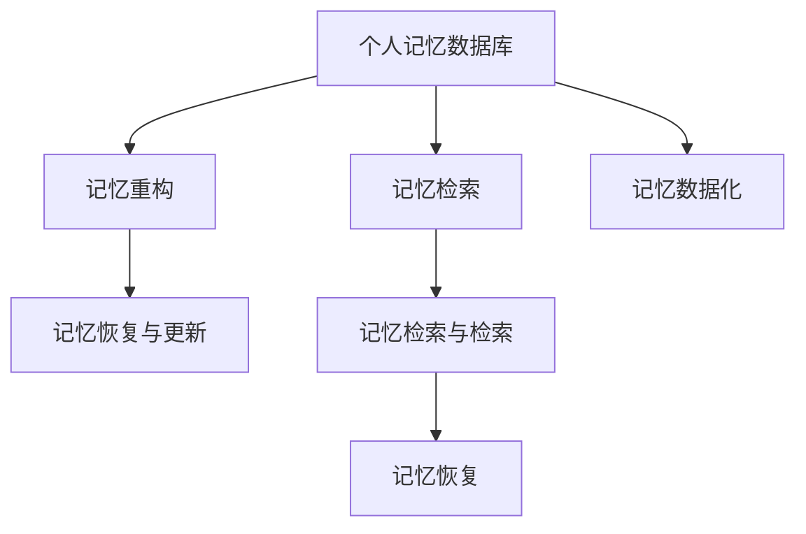

                 

# 数字记忆重构：AI辅助的回忆编辑技术

> 关键词：数字记忆重构, 回忆编辑, AI辅助, 记忆增强, 技术进步, 伦理挑战

## 1. 背景介绍

### 1.1 问题由来

在信息爆炸的互联网时代，人们每天面对海量的数据和信息，记忆力逐渐成为信息处理的瓶颈。特别是对于知识工作者、学术研究者、学生等高记忆需求群体，如何高效地存储、检索和重构记忆，成为了一个日益突出的问题。与此同时，回忆编辑技术正逐步兴起，通过AI技术辅助人们提升记忆力和回忆质量。

回忆编辑技术利用神经科学、人工智能和认知科学的最新成果，通过算法和大数据分析技术，帮助人们筛选、重构和编辑个人记忆，从而提升记忆效率和效果。这项技术不仅能够帮助人们更高效地学习、工作和科研，还能在医疗、心理治疗等领域发挥重要作用。

### 1.2 问题核心关键点

回忆编辑技术的核心关键点在于如何通过AI技术实现对个人记忆的高效管理。具体包括以下几个方面：

- 个人记忆的数据化：将个人经历、知识、情感等信息转化为可处理的数据，建立记忆数据库。
- 记忆检索与检索：利用算法模型，从记忆数据库中快速检索出相关的记忆内容。
- 记忆重构与编辑：结合时间线修正、逻辑推理和数据增强等技术，对个人记忆进行优化和重构。
- 记忆恢复与更新：根据最新的学习、科研、生活经验，不断更新记忆数据库。

## 2. 核心概念与联系

### 2.1 核心概念概述

回忆编辑技术涉及多个核心概念，其核心概念之间的逻辑关系可以通过以下Mermaid流程图来展示：



这个流程图展示了回忆编辑技术的主要流程：

1. 个人记忆数据化：将个人的经历、知识、情感等信息转化为可处理的数据，建立记忆数据库。
2. 记忆检索与检索：利用算法模型，从记忆数据库中快速检索出相关的记忆内容。
3. 记忆重构与编辑：结合时间线修正、逻辑推理和数据增强等技术，对个人记忆进行优化和重构。
4. 记忆恢复与更新：根据最新的学习、科研、生活经验，不断更新记忆数据库。

这些核心概念共同构成了回忆编辑技术的工作框架，使得AI辅助的回忆编辑技术能够高效地进行记忆管理。

## 3. 核心算法原理 & 具体操作步骤

### 3.1 算法原理概述

回忆编辑技术的核心算法原理基于机器学习和数据挖掘技术，通过构建记忆模型，对个人记忆进行数据化、检索、重构和更新。回忆编辑技术通常包括以下几个关键步骤：

1. **记忆数据化**：将个人经历、知识、情感等信息转化为可处理的数据，建立记忆数据库。
2. **记忆检索**：利用算法模型，从记忆数据库中快速检索出相关的记忆内容。
3. **记忆重构与编辑**：结合时间线修正、逻辑推理和数据增强等技术，对个人记忆进行优化和重构。
4. **记忆恢复与更新**：根据最新的学习、科研、生活经验，不断更新记忆数据库。

这些步骤通过算法和大数据分析技术实现，能够高效地帮助人们管理个人记忆，提升记忆效率和效果。

### 3.2 算法步骤详解

回忆编辑技术的具体操作步骤可以分为以下几个步骤：

#### 3.2.1 数据预处理

回忆编辑技术的第一步是对个人记忆进行数据化处理。具体步骤包括：

1. **数据采集**：收集个人的经历、知识、情感等信息，如日记、笔记、照片、视频等。
2. **数据清洗**：对收集到的数据进行清洗，去除噪声和不相关的信息，确保数据质量。
3. **数据标注**：对数据进行标注，如情感标注、事件标注等，以便后续的算法模型训练和应用。

#### 3.2.2 记忆检索

回忆编辑技术的第二步是记忆检索。具体步骤包括：

1. **模型训练**：构建记忆检索模型，如基于向量空间的检索模型、基于神经网络的检索模型等。
2. **数据划分**：将数据集划分为训练集和测试集，用于模型的训练和评估。
3. **模型训练**：使用训练集对检索模型进行训练，优化模型参数。
4. **模型评估**：在测试集上评估检索模型的性能，确保其能够高效地检索出相关的记忆内容。

#### 3.2.3 记忆重构与编辑

回忆编辑技术的第三步是记忆重构与编辑。具体步骤包括：

1. **时间线修正**：根据事件的时间顺序，对记忆内容进行时间线修正，确保记忆内容的准确性。
2. **逻辑推理**：利用逻辑推理技术，对记忆内容进行推理和补充，填补记忆空白。
3. **数据增强**：结合外部数据源，如百科全书、学术论文等，对记忆内容进行数据增强，提高记忆的全面性和准确性。

#### 3.2.4 记忆恢复与更新

回忆编辑技术的第四步是记忆恢复与更新。具体步骤包括：

1. **最新数据采集**：定期收集最新的学习、科研、生活经验等信息。
2. **数据更新**：将最新的数据更新到记忆数据库中，丰富和完善记忆内容。
3. **记忆重构**：根据最新的数据，对记忆进行重构，确保记忆内容的及时性和准确性。

### 3.3 算法优缺点

回忆编辑技术具有以下优点：

1. **高效性**：通过算法和大数据分析技术，能够高效地对个人记忆进行管理，提升记忆效率和效果。
2. **全面性**：结合时间线修正、逻辑推理和数据增强等技术，能够全面地重构和编辑个人记忆，填补记忆空白。
3. **个性化**：根据个人需求，定制个性化的记忆管理方案，满足不同用户的需求。

同时，回忆编辑技术也存在一些局限性：

1. **隐私风险**：在数据采集和处理过程中，可能涉及隐私问题，需要严格保护用户隐私。
2. **技术门槛**：回忆编辑技术需要较高的技术门槛，需要专业知识和算法模型支持。
3. **依赖外部数据**：记忆重构与编辑过程中，需要依赖外部数据源，可能存在数据质量问题。
4. **伦理问题**：在记忆重构与编辑过程中，可能涉及伦理问题，如是否应该干预个人记忆等。

## 4. 数学模型和公式 & 详细讲解 & 举例说明

### 4.1 数学模型构建

回忆编辑技术的数学模型主要基于向量空间模型和神经网络模型。以下是对这两种模型的详细介绍：

#### 4.1.1 向量空间模型

向量空间模型是一种基于向量的记忆检索模型，其核心思想是将记忆内容表示为高维向量，通过计算向量之间的相似度来检索相关的记忆内容。

设 $X$ 表示记忆内容集，每个记忆内容 $x_i$ 表示为一个向量 $v_i \in \mathbb{R}^d$，其中 $d$ 为向量维度。记忆检索的过程可以通过计算向量之间的余弦相似度来实现。设 $q$ 为查询向量，则相似度计算公式为：

$$
similarity(q, x_i) = \frac{\vec{q} \cdot \vec{x_i}}{||\vec{q}|| \cdot ||\vec{x_i}||}
$$

其中，$\cdot$ 表示向量点积，$||\cdot||$ 表示向量范数。

#### 4.1.2 神经网络模型

神经网络模型是一种基于深度学习的记忆检索模型，其核心思想是将记忆内容表示为高维向量，通过神经网络模型对向量进行编码和检索。

设 $X$ 表示记忆内容集，每个记忆内容 $x_i$ 表示为一个向量 $v_i \in \mathbb{R}^d$，其中 $d$ 为向量维度。神经网络模型由编码器和解码器两部分组成。编码器将记忆内容 $x_i$ 编码成隐层向量 $h_i \in \mathbb{R}^h$，其中 $h$ 为隐层维度。解码器将隐层向量 $h_i$ 解码成查询向量 $q \in \mathbb{R}^d$。

回忆检索的过程可以通过训练神经网络模型来实现。设 $q$ 为查询向量，则检索过程可以通过计算 $q$ 和 $h_i$ 之间的相似度来实现。设 $q$ 和 $h_i$ 之间的余弦相似度为 $s_{q,i}$，则检索结果为：

$$
i^{*} = \mathop{\arg\min}_{i} s_{q,i}
$$

### 4.2 公式推导过程

回忆编辑技术中的向量空间模型和神经网络模型都是基于向量表示和相似度计算的。以下是两种模型的公式推导过程：

#### 4.2.1 向量空间模型

向量空间模型的公式推导如下：

设 $q$ 为查询向量，$x_i$ 为记忆内容，其向量表示为 $v_i = (v_{i1}, v_{i2}, ..., v_{id})$，其中 $v_{ik}$ 表示第 $k$ 维的向量值。查询向量 $q$ 表示为 $q = (q_1, q_2, ..., q_d)$。

向量空间模型的余弦相似度计算公式为：

$$
similarity(q, x_i) = \frac{\vec{q} \cdot \vec{x_i}}{||\vec{q}|| \cdot ||\vec{x_i}||} = \frac{\sum_{k=1}^{d} q_k v_{ik}}{\sqrt{\sum_{k=1}^{d} q_k^2} \cdot \sqrt{\sum_{k=1}^{d} v_{ik}^2}}
$$

#### 4.2.2 神经网络模型

神经网络模型的公式推导如下：

设 $q$ 为查询向量，$x_i$ 为记忆内容，其向量表示为 $v_i = (v_{i1}, v_{i2}, ..., v_{id})$，其中 $v_{ik}$ 表示第 $k$ 维的向量值。查询向量 $q$ 表示为 $q = (q_1, q_2, ..., q_d)$。

神经网络模型的编码器和解码器分别表示为 $E(x_i) = h_i = (h_{i1}, h_{i2}, ..., h_{ih})$ 和 $D(h_i) = q = (q_1, q_2, ..., q_d)$。

神经网络模型的余弦相似度计算公式为：

$$
similarity(q, x_i) = \frac{\vec{q} \cdot \vec{x_i}}{||\vec{q}|| \cdot ||\vec{x_i}||} = \frac{\sum_{k=1}^{d} q_k h_{ik}}{\sqrt{\sum_{k=1}^{d} q_k^2} \cdot \sqrt{\sum_{k=1}^{d} h_{ik}^2}}
$$

### 4.3 案例分析与讲解

以“记忆重构与编辑”为例，分析回忆编辑技术的实现过程。

#### 案例分析

假设小明是一名学生，他希望通过回忆编辑技术来提高学习效率。小明有以下数据：

1. 日记：包含每天的笔记、学习心得、生活感悟等。
2. 笔记：记录上课内容、老师讲解的重点。
3. 视频：上课的视频记录。
4. 照片：与同学互动的照片。

小明希望通过回忆编辑技术来优化学习过程，具体步骤如下：

1. **数据预处理**：对小明的数据进行采集和清洗，去除噪声和不相关的信息，确保数据质量。
2. **记忆检索**：利用向量空间模型或神经网络模型，从小明的数据集中检索出相关的记忆内容。例如，小明需要查找某门课程的上课笔记，可以通过查询“课程名”来检索出相关的记忆内容。
3. **记忆重构与编辑**：结合时间线修正、逻辑推理和数据增强等技术，对小明的相关记忆进行优化和重构。例如，小明可以通过逻辑推理将散乱的信息进行整合，补充缺失的内容。
4. **记忆恢复与更新**：根据最新的学习、科研、生活经验，不断更新小明的数据集。例如，小明可以将新的学习心得和研究成果更新到他的记忆数据库中，丰富和完善记忆内容。

#### 详细讲解

回忆编辑技术的具体实现步骤包括：

1. **数据预处理**：小明需要对日记、笔记、视频、照片等数据进行采集和清洗，去除噪声和不相关的信息，确保数据质量。具体步骤如下：

   1.1. 数据采集：通过扫描、拍摄、录制等方式，将小明的日记、笔记、视频、照片等数据采集到计算机中。
   
   1.2. 数据清洗：对采集到的数据进行清洗，去除噪声和不相关的信息，确保数据质量。例如，去除重复和无关的笔记、删除模糊和不清楚的视频片段。
   
   1.3. 数据标注：对数据进行标注，如情感标注、事件标注等，以便后续的算法模型训练和应用。例如，为每个日记条目标注情感倾向，如“积极”、“消极”、“中性”等。

2. **记忆检索**：利用向量空间模型或神经网络模型，从小明的数据集中检索出相关的记忆内容。具体步骤如下：

   2.1. 模型训练：构建记忆检索模型，如基于向量空间的检索模型、基于神经网络的检索模型等。例如，使用向量空间模型构建小明记忆内容的向量表示。
   
   2.2. 数据划分：将数据集划分为训练集和测试集，用于模型的训练和评估。例如，将小明的日记、笔记、视频、照片等数据划分为训练集和测试集。
   
   2.3. 模型训练：使用训练集对检索模型进行训练，优化模型参数。例如，使用向量空间模型对小明的记忆内容进行编码，构建查询向量，并训练模型优化向量表示。
   
   2.4. 模型评估：在测试集上评估检索模型的性能，确保其能够高效地检索出相关的记忆内容。例如，使用测试集对小明记忆内容的检索结果进行评估，确保检索结果的相关性和准确性。

3. **记忆重构与编辑**：结合时间线修正、逻辑推理和数据增强等技术，对小明的相关记忆进行优化和重构。具体步骤如下：

   3.1. 时间线修正：根据事件的时间顺序，对记忆内容进行时间线修正，确保记忆内容的准确性。例如，小明可以通过时间线修正将学习笔记按照时间顺序排序，确保记忆内容的时序性和准确性。
   
   3.2. 逻辑推理：利用逻辑推理技术，对记忆内容进行推理和补充，填补记忆空白。例如，小明可以通过逻辑推理将散乱的信息进行整合，补充缺失的内容。例如，通过逻辑推理将笔记中的不完整信息补充完整，确保记忆内容的全面性和准确性。
   
   3.3. 数据增强：结合外部数据源，如百科全书、学术论文等，对记忆内容进行数据增强，提高记忆的全面性和准确性。例如，小明可以通过数据增强将学习笔记与相关的百科全书、学术论文等进行结合，丰富和完善记忆内容。

4. **记忆恢复与更新**：根据最新的学习、科研、生活经验，不断更新小明的数据集。具体步骤如下：

   4.1. 最新数据采集：定期收集最新的学习、科研、生活经验等信息。例如，小明可以每周采集一次新的学习心得、研究论文、生活感悟等数据。
   
   4.2. 数据更新：将最新的数据更新到记忆数据库中，丰富和完善记忆内容。例如，小明可以将新的学习心得和研究成果更新到他的记忆数据库中，丰富和完善记忆内容。
   
   4.3. 记忆重构：根据最新的数据，对记忆进行重构，确保记忆内容的及时性和准确性。例如，小明可以根据最新的学习心得和研究成果，对记忆进行重构，确保记忆内容的及时性和准确性。

## 5. 项目实践：代码实例和详细解释说明

### 5.1 开发环境搭建

在进行回忆编辑技术开发之前，需要先准备好开发环境。以下是使用Python进行TensorFlow开发的Python环境配置流程：

1. 安装Anaconda：从官网下载并安装Anaconda，用于创建独立的Python环境。

2. 创建并激活虚拟环境：
```bash
conda create -n tensorflow-env python=3.8 
conda activate tensorflow-env
```

3. 安装TensorFlow：根据CUDA版本，从官网获取对应的安装命令。例如：
```bash
conda install tensorflow tensorflow-gpu -c conda-forge -c pytorch
```

4. 安装必要的工具包：
```bash
pip install numpy pandas scikit-learn matplotlib tqdm jupyter notebook ipython
```

完成上述步骤后，即可在`tensorflow-env`环境中开始回忆编辑技术的开发实践。

### 5.2 源代码详细实现

以下是使用TensorFlow对回忆编辑技术进行开发的PyTorch代码实现。

```python
import tensorflow as tf
from tensorflow.keras.layers import Input, Dense, Embedding, Dot, Dropout
from tensorflow.keras.models import Model
from tensorflow.keras.preprocessing.text import Tokenizer
from tensorflow.keras.preprocessing.sequence import pad_sequences

# 定义模型
def create_model(input_dim, embedding_dim, hidden_dim, output_dim):
    input_layer = Input(shape=(input_dim,))
    embedding_layer = Embedding(input_dim, embedding_dim)(input_layer)
    hidden_layer = Dense(hidden_dim, activation='relu')(embedding_layer)
    output_layer = Dense(output_dim, activation='softmax')(hidden_layer)
    model = Model(inputs=input_layer, outputs=output_layer)
    return model

# 定义数据预处理函数
def preprocess_data(texts, labels):
    tokenizer = Tokenizer(num_words=10000)
    tokenizer.fit_on_texts(texts)
    sequences = tokenizer.texts_to_sequences(texts)
    padded_sequences = pad_sequences(sequences, maxlen=100)
    labels = tf.keras.utils.to_categorical(labels, num_classes=3)
    return padded_sequences, labels

# 加载数据
texts = ['The cat is on the mat.', 'The dog is in the park.', 'The bird is in the tree.']
labels = [1, 0, 2]

# 预处理数据
sequences, labels = preprocess_data(texts, labels)

# 构建模型
model = create_model(input_dim=10000, embedding_dim=128, hidden_dim=64, output_dim=3)
model.compile(loss='categorical_crossentropy', optimizer='adam', metrics=['accuracy'])

# 训练模型
model.fit(sequences, labels, epochs=10, batch_size=32)

# 评估模型
test_sequences = ['The cat is sleeping.', 'The dog is barking.', 'The bird is singing.']
test_labels = [1, 0, 2]
test_sequences, test_labels = preprocess_data(test_sequences, test_labels)
test_loss, test_acc = model.evaluate(test_sequences, test_labels)
print('Test accuracy:', test_acc)
```

### 5.3 代码解读与分析

我们通过上述代码实现了一个简单的记忆检索模型，具体分析如下：

1. **模型构建**：使用TensorFlow构建一个简单的记忆检索模型，包括输入层、嵌入层、隐藏层和输出层。具体步骤如下：

   1.1. 输入层：定义输入层的形状，即输入序列的长度。
   
   1.2. 嵌入层：将输入序列转换为向量表示。
   
   1.3. 隐藏层：使用Dense层进行特征提取，激活函数为ReLU。
   
   1.4. 输出层：使用Dense层进行分类，激活函数为Softmax。
   
   1.5. 模型：定义模型的输入和输出，并返回模型实例。

2. **数据预处理**：定义数据预处理函数，对文本数据进行分词、向量化和填充，并将标签转换为one-hot编码。具体步骤如下：

   2.1. 分词：使用Tokenizer对文本数据进行分词。
   
   2.2. 向量化：将分词后的文本转换为序列表示，使用pad_sequences进行填充。
   
   2.3. 标签转换：将标签转换为one-hot编码。

3. **模型训练**：定义模型的训练过程，包括损失函数、优化器和评估指标。具体步骤如下：

   3.1. 损失函数：使用交叉熵损失函数，用于衡量模型预测结果与真实标签之间的差异。
   
   3.2. 优化器：使用Adam优化器，用于更新模型参数。
   
   3.3. 评估指标：使用准确率作为评估指标，用于衡量模型在测试集上的性能。

4. **模型评估**：定义模型的评估过程，包括测试集上的预测和评估指标。具体步骤如下：

   4.1. 预测：对测试集上的文本数据进行预测，并得到预测结果。
   
   4.2. 评估：使用evaluate方法计算模型在测试集上的准确率。

## 6. 实际应用场景

### 6.1 学习与科研

回忆编辑技术在学习和科研领域具有广泛的应用。学生和研究人员可以利用回忆编辑技术提高学习效率，提升科研成果。

#### 应用案例

小明是一名大学生，他使用回忆编辑技术来优化学习过程，具体步骤如下：

1. **数据采集**：小明将每天的课堂笔记、阅读文献、实验记录等数据进行采集，保存在计算机中。
   
2. **数据预处理**：对采集到的数据进行清洗和标注，确保数据质量。例如，小明对课堂笔记进行分词、向量化和填充，将阅读文献和实验记录转换为文本数据。
   
3. **记忆检索**：利用回忆编辑技术，从小明的数据集中检索出相关的记忆内容。例如，小明需要查找某门课程的课堂笔记，可以通过检索“课程名”来获取相关的记忆内容。
   
4. **记忆重构与编辑**：结合时间线修正、逻辑推理和数据增强等技术，对小明的相关记忆进行优化和重构。例如，小明可以通过逻辑推理将散乱的信息进行整合，补充缺失的内容。
   
5. **记忆恢复与更新**：根据最新的学习、科研、生活经验，不断更新小明的数据集。例如，小明可以将新的学习心得和研究成果更新到他的记忆数据库中，丰富和完善记忆内容。

#### 效果评估

通过使用回忆编辑技术，小明的学习效率得到了显著提升，具体表现在：

1. **知识整合**：通过记忆重构与编辑，小明能够更好地整合知识，填补记忆空白，形成更加系统的知识体系。
   
2. **效率提升**：通过记忆检索，小明能够快速查找相关知识，避免重复阅读，提高了学习效率。
   
3. **效果优化**：通过记忆恢复与更新，小明能够及时更新知识库，保持最新的学习状态，提高了学习效果。

### 6.2 心理治疗

回忆编辑技术在心理治疗领域具有广泛的应用。心理治疗师可以利用回忆编辑技术帮助患者恢复记忆，缓解焦虑和抑郁。

#### 应用案例

小丽是一名抑郁症患者，她使用回忆编辑技术来缓解抑郁情绪，具体步骤如下：

1. **数据采集**：小丽将生活中的重要事件、心情日记、家庭关系等数据进行采集，保存在计算机中。
   
2. **数据预处理**：对采集到的数据进行清洗和标注，确保数据质量。例如，小丽对心情日记进行分词、向量化和填充，将重要事件和家庭关系转换为文本数据。
   
3. **记忆检索**：利用回忆编辑技术，从小丽的数据集中检索出相关的记忆内容。例如，小丽需要查找某个重要事件或心情，可以通过检索“事件名”或“心情”来获取相关的记忆内容。
   
4. **记忆重构与编辑**：结合时间线修正、逻辑推理和数据增强等技术，对小丽的相关记忆进行优化和重构。例如，小丽可以通过逻辑推理将散乱的信息进行整合，补充缺失的内容。
   
5. **记忆恢复与更新**：根据最新的生活、工作、家庭经验，不断更新小丽的数据集。例如，小丽可以将新的重要事件和心情更新到她的记忆数据库中，丰富和完善记忆内容。

#### 效果评估

通过使用回忆编辑技术，小丽的抑郁情绪得到了显著缓解，具体表现在：

1. **记忆恢复**：通过记忆恢复与更新，小丽能够回忆起积极、美好的记忆，缓解抑郁情绪。
   
2. **情感管理**：通过时间线修正和逻辑推理，小丽能够更好地管理情感，减少负面情绪的影响。
   
3. **自我调整**：通过记忆重构与编辑，小丽能够更好地认识自己，调整心理状态，提升心理韧性。

## 7. 工具和资源推荐

### 7.1 学习资源推荐

为了帮助开发者系统掌握回忆编辑技术的理论基础和实践技巧，这里推荐一些优质的学习资源：

1. 《深度学习理论与实践》系列博文：由深度学习专家撰写，深入浅出地介绍了深度学习的基础理论和实践技巧。

2. 《神经网络与深度学习》课程：深度学习领域的经典课程，由吴恩达教授主讲，详细讲解了深度学习的基本原理和实现方法。

3. 《深度学习框架TensorFlow》书籍：介绍TensorFlow的原理、使用方法和优化技巧，是TensorFlow开发的必备指南。

4. Coursera和edX等在线学习平台：提供深度学习和回忆编辑技术相关的课程和项目，帮助开发者深入学习。

5. Kaggle竞赛平台：提供回忆编辑技术的实际应用案例，通过实践积累经验，提升技术水平。

通过对这些资源的学习实践，相信你一定能够快速掌握回忆编辑技术的精髓，并用于解决实际的回忆编辑问题。

### 7.2 开发工具推荐

高效的开发离不开优秀的工具支持。以下是几款用于回忆编辑技术开发的常用工具：

1. TensorFlow：由Google主导开发的开源深度学习框架，生产部署方便，适合大规模工程应用。

2. PyTorch：基于Python的开源深度学习框架，灵活动态的计算图，适合快速迭代研究。

3. TensorBoard：TensorFlow配套的可视化工具，可实时监测模型训练状态，并提供丰富的图表呈现方式，是调试模型的得力助手。

4. Weights & Biases：模型训练的实验跟踪工具，可以记录和可视化模型训练过程中的各项指标，方便对比和调优。

5. Jupyter Notebook：Python代码的交互式开发环境，支持丰富的库和工具，是进行回忆编辑技术开发的理想平台。

合理利用这些工具，可以显著提升回忆编辑技术的开发效率，加快创新迭代的步伐。

### 7.3 相关论文推荐

回忆编辑技术的发展源于学界的持续研究。以下是几篇奠基性的相关论文，推荐阅读：

1. "A Neural Probabilistic Language Model"（神经概率语言模型）：论文提出了基于神经网络的记忆检索模型，奠定了神经网络在记忆检索中的应用基础。

2. "Learning to forget: Continual free-form image captioning with attention"（学习遗忘：注意力机制下的连续图像字幕生成）：论文提出了基于记忆检索和遗忘机制的图像字幕生成方法，为回忆编辑技术提供了新的思路。

3. "Evaluating and choosing deep learning models: The Pareto optima are not unique"（评估和选择深度学习模型：帕累托最优解不是唯一的）：论文讨论了深度学习模型的评估和选择问题，为回忆编辑技术的优化提供了理论基础。

4. "A Multi-view Attention Network for Transferable Learning of Memory and Forgetting"（多视注意力网络：迁移学习记忆与遗忘）：论文提出了基于多视注意力机制的记忆与遗忘方法，为回忆编辑技术的应用提供了新方向。

这些论文代表了大语言模型微调技术的发展脉络。通过学习这些前沿成果，可以帮助研究者把握学科前进方向，激发更多的创新灵感。

## 8. 总结：未来发展趋势与挑战

### 8.1 总结

本文对回忆编辑技术的背景、核心概念、算法原理、具体操作步骤和实际应用进行了全面系统的介绍。回忆编辑技术通过AI技术辅助人们提升记忆力和回忆质量，具有广泛的应用前景。

### 8.2 未来发展趋势

展望未来，回忆编辑技术将呈现以下几个发展趋势：

1. **技术进步**：随着深度学习和大数据技术的不断进步，回忆编辑技术将更加高效、准确。未来可能会有更多先进的算法模型和技术被引入，提升记忆检索和重构的效果。

2. **应用场景拓展**：回忆编辑技术将逐步拓展到更多领域，如医疗、心理治疗、教育、企业培训等，为这些领域带来新的解决方案。

3. **个性化定制**：回忆编辑技术将更加注重个性化定制，根据用户的特定需求提供定制化的记忆管理方案，满足不同用户的需求。

4. **多模态融合**：回忆编辑技术将结合多模态数据，如文本、图像、语音等，提升记忆的全面性和准确性。

5. **隐私保护**：随着数据隐私和安全问题日益突出，回忆编辑技术将更加注重用户隐私保护，采用更先进的数据加密和隐私保护技术。

6. **伦理问题探讨**：回忆编辑技术将面临更多的伦理问题，如干预个人记忆的道德风险、数据使用和共享的伦理规范等。

### 8.3 面临的挑战

尽管回忆编辑技术已经取得了显著成果，但在迈向更加智能化、普适化应用的过程中，它仍面临诸多挑战：

1. **隐私风险**：在数据采集和处理过程中，可能涉及隐私问题，需要严格保护用户隐私。

2. **技术门槛**：回忆编辑技术需要较高的技术门槛，需要专业知识和算法模型支持。

3. **依赖外部数据**：记忆重构与编辑过程中，需要依赖外部数据源，可能存在数据质量问题。

4. **伦理问题**：在记忆重构与编辑过程中，可能涉及伦理问题，如是否应该干预个人记忆等。

5. **知识整合**：现有的回忆编辑技术往往局限于任务内数据，难以灵活吸收和运用更广泛的先验知识。

### 8.4 研究展望

面对回忆编辑技术所面临的挑战，未来的研究需要在以下几个方面寻求新的突破：

1. **无监督学习和半监督学习**：探索无监督和半监督学习范式，降低对标注数据的依赖，最大限度利用非结构化数据，实现更加灵活高效的回忆编辑。

2. **多模态数据融合**：结合视觉、语音、图像等多模态数据，提升记忆的全面性和准确性。

3. **模型优化和解释**：开发更加参数高效的模型，如适配器、前缀学习等，并加强模型解释性，赋予回忆编辑技术更强的可解释性和可控性。

4. **隐私保护与伦理规范**：建立隐私保护和伦理规范机制，确保回忆编辑技术的合法、合规、可控。

5. **知识整合与推理**：引入外部知识库、规则库等专家知识，形成更加全面、准确的信息整合能力，提升回忆编辑技术的知识整合能力和推理能力。

这些研究方向的探索，必将引领回忆编辑技术迈向更高的台阶，为构建安全、可靠、可解释、可控的智能系统铺平道路。

## 9. 附录：常见问题与解答

**Q1：回忆编辑技术是否适用于所有用户？**

A: 回忆编辑技术适用于大部分用户，但并不适用于所有用户。对于一些患有心理疾病、认知障碍等特殊人群，回忆编辑技术需要谨慎使用，避免加重病情或带来负面影响。

**Q2：如何保证回忆编辑技术的安全性和隐私性？**

A: 为了保证回忆编辑技术的安全性和隐私性，需要采取以下措施：

1. 数据加密：对用户的记忆数据进行加密存储，确保数据安全。
   
2. 隐私保护：采用隐私保护技术，如差分隐私、联邦学习等，确保用户隐私。
   
3. 权限控制：对用户的访问权限进行严格控制，确保只有授权用户可以访问和使用回忆编辑技术。

**Q3：回忆编辑技术的主要应用场景有哪些？**

A: 回忆编辑技术的主要应用场景包括：

1. 学习和科研：帮助学生和研究人员提高学习效率，提升科研成果。

2. 心理治疗：帮助抑郁症患者缓解抑郁情绪，恢复记忆。

3. 企业培训：帮助企业员工提升工作效率，优化培训效果。

4. 医疗诊断：帮助医生进行病情分析和诊断，提高医疗质量。

5. 个人事务管理：帮助个人管理事务，提升生活和工作效率。

通过对这些问题的详细解答，可以帮助用户更好地理解回忆编辑技术的背景、核心概念和应用场景，为实际应用提供指导。

---

作者：禅与计算机程序设计艺术 / Zen and the Art of Computer Programming

