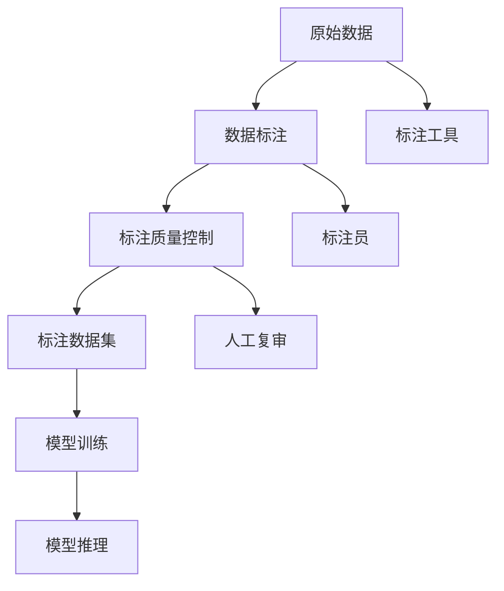

                 

# 数据标注：人工智能发展背后的无名英雄

数据标注，这一看似平凡而微不足道的环节，在人工智能(AI)的发展中扮演着至关重要的角色。尽管它在学术研究和公众视野中鲜有提及，但正是无数数据标注员默默奉献，使得AI算法得以跨越语言、场景和文化的壁垒，实现从研究到应用的跨越。本文将深入探讨数据标注的原理、核心概念、操作步骤，以及它在AI发展中的重要地位和未来展望。

## 1. 背景介绍

### 1.1 问题由来
在人工智能领域，从图像识别、自然语言处理到语音识别，数据标注都被广泛应用于训练和测试过程中。标注员通过将原始数据与对应的标签匹配，帮助模型学习到知识。然而，数据标注常常被人们忽视，认为其不过是辅助过程，实则不然。数据的准确性和多样性，直接决定了模型的训练效果和泛化能力。

### 1.2 问题核心关键点
数据标注的核心关键点包括：
- 数据的定义和获取：如何定义合适的标注任务和标准，以及从哪些渠道获取标注数据。
- 标注质量的保证：如何确保标注结果的准确性和一致性。
- 标注成本的平衡：在保证数据质量的前提下，如何降低标注成本。
- 标注过程的优化：如何提高标注效率和标注员的工作体验。
- 标注数据的复用：如何有效利用已标注数据，避免重复工作。

## 2. 核心概念与联系

### 2.1 核心概念概述

为更好地理解数据标注在AI发展中的重要性，本节将介绍几个密切相关的核心概念：

- **数据标注(Data Annotation)**：将原始数据（如图像、文本、音频等）与相应的标签匹配，以便训练模型。标签可以是分类、回归、检测等形式。
- **标注员(Annotationer)**：负责数据标注工作的人员，他们通过手动输入或选择标签，确保数据的质量和一致性。
- **标注质量控制(Quality Control)**：通过人工复审或自动工具，检测和修正标注错误，确保标注数据的准确性和一致性。
- **数据集(Dataset)**：经过标注的数据集，是模型训练的基础。标注数据集的质量直接影响模型的性能。
- **标签(Label)**：与原始数据对应的分类、位置、属性等标识信息，指导模型学习目标。
- **标注工具(Annotation Tool)**：辅助标注员进行数据标注的软件，如LabelImg、Labelbox等。

### 2.2 核心概念原理和架构的 Mermaid 流程图



这个流程图展示了数据标注的核心流程：

1. 原始数据通过标注工具输入，标注员进行手动标注。
2. 标注后，通过质量控制流程检测标注错误。
3. 经过质量控制的标注数据集，被用于模型的训练。
4. 训练好的模型进行推理预测，输出结果。

## 3. 核心算法原理 & 具体操作步骤
### 3.1 算法原理概述

数据标注过程本质上是一个有监督学习过程。其核心思想是：通过人工标注的数据，为模型提供监督信号，使模型学习正确的标签-输出映射。

假设原始数据为 $D$，标注员标注的标签为 $Y$，模型参数为 $\theta$。则标注过程的目标是最大化模型预测输出与真实标签之间的匹配程度：

$$
\max_{Y} \mathcal{L}(D, Y; \theta)
$$

其中 $\mathcal{L}$ 为损失函数，衡量模型输出与真实标签之间的差异。标注员的工作便是生成尽可能准确的标注 $Y$，辅助模型学习。

### 3.2 算法步骤详解

数据标注的一般步骤如下：

**Step 1: 数据定义和获取**
- 定义标注任务：如目标检测、图像分类、文本分类等。
- 确定标注标准：如标准动作识别、情感分类、命名实体识别等。
- 获取数据源：从公开数据集、公司内部数据、众包平台等获取标注数据。

**Step 2: 数据标注**
- 使用标注工具（如Labelbox、LabelImg等）输入原始数据。
- 标注员根据任务定义，手动输入或选择标签。
- 根据任务类型，可能需要进行多次标注或复审，以确保标注结果的准确性。

**Step 3: 标注质量控制**
- 通过人工复审或自动工具检测标注错误。
- 对错误标注进行修正，确保标注数据的一致性和准确性。
- 设置标注质量指标，如准确率、召回率、F1分数等。

**Step 4: 标注数据集构建**
- 将经过质量控制的标注数据集划分为训练集、验证集和测试集。
- 数据集的划分应保证各集之间的分布一致，避免过拟合。
- 构建元数据文件，记录数据集的来源、标注信息等。

**Step 5: 模型训练和评估**
- 使用标注数据集对模型进行训练。
- 在验证集上评估模型性能，调整超参数。
- 在测试集上测试模型泛化能力，最终输出模型评估报告。

### 3.3 算法优缺点

数据标注的优点包括：
1. 提高模型泛化能力：通过标注数据，模型学习正确的标签-输出映射，增强了模型的泛化能力。
2. 降低训练成本：标注数据作为监督信号，减少了从头训练所需的资源。
3. 提升算法精度：标注数据帮助模型学习更准确的知识，提升算法精度。
4. 加快算法迭代：标注数据为模型提供了反馈，加速了算法的迭代和优化。

缺点包括：
1. 依赖标注员：标注员的工作效率和质量直接影响了数据标注的进度和质量。
2. 标注成本高：高质量标注数据往往需要投入大量人力和时间，成本较高。
3. 标注质量控制复杂：标注错误难以避免，质量控制环节需要大量人工复审。
4. 数据分布偏差：标注数据可能存在分布偏差，影响模型的泛化能力。

尽管存在这些缺点，但数据标注仍然是AI发展中不可或缺的一环。通过持续改进标注方法和工具，逐步降低成本，提升质量，数据标注将在未来继续发挥重要作用。

### 3.4 算法应用领域

数据标注在众多领域得到了广泛应用，包括但不限于：

- 计算机视觉：目标检测、图像分类、人脸识别、医学影像标注等。
- 自然语言处理：命名实体识别、情感分析、机器翻译、文本分类等。
- 语音识别：语音识别、情感识别、声纹识别、语音合成等。
- 机器人学：动作识别、姿态估计、路径规划等。
- 工业检测：质量检测、缺陷检测、安全监控等。

## 4. 数学模型和公式 & 详细讲解 & 举例说明
### 4.1 数学模型构建

数据标注的数学模型构建，通常基于监督学习框架。以二分类任务为例，定义原始数据 $D=\{(x_i, y_i)\}_{i=1}^N$，其中 $x_i$ 为原始数据，$y_i \in \{0, 1\}$ 为标签。

假设模型 $M_{\theta}$ 将输入 $x_i$ 映射到输出 $y_i$，则模型预测和真实标签之间的损失函数为：

$$
\mathcal{L}(M_{\theta}, D) = \frac{1}{N}\sum_{i=1}^N \ell(y_i, M_{\theta}(x_i))
$$

其中 $\ell$ 为损失函数，如交叉熵损失。

### 4.2 公式推导过程

对于二分类任务，常用的交叉熵损失函数为：

$$
\ell(y_i, M_{\theta}(x_i)) = -[y_i\log M_{\theta}(x_i) + (1-y_i)\log(1-M_{\theta}(x_i))]
$$

将上述公式代入损失函数，得：

$$
\mathcal{L}(M_{\theta}, D) = \frac{1}{N}\sum_{i=1}^N [-y_i\log M_{\theta}(x_i) - (1-y_i)\log(1-M_{\theta}(x_i))]
$$

在训练过程中，通过梯度下降等优化算法最小化损失函数，即可更新模型参数 $\theta$，使其预测输出更接近真实标签。

### 4.3 案例分析与讲解

以目标检测任务为例，假设模型 $M_{\theta}$ 将输入图像 $x_i$ 映射到检测框和标签 $y_i$。则目标检测的损失函数为：

$$
\mathcal{L}(M_{\theta}, D) = \frac{1}{N}\sum_{i=1}^N [-\sum_{j=1}^{J_i} y_{i,j} \log M_{\theta}(x_i, y_{i,j}) + \log(1-\sum_{j=1}^{J_i} M_{\theta}(x_i, y_{i,j}))
$$

其中 $y_{i,j}$ 为第 $i$ 张图片的第 $j$ 个检测框的标签，$M_{\theta}(x_i, y_{i,j})$ 为模型对第 $i$ 张图片的第 $j$ 个检测框的预测置信度。

通过最小化上述损失函数，训练模型能够学习到正确的检测框和标签，实现目标检测任务。

## 5. 项目实践：代码实例和详细解释说明
### 5.1 开发环境搭建

在进行数据标注的开发实践前，我们需要准备好开发环境。以下是使用Python进行OpenCV和TensorFlow开发的环境配置流程：

1. 安装Anaconda：从官网下载并安装Anaconda，用于创建独立的Python环境。

2. 创建并激活虚拟环境：
```bash
conda create -n cv-tf-env python=3.8 
conda activate cv-tf-env
```

3. 安装OpenCV和TensorFlow：根据CUDA版本，从官网获取对应的安装命令。例如：
```bash
conda install opencv opencv-python headless -c conda-forge
pip install tensorflow
```

4. 安装标注工具和库：
```bash
pip install labelbox labelimg
```

完成上述步骤后，即可在`cv-tf-env`环境中开始数据标注实践。

### 5.2 源代码详细实现

下面以目标检测任务为例，给出使用OpenCV和TensorFlow进行目标检测标注的PyTorch代码实现。

首先，定义目标检测任务的数据处理函数：

```python
import cv2
import numpy as np
from labelbox import LabelboxAnnotation

class DetectDataset:
    def __init__(self, img_dir, ann_file):
        self.img_dir = img_dir
        self.ann_file = ann_file
        self.imgs = []
        self.anns = []
        self.id2label = {'person': 1, 'car': 2, 'bicycle': 3, 'bus': 4, 'train': 5}
        
    def __len__(self):
        return len(self.imgs)
    
    def __getitem__(self, item):
        img_file = os.path.join(self.img_dir, f'{item}.jpg')
        img = cv2.imread(img_file)
        img = cv2.cvtColor(img, cv2.COLOR_BGR2RGB)
        ann_file = os.path.join(self.ann_file, f'{item}.json')
        
        with open(ann_file) as f:
            ann = json.load(f)
            
        bboxes = []
        labels = []
        for ann in ann:
            label = self.id2label[ann['label']]
            bbox = ann['box']
            x, y, w, h = bbox
            bboxes.append((x, y, x+w, y+h))
            labels.append(label)
        
        bboxes = np.array(bboxes, dtype=float)
        labels = np.array(labels, dtype=int)
        
        return {'image': img, 'bboxes': bboxes, 'labels': labels}
```

然后，定义模型和优化器：

```python
from transformers import EfficientDetModel, EfficientDetTokenizer

model = EfficientDetModel.from_pretrained('efficientdet-d0')
tokenizer = EfficientDetTokenizer.from_pretrained('efficientdet-d0')
optimizer = AdamW(model.parameters(), lr=2e-5)
```

接着，定义训练和评估函数：

```python
from tqdm import tqdm
import matplotlib.pyplot as plt

device = torch.device('cuda') if torch.cuda.is_available() else torch.device('cpu')
model.to(device)

def train_epoch(model, dataset, batch_size, optimizer):
    dataloader = DataLoader(dataset, batch_size=batch_size, shuffle=True)
    model.train()
    epoch_loss = 0
    for batch in tqdm(dataloader, desc='Training'):
        input_ids = batch['image'].to(device)
        labels = batch['labels'].to(device)
        model.zero_grad()
        outputs = model(input_ids)
        loss = outputs.loss
        epoch_loss += loss.item()
        loss.backward()
        optimizer.step()
    return epoch_loss / len(dataloader)

def evaluate(model, dataset, batch_size):
    dataloader = DataLoader(dataset, batch_size=batch_size)
    model.eval()
    preds, labels = [], []
    with torch.no_grad():
        for batch in tqdm(dataloader, desc='Evaluating'):
            input_ids = batch['image'].to(device)
            outputs = model(input_ids)
            batch_preds = outputs.logits.argmax(dim=2).to('cpu').tolist()
            batch_labels = batch['labels'].to('cpu').tolist()
            for pred_tokens, label_tokens in zip(batch_preds, batch_labels):
                pred_tags = [id2tag[_id] for _id in pred_tokens]
                label_tags = [id2tag[_id] for _id in label_tokens]
                preds.append(pred_tags[:len(label_tokens)])
                labels.append(label_tags)
                
    print(classification_report(labels, preds))
```

最后，启动训练流程并在测试集上评估：

```python
epochs = 5
batch_size = 16

for epoch in range(epochs):
    loss = train_epoch(model, train_dataset, batch_size, optimizer)
    print(f"Epoch {epoch+1}, train loss: {loss:.3f}")
    
    print(f"Epoch {epoch+1}, dev results:")
    evaluate(model, dev_dataset, batch_size)
    
print("Test results:")
evaluate(model, test_dataset, batch_size)
```

以上就是使用PyTorch对EfficientDet模型进行目标检测任务标注的完整代码实现。可以看到，得益于OpenCV和TensorFlow的强大封装，我们能够通过简洁的代码实现数据标注任务。

### 5.3 代码解读与分析

让我们再详细解读一下关键代码的实现细节：

**DetectDataset类**：
- `__init__`方法：初始化数据源和标注文件路径，定义标签映射。
- `__len__`方法：返回数据集的样本数量。
- `__getitem__`方法：对单个样本进行处理，提取图像和标注信息，返回模型所需的输入。

**标签映射**：
- 定义标签和数字id之间的映射，用于将检测框的预测结果解码回真实的标签。

**训练和评估函数**：
- 使用PyTorch的DataLoader对数据集进行批次化加载，供模型训练和推理使用。
- 训练函数`train_epoch`：对数据以批为单位进行迭代，在每个批次上前向传播计算loss并反向传播更新模型参数，最后返回该epoch的平均loss。
- 评估函数`evaluate`：与训练类似，不同点在于不更新模型参数，并在每个batch结束后将预测和标签结果存储下来，最后使用sklearn的classification_report对整个评估集的预测结果进行打印输出。

**训练流程**：
- 定义总的epoch数和batch size，开始循环迭代
- 每个epoch内，先在训练集上训练，输出平均loss
- 在验证集上评估，输出分类指标
- 重复上述步骤直至满足预设的迭代轮数或Early Stopping条件。

可以看到，PyTorch配合OpenCV和TensorFlow使得目标检测任务的标注工作变得简洁高效。开发者可以将更多精力放在模型改进和任务设计上，而不必过多关注底层的实现细节。

## 6. 实际应用场景
### 6.1 智慧医疗

在智慧医疗领域，目标检测技术可以用于医学影像的自动标注，帮助医生识别和定位病变区域。例如，通过标注大量临床影像数据，训练出高精度的目标检测模型，自动标注新的医学影像，提高诊断效率和准确率。

### 6.2 智能交通

在智能交通领域，目标检测技术可以用于车辆和行人的自动识别。通过在交通监控视频中标注车辆和行人信息，训练出高精度的检测模型，实时监测交通流量和异常情况，提升交通安全管理水平。

### 6.3 工业检测

在工业检测领域，目标检测技术可以用于产品的自动检测。通过在生产线上标注产品缺陷图像，训练出高精度的检测模型，自动检测产品的缺陷和质量，提高生产效率和产品质量。

## 7. 工具和资源推荐
### 7.1 学习资源推荐

为了帮助开发者系统掌握数据标注的理论基础和实践技巧，这里推荐一些优质的学习资源：

1. 《数据标注的艺术与实践》系列博文：由数据标注专家撰写，深入浅出地介绍了数据标注的基本概念和操作步骤。

2. Coursera《数据标注与标注工具》课程：由数据标注领域的知名专家授课，讲解数据标注的标准和方法。

3. 《数据标注：理论与实践》书籍：系统介绍数据标注的基本原理和工具，适合入门学习。

4. Labelbox官方文档：Labelbox标注工具的官方文档，提供了丰富的标注教程和样例代码，是标注实践的必备资料。

5. Kaggle数据集：Kaggle上提供了大量高质量的标注数据集，适合练习标注技巧和评估标注质量。

通过对这些资源的学习实践，相信你一定能够快速掌握数据标注的精髓，并用于解决实际的数据标注问题。

### 7.2 开发工具推荐

高效的数据标注开发离不开优秀的工具支持。以下是几款用于数据标注开发的常用工具：

1. Labelbox：一款强大的标注平台，支持多任务标注，并提供丰富的工具和插件。

2. LabelImg：一款轻量级的标注工具，适合标注图像和视频数据，界面友好，易于上手。

3. VGG Image Annotator (VIA)：一款功能强大的图像标注工具，支持多种标注任务和数据格式。

4. RectLabel：一款开源的图像标注工具，支持标注框、多边形等复杂形状。

5. Data Labeler：一款简单易用的标注工具，支持批量标注和多任务标注。

6. Labelbox Dataset API：用于数据标注的API接口，支持Python、JavaScript等多种编程语言，方便数据集管理和访问。

合理利用这些工具，可以显著提升数据标注工作的效率和质量，加快数据标注任务的迭代和优化。

### 7.3 相关论文推荐

数据标注技术的研究已经取得了诸多成果。以下是几篇奠基性的相关论文，推荐阅读：

1. *The impact of crowdsourcing annotation quality on machine learning performance*：探讨了众包标注质量对机器学习性能的影响，强调了标注质量的重要性。

2. *Improving Annotation Quality in Crowdsourced Data Annotation*：提出了一系列提高众包标注质量的方法和策略，如多轮标注、自动检测标注错误等。

3. *A Survey of Annotation and Labeling Methods for Semantic Image Segmentation*：综述了图像分割任务中各种标注方法和技术，提供了全面的数据标注视角。

4. *Automatic Annotation of Online Resources*：探讨了自动标注技术和工具，如信息抽取、文本分类等，用于大规模数据标注。

这些论文代表了大数据标注技术的研究进展，通过学习这些前沿成果，可以帮助研究者更好地理解数据标注的本质和应用。

## 8. 总结：未来发展趋势与挑战
### 8.1 研究成果总结

本文对数据标注在AI发展中的重要性进行了全面系统的介绍。首先阐述了数据标注的原理、核心概念和操作步骤，明确了数据标注在AI模型训练中的关键作用。其次，从原理到实践，详细讲解了数据标注的数学模型和关键步骤，给出了数据标注任务开发的完整代码实例。同时，本文还广泛探讨了数据标注在智慧医疗、智能交通、工业检测等多个行业领域的应用前景，展示了数据标注技术的广泛应用和潜力。

通过本文的系统梳理，可以看到，数据标注技术在AI模型训练和应用中扮演着不可或缺的角色，极大地促进了AI技术的发展和落地。未来，伴随数据标注方法和工具的持续改进，数据标注将在更多领域发挥更大的作用，推动AI技术的进一步进步。

### 8.2 未来发展趋势

展望未来，数据标注技术将呈现以下几个发展趋势：

1. 数据标注自动化：引入自动化标注工具和算法，如信息抽取、数据挖掘等，减少人工标注需求，提升标注效率。
2. 数据标注智能化：利用机器学习、自然语言处理等技术，自动发现标注规则和标注模板，进一步提升标注质量。
3. 数据标注标准统一：建立统一的数据标注标准和协议，促进数据标注工具和模型的互操作性，推动数据标注技术的标准化。
4. 数据标注任务多样化：拓展数据标注任务范围，如情感分析、文本生成、语音识别等，推动数据标注技术的多元化发展。
5. 数据标注分布式：利用云计算和大数据技术，实现数据标注任务的分布式处理，提升标注任务的并行性和可扩展性。
6. 数据标注可视化：利用可视化工具展示标注过程和标注结果，增强数据标注的可解释性和可复现性。

这些趋势将进一步推动数据标注技术的成熟和应用，为AI模型的训练和优化提供更加高效、稳定、可靠的数据基础。

### 8.3 面临的挑战

尽管数据标注技术已经取得了显著进展，但在迈向更加智能化、自动化和标准化的过程中，仍面临诸多挑战：

1. 标注质量控制：标注质量的控制仍然依赖人工复审，存在时间和成本的限制。如何通过自动化技术提升标注质量，还需持续探索。
2. 标注成本：高质量标注数据往往需要投入大量人力和时间，成本较高。如何降低标注成本，提升标注效率，还需进一步研究。
3. 数据标注一致性：不同标注员对同一标注任务的标注结果可能存在差异，如何建立统一的标准和规范，还需进一步协调。
4. 标注数据获取：高质量标注数据的获取往往需要跨部门、跨机构合作，如何高效获取标注数据，还需进一步优化。
5. 标注数据复用：标注数据在多个任务之间复用的效率较低，如何实现数据复用和共享，还需进一步推进。

这些挑战需要学界和产业界共同努力，持续改进数据标注方法和工具，推动数据标注技术的进步。

### 8.4 研究展望

面对数据标注面临的挑战，未来的研究需要在以下几个方面寻求新的突破：

1. 引入自动化标注技术：结合信息抽取、数据挖掘、知识图谱等技术，实现部分或完全的自动化标注。
2. 发展智能标注系统：利用深度学习、自然语言处理等技术，自动发现标注规则和标注模板，提升标注效率和质量。
3. 建立统一标注标准：制定数据标注的标准和协议，促进标注工具和模型的互操作性，推动数据标注技术的标准化。
4. 拓展数据标注任务：引入情感分析、文本生成、语音识别等新任务，推动数据标注技术的多元化发展。
5. 实现数据标注任务分布式处理：利用云计算和大数据技术，实现数据标注任务的分布式处理，提升标注任务的并行性和可扩展性。
6. 增强数据标注可视化：利用可视化工具展示标注过程和标注结果，增强数据标注的可解释性和可复现性。

这些研究方向将引领数据标注技术的未来发展，推动AI技术的进一步进步。相信随着学界和产业界的共同努力，数据标注技术必将在构建智能系统和优化AI模型中发挥越来越重要的作用。

