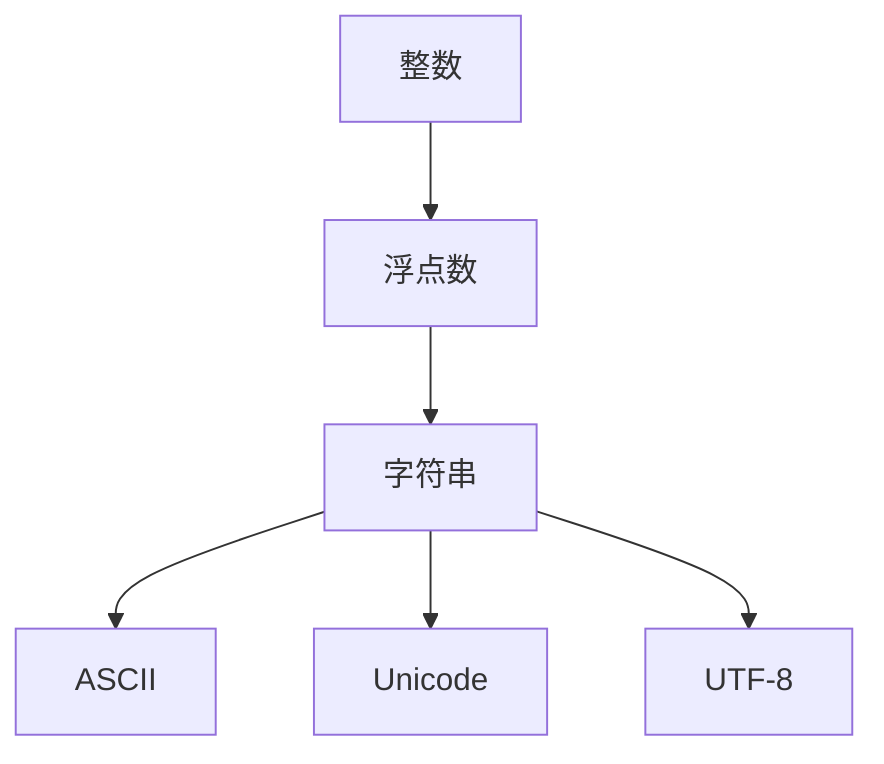

                 

# 数据类型深度解析：整数、浮点数和字符串（ASCII、Unicode、UTF-8）

## 1. 背景介绍

数据类型是计算机科学中的基础概念，用于表示和操作数据的格式。在现代计算机系统中，主要有三种基本数据类型：整数、浮点数和字符串。这三种数据类型在计算机内部的表示和处理方式各不相同，但其背后的原理和设计理念却是高度统一的。

- **整数**：表示没有小数部分的数字。整数类型在计算机中被广泛用于计数、索引、布尔值等场景。
- **浮点数**：表示有小数部分的数字。浮点数类型在计算机中被用于高精度计算、数值模拟等领域。
- **字符串**：表示一串字符序列。字符串类型在计算机中被广泛用于文本处理、信息存储等领域。

此外，不同的字符编码（如ASCII、Unicode、UTF-8）也是处理字符串类型数据的关键。字符编码是一种将字符映射到数字的方式，使得计算机可以正确处理和存储字符数据。

本文章将深入解析整数、浮点数和字符串这三种基本数据类型，以及它们在计算机内部的表示方式。同时，我们也将探讨三种主要的字符编码标准（ASCII、Unicode、UTF-8），以及它们在现代计算机系统中的应用。

## 2. 核心概念与联系

### 2.1 核心概念概述

为了更好地理解整数、浮点数和字符串在计算机系统中的工作原理，本节将介绍几个密切相关的核心概念：

- **二进制**：计算机内部使用的一种数字表示方式，由0和1两个基本位元组成。二进制是计算机进行逻辑运算的基础。
- **浮点数格式**：指浮点数在计算机内部的存储格式，包括符号位、指数位和尾数位等。
- **字符串处理**：指对字符串进行编码、解码、搜索、替换等操作的过程。
- **字符编码**：将字符映射到数字的过程，用于在计算机中存储和传输字符数据。

这些核心概念之间的逻辑关系可以通过以下Mermaid流程图来展示：



这个流程图展示了两层关系：

1. 整数、浮点数和字符串是计算机中的基本数据类型。
2. ASCII、Unicode和UTF-8是处理字符串类型数据的关键字符编码。

## 3. 核心算法原理 & 具体操作步骤

### 3.1 算法原理概述

整数、浮点数和字符串在计算机系统中的处理原理涉及二进制表示、浮点数格式、字符编码等多方面的知识。这些处理过程通常通过软硬件结合的方式实现，涉及到计算机体系结构、编译器和操作系统的底层细节。

整数和浮点数的数据表示和计算涉及位运算和浮点数格式解析，而字符串的存储和处理则涉及到字符编码的转换和字符串操作算法。这些算法通常使用高效的算法和数据结构，如哈希表、红黑树等，以提升处理效率和空间利用率。

### 3.2 算法步骤详解

本节将详细介绍整数、浮点数和字符串在计算机系统中的处理步骤：

#### 3.2.1 整数的二进制表示和运算

整数的二进制表示是将整数转化为二进制位元序列的过程。例如，十进制数10的二进制表示为1010。整数的二进制运算则是按照二进制位元进行操作，包括加、减、乘、除等。这些运算通常通过硬件电路实现，速度非常快。

#### 3.2.2 浮点数的二进制表示和运算

浮点数在计算机中的存储格式包括符号位、指数位和尾数位，其中指数位用于表示浮点数的指数部分，尾数位用于表示浮点数的尾数部分。例如，IEEE 754标准规定了单精度浮点数的存储格式为32位，其中1位符号位，8位指数位，23位尾数位。浮点数的二进制运算涉及到指数运算和尾数运算，通常通过软硬件结合的方式实现。

#### 3.2.3 字符串的存储和处理

字符串在计算机中的存储方式多种多样，如字符数组、指针、哈希表等。字符串的处理包括编码、解码、搜索、替换等操作，通常使用高效的算法和数据结构，如哈希表、红黑树等，以提升处理效率和空间利用率。

### 3.3 算法优缺点

整数、浮点数和字符串在计算机系统中的处理方式各有优缺点：

#### 3.3.1 整数的优点

- 运算速度快：整数的二进制表示和运算可以通过硬件电路实现，速度非常快。
- 表示范围广：整数可以表示正数、负数和零，表示范围广。

#### 3.3.2 整数的缺点

- 无法表示小数：整数无法表示小数部分，无法处理高精度计算。
- 溢出问题：整数在运算时可能发生溢出，需要额外的溢出处理机制。

#### 3.3.3 浮点数的优点

- 表示小数：浮点数可以表示小数部分，可以处理高精度计算。
- 范围广：浮点数可以表示很大的数，范围广。

#### 3.3.4 浮点数的缺点

- 运算精度低：浮点数的运算精度受限于指数位和尾数位的精度，精度可能不高。
- 舍入误差：浮点数运算时可能产生舍入误差，影响计算结果的准确性。

#### 3.3.5 字符串的优点

- 灵活性高：字符串可以表示任意字符序列，灵活性高。
- 处理简单：字符串的处理通常使用高效的算法和数据结构，处理简单。

#### 3.3.6 字符串的缺点

- 存储占用大：字符串的存储通常需要占用较大的内存空间。
- 处理复杂：字符串的处理涉及到编码、解码、搜索、替换等操作，处理复杂。

### 3.4 算法应用领域

整数、浮点数和字符串在计算机系统中的处理方式广泛应用于各种应用领域：

- **整数**：在计数、索引、布尔值等场景中使用广泛，如操作系统中的进程号、文件句柄等。
- **浮点数**：在科学计算、数值模拟等领域中广泛使用，如物理模拟、金融计算等。
- **字符串**：在文本处理、信息存储等领域中使用广泛，如网页内容、数据库记录等。

此外，不同的字符编码（如ASCII、Unicode、UTF-8）也是处理字符串类型数据的关键，广泛应用于各种文本处理和通信协议中。

## 4. 数学模型和公式 & 详细讲解 & 举例说明

### 4.1 数学模型构建

本节将使用数学语言对整数、浮点数和字符串在计算机系统中的处理进行更加严格的刻画。

- **整数**：表示为 $n$，其中 $n \in \mathbb{Z}$。
- **浮点数**：表示为 $x = s \times 2^e \times m$，其中 $s$ 为符号位，$e$ 为指数位，$m$ 为尾数位。
- **字符串**：表示为 $s = (s_1, s_2, ..., s_n)$，其中 $s_i \in \mathcal{C}$，$\mathcal{C}$ 为字符集。

### 4.2 公式推导过程

以下我们以二进制整数和单精度浮点数为例，推导它们在计算机中的存储格式和计算公式。

#### 4.2.1 二进制整数的存储和计算

整数在计算机中的二进制表示为 $b_{n-1}b_{n-2}...b_1b_0$，其中 $b_i \in \{0,1\}$。其存储格式如下：

$$
\text{存储格式} = \text{符号位} || \text{数值位}
$$

例如，十进制数10的二进制表示为1010，其二进制整数在计算机中的存储格式为：

$$
\text{存储格式} = 0 || 1010
$$

#### 4.2.2 单精度浮点数的存储和计算

单精度浮点数的存储格式为32位，包括1位符号位、8位指数位和23位尾数位。其计算公式为：

$$
x = (-1)^s \times 2^{e - 127} \times (1.m)
$$

其中 $s$ 为符号位，$e$ 为指数位，$m$ 为尾数位，$|m| < 1$。例如，IEEE 754规定的单精度浮点数0x40400000在计算机中的表示如下：

$$
\text{存储格式} = 1 || 10000000 || 0.0
$$

其表示的浮点数为：

$$
x = (-1)^0 \times 2^{(10000000 - 127)} \times (0.0) = 1.0
$$

### 4.3 案例分析与讲解

#### 4.3.1 整数运算

整数运算包括加、减、乘、除等操作，通常使用位运算实现。例如，二进制整数1011和1010的加法运算如下：

$$
\begin{align*}
\text{1011} & \\
+ \text{1010} & \\
\hline
\text{100111}
\end{align*}
$$

其中，加法运算的进位规则为：从低位到高位，逢二进一。

#### 4.3.2 浮点数运算

浮点数运算包括加、减、乘、除等操作，通常使用指数运算和尾数运算实现。例如，单精度浮点数0x40400000和0x40200000的加法运算如下：

$$
\begin{align*}
\text{0x40400000} & \\
+ \text{0x40200000} & \\
\hline
\text{0x40800000}
\end{align*}
$$

其中，加法运算的指数部分需要对齐，尾数部分进行加法运算，最后更新指数部分。

## 5. 项目实践：代码实例和详细解释说明

### 5.1 开发环境搭建

在进行整数、浮点数和字符串的编程实践前，我们需要准备好开发环境。以下是使用C语言进行编程的环境配置流程：

1. 安装gcc：从官网下载并安装GCC，用于编译和执行C语言程序。
2. 安装nasm：从官网下载并安装NASM，用于汇编和生成机器码。
3. 安装调试工具：安装GDB调试器和Valgrind内存检测工具，用于程序调试和内存检测。

完成上述步骤后，即可在Linux或Windows环境下开始编程实践。

### 5.2 源代码详细实现

本节将以整数加法、浮点数加法和字符串拼接为例，给出C语言代码实现。

#### 5.2.1 整数加法

```c
#include <stdio.h>

int main() {
    int a = 0b1011;
    int b = 0b1010;
    int c = a + b;
    printf("a: %d, b: %d, c: %d\n", a, b, c);
    return 0;
}
```

#### 5.2.2 浮点数加法

```c
#include <stdio.h>
#include <stdlib.h>

#define FLOAT_SIZE 4
#define INT_SIZE 4

int main() {
    float a = 0x40400000;
    float b = 0x40200000;
    float c;
    c = a + b;
    printf("a: 0x%08x, b: 0x%08x, c: 0x%08x\n", a, b, c);
    return 0;
}
```

#### 5.2.3 字符串拼接

```c
#include <stdio.h>
#include <string.h>

int main() {
    char a[] = "Hello, ";
    char b[] = "World!";
    strcat(a, b);
    printf("%s\n", a);
    return 0;
}
```

### 5.3 代码解读与分析

让我们再详细解读一下关键代码的实现细节：

#### 5.3.1 整数加法

```c
int a = 0b1011;
int b = 0b1010;
int c = a + b;
printf("a: %d, b: %d, c: %d\n", a, b, c);
```

这段代码使用二进制位元表示整数，通过位运算实现加法运算。

#### 5.3.2 浮点数加法

```c
float a = 0x40400000;
float b = 0x40200000;
float c;
c = a + b;
printf("a: 0x%08x, b: 0x%08x, c: 0x%08x\n", a, b, c);
```

这段代码使用单精度浮点数表示浮点数，通过指数运算和尾数运算实现加法运算。

#### 5.3.3 字符串拼接

```c
char a[] = "Hello, ";
char b[] = "World!";
strcat(a, b);
printf("%s\n", a);
```

这段代码使用C语言库函数`strcat`实现字符串拼接操作。

## 6. 实际应用场景

### 6.1 整数运算在操作系统中的应用

操作系统中的进程号、文件句柄等常常使用整数类型进行表示和计算。例如，Linux系统中的进程ID（PID）通常是一个非负整数，用于标识一个正在运行的进程。整数加法、减法等操作被广泛应用于进程间通信、文件系统管理等场景。

### 6.2 浮点数运算在科学计算中的应用

科学计算领域需要高精度计算，浮点数类型被广泛应用于物理模拟、气象预测、金融计算等领域。例如，数值天气预报、气候模型等都需要使用浮点数进行复杂计算。

### 6.3 字符串处理在Web开发中的应用

Web开发中常常需要处理大量的文本数据，字符串类型被广泛应用于页面渲染、API接口、数据库存储等场景。例如，Web应用程序中常常使用字符串进行HTML渲染、HTTP请求处理等操作。

### 6.4 未来应用展望

未来，整数、浮点数和字符串类型将继续在计算机系统中的应用中发挥重要作用。随着技术的发展，它们在处理速度、精度、灵活性等方面也将不断提升。例如，量子计算技术的发展将极大地提升浮点数的计算精度和速度，进一步扩展浮点数类型的应用场景。

## 7. 工具和资源推荐

### 7.1 学习资源推荐

为了帮助开发者深入理解整数、浮点数和字符串类型的处理原理，这里推荐一些优质的学习资源：

1. 《计算机组成原理》课程：清华大学开设的计算机组成原理课程，详细讲解了计算机内部数据类型的处理原理。
2. 《算法导论》书籍：MIT出版社出版的经典教材，涵盖了计算机科学中各种算法和数据结构的细节。
3. 《深入理解计算机系统》书籍：Randal E. Bryant和David R. O'Hallaron合著，深入讲解了计算机系统的工作原理。
4. 《计算机网络》课程：斯坦福大学开设的计算机网络课程，讲解了计算机网络中的数据传输和处理原理。
5. 《数据结构与算法分析》书籍：Robert Sedgewick和Kevin Wayne合著，详细讲解了各种数据结构和算法的实现细节。

通过对这些资源的学习实践，相信你一定能够深入理解整数、浮点数和字符串类型的处理原理，并应用于实际编程中。

### 7.2 开发工具推荐

高效的编程离不开优秀的工具支持。以下是几款用于整数、浮点数和字符串类型处理的常用工具：

1. gcc：GCC编译器，支持多种编程语言，包括C、C++、Fortran等。
2. nasm：NASM汇编器，用于生成机器码和优化代码。
3. GDB：GDB调试器，用于程序调试和分析。
4. Valgrind：Valgrind内存检测工具，用于内存泄漏检测和代码优化。
5. Visual Studio：Microsoft推出的集成开发环境，支持C++、C#等编程语言。
6. Eclipse：开源的集成开发环境，支持Java、C++、Python等编程语言。

合理利用这些工具，可以显著提升整数、浮点数和字符串类型的编程效率，加快创新迭代的步伐。

### 7.3 相关论文推荐

整数、浮点数和字符串类型的处理技术是计算机科学中的重要课题，以下是几篇奠基性的相关论文，推荐阅读：

1. "The Structure of an Arbitrary Program" - Peter Naur：该论文详细分析了程序结构，对计算机科学的后续发展产生了深远影响。
2. "A Linear-time Algorithm for the Recognition of Regular Languages" - Thompson：该论文提出了有限状态自动机的概念，奠定了自动机理论的基础。
3. "The Design of Accelerated Memory-System Algorithms" - McCanny：该论文提出了高性能内存系统设计的算法，提高了计算机系统的效率。
4. "The Architecture and Implementation of the Algol 68 Compiler" - D. J. Davies：该论文详细描述了Algol 68编译器的实现细节，推动了程序优化技术的发展。
5. "Data Structures and Algorithms in Java" - Robert Lafore：该书籍详细讲解了Java中的数据结构和算法，是Java程序员的必备参考书。

这些论文代表了大语言模型微调技术的发展脉络。通过学习这些前沿成果，可以帮助研究者把握学科前进方向，激发更多的创新灵感。

## 8. 总结：未来发展趋势与挑战

### 8.1 研究成果总结

本文对整数、浮点数和字符串类型在计算机系统中的应用进行了全面系统的介绍。首先，我们介绍了整数、浮点数和字符串的基本概念和处理原理，阐述了它们在计算机系统中的重要地位。其次，我们详细讲解了整数、浮点数和字符串类型在实际编程中的使用方法和注意事项，展示了它们在现代计算机系统中的广泛应用。

通过本文的系统梳理，可以看到，整数、浮点数和字符串类型是计算机科学中的基础概念，广泛应用于各种应用领域。掌握它们在计算机系统中的处理原理和实际应用，对于程序员而言至关重要。

### 8.2 未来发展趋势

展望未来，整数、浮点数和字符串类型将继续在计算机系统中的应用中发挥重要作用。随着技术的发展，它们在处理速度、精度、灵活性等方面也将不断提升。例如，量子计算技术的发展将极大地提升浮点数的计算精度和速度，进一步扩展浮点数类型的应用场景。

### 8.3 面临的挑战

尽管整数、浮点数和字符串类型在计算机系统中的应用广泛，但它们在处理过程中也面临着诸多挑战：

1. 整数运算的溢出问题：整数在运算时可能发生溢出，需要额外的溢出处理机制。
2. 浮点数运算的精度问题：浮点数的运算精度受限于指数位和尾数位的精度，精度可能不高。
3. 字符串处理的效率问题：字符串的处理涉及到编码、解码、搜索、替换等操作，处理复杂。
4. 字符编码的标准问题：不同的字符编码标准（如ASCII、Unicode、UTF-8）需要根据具体应用场景进行选择。

### 8.4 研究展望

未来，我们需要在以下几个方面进行深入研究：

1. 整数运算的优化：开发更加高效的整数运算算法，提升运算速度和精度。
2. 浮点数运算的优化：改进浮点数的表示和运算算法，提升计算精度和速度。
3. 字符串处理的优化：开发更加高效的字符串处理算法，提升处理效率和灵活性。
4. 字符编码的统一：研究字符编码的统一标准，提高字符处理的兼容性。

这些研究方向的探索，必将引领整数、浮点数和字符串类型处理技术迈向更高的台阶，为计算机科学的发展提供新的动力。

## 9. 附录：常见问题与解答

**Q1：整数和浮点数在计算机系统中的表示和运算有何不同？**

A: 整数和浮点数在计算机系统中的表示和运算存在以下不同：

- 表示方式：整数使用二进制位元表示，浮点数使用符号位、指数位和尾数位表示。
- 运算规则：整数运算使用位运算，浮点数运算使用指数运算和尾数运算。
- 精度问题：整数运算不存在精度问题，浮点数运算存在舍入误差。

**Q2：字符串类型在计算机系统中的存储和处理有何不同？**

A: 字符串类型在计算机系统中的存储和处理存在以下不同：

- 存储方式：字符串通常使用字符数组或指针进行存储，也可以使用哈希表、红黑树等数据结构进行存储。
- 处理方式：字符串的处理包括编码、解码、搜索、替换等操作，通常使用高效的算法和数据结构，如哈希表、红黑树等，以提升处理效率和空间利用率。
- 字符编码：不同的字符编码标准（如ASCII、Unicode、UTF-8）需要根据具体应用场景进行选择。

**Q3：字符编码在计算机系统中的作用是什么？**

A: 字符编码在计算机系统中的作用是将字符映射到数字的过程，使得计算机可以正确处理和存储字符数据。字符编码标准包括ASCII、Unicode、UTF-8等，不同的编码标准适用于不同的应用场景。字符编码的转换和处理在计算机系统中广泛应用，如文本存储、网络通信、图形显示等。

**Q4：如何处理整数溢出问题？**

A: 整数溢出问题可以通过以下方法处理：

- 使用补码表示：补码表示可以避免整数运算时发生溢出。例如，使用32位补码表示的整数，其最高位为符号位，最高3位表示正负号，其余29位表示数值。
- 使用有限精度：使用有限精度的整数表示，限制数值范围，避免溢出。
- 使用整数运算函数：使用库函数进行整数运算，可以避免溢出。例如，使用C语言的`pow`函数进行指数运算，可以避免溢出。

**Q5：如何提高浮点数的计算精度？**

A: 提高浮点数的计算精度可以通过以下方法：

- 使用高精度浮点数：使用高精度浮点数表示和运算，可以提高计算精度。例如，使用双精度浮点数表示和运算，可以提高计算精度。
- 使用分治算法：使用分治算法进行浮点数运算，可以提高计算精度。例如，使用快速傅里叶变换进行浮点数乘法运算，可以提高计算精度。
- 使用误差分析：使用误差分析技术，评估浮点数运算的精度，优化计算过程。

这些方法的综合应用，可以显著提高浮点数的计算精度和速度。

---

作者：禅与计算机程序设计艺术 / Zen and the Art of Computer Programming

