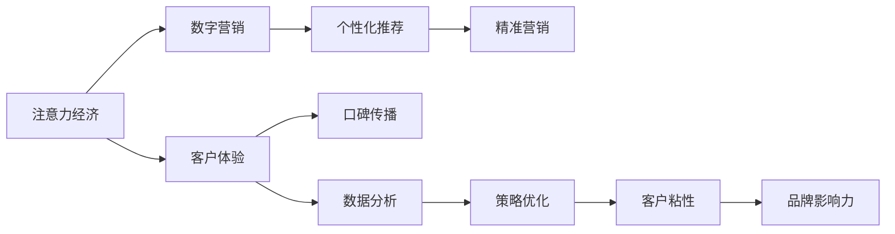

                 

# 旅游业如何在注意力经济中突围

> 关键词：旅游业,注意力经济,营销策略,数据分析,客户体验,口碑传播

## 1. 背景介绍

### 1.1 问题由来
随着互联网和移动设备的普及，全球经济逐渐转向以消费者注意力为中心的“注意力经济”。在注意力经济中，如何吸引并保持消费者的注意成为了企业竞争的关键。旅游业作为服务业的重要组成部分，受关注度尤为突出。但传统旅游业的营销模式面临着高度同质化、信息不对称、客户体验参差不齐等挑战。如何利用数字技术和注意力经济，提升旅游业的品牌影响力和客户粘性，是当前亟待解决的重要问题。

### 1.2 问题核心关键点
1. **数字营销与个性化体验：** 传统旅游业营销主要依赖广告、展销会等形式，难以实现个性化推荐和精准营销。数字技术提供了一个平台，通过数据分析和算法模型，可以为每位客户提供定制化的旅游服务推荐。
2. **客户口碑与信任建立：** 在注意力经济中，消费者的信任和口碑传播对品牌具有决定性影响。旅游业需要通过社交媒体、用户评价等渠道，真实反映客户体验，提升品牌可信度。
3. **跨领域整合与数据共享：** 旅游业涉及交通、住宿、餐饮、娱乐等多个领域，通过跨领域数据整合和共享，可以实现更为全面和连贯的客户体验。
4. **技术与创新的融合：** 借助AR/VR、物联网(IoT)等新兴技术，可以提升旅游体验的互动性和沉浸感。

## 2. 核心概念与联系

### 2.1 核心概念概述

在探讨旅游业如何在注意力经济中突围时，以下核心概念至关重要：

- **注意力经济（Attention Economy）：** 以消费者的注意力为中心的经济模式，强调通过创意和创新吸引并保持消费者的注意力。
- **数字营销（Digital Marketing）：** 利用数字技术和互联网平台，实现精准化、个性化的营销目标。
- **客户体验（Customer Experience）：** 从客户与品牌互动的各个环节出发，全面提升客户满意度和忠诚度。
- **数据分析（Data Analytics）：** 通过收集、整理、分析和解释数据，以数据驱动决策，优化营销策略和客户服务。
- **口碑传播（Word of Mouth）：** 消费者通过社交媒体等渠道，自发传播对品牌的看法和体验，对品牌有巨大的影响力。

这些概念之间的逻辑关系可以通过以下Mermaid流程图来展示：



这个流程图展示了注意力经济在旅游业营销中的作用机制：

1. 通过数字营销吸引和保持消费者注意。
2. 借助客户体验，提升用户满意度和忠诚度。
3. 利用数据分析，优化营销策略和客户服务。
4. 通过口碑传播，提升品牌可信度和影响力。

## 3. 核心算法原理 & 具体操作步骤
### 3.1 算法原理概述

基于注意力经济的旅游业营销，核心在于通过数据分析和算法模型，实现个性化推荐、精准营销和客户体验优化。具体来说，旅游业企业需要从以下几个方面入手：

1. **用户行为分析：** 通过数据分析工具，对用户的浏览、点击、购买等行为进行跟踪和分析，识别用户的偏好和需求。
2. **个性化推荐系统：** 利用推荐算法（如协同过滤、基于内容的推荐等），为每位用户提供个性化的旅游产品推荐。
3. **社交媒体监控与情感分析：** 利用自然语言处理技术，分析用户在社交媒体上的评论和反馈，评估品牌声誉和用户情绪。
4. **口碑传播预测与响应：** 通过情感分析和社会网络分析，预测用户的口碑传播趋势，及时响应负面评价，提升品牌形象。

### 3.2 算法步骤详解

以下是旅游业在注意力经济中突围的具体步骤：

**Step 1: 数据收集与整合**
- 收集用户行为数据（如浏览记录、搜索关键词、点击流等）。
- 整合跨领域的旅游信息（如景点介绍、交通方式、酒店评价等）。

**Step 2: 数据分析与建模**
- 对用户行为数据进行特征提取和预处理。
- 构建用户画像模型，识别用户的兴趣和需求。
- 使用推荐算法和情感分析模型，为每位用户生成个性化的推荐内容。

**Step 3: 个性化推荐与精准营销**
- 将个性化推荐内容推送给用户，提升点击率和转化率。
- 通过社交媒体监控，及时回应用户评论和反馈，提升用户满意度。

**Step 4: 客户体验优化与品牌建设**
- 优化用户路径，提高服务质量和客户体验。
- 通过口碑传播预测，提升品牌信任度和影响力。

**Step 5: 持续迭代与改进**
- 根据用户反馈和市场变化，持续优化推荐模型和营销策略。
- 引入新技术和创新点，提升客户互动和沉浸感。

### 3.3 算法优缺点

基于注意力经济的旅游业营销方法具有以下优点：

1. **精准营销：** 利用数据分析和算法模型，可以精准识别用户需求，实现个性化推荐，提高营销效率和效果。
2. **客户粘性提升：** 通过优化客户体验，增强用户满意度和忠诚度，提升复购率和长期价值。
3. **品牌建设：** 借助社交媒体和口碑传播，提升品牌信任度和影响力，实现有效推广。

同时，该方法也存在一定的局限性：

1. **数据隐私问题：** 用户行为数据的收集和处理需要遵循数据隐私和保护法规。
2. **算法公平性：** 推荐算法可能存在偏见，导致不同用户群体的推荐不公平。
3. **模型复杂性：** 个性化推荐和情感分析模型较为复杂，需要较高的技术门槛和计算资源。
4. **成本投入：** 数据分析和算法模型的构建和维护需要较高的技术投入和资金支持。

尽管存在这些局限性，但就目前而言，基于注意力经济的旅游业营销方法仍是最主流和有效的策略之一。未来相关研究的方向在于如何进一步降低技术门槛和成本，提高模型的公平性和透明度，同时兼顾数据隐私和用户权益。

### 3.4 算法应用领域

基于注意力经济的旅游业营销方法，在诸多场景下都得到了广泛的应用，例如：

- **在线旅游平台：** 如携程、Booking.com等，通过个性化推荐和精准营销，提升用户购买转化率。
- **景区与酒店：** 通过数据分析和客户反馈，优化服务和提升客户体验，提高品牌口碑。
- **主题旅游活动：** 利用社交媒体和口碑传播，推广旅游活动，吸引更多用户参与。
- **文化旅游：** 借助AR/VR技术，增强文化旅游的互动性和沉浸感，提升用户体验。

除了上述这些经典应用外，基于注意力经济的营销方法也在不断拓展新的场景，如智慧旅游、旅游数据分析、旅游AI服务等，为旅游业带来了新的机遇和挑战。

## 4. 数学模型和公式 & 详细讲解 & 举例说明

### 4.1 数学模型构建

为了更好地理解基于注意力经济的旅游业营销方法，本节将介绍几个密切相关的核心概念和数学模型：

- **用户行为模型：** 描述用户浏览和点击行为的模型，通常使用线性回归或神经网络建模。
- **推荐模型：** 基于用户历史行为数据和物品特征，预测用户对物品的评分或偏好，常用的推荐算法包括协同过滤、基于内容的推荐等。
- **情感分析模型：** 利用自然语言处理技术，分析用户评论中的情感倾向，评估品牌声誉和用户情绪，常用的模型包括朴素贝叶斯、情感词典等。
- **社交网络分析模型：** 通过分析用户社交网络关系，预测用户行为和口碑传播趋势，常用的模型包括PageRank、社区发现算法等。

### 4.2 公式推导过程

以推荐模型为例，假设用户对物品的评分可以通过以下公式计算：

$$
\hat{r}_{ui} = \alpha \sum_{j=1}^{n}a_{uj}w_j\cdot x_{ij} + b
$$

其中，$u$ 为用户，$i$ 为物品，$n$ 为物品特征数量，$w_j$ 为物品特征权重，$x_{ij}$ 为物品特征值，$\alpha$ 和 $b$ 为模型参数。

该公式表示，用户对物品 $i$ 的评分 $\hat{r}_{ui}$，由用户对物品特征 $j$ 的评分 $a_{uj}$ 加权求和，并加上模型参数 $\alpha$ 和 $b$。该公式基于用户-物品的协同过滤模型，通过用户的历史行为数据和物品的特征，预测用户对物品的评分。

### 4.3 案例分析与讲解

假设某旅游网站收集了用户对景点、酒店和交通方式的评分数据，每个用户的历史行为数据和物品特征数据。使用协同过滤推荐模型，可以根据用户的历史评分和物品特征，为每位用户生成个性化的推荐列表。例如：

- 用户 $u$ 对景点 $i$ 的评分 $r_{ui}$ 为 4 分，网站根据协同过滤模型预测，用户 $u$ 可能会对酒店 $j$ 和交通方式 $k$ 感兴趣。网站根据用户的历史评分和物品特征，为 $u$ 推荐酒店 $j$ 和交通方式 $k$，并在网站首页展示推荐内容。
- 同时，网站通过情感分析模型，分析用户对酒店和交通方式的评论，评估品牌声誉和用户情绪。如果用户对某个酒店有负面评论，网站可以及时响应，提升用户满意度。

## 5. 项目实践：代码实例和详细解释说明
### 5.1 开发环境搭建

在进行旅游业营销项目开发前，我们需要准备好开发环境。以下是使用Python进行PyTorch开发的环境配置流程：

1. 安装Anaconda：从官网下载并安装Anaconda，用于创建独立的Python环境。

2. 创建并激活虚拟环境：
```bash
conda create -n pytorch-env python=3.8 
conda activate pytorch-env
```

3. 安装PyTorch：根据CUDA版本，从官网获取对应的安装命令。例如：
```bash
conda install pytorch torchvision torchaudio cudatoolkit=11.1 -c pytorch -c conda-forge
```

4. 安装Transformers库：
```bash
pip install transformers
```

5. 安装各类工具包：
```bash
pip install numpy pandas scikit-learn matplotlib tqdm jupyter notebook ipython
```

完成上述步骤后，即可在`pytorch-env`环境中开始旅游业营销项目的开发。

### 5.2 源代码详细实现

下面我们以旅游网站的用户行为分析与推荐系统为例，给出使用Transformers库进行开发和微调的PyTorch代码实现。

首先，定义用户行为数据处理函数：

```python
from transformers import BertTokenizer
from torch.utils.data import Dataset
import torch

class UserBehaviorDataset(Dataset):
    def __init__(self, user_data, item_data, tokenizer, max_len=128):
        self.user_data = user_data
        self.item_data = item_data
        self.tokenizer = tokenizer
        self.max_len = max_len
        
    def __len__(self):
        return len(self.user_data)
    
    def __getitem__(self, item):
        user = self.user_data[item]
        item = self.item_data[item]
        
        user_input = self.tokenizer(user, return_tensors='pt', max_length=self.max_len, padding='max_length', truncation=True)
        item_input = self.tokenizer(item, return_tensors='pt', max_length=self.max_len, padding='max_length', truncation=True)
        
        user_features = user_input['input_ids'][0]
        user_mask = user_input['attention_mask'][0]
        item_features = item_input['input_ids'][0]
        item_mask = item_input['attention_mask'][0]
        
        return {'user_features': user_features, 
                'user_mask': user_mask,
                'item_features': item_features,
                'item_mask': item_mask}
```

然后，定义推荐模型：

```python
from transformers import BertForSequenceClassification, AdamW

model = BertForSequenceClassification.from_pretrained('bert-base-cased', num_labels=len(item_data))

optimizer = AdamW(model.parameters(), lr=2e-5)
```

接着，定义训练和评估函数：

```python
from torch.utils.data import DataLoader
from tqdm import tqdm
from sklearn.metrics import accuracy_score

device = torch.device('cuda') if torch.cuda.is_available() else torch.device('cpu')
model.to(device)

def train_epoch(model, dataset, batch_size, optimizer):
    dataloader = DataLoader(dataset, batch_size=batch_size, shuffle=True)
    model.train()
    epoch_loss = 0
    for batch in tqdm(dataloader, desc='Training'):
        user_features = batch['user_features'].to(device)
        user_mask = batch['user_mask'].to(device)
        item_features = batch['item_features'].to(device)
        item_mask = batch['item_mask'].to(device)
        model.zero_grad()
        outputs = model(user_features, attention_mask=user_mask)
        loss = outputs.loss
        epoch_loss += loss.item()
        loss.backward()
        optimizer.step()
    return epoch_loss / len(dataloader)

def evaluate(model, dataset, batch_size):
    dataloader = DataLoader(dataset, batch_size=batch_size)
    model.eval()
    preds, labels = [], []
    with torch.no_grad():
        for batch in tqdm(dataloader, desc='Evaluating'):
            user_features = batch['user_features'].to(device)
            user_mask = batch['user_mask'].to(device)
            item_features = batch['item_features'].to(device)
            item_mask = batch['item_mask'].to(device)
            batch_outputs = model(user_features, attention_mask=user_mask)
            batch_preds = batch_outputs.logits.argmax(dim=2).to('cpu').tolist()
            batch_labels = batch_labels.to('cpu').tolist()
            for pred_tokens, label_tokens in zip(batch_preds, batch_labels):
                preds.append(pred_tokens)
                labels.append(label_tokens)
                
    print(accuracy_score(labels, preds))
```

最后，启动训练流程并在测试集上评估：

```python
epochs = 5
batch_size = 16

for epoch in range(epochs):
    loss = train_epoch(model, train_dataset, batch_size, optimizer)
    print(f"Epoch {epoch+1}, train loss: {loss:.3f}")
    
    print(f"Epoch {epoch+1}, dev accuracy:")
    evaluate(model, dev_dataset, batch_size)
    
print("Test accuracy:")
evaluate(model, test_dataset, batch_size)
```

以上就是使用PyTorch对用户行为数据进行分析和推荐的完整代码实现。可以看到，得益于Transformers库的强大封装，我们可以用相对简洁的代码完成模型的加载和训练。

### 5.3 代码解读与分析

让我们再详细解读一下关键代码的实现细节：

**UserBehaviorDataset类**：
- `__init__`方法：初始化用户行为数据和物品数据，以及分词器等组件。
- `__len__`方法：返回数据集的样本数量。
- `__getitem__`方法：对单个样本进行处理，将用户和物品输入编码为token ids，并对其进行定长padding，最终返回模型所需的输入。

**推荐模型**：
- 使用BertForSequenceClassification模型，指定输出层数为推荐任务的数量。
- 使用AdamW优化器进行梯度更新。

**训练和评估函数**：
- 使用PyTorch的DataLoader对数据集进行批次化加载，供模型训练和推理使用。
- 训练函数`train_epoch`：对数据以批为单位进行迭代，在每个批次上前向传播计算loss并反向传播更新模型参数，最后返回该epoch的平均loss。
- 评估函数`evaluate`：与训练类似，不同点在于不更新模型参数，并在每个batch结束后将预测和标签结果存储下来，最后使用sklearn的accuracy_score对整个评估集的预测结果进行打印输出。

**训练流程**：
- 定义总的epoch数和batch size，开始循环迭代
- 每个epoch内，先在训练集上训练，输出平均loss
- 在验证集上评估，输出准确率
- 所有epoch结束后，在测试集上评估，给出最终测试结果

可以看到，PyTorch配合Transformers库使得用户行为数据分析和推荐的代码实现变得简洁高效。开发者可以将更多精力放在数据处理、模型改进等高层逻辑上，而不必过多关注底层的实现细节。

当然，工业级的系统实现还需考虑更多因素，如模型的保存和部署、超参数的自动搜索、更灵活的任务适配层等。但核心的微调范式基本与此类似。

## 6. 实际应用场景
### 6.1 智能客服系统

智能客服系统是旅游业应用注意力经济的重要方向之一。通过数据分析和自然语言处理技术，智能客服可以实现自动问答、问题解决、情感识别等功能，极大地提升客服效率和客户满意度。

在技术实现上，可以收集旅游企业内部的客服对话记录，将问题和最佳答复构建成监督数据，在此基础上对预训练对话模型进行微调。微调后的对话模型能够自动理解用户意图，匹配最合适的答案模板进行回复。对于用户提出的新问题，还可以接入检索系统实时搜索相关内容，动态组织生成回答。如此构建的智能客服系统，能大幅提升客户咨询体验和问题解决效率。

### 6.2 旅游推荐引擎

旅游推荐引擎是旅游业营销的核心工具之一。通过用户行为数据分析，旅游网站可以为用户推荐个性化的旅游产品、景点、酒店等。

在技术实现上，可以收集用户历史浏览、点击、购买等行为数据，以及旅游产品的特征数据。通过协同过滤推荐算法和情感分析模型，为每位用户生成个性化的推荐列表。推荐系统需要不断学习用户偏好和行为变化，根据实时数据调整推荐内容，以确保推荐的准确性和时效性。

### 6.3 社交媒体监控

社交媒体监控是旅游业品牌管理的重要手段。通过分析用户在社交媒体上的评论和反馈，旅游企业可以及时了解用户的情感和需求，调整营销策略和服务质量。

在技术实现上，可以收集用户在社交媒体上的评论数据，通过情感分析模型，评估品牌声誉和用户情绪。对于负面评价和投诉，旅游企业可以及时响应，提升用户满意度。同时，通过社交网络分析模型，可以预测用户口碑传播的趋势，及时调整营销策略。

### 6.4 未来应用展望

随着大数据和人工智能技术的不断进步，基于注意力经济的旅游业营销将迎来更多的创新和突破：

1. **个性化推荐系统：** 利用机器学习和大数据技术，为用户提供更精准、个性化的旅游产品推荐，提升用户体验和满意度。
2. **智能客服与对话系统：** 通过自然语言处理技术，构建智能客服和对话系统，实现实时解答用户咨询，提升服务效率和质量。
3. **社交媒体监测与情感分析：** 利用情感分析和社交网络分析，实时监测品牌声誉和用户情绪，优化营销策略和服务质量。
4. **AR/VR与虚拟旅游：** 利用AR/VR技术，提供沉浸式虚拟旅游体验，增强用户互动和参与感。
5. **区块链与智能合约：** 利用区块链和智能合约技术，提升旅游产品和服务的信任度和透明度，保障用户权益。

这些技术创新将进一步提升旅游业的智能化水平，促进旅游业的可持续发展。

## 7. 工具和资源推荐
### 7.1 学习资源推荐

为了帮助开发者系统掌握旅游业在注意力经济中的营销技术，这里推荐一些优质的学习资源：

1. **《旅游数据分析与机器学习》系列博文：** 由数据科学家撰写，深入浅出地介绍了旅游业数据分析和机器学习的关键概念和方法。
2. **Coursera《旅游业数据分析》课程：** 由旅游专家开设的在线课程，涵盖了旅游业数据分析的基本概念和实际应用。
3. **Kaggle《旅游数据分析竞赛》：** 通过参与实际的旅游数据分析竞赛，积累实践经验，提升数据分析能力。
4. **《Python旅游数据分析实战》书籍：** 详细介绍了如何使用Python进行旅游业数据分析和推荐系统开发。
5. **《旅游业大数据技术与应用》课程：** 由大数据专家讲解，介绍大数据在旅游业中的应用和实践方法。

通过对这些资源的学习实践，相信你一定能够快速掌握旅游业在注意力经济中的营销技术，并用于解决实际的NLP问题。

### 7.2 开发工具推荐

高效的开发离不开优秀的工具支持。以下是几款用于旅游业营销开发的常用工具：

1. Jupyter Notebook：交互式笔记本环境，便于实验和分享学习笔记。
2. Flask：轻量级Web框架，便于快速开发和部署Web服务。
3. Elasticsearch：强大的搜索和数据分析工具，便于构建旅游推荐引擎和用户行为分析系统。
4. PyTorch：基于Python的开源深度学习框架，适合快速迭代研究。
5. TensorBoard：TensorFlow配套的可视化工具，可实时监测模型训练状态，提供丰富的图表呈现方式。

合理利用这些工具，可以显著提升旅游业营销的开发效率，加快创新迭代的步伐。

### 7.3 相关论文推荐

旅游业在注意力经济中的营销方法涉及众多领域的交叉应用，以下是几篇奠基性的相关论文，推荐阅读：

1. Attention Is All You Need：提出Transformer结构，开创了NLP领域的预训练大模型时代。
2. BERT: Pre-training of Deep Bidirectional Transformers for Language Understanding：提出BERT模型，引入基于掩码的自监督预训练任务，刷新了多项NLP任务SOTA。
3. Social Media Sentiment Analysis for Tourism Brand Management：介绍通过社交媒体情感分析提升旅游品牌管理的方法。
4. A Deep Learning Approach for Personalized Recommendation Systems in Tourism：介绍利用深度学习构建旅游推荐系统的方法。
5. Tourist Recommendation Engine Using Deep Learning：介绍通过深度学习实现旅游推荐引擎的实现方法。

这些论文代表了大语言模型微调技术的发展脉络。通过学习这些前沿成果，可以帮助研究者把握学科前进方向，激发更多的创新灵感。

## 8. 总结：未来发展趋势与挑战
### 8.1 总结

本文对旅游业如何在注意力经济中突围进行了全面系统的介绍。首先阐述了旅游业面临的营销挑战和数字转型的重要性，明确了注意力经济在旅游业营销中的核心地位。其次，从原理到实践，详细讲解了基于数据分析和机器学习的个性化推荐、精准营销和客户体验优化方法。同时，本文还广泛探讨了旅游业在多个场景下的应用前景，展示了注意力经济技术带来的创新突破。此外，本文精选了旅游业营销技术的各类学习资源，力求为读者提供全方位的技术指引。

通过本文的系统梳理，可以看到，基于注意力经济的旅游业营销方法正在成为旅游业营销的重要范式，极大地提升了旅游业的智能化水平和客户满意度。未来，伴随大数据和人工智能技术的不断进步，基于注意力经济的旅游业营销必将在更广阔的领域绽放异彩，为旅游业带来新的生机和活力。

### 8.2 未来发展趋势

展望未来，旅游业在注意力经济中的营销技术将呈现以下几个发展趋势：

1. **大数据与AI的深度融合：** 利用大数据和人工智能技术，提升旅游业营销的智能化和个性化水平。
2. **社交媒体与情感分析：** 通过社交媒体情感分析，实时监测品牌声誉和用户情绪，优化营销策略和服务质量。
3. **个性化推荐与虚拟旅游：** 利用个性化推荐和虚拟旅游技术，提升用户体验和参与感，增强客户粘性。
4. **区块链与智能合约：** 利用区块链和智能合约技术，提升旅游产品和服务的信任度和透明度，保障用户权益。
5. **AR/VR与沉浸式体验：** 利用AR/VR技术，提供沉浸式虚拟旅游体验，增强用户互动和参与感。

这些趋势凸显了大数据和人工智能技术在旅游业营销中的重要作用。这些方向的探索发展，必将进一步提升旅游业的智能化水平，促进旅游业的可持续发展。

### 8.3 面临的挑战

尽管基于注意力经济的旅游业营销方法已经取得了瞩目成就，但在迈向更加智能化、普适化应用的过程中，它仍面临着诸多挑战：

1. **数据隐私问题：** 用户行为数据的收集和处理需要遵循数据隐私和保护法规，保护用户隐私。
2. **算法公平性：** 推荐算法可能存在偏见，导致不同用户群体的推荐不公平。
3. **模型复杂性：** 个性化推荐和情感分析模型较为复杂，需要较高的技术门槛和计算资源。
4. **成本投入：** 数据分析和算法模型的构建和维护需要较高的技术投入和资金支持。
5. **用户体验与参与感：** 技术创新需要与用户体验和参与感相结合，提升客户互动和沉浸感。

尽管存在这些挑战，但就目前而言，基于注意力经济的旅游业营销方法仍是最主流和有效的策略之一。未来相关研究的方向在于如何进一步降低技术门槛和成本，提高模型的公平性和透明度，同时兼顾数据隐私和用户权益。

### 8.4 研究展望

面对旅游业营销面临的种种挑战，未来的研究需要在以下几个方面寻求新的突破：

1. **数据隐私保护技术：** 开发更加高效的数据隐私保护算法和技术，保障用户隐私和数据安全。
2. **公平推荐算法：** 研究基于公平性和透明度的推荐算法，避免算法偏见，实现公平推荐。
3. **轻量级推荐系统：** 开发更加轻量级的推荐系统，降低技术门槛和计算资源需求。
4. **用户参与感增强：** 结合用户反馈和实时数据，不断优化推荐内容和用户体验，提升用户参与感。
5. **跨领域整合与协同：** 加强不同模态数据的整合，实现视觉、语音等多模态信息与文本信息的协同建模。

这些研究方向的探索，必将引领旅游业营销技术的进一步发展，为旅游业带来更加智能化、个性化的用户体验。

## 9. 附录：常见问题与解答

**Q1：旅游业数据分析的主要步骤和方法是什么？**

A: 旅游业数据分析的主要步骤包括：
1. 数据收集与清洗：收集用户行为数据、景区数据、交通数据等，进行数据清洗和预处理。
2. 特征提取：从数据中提取有意义的特征，如用户浏览记录、评分、评论等。
3. 模型构建与训练：构建数据分析模型，如协同过滤、基于内容的推荐等，并在数据集上训练模型。
4. 结果评估与优化：通过交叉验证等方法，评估模型效果并进行优化。

旅游业数据分析的主要方法包括：
1. 数据挖掘：从大量数据中提取有价值的信息和模式。
2. 机器学习：利用机器学习算法，预测用户行为和偏好。
3. 自然语言处理：通过自然语言处理技术，分析用户评论和反馈。
4. 社交网络分析：通过社交网络分析，预测用户行为和口碑传播趋势。

**Q2：旅游业推荐系统如何处理用户的多样化需求？**

A: 旅游业推荐系统可以通过以下方式处理用户的多样化需求：
1. 用户画像建模：根据用户历史行为和兴趣，构建用户画像，识别用户的偏好和需求。
2. 个性化推荐算法：利用协同过滤、基于内容的推荐等算法，为每位用户生成个性化的推荐列表。
3. 实时数据更新：通过实时数据采集和分析，动态调整推荐内容，以确保推荐的准确性和时效性。
4. 用户反馈处理：收集用户对推荐结果的反馈，优化推荐模型和算法。

**Q3：旅游业在社交媒体监测中需要注意哪些问题？**

A: 旅游业在社交媒体监测中需要注意以下问题：
1. 数据采集：确保数据采集的全面性和准确性，覆盖主要社交平台和用户群体。
2. 情感分析：选择合适的情感分析模型，准确识别用户的情感倾向。
3. 品牌声誉管理：及时回应负面评价和投诉，提升用户满意度。
4. 数据隐私：确保数据采集和处理符合隐私保护法规，保障用户隐私。

**Q4：旅游业如何通过AR/VR技术提升用户体验？**

A: 旅游业可以通过AR/VR技术提升用户体验的方式包括：
1. 虚拟旅游：利用AR/VR技术，提供沉浸式的虚拟旅游体验，增强用户参与感和沉浸感。
2. 导游服务：通过AR/VR技术，提供实时的导游讲解和导览服务，提升旅游体验。
3. 互动游戏：利用AR/VR技术，设计互动式旅游游戏，增加用户互动和娱乐性。
4. 虚拟体验：利用VR技术，提供虚拟体验活动，如虚拟试穿、虚拟试驾等，提升用户体验。

**Q5：旅游业在区块链与智能合约中的应用场景是什么？**

A: 旅游业在区块链与智能合约中的应用场景包括：
1. 旅游产品验证：利用区块链技术，对旅游产品的真实性和合法性进行验证。
2. 旅行保险：通过智能合约，自动处理旅游保险理赔，保障用户权益。
3. 旅游预定：利用智能合约，自动执行旅游预定和付款流程，提升用户体验。
4. 旅游票务：通过区块链技术，提升旅游票务的透明度和安全性，保障用户权益。

通过这些区块链和智能合约的应用，旅游业可以提升产品和服务的信任度和透明度，保障用户权益，同时提升运营效率和用户体验。

---

作者：禅与计算机程序设计艺术 / Zen and the Art of Computer Programming

