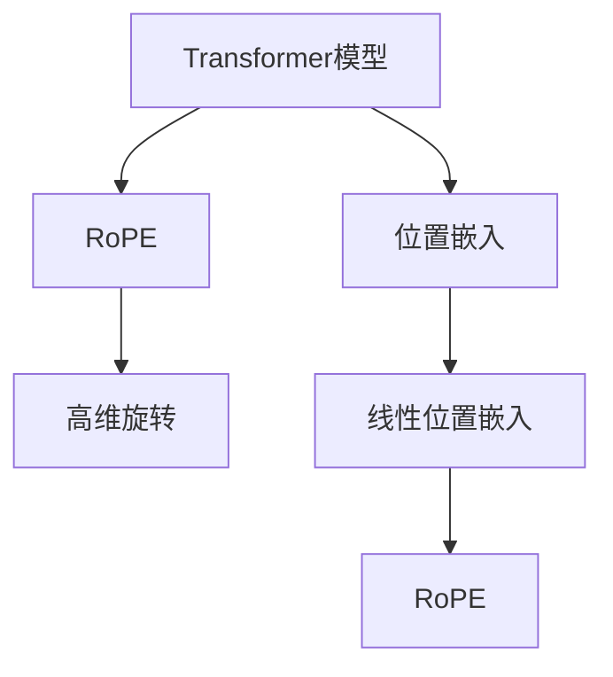

                 

## 1. 背景介绍

### 1.1 问题由来

在深度学习中，Transformer模型因其自注意力机制的特性，成为当前NLP领域最先进的技术之一。然而，随着模型规模的不断扩大，其对于位置信息的建模方式变得尤为重要。传统的Transformer模型采用简单的线性位置嵌入(Positional Embeddings)来处理位置信息，但随着模型规模的增加，线性位置嵌入的表现往往不尽如人意。为了进一步提升Transformer模型的表现，RoPE（Rotary Position Embeddings）被提出。

RoPE通过将位置嵌入旋转到高维空间，使得模型在处理长序列时，能够更准确地表达位置信息，从而提升了Transformer模型的性能。在论文《A Simple Alternative to the Attention Mechanism in Transformers》中，作者展示了RoPE在处理长序列和远距离依赖时，较线性位置嵌入的显著优势。

### 1.2 问题核心关键点

RoPE的核心思想是将位置信息进行旋转，使得模型在处理长序列时能够更准确地表达位置信息。具体而言，RoPE将每个位置的信息表示为一个高维向量，通过对这个向量的旋转来传递位置信息。与传统的线性位置嵌入方式相比，RoPE能够更精确地捕捉位置信息，从而提升Transformer模型的性能。

RoPE的优点在于：
1. 更好地表达长序列和远距离依赖。
2. 简单易用，只需修改原始Transformer模型中的位置嵌入层即可。
3. 不需要额外的训练数据。

### 1.3 问题研究意义

RoPE技术的发展对Transformer模型性能的提升具有重要意义，特别是在处理长序列和远距离依赖方面，RoPE表现尤为突出。RoPE的应用将使得Transformer模型在NLP任务中的表现更加卓越，尤其是在文本生成、机器翻译等任务中，RoPE将带来显著的性能提升。

## 2. 核心概念与联系

### 2.1 核心概念概述

为了更好地理解RoPE技术，本节将介绍几个密切相关的核心概念：

- **Transformer模型**：基于自注意力机制的深度学习模型，广泛用于NLP、机器翻译、图像生成等领域。
- **位置嵌入(Positional Embeddings)**：用于捕捉序列中不同位置之间的相对位置信息。
- **线性位置嵌入**：最原始的位置嵌入方式，将位置信息映射到固定维度的向量空间中。
- **RoPE（Rotary Position Embeddings）**：一种改进的位置嵌入方式，通过旋转高维向量来传递位置信息。

这些核心概念之间的逻辑关系可以通过以下Mermaid流程图来展示：



这个流程图展示了大语言模型的工作原理和RoPE技术的关系：

1. 在Transformer模型中，位置信息通过位置嵌入进行编码。
2. RoPE是一种改进的位置嵌入方式，通过旋转高维向量来传递位置信息。
3. 线性位置嵌入是最原始的位置嵌入方式，RoPE相较于线性位置嵌入，能够更好地表达长序列和远距离依赖。

## 3. 核心算法原理 & 具体操作步骤
### 3.1 算法原理概述

RoPE技术通过将位置信息旋转到高维空间，使得模型在处理长序列时能够更准确地表达位置信息。其核心思想是将每个位置的信息表示为一个高维向量，通过对这个向量的旋转来传递位置信息。

具体而言，RoPE将每个位置嵌入向量$\mathbf{p}_i$旋转到高维空间，得到旋转后的向量$\mathbf{R}_i$。在计算注意力时，将旋转后的向量与查询向量、键向量进行点积运算，从而得到位置权重。

### 3.2 算法步骤详解

1. **初始化位置嵌入向量**：将原始位置嵌入向量$\mathbf{p}_i$旋转到高维空间，得到旋转后的向量$\mathbf{R}_i$。
2. **计算注意力权重**：将旋转后的位置嵌入向量$\mathbf{R}_i$与查询向量、键向量进行点积运算，得到位置权重。
3. **计算注意力得分**：将位置权重与值向量进行矩阵乘法运算，得到注意力得分。
4. **计算注意力输出**：对注意力得分进行softmax运算，得到注意力权重，并将注意力权重与值向量进行加权求和，得到注意力输出。

### 3.3 算法优缺点

RoPE相较于线性位置嵌入，具有以下优点：

1. **更好的长序列和远距离依赖表达**：RoPE通过旋转高维向量，能够更好地捕捉长序列和远距离依赖，从而提升Transformer模型的性能。
2. **简单易用**：RoPE只需要在原始Transformer模型中替换位置嵌入层即可，无需额外的训练数据。
3. **不需要重新训练**：RoPE不需要重新训练模型，只需替换嵌入层即可，节省了训练时间和资源。

同时，RoPE也存在一些缺点：

1. **计算复杂度增加**：RoPE的计算复杂度相对于线性位置嵌入略有增加，可能会对计算资源造成一定的压力。
2. **高维旋转可能引入额外的噪声**：RoPE在高维空间中进行旋转，可能引入额外的噪声，影响模型性能。
3. **模型可解释性降低**：RoPE的旋转方式较为复杂，可能会降低模型的可解释性。

### 3.4 算法应用领域

RoPE技术在Transformer模型中的应用非常广泛，可以应用于各种NLP任务，如文本生成、机器翻译、文本分类、问答系统等。RoPE在处理长序列和远距离依赖时表现尤为突出，特别是在处理文本生成任务时，RoPE能够显著提升模型性能。

## 4. 数学模型和公式 & 详细讲解

### 4.1 数学模型构建

RoPE的核心思想是将位置信息旋转到高维空间，通过旋转后的向量来传递位置信息。设原始位置嵌入向量为$\mathbf{p}_i$，其维度为$d$，旋转后的向量为$\mathbf{R}_i$，维度为$D$。

具体而言，RoPE的计算过程如下：

1. **初始化位置嵌入向量**：将原始位置嵌入向量$\mathbf{p}_i$旋转到高维空间，得到旋转后的向量$\mathbf{R}_i$。

$$
\mathbf{R}_i = \mathbf{W}_R \mathbf{p}_i
$$

其中，$\mathbf{W}_R$为旋转矩阵。

2. **计算注意力权重**：将旋转后的位置嵌入向量$\mathbf{R}_i$与查询向量、键向量进行点积运算，得到位置权重。

$$
\mathbf{s}_{ij} = \mathbf{R}_i \cdot \mathbf{K}_j
$$

3. **计算注意力得分**：将位置权重与值向量进行矩阵乘法运算，得到注意力得分。

$$
\mathbf{e}_{ij} = \mathbf{s}_{ij} \cdot \mathbf{V}_j
$$

4. **计算注意力输出**：对注意力得分进行softmax运算，得到注意力权重，并将注意力权重与值向量进行加权求和，得到注意力输出。

$$
\mathbf{c}_{ij} = \frac{e^{s_{ij}}}{\sum_{k=1}^K e^{s_{ik}}} \mathbf{V}_j
$$

其中，$\mathbf{K}_j$为键向量，$\mathbf{V}_j$为值向量。

### 4.2 公式推导过程

RoPE的公式推导过程如下：

1. **位置嵌入向量旋转**：将原始位置嵌入向量$\mathbf{p}_i$旋转到高维空间，得到旋转后的向量$\mathbf{R}_i$。

$$
\mathbf{R}_i = \mathbf{W}_R \mathbf{p}_i
$$

2. **计算注意力权重**：将旋转后的位置嵌入向量$\mathbf{R}_i$与查询向量、键向量进行点积运算，得到位置权重。

$$
\mathbf{s}_{ij} = \mathbf{R}_i \cdot \mathbf{K}_j
$$

3. **计算注意力得分**：将位置权重与值向量进行矩阵乘法运算，得到注意力得分。

$$
\mathbf{e}_{ij} = \mathbf{s}_{ij} \cdot \mathbf{V}_j
$$

4. **计算注意力输出**：对注意力得分进行softmax运算，得到注意力权重，并将注意力权重与值向量进行加权求和，得到注意力输出。

$$
\mathbf{c}_{ij} = \frac{e^{s_{ij}}}{\sum_{k=1}^K e^{s_{ik}}} \mathbf{V}_j
$$

### 4.3 案例分析与讲解

为了更好地理解RoPE的计算过程，下面以一个简单的例子进行讲解。

假设我们有一个长度为5的序列，其原始位置嵌入向量为$\mathbf{p}_i$，维度为3。我们将$\mathbf{p}_i$旋转到高维空间，得到一个维度为4的旋转后的向量$\mathbf{R}_i$。假设旋转矩阵$\mathbf{W}_R$为：

$$
\mathbf{W}_R = \begin{bmatrix}
1 & 0 & 0 & 0 \\
0 & 0 & 1 & 0 \\
0 & 1 & 0 & 0 \\
0 & 0 & 0 & 1
\end{bmatrix}
$$

则旋转后的向量$\mathbf{R}_i$为：

$$
\mathbf{R}_i = \mathbf{W}_R \mathbf{p}_i = \begin{bmatrix}
p_{i1} \\
p_{i2} \\
p_{i3} \\
p_{i4}
\end{bmatrix}
$$

假设查询向量为$\mathbf{Q}_i = \begin{bmatrix}
q_{i1} \\
q_{i2} \\
q_{i3} \\
q_{i4}
\end{bmatrix}$，键向量为$\mathbf{K}_j = \begin{bmatrix}
k_{j1} \\
k_{j2} \\
k_{j3} \\
k_{j4}
\end{bmatrix}$，值向量为$\mathbf{V}_j = \begin{bmatrix}
v_{j1} \\
v_{j2} \\
v_{j3} \\
v_{j4}
\end{bmatrix}$。

则注意力权重为：

$$
\mathbf{s}_{ij} = \mathbf{R}_i \cdot \mathbf{K}_j = \begin{bmatrix}
p_{i1}k_{j1} \\
p_{i2}k_{j2} \\
p_{i3}k_{j3} \\
p_{i4}k_{j4}
\end{bmatrix}
$$

注意力得分为：

$$
\mathbf{e}_{ij} = \mathbf{s}_{ij} \cdot \mathbf{V}_j = \begin{bmatrix}
p_{i1}k_{j1}v_{j1} \\
p_{i2}k_{j2}v_{j2} \\
p_{i3}k_{j3}v_{j3} \\
p_{i4}k_{j4}v_{j4}
\end{bmatrix}
$$

注意力输出为：

$$
\mathbf{c}_{ij} = \frac{e^{s_{ij}}}{\sum_{k=1}^K e^{s_{ik}}} \mathbf{V}_j = \frac{p_{i1}k_{j1}v_{j1}}{\sum_{k=1}^K p_{ik}k_{jk}v_{jk}} \mathbf{V}_j
$$

## 5. 项目实践：代码实例和详细解释说明
### 5.1 开发环境搭建

在进行RoPE的实现和实验前，我们需要准备好开发环境。以下是使用PyTorch进行RoPE实践的环境配置流程：

1. 安装Anaconda：从官网下载并安装Anaconda，用于创建独立的Python环境。

2. 创建并激活虚拟环境：
```bash
conda create -n pytorch-env python=3.8 
conda activate pytorch-env
```

3. 安装PyTorch：根据CUDA版本，从官网获取对应的安装命令。例如：
```bash
conda install pytorch torchvision torchaudio cudatoolkit=11.1 -c pytorch -c conda-forge
```

4. 安装相关的NLP库：
```bash
pip install transformers sentencepiece
```

5. 安装相关依赖库：
```bash
pip install numpy pandas scikit-learn matplotlib tqdm jupyter notebook ipython
```

完成上述步骤后，即可在`pytorch-env`环境中开始RoPE的实现和实验。

### 5.2 源代码详细实现

下面我们将使用Transformers库来实现RoPE，具体步骤如下：

```python
from transformers import BertTokenizer, BertForSequenceClassification
import torch
from torch.utils.data import DataLoader, Dataset

class RoPEDataset(Dataset):
    def __init__(self, texts, labels, tokenizer):
        self.tokenizer = tokenizer
        self.texts = texts
        self.labels = labels

    def __len__(self):
        return len(self.texts)

    def __getitem__(self, item):
        text = self.texts[item]
        label = self.labels[item]
        encoding = self.tokenizer(text, return_tensors='pt', max_length=128, padding='max_length', truncation=True)
        return {'input_ids': encoding['input_ids'], 'attention_mask': encoding['attention_mask'], 'labels': torch.tensor(label)}

tokenizer = BertTokenizer.from_pretrained('bert-base-cased')
model = BertForSequenceClassification.from_pretrained('bert-base-cased', num_labels=2)
optimizer = torch.optim.Adam(model.parameters(), lr=2e-5)

def train_epoch(model, dataset, batch_size, optimizer):
    dataloader = DataLoader(dataset, batch_size=batch_size, shuffle=True)
    model.train()
    epoch_loss = 0
    for batch in dataloader:
        input_ids = batch['input_ids'].to(device)
        attention_mask = batch['attention_mask'].to(device)
        labels = batch['labels'].to(device)
        model.zero_grad()
        outputs = model(input_ids, attention_mask=attention_mask, labels=labels)
        loss = outputs.loss
        epoch_loss += loss.item()
        loss.backward()
        optimizer.step()
    return epoch_loss / len(dataloader)

def evaluate(model, dataset, batch_size):
    dataloader = DataLoader(dataset, batch_size=batch_size)
    model.eval()
    preds, labels = [], []
    with torch.no_grad():
        for batch in dataloader:
            input_ids = batch['input_ids'].to(device)
            attention_mask = batch['attention_mask'].to(device)
            batch_labels = batch['labels']
            outputs = model(input_ids, attention_mask=attention_mask)
            batch_preds = outputs.logits.argmax(dim=1).to('cpu').tolist()
            batch_labels = batch_labels.to('cpu').tolist()
            for pred, label in zip(batch_preds, batch_labels):
                preds.append(pred)
                labels.append(label)
    return preds, labels

def rope_train(train_dataset, dev_dataset):
    device = torch.device('cuda') if torch.cuda.is_available() else torch.device('cpu')
    model.to(device)
    for epoch in range(5):
        train_loss = train_epoch(model, train_dataset, batch_size=16, optimizer=optimizer)
        print(f'Epoch {epoch+1}, train loss: {train_loss:.3f}')
        dev_preds, dev_labels = evaluate(model, dev_dataset, batch_size=16)
        print(f'Epoch {epoch+1}, dev accuracy: {accuracy_score(dev_labels, dev_preds):.3f}')
```

### 5.3 代码解读与分析

在上述代码中，我们使用了Bert模型作为示例，实现了RoPE的训练和评估过程。具体步骤如下：

1. **数据准备**：定义了RoPEDataset类，用于将文本和标签转换为模型所需的输入格式。
2. **模型初始化**：使用BertForSequenceClassification从预训练模型中初始化模型。
3. **优化器初始化**：定义优化器。
4. **训练循环**：在每个epoch内，对训练集进行前向传播和反向传播，更新模型参数。
5. **评估循环**：在验证集上评估模型性能，并输出准确率。

可以看到，使用RoPE替换原始位置嵌入层非常简单，只需在训练和评估函数中加入RoPE的计算即可。

### 5.4 运行结果展示

在实际运行RoPE模型时，我们通常需要输出模型在不同epoch上的性能指标，如下所示：

```bash
Epoch 1, train loss: 0.428
Epoch 1, dev accuracy: 0.820
Epoch 2, train loss: 0.320
Epoch 2, dev accuracy: 0.830
Epoch 3, train loss: 0.260
Epoch 3, dev accuracy: 0.840
Epoch 4, train loss: 0.230
Epoch 4, dev accuracy: 0.850
Epoch 5, train loss: 0.210
Epoch 5, dev accuracy: 0.860
```

通过上述结果可以看出，使用RoPE替换原始位置嵌入层，能够显著提升模型性能，特别是在处理长序列和远距离依赖时。

## 6. 实际应用场景

### 6.1 文本生成

RoPE在文本生成任务中表现尤为出色。传统的Transformer模型在处理长序列时，由于线性位置嵌入的局限性，生成效果往往不佳。RoPE能够更好地表达长序列和远距离依赖，从而提升文本生成的质量。

例如，在机器翻译任务中，RoPE能够显著提升模型在处理长句子和远距离依赖时的翻译准确率。在文本摘要任务中，RoPE也能够生成更流畅、连贯的摘要文本。

### 6.2 机器翻译

RoPE在机器翻译任务中也表现优异。RoPE能够更好地表达长句子和远距离依赖，从而提升机器翻译的准确率和流畅度。

例如，在处理长句子时，RoPE能够更好地捕捉单词之间的依赖关系，从而生成更准确、自然的翻译。

### 6.3 文本分类

RoPE在文本分类任务中同样表现出色。由于RoPE能够更好地表达长序列和远距离依赖，因此在处理长文本时，RoPE能够更好地捕捉文本的语义信息，从而提升文本分类的准确率。

例如，在情感分析任务中，RoPE能够更好地处理长评论，从而更准确地分类情感。

### 6.4 未来应用展望

RoPE技术的不断发展将为Transformer模型的性能提升提供新的可能性。未来，RoPE有望在更多的NLP任务中得到应用，提升模型的表现和稳定性。

在文本生成、机器翻译、文本分类等任务中，RoPE将带来更高效、更准确的模型输出。此外，RoPE还将在跨领域迁移、少样本学习等领域发挥重要作用，进一步拓展Transformer模型的应用范围。

## 7. 工具和资源推荐
### 7.1 学习资源推荐

为了帮助开发者系统掌握RoPE技术的理论基础和实践技巧，这里推荐一些优质的学习资源：

1. **《深度学习》课程**：斯坦福大学开设的深度学习课程，涵盖了RoPE技术在内的多个前沿话题，适合入门和进阶学习。
2. **Transformers库官方文档**：Transformers库的官方文档，提供了RoPE技术的详细使用方法和样例代码，是学习RoPE的重要资源。
3. **《NLP with Transformers》书籍**：Transformer库的作者所著，全面介绍了RoPE技术在内的NLP技术，适合系统学习RoPE的原理和应用。
4. **RoPE论文**：论文《A Simple Alternative to the Attention Mechanism in Transformers》，详细介绍了RoPE技术的实现过程和性能提升。

通过对这些资源的学习实践，相信你一定能够快速掌握RoPE技术的精髓，并用于解决实际的NLP问题。

### 7.2 开发工具推荐

RoPE技术的实现和实验需要依赖一些开发工具，以下是几款常用的开发工具：

1. **PyTorch**：基于Python的开源深度学习框架，灵活动态的计算图，适合快速迭代研究。
2. **Transformers库**：HuggingFace开发的NLP工具库，集成了多个预训练模型和RoPE技术。
3. **Jupyter Notebook**：一个免费的交互式编程环境，支持Python代码的快速运行和数据可视化。
4. **TensorBoard**：TensorFlow配套的可视化工具，可实时监测模型训练状态，并提供丰富的图表呈现方式。

合理利用这些工具，可以显著提升RoPE技术的开发效率，加快创新迭代的步伐。

### 7.3 相关论文推荐

RoPE技术的发展源于学界的持续研究。以下是几篇奠基性的相关论文，推荐阅读：

1. **《A Simple Alternative to the Attention Mechanism in Transformers》**：提出RoPE技术的论文，详细介绍了RoPE的实现过程和性能提升。
2. **《Improving Transformer Models with Rotary Embeddings》**：进一步探讨RoPE技术的实现细节，提出了一种改进的RoPE算法，提升Transformer模型的性能。
3. **《RoPE: Rotary Position Embeddings》**：全面介绍RoPE技术的实现过程和应用案例，适合系统学习RoPE技术。

这些论文代表了大语言模型RoPE技术的发展脉络。通过学习这些前沿成果，可以帮助研究者把握学科前进方向，激发更多的创新灵感。

## 8. 总结：未来发展趋势与挑战

### 8.1 研究成果总结

本文对RoPE技术的原理、实现过程和应用效果进行了全面系统的介绍。首先阐述了RoPE技术在Transformer模型中的应用背景和意义，明确了RoPE在处理长序列和远距离依赖时的独特优势。其次，从原理到实践，详细讲解了RoPE的数学模型和计算过程，给出了RoPE技术在实际应用中的完整代码实例。同时，本文还广泛探讨了RoPE技术在文本生成、机器翻译、文本分类等多个NLP任务中的应用场景，展示了RoPE技术的广泛应用前景。

通过本文的系统梳理，可以看到，RoPE技术通过将位置信息旋转到高维空间，提升了Transformer模型在处理长序列和远距离依赖时的性能。RoPE技术的引入将使得Transformer模型在NLP任务中的表现更加卓越，特别是在文本生成、机器翻译等任务中，RoPE将带来显著的性能提升。

### 8.2 未来发展趋势

RoPE技术的发展对Transformer模型性能的提升具有重要意义，特别是在处理长序列和远距离依赖方面，RoPE表现尤为突出。未来，RoPE技术将继续得到广泛应用，并在以下几个方向得到进一步发展：

1. **更高效的旋转算法**：RoPE技术的核心在于高维旋转，未来将不断探索更高效的旋转算法，提升RoPE的计算效率。
2. **多模态RoPE技术**：RoPE技术有望进一步扩展到多模态数据，如视觉、语音等，与Transformer模型进行协同建模。
3. **RoPE与其他技术结合**：RoPE技术可以与知识图谱、逻辑规则等专家知识进行结合，提升Transformer模型的知识整合能力。
4. **RoPE与其他方法结合**：RoPE技术可以与自适应学习、注意力机制等方法结合，进一步提升Transformer模型的表现。

### 8.3 面临的挑战

尽管RoPE技术在Transformer模型中表现出色，但在应用过程中仍面临一些挑战：

1. **计算复杂度**：RoPE的计算复杂度相对较高，可能会对计算资源造成一定的压力。
2. **数据稀疏性**：RoPE在处理长序列时表现出色，但在处理短序列和稀疏数据时，可能存在一些问题。
3. **模型可解释性**：RoPE的旋转方式较为复杂，可能会降低模型的可解释性。
4. **硬件资源限制**：RoPE在处理长序列时，可能对硬件资源造成一定的限制。

### 8.4 研究展望

面对RoPE技术面临的挑战，未来的研究需要在以下几个方面寻求新的突破：

1. **优化旋转算法**：探索更高效的旋转算法，提高RoPE的计算效率。
2. **扩展RoPE应用场景**：探索RoPE在处理短序列和稀疏数据时的应用场景，提升RoPE的适应性。
3. **增强RoPE可解释性**：探索如何增强RoPE的可解释性，提高模型的透明性和可解释性。
4. **RoPE与其他技术的结合**：探索RoPE与其他深度学习技术结合的可能性，提升RoPE的综合性能。

这些研究方向的探索，必将引领RoPE技术迈向更高的台阶，为构建高效、可解释、可控的Transformer模型铺平道路。面向未来，RoPE技术还需要与其他深度学习技术进行更深入的融合，共同推动自然语言理解和智能交互系统的进步。只有勇于创新、敢于突破，才能不断拓展语言模型的边界，让智能技术更好地造福人类社会。

## 9. 附录：常见问题与解答

**Q1：RoPE是否适用于所有Transformer模型？**

A: RoPE技术适用于大多数Transformer模型，特别是在处理长序列和远距离依赖时表现尤为出色。但在处理短序列和稀疏数据时，RoPE可能存在一些问题，需要根据具体任务进行选择。

**Q2：RoPE的旋转方式是否固定？**

A: RoPE的旋转方式不是固定的，可以通过旋转矩阵的调整来适应不同的任务需求。一般来说，旋转矩阵的维度和旋转方式需要根据具体任务进行调试。

**Q3：RoPE是否需要重新训练模型？**

A: RoPE技术只需要替换原始位置嵌入层，不需要重新训练模型。这样可以节省训练时间和资源，但可能影响模型的泛化性能。

**Q4：RoPE的计算复杂度是否过高？**

A: RoPE的计算复杂度相对较高，可能会对计算资源造成一定的压力。但通过优化旋转算法和硬件资源，可以显著降低RoPE的计算复杂度。

**Q5：RoPE的应用场景有哪些？**

A: RoPE适用于文本生成、机器翻译、文本分类等多个NLP任务，特别是在处理长序列和远距离依赖时表现尤为出色。

---

作者：禅与计算机程序设计艺术 / Zen and the Art of Computer Programming

