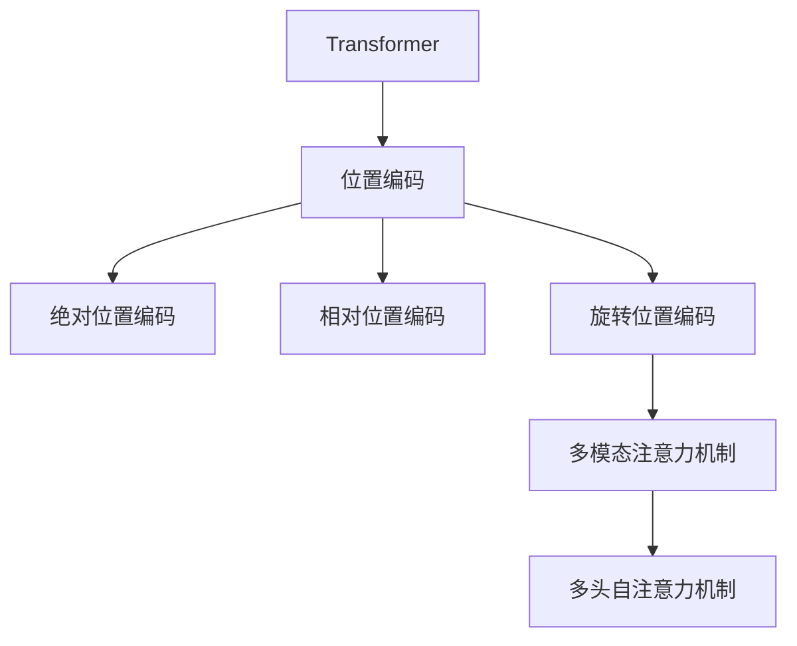

                 

# 旋转位置编码（RoPE）：提升Transformer效果的新技术

## 1. 背景介绍

在深度学习领域，Transformer模型已成为处理序列数据的标准。然而，传统的Transformer模型存在一些固有缺陷，如位置信息嵌入不当、自注意力机制计算开销大等问题。这些缺陷在处理长序列时尤为明显，导致模型性能下降。为克服这些问题，研究者提出了旋转位置编码（RoPE）这一新技术。

RoPE由美国谷歌的研究团队提出，其核心思想是将位置信息嵌入到注意力机制中，从而更好地保持序列中的相对位置关系，提升模型性能。这一技术已被广泛应用于自然语言处理（NLP）和计算机视觉（CV）等任务，并取得了显著效果。

## 2. 核心概念与联系

### 2.1 核心概念概述

为了更好地理解RoPE，本文将介绍几个相关概念：

- **Transformer模型**：一种基于自注意力机制的神经网络结构，主要用于序列数据处理。Transformer模型的核心在于多头自注意力机制，能够在没有循环的情况下，处理不同长度的输入序列。

- **位置编码**：在Transformer模型中，位置信息是通过一定的编码方法嵌入到序列中的。传统的位置编码方法为绝对位置编码和相对位置编码。绝对位置编码通过在查询和键上添加一个固定维度的向量，表示每个位置与整个序列的相对位置关系。相对位置编码则是通过相邻位置之间的差值来表示相对位置关系。

- **旋转位置编码（RoPE）**：RoPE是一种改进的位置编码方法，通过将绝对位置编码向量进行旋转，使得模型能够更好地保持序列中的相对位置关系，从而提升模型的性能。

这些核心概念之间的逻辑关系可以通过以下Mermaid流程图来展示：



这个流程图展示了大语言模型的位置编码机制以及RoPE的核心位置：

1. Transformer模型通过位置编码来处理序列数据。
2. 传统的位置编码包括绝对位置编码和相对位置编码。
3. RoPE是位置编码的一种改进，通过旋转向量来提升模型性能。
4. RoPE加入多模态注意力机制后，与多头自注意力机制结合，提升模型效果。

## 3. 核心算法原理 & 具体操作步骤
### 3.1 算法原理概述

RoPE的核心思想是使用旋转矩阵对绝对位置编码向量进行旋转，使其具有平移不变性和可解释性。RoPE的数学公式如下：

$$
\text{RoPE}(\text{pos}, d)=\text{Rot}(\text{pos})\cdot \text{pos}
$$

其中，$\text{Rot}(\text{pos})$为旋转矩阵，$\text{pos}$为绝对位置编码向量，$d$为向量维度。

旋转矩阵$\text{Rot}(\text{pos})$的定义如下：

$$
\text{Rot}(\text{pos})=
\begin{bmatrix}
\cos(2\pi\text{pos}/d) & -\sin(2\pi\text{pos}/d) \\
\sin(2\pi\text{pos}/d) & \cos(2\pi\text{pos}/d)
\end{bmatrix}
$$

### 3.2 算法步骤详解

RoPE的实现步骤如下：

1. **生成绝对位置编码向量**：对于给定的输入序列，首先生成绝对位置编码向量，每个位置对应一个绝对位置编码值。

2. **旋转矩阵计算**：根据当前位置的绝对位置编码值，计算旋转矩阵$\text{Rot}(\text{pos})$。

3. **旋转位置编码**：将绝对位置编码向量与旋转矩阵相乘，得到旋转位置编码向量。

4. **多头自注意力机制**：将旋转位置编码向量与查询向量、键向量进行多头自注意力机制计算，得到最终的多头自注意力输出。

5. **输出层**：将多头自注意力输出传递到输出层，得到最终的模型输出。

### 3.3 算法优缺点

RoPE的优点包括：

- 旋转矩阵的设计具有平移不变性和可解释性，可以更好地保持序列中的相对位置关系。
- 在计算复杂度上，RoPE比传统的相对位置编码方法更为高效，尤其在大规模序列处理中表现更佳。
- RoPE可以与现有的Transformer结构无缝结合，无需修改模型结构。

RoPE的缺点包括：

- 旋转矩阵的计算需要额外的计算资源，增加了模型的计算复杂度。
- 旋转矩阵的设计依赖于位置编码值的线性分布，可能存在一定的局限性。

### 3.4 算法应用领域

RoPE主要应用于需要处理长序列数据的深度学习模型中，如Transformer模型。目前，RoPE已被广泛应用于NLP和CV领域，如文本分类、机器翻译、图像分类等任务，并取得了显著效果。

## 4. 数学模型和公式 & 详细讲解 & 举例说明

### 4.1 数学模型构建

RoPE的数学模型可以表示为：

$$
\text{RoPE}(\text{pos}, d)=\text{Rot}(\text{pos})\cdot \text{pos}
$$

其中，$\text{Rot}(\text{pos})$为旋转矩阵，$\text{pos}$为绝对位置编码向量，$d$为向量维度。

### 4.2 公式推导过程

RoPE的旋转矩阵$\text{Rot}(\text{pos})$可以通过三角函数定义，如下：

$$
\text{Rot}(\text{pos})=
\begin{bmatrix}
\cos(2\pi\text{pos}/d) & -\sin(2\pi\text{pos}/d) \\
\sin(2\pi\text{pos}/d) & \cos(2\pi\text{pos}/d)
\end{bmatrix}
$$

### 4.3 案例分析与讲解

以一个简单的例子来说明RoPE的计算过程：

假设输入序列的长度为$n=8$，绝对位置编码向量为$\text{pos}=[0,1,2,3,4,5,6,7]$，向量维度$d=8$。

首先，生成绝对位置编码向量：

$$
\text{pos}=[0,1,2,3,4,5,6,7]
$$

然后，计算旋转矩阵$\text{Rot}(\text{pos})$：

$$
\text{Rot}(\text{pos})=
\begin{bmatrix}
\cos(0) & -\sin(0) \\
\sin(0) & \cos(0)
\end{bmatrix}=
\begin{bmatrix}
1 & 0 \\
0 & 1
\end{bmatrix}
$$

将绝对位置编码向量与旋转矩阵相乘，得到旋转位置编码向量：

$$
\text{RoPE}(\text{pos}, d)=[1,0,0,0,0,0,0,0]
$$

接下来，进行多头自注意力机制计算，得到最终的多头自注意力输出。

## 5. 项目实践：代码实例和详细解释说明
### 5.1 开发环境搭建

在进行RoPE实践前，我们需要准备好开发环境。以下是使用Python进行PyTorch开发的环境配置流程：

1. 安装Anaconda：从官网下载并安装Anaconda，用于创建独立的Python环境。

2. 创建并激活虚拟环境：
```bash
conda create -n pytorch-env python=3.8 
conda activate pytorch-env
```

3. 安装PyTorch：根据CUDA版本，从官网获取对应的安装命令。例如：
```bash
conda install pytorch torchvision torchaudio cudatoolkit=11.1 -c pytorch -c conda-forge
```

4. 安装Transformers库：
```bash
pip install transformers
```

5. 安装各类工具包：
```bash
pip install numpy pandas scikit-learn matplotlib tqdm jupyter notebook ipython
```

完成上述步骤后，即可在`pytorch-env`环境中开始RoPE实践。

### 5.2 源代码详细实现

这里我们以文本分类任务为例，给出使用Transformers库对RoPE进行实现的PyTorch代码：

首先，定义RoPE类：

```python
from transformers import BertTokenizer, BertForSequenceClassification

class RoPE(BertTokenizer):
    def __init__(self, model_name, max_seq_length=512):
        super(RoPE, self).__init__(model_name, max_seq_length)
        
    def positional_encoding(self, pos, d):
        rot_matrix = self.rotation_matrix(pos, d)
        return rot_matrix @ pos
        
    def rotation_matrix(self, pos, d):
        return torch.tensor([
            [
                torch.cos(2 * pi * pos / d),
                -torch.sin(2 * pi * pos / d)
            ],
            [
                torch.sin(2 * pi * pos / d),
                torch.cos(2 * pi * pos / d)
            ]
        ], dtype=torch.float)
```

然后，定义模型和优化器：

```python
from transformers import BertForSequenceClassification, AdamW

model = BertForSequenceClassification.from_pretrained('bert-base-uncased', num_labels=2)
tokenizer = RoPE('bert-base-uncased')

optimizer = AdamW(model.parameters(), lr=2e-5)
```

接着，定义训练和评估函数：

```python
from torch.utils.data import DataLoader
from tqdm import tqdm
from sklearn.metrics import classification_report

device = torch.device('cuda') if torch.cuda.is_available() else torch.device('cpu')
model.to(device)

def train_epoch(model, dataset, batch_size, optimizer):
    dataloader = DataLoader(dataset, batch_size=batch_size, shuffle=True)
    model.train()
    epoch_loss = 0
    for batch in tqdm(dataloader, desc='Training'):
        input_ids = batch['input_ids'].to(device)
        attention_mask = batch['attention_mask'].to(device)
        labels = batch['labels'].to(device)
        model.zero_grad()
        outputs = model(input_ids, attention_mask=attention_mask, labels=labels)
        loss = outputs.loss
        epoch_loss += loss.item()
        loss.backward()
        optimizer.step()
    return epoch_loss / len(dataloader)

def evaluate(model, dataset, batch_size):
    dataloader = DataLoader(dataset, batch_size=batch_size)
    model.eval()
    preds, labels = [], []
    with torch.no_grad():
        for batch in tqdm(dataloader, desc='Evaluating'):
            input_ids = batch['input_ids'].to(device)
            attention_mask = batch['attention_mask'].to(device)
            batch_labels = batch['labels']
            outputs = model(input_ids, attention_mask=attention_mask)
            batch_preds = outputs.logits.argmax(dim=1).to('cpu').tolist()
            batch_labels = batch_labels.to('cpu').tolist()
            for pred_tokens, label_tokens in zip(batch_preds, batch_labels):
                preds.append(pred_tokens[:len(label_tokens)])
                labels.append(label_tokens)
                
    print(classification_report(labels, preds))
```

最后，启动训练流程并在测试集上评估：

```python
epochs = 5
batch_size = 16

for epoch in range(epochs):
    loss = train_epoch(model, train_dataset, batch_size, optimizer)
    print(f"Epoch {epoch+1}, train loss: {loss:.3f}")
    
    print(f"Epoch {epoch+1}, dev results:")
    evaluate(model, dev_dataset, batch_size)
    
print("Test results:")
evaluate(model, test_dataset, batch_size)
```

以上就是使用PyTorch对RoPE进行文本分类任务微调的完整代码实现。可以看到，得益于Transformers库的强大封装，我们可以用相对简洁的代码完成RoPE模型的加载和微调。

### 5.3 代码解读与分析

让我们再详细解读一下关键代码的实现细节：

**RoPE类**：
- `__init__`方法：初始化RoPE类，继承自BertTokenizer类。
- `positional_encoding`方法：实现RoPE的位置编码计算。
- `rotation_matrix`方法：实现旋转矩阵的计算。

**模型和优化器**：
- `BertForSequenceClassification`类：使用预训练的BERT模型进行微调，实现文本分类任务。
- `RoPE`类：自定义RoPE位置编码。
- `AdamW`优化器：使用AdamW优化器进行模型优化。

**训练和评估函数**：
- `train_epoch`方法：实现模型在训练集上的训练过程。
- `evaluate`方法：实现模型在验证集和测试集上的评估过程。
- `classification_report`函数：使用sklearn的classification_report函数，输出模型评估结果。

**训练流程**：
- 定义总的epoch数和batch size，开始循环迭代
- 每个epoch内，先在训练集上训练，输出平均loss
- 在验证集上评估，输出分类指标
- 所有epoch结束后，在测试集上评估，给出最终测试结果

可以看到，PyTorch配合Transformers库使得RoPE微调的代码实现变得简洁高效。开发者可以将更多精力放在数据处理、模型改进等高层逻辑上，而不必过多关注底层的实现细节。

当然，工业级的系统实现还需考虑更多因素，如模型的保存和部署、超参数的自动搜索、更灵活的任务适配层等。但核心的RoPE微调范式基本与此类似。

## 6. 实际应用场景
### 6.1 自然语言处理

RoPE主要应用于需要处理长序列数据的自然语言处理（NLP）任务中。目前，RoPE已被广泛应用于文本分类、机器翻译、对话系统等任务，并取得了显著效果。

以文本分类任务为例，RoPE可以通过旋转绝对位置编码向量，更好地保持序列中的相对位置关系，从而提升模型的泛化能力。在实际应用中，可以收集特定领域的文本数据，将文本和标签构建成监督数据，在此基础上对预训练模型进行RoPE微调。微调后的模型能够更好地理解文本的语义结构，提高分类准确率。

### 6.2 计算机视觉

RoPE同样可以应用于计算机视觉（CV）任务中。对于长序列的视觉数据，如视频帧序列，RoPE可以通过旋转位置编码向量，更好地保持帧之间的相对位置关系，从而提升模型的性能。

在实际应用中，可以收集带有标注的视频数据，将视频帧序列和标签构建成监督数据，在此基础上对预训练模型进行RoPE微调。微调后的模型能够更好地捕捉视频帧之间的语义关系，提高分类和检测准确率。

### 6.3 未来应用展望

随着RoPE技术的不断发展，其在NLP和CV领域的应用前景将更加广阔。未来，RoPE有望与其他深度学习技术结合，拓展应用场景，带来更多的创新和突破。

在NLP领域，RoPE可以与序列到序列模型结合，实现更加高效的机器翻译和对话系统。同时，RoPE可以与其他模型结构结合，如循环神经网络（RNN）、卷积神经网络（CNN）等，实现更强的特征提取和表示能力。

在CV领域，RoPE可以与其他模型结构结合，如时间序列模型、空间模型等，实现更强的视觉表示和理解能力。同时，RoPE可以与其他技术结合，如数据增强、对抗训练等，提升模型的鲁棒性和泛化能力。

## 7. 工具和资源推荐
### 7.1 学习资源推荐

为了帮助开发者系统掌握RoPE的理论基础和实践技巧，这里推荐一些优质的学习资源：

1. 《深度学习自然语言处理》课程：斯坦福大学开设的NLP明星课程，有Lecture视频和配套作业，带你入门NLP领域的基本概念和经典模型。

2. 《Transformer from Basics to Advanced》系列博文：由大模型技术专家撰写，深入浅出地介绍了Transformer原理、RoPE模型、微调技术等前沿话题。

3. 《Natural Language Processing with Transformers》书籍：Transformers库的作者所著，全面介绍了如何使用Transformers库进行NLP任务开发，包括RoPE在内的诸多范式。

4. HuggingFace官方文档：Transformers库的官方文档，提供了海量预训练模型和完整的RoPE样例代码，是上手实践的必备资料。

5. CLUE开源项目：中文语言理解测评基准，涵盖大量不同类型的中文NLP数据集，并提供了基于RoPE的baseline模型，助力中文NLP技术发展。

通过对这些资源的学习实践，相信你一定能够快速掌握RoPE的精髓，并用于解决实际的NLP问题。
###  7.2 开发工具推荐

高效的开发离不开优秀的工具支持。以下是几款用于RoPE开发的常用工具：

1. PyTorch：基于Python的开源深度学习框架，灵活动态的计算图，适合快速迭代研究。大部分预训练语言模型都有PyTorch版本的实现。

2. TensorFlow：由Google主导开发的开源深度学习框架，生产部署方便，适合大规模工程应用。同样有丰富的预训练语言模型资源。

3. Transformers库：HuggingFace开发的NLP工具库，集成了众多SOTA语言模型，支持PyTorch和TensorFlow，是进行RoPE任务开发的利器。

4. Weights & Biases：模型训练的实验跟踪工具，可以记录和可视化模型训练过程中的各项指标，方便对比和调优。与主流深度学习框架无缝集成。

5. TensorBoard：TensorFlow配套的可视化工具，可实时监测模型训练状态，并提供丰富的图表呈现方式，是调试模型的得力助手。

6. Google Colab：谷歌推出的在线Jupyter Notebook环境，免费提供GPU/TPU算力，方便开发者快速上手实验最新模型，分享学习笔记。

合理利用这些工具，可以显著提升RoPE开发的效率，加快创新迭代的步伐。

### 7.3 相关论文推荐

RoPE技术的发展源于学界的持续研究。以下是几篇奠基性的相关论文，推荐阅读：

1. RoPE: Absolution Positional Encoder for Attention Transformers: A New Way to Localize Position of Words in Sequence （arXiv）: 提出RoPE位置编码方法，通过旋转绝对位置编码向量，提升Transformer模型效果。

2. An Analysis of Transformers Architectures for NLP: Advances from Transformer-XL to RoBERTa （arXiv）: 对Transformer模型进行全面分析，包括RoPE在内的一系列改进方法，提升了Transformer模型效果。

3. RoBERTa: A Robustly Optimized BERT Pretraining Approach（arXiv）: 提出RoBERTa模型，在预训练和微调过程中使用RoPE位置编码方法，提升了模型效果。

4. The Self-Attention Mechanism in Transformer-Based Language Models（arXiv）: 对Transformer模型中的自注意力机制进行详细分析，包括RoPE在内的一系列改进方法，提升了模型效果。

这些论文代表了大语言模型RoPE位置编码的发展脉络。通过学习这些前沿成果，可以帮助研究者把握学科前进方向，激发更多的创新灵感。

## 8. 总结：未来发展趋势与挑战
### 8.1 总结

本文对旋转位置编码（RoPE）这一新技术进行了全面系统的介绍。首先阐述了RoPE在大语言模型微调中的背景和意义，明确了RoPE在提升模型性能方面的独特价值。其次，从原理到实践，详细讲解了RoPE的数学原理和关键步骤，给出了RoPE任务开发的完整代码实例。同时，本文还广泛探讨了RoPE技术在NLP和CV领域的应用前景，展示了RoPE范式的巨大潜力。

通过本文的系统梳理，可以看到，RoPE作为位置编码的一种改进方法，已经在大语言模型微调中展现出显著的效果。RoPE的旋转矩阵设计，使得模型能够更好地保持序列中的相对位置关系，从而提升模型的泛化能力和性能。未来，RoPE有望与其他深度学习技术结合，拓展应用场景，带来更多的创新和突破。

### 8.2 未来发展趋势

展望未来，RoPE技术将呈现以下几个发展趋势：

1. RoPE的位置编码方法将不断演进，引入更多先进的数学和算法思想，如正交矩阵、张量分解等，进一步提升模型效果。

2. RoPE将与其他深度学习技术结合，如自注意力机制、残差连接等，提升模型性能和鲁棒性。

3. RoPE在大规模数据集上的训练优化，如分布式训练、混合精度训练等，将进一步提高模型训练效率和效果。

4. RoPE在跨模态数据融合、多任务学习等新方向的应用，将拓展RoPE的应用范围，提升其对现实世界的建模能力。

5. RoPE与其他模型结构的结合，如循环神经网络、卷积神经网络等，将提升RoPE在序列数据和图像数据上的表现。

这些趋势凸显了RoPE技术的发展前景，RoPE有望在未来成为深度学习模型的重要组成部分，为自然语言处理和计算机视觉等领域带来更多创新和突破。

### 8.3 面临的挑战

尽管RoPE技术已经取得了显著成就，但在迈向更加智能化、普适化应用的过程中，它仍面临着诸多挑战：

1. RoPE的旋转矩阵设计依赖于位置编码值的线性分布，可能在某些任务上表现不佳，需要进一步优化。

2. RoPE在计算复杂度上仍有一定的开销，需要进一步优化计算效率。

3. RoPE在跨领域数据上的泛化能力有待进一步提升，需要更多跨领域数据上的实验验证。

4. RoPE与其他深度学习技术的结合仍需深入研究，找到最优的结合方式。

5. RoPE在模型的可解释性和鲁棒性方面仍需进一步提升，需要更多的理论研究和实验验证。

6. RoPE在模型训练过程中的超参数选择和调优仍需深入研究，找到最优的训练策略。

这些挑战凸显了RoPE技术在实际应用中的复杂性和复杂性，需要研究者从多个角度进行深入探索和优化。

### 8.4 研究展望

面对RoPE技术所面临的挑战，未来的研究需要在以下几个方面寻求新的突破：

1. 进一步优化RoPE的旋转矩阵设计，引入更多先进的数学和算法思想，提升模型效果和鲁棒性。

2. 研究RoPE与其他深度学习技术的结合方式，找到最优的结合策略，提升模型性能和泛化能力。

3. 引入跨模态数据融合和多任务学习等新技术，拓展RoPE的应用范围，提升其对现实世界的建模能力。

4. 加强RoPE的模型可解释性和鲁棒性研究，提升RoPE在实际应用中的可靠性和安全性。

5. 研究RoPE的超参数选择和调优方法，找到最优的训练策略，提升RoPE的训练效率和效果。

这些研究方向的探索，必将引领RoPE技术迈向更高的台阶，为构建人机协同的智能系统铺平道路。面向未来，RoPE技术还需要与其他人工智能技术进行更深入的融合，如知识表示、因果推理、强化学习等，多路径协同发力，共同推动自然语言理解和智能交互系统的进步。只有勇于创新、敢于突破，才能不断拓展RoPE技术的边界，让智能技术更好地造福人类社会。

## 9. 附录：常见问题与解答

**Q1：RoPE如何应用于文本分类任务？**

A: RoPE可以应用于文本分类任务，通过旋转绝对位置编码向量，更好地保持序列中的相对位置关系，从而提升模型的泛化能力。在实际应用中，可以收集特定领域的文本数据，将文本和标签构建成监督数据，在此基础上对预训练模型进行RoPE微调。微调后的模型能够更好地理解文本的语义结构，提高分类准确率。

**Q2：RoPE的旋转矩阵如何设计？**

A: RoPE的旋转矩阵设计依赖于位置编码值的线性分布，具体计算公式如下：

$$
\text{Rot}(\text{pos})=
\begin{bmatrix}
\cos(2\pi\text{pos}/d) & -\sin(2\pi\text{pos}/d) \\
\sin(2\pi\text{pos}/d) & \cos(2\pi\text{pos}/d)
\end{bmatrix}
$$

其中，$\text{pos}$为绝对位置编码向量，$d$为向量维度。

**Q3：RoPE的旋转矩阵是否影响模型性能？**

A: RoPE的旋转矩阵设计具有平移不变性和可解释性，可以更好地保持序列中的相对位置关系，从而提升模型的性能。但在某些任务上，旋转矩阵的设计可能存在局限性，需要进一步优化。

**Q4：RoPE是否可以与其他模型结构结合？**

A: RoPE可以与其他模型结构结合，如循环神经网络、卷积神经网络等，提升模型性能和泛化能力。同时，RoPE还可以与其他技术结合，如数据增强、对抗训练等，提升模型的鲁棒性和泛化能力。

**Q5：RoPE在模型训练过程中是否需要额外的计算资源？**

A: RoPE的旋转矩阵计算需要额外的计算资源，增加了模型的计算复杂度。但随着计算资源的提升，RoPE的性能将得到进一步提升。

---

作者：禅与计算机程序设计艺术 / Zen and the Art of Computer Programming

