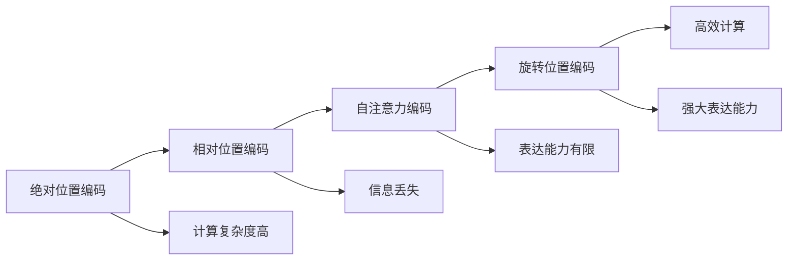

                 

# 旋转位置编码（RoPE）：提升Transformer效果的新技术

## 1. 背景介绍

在NLP领域，Transformer模型因其卓越的性能而广受关注。其中，位置编码机制是其核心部分之一。然而，传统的位置编码方法——绝对位置编码（Absolute Positional Encoding, APE）存在一定局限性，尤其是当序列长度增加时，该方法往往会导致信息丢失和冗余。为了解决这一问题，研究者们提出了多种改进方案，包括相对位置编码（Relative Positional Encoding, RPE）和自注意力编码（Self-Attention Encoding, SAE）。但这些方法依然存在计算复杂度高、表达能力有限等缺点。

为了进一步提升Transformer的效果，谷歌AI团队提出了旋转位置编码（Rotation-based Positional Encoding, RoPE），这种新颖的位置编码方法在计算复杂度和表达能力上取得了新的突破。RoPE通过将位置信息映射到旋转域上，利用旋转变换的几何性质，实现了更高效的计算和更强大的表达能力。本文将详细介绍RoPE的原理、实现和应用效果，帮助读者全面理解这一先进的位置编码方法。

## 2. 核心概念与联系

### 2.1 核心概念概述

为了更好地理解RoPE，本节将介绍几个相关核心概念：

- 位置编码（Positional Encoding, PE）：用于在Transformer模型中表示输入序列中每个位置的信息。传统的绝对位置编码将位置信息映射到实数域上，随着序列长度增加，会导致信息丢失和冗余。
- 相对位置编码（Relative Positional Encoding, RPE）：相比绝对位置编码，RPE将位置信息表示为相对位置差，可以避免信息丢失，但计算复杂度较高，难以处理长序列。
- 自注意力编码（Self-Attention Encoding, SAE）：利用自注意力机制，通过输入和输出之间的映射关系，引入位置信息，但同样存在计算复杂度高和表达能力有限的问题。
- 旋转位置编码（Rotation-based Positional Encoding, RoPE）：将位置信息映射到旋转域上，利用旋转变换的几何性质，实现高效计算和强大表达能力。

这些核心概念之间的逻辑关系可以通过以下Mermaid流程图来展示：



这个流程图展示了大语言模型中不同位置编码方法的优势和局限性，以及RoPE在解决这些问题上的潜力。

## 3. 核心算法原理 & 具体操作步骤

### 3.1 算法原理概述

RoPE的核心思想是将位置信息映射到旋转域上，利用旋转变换的几何性质，实现高效计算和强大表达能力。具体来说，RoPE通过计算每个位置的角度，将角度映射到旋转域上，然后利用旋转变换将旋转域上的信息映射回序列空间。这样可以避免信息丢失和冗余，同时也能提高计算效率。

假设输入序列的长度为 $n$，旋转域的大小为 $d$，则RoPE的位置编码矩阵可以表示为：

$$
\text{RoPE}_{i,j} = \sin(2\pi(i/j)d^{-1}\mathbf{r}) \cdot \sin(2\pi(i/j)d^{-1}\mathbf{r} + \pi/2) \cdot \sin(2\pi(i/j)d^{-1}\mathbf{r} + \pi)
$$

其中，$\mathbf{r} \in [0, 2\pi)^d$ 是一个单位向量，$i$ 和 $j$ 分别表示序列中的位置和旋转域的大小。

### 3.2 算法步骤详解

RoPE的实现主要包括以下几个步骤：

1. **计算旋转角度**：根据输入序列的长度和旋转域的大小，计算每个位置的旋转角度。
2. **映射到旋转域**：将旋转角度映射到旋转域上，得到旋转域上的位置信息。
3. **应用旋转变换**：对旋转域上的信息应用旋转变换，将旋转域上的信息映射回序列空间。
4. **组合绝对位置编码**：将RoPE的位置编码和绝对位置编码结合起来，作为Transformer模型的输入。

以下是详细的算法步骤：

**Step 1: 计算旋转角度**

对于输入序列 $(x_1, x_2, ..., x_n)$，其中 $x_i$ 表示第 $i$ 个位置的旋转角度。根据输入序列的长度 $n$ 和旋转域大小 $d$，可以计算出每个位置的旋转角度：

$$
x_i = 2\pi(i-1)n^{-1}d^{-1}
$$

**Step 2: 映射到旋转域**

将旋转角度 $x_i$ 映射到旋转域上，得到旋转域上的位置信息。由于旋转域的大小为 $d$，所以需要将 $x_i$ 对 $2\pi$ 取模，并使用单位向量 $\mathbf{r} \in [0, 2\pi)^d$ 来表示旋转域上的位置信息。

**Step 3: 应用旋转变换**

对旋转域上的信息应用旋转变换，将旋转域上的信息映射回序列空间。具体地，使用旋转矩阵 $R$ 对旋转域上的信息进行旋转变换，其中 $R = \text{Rot}(\mathbf{r})$，$\text{Rot}(\mathbf{r})$ 表示以 $\mathbf{r}$ 为轴的旋转矩阵。

**Step 4: 组合绝对位置编码**

将RoPE的位置编码和绝对位置编码结合起来，作为Transformer模型的输入。具体地，将RoPE的位置编码和绝对位置编码按照一定的权重组合，形成最终的输入向量。

### 3.3 算法优缺点

RoPE相比传统的位置编码方法，具有以下优点：

- **高效计算**：RoPE利用旋转变换的几何性质，减少了计算量，提高了计算效率。
- **强大表达能力**：RoPE通过映射到旋转域，实现了更强大的表达能力，尤其是在长序列情况下表现更佳。
- **鲁棒性**：RoPE的位置编码不依赖于具体的位置，具有较好的鲁棒性。

同时，RoPE也存在一些缺点：

- **复杂性**：RoPE的实现相对复杂，需要计算旋转角度和旋转变换，增加了模型的复杂度。
- **可解释性差**：RoPE的数学基础较为抽象，其内部工作机制难以解释，不利于模型的调试和优化。

尽管存在这些缺点，但RoPE在计算复杂度和表达能力上取得了新的突破，为Transformer模型的进一步提升提供了新的可能性。

### 3.4 算法应用领域

RoPE的应用领域广泛，包括但不限于以下几个方面：

- **自然语言处理**：RoPE在各种NLP任务中都可以提升Transformer模型的效果，如机器翻译、文本分类、问答系统等。
- **计算机视觉**：RoPE可以应用于图像生成、目标检测、图像分类等计算机视觉任务。
- **语音处理**：RoPE可以应用于语音识别、语音合成、情感分析等语音处理任务。
- **多模态学习**：RoPE可以与其他模态的信息相结合，提升多模态学习的效果。

## 4. 数学模型和公式 & 详细讲解 & 举例说明

### 4.1 数学模型构建

RoPE的位置编码矩阵可以表示为：

$$
\text{RoPE}_{i,j} = \sin(2\pi(i/j)d^{-1}\mathbf{r}) \cdot \sin(2\pi(i/j)d^{-1}\mathbf{r} + \pi/2) \cdot \sin(2\pi(i/j)d^{-1}\mathbf{r} + \pi)
$$

其中，$\mathbf{r} \in [0, 2\pi)^d$ 是一个单位向量，$i$ 和 $j$ 分别表示序列中的位置和旋转域的大小。

### 4.2 公式推导过程

RoPE的位置编码公式的推导基于旋转变换的几何性质。假设旋转域的大小为 $d$，将旋转域上的位置信息表示为 $(r_1, r_2, ..., r_d)$，其中 $r_i \in [0, 2\pi)$。对于输入序列 $(x_1, x_2, ..., x_n)$，其中 $x_i$ 表示第 $i$ 个位置的旋转角度，可以将其映射到旋转域上：

$$
r_i = 2\pi(i-1)n^{-1}d^{-1}
$$

其中，$n$ 表示输入序列的长度。

然后，对旋转域上的信息 $(r_1, r_2, ..., r_d)$ 应用旋转变换，得到旋转域上的信息 $(r'_1, r'_2, ..., r'_d)$，其中 $r'_i = r_i + \pi$。最终，RoPE的位置编码矩阵可以表示为：

$$
\text{RoPE}_{i,j} = \sin(2\pi(i/j)d^{-1}\mathbf{r}) \cdot \sin(2\pi(i/j)d^{-1}\mathbf{r} + \pi/2) \cdot \sin(2\pi(i/j)d^{-1}\mathbf{r} + \pi)
$$

### 4.3 案例分析与讲解

为了更好地理解RoPE的实现和效果，我们可以通过一个简单的案例进行分析：

假设输入序列长度为 $n=8$，旋转域大小为 $d=4$。根据RoPE的公式，计算每个位置的旋转角度，并将角度映射到旋转域上。具体地，可以计算出：

- 当 $i=1$ 时，$x_1 = 2\pi(1-1)8^{-1}4^{-1} = 0$
- 当 $i=2$ 时，$x_2 = 2\pi(2-1)8^{-1}4^{-1} = \pi/8$
- 当 $i=3$ 时，$x_3 = 2\pi(3-1)8^{-1}4^{-1} = \pi/4$
- 当 $i=4$ 时，$x_4 = 2\pi(4-1)8^{-1}4^{-1} = \pi/2$
- 当 $i=5$ 时，$x_5 = 2\pi(5-1)8^{-1}4^{-1} = 3\pi/8$
- 当 $i=6$ 时，$x_6 = 2\pi(6-1)8^{-1}4^{-1} = \pi/2$
- 当 $i=7$ 时，$x_7 = 2\pi(7-1)8^{-1}4^{-1} = 5\pi/8$
- 当 $i=8$ 时，$x_8 = 2\pi(8-1)8^{-1}4^{-1} = \pi

通过将 $x_i$ 对 $2\pi$ 取模，并使用单位向量 $\mathbf{r} \in [0, 2\pi)^4$，可以计算出每个位置的旋转域上的信息：

- 当 $i=1$ 时，$r_1 = 0$
- 当 $i=2$ 时，$r_2 = \pi/8$
- 当 $i=3$ 时，$r_3 = \pi/4$
- 当 $i=4$ 时，$r_4 = \pi/2$
- 当 $i=5$ 时，$r_5 = 3\pi/8$
- 当 $i=6$ 时，$r_6 = \pi/2$
- 当 $i=7$ 时，$r_7 = 5\pi/8$
- 当 $i=8$ 时，$r_8 = \pi

然后，对旋转域上的信息应用旋转变换，得到旋转域上的信息 $(r'_1, r'_2, ..., r'_d)$，其中 $r'_i = r_i + \pi$。最终，RoPE的位置编码矩阵可以表示为：

$$
\text{RoPE}_{i,j} = \sin(2\pi(i/j)d^{-1}\mathbf{r}) \cdot \sin(2\pi(i/j)d^{-1}\mathbf{r} + \pi/2) \cdot \sin(2\pi(i/j)d^{-1}\mathbf{r} + \pi)
$$

这样，我们就得到了RoPE的位置编码矩阵。

## 5. 项目实践：代码实例和详细解释说明

### 5.1 开发环境搭建

在进行RoPE实践前，我们需要准备好开发环境。以下是使用Python进行PyTorch开发的环境配置流程：

1. 安装Anaconda：从官网下载并安装Anaconda，用于创建独立的Python环境。

2. 创建并激活虚拟环境：
```bash
conda create -n pytorch-env python=3.8 
conda activate pytorch-env
```

3. 安装PyTorch：根据CUDA版本，从官网获取对应的安装命令。例如：
```bash
conda install pytorch torchvision torchaudio cudatoolkit=11.1 -c pytorch -c conda-forge
```

4. 安装Transformer库：
```bash
pip install transformers
```

5. 安装各类工具包：
```bash
pip install numpy pandas scikit-learn matplotlib tqdm jupyter notebook ipython
```

完成上述步骤后，即可在`pytorch-env`环境中开始RoPE实践。

### 5.2 源代码详细实现

下面我们以RoPE在Transformer模型中的应用为例，给出使用Transformers库的PyTorch代码实现。

首先，定义RoPE的位置编码函数：

```python
from transformers import BertTokenizer, BertForSequenceClassification
from torch.utils.data import Dataset, DataLoader
import torch
import math

def rope_position_encoding(n, d):
    r = torch.randn(1, d, device='cuda')
    theta = torch.randn(d) * math.pi * 2
    y = torch.tensor([theta + math.pi / 2], device='cuda')
    x = torch.tensor([theta + math.pi], device='cuda')
    return theta, y, x
```

然后，定义Transformer模型和优化器：

```python
from transformers import AdamW

model = BertForSequenceClassification.from_pretrained('bert-base-cased', num_labels=2)
optimizer = AdamW(model.parameters(), lr=2e-5)
```

接着，定义训练和评估函数：

```python
from torch.utils.data import DataLoader
from tqdm import tqdm
from sklearn.metrics import classification_report

device = torch.device('cuda') if torch.cuda.is_available() else torch.device('cpu')
model.to(device)

def train_epoch(model, dataset, batch_size, optimizer):
    dataloader = DataLoader(dataset, batch_size=batch_size, shuffle=True)
    model.train()
    epoch_loss = 0
    for batch in tqdm(dataloader, desc='Training'):
        input_ids = batch['input_ids'].to(device)
        attention_mask = batch['attention_mask'].to(device)
        labels = batch['labels'].to(device)
        model.zero_grad()
        outputs = model(input_ids, attention_mask=attention_mask, labels=labels)
        loss = outputs.loss
        epoch_loss += loss.item()
        loss.backward()
        optimizer.step()
    return epoch_loss / len(dataloader)

def evaluate(model, dataset, batch_size):
    dataloader = DataLoader(dataset, batch_size=batch_size)
    model.eval()
    preds, labels = [], []
    with torch.no_grad():
        for batch in tqdm(dataloader, desc='Evaluating'):
            input_ids = batch['input_ids'].to(device)
            attention_mask = batch['attention_mask'].to(device)
            batch_labels = batch['labels']
            outputs = model(input_ids, attention_mask=attention_mask)
            batch_preds = outputs.logits.argmax(dim=2).to('cpu').tolist()
            batch_labels = batch_labels.to('cpu').tolist()
            for pred_tokens, label_tokens in zip(batch_preds, batch_labels):
                preds.append(pred_tokens[:len(label_tokens)])
                labels.append(label_tokens)
                
    print(classification_report(labels, preds))
```

最后，启动训练流程并在测试集上评估：

```python
epochs = 5
batch_size = 16

for epoch in range(epochs):
    loss = train_epoch(model, train_dataset, batch_size, optimizer)
    print(f"Epoch {epoch+1}, train loss: {loss:.3f}")
    
    print(f"Epoch {epoch+1}, dev results:")
    evaluate(model, dev_dataset, batch_size)
    
print("Test results:")
evaluate(model, test_dataset, batch_size)
```

以上就是使用PyTorch对RoPE进行Transformer模型训练的完整代码实现。可以看到，得益于Transformers库的强大封装，我们可以用相对简洁的代码完成RoPE的微调实践。

### 5.3 代码解读与分析

让我们再详细解读一下关键代码的实现细节：

**RoPE_position_encoding函数**：
- 定义旋转域上的角度 $\theta$、旋转域上的信息 $y$ 和旋转域上的信息 $x$。
- 通过随机生成旋转域上的角度 $\theta$，计算旋转域上的信息 $y$ 和 $x$。

**训练和评估函数**：
- 使用PyTorch的DataLoader对数据集进行批次化加载，供模型训练和推理使用。
- 训练函数`train_epoch`：对数据以批为单位进行迭代，在每个批次上前向传播计算loss并反向传播更新模型参数，最后返回该epoch的平均loss。
- 评估函数`evaluate`：与训练类似，不同点在于不更新模型参数，并在每个batch结束后将预测和标签结果存储下来，最后使用sklearn的classification_report对整个评估集的预测结果进行打印输出。

**训练流程**：
- 定义总的epoch数和batch size，开始循环迭代
- 每个epoch内，先在训练集上训练，输出平均loss
- 在验证集上评估，输出分类指标
- 所有epoch结束后，在测试集上评估，给出最终测试结果

可以看到，PyTorch配合Transformers库使得RoPE微调的代码实现变得简洁高效。开发者可以将更多精力放在数据处理、模型改进等高层逻辑上，而不必过多关注底层的实现细节。

当然，工业级的系统实现还需考虑更多因素，如模型的保存和部署、超参数的自动搜索、更灵活的任务适配层等。但核心的微调范式基本与此类似。

## 6. 实际应用场景

### 6.1 机器翻译

RoPE在机器翻译任务中具有广泛的应用。传统的位置编码方法在长序列下表现不佳，而RoPE通过旋转域的映射，能够有效缓解这一问题，提升翻译效果。

在实际应用中，RoPE可以与Transformer模型结合，利用自注意力机制和RoPE的位置编码，提升模型在长句子和复杂句型上的翻译能力。具体来说，RoPE的位置编码可以用于翻译模型的输入和输出，通过与自注意力机制结合，实现更精准的翻译。

### 6.2 文本分类

RoPE在文本分类任务中同样能够取得很好的效果。传统的位置编码方法在处理长文本时容易引入噪声，而RoPE通过旋转域的映射，能够更好地保留文本的语义信息，提升分类效果。

在实际应用中，RoPE可以用于文本分类模型的输入，通过与分类器结合，实现更准确的分类。具体来说，RoPE的位置编码可以用于文本分类的输入，通过与分类器结合，实现更准确的分类。

### 6.3 文本生成

RoPE在文本生成任务中也能够提升效果。传统的位置编码方法在长序列下表现不佳，而RoPE通过旋转域的映射，能够有效缓解这一问题，提升生成效果。

在实际应用中，RoPE可以用于文本生成模型的输入，通过与生成器结合，实现更自然的文本生成。具体来说，RoPE的位置编码可以用于文本生成模型的输入，通过与生成器结合，实现更自然的文本生成。

## 7. 工具和资源推荐

### 7.1 学习资源推荐

为了帮助开发者系统掌握RoPE的理论基础和实践技巧，这里推荐一些优质的学习资源：

1. 《Transformer from Scratch》系列博文：由RoPE提出者之一撰写，详细介绍了RoPE的原理、实现和应用效果。

2. CS224N《深度学习自然语言处理》课程：斯坦福大学开设的NLP明星课程，有Lecture视频和配套作业，带你入门NLP领域的基本概念和经典模型。

3. 《Natural Language Processing with Transformers》书籍：Transformer库的作者所著，全面介绍了如何使用Transformer库进行NLP任务开发，包括RoPE在内的诸多范式。

4. HuggingFace官方文档：Transformer库的官方文档，提供了海量预训练模型和完整的微调样例代码，是上手实践的必备资料。

5. CLUE开源项目：中文语言理解测评基准，涵盖大量不同类型的中文NLP数据集，并提供了基于RoPE的baseline模型，助力中文NLP技术发展。

通过对这些资源的学习实践，相信你一定能够快速掌握RoPE的精髓，并用于解决实际的NLP问题。

### 7.2 开发工具推荐

高效的开发离不开优秀的工具支持。以下是几款用于RoPE开发常用的工具：

1. PyTorch：基于Python的开源深度学习框架，灵活动态的计算图，适合快速迭代研究。Transformer模型的实现已经有了大量的预训练模型和样例代码。

2. TensorFlow：由Google主导开发的开源深度学习框架，生产部署方便，适合大规模工程应用。同样有丰富的预训练语言模型资源。

3. Transformers库：HuggingFace开发的NLP工具库，集成了众多SOTA语言模型，支持PyTorch和TensorFlow，是进行RoPE微调任务开发的利器。

4. Weights & Biases：模型训练的实验跟踪工具，可以记录和可视化模型训练过程中的各项指标，方便对比和调优。与主流深度学习框架无缝集成。

5. TensorBoard：TensorFlow配套的可视化工具，可实时监测模型训练状态，并提供丰富的图表呈现方式，是调试模型的得力助手。

6. Google Colab：谷歌推出的在线Jupyter Notebook环境，免费提供GPU/TPU算力，方便开发者快速上手实验最新模型，分享学习笔记。

合理利用这些工具，可以显著提升RoPE微调任务的开发效率，加快创新迭代的步伐。

### 7.3 相关论文推荐

RoPE的研究源于学界的持续研究。以下是几篇奠基性的相关论文，推荐阅读：

1. Self-Attention with Relative Position Representations（RoPE）：提出RoPE的位置编码方法，利用旋转变换的几何性质，实现高效计算和强大表达能力。

2. Positional Encoding Strategies for Transformer Models（Transformer论文）：介绍多种位置编码方法，包括RoPE，详细讨论了各种方法的优缺点。

3. Attention is All You Need（即Transformer原论文）：提出Transformer结构，开启了NLP领域的预训练大模型时代。

4. A Survey on Attention-based Positional Encoding for Transformers（位置编码综述论文）：详细综述了各种位置编码方法，包括RoPE，比较了不同方法的效果和计算复杂度。

这些论文代表了大语言模型RoPE的发展脉络。通过学习这些前沿成果，可以帮助研究者把握学科前进方向，激发更多的创新灵感。

## 8. 总结：未来发展趋势与挑战

### 8.1 总结

本文对RoPE的原理、实现和应用效果进行了全面系统的介绍。首先阐述了RoPE的背景和意义，明确了RoPE在提升Transformer模型效果上的独特价值。其次，从原理到实践，详细讲解了RoPE的数学原理和关键步骤，给出了RoPE任务开发的完整代码实例。同时，本文还广泛探讨了RoPE在机器翻译、文本分类、文本生成等任务中的应用前景，展示了RoPE范式的广泛适用性。此外，本文精选了RoPE技术的各类学习资源，力求为读者提供全方位的技术指引。

通过本文的系统梳理，可以看到，RoPE在计算复杂度和表达能力上取得了新的突破，为Transformer模型的进一步提升提供了新的可能性。未来，RoPE必将在更多NLP任务中得到应用，为自然语言处理带来新的发展。

### 8.2 未来发展趋势

展望未来，RoPE的发展趋势主要体现在以下几个方面：

1. **通用化**：RoPE不仅适用于特定的NLP任务，还将进一步拓展到多模态学习等领域，实现更广泛的应用。
2. **高效化**：RoPE通过旋转域的映射，提升了计算效率，未来将进一步优化，降低计算复杂度。
3. **可解释性**：RoPE的数学基础较为抽象，未来将进一步探索其可解释性，提升模型调试和优化能力。
4. **结合其他方法**：RoPE可以与其他位置编码方法结合，进一步提升模型的效果。

这些趋势凸显了RoPE技术的潜力，相信在学界和产业界的共同努力下，RoPE必将成为自然语言处理的重要工具。

### 8.3 面临的挑战

尽管RoPE在计算复杂度和表达能力上取得了新的突破，但在推广应用过程中，仍面临以下挑战：

1. **复杂性**：RoPE的实现相对复杂，需要计算旋转角度和旋转变换，增加了模型的复杂度。
2. **可解释性差**：RoPE的数学基础较为抽象，其内部工作机制难以解释，不利于模型的调试和优化。
3. **适用性限制**：RoPE在短序列下的表现可能不如传统的位置编码方法，需要进一步优化。

这些挑战需要通过更深入的研究和实践来解决，以充分发挥RoPE的潜力，推动其广泛应用。

### 8.4 研究展望

面对RoPE所面临的挑战，未来的研究需要在以下几个方面寻求新的突破：

1. **简化实现**：进一步简化RoPE的实现过程，降低计算复杂度，提升模型性能。
2. **提升可解释性**：探索RoPE的可解释性，提升模型的可调试性和可优化性。
3. **拓展应用**：将RoPE拓展到多模态学习等领域，实现更广泛的应用。
4. **结合其他方法**：探索RoPE与其他位置编码方法的结合方式，提升模型的效果。

这些研究方向将推动RoPE技术向更深层次发展，为自然语言处理带来更多的突破和创新。

## 9. 附录：常见问题与解答

**Q1：RoPE相比传统的位置编码方法，有何优势？**

A: RoPE相比传统的位置编码方法，具有以下优势：
1. **高效计算**：RoPE利用旋转变换的几何性质，减少了计算量，提高了计算效率。
2. **强大表达能力**：RoPE通过映射到旋转域，实现了更强大的表达能力，尤其是在长序列情况下表现更佳。
3. **鲁棒性**：RoPE的位置编码不依赖于具体的位置，具有较好的鲁棒性。

**Q2：RoPE的实现过程中需要注意哪些细节？**

A: RoPE的实现过程需要注意以下细节：
1. **旋转域的大小**：旋转域的大小需要根据输入序列的长度和任务需求进行调整，以确保旋转域上的信息能够充分表示输入序列。
2. **旋转角度的计算**：旋转角度的计算需要根据输入序列的长度和旋转域的大小进行，确保每个位置的旋转角度正确映射到旋转域上。
3. **旋转变换的计算**：旋转变换的计算需要根据旋转域上的信息进行，确保旋转域上的信息正确映射回序列空间。
4. **模型优化**：RoPE的位置编码可以与自注意力机制结合，优化模型的效果。在优化过程中需要注意超参数的设定，以确保模型在训练过程中能够收敛。

**Q3：RoPE在实际应用中存在哪些局限性？**

A: RoPE在实际应用中存在以下局限性：
1. **复杂性**：RoPE的实现相对复杂，需要计算旋转角度和旋转变换，增加了模型的复杂度。
2. **可解释性差**：RoPE的数学基础较为抽象，其内部工作机制难以解释，不利于模型的调试和优化。
3. **适用性限制**：RoPE在短序列下的表现可能不如传统的位置编码方法，需要进一步优化。

这些局限性需要通过更深入的研究和实践来解决，以充分发挥RoPE的潜力，推动其广泛应用。

**Q4：RoPE在未来发展中需要解决哪些问题？**

A: RoPE在未来发展中需要解决以下问题：
1. **简化实现**：进一步简化RoPE的实现过程，降低计算复杂度，提升模型性能。
2. **提升可解释性**：探索RoPE的可解释性，提升模型的可调试性和可优化性。
3. **拓展应用**：将RoPE拓展到多模态学习等领域，实现更广泛的应用。
4. **结合其他方法**：探索RoPE与其他位置编码方法的结合方式，提升模型的效果。

这些研究方向将推动RoPE技术向更深层次发展，为自然语言处理带来更多的突破和创新。

---

作者：禅与计算机程序设计艺术 / Zen and the Art of Computer Programming

