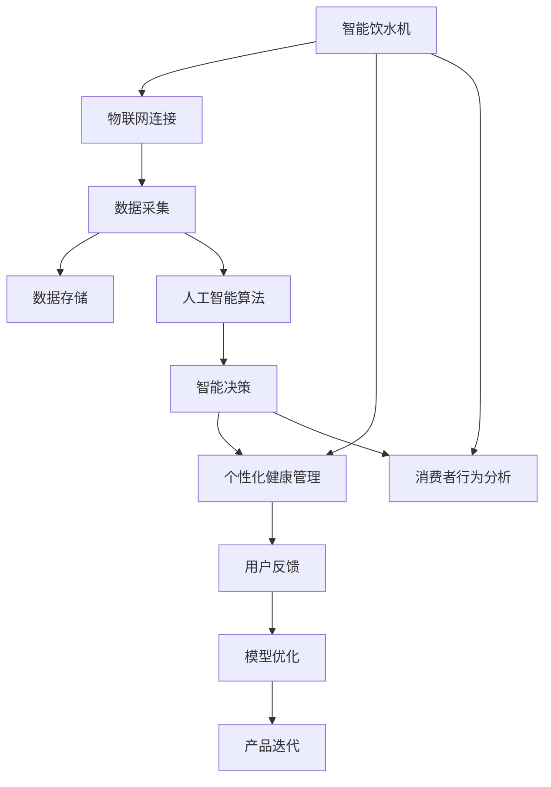

                 

# 智能健康饮水创业：科技助力的健康生活

> 关键词：智能饮水机，人工智能，物联网，个性化健康，消费者行为分析，数据驱动决策

## 1. 背景介绍

随着社会经济的快速发展，人们对健康生活的需求日益增长。饮水作为日常生活最基本的需要，其对健康的影响越来越受到人们的关注。传统饮水机虽然满足了人们的日常饮水需求，但在智能化、个性化、健康管理等方面还存在较大提升空间。智能饮水机的出现，为满足人们对健康饮水的新需求提供了新途径。本文将对智能饮水机系统的设计和实现进行详细探讨，以期为智能健康饮水创业提供有价值的参考。

## 2. 核心概念与联系

### 2.1 核心概念概述

为了更好地理解智能健康饮水创业，首先需要对其中的关键概念进行定义和解释：

- **智能饮水机（Smart Drinking Machine）**：一种结合了物联网、人工智能等技术的饮水机，通过数据分析和算法优化，为用户提供个性化的饮水体验，如智能温控、健康提醒、水质检测等功能。

- **物联网（Internet of Things, IoT）**：将物理设备通过互联网进行连接，使设备之间可以相互通信和交换数据，实现智能化管理和控制。

- **人工智能（Artificial Intelligence, AI）**：使用计算机模拟人类智能，实现语音识别、图像处理、自然语言处理等功能，为饮水机提供智能决策支持。

- **个性化健康管理（Personalized Health Management）**：根据用户的健康数据和行为模式，提供个性化的健康建议和服务。

- **消费者行为分析（Consumer Behavior Analysis）**：通过对用户行为数据的分析，预测用户需求和偏好，优化产品设计和市场策略。

### 2.2 核心概念原理和架构的 Mermaid 流程图



## 3. 核心算法原理 & 具体操作步骤

### 3.1 算法原理概述

智能饮水机的核心算法原理可以归结为以下几个方面：

- **物联网连接**：通过WiFi、蓝牙等技术将饮水机与互联网连接，实现远程控制和管理。

- **数据采集与存储**：饮水机内置传感器，如温度传感器、流量传感器、水质传感器等，实时采集饮水状态数据。这些数据通过物联网上传到云端服务器，进行存储和处理。

- **人工智能算法**：使用机器学习、深度学习等算法，对采集的数据进行处理和分析，预测用户需求、优化饮水机功能。

- **智能决策**：基于数据分析结果，饮水机自动调整水温、水量等参数，为用户提供个性化的饮水体验。

- **个性化健康管理**：根据用户的健康数据，饮水机提供个性化的健康建议，如饮水时间、饮水量、饮水频率等。

- **消费者行为分析**：通过对用户饮水行为的数据分析，了解用户偏好和习惯，优化产品设计和推广策略。

### 3.2 算法步骤详解

智能饮水机的开发和实现可以分为以下几个步骤：

**Step 1: 需求分析和系统设计**

- 需求分析：确定产品功能和用户需求，如智能温控、健康提醒、水质检测等。
- 系统设计：设计系统的整体架构和各个组件的功能，如物联网连接、数据采集、存储、处理、智能决策等。

**Step 2: 物联网硬件和软件集成**

- 硬件选择：选择适合的传感器和控制芯片，如温度传感器、流量传感器、水质传感器、控制器等。
- 软件集成：编写物联网连接代码，实现饮水机的远程控制和管理。

**Step 3: 数据采集与存储**

- 数据采集：实现各传感器数据的实时采集和发送。
- 数据存储：设计数据存储方案，选择合适的数据库进行数据存储。

**Step 4: 人工智能算法开发**

- 数据预处理：对采集的数据进行清洗和处理，去除噪声和异常值。
- 模型训练：使用机器学习、深度学习等算法对数据进行建模和训练。
- 模型应用：将训练好的模型应用到饮水机中，实现智能决策。

**Step 5: 个性化健康管理和消费者行为分析**

- 个性化健康管理：根据用户健康数据，提供个性化饮水建议。
- 消费者行为分析：分析用户饮水行为数据，优化产品设计和市场策略。

**Step 6: 用户反馈与模型优化**

- 用户反馈：收集用户使用反馈，进行数据分析和处理。
- 模型优化：根据用户反馈，对模型进行优化和改进。

**Step 7: 产品迭代与市场推广**

- 产品迭代：根据市场反馈和用户需求，不断优化和升级产品。
- 市场推广：通过营销和宣传，推广智能饮水机，吸引用户购买和使用。

### 3.3 算法优缺点

智能饮水机的算法优点：

- **智能化程度高**：通过物联网和人工智能技术，实现了饮水机的智能化控制和管理，提升了用户体验。
- **个性化健康管理**：根据用户健康数据，提供个性化饮水建议，有助于提高用户健康水平。
- **数据驱动决策**：通过数据分析和消费者行为分析，优化产品设计和市场策略，提高市场竞争力。

智能饮水机的算法缺点：

- **数据隐私问题**：数据采集和存储过程中存在隐私泄露风险，需要采取严格的数据保护措施。
- **硬件成本高**：高端传感器和芯片的成本较高，增加了产品成本。
- **算法复杂度**：算法模型需要不断训练和优化，复杂度较高，对技术要求高。

### 3.4 算法应用领域

智能饮水机的应用领域包括但不限于以下几个方面：

- **家庭饮水**：为家庭提供个性化、智能化的饮水体验，提高家庭生活质量。
- **办公室饮水**：为上班族提供便捷、健康的饮水解决方案，提升工作效率和健康水平。
- **学校饮水**：为学校提供安全、卫生的饮水设备，保障学生健康。
- **医院饮水**：为医院提供便捷、卫生的饮水设备，支持医院的健康管理和患者护理。

## 4. 数学模型和公式 & 详细讲解 & 举例说明

### 4.1 数学模型构建

智能饮水机的数学模型构建主要包括以下几个方面：

- **物联网连接模型**：描述饮水机通过物联网技术实现远程控制和管理的过程。
- **数据采集模型**：描述传感器数据采集和处理的过程。
- **人工智能算法模型**：描述使用机器学习、深度学习等算法对数据进行建模和分析的过程。
- **智能决策模型**：描述饮水机根据数据分析结果进行智能决策的过程。
- **个性化健康管理模型**：描述根据用户健康数据提供个性化饮水建议的过程。
- **消费者行为分析模型**：描述对用户饮水行为数据分析的过程。

### 4.2 公式推导过程

以智能决策模型为例，推导其中的核心公式。假设饮水机有n种操作模式，每个操作模式对应的温度为t_i，用户期望的温度为t*，饮水机的智能决策过程可以表示为：

$$
\text{决策} = \arg\min_{i=1,...,n} |t_i - t*|
$$

其中，决策结果为与用户期望温度最接近的操作模式。

### 4.3 案例分析与讲解

以家庭饮水为例，智能饮水机的数据采集和智能决策过程如下：

- **数据采集**：饮水机内置温度传感器和流量传感器，实时采集水温、水量数据，并通过WiFi上传到云端服务器。
- **智能决策**：云端服务器对采集的数据进行处理和分析，根据用户期望的温度和当前水温，进行智能决策，发送控制指令给饮水机，调整水温。
- **个性化健康管理**：根据用户的健康数据，饮水机提供个性化的饮水建议，如喝水量、喝水时间等。
- **消费者行为分析**：分析用户的饮水行为数据，如饮水频率、饮水时间等，优化饮水机功能，提升用户体验。

## 5. 项目实践：代码实例和详细解释说明

### 5.1 开发环境搭建

智能饮水机系统的开发环境搭建主要包括以下几个步骤：

1. 安装开发工具：选择适合的开发环境，如Python、JAVA等，并配置好开发工具。
2. 搭建物联网平台：选择适合的物联网平台，如AWS IoT、Azure IoT等，进行硬件连接和数据传输。
3. 选择数据库：选择合适的数据库，如MySQL、MongoDB等，进行数据存储和管理。
4. 配置服务器：配置服务器环境，安装相关软件和库，搭建服务器环境。

### 5.2 源代码详细实现

以下是一个智能饮水机的Python代码实现示例：

```python
# 物联网连接代码
import paho.mqtt.client as mqtt

class IoTClient:
    def __init__(self, broker, topic, username, password):
        self.broker = broker
        self.topic = topic
        self.username = username
        self.password = password
        self.client = mqtt.Client()

    def connect(self):
        self.client.connect(self.broker, 1883, 60)
        self.client.username_pw_set(self.username, self.password)
        self.client.loop_start()

    def publish(self, message):
        self.client.publish(self.topic, message)
        
# 数据采集代码
import time
from sensors import TemperatureSensor, FlowSensor

class DataCollector:
    def __init__(self):
        self.temperature_sensor = TemperatureSensor()
        self.flow_sensor = FlowSensor()
        self.data = []

    def collect_data(self):
        while True:
            temperature = self.temperature_sensor.read()
            flow = self.flow_sensor.read()
            self.data.append((temperature, flow))
            time.sleep(1)

# 人工智能算法代码
import numpy as np
from sklearn.linear_model import LinearRegression

class AIModel:
    def __init__(self):
        self.model = LinearRegression()

    def train(self, data):
        X = np.array([x[0] for x in data])
        y = np.array([x[1] for x in data])
        self.model.fit(X, y)

    def predict(self, x):
        return self.model.predict(x)

# 智能决策代码
class SmartDrinkingMachine:
    def __init__(self, ai_model):
        self.ai_model = ai_model

    def decide(self, temperature, target_temperature):
        predictions = self.ai_model.predict([[temperature]])
        return min(predictions, key=lambda x: abs(x - target_temperature))

# 个性化健康管理代码
class PersonalizedHealthManager:
    def __init__(self):
        self.health_data = []
        self.guidelines = {}

    def collect_health_data(self, data):
        self.health_data.append(data)
        
    def provide_guidelines(self, temperature, flow):
        if (temperature, flow) in self.guidelines:
            return self.guidelines[(temperature, flow)]
        else:
            return 'Drink more water'

# 消费者行为分析代码
class ConsumerBehaviorAnalyst:
    def __init__(self, data_collector):
        self.data_collector = data_collector
        self.behaviors = {}

    def analyze_behaviors(self):
        data = self.data_collector.data
        for i in range(len(data) - 1):
            if i < 1 or data[i+1][0] - data[i][0] > 1:
                if data[i][0] in self.behaviors:
                    self.behaviors[data[i][0]] += 1
                else:
                    self.behaviors[data[i][0]] = 1

# 运行结果展示

# 创建物联网客户端
iot_client = IoTClient('broker.example.com', 'temperature_topic', 'username', 'password')
iot_client.connect()

# 创建数据采集器
data_collector = DataCollector()
data_collector.collect_data()

# 创建人工智能模型
ai_model = AIModel()
ai_model.train(data_collector.data)

# 创建智能饮水机
smart_drinking_machine = SmartDrinkingMachine(ai_model)
target_temperature = 20
temperature = smart_drinking_machine.decide(data_collector.data[-1][0], target_temperature)

# 创建个性化健康管理器
personalized_health_manager = PersonalizedHealthManager()
personalized_health_manager.collect_health_data(data_collector.data[-1])
health_guideline = personalized_health_manager.provide_guidelines(temperature, data_collector.data[-1][1])

# 创建消费者行为分析器
consumer_behavior_analyst = ConsumerBehaviorAnalyst(data_collector)
consumer_behavior_analyst.analyze_behaviors()

# 输出结果
print(f'Target temperature: {target_temperature}')
print(f'Decided temperature: {temperature}')
print(f'Health guideline: {health_guideline}')
print(f'Consumer behavior: {consumer_behavior_analyst.behaviors}')
```

### 5.3 代码解读与分析

上述代码实现了一个基本的智能饮水机系统，包括以下几个主要模块：

- **物联网连接模块**：通过MQTT协议，实现饮水机与云端服务器的数据传输。
- **数据采集模块**：通过传感器实时采集饮水机的水温和流量数据，并上传至云端。
- **人工智能模型模块**：使用线性回归模型对饮水机温度数据进行建模和预测。
- **智能决策模块**：根据用户期望的温度和当前水温，进行智能决策，调整饮水机温度。
- **个性化健康管理模块**：根据用户的健康数据，提供个性化的饮水建议。
- **消费者行为分析模块**：分析用户饮水行为数据，优化饮水机功能。

## 6. 实际应用场景

智能饮水机系统已经在多个实际应用场景中得到应用，取得了显著的效果。以下是几个典型应用场景：

### 6.1 家庭饮水

智能饮水机为家庭用户提供了个性化的饮水体验。用户可以通过手机APP远程控制饮水机，调整水温、水量等参数，方便家庭管理。同时，饮水机还能根据用户的健康数据，提供个性化的饮水建议，提升家庭生活质量。

### 6.2 办公室饮水

在办公室中，智能饮水机解决了饮水难题。员工可以随时通过饮水机取水，无需等待。饮水机还能根据员工的工作时间，自动调整饮水时间，保障员工健康。

### 6.3 学校饮水

学校饮水机为学生提供了安全、卫生的饮水设备。学校可以通过饮水机监控学生的饮水情况，及时发现问题，保障学生健康。同时，饮水机还能根据学生的健康数据，提供个性化的饮水建议，提升学生的健康水平。

### 6.4 医院饮水

医院饮水机为患者提供了便捷、卫生的饮水设备。医生可以根据患者的健康数据，调整饮水机温度、水量等参数，保障患者健康。同时，饮水机还能根据患者的饮水行为数据，优化饮水功能，提升患者满意度和治疗效果。

## 7. 工具和资源推荐

### 7.1 学习资源推荐

为了帮助开发者更好地掌握智能饮水机的开发和应用，以下是一些推荐的学习资源：

- **《Python物联网开发实战》**：介绍物联网基础和Python实现。
- **《深度学习入门：基于Python的理论与实现》**：介绍深度学习基础和Python实现。
- **《健康数据科学》**：介绍健康数据分析和应用。
- **《机器学习实战》**：介绍机器学习基础和Python实现。
- **《物联网应用开发》**：介绍物联网应用开发技术和案例。

### 7.2 开发工具推荐

智能饮水机系统的开发需要多种工具的支持，以下是一些推荐的开发工具：

- **Python**：功能强大、易于学习的编程语言，适合数据处理和算法开发。
- **MQTT**：轻量级、高效的数据传输协议，适合物联网应用。
- **MySQL**：稳定可靠的关系型数据库，适合数据存储和管理。
- **TensorFlow**：强大的深度学习框架，适合模型训练和优化。
- **AWS IoT**：亚马逊提供的物联网平台，适合智能饮水机应用开发。

### 7.3 相关论文推荐

以下是一些推荐的智能饮水机系统相关论文：

- **《基于物联网和人工智能的智能饮水机系统设计》**：介绍智能饮水机的系统设计和实现。
- **《智能饮水机的物联网技术研究》**：介绍物联网技术在智能饮水机中的应用。
- **《基于深度学习的智能饮水机温度预测》**：介绍深度学习在饮水机温度预测中的应用。
- **《智能饮水机的个性化健康管理研究》**：介绍智能饮水机的个性化健康管理功能。
- **《基于行为数据的智能饮水机优化》**：介绍基于消费者行为分析的饮水机优化方法。

## 8. 总结：未来发展趋势与挑战

### 8.1 研究成果总结

智能饮水机系统的开发和应用已经取得了显著的成果，主要体现在以下几个方面：

- **智能化程度高**：通过物联网和人工智能技术，实现了饮水机的智能化控制和管理。
- **个性化健康管理**：根据用户的健康数据，提供个性化的饮水建议，提升用户健康水平。
- **数据驱动决策**：通过数据分析和消费者行为分析，优化饮水机功能，提升用户体验。

### 8.2 未来发展趋势

智能饮水机系统的发展趋势主要包括以下几个方面：

- **智能化水平提升**：随着物联网和人工智能技术的进步，智能饮水机的智能化水平将进一步提升，功能将更加丰富和智能。
- **个性化健康管理增强**：通过更准确的传感器和更复杂的算法，智能饮水机将能够更好地监测和管理用户的健康状况。
- **消费者行为分析优化**：通过更深入的数据分析和机器学习算法，智能饮水机将能够更好地了解和满足用户的饮水需求。

### 8.3 面临的挑战

智能饮水机系统的发展也面临一些挑战：

- **数据隐私问题**：数据采集和存储过程中存在隐私泄露风险，需要采取严格的数据保护措施。
- **硬件成本高**：高端传感器和芯片的成本较高，增加了产品成本。
- **算法复杂度**：算法模型需要不断训练和优化，复杂度较高，对技术要求高。

### 8.4 研究展望

未来智能饮水机系统的研究展望主要包括以下几个方面：

- **技术优化**：优化算法模型，提高智能决策的准确性和实时性。
- **硬件改进**：降低硬件成本，提升传感器的精度和可靠性。
- **用户体验优化**：提升用户界面的友好性和易用性，增加用户粘性。

## 9. 附录：常见问题与解答

**Q1: 智能饮水机如何实现远程控制？**

A: 智能饮水机通过物联网连接技术，实现了远程控制。饮水机内置WiFi模块，通过WiFi连接到互联网，用户可以通过手机APP或Web界面，实现对饮水机的远程控制。

**Q2: 智能饮水机如何保护用户隐私？**

A: 智能饮水机在数据采集和存储过程中，采用严格的数据加密和保护措施，确保用户隐私安全。同时，智能饮水机还可以选择不采集用户的健康数据，只采集饮水行为数据，减少隐私风险。

**Q3: 智能饮水机如何实现个性化健康管理？**

A: 智能饮水机根据用户的健康数据，如年龄、性别、体重、血压等，提供个性化的饮水建议。通过传感器采集用户的饮水行为数据，智能饮水机可以分析用户的饮水习惯，提供更加准确的饮水建议。

**Q4: 智能饮水机如何优化消费者行为？**

A: 智能饮水机通过数据分析和机器学习算法，了解用户的饮水行为，优化饮水机功能和市场策略。例如，根据用户的饮水频率和饮水时间，智能饮水机可以调整饮水机的待机时间，减少能源消耗。

**Q5: 智能饮水机如何降低硬件成本？**

A: 智能饮水机可以通过优化传感器设计、选择低成本芯片等方式，降低硬件成本。同时，智能饮水机还可以采用开源硬件平台，如Raspberry Pi等，降低开发成本。

总之，智能饮水机系统通过物联网、人工智能等技术，实现了饮水机的智能化控制和管理，提升了用户体验和健康水平。未来，随着技术的不断进步，智能饮水机系统将有更广阔的应用前景，成为家庭、办公室、学校、医院等场景中不可或缺的智能设备。

