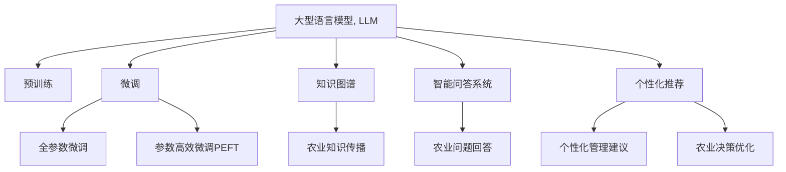

                 

## 1. 背景介绍

### 1.1 问题由来

随着全球人口的不断增长和土地资源的日益紧张，精准农业（Precision Agriculture）应运而生。精准农业利用现代信息技术对农田生产要素进行高效率的投入与监控，以提高农业生产质量和资源利用效率，从而实现更高的产量和可持续性。其中，智能农作物管理是精准农业的核心环节之一，旨在通过实时监测和智能决策，最大限度地优化作物生长条件，提高农业生产效率和收益。

然而，智能农作物管理依赖于大量农业数据的收集和处理，如土壤湿度、温度、光照、病虫草害信息等。这些数据的来源多样、种类繁多、结构复杂，难以直接用于模型训练。传统的农业决策依赖于农业专家的经验和判断，难以实现精准、高效的智能决策。

### 1.2 问题核心关键点

当前，人工智能技术尤其是大型语言模型（Large Language Model, LLM）在智能农作物管理中的应用逐渐受到关注。LLM通过大规模文本数据的预训练，能够学习到丰富的语言知识和常识，具备强大的自然语言处理和推理能力。将其应用于农业领域，可以整合和管理各种文本形式的农业数据，并生成高质量的农业决策建议，从而实现智能农作物管理的目标。

具体而言，LLM在智能农作物管理中的应用主要包括以下几个方面：

1. **数据集成与分析**：整合和管理各种异构数据，提供准确的农业生产信息。
2. **决策支持**：基于预训练和微调的知识，生成科学的农业决策建议。
3. **知识图谱构建**：构建农业领域的知识图谱，辅助农业知识传播和共享。
4. **智能问答**：利用自然语言理解技术，实现智能化的农业问答系统。
5. **个性化推荐**：根据作物生长状态和历史数据，提供个性化的管理方案。

本文将系统地介绍LLM在智能农作物管理中的应用，详细分析其核心算法原理和操作步骤，并提供项目实践的代码实例和详细解释。

## 2. 核心概念与联系

### 2.1 核心概念概述

为更好地理解LLM在智能农作物管理中的应用，本节将介绍几个关键概念及其相互联系：

- **大型语言模型（Large Language Model, LLM）**：指通过自监督学习任务在大规模文本数据上预训练得到的语言模型。如GPT、BERT等。
- **预训练（Pre-training）**：指在大规模无标签文本数据上训练模型，学习通用的语言表示。
- **微调（Fine-tuning）**：指在预训练模型的基础上，使用农业领域的标注数据进行微调，以适应特定的农业管理任务。
- **知识图谱（Knowledge Graph）**：指以结构化的方式描述和组织实体、关系和属性的知识库，辅助农业决策。
- **智能问答系统（QA System）**：指利用自然语言理解技术，对用户提出的农业问题进行回答的智能系统。
- **个性化推荐（Personalized Recommendation）**：指根据用户的历史行为和当前状态，提供个性化的管理建议。

这些概念之间的联系可以通过以下Mermaid流程图来展示：



这个流程图展示了LLM在智能农作物管理中的应用流程：

1. LLM通过预训练学习通用的语言知识。
2. 在农业领域进行微调，以适应特定的农业管理任务。
3. 通过知识图谱构建，辅助农业知识传播。
4. 利用智能问答系统，提供农业问题解答。
5. 根据个性化推荐，优化农业决策。

这些概念共同构成了LLM在智能农作物管理中的应用框架，使其能够更好地服务于农业生产。

## 3. 核心算法原理 & 具体操作步骤

### 3.1 算法原理概述

LLM在智能农作物管理中的应用主要依赖于其强大的自然语言处理能力。基于监督学习的大语言模型微调方法，可以将农业领域的文本数据作为监督信号，通过微调提升模型对农业知识的理解和推理能力。

具体而言，智能农作物管理中的微调目标是通过训练模型，使其能够理解并生成与农业生产相关的自然语言描述，如作物生长状态、病虫害情况、土壤条件等。这些自然语言描述可以作为农业决策的依据，提高决策的准确性和科学性。

### 3.2 算法步骤详解

基于监督学习的大语言模型微调步骤主要包括以下几个环节：

**Step 1: 准备预训练模型和数据集**
- 选择合适的预训练语言模型，如GPT、BERT等。
- 收集农业领域的文本数据，包括田间记录、气象数据、专家意见等，并对其进行标注处理，形成监督数据集。

**Step 2: 添加任务适配层**
- 根据农业管理任务设计合适的输出层和损失函数。
- 对于分类任务，通常使用分类交叉熵损失函数。
- 对于生成任务，使用负对数似然损失函数。

**Step 3: 设置微调超参数**
- 选择合适的优化算法及其参数，如AdamW、SGD等，设置学习率、批大小、迭代轮数等。
- 设置正则化技术及强度，包括权重衰减、Dropout、Early Stopping等。
- 确定冻结预训练参数的策略，如仅微调顶层，或全部参数都参与微调。

**Step 4: 执行梯度训练**
- 将训练集数据分批次输入模型，前向传播计算损失函数。
- 反向传播计算参数梯度，根据设定的优化算法和学习率更新模型参数。
- 周期性在验证集上评估模型性能，根据性能指标决定是否触发 Early Stopping。
- 重复上述步骤直到满足预设的迭代轮数或 Early Stopping 条件。

**Step 5: 测试和部署**
- 在测试集上评估微调后模型的性能，对比微调前后的效果提升。
- 使用微调后的模型对新的农业数据进行推理预测，集成到智能农业管理系统中。

### 3.3 算法优缺点

基于监督学习的大语言模型微调方法在智能农作物管理中的应用具有以下优点：

- **高效性**：微调方法可以快速提升模型在农业管理任务上的性能，缩短模型训练周期。
- **泛化能力**：预训练模型已具备良好的语言理解能力，微调后的模型能够处理各种复杂的农业文本数据。
- **可扩展性**：微调模型可以集成到各种智能农业管理系统中，适应不同的应用场景。

同时，该方法也存在一定的局限性：

- **数据依赖**：微调效果很大程度上取决于标注数据的质量和数量，获取高质量标注数据的成本较高。
- **领域适配性**：预训练模型在通用领域预训练，可能难以很好地适应特定农业领域的语言特征。
- **模型复杂性**：大规模语言模型的参数量庞大，对计算资源和存储需求较高。

尽管存在这些局限性，基于监督学习的微调方法仍是智能农作物管理的重要工具，通过优化训练过程和模型设计，可以在数据量有限的情况下取得较好的效果。

### 3.4 算法应用领域

基于大语言模型微调的监督学习方法，在智能农作物管理中的应用领域广泛，包括：

- **智能诊断**：识别作物生长状态，检测病虫害情况，辅助农民及时做出应对措施。
- **智能施肥**：根据土壤和作物信息，推荐最优施肥方案，优化肥料使用效率。
- **智能灌溉**：监测土壤湿度和气象条件，制定科学的灌溉计划，减少水资源浪费。
- **智能播种**：根据气候和土壤数据，推荐最佳播种时间，提高作物的生长率。
- **智能收割**：利用自然语言理解技术，生成最佳的收割时机建议，提高作物的产量和质量。

这些应用展示了LLM在智能农作物管理中的巨大潜力，通过微调技术，模型能够快速适应不同农业场景的需求，提供高质量的农业决策建议。

## 4. 数学模型和公式 & 详细讲解  
### 4.1 数学模型构建

本节将使用数学语言对基于监督学习的大语言模型微调过程进行更加严格的刻画。

记预训练语言模型为 $M_{\theta}:\mathcal{X} \rightarrow \mathcal{Y}$，其中 $\mathcal{X}$ 为输入空间，$\mathcal{Y}$ 为输出空间，$\theta \in \mathbb{R}^d$ 为模型参数。假设微调任务的训练集为 $D=\{(x_i,y_i)\}_{i=1}^N, x_i \in \mathcal{X}, y_i \in \mathcal{Y}$。

定义模型 $M_{\theta}$ 在输入 $x$ 上的损失函数为 $\ell(M_{\theta}(x),y)$，则在数据集 $D$ 上的经验风险为：

$$
\mathcal{L}(\theta) = \frac{1}{N} \sum_{i=1}^N \ell(M_{\theta}(x_i),y_i)
$$

微调的优化目标是最小化经验风险，即找到最优参数：

$$
\theta^* = \mathop{\arg\min}_{\theta} \mathcal{L}(\theta)
$$

在实践中，我们通常使用基于梯度的优化算法（如SGD、Adam等）来近似求解上述最优化问题。设 $\eta$ 为学习率，$\lambda$ 为正则化系数，则参数的更新公式为：

$$
\theta \leftarrow \theta - \eta \nabla_{\theta}\mathcal{L}(\theta) - \eta\lambda\theta
$$

其中 $\nabla_{\theta}\mathcal{L}(\theta)$ 为损失函数对参数 $\theta$ 的梯度，可通过反向传播算法高效计算。

### 4.2 公式推导过程

以下我们以智能施肥任务为例，推导基于监督学习微调的数学模型和梯度公式。

假设模型 $M_{\theta}$ 在输入 $x$ 上的输出为 $\hat{y}=M_{\theta}(x) \in [0,1]$，表示施肥量预测值。真实标签 $y \in \{0,1\}$。则二分类交叉熵损失函数定义为：

$$
\ell(M_{\theta}(x),y) = -[y\log \hat{y} + (1-y)\log (1-\hat{y})]
$$

将其代入经验风险公式，得：

$$
\mathcal{L}(\theta) = -\frac{1}{N}\sum_{i=1}^N [y_i\log M_{\theta}(x_i)+(1-y_i)\log(1-M_{\theta}(x_i))]
$$

根据链式法则，损失函数对参数 $\theta_k$ 的梯度为：

$$
\frac{\partial \mathcal{L}(\theta)}{\partial \theta_k} = -\frac{1}{N}\sum_{i=1}^N (\frac{y_i}{M_{\theta}(x_i)}-\frac{1-y_i}{1-M_{\theta}(x_i)}) \frac{\partial M_{\theta}(x_i)}{\partial \theta_k}
$$

其中 $\frac{\partial M_{\theta}(x_i)}{\partial \theta_k}$ 可进一步递归展开，利用自动微分技术完成计算。

在得到损失函数的梯度后，即可带入参数更新公式，完成模型的迭代优化。重复上述过程直至收敛，最终得到适应智能施肥任务的最优模型参数 $\theta^*$。

## 5. 项目实践：代码实例和详细解释说明
### 5.1 开发环境搭建

在进行智能农作物管理中的微调实践前，我们需要准备好开发环境。以下是使用Python进行PyTorch开发的环境配置流程：

1. 安装Anaconda：从官网下载并安装Anaconda，用于创建独立的Python环境。

2. 创建并激活虚拟环境：
```bash
conda create -n pytorch-env python=3.8 
conda activate pytorch-env
```

3. 安装PyTorch：根据CUDA版本，从官网获取对应的安装命令。例如：
```bash
conda install pytorch torchvision torchaudio cudatoolkit=11.1 -c pytorch -c conda-forge
```

4. 安装各类工具包：
```bash
pip install numpy pandas scikit-learn matplotlib tqdm jupyter notebook ipython
```

完成上述步骤后，即可在`pytorch-env`环境中开始微调实践。

### 5.2 源代码详细实现

这里我们以智能施肥任务为例，给出使用Transformers库对BERT模型进行微调的PyTorch代码实现。

首先，定义智能施肥任务的数据处理函数：

```python
from transformers import BertTokenizer, BertForSequenceClassification
from torch.utils.data import Dataset
import torch

class FertilizerDataset(Dataset):
    def __init__(self, texts, labels, tokenizer, max_len=128):
        self.texts = texts
        self.labels = labels
        self.tokenizer = tokenizer
        self.max_len = max_len
        
    def __len__(self):
        return len(self.texts)
    
    def __getitem__(self, item):
        text = self.texts[item]
        label = self.labels[item]
        
        encoding = self.tokenizer(text, return_tensors='pt', max_length=self.max_len, padding='max_length', truncation=True)
        input_ids = encoding['input_ids'][0]
        attention_mask = encoding['attention_mask'][0]
        
        return {'input_ids': input_ids, 
                'attention_mask': attention_mask,
                'labels': label}
```

然后，定义模型和优化器：

```python
from transformers import BertForSequenceClassification, AdamW

model = BertForSequenceClassification.from_pretrained('bert-base-cased', num_labels=2)

optimizer = AdamW(model.parameters(), lr=2e-5)
```

接着，定义训练和评估函数：

```python
from torch.utils.data import DataLoader
from tqdm import tqdm
from sklearn.metrics import classification_report

device = torch.device('cuda') if torch.cuda.is_available() else torch.device('cpu')
model.to(device)

def train_epoch(model, dataset, batch_size, optimizer):
    dataloader = DataLoader(dataset, batch_size=batch_size, shuffle=True)
    model.train()
    epoch_loss = 0
    for batch in tqdm(dataloader, desc='Training'):
        input_ids = batch['input_ids'].to(device)
        attention_mask = batch['attention_mask'].to(device)
        labels = batch['labels'].to(device)
        model.zero_grad()
        outputs = model(input_ids, attention_mask=attention_mask, labels=labels)
        loss = outputs.loss
        epoch_loss += loss.item()
        loss.backward()
        optimizer.step()
    return epoch_loss / len(dataloader)

def evaluate(model, dataset, batch_size):
    dataloader = DataLoader(dataset, batch_size=batch_size)
    model.eval()
    preds, labels = [], []
    with torch.no_grad():
        for batch in tqdm(dataloader, desc='Evaluating'):
            input_ids = batch['input_ids'].to(device)
            attention_mask = batch['attention_mask'].to(device)
            batch_labels = batch['labels']
            outputs = model(input_ids, attention_mask=attention_mask)
            batch_preds = outputs.logits.argmax(dim=2).to('cpu').tolist()
            batch_labels = batch_labels.to('cpu').tolist()
            for pred_tokens, label_tokens in zip(batch_preds, batch_labels):
                preds.append(pred_tokens[:len(label_tokens)])
                labels.append(label_tokens)
                
    print(classification_report(labels, preds))
```

最后，启动训练流程并在测试集上评估：

```python
epochs = 5
batch_size = 16

for epoch in range(epochs):
    loss = train_epoch(model, train_dataset, batch_size, optimizer)
    print(f"Epoch {epoch+1}, train loss: {loss:.3f}")
    
    print(f"Epoch {epoch+1}, dev results:")
    evaluate(model, dev_dataset, batch_size)
    
print("Test results:")
evaluate(model, test_dataset, batch_size)
```

以上就是使用PyTorch对BERT进行智能施肥任务微调的完整代码实现。可以看到，得益于Transformers库的强大封装，我们可以用相对简洁的代码完成BERT模型的加载和微调。

### 5.3 代码解读与分析

让我们再详细解读一下关键代码的实现细节：

**FertilizerDataset类**：
- `__init__`方法：初始化文本、标签、分词器等关键组件。
- `__len__`方法：返回数据集的样本数量。
- `__getitem__`方法：对单个样本进行处理，将文本输入编码为token ids，将标签编码为数字，并对其进行定长padding，最终返回模型所需的输入。

**标签与id的映射**：
- 定义了标签与数字id之间的映射关系，用于将token-wise的预测结果解码回真实的标签。

**训练和评估函数**：
- 使用PyTorch的DataLoader对数据集进行批次化加载，供模型训练和推理使用。
- 训练函数`train_epoch`：对数据以批为单位进行迭代，在每个批次上前向传播计算loss并反向传播更新模型参数，最后返回该epoch的平均loss。
- 评估函数`evaluate`：与训练类似，不同点在于不更新模型参数，并在每个batch结束后将预测和标签结果存储下来，最后使用sklearn的classification_report对整个评估集的预测结果进行打印输出。

**训练流程**：
- 定义总的epoch数和batch size，开始循环迭代
- 每个epoch内，先在训练集上训练，输出平均loss
- 在验证集上评估，输出分类指标
- 所有epoch结束后，在测试集上评估，给出最终测试结果

可以看到，PyTorch配合Transformers库使得BERT微调的代码实现变得简洁高效。开发者可以将更多精力放在数据处理、模型改进等高层逻辑上，而不必过多关注底层的实现细节。

当然，工业级的系统实现还需考虑更多因素，如模型的保存和部署、超参数的自动搜索、更灵活的任务适配层等。但核心的微调范式基本与此类似。

## 6. 实际应用场景
### 6.1 智能诊断

智能诊断是智能农作物管理的重要环节，通过智能诊断可以快速识别作物的生长状态和病虫害情况，辅助农民及时采取应对措施，避免损失。

在技术实现上，可以收集作物生长过程中拍摄的图片和视频，将其转化为文本描述。利用预训练语言模型对文本进行情感分析，识别出情绪倾向，判断作物生长状态。同时，利用自然语言理解技术，对文本进行实体抽取，识别出病虫害名称，辅助农民进行精准施药。

### 6.2 智能施肥

智能施肥旨在通过精准控制施肥量，减少肥料浪费，提高作物产量。通过收集土壤和气象数据，生成施肥建议。预训练语言模型对文本进行分类，判断是否需要施肥，若需要施肥，则根据文本描述生成最优施肥方案。

### 6.3 智能灌溉

智能灌溉通过实时监测土壤湿度和气象条件，制定科学的灌溉计划，优化水资源使用。预训练语言模型对文本进行分类，判断是否需要灌溉，若需要灌溉，则根据文本描述生成最优灌溉计划。

### 6.4 智能播种

智能播种通过收集历史气象数据和作物生长信息，生成最佳的播种时间建议。预训练语言模型对文本进行分类，判断是否需要播种，若需要播种，则根据文本描述生成最优播种时间。

### 6.5 智能收割

智能收割利用自然语言理解技术，生成最佳的收割时机建议，提高作物的产量和质量。预训练语言模型对文本进行分类，判断是否需要收割，若需要收割，则根据文本描述生成最优收割时机。

## 7. 工具和资源推荐
### 7.1 学习资源推荐

为了帮助开发者系统掌握LLM在智能农作物管理中的应用理论基础和实践技巧，这里推荐一些优质的学习资源：

1. 《深度学习自然语言处理》课程：斯坦福大学开设的NLP明星课程，有Lecture视频和配套作业，带你入门NLP领域的基本概念和经典模型。

2. 《Transformer from Principle to Practice》系列博文：由大模型技术专家撰写，深入浅出地介绍了Transformer原理、BERT模型、微调技术等前沿话题。

3. 《Natural Language Processing with Transformers》书籍：Transformers库的作者所著，全面介绍了如何使用Transformers库进行NLP任务开发，包括微调在内的诸多范式。

4. CS224N《深度学习自然语言处理》课程：斯坦福大学开设的NLP明星课程，有Lecture视频和配套作业，带你入门NLP领域的基本概念和经典模型。

5. Weights & Biases：模型训练的实验跟踪工具，可以记录和可视化模型训练过程中的各项指标，方便对比和调优。

6. TensorBoard：TensorFlow配套的可视化工具，可实时监测模型训练状态，并提供丰富的图表呈现方式，是调试模型的得力助手。

通过这些资源的学习实践，相信你一定能够快速掌握LLM在智能农作物管理中的应用精髓，并用于解决实际的NLP问题。

### 7.2 开发工具推荐

高效的开发离不开优秀的工具支持。以下是几款用于LLM在智能农作物管理中的应用开发的常用工具：

1. PyTorch：基于Python的开源深度学习框架，灵活动态的计算图，适合快速迭代研究。大部分预训练语言模型都有PyTorch版本的实现。

2. TensorFlow：由Google主导开发的开源深度学习框架，生产部署方便，适合大规模工程应用。同样有丰富的预训练语言模型资源。

3. Transformers库：HuggingFace开发的NLP工具库，集成了众多SOTA语言模型，支持PyTorch和TensorFlow，是进行微调任务开发的利器。

4. Weights & Biases：模型训练的实验跟踪工具，可以记录和可视化模型训练过程中的各项指标，方便对比和调优。与主流深度学习框架无缝集成。

5. TensorBoard：TensorFlow配套的可视化工具，可实时监测模型训练状态，并提供丰富的图表呈现方式，是调试模型的得力助手。

6. Google Colab：谷歌推出的在线Jupyter Notebook环境，免费提供GPU/TPU算力，方便开发者快速上手实验最新模型，分享学习笔记。

合理利用这些工具，可以显著提升LLM在智能农作物管理中的应用开发效率，加快创新迭代的步伐。

### 7.3 相关论文推荐

LLM在智能农作物管理中的应用研究始于学界的持续研究。以下是几篇奠基性的相关论文，推荐阅读：

1. Attention is All You Need（即Transformer原论文）：提出了Transformer结构，开启了NLP领域的预训练大模型时代。

2. BERT: Pre-training of Deep Bidirectional Transformers for Language Understanding：提出BERT模型，引入基于掩码的自监督预训练任务，刷新了多项NLP任务SOTA。

3. Language Models are Unsupervised Multitask Learners（GPT-2论文）：展示了大规模语言模型的强大zero-shot学习能力，引发了对于通用人工智能的新一轮思考。

4. Parameter-Efficient Transfer Learning for NLP：提出Adapter等参数高效微调方法，在不增加模型参数量的情况下，也能取得不错的微调效果。

5. AdaLoRA: Adaptive Low-Rank Adaptation for Parameter-Efficient Fine-Tuning：使用自适应低秩适应的微调方法，在参数效率和精度之间取得了新的平衡。

这些论文代表了大语言模型微调技术的发展脉络。通过学习这些前沿成果，可以帮助研究者把握学科前进方向，激发更多的创新灵感。

## 8. 总结：未来发展趋势与挑战

### 8.1 总结

本文对基于监督学习的大语言模型微调方法在智能农作物管理中的应用进行了全面系统的介绍。首先阐述了智能农作物管理的背景和意义，明确了LLM在其中的应用潜力。其次，从原理到实践，详细讲解了微调的数学模型和核心算法步骤，提供了微调任务开发的完整代码实例。同时，本文还广泛探讨了LLM在智能诊断、智能施肥、智能灌溉等实际应用场景中的应用前景，展示了其在智能农作物管理中的巨大潜力。此外，本文精选了微调技术的各类学习资源，力求为读者提供全方位的技术指引。

通过本文的系统梳理，可以看到，基于大语言模型的微调方法正在成为智能农作物管理的重要工具，极大地拓展了预训练语言模型的应用边界，为农业生产带来了新的变革。未来，随着预训练语言模型和微调方法的不断进步，相信智能农作物管理技术将进一步发展，为农业生产带来更高的效率和收益。

### 8.2 未来发展趋势

展望未来，LLM在智能农作物管理中的应用将呈现以下几个发展趋势：

1. **模型规模增大**：随着算力成本的下降和数据规模的扩张，预训练语言模型的参数量还将持续增长。超大规模语言模型蕴含的丰富语言知识，有望支撑更加复杂多变的农业管理任务。

2. **知识图谱构建**：构建农业领域的知识图谱，辅助农业知识传播和共享，提高决策的科学性和准确性。

3. **智能问答系统**：利用自然语言理解技术，实现智能化的农业问答系统，提供高质量的农业问题解答。

4. **个性化推荐**：根据作物生长状态和历史数据，提供个性化的管理方案，优化农业生产过程。

5. **跨模态融合**：融合视觉、语音等多模态信息，增强农业决策的全面性和准确性。

6. **持续学习**：随着数据分布的不断变化，微调模型需要持续学习新知识以保持性能。如何在不遗忘原有知识的同时，高效吸收新样本信息，将成为重要的研究课题。

以上趋势凸显了LLM在智能农作物管理中的应用前景。这些方向的探索发展，必将进一步提升智能农作物管理技术的性能和应用范围，为农业生产带来更高的效率和收益。

### 8.3 面临的挑战

尽管LLM在智能农作物管理中的应用已经取得了显著进展，但在迈向更加智能化、普适化应用的过程中，它仍面临着诸多挑战：

1. **标注成本高**：智能农作物管理依赖于大量的农业数据，获取高质量标注数据的成本较高。如何进一步降低微调对标注样本的依赖，将是一大难题。

2. **模型复杂度高**：大规模语言模型的参数量庞大，对计算资源和存储需求较高。如何在保证性能的同时，减小模型复杂度，优化资源使用，将是重要的优化方向。

3. **知识整合能力不足**：现有的微调模型往往局限于任务内数据，难以灵活吸收和运用更广泛的先验知识。如何让微调过程更好地与外部知识库、规则库等专家知识结合，形成更加全面、准确的信息整合能力，还有很大的想象空间。

4. **伦理和安全问题**：预训练语言模型可能学习到有害信息，传递到下游任务，造成误导性、歧视性的输出，给实际应用带来安全隐患。如何从数据和算法层面消除模型偏见，避免恶意用途，确保输出的安全性，也将是重要的研究课题。

5. **系统稳定性**：智能农作物管理系统需要保证高可用性和稳定性，避免因模型问题导致的生产中断。如何提高系统的鲁棒性和容错能力，确保系统稳定运行，还需要更多的工程实践。

6. **知识传播障碍**：农业知识图谱的构建和共享需要大量专家知识的支持，如何降低知识传播的难度，提高知识传播的效率，还需要在技术和管理层面进行深入探索。

正视LLM在智能农作物管理中面临的这些挑战，积极应对并寻求突破，将是大规模语言模型微调技术走向成熟的必由之路。相信随着学界和产业界的共同努力，这些挑战终将一一被克服，LLM在智能农作物管理中的应用将迎来新的突破。

### 8.4 研究展望

未来，LLM在智能农作物管理中的应用研究还需要在以下几个方向进行深入探索：

1. **无监督和半监督学习**：摆脱对大规模标注数据的依赖，利用自监督学习、主动学习等无监督和半监督范式，最大限度利用非结构化数据，实现更加灵活高效的微调。

2. **参数高效微调方法**：开发更加参数高效的微调方法，在固定大部分预训练参数的同时，只更新极少量的任务相关参数。同时优化微调模型的计算图，减少前向传播和反向传播的资源消耗，实现更加轻量级、实时性的部署。

3. **因果分析和博弈论工具**：将因果分析方法引入微调模型，识别出模型决策的关键特征，增强输出解释的因果性和逻辑性。借助博弈论工具刻画人机交互过程，主动探索并规避模型的脆弱点，提高系统稳定性。

4. **多模态融合**：融合视觉、语音等多模态信息，增强农业决策的全面性和准确性。

5. **知识传播和共享**：利用知识图谱和智能问答系统，促进农业知识传播和共享，提高知识传播的效率和覆盖范围。

6. **跨领域迁移学习**：将知识图谱和智能问答系统应用于不同领域的知识传播和共享，提升知识传播的泛化能力和应用范围。

这些研究方向将进一步推动LLM在智能农作物管理中的应用发展，为农业生产带来更高的效率和收益。

## 9. 附录：常见问题与解答

**Q1：LLM在智能农作物管理中如何提高数据标注质量？**

A: 提高数据标注质量可以从以下几个方面入手：

1. **多源数据融合**：整合来自不同来源、不同时间点的数据，减少单一数据源的噪声和偏差。

2. **数据清洗**：对收集到的数据进行预处理，去除缺失、异常值等不合理的数据点。

3. **标注工具优化**：使用标注工具提高标注的准确性和一致性，例如采用众包标注、专家审核等方式。

4. **标注流程管理**：建立规范化的标注流程，确保标注数据的质量和一致性。

5. **标注数据反馈**：将标注数据反馈给数据收集者和标注者，不断改进数据标注过程。

通过这些措施，可以有效提高智能农作物管理中数据标注的质量，为模型训练提供更可靠的训练样本。

**Q2：如何优化智能农作物管理中的模型训练？**

A: 优化智能农作物管理中的模型训练可以从以下几个方面入手：

1. **数据增强**：对文本数据进行增强，如近义词替换、同义词扩展等，以增加训练样本的多样性。

2. **正则化技术**：使用L2正则、Dropout、Early Stopping等技术，防止模型过拟合。

3. **超参数调优**：通过网格搜索、随机搜索等方法，找到最优的超参数组合，提高模型性能。

4. **模型压缩**：对模型进行裁剪、量化等操作，减少模型复杂度，提高推理速度。

5. **联邦学习**：利用联邦学习技术，分散训练数据在不同节点上进行训练，减少数据传输和计算负担。

6. **分布式训练**：利用分布式训练技术，在多个计算节点上进行模型训练，提高训练效率。

通过这些优化措施，可以有效提升智能农作物管理中模型训练的效率和效果。

**Q3：智能农作物管理中如何保证模型输出的可解释性？**

A: 保证模型输出的可解释性可以从以下几个方面入手：

1. **特征可解释**：对模型输出的特征进行可视化，理解模型内部的推理过程。

2. **模型可解释**：利用可解释性模型，如LIME、SHAP等，解释模型预测结果的来源。

3. **知识图谱构建**：构建农业领域的知识图谱，帮助理解模型的输出结果。

4. **解释性训练**：在模型训练过程中，加入解释性约束，确保模型输出的可解释性。

5. **人工审核**：对模型的输出结果进行人工审核，确保输出结果的准确性和可信度。

通过这些措施，可以有效提高智能农作物管理中模型输出的可解释性，确保模型输出的合理性和可信度。

**Q4：智能农作物管理中如何保证模型的鲁棒性？**

A: 保证模型鲁棒性可以从以下几个方面入手：

1. **数据多样性**：收集多样化的训练数据，减少模型对单一数据源的依赖。

2. **对抗训练**：引入对抗样本，提高模型的鲁棒性，避免模型对输入的微小扰动敏感。

3. **模型集成**：将多个模型的预测结果进行集成，降低单一模型对异常数据的敏感性。

4. **鲁棒性训练**：在模型训练过程中，加入鲁棒性约束，提高模型的鲁棒性。

5. **环境适应性**：针对不同的农业场景和环境，训练适应性更强的模型。

6. **动态调整**：根据农业生产环境的变化，动态调整模型的参数和结构。

通过这些措施，可以有效提高智能农作物管理中模型的鲁棒性，确保模型在不同环境下的稳定性和可靠性。

**Q5：智能农作物管理中如何处理数据隐私问题？**

A: 处理智能农作物管理中的数据隐私问题可以从以下几个方面入手：

1. **数据匿名化**：对敏感数据进行匿名化处理，保护用户隐私。

2. **数据加密**：在数据传输和存储过程中，对数据进行加密，防止数据泄露。

3. **差分隐私**：在数据统计和分析过程中，加入差分隐私约束，保护个体隐私。

4. **用户同意**：在数据收集和使用过程中，获得用户同意，确保数据使用的合法性和透明性。

5. **数据访问控制**：建立严格的数据访问控制机制，确保只有授权人员才能访问敏感数据。

通过这些措施，可以有效保护智能农作物管理中的数据隐私，确保用户数据的安全和隐私保护。

---

作者：禅与计算机程序设计艺术 / Zen and the Art of Computer Programming

