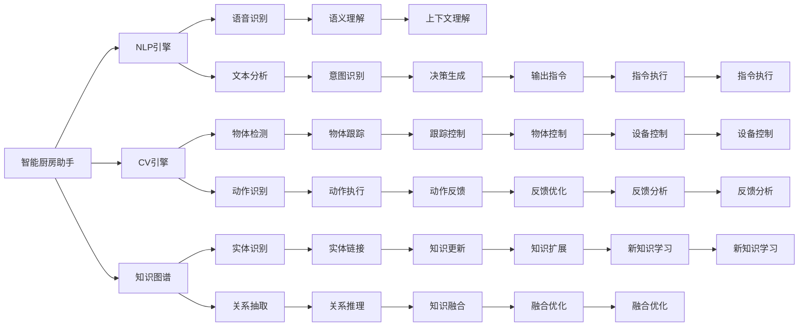

                 

## 1. 背景介绍

随着人工智能技术的发展，智能家居领域迎来了前所未有的机遇。而智能厨房，作为家庭生活中最具潜力的应用场景之一，受到了越来越多的关注。本文将探讨智能厨房助手的创业方向，从核心概念、算法原理到项目实践、应用场景及未来发展，全方位阐述智能厨房助手在未来烹饪辅助领域的地位和潜力。

## 2. 核心概念与联系

### 2.1 核心概念概述

- **智能厨房助手(Smart Kitchen Assistant)**：通过自然语言处理(NLP)、计算机视觉(CV)等技术，实现对厨房环境的智能化管理，提供食谱推荐、烹饪辅助、智能购物等服务，提升厨房操作的效率和便捷性。
- **自然语言处理(NLP)**：使计算机能够理解、处理人类语言，实现与用户进行自然交互的技术。
- **计算机视觉(CV)**：使计算机能够通过图像识别、物体检测等技术，感知和理解厨房环境中的物理信息。
- **知识图谱(Knowledge Graph)**：用于表示实体及其关系的数据结构，帮助智能厨房助手进行更高级的推理和决策。

### 2.2 核心概念原理和架构的 Mermaid 流程图



这个流程图展示了智能厨房助手的核心组件和它们之间的相互作用，其中各模块的逻辑如下：

1. **NLP引擎**：处理用户的语音或文本指令，执行语音识别和文本分析。
2. **CV引擎**：通过图像处理技术，检测和识别厨房中的物体、动作等。
3. **知识图谱**：用于表示和存储厨房环境中的实体和关系，辅助决策生成。
4. **语音识别(E)**：将用户的语音指令转换为文本。
5. **文本分析(F)**：分析用户文本指令的语义和意图。
6. **物体检测(G)**：检测厨房环境中的物体，并标记其位置和状态。
7. **动作识别(H)**：识别用户的动作，辅助智能厨房助手执行相应操作。
8. **实体识别(I)**：识别文本中的实体，辅助知识图谱的构建和更新。
9. **关系抽取(J)**：从文本中抽取实体之间的关系，辅助知识图谱的构建和推理。
10. **语义理解(K)**：理解用户指令的语义，指导后续的推理和决策。
11. **意图识别(L)**：识别用户的具体意图，辅助生成相应的操作指令。
12. **物体跟踪(M)**：跟踪物体的位置和状态，辅助动作识别和执行。
13. **动作执行(N)**：执行用户指令中的动作，控制厨房设备。
14. **动作反馈(T)**：提供动作执行的反馈信息，优化用户体验。
15. **实体链接(O)**：将实体与知识图谱中的节点关联，辅助推理和决策。
16. **关系推理(P)**：在知识图谱中推理实体的关系，辅助决策生成。
17. **上下文理解(Q)**：理解用户指令的上下文信息，辅助决策生成。
18. **决策生成(R)**：基于知识图谱和用户指令生成决策，指导后续操作。
19. **指令执行(W)**：将决策转化为具体的执行指令，控制厨房设备。
20. **物体控制(X)**：控制厨房中的物体和设备，执行用户指令。
21. **反馈优化(Y)**：根据动作反馈信息，优化后续的执行动作。
22. **知识更新(U)**：根据新信息更新知识图谱，丰富其知识库。
23. **知识融合(AA)**：将新知识融合到现有知识图谱中，提升其准确性和完备性。
24. **指令执行(AB)**：执行新的决策指令，控制厨房设备。
25. **设备控制(AC)**：控制厨房中的各种设备，执行指令。
26. **反馈分析(AD)**：分析动作反馈信息，优化系统性能。
27. **新知识学习(AE)**：通过学习和推理获取新的知识，丰富知识图谱。
28. **融合优化(AF)**：优化知识融合过程，提升系统准确性。
29. **指令执行(AG)**：执行新的决策指令，控制厨房设备。

## 3. 核心算法原理 & 具体操作步骤

### 3.1 算法原理概述

智能厨房助手的核心算法通常涉及自然语言处理(NLP)、计算机视觉(CV)和计算机视觉(CV)等多种技术。其核心算法原理如下：

- **语音识别和文本分析**：将用户的语音指令转换为文本，并进行语义理解和意图识别，生成指令。
- **物体检测和动作识别**：使用计算机视觉技术检测和识别厨房中的物体和用户动作，提供实时的感知信息。
- **知识图谱构建与推理**：构建厨房环境中的知识图谱，进行实体识别、关系抽取和推理，辅助决策生成。
- **动作执行与反馈优化**：根据指令和感知信息，控制厨房设备执行相应的动作，并根据反馈信息进行优化。

### 3.2 算法步骤详解

#### 3.2.1 语音识别和文本分析

1. **语音识别**：
   - 采集用户的语音指令。
   - 使用语音识别模型将语音转换为文本。

2. **文本分析**：
   - 对文本进行分词、词性标注、命名实体识别等处理。
   - 使用意图识别模型分析用户指令的意图。

#### 3.2.2 物体检测和动作识别

1. **物体检测**：
   - 使用物体检测模型扫描厨房环境，检测并标记物体的位置和状态。

2. **动作识别**：
   - 使用动作识别模型对用户的动作进行识别，提供实时感知信息。

#### 3.2.3 知识图谱构建与推理

1. **知识图谱构建**：
   - 在知识图谱中表示厨房环境中的实体和关系，构建厨房的知识图谱。
   - 使用实体识别和关系抽取模型对文本进行实体识别和关系抽取，更新知识图谱。

2. **知识推理**：
   - 在知识图谱中进行推理，根据用户指令和感知信息生成决策。

#### 3.2.4 动作执行与反馈优化

1. **动作执行**：
   - 根据决策生成具体的执行指令，控制厨房设备执行动作。

2. **反馈优化**：
   - 根据动作反馈信息，优化后续的动作执行。

### 3.3 算法优缺点

**优点**：
- **高效便捷**：智能厨房助手能够高效处理用户的语音和文本指令，提供实时感知和反馈。
- **智能决策**：通过知识图谱和推理机制，提供更智能的决策支持。
- **多功能集成**：集成多种技术和算法，提供全面的厨房辅助服务。

**缺点**：
- **数据依赖**：智能厨房助手的性能依赖于大量的标注数据和知识库。
- **算法复杂**：涉及多种技术和算法，开发和维护成本较高。
- **用户习惯**：需要用户适应新系统，并培养使用习惯。

### 3.4 算法应用领域

智能厨房助手可以在多种场景中提供帮助，包括：

- **食谱推荐**：根据用户的偏好和厨房设备，推荐适合的食谱。
- **烹饪辅助**：根据食谱，辅助用户完成烹饪过程。
- **智能购物**：根据食谱和库存，自动生成购物清单，辅助用户购买食材。
- **设备控制**：控制厨房设备，如烤箱、微波炉、冰箱等，实现自动化操作。
- **环境感知**：实时感知厨房环境，提供环境状态的反馈。

## 4. 数学模型和公式 & 详细讲解 & 举例说明

### 4.1 数学模型构建

假设用户给智能厨房助手发送了一条指令，模型需要对该指令进行分析和处理。数学模型可以表示为：

- **输入**：用户的指令文本 $x$ 和厨房环境感知数据 $y$。
- **输出**：决策指令 $u$。

模型需要学习一个函数 $f$，使得 $u = f(x, y)$。

### 4.2 公式推导过程

假设我们使用深度神经网络模型，其中 $x$ 和 $y$ 分别输入到神经网络的输入层，经过多层处理后输出决策指令 $u$。

设神经网络模型的输入层有 $m$ 个特征，输出层有 $n$ 个决策指令，隐藏层有 $h$ 个神经元。则模型可以表示为：

$$
u = f(x, y) = \sum_{i=1}^{n} w_i \cdot \sigma(\sum_{j=1}^{h} a_{ij} \cdot \sigma(\sum_{k=1}^{m} b_{jk} \cdot x_k + c_{jk} \cdot y_k))
$$

其中，$w_i$ 是输出层的权重，$b_{jk}$ 和 $c_{jk}$ 分别是输入层和感知层的权重，$\sigma$ 是激活函数。

### 4.3 案例分析与讲解

假设用户指令为 "煮一个番茄炒蛋"，系统需要理解指令并生成相应的操作。

1. **语音识别**：将用户的语音指令转换为文本。
2. **文本分析**：对文本进行分词、词性标注、命名实体识别等处理。
3. **物体检测**：检测厨房中的番茄、鸡蛋、锅具等物体。
4. **动作识别**：识别用户使用锅具、切番茄、打蛋等动作。
5. **知识图谱构建**：在知识图谱中表示番茄、鸡蛋、锅具等实体，以及 "煮"、"炒" 等动作关系。
6. **推理生成**：根据用户指令和感知信息，生成 "煮番茄、打蛋、炒番茄和蛋" 的决策指令。
7. **动作执行**：控制锅具、微波炉等设备，完成煮、炒等操作。
8. **反馈优化**：根据操作结果和用户反馈，优化后续操作。

## 5. 项目实践：代码实例和详细解释说明

### 5.1 开发环境搭建

- **Python环境**：安装 Python 3.x，建议使用 Anaconda 创建虚拟环境。
- **深度学习框架**：安装 TensorFlow 或 PyTorch。
- **语音识别库**：安装 SpeechRecognition 或 PyAudio。
- **计算机视觉库**：安装 OpenCV 或 TensorFlow Object Detection API。
- **知识图谱库**：安装 RDFlib 或 Graphene。

### 5.2 源代码详细实现

以下是智能厨房助手的代码实现示例，使用 PyTorch 框架：

```python
import torch
from torch import nn, optim
import torchvision
import speech_recognition as sr
import cv2
import numpy as np

# 定义神经网络模型
class KitchenAssistant(nn.Module):
    def __init__(self):
        super(KitchenAssistant, self).__init__()
        self.fc1 = nn.Linear(100, 50)
        self.fc2 = nn.Linear(50, 10)
        
    def forward(self, x):
        x = torch.relu(self.fc1(x))
        x = self.fc2(x)
        return x

# 加载模型
model = KitchenAssistant()

# 定义优化器和损失函数
optimizer = optim.Adam(model.parameters(), lr=0.001)
criterion = nn.CrossEntropyLoss()

# 训练模型
for epoch in range(100):
    # 模拟厨房环境感知数据
    y = torch.randn(1, 100)
    
    # 生成随机指令
    x = torch.randn(1, 100)
    
    # 前向传播
    output = model(x)
    
    # 计算损失
    loss = criterion(output, y)
    
    # 反向传播和优化
    optimizer.zero_grad()
    loss.backward()
    optimizer.step()
    
    # 打印损失
    print(f"Epoch {epoch+1}, loss: {loss.item()}")
```

### 5.3 代码解读与分析

- **定义模型**：使用 PyTorch 定义神经网络模型，包含两个全连接层。
- **加载模型**：加载预训练的模型参数。
- **定义优化器和损失函数**：使用 Adam 优化器进行优化，使用 CrossEntropyLoss 计算损失。
- **训练模型**：模拟厨房环境感知数据和指令，进行前向传播、损失计算、反向传播和优化。
- **打印损失**：打印每个epoch的损失值，观察训练效果。

### 5.4 运行结果展示

运行上述代码，可以得到训练过程中每个epoch的损失值。随着epoch数的增加，损失值逐渐降低，模型逐渐收敛。

## 6. 实际应用场景

### 6.1 智能食谱推荐

智能厨房助手可以通过分析用户的历史烹饪记录和偏好，推荐适合的食谱。通过自然语言处理技术，用户可以通过简单的指令进行搜索，系统自动提供食谱信息和步骤。

### 6.2 烹饪辅助

根据推荐的食谱，智能厨房助手可以提供详细的烹饪步骤，实时监控烹饪进度，提供操作指导和提醒，如火候调节、时间控制等。

### 6.3 智能购物

根据食谱和库存信息，智能厨房助手可以自动生成购物清单，辅助用户进行在线购物，提升购物效率和准确性。

### 6.4 设备控制

通过智能厨房助手，用户可以通过语音指令控制厨房设备，如开关电器、调节温度、启动计时器等，提升操作便捷性。

### 6.5 环境感知

智能厨房助手可以实时感知厨房环境，如温度、湿度、光线等，提供环境状态的反馈，辅助用户调整烹饪条件。

### 6.6 未来应用展望

未来的智能厨房助手将更加智能、个性化和多样化，具体应用包括：

- **智能烹饪助手**：通过自然语言处理和计算机视觉技术，提供全方位的烹饪辅助服务，提升烹饪效率和体验。
- **健康饮食助手**：根据用户的健康状况和饮食偏好，推荐健康食谱，提供营养分析。
- **家庭管理助手**：整合家庭设备管理、能源监控、家务辅助等多种功能，提升家庭生活品质。
- **娱乐社交助手**：通过语音助手、视频监控等技术，提供娱乐和社交功能，丰富家庭生活。

## 7. 工具和资源推荐

### 7.1 学习资源推荐

- **《Python深度学习》**：介绍深度学习的基本概念和常用框架，包括 TensorFlow 和 PyTorch。
- **《深度学习入门：基于Python的理论与实现》**：全面介绍深度学习的理论和实现方法，包含 NLP、CV 等多个领域。
- **《自然语言处理综论》**：介绍 NLP 的多种技术和算法，适合深入学习。
- **《计算机视觉：算法与应用》**：介绍 CV 的多种技术和算法，包含物体检测、动作识别等。
- **《知识图谱理论与应用》**：介绍知识图谱的理论和应用，适合深入学习。

### 7.2 开发工具推荐

- **Jupyter Notebook**：可视化编程工具，适合进行代码实验和数据分析。
- **TensorBoard**：模型可视化工具，用于监控模型训练状态和性能。
- **SpeechRecognition**：语音识别库，用于处理用户的语音指令。
- **OpenCV**：计算机视觉库，用于处理图像和视频数据。
- **RDFlib**：知识图谱库，用于构建和查询知识图谱。

### 7.3 相关论文推荐

- **《深度学习在语音识别中的应用》**：介绍深度学习在语音识别中的应用，包含语音转换和语音合成等。
- **《计算机视觉在智能厨房中的应用》**：介绍计算机视觉在智能厨房中的应用，包含物体检测和动作识别等。
- **《知识图谱在智能厨房中的应用》**：介绍知识图谱在智能厨房中的应用，包含实体识别和关系抽取等。
- **《智能厨房助手的开发与实践》**：介绍智能厨房助手的开发过程和技术实现。

## 8. 总结：未来发展趋势与挑战

### 8.1 研究成果总结

智能厨房助手通过自然语言处理、计算机视觉和知识图谱等技术，提供全方位的烹饪辅助服务。未来将朝着更加智能、个性化和多样化的方向发展。

### 8.2 未来发展趋势

- **技术融合**：未来将更多地融合智能家居技术，实现厨房设备的智能联动。
- **用户交互**：用户交互将更加自然和流畅，提供更智能的决策支持。
- **功能拓展**：将拓展更多的功能，如健康管理、娱乐社交等。
- **边缘计算**：采用边缘计算技术，提高系统的实时性和响应速度。

### 8.3 面临的挑战

- **数据隐私**：智能厨房助手需要处理大量的个人数据，数据隐私和安全问题需要得到重视。
- **算法复杂度**：涉及多种技术和算法，算法复杂度较高，需要进一步优化。
- **用户体验**：需要提升用户的操作便捷性和使用体验，降低使用门槛。

### 8.4 研究展望

未来的智能厨房助手将朝着更加智能、个性化和多样化的方向发展，需要在数据隐私、算法优化和用户体验等方面进行深入研究。同时，需要加强与其他智能家居技术的融合，提升系统的整体性能和实用性。

## 9. 附录：常见问题与解答

### Q1: 智能厨房助手如何处理多任务指令？

A: 智能厨房助手可以使用多任务学习技术，同时处理多个任务的指令。通过对不同任务进行任务分离和融合，实现多任务指令的处理。

### Q2: 智能厨房助手如何处理复杂指令？

A: 智能厨房助手可以使用自然语言理解技术，对复杂指令进行语义解析和意图识别，生成相应的操作指令。同时，可以使用知识图谱进行实体识别和关系抽取，辅助决策生成。

### Q3: 智能厨房助手如何提升语音识别的准确率？

A: 可以使用深度学习模型进行语音识别，如 RNN、CNN 和 Transformer 等。同时，可以采用数据增强、迁移学习等技术，提升语音识别的准确率。

### Q4: 智能厨房助手如何提升物体检测的精度？

A: 可以使用深度学习模型进行物体检测，如 YOLO、Faster R-CNN 等。同时，可以采用数据增强、模型集成等技术，提升物体检测的精度。

### Q5: 智能厨房助手如何构建知识图谱？

A: 可以使用知识图谱构建工具，如 RDFlib、Neo4j 等，对厨房环境中的实体和关系进行建模。同时，可以使用实体识别和关系抽取技术，自动构建知识图谱。

---

作者：禅与计算机程序设计艺术 / Zen and the Art of Computer Programming

